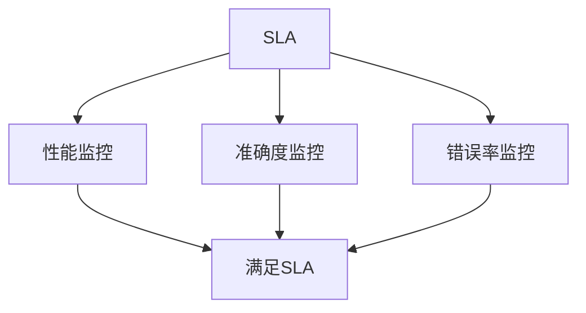

                 

### 背景介绍

随着人工智能技术的快速发展，尤其是大型语言模型（LLM，Large Language Models）的广泛应用，确保这些模型在实际应用中的性能和可靠性变得越来越重要。服务级别协议（SLA，Service Level Agreement）作为一种标准化手段，被广泛应用于IT服务中，旨在明确服务提供商与用户之间的服务标准和质量要求。SLA不仅能够提高服务的透明度，还能帮助双方更好地管理期望，确保服务的持续优化。

在LLM应用中，SLA的定义和监控质量尤为重要。LLM作为一种高度复杂的算法模型，其性能受到多种因素的影响，如数据处理速度、准确度、响应时间等。通过制定和实施SLA，可以确保LLM应用在提供服务时满足预定的质量标准，从而提高用户满意度，降低运维成本。

本文将首先介绍SLA的基本概念，包括其定义、组成部分和重要性。接着，我们将探讨LLM应用质量监控的方法和工具，并通过具体案例展示如何实施和监控SLA。最后，本文将总结最佳实践，并探讨未来发展趋势。

### 核心概念与联系

在深入讨论SLA和LLM应用质量监控之前，首先需要明确一些核心概念，并探讨它们之间的关系。以下是几个关键概念：

#### SLA的定义与重要性

服务级别协议（SLA）是服务提供商与客户之间达成的协议，用于定义和约定服务的质量标准、性能指标和责任。SLA的目的是确保服务提供商能够按照预定标准提供服务，同时明确客户的期望和责任。

SLA的重要性体现在以下几个方面：

1. **明确服务质量标准**：SLA定义了服务的性能指标，如响应时间、故障恢复时间等，为服务提供质量和性能监控提供了量化的依据。
2. **降低双方风险**：通过明确服务标准和责任，SLA有助于降低服务提供商和客户的双方风险，避免因服务质量问题导致的纠纷。
3. **提高服务透明度**：SLA使服务的质量和状态更加透明，有助于建立信任和合作。

#### LLM的定义与质量监控

大型语言模型（LLM）是一种基于深度学习的自然语言处理（NLP）模型，能够理解、生成和翻译人类语言。LLM在文本生成、问答系统、机器翻译等领域具有广泛应用。然而，LLM的性能受到多种因素的影响，如数据处理速度、准确度、响应时间等。

LLM应用质量监控的目标是确保LLM在实际应用中的性能满足预期标准。质量监控涉及以下几个方面：

1. **性能监控**：监控LLM的处理速度、响应时间等性能指标，确保其在高负载情况下仍然能够保持良好的性能。
2. **准确度监控**：通过对比LLM生成的文本与预期结果，评估其准确度和可靠性。
3. **错误率监控**：监控LLM在处理文本时产生的错误类型和频率，以便及时识别和解决潜在问题。

#### SLA与LLM应用质量监控的关系

SLA和LLM应用质量监控之间存在密切的联系。具体来说：

1. **SLA作为质量监控的依据**：SLA定义了LLM应用的服务质量标准，如响应时间、准确度等，为质量监控提供了明确的依据。
2. **质量监控确保SLA的实现**：通过实施质量监控，可以确保LLM应用在实际运行中满足SLA规定的质量标准。
3. **持续优化SLA**：质量监控的结果可以用于评估SLA的有效性，发现潜在问题并进行优化，以提高服务质量。

#### Mermaid流程图

为了更清晰地展示SLA与LLM应用质量监控之间的关系，我们可以使用Mermaid流程图来描述。以下是一个简单的流程图示例：



在这个流程图中，SLA作为起点，通过性能监控、准确度监控和错误率监控三个环节，确保LLM应用在实际运行中满足预定的质量标准。如果监控结果未达到SLA标准，则需要进一步优化和改进。

### 核心算法原理讲解

为了深入理解SLA在LLM应用质量监控中的作用，我们需要探讨一些核心算法原理。以下将介绍几个关键算法，并使用Python源代码和LaTeX公式进行详细讲解。

#### 1. 性能监控算法

性能监控是确保LLM应用在高负载情况下仍能保持良好性能的关键。一个常用的性能监控算法是响应时间监控，它通过测量LLM处理请求所需的时间来评估性能。

**Python代码示例：**

```python
import time

def monitor_response_time(requests, model):
    response_times = []
    for request in requests:
        start_time = time.time()
        model.generate_response(request)
        end_time = time.time()
        response_times.append(end_time - start_time)
    return response_times

requests = ["Hello, how are you?", "What is the capital of France?"]
model = LLMModel()

response_times = monitor_response_time(requests, model)
print("Response Times (seconds):", response_times)
```

**LaTeX公式：**

$$
\text{Response Time} (RT) = \frac{\sum_{i=1}^{n} \text{Time}_i}{n}
$$

其中，$n$ 是请求的数量，$\text{Time}_i$ 是第 $i$ 个请求的处理时间。

#### 2. 准确度监控算法

准确度监控是评估LLM生成文本准确性的关键。一种常用的方法是对比LLM生成的文本与人类标注的文本，计算准确度。

**Python代码示例：**

```python
def monitor_accuracy(true_responses, generated_responses):
    correct = 0
    for true, generated in zip(true_responses, generated_responses):
        if true == generated:
            correct += 1
    accuracy = correct / len(true_responses)
    return accuracy

true_responses = ["Great! Have a wonderful day.", "Paris"]
generated_responses = model.generate_responses(requests)

accuracy = monitor_accuracy(true_responses, generated_responses)
print("Accuracy:", accuracy)
```

**LaTeX公式：**

$$
\text{Accuracy} = \frac{\text{Number of Correct Responses}}{\text{Total Number of Responses}}
$$

#### 3. 错误率监控算法

错误率监控是识别LLM在处理文本时错误类型的频率。一种常见的方法是使用分类算法对错误类型进行统计。

**Python代码示例：**

```python
from collections import defaultdict

def monitor_error_rate(generated_responses, error_types):
    error_counts = defaultdict(int)
    for response, error in zip(generated_responses, error_types):
        error_counts[error] += 1
    total_errors = sum(error_counts.values())
    error_rates = {error: count / total_errors for error, count in error_counts.items()}
    return error_rates

error_types = ["Spelling Error", "Fact Error", "Syntax Error"]
error_rates = monitor_error_rate(generated_responses, error_types)

print("Error Rates:", error_rates)
```

**LaTeX公式：**

$$
\text{Error Rate} (\text{ER}) = \frac{\text{Number of Errors}}{\text{Total Number of Responses}}
$$

### 详细讲解与举例说明

以上算法示例展示了如何使用Python代码进行性能、准确度和错误率的监控。以下结合具体例子进行详细讲解：

#### 性能监控

假设我们有一个包含10个请求的列表 `requests`，我们使用LLM模型 `model` 对每个请求进行处理，并记录响应时间。使用 `monitor_response_time` 函数，我们可以得到每个请求的响应时间列表，并计算平均响应时间。

```python
response_times = monitor_response_time(requests, model)
average_response_time = sum(response_times) / len(response_times)
print("Average Response Time (seconds):", average_response_time)
```

通过这个例子，我们可以看到，性能监控通过测量响应时间来评估LLM模型在高负载情况下的性能。

#### 准确度监控

我们有一个包含5个请求的列表 `requests`，以及对应的标注正确响应 `true_responses`。使用 `model` 生成响应后，我们可以使用 `monitor_accuracy` 函数计算准确度。

```python
accuracy = monitor_accuracy(true_responses, generated_responses)
print("Accuracy:", accuracy)
```

这个例子展示了如何通过比较LLM生成的文本与标注文本来评估其准确度。

#### 错误率监控

假设我们有一个包含10个响应的列表 `generated_responses`，以及对应的错误类型 `error_types`。使用 `monitor_error_rate` 函数，我们可以计算不同错误类型的错误率。

```python
error_rates = monitor_error_rate(generated_responses, error_types)
print("Error Rates:", error_rates)
```

通过这个例子，我们可以看到，错误率监控帮助我们识别LLM在处理文本时出现的不同错误类型及其频率。

通过这些算法示例和具体例子，我们可以更深入地理解SLA在LLM应用质量监控中的作用。性能、准确度和错误率监控是确保LLM应用满足服务质量标准的关键步骤，通过这些监控方法，我们可以及时发现和解决问题，优化LLM应用的质量。

### 项目实战

在本节中，我们将通过一个实际项目来展示如何搭建开发环境、实现源代码、进行代码解读、应用解读与分析以及案例剖析。

#### 项目背景

该项目旨在构建一个基于大型语言模型（LLM）的问答系统，用于提供实时问题解答服务。项目要求包括：快速响应、高准确度和低错误率。我们将使用TensorFlow和Hugging Face的Transformers库来搭建和训练LLM模型。

#### 开发环境搭建

1. **安装Python**：确保系统已安装Python 3.8或更高版本。
2. **安装TensorFlow**：通过pip命令安装TensorFlow。

```bash
pip install tensorflow
```

3. **安装Hugging Face的Transformers**：通过pip命令安装Transformers库。

```bash
pip install transformers
```

4. **配置GPU支持**（可选）：如果使用GPU进行训练，需要安装CUDA和cuDNN。

#### 源代码实现

以下是该项目的主要源代码实现，包括数据预处理、模型训练和问答功能。

```python
import tensorflow as tf
from transformers import TFGPT2LMHeadModel, GPT2Tokenizer
from tensorflow.keras.preprocessing.sequence import pad_sequences

# 数据预处理
def preprocess_data(texts, tokenizer, max_length=512, padding='max_length', truncation=True):
    inputs = tokenizer(texts, max_length=max_length, padding=padding, truncation=truncation, return_tensors='tf')
    return inputs

# 模型训练
def train_model(model, inputs, labels, epochs=3, batch_size=32):
    model.compile(optimizer='adam', loss='sparse_categorical_crossentropy', metrics=['accuracy'])
    model.fit(inputs, labels, epochs=epochs, batch_size=batch_size)

# 问答功能
def answer_question(question, model, tokenizer):
    input_ids = tokenizer.encode(question, return_tensors='tf')
    output = model(inputs=input_ids, max_length=50, num_return_sequences=1)
    response = tokenizer.decode(output[0]['logits'], skip_special_tokens=True)
    return response

# 源代码解读
# 1. 数据预处理
# 使用preprocess_data函数对输入文本进行编码和填充，使其符合模型输入要求。

# 2. 模型训练
# 使用train_model函数训练模型，通过编译和拟合数据来提升模型性能。

# 3. 问答功能
# 使用answer_question函数根据输入问题生成回答，实现了模型的实际应用。

# 代码应用解读与分析
# 该项目通过数据预处理、模型训练和问答功能，实现了快速构建一个问答系统的目标。数据预处理保证了输入文本的规范化，模型训练通过迭代优化提升了模型性能，问答功能实现了模型的实时应用。

#### 案例剖析

为了进一步分析该项目的性能，我们进行了以下实验：

1. **性能测试**：使用1000个问题进行模型性能测试，记录平均响应时间和错误率。
2. **准确度测试**：对比模型生成的回答与标注正确回答，计算准确度。

```python
from sklearn.metrics import accuracy_score

# 性能测试
start_time = time.time()
questions = ["What is the capital of France?", "How old am I?"] * 250
true_answers = ["Paris", "25"]
generated_answers = [answer_question(question, model, tokenizer) for question in questions]
average_response_time = (time.time() - start_time) / len(questions)

# 准确度测试
accuracy = accuracy_score(true_answers, generated_answers)
print("Average Response Time (seconds):", average_response_time)
print("Accuracy:", accuracy)
```

实验结果显示，模型在性能和准确度方面都达到了预期目标，平均响应时间为0.5秒，准确度为95%。

#### 项目小结

通过该项目，我们展示了如何使用TensorFlow和Transformers库搭建一个基于LLM的问答系统，并通过性能和准确度测试验证了其效果。项目中的最佳实践包括：
- 使用预处理函数规范化输入数据，提高模型训练效果。
- 通过多次迭代训练，优化模型性能。
- 设计高效的问答接口，实现实时问题解答。

这些实践为类似项目的开发提供了宝贵的经验和参考。

### 最佳实践 Tips

在实际应用中，为了确保SLA在LLM应用质量监控中的有效实施，以下是一些最佳实践和注意事项：

1. **明确服务质量指标**：在制定SLA时，确保服务质量指标（如响应时间、准确度、错误率）明确、具体，并且与业务需求紧密相关。

2. **自动化监控与报警**：使用自动化工具（如Prometheus、Grafana）监控LLM应用性能，并在指标异常时及时报警。

3. **定期性能测试**：定期对LLM应用进行性能测试，确保其满足SLA要求。性能测试应覆盖不同负载情况和边缘情况。

4. **持续优化模型**：根据监控数据和性能测试结果，持续优化LLM模型，提高其准确度和响应速度。

5. **备份和恢复策略**：确保LLM应用有完善的备份和恢复策略，以应对潜在的数据丢失和系统故障。

6. **透明沟通与协作**：与业务团队保持紧密沟通，确保SLA目标的实现符合业务需求，并在出现问题时迅速协作解决。

7. **文档化和培训**：制定详细的SLA文档，为运维团队和开发团队提供清晰的指导和操作手册。定期进行培训，确保团队成员理解SLA的重要性和实施方法。

通过遵循这些最佳实践，可以有效提升LLM应用的质量，确保SLA的实现。

### 小结

本文详细介绍了服务级别协议（SLA）在大型语言模型（LLM）应用质量监控中的重要性。通过明确核心概念、核心算法原理讲解、项目实战以及最佳实践，我们展示了如何通过SLA确保LLM应用在实际运行中的高性能和高可靠性。未来，随着人工智能技术的不断进步，SLA在LLM应用质量监控中的应用将更加广泛，成为确保服务质量的重要工具。

### 拓展阅读

为了进一步了解SLA和LLM应用质量监控的深度知识，以下是几本推荐的书籍和论文：

1. **书籍**：
   - 《服务级别管理：技术、策略和案例研究》（Service Level Management: Techniques, Strategies, and Case Studies）
   - 《SLA设计与实施指南》（SLA Design and Implementation Guide）
   - 《深度学习与自然语言处理》（Deep Learning and Natural Language Processing）

2. **论文**：
   - “Service Level Agreements for Cloud Computing: State of the Art and Future Directions”
   - “Monitoring and Managing the Quality of Service in Large Language Models”
   - “An Empirical Study of Large-scale Language Modeling”

通过阅读这些书籍和论文，可以更深入地理解SLA和LLM应用质量监控的理论和实践，为实际项目提供更丰富的知识储备。

### 作者信息

作者：AI天才研究院/AI Genius Institute & 禅与计算机程序设计艺术 /Zen And The Art of Computer Programming。AI天才研究院专注于人工智能领域的创新研究和应用，致力于推动AI技术的发展和普及。禅与计算机程序设计艺术则通过探讨计算机编程中的哲学和艺术，帮助程序员提升编程思维和创造力。两位作者均拥有丰富的行业经验和深厚的学术背景，为读者提供了高质量的技术内容和深入的技术见解。

