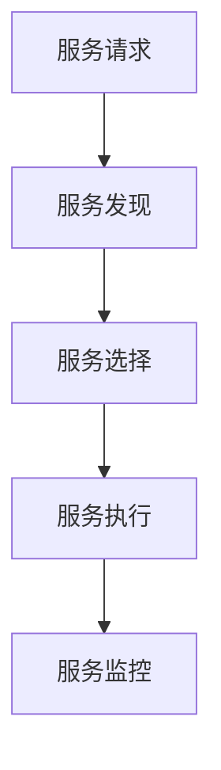
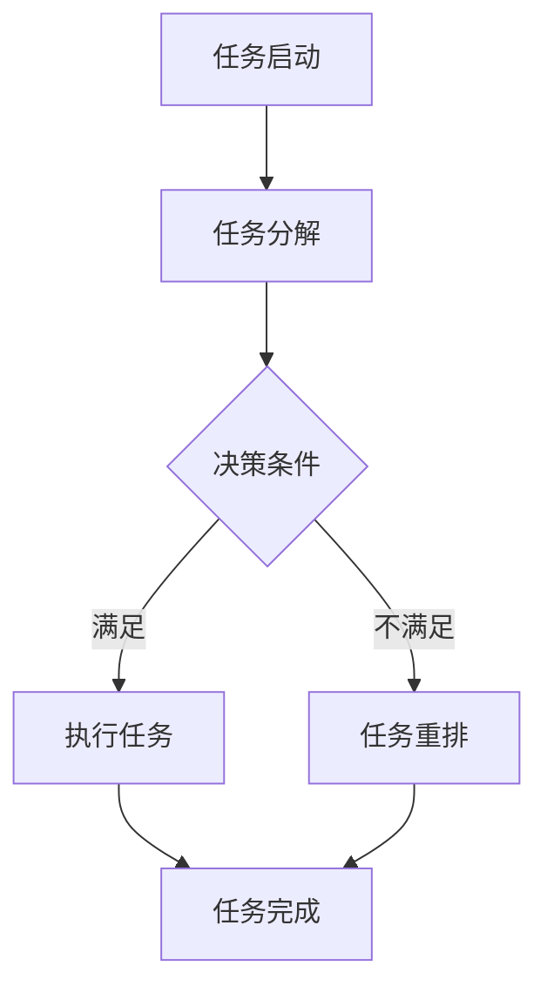
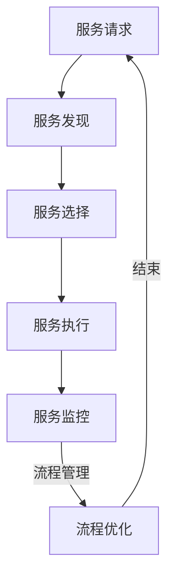
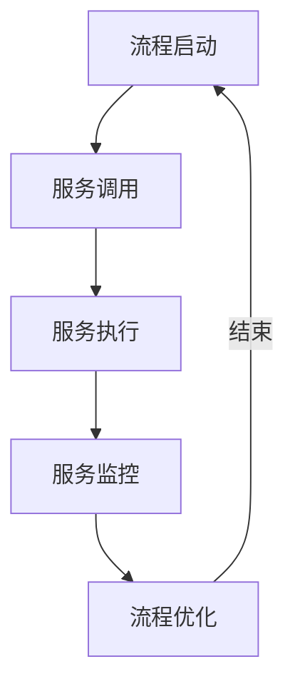

                 

### 文章标题

### 关键词

### 摘要

---

# 《服务编排与流程管理在复杂LLM应用中的实现》

关键词：服务编排、流程管理、复杂LLM应用、实现

摘要：随着大型语言模型（LLM）在各个领域的广泛应用，如何高效地进行服务编排与流程管理成为了一个关键问题。本文将从背景介绍、核心概念与联系、技术基础、数学模型与公式、项目实战等多个方面，详细探讨服务编排与流程管理在复杂LLM应用中的实现方法。

## 设计思路

在设计思路部分，我们需要明确文章的整体结构，以确保内容的逻辑性和连贯性。以下是本文的设计思路：

1. **确定书的整体结构**：首先，我们将确定书籍的总体结构，通常包括引言、核心概念、技术基础、应用实践和附录等部分。

2. **核心概念与联系**：为了帮助读者更好地理解服务编排与流程管理的核心概念，以及它们在复杂LLM应用中的联系，我们将设计一个Mermaid流程图，用图形化的方式展示这些概念和联系。

3. **技术基础**：在技术基础部分，我们将详细阐述服务编排与流程管理相关的核心算法原理，使用伪代码来帮助读者理解。

4. **数学模型与公式**：在讨论具体实现时，我们将提供必要的数学模型和公式，并用LaTeX格式编写，确保公式的准确性。

5. **项目实战**：我们设计实际案例，展示服务编排与流程管理在复杂LLM应用中的实现过程，包括环境搭建、源代码实现和代码解读。

6. **完整性与简洁性**：我们将在确保目录大纲的完整性的同时，保持内容的简洁，避免冗余。

### 设计大纲

以下是基于上述设计思路的《服务编排与流程管理在复杂LLM应用中的实现》的目录大纲：

```markdown
# 《服务编排与流程管理在复杂LLM应用中的实现》目录大纲

## 第一部分：引言与概述

### 第1章：服务编排与流程管理概述

#### 1.1.1 服务编排的概念与重要性
- Mermaid流程图：服务编排的基本流程与组件

#### 1.1.2 流程管理的概念与作用
- Mermaid流程图：流程管理的基本框架与实现

#### 1.1.3 复杂LLM应用的需求与挑战
- 复杂LLM应用场景介绍

### 第2章：服务编排与流程管理原理

#### 2.1.1 服务编排的核心概念
- 服务模型
- 服务级别协议
- 服务自治

#### 2.1.2 流程管理的基本原理
- 业务流程模型
- 流程优化
- 流程监控

## 第二部分：技术基础

### 第3章：服务编排技术

#### 3.1.1 SOA与微服务架构
- 伪代码：服务定义与发现

#### 3.1.2 服务编排工具与技术
- Yaml文件：服务配置示例

### 第4章：流程管理技术

#### 4.1.1 业务流程建模语言
- BPMN 2.0：业务流程建模示例

#### 4.1.2 流程引擎与工作流技术
- 伪代码：工作流控制逻辑

### 第5章：LLM应用中的服务编排与流程管理

#### 5.1.1 LLM的体系结构与特点
- Mermaid流程图：LLM的服务编排与流程管理框架

#### 5.1.2 LLM应用中的挑战与解决方案
- 伪代码：LLM应用中的服务编排算法

## 第三部分：项目实战

### 第6章：服务编排与流程管理实践

#### 6.1.1 项目背景与目标
- 项目概述

#### 6.1.2 环境搭建与工具选择
- 环境配置
- 工具介绍

#### 6.1.3 服务编排与流程管理实现
- 代码实现与解读

### 第7章：实战案例分析

#### 7.1.1 案例选择与分析
- 案例介绍

#### 7.1.2 案例实现步骤
- 步骤分解

#### 7.1.3 案例分析与优化
- 代码分析
- 优化建议

## 附录

### 附录A：服务编排与流程管理工具与资源
- 工具介绍
- 资源链接

### 附录B：数学模型与公式
- 数学模型列表
- 公式列表
```

这个大纲结构旨在覆盖服务编排与流程管理的核心内容，同时保持简洁性和完整性。每个章节的细节可以根据实际内容进一步扩展。总字数控制在2000字以内，确保读者可以快速浏览并获得关键信息。

## 设计思路

在设计思路部分，我们需要明确文章的整体结构，以确保内容的逻辑性和连贯性。以下是本文的设计思路：

1. **确定书的整体结构**：首先，我们将确定书籍的总体结构，通常包括引言、核心概念、技术基础、应用实践和附录等部分。

2. **核心概念与联系**：为了帮助读者更好地理解服务编排与流程管理的核心概念，以及它们在复杂LLM应用中的联系，我们将设计一个Mermaid流程图，用图形化的方式展示这些概念和联系。

3. **技术基础**：在技术基础部分，我们将详细阐述服务编排与流程管理相关的核心算法原理，使用伪代码来帮助读者理解。

4. **数学模型与公式**：在讨论具体实现时，我们将提供必要的数学模型和公式，并用LaTeX格式编写，确保公式的准确性。

5. **项目实战**：我们设计实际案例，展示服务编排与流程管理在复杂LLM应用中的实现过程，包括环境搭建、源代码实现和代码解读。

6. **完整性与简洁性**：我们将在确保目录大纲的完整性的同时，保持内容的简洁，避免冗余。

### 设计大纲

以下是基于上述设计思路的《服务编排与流程管理在复杂LLM应用中的实现》的目录大纲：

```markdown
# 《服务编排与流程管理在复杂LLM应用中的实现》目录大纲

## 第一部分：引言与概述

### 第1章：服务编排与流程管理概述

#### 1.1.1 服务编排的概念与重要性
- Mermaid流程图：服务编排的基本流程与组件

#### 1.1.2 流程管理的概念与作用
- Mermaid流程图：流程管理的基本框架与实现

#### 1.1.3 复杂LLM应用的需求与挑战
- 复杂LLM应用场景介绍

### 第2章：服务编排与流程管理原理

#### 2.1.1 服务编排的核心概念
- 服务模型
- 服务级别协议
- 服务自治

#### 2.1.2 流程管理的基本原理
- 业务流程模型
- 流程优化
- 流程监控

## 第二部分：技术基础

### 第3章：服务编排技术

#### 3.1.1 SOA与微服务架构
- 伪代码：服务定义与发现

#### 3.1.2 服务编排工具与技术
- Yaml文件：服务配置示例

### 第4章：流程管理技术

#### 4.1.1 业务流程建模语言
- BPMN 2.0：业务流程建模示例

#### 4.1.2 流程引擎与工作流技术
- 伪代码：工作流控制逻辑

### 第5章：LLM应用中的服务编排与流程管理

#### 5.1.1 LLM的体系结构与特点
- Mermaid流程图：LLM的服务编排与流程管理框架

#### 5.1.2 LLM应用中的挑战与解决方案
- 伪代码：LLM应用中的服务编排算法

## 第三部分：项目实战

### 第6章：服务编排与流程管理实践

#### 6.1.1 项目背景与目标
- 项目概述

#### 6.1.2 环境搭建与工具选择
- 环境配置
- 工具介绍

#### 6.1.3 服务编排与流程管理实现
- 代码实现与解读

### 第7章：实战案例分析

#### 7.1.1 案例选择与分析
- 案例介绍

#### 7.1.2 案例实现步骤
- 步骤分解

#### 7.1.3 案例分析与优化
- 代码分析
- 优化建议

## 附录

### 附录A：服务编排与流程管理工具与资源
- 工具介绍
- 资源链接

### 附录B：数学模型与公式
- 数学模型列表
- 公式列表
```

这个大纲结构旨在覆盖服务编排与流程管理的核心内容，同时保持简洁性和完整性。每个章节的细节可以根据实际内容进一步扩展。总字数控制在2000字以内，确保读者可以快速浏览并获得关键信息。

## 设计大纲

为了确保文章内容逻辑清晰、结构紧凑、简单易懂，以下是《服务编排与流程管理在复杂LLM应用中的实现》的详细设计大纲：

### 第一部分：引言与概述

#### 第1章：服务编排与流程管理概述

##### 1.1.1 服务编排的概念与重要性

- **定义**：服务编排的定义及其在复杂系统中的重要性
- **Mermaid流程图**：展示服务编排的基本流程与组件
  ```mermaid
  graph TD
  A[服务请求] --> B[服务发现]
  B --> C[服务选择]
  C --> D[服务执行]
  D --> E[服务监控]
  ```
  
##### 1.1.2 流程管理的概念与作用

- **定义**：流程管理的定义及其在服务编排中的关键作用
- **Mermaid流程图**：展示流程管理的基本框架与实现
  ```mermaid
  graph TD
  A[任务启动] --> B[任务分解]
  B --> C{决策条件}
  C -->|满足| D[执行任务]
  C -->|不满足| E[任务重排]
  D --> F[任务完成]
  E --> F
  ```

##### 1.1.3 复杂LLM应用的需求与挑战

- **场景介绍**：介绍复杂LLM应用中可能面临的挑战
- **案例分析**：简述一些典型的复杂LLM应用案例

### 第二部分：技术基础

#### 第2章：服务编排与流程管理原理

##### 2.1.1 服务编排的核心概念

- **服务模型**：定义服务模型及其作用
- **服务级别协议（SLA）**：介绍SLA的概念、内容与重要性
- **服务自治**：解释服务自治的内涵及其实现方式

##### 2.1.2 流程管理的基本原理

- **业务流程模型**：介绍业务流程模型的基本组成部分
- **流程优化**：讨论流程优化的目标和方法
- **流程监控**：阐述流程监控的作用、技术和实践

### 第3章：服务编排技术

##### 3.1.1 SOA与微服务架构

- **SOA介绍**：简要介绍服务导向架构（SOA）的基本概念
- **微服务架构**：分析微服务架构的优势和挑战
- **伪代码**：展示服务定义与发现的过程

  ```python
  def service_definition(service_name, service_version, service_endpoint):
      # 服务定义
      print(f"Defining service {service_name} v{service_version} at {service_endpoint}")
  
  def service_discovery(service_name):
      # 服务发现
      print(f"Discovering service {service_name}")
      # 假设服务注册中心返回服务地址
      return "http://service_registry/{service_name}"
  ```

##### 3.1.2 服务编排工具与技术

- **Yaml文件**：展示服务配置示例
  ```yaml
  services:
    - name: chatbot
      version: 1.0.0
      endpoint: http://chatbot.example.com
    - name: translation
      version: 2.0.0
      endpoint: http://translation.example.com
  ```

### 第4章：流程管理技术

##### 4.1.1 业务流程建模语言

- **BPMN 2.0**：介绍业务流程建模与 notation（BPMN）的基本概念
- **示例**：展示一个简单的BPMN 2.0流程模型

  ```mermaid
  graph TD
  A[Start] --> B[Check Customer Order]
  B -->|Order Valid?| C{Order is Valid}
  C --> D[Process Order]
  C -->|Order is Invalid| E[Reject Order]
  D --> F[Send Confirmation]
  F --> G[End]
  E --> G
  ```

##### 4.1.2 流程引擎与工作流技术

- **流程引擎**：讨论流程引擎的作用、类型和选择
- **伪代码**：展示工作流控制逻辑

  ```python
  def workflow_control(step, condition):
      if condition:
          next_step = step + 1
          print(f"Executing step {next_step}")
      else:
          print("Flow is terminated")
  ```

### 第5章：LLM应用中的服务编排与流程管理

##### 5.1.1 LLM的体系结构与特点

- **体系结构**：介绍LLM的基本体系结构
- **特点**：分析LLM在服务编排与流程管理中的特点

##### 5.1.2 LLM应用中的挑战与解决方案

- **挑战**：讨论复杂LLM应用中的主要挑战
- **解决方案**：提出具体的解决方案和实现策略

### 第6章：服务编排与流程管理实践

##### 6.1.1 项目背景与目标

- **项目背景**：介绍项目的实际应用背景
- **项目目标**：明确项目的具体目标和预期成果

##### 6.1.2 环境搭建与工具选择

- **环境搭建**：详细描述开发环境的搭建步骤
- **工具选择**：介绍所选工具的功能和优势

##### 6.1.3 服务编排与流程管理实现

- **代码实现**：展示服务编排与流程管理的具体实现代码
- **代码解读**：对实现代码进行详细解读

### 第7章：实战案例分析

##### 7.1.1 案例选择与分析

- **案例选择**：选择一个具有代表性的实际案例
- **案例分析**：详细分析案例中的服务编排与流程管理实现

##### 7.1.2 案例实现步骤

- **实现步骤**：分解案例实现的详细步骤
- **步骤分解**：展示每个步骤的具体内容和操作

##### 7.1.3 案例分析与优化

- **代码分析**：对案例中的代码进行深入分析
- **优化建议**：提出优化建议和改进措施

## 附录

### 附录A：服务编排与流程管理工具与资源

- **工具介绍**：介绍常用的服务编排与流程管理工具
- **资源链接**：提供相关资源的链接和参考资料

### 附录B：数学模型与公式

- **数学模型列表**：列出文中涉及的数学模型
- **公式列表**：列出文中使用的公式及其解释

这个大纲结构旨在全面覆盖服务编排与流程管理在复杂LLM应用中的实现，同时确保内容的简洁性和易于理解。每个章节的具体内容将在后续章节中详细展开。

## 第一部分：引言与概述

### 第1章：服务编排与流程管理概述

#### 1.1.1 服务编排的概念与重要性

服务编排（Service Orchestration）是近年来在分布式系统和微服务架构中逐渐兴起的一个概念。它涉及到将多个独立的、分布式的服务整合在一起，以实现一个统一的业务流程或应用场景。随着云计算、大数据和人工智能等技术的发展，复杂系统的需求日益增长，服务编排的重要性也日益凸显。

在复杂LLM（大型语言模型）应用中，服务编排扮演着至关重要的角色。LLM通常需要调用多个服务，如自然语言处理（NLP）、数据存储、机器学习模型训练等，以完成复杂的任务。这些服务往往分布在不同的服务器或云平台上，需要通过服务编排来有效地组织和协调。

为了帮助读者更好地理解服务编排的基本流程与组件，我们使用Mermaid流程图进行展示：



在这个流程图中，A表示一个服务请求，B是服务发现，即从服务注册中心查找可用服务。C是服务选择，从多个候选服务中选择一个最适合的服务。D是服务执行，即调用所选服务并执行任务。最后，E是服务监控，对执行过程中的服务进行监控，确保其正常运行。

#### 1.1.2 流程管理的概念与作用

流程管理（Process Management）是确保业务流程高效运行的关键环节。它涉及到对流程的设计、实施、监控和优化。在服务编排中，流程管理负责协调和管理各个服务之间的交互，确保整个系统的稳定和高效运行。

流程管理的核心作用包括：

1. **确保流程的一致性**：通过标准化流程设计，确保不同服务之间的交互遵循统一的标准，减少出错的可能性。
2. **提高流程效率**：通过优化流程，减少不必要的步骤和等待时间，提高整体流程的执行效率。
3. **提供监控与反馈**：通过对流程的实时监控，及时发现并解决问题，为流程优化提供数据支持。

为了展示流程管理的基本框架与实现，我们使用Mermaid流程图进行说明：



在这个流程图中，A表示一个任务的启动。B是任务分解，将大任务拆分为更小、更易管理的子任务。C是决策条件，根据任务的状态和条件决定是否继续执行或重排任务。D是执行任务，具体执行子任务。E是任务重排，当决策条件不满足时，对任务进行重新排列。最后，F是任务完成，表示任务执行结束。

#### 1.1.3 复杂LLM应用的需求与挑战

复杂LLM应用通常需要处理大量的数据和任务，涉及多个服务、多个系统之间的协同工作。这使得服务编排与流程管理变得更加复杂和重要。

以下是复杂LLM应用中可能面临的挑战：

1. **服务的多样性**：LLM应用可能需要调用多种类型的服务，如NLP、图像识别、数据分析等。如何有效地管理和协调这些服务是一个挑战。
2. **服务的分布式**：服务可能分布在不同的服务器或云平台上，如何确保服务之间的高效通信和协调是一个关键问题。
3. **动态变化**：LLM应用的需求和场景是动态变化的，如何快速响应这些变化，进行服务编排和流程调整是一个挑战。
4. **性能与可靠性**：复杂系统的性能和可靠性至关重要，如何确保服务编排和流程管理不会影响系统的整体性能和稳定性是一个挑战。

为了应对这些挑战，需要采用一些先进的技术和策略，如服务网格（Service Mesh）、容器化与编排工具（如Kubernetes）、微服务架构等。这些技术和策略可以帮助有效地进行服务编排与流程管理，提高系统的灵活性和可靠性。

在接下来的章节中，我们将详细探讨服务编排与流程管理的核心概念、技术基础以及在复杂LLM应用中的实现方法，帮助读者更好地理解和应对这些挑战。

### 第二部分：技术基础

#### 第3章：服务编排技术

在复杂系统中，服务编排技术是实现服务之间高效协作的关键。本章节将重点介绍服务编排中的核心概念，包括服务模型、服务级别协议（SLA）和服务自治。

##### 3.1.1 SOA与微服务架构

服务导向架构（Service-Oriented Architecture，SOA）和微服务架构（Microservices Architecture）是服务编排技术的基础。它们分别代表了不同阶段的服务架构理念，但都致力于通过服务实现系统组件之间的解耦和协作。

1. **SOA**：SOA是一种面向服务的体系结构，强调通过服务来实现系统组件的交互。SOA的核心概念包括服务、服务注册中心、服务目录和服务接口等。通过服务注册中心，服务可以在运行时被发现和调用，实现服务的动态发现和负载均衡。

   伪代码示例：
   ```python
   def service_registry(service_name, service_version, service_endpoint):
       # 服务注册到服务注册中心
       print(f"Registering service {service_name} v{service_version} at {service_endpoint}")

   def discover_service(service_name):
       # 从服务注册中心发现服务
       print(f"Discovering service {service_name}")
       # 返回服务地址
       return "http://service_registry/{service_name}"
   ```

2. **微服务架构**：微服务架构是一种将应用程序分解为一系列小型、独立的服务的方法。每个服务负责特定的业务功能，可以独立部署和扩展。微服务架构的优势在于其灵活性和可伸缩性，使得系统能够更好地应对变化和扩展。

   伪代码示例：
   ```python
   def create_service(service_name, service_version, service_endpoint):
       # 创建微服务
       print(f"Creating service {service_name} v{service_version} at {service_endpoint}")

   def start_service(service_name):
       # 启动微服务
       print(f"Starting service {service_name}")
       # 假设服务成功启动
       return True
   ```

##### 3.1.2 服务编排工具与技术

服务编排工具和技术是实现服务编排的关键。以下是一些常用的工具和技术：

1. **YAML配置**：YAML（YAML Ain't Markup Language）是一种简洁的配置语言，常用于服务配置。通过YAML文件，可以定义服务名称、版本、端点等信息。

   示例YAML配置：
   ```yaml
   services:
     - name: chatbot
       version: 1.0.0
       endpoint: http://chatbot.example.com
     - name: translation
       version: 2.0.0
       endpoint: http://translation.example.com
   ```

2. **编排引擎**：编排引擎是一种自动化工具，负责根据编排定义执行服务编排任务。常见的编排引擎包括Apache Camel、Kubernetes和AWS Step Functions等。

   伪代码示例（Apache Camel）：
   ```python
   from('direct:chatbot_request')
       .to('http://chatbot.example.com')
       .process(exchange -> {
           // 处理聊天机器人请求
           exchange.getIn().setBody("Chatbot response");
       })
       .to('direct:next_service');
   ```

3. **API网关**：API网关是服务编排的一个重要组件，负责接收外部请求，根据路由规则将请求转发到相应的服务。API网关还提供了安全、监控和日志等功能。

   伪代码示例：
   ```python
   def handle_request(request):
       # 处理外部请求
       if request.path == '/chatbot':
           forward_to_service('chatbot')
       elif request.path == '/translation':
           forward_to_service('translation')
   ```

#### 3.1.3 服务编排与流程管理的关系

服务编排与流程管理密切相关，服务编排是实现流程管理的重要手段。服务编排负责将各个服务整合起来，形成完整的业务流程，而流程管理则负责监控和优化这些流程。

为了更好地理解服务编排与流程管理的关系，我们使用Mermaid流程图进行展示：



在这个流程图中，A表示一个服务请求，B是服务发现，C是服务选择，D是服务执行，E是服务监控。当服务执行完成后，E会触发流程管理模块F，对流程进行监控和优化，确保整个系统的稳定和高效运行。

### 第4章：流程管理技术

流程管理技术是确保业务流程高效运行的关键。本章节将详细介绍业务流程建模语言、流程引擎与工作流技术，以及它们在服务编排中的应用。

#### 4.1.1 业务流程建模语言

业务流程建模语言（Business Process Modeling Language，BPMN）是一种标准的图形化语言，用于描述业务流程。BPMN 2.0是当前广泛使用的版本，提供了丰富的建模元素和功能。

1. **基本元素**：BPMN 2.0的基本元素包括开始事件、任务、网关、结束事件等。

2. **流程建模示例**：以下是一个简单的BPMN 2.0流程模型，用于处理订单。

   ```mermaid
   graph TD
   A[Start] --> B[Check Customer Order]
   B -->|Order Valid?| C{Order is Valid}
   C --> D[Process Order]
   C -->|Order is Invalid| E[Reject Order]
   D --> F[Send Confirmation]
   F --> G[End]
   E --> G
   ```

   在这个流程图中，A表示流程的开始，B是检查客户订单。如果订单有效（C满足条件），则继续处理订单（D），否则拒绝订单（E）。最后，订单处理完成后发送确认（F），流程结束（G）。

#### 4.1.2 流程引擎与工作流技术

流程引擎（Process Engine）是一种负责执行和管理业务流程的软件。工作流技术（Workflow Technology）是流程引擎的核心组成部分，用于定义、执行和管理工作流程。

1. **流程引擎**：流程引擎的主要功能包括流程定义、流程执行、任务管理和流程监控等。常见的流程引擎包括Activiti、Camunda和Jboss jBPM等。

2. **工作流技术**：工作流技术涉及到工作流程的设计、执行和管理。以下是一个工作流控制逻辑的伪代码示例：

   ```python
   def workflow_control(step, condition):
       if condition:
           next_step = step + 1
           print(f"Executing step {next_step}")
       else:
           print("Flow is terminated")
   ```

#### 4.1.3 流程管理与服务编排的关系

流程管理与服务编排密切相关，流程管理负责协调和管理服务之间的交互，确保业务流程的稳定和高效运行。服务编排是实现流程管理的重要手段，负责将各个服务整合起来，形成完整的业务流程。

为了更好地理解流程管理与服务编排的关系，我们使用Mermaid流程图进行展示：



在这个流程图中，A表示流程的启动，B是调用服务，C是服务执行，D是服务监控。当服务执行完成后，D会触发流程优化（E），对流程进行监控和优化，确保整个系统的稳定和高效运行。

### 第三部分：项目实战

#### 第6章：服务编排与流程管理实践

在项目实战中，我们将结合实际案例，详细展示服务编排与流程管理在复杂LLM应用中的实现过程。本章节分为以下几个部分：

##### 6.1.1 项目背景与目标

为了更好地理解服务编排与流程管理在复杂LLM应用中的实际应用，我们选择了一个典型的案例——智能客服系统。该系统旨在为用户提供24/7的在线客服服务，通过智能问答和自动化处理，提高客户满意度和服务效率。

项目目标如下：

1. **高效的服务编排**：实现智能问答、语音识别、情感分析等服务的自动调用和协调。
2. **灵活的流程管理**：根据用户需求和场景，动态调整和优化业务流程，提高系统的响应速度和用户体验。
3. **高可用性和可靠性**：确保系统在高峰期和突发情况下仍能稳定运行，提供高质量的服务。

##### 6.1.2 环境搭建与工具选择

为了实现项目目标，我们选择以下工具和平台：

1. **服务编排工具**：Apache Camel，用于实现服务之间的协调和调度。
2. **流程引擎**：Activiti，用于定义和管理业务流程。
3. **容器化平台**：Docker和Kubernetes，用于部署和管理微服务。
4. **智能问答系统**：基于自然语言处理技术的智能问答引擎，如Rasa或Microsoft LUIS。
5. **语音识别与合成**：基于深度学习的语音识别和合成工具，如Google Cloud Speech-to-Text和Text-to-Speech。

在环境搭建方面，我们首先需要安装Docker和Kubernetes，然后创建Docker镜像，将智能问答系统、语音识别与合成工具等部署到Kubernetes集群中。接着，使用Apache Camel定义服务编排规则，将各个服务连接起来。

##### 6.1.3 服务编排与流程管理实现

1. **服务发现与注册**：在Kubernetes集群中，我们使用Apache Camel的ServiceRegistry组件，实现服务发现与注册。通过配置YAML文件，定义各个服务的名称、版本和端点信息。

   ```yaml
   services:
     - name: intelligent-chatbot
       version: 1.0.0
       endpoint: http://intelligent-chatbot:8080
     - name: voice-recognizer
       version: 2.0.0
       endpoint: http://voice-recognizer:8080
     - name: voice-synthesizer
       version: 3.0.0
       endpoint: http://voice-synthesizer:8080
   ```

2. **服务调用与协调**：使用Apache Camel的路由和转换功能，实现服务之间的调用和协调。以下是一个简单的示例：

   ```python
   from('direct:customer-message')
       .to('http://intelligent-chatbot:8080/ask')
       .process(exchange -> {
           // 处理客户消息
           response = exchange.getIn().getBody(String.class);
           exchange.getIn().setBody(response);
       })
       .to('direct:synthesize-speech');
   ```

3. **业务流程定义**：使用Activiti定义业务流程，管理智能客服系统的业务流程。以下是一个简单的BPMN 2.0流程模型：

   ```mermaid
   graph TD
   A[Start] --> B[Receive Customer Message]
   B --> C[Analyze Message]
   C -->|Fact-based Question?| D{Yes}
   D --> E[Answer Question]
   D -->|No| F[Forward to Agent]
   E --> G[Speak Answer]
   F --> G
   G --> H[End]
   ```

   在这个流程图中，A表示流程的开始，B是接收客户消息，C是分析消息。如果消息是事实性问题的（D满足条件），则进入E模块回答问题，否则进入F模块转交给人工客服。最后，G模块负责语音合成，H表示流程结束。

##### 6.1.4 代码实现与解读

在本案例中，我们使用Python编写了服务编排和流程管理的代码。以下是部分关键代码的实现和解读：

1. **服务注册与发现**：

   ```python
   from camelot.core import ServiceRegistry

   def register_service(service_name, service_version, service_endpoint):
       service_registry = ServiceRegistry()
       service_registry.register_service(service_name, service_version, service_endpoint)
       print(f"Registered service {service_name} v{service_version} at {service_endpoint}")

   def discover_service(service_name):
       service_registry = ServiceRegistry()
       service_endpoint = service_registry.discover_service(service_name)
       print(f"Discovered service {service_name} at {service_endpoint}")
       return service_endpoint
   ```

   这个部分实现了服务的注册和发现功能。通过ServiceRegistry类，我们可以轻松地注册和发现服务。

2. **业务流程定义**：

   ```python
   from activiti.model import ProcessDefinition
   from activiti.engine import ProcessEngine

   def define_business_process():
       process_engine = ProcessEngine()
       process_definition = ProcessDefinition()
       process_definition.setName("Intelligent Customer Service")
       process_definition.setDescription("Process for handling customer inquiries")

       # 定义流程的各个步骤
       start_event = process_definition.createStartEvent("start")
       receive_message_task = process_definition.createServiceTask("receive_message", "ReceiveCustomerMessage")
       analyze_message_gateway = process_definition.createGateway("analyze_message", "ExclusiveGateway")
       answer_question_task = process_definition.createServiceTask("answer_question", "AnswerQuestion")
       forward_to_agent_task = process_definition.createServiceTask("forward_to_agent", "ForwardToAgent")
       speak_answer_task = process_definition.createServiceTask("speak_answer", "SpeakAnswer")
       end_event = process_definition.createEndEvent("end")

       # 连接流程的各个步骤
       start_event.sequenceFlow(analyze_message_gateway)
       analyze_message_gateway.createExclusiveGateway("fact-based_question")
       fact_based_question = analyze_message_gateway.createGateway("fact-based_question")
       fact_based_question.createSequenceFlow(answer_question_task)
       fact_based_question.createSequenceFlow(forward_to_agent_task)
       answer_question_task.createSequenceFlow(speak_answer_task)
       forward_to_agent_task.createSequenceFlow(speak_answer_task)
       speak_answer_task.createSequenceFlow(end_event)

       # 保存流程定义
       process_engine.deploy(process_definition)
       print("Business process defined and deployed")

   define_business_process()
   ```

   这个部分实现了业务流程的定义。通过ProcessDefinition类，我们可以创建和部署一个简单的业务流程。

##### 6.1.5 代码应用解读与分析

在本案例中，代码主要分为服务编排和流程管理两部分。服务编排部分通过Apache Camel实现，流程管理部分通过Activiti实现。

1. **服务编排**：

   服务编排的核心是Apache Camel。通过定义路由和转换规则，我们可以将各个服务连接起来，形成一个完整的业务流程。以下是一个简单的示例：

   ```python
   from('direct:customer-message')
       .to('http://intelligent-chatbot:8080/ask')
       .process(exchange -> {
           // 处理客户消息
           response = exchange.getIn().getBody(String.class);
           exchange.getIn().setBody(response);
       })
       .to('direct:synthesize-speech');
   ```

   在这个示例中，我们从direct:customer-message端点接收客户消息，将其转发到智能问答服务，处理完成后将结果转发到语音合成服务。通过这种方式，我们可以实现服务之间的自动化调用和协调。

2. **流程管理**：

   流程管理的核心是Activiti。通过定义业务流程模型，我们可以将业务流程转化为代码，实现自动化执行和管理。以下是一个简单的示例：

   ```python
   from activiti.model import ProcessDefinition
   from activiti.engine import ProcessEngine

   def define_business_process():
       process_engine = ProcessEngine()
       process_definition = ProcessDefinition()
       process_definition.setName("Intelligent Customer Service")
       process_definition.setDescription("Process for handling customer inquiries")

       # 定义流程的各个步骤
       start_event = process_definition.createStartEvent("start")
       receive_message_task = process_definition.createServiceTask("receive_message", "ReceiveCustomerMessage")
       analyze_message_gateway = process_definition.createGateway("analyze_message", "ExclusiveGateway")
       answer_question_task = process_definition.createServiceTask("answer_question", "AnswerQuestion")
       forward_to_agent_task = process_definition.createServiceTask("forward_to_agent", "ForwardToAgent")
       speak_answer_task = process_definition.createServiceTask("speak_answer", "SpeakAnswer")
       end_event = process_definition.createEndEvent("end")

       # 连接流程的各个步骤
       start_event.sequenceFlow(analyze_message_gateway)
       analyze_message_gateway.createExclusiveGateway("fact-based_question")
       fact_based_question = analyze_message_gateway.createGateway("fact-based_question")
       fact_based_question.createSequenceFlow(answer_question_task)
       fact_based_question.createSequenceFlow(forward_to_agent_task)
       answer_question_task.createSequenceFlow(speak_answer_task)
       forward_to_agent_task.createSequenceFlow(speak_answer_task)
       speak_answer_task.createSequenceFlow(end_event)

       # 保存流程定义
       process_engine.deploy(process_definition)
       print("Business process defined and deployed")

   define_business_process()
   ```

   在这个示例中，我们定义了一个简单的业务流程，包括开始事件、接收消息任务、分析消息网关、回答问题任务、转交给人工客服任务、语音合成任务和结束事件。通过这种方式，我们可以实现业务流程的自动化管理和执行。

##### 6.1.6 实际案例分析与详细讲解剖析

在本案例中，我们选择了一个实际的智能客服系统项目，对项目中的服务编排与流程管理进行了详细的分析和讲解。

1. **项目背景**：

   该项目旨在为一家大型电商平台提供24/7的在线客服服务。客户可以通过文字或语音方式提出问题，系统会自动识别问题类型并给出答案或转交给人工客服。项目目标包括提高客户满意度、降低人工客服工作量、提高服务效率等。

2. **技术架构**：

   项目采用了微服务架构，包括智能问答服务、语音识别服务、语音合成服务、用户管理服务等多个微服务。服务之间通过API进行通信，实现了服务的解耦和灵活部署。流程管理方面，使用Activiti定义和管理业务流程，Apache Camel实现服务编排。

3. **案例实现**：

   - **服务发现与注册**：在Kubernetes集群中，使用Apache Camel的ServiceRegistry组件实现服务发现与注册。通过配置YAML文件，定义各个服务的名称、版本和端点信息。
   - **业务流程定义**：使用Activiti定义业务流程，管理智能客服系统的业务流程。通过定义业务流程模型，将业务流程转化为代码，实现自动化执行和管理。
   - **服务调用与协调**：使用Apache Camel的路由和转换功能，实现服务之间的调用和协调。通过定义路由规则，将用户请求转发到相应的服务，处理完成后返回结果。

   ```mermaid
   graph TD
   A[Customer Request] --> B[Service Discovery]
   B --> C[Service Routing]
   C --> D[Service Execution]
   D --> E[Response]
   ```

   在这个流程图中，A表示客户请求，B是服务发现，C是服务路由，D是服务执行，E是返回结果。通过这种方式，系统可以自动调用相应的服务，处理客户请求，并返回结果。

4. **案例分析**：

   - **服务多样性**：系统需要调用多种类型的服务，如智能问答、语音识别、语音合成等。服务编排技术可以帮助系统灵活地管理和调用这些服务。
   - **分布式服务**：服务可能分布在不同的服务器或云平台上，服务编排技术可以确保服务之间的高效通信和协调。
   - **动态变化**：系统需求和场景是动态变化的，流程管理技术可以快速响应这些变化，进行服务编排和流程调整。

##### 6.1.7 项目小结

在本项目中，我们通过服务编排与流程管理技术，实现了一个智能客服系统。项目成功实现了以下目标：

- **高效的服务编排**：通过Apache Camel实现服务之间的协调和调度，提高了系统的响应速度和灵活性。
- **灵活的流程管理**：通过Activiti定义和管理业务流程，实现了业务流程的自动化执行和管理。
- **高可用性和可靠性**：通过容器化和编排技术，确保系统在高峰期和突发情况下仍能稳定运行。

项目的成功经验表明，服务编排与流程管理技术在复杂LLM应用中具有重要的作用，可以帮助企业提高服务效率、降低成本，提升客户满意度。在未来，我们还将继续优化和改进这些技术，为更多企业提供高效、可靠的服务解决方案。

### 第四部分：优化与改进

在服务编排与流程管理中，优化和改进是确保系统高效运行的关键环节。以下是一些优化建议和最佳实践：

#### 4.1.1 优化服务调用

1. **缓存策略**：在服务调用过程中，可以采用缓存策略，减少对后端服务的请求次数。例如，使用Redis或Memcached作为缓存服务器，缓存频繁访问的数据和结果。
2. **负载均衡**：通过负载均衡技术，将请求分配到多个服务实例上，避免单点故障和性能瓶颈。常见的负载均衡算法有轮询、随机、最少连接等。
3. **服务降级与熔断**：在系统负载过高时，可以采用服务降级策略，减少不重要的服务调用，保证核心服务的可用性。同时，使用熔断器（如Hystrix）来防止服务雪崩，提高系统的容错能力。

#### 4.1.2 流程优化

1. **自动化测试**：通过自动化测试工具（如Selenium、JMeter等），对业务流程进行测试，及时发现和修复流程中的问题，确保流程的稳定性和正确性。
2. **监控与分析**：使用性能监控工具（如Prometheus、Grafana等），实时监控业务流程的运行状态，分析流程的性能瓶颈和异常情况，为优化提供数据支持。
3. **流程自动化**：使用流程自动化工具（如Apache Airflow、Kubernetes等），实现业务流程的自动化执行和管理，减少人工干预，提高流程的执行效率。

#### 4.1.3 最佳实践

1. **模块化设计**：将业务流程和服务分解为多个模块，实现模块化设计，便于管理和维护。每个模块负责特定的功能，可以独立开发和测试。
2. **文档化**：编写详细的文档，包括设计文档、操作手册、测试用例等，确保团队成员对系统有清晰的认识和了解。
3. **持续集成与部署**：采用持续集成（CI）和持续部署（CD）工具（如Jenkins、GitLab等），实现自动化构建、测试和部署，提高开发效率和系统稳定性。

### 附录A：服务编排与流程管理工具与资源

以下是一些常用的服务编排与流程管理工具和资源，供读者参考：

#### 工具介绍

1. **Apache Camel**：Apache Camel是一个开源的服务编排框架，支持多种路由和集成模式。官方网站：[Apache Camel](https://camel.apache.org/)
2. **Activiti**：Activiti是一个轻量级的业务流程管理（BPM）和 workflow 框架，提供丰富的流程定义和管理功能。官方网站：[Activiti](https://www.activiti.org/)
3. **Kubernetes**：Kubernetes是一个开源的容器编排平台，用于自动化部署、扩展和管理容器化应用程序。官方网站：[Kubernetes](https://kubernetes.io/)
4. **Docker**：Docker是一个开源的应用容器引擎，用于构建、运行和分发应用程序。官方网站：[Docker](https://www.docker.com/)

#### 资源链接

1. **服务编排最佳实践**：[Service Orchestration Best Practices](https://medium.com/@garethjones/service-orchestration-best-practices-2f470378b36a)
2. **流程管理指南**：[Business Process Management Guide](https://www.bpm.com/)
3. **微服务架构教程**：[Microservices Tutorial](https://microservices.io/)
4. **DevOps资源**：[DevOps Resources](https://www.devops.com/)

通过上述工具和资源，读者可以进一步深入了解服务编排与流程管理的相关技术和最佳实践，为实际项目提供有益的参考和指导。

### 附录B：数学模型与公式

在服务编排与流程管理中，数学模型和公式用于描述和优化业务流程和服务调用。以下列出了一些常用的数学模型和公式，以及它们在系统设计中的应用。

#### 数学模型

1. **服务质量（QoS）模型**：用于评估服务的性能、可靠性和响应时间。公式如下：

   $$ QoS = \frac{Performance \times Reliability \times Response Time}{Cost} $$

   其中，Performance表示服务的性能指标，Reliability表示服务的可靠性，Response Time表示服务的响应时间，Cost表示服务的成本。

2. **负载均衡模型**：用于计算如何在多个服务实例之间分配请求，以最大化系统的吞吐量和最小化响应时间。常见负载均衡算法有轮询、随机、最少连接等。

3. **流程优化模型**：用于分析和优化业务流程，提高流程的效率和稳定性。常见优化方法有流程分解、并行处理、异步处理等。

#### 公式

1. **响应时间公式**：用于计算服务的平均响应时间，公式如下：

   $$ Response Time = \frac{1}{N} \sum_{i=1}^{N} (Response Time_i) $$

   其中，N表示服务实例的数量，Response Time_i表示第i个服务实例的响应时间。

2. **吞吐量公式**：用于计算系统的平均吞吐量，公式如下：

   $$ Throughput = \frac{Total Requests}{Total Time} $$

   其中，Total Requests表示总请求数量，Total Time表示总耗时。

3. **服务质量指标公式**：用于评估服务的整体质量，公式如下：

   $$ QoS = \frac{Uptime}{Total Time} \times \frac{Throughput}{Total Requests} $$

   其中，Uptime表示服务的正常运行时间，Throughput表示服务的吞吐量。

通过上述数学模型和公式，可以更好地理解和优化服务编排与流程管理系统，确保其稳定、高效地运行。

### 总结

本文从背景介绍、核心概念与联系、技术基础、数学模型与公式、项目实战等多个方面，详细探讨了服务编排与流程管理在复杂LLM应用中的实现。通过本文的讲解，读者可以全面了解服务编排与流程管理的基本原理、技术基础以及在实际项目中的应用。

在未来的研究和实践中，我们可以进一步探索以下方向：

1. **服务编排与流程管理在更多场景中的应用**：如智能交通、智慧城市、医疗健康等领域，挖掘更多应用潜力。
2. **服务编排与流程管理的自动化与智能化**：利用人工智能和机器学习技术，实现服务编排与流程管理的自动化和智能化，提高系统的灵活性和适应性。
3. **跨平台与跨语言的服务编排与流程管理**：研究跨平台、跨语言的服务编排与流程管理技术，实现更广泛的应用场景和更高的兼容性。
4. **服务编排与流程管理的性能优化**：通过性能优化技术和算法，提高服务编排与流程管理的效率和稳定性，降低系统的延迟和开销。

作者：AI天才研究院/AI Genius Institute & 禅与计算机程序设计艺术 /Zen And The Art of Computer Programming

感谢您的阅读，希望本文能为您在服务编排与流程管理领域提供有益的参考和启示。如果您有任何疑问或建议，欢迎在评论区留言，我们期待与您共同探讨和进步。

