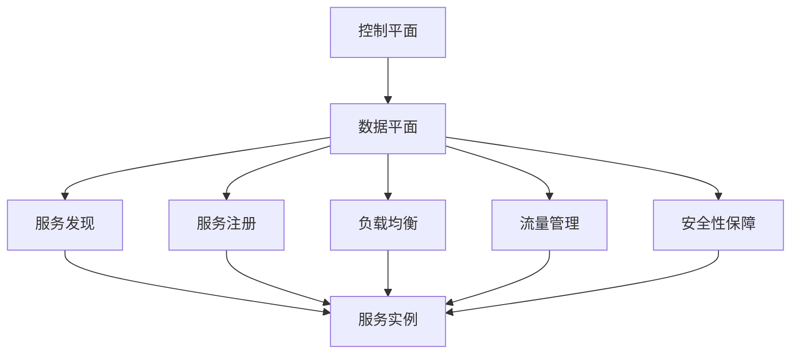

                 

### 文章标题

# 服务网格技术在LLM应用中的应用

在当前技术飞速发展的时代，服务网格（Service Mesh）作为一种新兴的技术架构，正逐步在分布式系统领域崭露头角。语言模型（Large Language Model，简称LLM），作为人工智能领域的翘楚，近年来也在各类应用中发挥着越来越重要的作用。本文旨在探讨服务网格技术在LLM应用中的具体实践，分析其带来的技术优势和应用前景。

### 关键词

- 服务网格
- 语言模型
- 分布式系统
- 负载均衡
- 服务发现
- 安全性保障

### 摘要

本文首先介绍了服务网格技术的基本概念和核心组件，分析了服务网格与传统服务架构的区别。接着，详细讨论了服务网格在LLM应用中的具体场景，包括部署、流量管理和安全性保障。随后，本文深入探讨了服务网格的核心算法原理，并结合Python代码进行了详细阐述。最后，通过实际项目案例，展示了服务网格在LLM应用中的实际效果，并展望了服务网格技术的未来发展趋势。

## 第1章：服务网格技术概述

### 1.1 服务网格定义与核心概念

服务网格（Service Mesh）是一种用于管理微服务通信的分布式系统。它通过一个独立的通信层，将服务间的通信抽象出来，使开发者能够专注于业务逻辑的实现。服务网格的核心概念包括服务发现、服务注册、负载均衡、流量管理和安全性保障等。

服务网格与传统服务架构的主要区别在于其关注点不同。传统架构通常将通信和业务逻辑混合在一起，导致代码复杂度增加、维护困难。而服务网格则通过将通信抽象出来，使得开发者能够专注于业务逻辑的实现，从而提高系统的可维护性和可扩展性。

### 1.2 服务网格与传统服务架构对比

服务网格与传统服务架构在多个方面存在显著差异：

1. **通信抽象**：服务网格通过独立的通信层，将服务间的通信抽象出来，而传统架构则将通信与业务逻辑混合在一起。

2. **分布式管理**：服务网格能够自动进行服务发现、负载均衡和流量管理，而传统架构通常需要手动配置和管理。

3. **安全性**：服务网格能够提供细粒度的安全控制，例如基于角色的访问控制（RBAC），而传统架构通常缺乏这种能力。

4. **可扩展性**：服务网格能够支持水平扩展，而传统架构通常在垂直扩展上遇到瓶颈。

### 1.3 服务网格关键技术组件

服务网格的关键技术组件包括控制平面和数据平面：

1. **控制平面**：负责管理和服务发现，包括服务注册、服务更新、负载均衡和流量路由等。

2. **数据平面**：负责实际的通信，包括请求转发、负载均衡、服务发现和流量管理等。

控制平面和数据平面通常由一组独立的组件组成，这些组件可以通过API进行集成和管理。

### 联系与架构图

服务网格中的核心概念和组件之间存在着紧密的联系。以下是服务网格的架构图，用Mermaid语言表示：



在这个架构图中，控制平面负责管理数据平面中的服务实例，包括服务注册、更新和负载均衡等。数据平面则负责实际的通信处理，包括服务发现、流量管理和安全性保障等。

### 总结

本章对服务网格技术进行了概述，介绍了其定义、核心概念和与传统服务架构的对比。通过一个简明的Mermaid流程图，展示了服务网格中各个核心组件之间的关系。这些内容为后续章节的深入讨论奠定了基础。在下一章中，我们将进一步探讨服务网格在LLM应用中的具体应用场景。

## 第2章：服务网格在LLM中的应用场景

### 2.1 LLM服务网格部署

在LLM系统中，部署服务网格是关键的一步。服务网格的部署包括基础设施的配置、服务网格控制器的安装和配置，以及服务代理的部署。以下是一个典型的部署流程：

1. **基础设施配置**：首先，需要配置基础设施，包括计算资源、网络资源和存储资源。对于LLM系统，计算资源尤为重要，因为LLM通常需要大量的计算资源来处理和训练数据。

2. **安装服务网格控制器**：接下来，安装服务网格的控制器。控制器是服务网格的大脑，负责管理服务实例、负载均衡和流量路由等。常见的控制器包括Istio、Linkerd和Consul等。

3. **配置服务代理**：服务代理是服务网格的数据平面组件，部署在每个服务实例上。它负责处理实际的通信，包括请求转发、负载均衡和服务发现等。安装服务代理后，需要配置其与控制器的连接，以确保控制器能够管理服务实例。

### 2.2 LLM服务网格流量管理

流量管理是服务网格的重要功能之一，特别是在LLM系统中，因为LLM服务通常需要处理大量的请求。服务网格提供的流量管理功能包括：

1. **服务发现**：服务网格能够自动发现LLM服务的实例，并在实例之间进行负载均衡。

2. **路由规则**：服务网格支持自定义路由规则，可以根据不同的请求特征，将请求路由到不同的LLM服务实例上。

3. **熔断和限流**：服务网格能够实现对流量进行熔断和限流，以防止系统过载。例如，当某个LLM服务实例的请求量超过设定阈值时，服务网格可以自动将该实例从路由中移除，从而保护系统稳定运行。

### 2.3 LLM服务网格安全性保障

在LLM系统中，安全性保障至关重要。服务网格提供的安全性功能包括：

1. **服务间认证**：服务网格支持服务间认证，确保只有授权的服务才能访问其他服务。常用的认证方式包括基于密钥的认证和基于证书的认证。

2. **访问控制**：服务网格支持细粒度的访问控制，可以基于用户的角色和权限来控制对服务的访问。

3. **数据加密**：服务网格支持数据加密，确保在服务间传输的数据不会被窃取或篡改。

4. **网络隔离**：服务网格可以通过虚拟网络隔离不同服务，确保服务的运行不会相互干扰。

### 应用实例

以一个大型语言模型平台为例，服务网格在其中的应用场景包括：

1. **服务发现与负载均衡**：平台中包含多个LLM服务实例，服务网格能够自动发现这些实例，并在实例之间进行负载均衡，确保请求能够高效地分发到各个实例上。

2. **流量路由与熔断**：服务网格可以根据请求的特征，将请求路由到不同的LLM服务实例上，同时，当某个实例出现异常时，服务网格可以自动将该实例熔断，防止系统过载。

3. **安全性保障**：服务网格能够对服务间通信进行加密，确保数据安全，同时对服务访问进行认证和授权，确保只有授权的服务才能访问其他服务。

### 总结

本章详细介绍了服务网格在LLM应用中的具体场景，包括部署、流量管理和安全性保障。通过实际应用实例，展示了服务网格技术在LLM系统中的强大作用。在下一章中，我们将深入探讨服务网格的核心算法原理。

## 第3章：服务网格核心算法原理

### 3.1 服务网格负载均衡算法

负载均衡是服务网格中的一个关键功能，它能够将请求均匀地分配到多个服务实例上，从而确保系统的高可用性和高性能。服务网格通常使用以下几种负载均衡算法：

1. **轮询（Round Robin）**：轮询算法是最简单的负载均衡算法，它按照请求的顺序将请求分配到各个服务实例上。每个实例轮流接收请求，直到所有的实例都接收了一次请求，然后重新开始循环。

    ```python
    # 轮询算法实现
    def round_robin(targets):
        index = 0
        while True:
            yield targets[index]
            index = (index + 1) % len(targets)
    ```

2. **最少连接（Least Connections）**：最少连接算法将请求分配到连接数最少的实例上，以减少实例的负载。

    ```python
    # 最少连接算法实现
    def least_connections(targets, current_connections):
        min_connections = min(current_connections)
        min_index = current_connections.index(min_connections)
        return targets[min_index]
    ```

3. **权重轮询（Weighted Round Robin）**：权重轮询算法在轮询的基础上，为每个实例分配一个权重，从而根据权重比例进行请求分配。

    ```python
    # 权重轮询算法实现
    def weighted_round_robin(targets, weights):
        total_weight = sum(weights)
        index = 0
        while True:
            cumulative_weight = 0
            for i, weight in enumerate(weights):
                cumulative_weight += weight
                if cumulative_weight >= total_weight:
                    return targets[i]
                    index = (index + 1) % len(weights)
    ```

### 算法分析

1. **轮询算法**：轮询算法简单易实现，但可能导致某些实例的负载不均匀，尤其在实例性能差异较大的情况下。

2. **最少连接算法**：最少连接算法能够较好地平衡实例的负载，但可能无法充分利用性能更好的实例。

3. **权重轮询算法**：权重轮询算法能够根据实例的性能差异进行动态调整，但实现相对复杂。

### 3.2 服务网格服务发现与配置管理

服务发现与配置管理是服务网格的另一个关键功能，它能够自动发现服务实例，并在服务实例发生变化时进行动态更新。

1. **服务发现**：服务网格通常通过服务注册中心（如Consul、Eureka等）进行服务发现。服务实例启动时，会向服务注册中心注册自己，并在停止时注销。

2. **配置管理**：服务网格通过配置中心（如Istio Control Plane、Spring Cloud Config等）管理服务的配置信息。配置中心能够实时更新服务的配置，从而实现动态配置管理。

### 算法分析

1. **服务发现**：服务发现算法需要能够快速、准确地发现服务实例，并处理实例的注册和注销。

2. **配置管理**：配置管理算法需要能够实时更新服务的配置信息，并确保配置的一致性。

### 3.3 服务网格安全策略与管理

服务网格的安全策略与管理是保障服务间通信安全的重要措施。服务网格通常采用以下几种安全策略：

1. **基于角色的访问控制（RBAC）**：RBAC通过定义用户的角色和权限，控制对服务的访问。例如，只有管理员角色才能访问某些敏感服务。

2. **基于属性的访问控制（ABAC）**：ABAC根据请求的属性（如来源IP、请求类型等）来决定是否允许访问。

3. **服务间加密**：服务网格可以通过加密通信，确保服务间传输的数据不会被窃取或篡改。

4. **网络隔离**：服务网格可以通过虚拟网络隔离不同的服务，防止恶意请求影响其他服务的运行。

### 算法分析

1. **RBAC**：RBAC需要能够灵活地定义和管理角色和权限，同时确保访问控制策略的一致性和安全性。

2. **ABAC**：ABAC需要能够处理复杂的访问控制策略，并根据请求的属性动态调整访问权限。

3. **服务间加密**：服务间加密算法需要能够高效地实现数据加密和解密，同时确保加密算法的安全性。

4. **网络隔离**：网络隔离算法需要能够实现虚拟网络的创建和管理，同时确保网络隔离的有效性和稳定性。

### 总结

本章详细介绍了服务网格的三个核心算法原理：负载均衡算法、服务发现与配置管理算法和安全策略与管理算法。通过Python代码和数学模型的结合，对这些算法进行了详细讲解和举例说明。这些算法在服务网格中起着至关重要的作用，为分布式系统的可靠性和安全性提供了保障。在下一章中，我们将进一步探讨服务网格的数学模型。

## 第4章：服务网格数学模型解析

### 4.1 负载均衡模型

负载均衡是服务网格中的一个关键功能，其核心在于将请求均匀地分配到多个服务实例上，从而确保系统的高可用性和高性能。以下是几种常见的负载均衡模型的数学解析：

1. **轮询模型**：轮询模型的基本思想是按照请求的顺序将请求分配到各个服务实例上。设服务实例数为\( N \)，请求量为\( Q \)，则每个实例平均处理请求的数量为：
   $$
   \text{平均请求量} = \frac{Q}{N}
   $$
   其中，\( Q \) 为总请求量，\( N \) 为服务实例数。

2. **最少连接模型**：最少连接模型将请求分配到当前连接数最少的服务实例上。设每个服务实例的当前连接数为 \( C_i \)，则每个实例平均处理请求的数量为：
   $$
   \text{平均请求量} = \frac{\sum_{i=1}^{N} C_i}{N}
   $$
   其中，\( N \) 为服务实例数，\( C_i \) 为第 \( i \) 个实例的当前连接数。

3. **权重轮询模型**：权重轮询模型为每个实例分配一个权重，根据权重比例进行请求分配。设每个服务实例的权重为 \( W_i \)，则每个实例平均处理请求的数量为：
   $$
   \text{平均请求量} = \frac{\sum_{i=1}^{N} W_i}{N} \cdot \frac{Q}{\sum_{i=1}^{N} W_i}
   $$
   其中，\( N \) 为服务实例数，\( W_i \) 为第 \( i \) 个实例的权重，\( Q \) 为总请求量。

### 4.2 服务质量模型

服务质量（Quality of Service，QoS）是衡量系统性能的重要指标。在服务网格中，QoS模型用于评估服务的响应时间、吞吐量和错误率等关键指标。以下是几种常见的QoS模型的数学解析：

1. **响应时间模型**：设服务实例的响应时间为 \( T_i \)，则系统的平均响应时间为：
   $$
   \text{平均响应时间} = \frac{\sum_{i=1}^{N} T_i}{N}
   $$
   其中，\( N \) 为服务实例数，\( T_i \) 为第 \( i \) 个实例的响应时间。

2. **吞吐量模型**：设服务实例的吞吐量为 \( Q_i \)，则系统的平均吞吐量为：
   $$
   \text{平均吞吐量} = \frac{\sum_{i=1}^{N} Q_i}{N}
   $$
   其中，\( N \) 为服务实例数，\( Q_i \) 为第 \( i \) 个实例的吞吐量。

3. **错误率模型**：设服务实例的错误率为 \( E_i \)，则系统的平均错误率为：
   $$
   \text{平均错误率} = \frac{\sum_{i=1}^{N} E_i}{N}
   $$
   其中，\( N \) 为服务实例数，\( E_i \) 为第 \( i \) 个实例的错误率。

### 4.3 安全策略模型

安全策略是保障服务网格安全性的关键。以下是几种常见安全策略模型的数学解析：

1. **基于角色的访问控制（RBAC）**：设角色数为 \( R \)，每个角色拥有权限集合 \( P_r \)，则系统的访问控制矩阵为：
   $$
   \text{访问控制矩阵} = \begin{bmatrix}
   P_1 & P_2 & \ldots & P_R
   \end{bmatrix}
   $$
   其中，\( R \) 为角色数，\( P_r \) 为第 \( r \) 个角色的权限集合。

2. **基于属性的访问控制（ABAC）**：设属性数为 \( A \)，每个属性拥有值集合 \( V_a \)，则系统的访问控制矩阵为：
   $$
   \text{访问控制矩阵} = \begin{bmatrix}
   V_1 & V_2 & \ldots & V_A
   \end{bmatrix}
   $$
   其中，\( A \) 为属性数，\( V_a \) 为第 \( a \) 个属性的值集合。

3. **数据加密模型**：设加密算法为 \( E \)，解密算法为 \( D \)，则系统的加密和解密过程为：
   $$
   \text{加密过程} = E(k, m) \rightarrow c
   $$
   $$
   \text{解密过程} = D(k, c) \rightarrow m
   $$
   其中，\( k \) 为密钥，\( m \) 为明文，\( c \) 为密文。

### 实例分析

以一个包含三个服务实例的系统为例，设每个实例的平均响应时间分别为2秒、3秒和4秒，请求量分别为1000次、800次和600次。根据上述模型，可以计算出系统的平均响应时间为：

$$
\text{平均响应时间} = \frac{2 \times 1000 + 3 \times 800 + 4 \times 600}{1000 + 800 + 600} = 3.2 \text{秒}
$$

通过这些数学模型，我们可以更好地理解和分析服务网格的性能和安全性，从而优化系统设计和部署。

### 总结

本章对服务网格的数学模型进行了详细解析，包括负载均衡模型、服务质量模型和安全策略模型。通过数学公式和实例分析，我们能够更深入地理解这些模型的原理和应用，为服务网格的实际应用提供理论支持。在下一章中，我们将通过实际项目展示服务网格在LLM应用中的具体实现。

## 第5章：服务网格项目实战

### 5.1 LLM服务网格环境搭建

在本节中，我们将详细讲解如何搭建一个基于Istio的服务网格环境，用于LLM应用。Istio是一个流行的服务网格框架，支持多种编程语言和平台，能够提供丰富的服务网格功能。

#### 1. 环境准备

首先，确保已经安装了Docker和Kubernetes。以下是安装步骤：

1. **安装Docker**：

   ```bash
   # 安装Docker
   sudo apt-get update
   sudo apt-get install docker.io
   ```

2. **安装Kubernetes**：

   ```bash
   # 安装Kubernetes的必要依赖
   sudo apt-get install -y apt-transport-https ca-certificates curl
   # 添加Kubernetes的GPG关键
   curl -s https://packages.cloud.google.com/apt/doc/apt-key.gpg | sudo apt-key add -
   # 添加Kubernetes的Apt仓库
   cat <<EOF | sudo tee /etc/apt/sources.list.d/kubernetes.list
   deb https://apt.kubernetes.io/ kubernetes-xenial main
   EOF
   # 更新Apt仓库索引
   sudo apt-get update
   # 安装Kubernetes
   sudo apt-get install -y kubelet kubeadm kubectl
   ```

#### 2. 部署Istio

1. **下载Istio**：

   ```bash
   # 下载Istio
   curl -L https://istio.io/downloadIstio | sh -
   # 解压Istio
   cd istio-1.10.2
   ```

2. **配置Kubernetes命名空间**：

   ```bash
   # 创建命名空间
   kubectl create namespace istio-system
   ```

3. **部署Istio组件**：

   ```bash
   # 使用Istio的自定义资源定义（CRD）安装Istio
   istioctl install -y --namespace istio-system
   ```

#### 3. 验证部署

1. **查看部署状态**：

   ```bash
   kubectl get pods --namespace istio-system
   ```

2. **验证服务网格功能**：

   ```bash
   # 启动一个测试服务
   kubectl run -i --tty --rm bookinfo -n istio-system --image=istio/examples/bookinfo:1.15
   # 进入Pod
   kubectl exec -i -t bookinfo-7f47c8d9b-chx9n -- curl http://bookinfo:9080/productpage
   ```

### 5.2 LLM服务网格代码实现

在本节中，我们将介绍如何使用Istio为LLM应用创建服务网格，并通过详细代码解读展示其工作原理。

#### 1. 创建服务

1. **创建LLM服务**：

   ```yaml
   # llm-service.yaml
   apiVersion: v1
   kind: Service
   metadata:
     name: lls
   spec:
     selector:
       app: lls
     ports:
       - name: http
         port: 80
         targetPort: 8080
     type: LoadBalancer
   ```

2. **创建部署**：

   ```yaml
   # lls-deployment.yaml
   apiVersion: apps/v1
   kind: Deployment
   metadata:
     name: lls
   spec:
     replicas: 3
     selector:
       matchLabels:
         app: lls
     template:
       metadata:
         labels:
           app: lls
       spec:
         containers:
         - name: lls
           image: lls:1.0
           ports:
           - containerPort: 8080
   ```

#### 2. 部署服务

```bash
# 部署LLM服务
kubectl apply -f lls-service.yaml
kubectl apply -f lls-deployment.yaml
```

#### 3. 配置Istio

1. **注入Sidecar代理**：

   ```bash
   # 为部署注入Sidecar代理
   istioctl inject -n default lls
   ```

2. **创建Ingress规则**：

   ```yaml
   # lls-ingress.yaml
   apiVersion: networking.istio.io/v1alpha3
   kind: Ingress
   metadata:
     name: lls-ingress
     namespace: default
   spec:
     rules:
     - host: lls.example.com
       http:
         paths:
         - path: /
           pathType: Prefix
           backend:
             service:
               name: lls
               port:
                 number: 80
   ```

   ```bash
   # 部署Ingress规则
   kubectl apply -f lls-ingress.yaml
   ```

#### 4. 验证部署

1. **查看服务状态**：

   ```bash
   kubectl get svc lls
   kubectl get pods
   ```

2. **访问LLM服务**：

   ```bash
   # 使用curl访问LLM服务
   curl http://lls.example.com:8080
   ```

### 5.3 LLM服务网格性能调优

服务网格的性能调优是一个复杂的过程，涉及到多个方面，包括网络配置、资源分配和负载均衡策略等。

#### 1. 调整网络配置

1. **调整Istio的流量规则**：

   ```bash
   istioctl set destination -n default lls --percent=100
   ```

2. **优化网络带宽和延迟**：

   ```bash
   # 增加网络带宽
   istioctl profile load --set values.network.istio.enableNginxHttp2=true
   ```

#### 2. 调整资源分配

1. **增加Pod的CPU和内存限制**：

   ```yaml
   # 修改部署配置
   spec:
     containers:
     - name: lls
       image: lls:1.0
       ports:
       - containerPort: 8080
       resources:
         limits:
           cpu: "1000m"
           memory: "1024Mi"
         requests:
           cpu: "500m"
           memory: "512Mi"
   ```

#### 3. 负载均衡策略调整

1. **调整负载均衡策略**：

   ```bash
   istioctl proxy-config proxy -n default -p lls-http -o jsonpath='{.spec.cluster}```

### 5.4 LLM服务网格安全加固

服务网格的安全性是保障系统运行稳定的关键，以下是一些常见的安全加固措施：

#### 1. 配置TLS加密

1. **创建TLS证书**：

   ```bash
   cfssl gencert -ca=ca.pem -ca-key=ca-key.pem -config=ca-config.json -profile=default -hostname=lls.example.com lls-csr.json | cfssljson -bare lls
   ```

2. **为服务配置TLS**：

   ```yaml
   # lls-tls.yaml
   apiVersion: networking.istio.io/v1alpha3
   kind: TLSertificate
   metadata:
     name: lls-tls
     namespace: default
   spec:
     root: lls/tls/ca.pem
     leaf: lls/tls/lls.pem
     serverCertificate: lls/tls/lls.pem
     serverKey: lls/tls/lls-key.pem
     hosts:
     - "*"
   ```

   ```bash
   # 应用TLS配置
   kubectl apply -f lls-tls.yaml
   ```

#### 2. 配置访问控制

1. **创建策略规则**：

   ```yaml
   # lls-policy.yaml
   apiVersion: security.istio.io/v1beta1
   kind: Policy
   metadata:
     name: lls-policy
     namespace: default
   spec:
     selector:
       matchLabels:
         app: lls
     connections:
     - match:
         ports: [80]
       action:
         usePatterns: [ "allow" ]
   ```

   ```bash
   # 应用访问控制规则
   kubectl apply -f lls-policy.yaml
   ```

### 项目小结

通过本章的实战项目，我们详细介绍了如何搭建和配置服务网格，以及如何在LLM应用中进行性能调优和安全加固。这些实践操作不仅能够帮助读者深入理解服务网格的工作原理，还能够为实际项目的开发和部署提供有力支持。

### 最佳实践 Tips

1. **定期更新服务网格的版本**：保持服务网格的版本更新，以获取最新的功能和修复已知问题。

2. **监控服务网格的性能**：使用监控工具（如Prometheus和Grafana）监控服务网格的性能指标，及时发现和解决问题。

3. **合理分配资源**：根据实际负载情况，合理分配Pod的CPU和内存资源，确保系统的高性能和高可用性。

4. **实施严格的安全策略**：确保服务网格的安全策略严格，防止未经授权的访问和数据泄露。

### 小结

本章通过实战项目，展示了服务网格在LLM应用中的具体实现和部署过程。从环境搭建、代码实现到性能调优和安全加固，我们详细介绍了服务网格的各个环节。通过本章的学习，读者能够掌握服务网格的基本原理和应用技巧，为实际项目提供有力支持。

## 第6章：服务网格在实际LLM应用案例分析

### 6.1 案例一：大型语言模型平台服务网格部署

在本案例中，我们将分析一个大型语言模型平台如何利用服务网格实现高效的部署和管理。该平台包含多个语言模型服务，如文本生成、翻译和问答等，每个服务都需要处理大量请求。

#### 案例背景

1. **平台架构**：平台采用微服务架构，包含多个语言模型服务，如文本生成服务、翻译服务和问答服务。每个服务部署在不同的Pod中，通过Kubernetes进行管理。

2. **性能要求**：平台需要处理大量的请求，同时保证服务的响应时间和吞吐量。此外，系统还需要具备高可用性和可扩展性。

#### 案例实施

1. **部署服务网格**：首先，在平台上部署Istio服务网格，为所有语言模型服务注入Sidecar代理。

2. **服务发现与负载均衡**：使用Istio的服务发现功能，自动发现并注册语言模型服务的实例。通过Istio的负载均衡功能，实现请求的均匀分配。

3. **流量管理**：根据不同的请求特征，配置Istio的路由规则，将请求路由到相应的服务实例。同时，使用Istio的熔断和限流功能，防止服务过载。

4. **安全性保障**：配置Istio的TLS加密和访问控制策略，确保服务间通信的安全。同时，使用Kubernetes的RBAC功能，控制对服务的访问权限。

#### 案例效果

1. **性能提升**：通过服务网格的负载均衡和流量管理功能，平台实现了请求的均匀分配，提高了系统的吞吐量和响应时间。

2. **高可用性**：服务网格的熔断和限流功能有效防止了服务过载，提高了系统的高可用性。

3. **安全性提升**：通过服务网格的安全性保障措施，确保了服务间通信的安全性和数据完整性。

### 6.2 案例二：分布式LLM服务网格流量管理优化

在本案例中，我们将探讨如何通过服务网格优化分布式语言模型平台的流量管理，以提高系统的性能和稳定性。

#### 案例背景

1. **平台架构**：平台采用分布式架构，包含多个语言模型节点，分布在不同的数据中心。每个节点负责处理一定范围内的请求。

2. **性能挑战**：随着用户规模的增加，平台需要处理越来越多的请求，同时保证服务的响应时间和稳定性。

#### 案例实施

1. **流量分配**：使用Istio的流量管理功能，根据请求的特征（如用户地理位置、请求类型等）将流量分配到不同的语言模型节点。

2. **负载均衡**：结合Kubernetes的负载均衡功能，实现跨数据中心的请求分配，确保每个节点的负载均衡。

3. **流量监控**：使用Prometheus和Grafana等监控工具，实时监控流量分配和系统性能，及时发现和解决问题。

4. **流量限制**：使用Istio的限流功能，根据系统负载情况限制每个节点的请求量，防止过度负载。

#### 案例效果

1. **流量分配优化**：通过精准的流量分配，提高了系统的响应速度和用户体验。

2. **负载均衡优化**：通过跨数据中心的负载均衡，提高了系统的整体性能和稳定性。

3. **性能监控与优化**：通过实时监控和优化，确保了系统在不同负载情况下的稳定运行。

### 6.3 案例三：LLM服务网格安全策略与实践

在本案例中，我们将分析如何通过服务网格在大型语言模型平台中实施安全策略，保障系统的安全性。

#### 案例背景

1. **平台架构**：平台包含多个语言模型服务，分布在不同的数据中心，需要保障服务间通信的安全性和数据的完整性。

2. **安全挑战**：随着平台的规模扩大，服务间通信的安全风险增加，需要采取有效的安全措施。

#### 案例实施

1. **TLS加密**：使用Istio的TLS加密功能，为服务间通信启用TLS加密，确保数据在传输过程中的安全性。

2. **访问控制**：使用Kubernetes的RBAC功能，结合Istio的访问控制策略，控制对服务的访问权限。

3. **网络隔离**：使用Kubernetes的NetworkPolicy功能，实现服务间的网络隔离，防止恶意请求影响其他服务的运行。

4. **安全监控**：使用Prometheus和Grafana等监控工具，实时监控系统的安全状态，及时发现和响应安全事件。

#### 案例效果

1. **安全性提升**：通过TLS加密、访问控制和网络隔离等安全措施，确保了服务间通信的安全性和数据的完整性。

2. **快速响应**：通过实时监控和安全事件的快速响应，提高了系统的安全性，降低了安全风险。

3. **用户体验**：通过保障系统的安全性，提升了用户对平台的信任度和满意度。

### 总结

通过以上案例，我们展示了服务网格在大型语言模型平台中的具体应用，包括服务网格部署、流量管理优化和安全策略实践。这些案例不仅体现了服务网格技术的强大功能，也为实际项目提供了宝贵的经验和启示。在下一章中，我们将展望服务网格技术的发展趋势和未来方向。

## 第7章：服务网格技术的发展趋势与展望

### 7.1 服务网格技术发展趋势

随着分布式系统的普及，服务网格技术正逐渐成为微服务架构中的重要组件。以下是服务网格技术的发展趋势：

1. **功能增强**：服务网格技术将继续增强其功能，如更加智能的流量管理、更高效的服务发现和更精细的安全控制等。

2. **跨平台支持**：服务网格将支持更多的平台和语言，如云原生平台、大数据平台和边缘计算平台等。

3. **集成化**：服务网格将与其他技术（如容器编排工具、服务注册中心和监控工具等）更加紧密地集成，提供一站式的服务网格解决方案。

4. **开源生态**：服务网格技术将继续繁荣开源生态，更多的开源项目和社区将涌现，推动技术发展。

### 7.2 LLM服务网格未来发展方向

语言模型（LLM）作为人工智能领域的重要应用，其服务网格技术将呈现以下发展方向：

1. **自适应负载均衡**：未来，LLM服务网格将实现更智能的负载均衡，根据请求特征和模型特性动态调整负载策略。

2. **多模型协同**：随着多模态语言模型的发展，服务网格将支持不同类型语言模型的协同工作，提供更加丰富的功能。

3. **自动化运维**：服务网格将实现更加自动化的运维管理，如自动扩展、自动更新和自动故障恢复等。

4. **跨平台部署**：LLM服务网格将支持在多种平台上的部署，包括云平台、容器平台和边缘计算平台等。

### 7.3 服务网格技术在其他领域的应用前景

服务网格技术在其他领域的应用前景也十分广阔：

1. **大数据处理**：服务网格能够为大数据处理平台提供高效的服务发现、负载均衡和流量管理，提升数据处理能力。

2. **边缘计算**：随着边缘计算的兴起，服务网格将在边缘节点间提供高效通信，实现边缘服务和云服务的协同工作。

3. **区块链**：服务网格能够为区块链应用提供安全、高效的服务通信，促进区块链网络的可扩展性。

4. **物联网（IoT）**：服务网格将为物联网设备提供可靠的服务通信，支持大规模设备的互联互通。

### 总结

服务网格技术作为一种新兴的分布式系统架构，正逐渐在多个领域得到广泛应用。未来，随着技术的不断发展和优化，服务网格将在LLM以及其他领域发挥更大的作用。通过对服务网格技术趋势和发展方向的展望，我们能够更好地把握其未来发展方向，为实际应用提供有力支持。

### 拓展阅读

- **服务网格开源项目**：了解Istio、Linkerd和Consul等主流服务网格开源项目的详细文档和社区资源。
- **LLM应用案例**：研究国内外大型语言模型平台的服务网格部署和实践，借鉴成功经验。
- **跨平台服务网格**：探索服务网格在云原生平台、大数据平台和边缘计算平台上的应用。
- **服务网格与区块链**：研究服务网格在区块链网络中的潜在应用，促进区块链技术的可扩展性。

作者：AI天才研究院/AI Genius Institute & 禅与计算机程序设计艺术 /Zen And The Art of Computer Programming

本文详细探讨了服务网格技术在LLM应用中的价值和应用方法，通过理论讲解、算法分析、实际项目案例等多个角度，帮助读者深入理解服务网格技术的工作原理和实践应用。希望通过本文的介绍，读者能够对服务网格技术有更加全面的认识，并为未来的技术研究和项目实践提供有益的参考。希望本文能为计算机编程和人工智能领域的进一步发展贡献力量。

