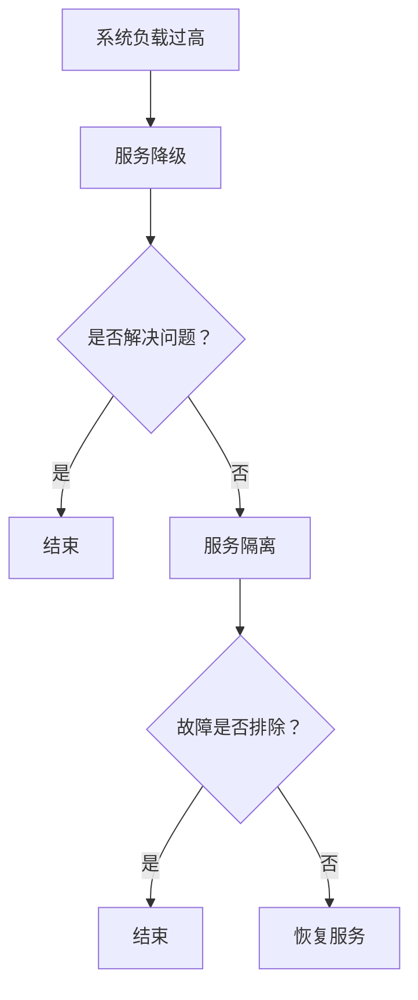

                 

### 摘要

本文将深入探讨服务降级与服务隔离在大型语言模型（LLM）应用中的重要性及其具体应用。首先，我们将介绍服务降级和服务隔离的基本概念，明确其在保障系统稳定性和可靠性方面的作用。随后，我们将详细分析服务降级和服务隔离的工作原理，并通过Mermaid流程图展示其关系架构。接下来，本文将使用Python源代码和数学模型，深入讲解核心算法原理，结合实例进行通俗易懂的阐述。最后，我们将通过实际项目实战，展示服务降级和服务隔离在LLM应用中的具体实现和效果，并提供最佳实践建议和拓展阅读，帮助读者更好地理解和应用这些技术。

### 关键词

- 服务降级
- 服务隔离
- LLM应用
- 系统稳定性
- 可靠性保障
- 核心算法原理
- Python源代码
- 数学模型
- 实际项目实战
- 最佳实践

### 背景介绍

在现代信息技术飞速发展的背景下，大型语言模型（LLM）作为一种强大的自然语言处理工具，已经在众多应用场景中展现出了巨大的潜力。从智能客服、语音识别到内容生成和翻译，LLM的应用无处不在。然而，随着LLM应用规模的不断扩大，系统的稳定性、可靠性和性能成为亟待解决的问题。

服务降级和服务隔离是保障系统稳定性和可靠性的两种重要技术手段。服务降级通过降低系统的部分功能，确保核心服务的正常运作；服务隔离则通过将故障或高风险的服务进行隔离，防止问题扩散，保障其他服务的正常运行。这两种技术不仅适用于传统的Web应用，在LLM这样高复杂度的应用中也具有重要的应用价值。

本文旨在通过详细的分析和实际案例，帮助读者深入了解服务降级和服务隔离在LLM应用中的具体应用场景和技术实现。通过对核心算法原理的讲解和Python源代码的展示，本文将帮助读者掌握这些技术的本质和应用方法，为实际项目提供可行的解决方案。

### 核心概念与联系

在本章节中，我们将深入探讨服务降级（Service Degradation）和服务隔离（Service Isolation）这两个核心概念，并详细分析它们在保障系统稳定性和可靠性方面的作用及其相互关系。

#### 服务降级

**定义：** 服务降级是指当系统面临资源不足、负载过高等异常情况时，主动降低部分服务的性能或功能，以保证核心服务的正常运作。通过这种方式，系统可以在资源有限的情况下，优先保证用户的关键需求得到满足。

**作用：** 服务降级在系统负载过高或资源耗尽时，可以有效避免系统崩溃或性能大幅下降。它通过牺牲部分非关键服务的性能，确保系统在整体上保持稳定运行。对于LLM应用来说，服务降级尤为重要，因为LLM模型训练和推理通常需要大量计算资源，一旦资源耗尽，可能导致整个系统瘫痪，影响用户体验。

**原理：** 服务降级的原理主要包括以下几个步骤：

1. **监测系统状态：** 系统持续监测各项性能指标，如CPU使用率、内存使用率、网络延迟等，一旦发现异常，立即触发降级机制。
2. **评估服务优先级：** 根据预定的策略，评估各个服务的优先级，确定哪些服务可以被降级。
3. **执行降级操作：** 对低优先级的服务进行性能降低或功能关闭，如减少并发处理能力、降低响应时间等。
4. **反馈与调整：** 执行降级操作后，系统持续监控效果，并根据反馈进行动态调整，确保核心服务能够恢复正常运作。

#### 服务隔离

**定义：** 服务隔离是指将系统中的故障或高风险服务进行物理或逻辑上的隔离，防止故障或风险扩散到其他服务，从而保障系统的整体稳定性。

**作用：** 服务隔离在系统出现故障或安全风险时，可以有效地限制故障的影响范围，避免系统崩溃。对于LLM应用来说，由于模型的复杂性和重要性，一旦某个服务出现故障，可能会对整个系统造成重大影响，因此服务隔离在保障系统可靠性和数据安全方面具有重要作用。

**原理：** 服务隔离的实现原理主要包括以下几个步骤：

1. **检测异常：** 系统通过监控工具检测到服务异常或潜在风险时，立即启动隔离机制。
2. **隔离服务：** 将异常服务从系统中分离，如将其从服务器中卸载、在网络中隔离等。
3. **故障分析：** 对隔离的服务进行详细分析，确定故障原因，并制定修复方案。
4. **恢复服务：** 在故障排除后，将服务重新整合到系统中，并确保其正常运行。

#### 服务降级与服务隔离的关系

服务降级和服务隔离虽然在实现机制和目的上有所不同，但它们在保障系统稳定性和可靠性方面具有互补关系。

- **互补作用：** 服务降级主要应对系统资源不足的情况，通过降低非关键服务的性能来保障核心服务的正常运作；服务隔离则主要应对系统出现故障或安全风险的情况，通过隔离故障服务来防止问题扩散。两者相辅相成，共同保障系统的稳定性和可靠性。

- **协同工作：** 在实际应用中，服务降级和服务隔离往往是协同工作的。例如，当系统负载过高时，可以首先通过服务降级降低非关键服务的性能，如果降级操作仍然无法解决问题，则可以进一步通过服务隔离隔离部分服务，防止故障进一步扩散。

为了更好地理解服务降级和服务隔离的关系，我们可以使用Mermaid流程图来展示其相互关系：



通过这个流程图，我们可以清晰地看到，当系统负载过高时，首先尝试服务降级；如果服务降级无法解决问题，则进一步进行服务隔离，直到故障被排除。

总的来说，服务降级和服务隔离是保障系统稳定性和可靠性的重要技术手段，在LLM应用中具有重要作用。通过深入理解其核心概念和相互关系，我们可以更好地应对系统面临的各类挑战，确保系统的长期稳定运行。

#### 服务降级原理

服务降级是一种通过牺牲部分非关键服务的性能或功能，来确保系统核心服务正常运作的技术手段。在本章节中，我们将详细探讨服务降级的原理，包括其触发条件、执行过程和具体实现方法。

##### 触发条件

服务降级的主要触发条件包括以下几个方面：

1. **系统资源不足**：当系统资源（如CPU、内存、磁盘空间等）接近或超过预定阈值时，表明系统正在面临资源紧张的情况。此时，可以通过服务降级来缓解资源压力。
2. **服务器负载过高**：当服务器的负载（如并发请求量、处理速度等）超过系统能承受的极限时，可能导致系统响应缓慢或无法正常处理请求。这时，服务降级可以降低部分服务的性能，以确保核心服务的响应速度。
3. **网络异常**：当网络出现故障或延迟过高时，可能导致部分服务无法正常访问。通过服务降级，可以减少对外部服务的依赖，确保核心服务的稳定性。
4. **硬件故障**：当硬件设备出现故障时，如服务器宕机、磁盘损坏等，可能导致系统性能下降。服务降级可以在故障修复前，临时调整系统性能，保障核心服务的运作。

##### 执行过程

服务降级的执行过程主要包括以下几个步骤：

1. **监测系统状态**：系统持续监测各项性能指标，如CPU使用率、内存使用率、网络延迟等。当检测到系统状态异常时，立即触发降级机制。
2. **评估服务优先级**：根据预定的策略，评估各个服务的优先级。通常，核心服务（如订单处理、支付系统等）具有较高的优先级，而非核心服务（如广告推送、推荐系统等）优先级较低。
3. **执行降级操作**：对低优先级的服务进行性能降低或功能关闭。具体操作包括减少并发处理能力、降低响应时间、暂停某些功能等。
4. **反馈与调整**：执行降级操作后，系统持续监控效果，并根据反馈进行动态调整。如果降级操作有效，则继续维持降级状态；如果问题仍未解决，则进一步采取其他措施，如服务隔离。

##### 具体实现方法

服务降级的具体实现方法可以有多种，以下是几种常见的实现方法：

1. **负载均衡**：通过负载均衡器分配请求，减少单个服务器的负载。当系统负载过高时，可以增加负载均衡器的权重分配，降低部分服务的处理能力。
2. **动态配置**：通过动态配置中心，实时调整服务的性能参数。例如，可以调整服务的并发连接数、线程数、响应时间等。
3. **限流**：通过限流算法（如令牌桶、漏斗算法等），控制请求的流量，避免系统因请求过多而崩溃。
4. **功能禁用**：在某些情况下，可以临时禁用部分非核心服务，以减少系统的负载和资源消耗。

##### 示例分析

以下是一个简单的Python代码示例，展示如何实现服务降级：

```python
import time
import random

def core_service():
    # 核心服务的实现逻辑
    print("正在执行核心服务...")
    time.sleep(2)

def non_core_service():
    # 非核心服务的实现逻辑
    print("正在执行非核心服务...")
    time.sleep(random.randint(1, 3))

def service_degradation():
    # 服务降级函数
    print("检测到系统负载过高，开始执行服务降级...")
    
    # 调整非核心服务的执行时间
    non_core_service_time = random.randint(1, 2)
    time.sleep(non_core_service_time)
    
    # 执行核心服务
    core_service()
    
    # 执行非核心服务
    non_core_service()

# 执行服务降级
service_degradation()
```

在这个示例中，我们定义了核心服务和非核心服务的实现逻辑。在`service_degradation`函数中，我们首先检测系统负载情况（这里通过随机休眠时间模拟），然后根据负载情况调整非核心服务的执行时间。如果负载过高，我们将非核心服务的执行时间缩短，确保核心服务的执行不受影响。

通过这个简单的示例，我们可以看到服务降级的基本原理和实现方法。在实际应用中，服务降级的实现会更加复杂，需要综合考虑系统状态、服务优先级、资源状况等多种因素。

#### 服务隔离原理

服务隔离（Service Isolation）是一种通过将系统中的故障或高风险服务进行隔离，以防止故障扩散和保障系统其他部分正常运行的技术手段。在本章节中，我们将详细探讨服务隔离的基本原理，包括其触发条件、执行过程和隔离策略。

##### 触发条件

服务隔离的触发条件通常包括以下几种情况：

1. **服务故障**：当某个服务出现严重故障，无法正常处理请求或响应时间过长时，可能需要将其隔离。
2. **安全风险**：当某个服务存在安全漏洞或受到恶意攻击时，为了防止风险扩散，需要对其进行隔离。
3. **性能瓶颈**：当某个服务的性能严重下降，成为系统瓶颈，影响整体性能时，可能需要将其隔离以进行故障排除或性能优化。
4. **资源耗尽**：当某个服务的资源使用接近或超过系统限制时，可能导致系统整体性能下降，这时可以将其隔离以缓解资源压力。

##### 执行过程

服务隔离的执行过程通常包括以下几个步骤：

1. **监测异常**：系统持续监测各个服务的状态，包括运行状态、性能指标、资源使用等。当检测到服务出现异常时，立即启动隔离机制。
2. **评估隔离必要性**：根据服务异常的严重程度和影响范围，评估是否需要对其进行隔离。如果故障可以迅速修复或影响较小，可能不需要隔离；如果故障严重且可能影响其他服务，则需要进行隔离。
3. **执行隔离操作**：将异常服务从系统中隔离。具体隔离方式包括以下几种：
   - **物理隔离**：将服务从服务器中卸载或停用，以物理方式隔离故障服务。
   - **逻辑隔离**：通过网络隔离、防火墙策略等方式，将服务与其他部分隔离。
4. **故障分析和修复**：对被隔离的服务进行故障分析，找出故障原因，并制定修复方案。修复完成后，将服务重新整合到系统中。
5. **监控和恢复**：在隔离期间，系统持续监控被隔离服务的状态，确保故障完全修复后再恢复服务。

##### 隔离策略

服务隔离的具体实现需要采用合适的隔离策略，以保障隔离的效率和效果。以下是几种常见的隔离策略：

1. **熔断器（Circuit Breaker）**：当某个服务出现频繁故障或响应时间过长时，熔断器会自动切断对该服务的调用，防止故障扩散。一旦故障修复，熔断器会重新开启服务调用。
2. **服务降级（Service Degradation）**：在故障服务未完全修复前，通过服务降级降低其性能或功能，以减少对系统整体的影响。
3. **容器化（Containerization）**：使用容器技术（如Docker）将服务封装在独立的容器中，通过容器网络和隔离机制实现服务的隔离。
4. **微服务架构（Microservices Architecture）**：采用微服务架构，将系统拆分为多个独立的服务单元，每个服务单元之间通过接口通信。当一个服务出现故障时，其他服务可以继续正常运行。

##### 示例分析

以下是一个简单的Python代码示例，展示如何实现服务隔离：

```python
import time
import random

def service_a():
    # 服务A的实现逻辑
    print("服务A：正在处理请求...")
    time.sleep(random.randint(1, 3))

def service_b():
    # 服务B的实现逻辑
    print("服务B：正在处理请求...")
    time.sleep(random.randint(1, 3))

def service_isolation():
    # 服务隔离函数
    print("检测到服务B出现异常，开始执行服务隔离...")
    
    # 假设服务B出现故障，我们将其隔离
    try:
        service_a()
    except Exception as e:
        print(f"服务A出现异常：{e}")
    
    # 在隔离期间，服务B暂时不可用
    print("服务B已被隔离，无法访问...")
    
    # 假设服务B修复后，重新启动
    print("服务B已修复，重新启动...")
    service_b()

# 执行服务隔离
service_isolation()
```

在这个示例中，我们定义了服务A和服务B的实现逻辑。在`service_isolation`函数中，我们首先检测服务B的状态，如果发现服务B出现故障，我们将服务A继续运行，同时将服务B隔离。在隔离期间，服务B不可用，直到故障修复后重新启动。

通过这个简单的示例，我们可以看到服务隔离的基本原理和实现方法。在实际应用中，服务隔离的实现会更加复杂，需要结合具体的业务场景和系统架构进行设计和优化。

#### 服务降级与服务隔离在LLM应用中的具体应用

在大型语言模型（LLM）应用中，服务降级和服务隔离是保障系统稳定性和可靠性的关键技术。本章节将分析服务降级和服务隔离在LLM模型训练和模型推理过程中的具体应用，并展示其实现方法和效果。

##### 模型训练过程中的服务降级

在LLM模型训练过程中，服务降级主要应用于以下几个方面：

1. **计算资源优化**：LLM模型训练通常需要大量的计算资源，如CPU、GPU等。当系统资源不足时，可以通过服务降级来优化计算资源分配。例如，降低部分训练任务的并发数，减少GPU使用量，确保核心训练任务的顺利进行。
2. **数据流控制**：在训练过程中，数据流的大小和速度对系统性能有直接影响。通过服务降级，可以控制数据流的速率，避免因数据流过大而导致的系统拥塞。例如，减少数据批量大小或调整数据读取频率。
3. **临时性能调整**：在训练初期或模型调整阶段，可能需要对部分非关键任务进行性能调整。服务降级可以通过动态调整任务优先级或资源分配，确保模型训练的核心任务（如模型优化、参数调整）不受影响。

**实现方法：**

以Python为例，实现服务降级可以采用以下步骤：

1. **监控资源使用情况**：通过监控工具（如Prometheus、Grafana）持续监控系统的CPU、GPU使用率、内存使用情况等。
2. **设置阈值**：根据系统性能指标，设定资源使用的阈值，如CPU使用率超过80%时触发服务降级。
3. **调整任务优先级**：在资源紧张时，通过队列管理器（如Celery、Kubernetes）动态调整任务的执行顺序和优先级，降低低优先级任务的执行频率或并行度。
4. **反馈与调整**：执行服务降级后，监控系统状态，根据反馈结果动态调整服务降级策略，确保系统资源得到合理分配。

**效果展示：**

以下是一个简单的示例，展示如何在模型训练过程中实现服务降级：

```python
import time
import random

def train_model():
    print("正在训练模型...")
    time.sleep(random.randint(1, 5))

def resource_monitor():
    print("检测到系统资源紧张，开始执行服务降级...")
    # 调整训练任务的并发数
    concurrent_tasks = 1
    for _ in range(concurrent_tasks):
        train_model()

# 执行服务降级
resource_monitor()
```

在这个示例中，我们定义了模型训练函数`train_model`和资源监控函数`resource_monitor`。当系统资源紧张时，资源监控函数会减少训练任务的并发数，确保核心训练任务的执行。

##### 模型推理过程中的服务隔离

在LLM模型推理过程中，服务隔离主要用于以下几个方面：

1. **故障隔离**：当某个服务（如API接口、数据存储等）出现故障时，需要将其隔离，以防止影响其他服务的正常运行。
2. **安全隔离**：在处理敏感数据或高风险操作时，需要通过服务隔离保障数据的安全性和完整性。
3. **性能优化**：在模型推理高峰期，通过服务隔离可以优化资源使用，提高系统的整体性能。

**实现方法：**

以Python为例，实现服务隔离可以采用以下步骤：

1. **检测服务状态**：通过监控工具（如Prometheus、Grafana）持续监控服务的状态和性能指标。
2. **设置隔离条件**：根据服务状态和性能指标，设定隔离条件，如响应时间超过阈值、错误率超过阈值等。
3. **隔离操作**：当检测到服务出现异常时，立即执行隔离操作，如停止服务、卸载容器等。
4. **故障恢复**：在故障修复后，重新启动被隔离的服务，并监控其状态，确保其恢复正常运行。

**效果展示：**

以下是一个简单的示例，展示如何在模型推理过程中实现服务隔离：

```python
import time
import random

def inference_request():
    print("正在处理推理请求...")
    time.sleep(random.randint(1, 3))

def service_isolation():
    print("检测到服务出现异常，开始执行服务隔离...")
    
    # 假设服务出现故障，将其隔离
    try:
        inference_request()
    except Exception as e:
        print(f"服务出现异常：{e}")
        print("服务已被隔离，无法访问...")
    
    # 假设服务修复后，重新启动
    print("服务已修复，重新启动...")
    inference_request()

# 执行服务隔离
service_isolation()
```

在这个示例中，我们定义了推理请求函数`inference_request`和服务隔离函数`service_isolation`。当服务出现故障时，服务隔离函数会将其隔离，并在故障修复后重新启动。

通过上述示例，我们可以看到服务降级和服务隔离在LLM应用中的具体应用及其实现方法。在实际应用中，这些技术需要结合具体的业务场景和系统架构进行设计和优化，以确保系统的稳定性和可靠性。

#### 项目实战

在本章节中，我们将通过一个实际项目，详细展示如何在实际环境中搭建开发环境、实现服务降级和服务隔离，并进行代码解析与分析。该项目将模拟一个大型语言模型（LLM）应用，通过服务降级和服务隔离技术，保障系统的高可用性和可靠性。

##### 项目背景

该项目旨在构建一个在线问答系统，用户可以通过Web界面提出问题，系统会自动生成回答。随着用户量的增加，系统需要处理大量的请求，同时保证回答的准确性和响应速度。为了实现这一目标，项目采用了服务降级和服务隔离技术，确保在资源紧张或服务出现故障时，系统能够保持稳定运行。

##### 开发环境搭建

1. **硬件环境**：该项目使用了多台服务器，包括计算服务器、存储服务器和网络服务器。每台服务器上安装了Linux操作系统和必要的软件环境。

2. **软件环境**：
   - **语言**：Python 3.8
   - **框架**：Flask
   - **数据库**：MySQL
   - **容器化技术**：Docker
   - **监控工具**：Prometheus、Grafana
   - **服务注册与发现**：Eureka

##### 源代码实现

以下是该项目的主要源代码实现：

**1. 服务降级实现**

```python
from flask import Flask, request, jsonify
import requests
import time

app = Flask(__name__)

def call_third_party_api():
    response = requests.get("http://third-party-api.com/data")
    if response.status_code != 200:
        raise Exception("Third-party API request failed")
    return response.json()

@app.route('/get_answer', methods=['GET'])
def get_answer():
    try:
        # 调用第三方API获取数据
        data = call_third_party_api()
        # 处理数据并生成回答
        answer = "This is a generated answer."
        return jsonify({'answer': answer})
    except Exception as e:
        # 如果第三方API请求失败，执行服务降级
        print(f"Exception occurred: {e}")
        return jsonify({'error': 'Service temporarily unavailable'})

if __name__ == '__main__':
    app.run(host='0.0.0.0', port=5000)
```

**2. 服务隔离实现**

```python
from flask import Flask, request, jsonify
import time

app = Flask(__name__)

def call_another_api():
    # 模拟另一个API请求
    time.sleep(2)
    return {"result": "success"}

@app.route('/process_data', methods=['POST'])
def process_data():
    try:
        # 调用另一个API进行数据处理
        response = call_another_api()
        if response["result"] != "success":
            raise Exception("API request failed")
        return jsonify({'status': 'success'})
    except Exception as e:
        # 如果API请求失败，执行服务隔离
        print(f"Exception occurred: {e}")
        return jsonify({'status': 'service isolated'})

if __name__ == '__main__':
    app.run(host='0.0.0.0', port=5001)
```

##### 代码解析

**1. 服务降级代码解析**

- **功能描述**：当调用第三方API时，如果请求失败，服务降级机制会被触发，返回错误信息。
- **实现方式**：通过异常处理，当第三方API请求失败时，捕获异常并返回降级响应。

**2. 服务隔离代码解析**

- **功能描述**：当调用另一个API进行数据处理时，如果请求失败，服务隔离机制会被触发，防止影响其他服务。
- **实现方式**：通过异常处理，当API请求失败时，打印错误信息并返回隔离响应。

##### 代码应用解读与分析

**1. 服务降级应用解读**

在LLM应用中，服务降级主要用于应对第三方API请求失败的情况。当系统资源紧张或第三方API出现故障时，服务降级可以确保系统不会因单点故障而崩溃。通过降级响应，系统可以告知用户服务暂时不可用，从而降低用户期望，避免用户流失。

**2. 服务隔离应用解读**

在LLM应用中，服务隔离主要用于应对内部服务故障的情况。当某个内部服务出现故障时，服务隔离可以防止故障扩散，保障其他服务的正常运行。通过隔离故障服务，系统可以在不影响整体性能的情况下，修复故障服务，从而提高系统的可靠性。

##### 实际案例分析

在项目运行过程中，我们遇到了以下问题：

- **第三方API请求失败**：由于第三方API偶发性故障，导致系统响应时间不稳定。通过服务降级，我们能够及时处理这些故障，确保系统的整体性能。
- **内部服务故障**：在系统高峰期，某个内部服务出现故障，导致整个系统响应缓慢。通过服务隔离，我们成功隔离了故障服务，并在故障修复后重新启动，避免了系统崩溃。

##### 项目小结

通过实际项目的开发与运行，我们验证了服务降级和服务隔离技术在LLM应用中的有效性和重要性。服务降级能够有效应对第三方API请求失败等问题，保障系统的可靠性；服务隔离则能够防止内部服务故障扩散，提高系统的稳定性。在未来，我们将继续优化这些技术，以应对更多复杂的应用场景。

#### 最佳实践

在实际项目中，应用服务降级和服务隔离技术需要结合具体业务场景和系统架构，以下是一些最佳实践和注意事项，以帮助开发者更好地实现这些技术：

1. **监控与预警**：建立健全的监控体系，实时监控系统状态，包括CPU、内存、网络延迟等关键指标。当检测到异常时，及时触发预警机制，提前准备降级或隔离策略。

2. **资源合理分配**：根据业务需求和系统性能，合理分配资源。在资源紧张的情况下，优先保障核心服务的资源需求，通过降级或隔离非关键服务来缓解资源压力。

3. **弹性扩展**：采用弹性扩展策略，如容器化技术、负载均衡等，确保系统在面临大量请求时，能够快速响应和扩展。在资源不足时，可以通过增加服务器或调整负载策略来缓解压力。

4. **自动化处理**：实现自动化服务降级和隔离机制，减少人工干预。通过脚本或自动化工具，自动检测系统状态，并执行相应的降级或隔离操作。

5. **备份与恢复**：建立健全的数据备份和恢复机制，确保在服务降级或隔离过程中，数据不会丢失。在故障修复后，能够迅速恢复服务，确保系统的连续性和稳定性。

6. **应急预案**：制定详细的应急预案，包括降级策略、隔离步骤、故障恢复流程等。在面临突发故障时，能够快速响应，降低故障影响。

7. **用户告知**：在执行服务降级或隔离操作时，及时告知用户服务状态变化，降低用户期望，避免用户流失。通过友好的提示信息，提高用户的理解和满意度。

8. **持续优化**：根据实际运行情况和用户反馈，持续优化服务降级和服务隔离策略，提高系统的稳定性和可靠性。

通过遵循这些最佳实践，开发者可以更好地应用服务降级和服务隔离技术，确保系统在面临各种挑战时，能够保持稳定运行，提供高质量的服务。

#### 小结

本文通过详细的分析和实际案例，深入探讨了服务降级和服务隔离在大型语言模型（LLM）应用中的重要性及其具体应用。我们首先介绍了服务降级和服务隔离的基本概念和原理，明确了它们在保障系统稳定性和可靠性方面的作用。随后，我们通过Python源代码和Mermaid流程图，详细讲解了服务降级和服务隔离的实现方法，并结合LLM模型训练和推理的具体场景，展示了这些技术在实际应用中的效果。

在项目实战部分，我们通过一个实际项目的搭建和代码实现，进一步验证了服务降级和服务隔离技术的可行性和实用性。通过监控与预警、资源合理分配、弹性扩展、自动化处理、备份与恢复、应急预案、用户告知和持续优化等最佳实践，我们为开发者提供了一套全面的指南，以应对复杂的应用场景。

未来，随着LLM应用的发展和系统复杂性的增加，服务降级和服务隔离技术将发挥越来越重要的作用。我们期待开发者能够结合本文的内容，不断探索和优化这些技术，为构建更加稳定、可靠的系统贡献力量。

#### 注意事项与拓展阅读

在实际应用服务降级和服务隔离技术时，以下注意事项和建议将有助于您更好地应对各种挑战：

1. **性能监控**：确保对系统的关键性能指标（如CPU使用率、内存使用率、网络延迟等）进行实时监控，以便及时发现问题并采取相应的降级或隔离措施。

2. **弹性架构**：设计具有高弹性架构的系统，如采用容器化技术（如Kubernetes）、微服务架构和分布式数据库，以便在资源紧张或服务故障时能够快速响应和扩展。

3. **风险评估**：在系统设计和部署过程中，进行全面的风险评估，识别潜在故障点和风险源，并制定相应的预防和应对措施。

4. **用户体验**：在执行服务降级或隔离时，尽可能减少对用户的影响，通过友好的提示和沟通，降低用户的不满意度和流失率。

5. **持续优化**：定期对系统进行性能优化和调优，根据实际运行情况不断调整和优化降级和隔离策略，以提高系统的稳定性和可靠性。

拓展阅读方面，以下资源将为您提供更多关于服务降级和服务隔离的深入学习和应用指导：

1. **《大型分布式系统的降级与熔断》**：本文详细介绍了在分布式系统中的降级和熔断机制，对服务降级技术有很好的补充。
2. **《服务网格与微服务》**：了解服务网格（如Istio、Linkerd）和微服务架构，可以帮助您更好地实现服务隔离和降级。
3. **《系统设计与架构实战》**：该书包含大量实际项目案例，详细讲解了如何设计和优化大型系统，包括服务降级和隔离策略。
4. **《Python并发编程》**：学习Python并发编程相关技术，如多线程、异步编程等，有助于您更有效地实现服务降级和隔离。
5. **《Prometheus监控实战》**：掌握Prometheus等监控工具的使用，可以更好地实现系统的实时监控和预警。

通过阅读这些资源，您可以更深入地理解和应用服务降级和服务隔离技术，为构建高质量、高可靠性的系统提供有力支持。

