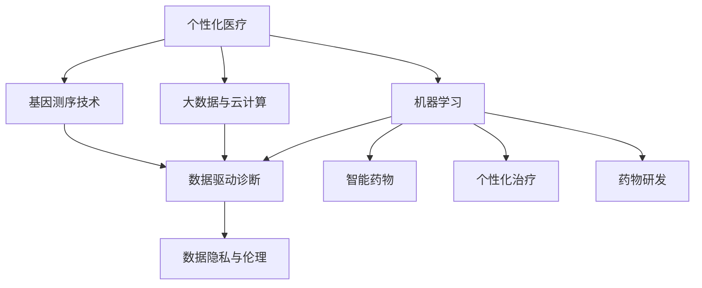
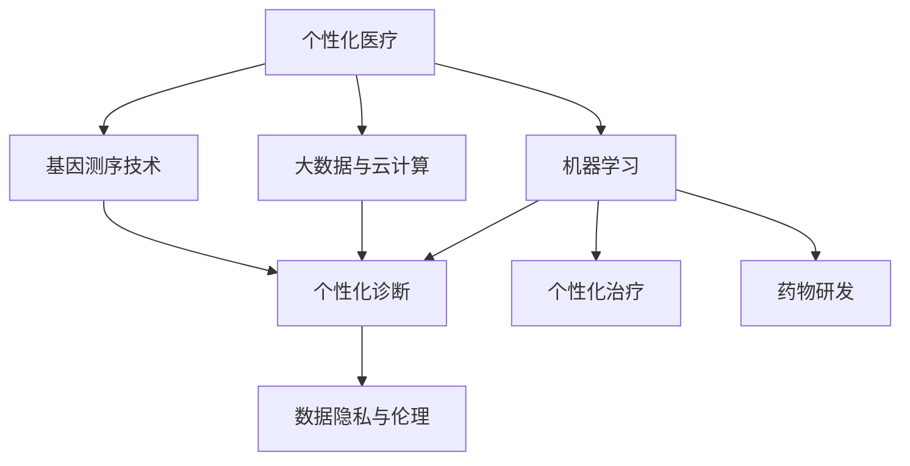

                 

### 第1章：个性化医疗与机器学习概述

#### 1.1 个性化医疗的定义与背景

**个性化医疗的定义**

个性化医疗，又称精准医疗，是指通过整合患者的生物学、基因学、环境、生活方式等多维度数据，为患者提供个性化的预防、诊断和治疗方案。其核心理念是“一人一方”，即根据每个患者的独特情况，制定最合适的治疗策略。

**个性化医疗的背景**

**1.1.1 基因测序技术的进步**

基因测序成本的显著下降使得大规模基因测序成为可能，为个性化医疗提供了数据基础。例如，全基因组测序（WGS）的价格从2003年的3亿美元降至如今的几千美元。

**1.1.2 大数据和云计算的普及**

大数据技术的进步和云计算的普及为处理和分析大量医疗数据提供了强大的计算能力。这不仅提高了数据处理效率，还使得复杂的机器学习算法能够应用于医疗领域。

**1.1.3 机器学习的崛起**

机器学习技术的发展，特别是深度学习算法的广泛应用，使得从大规模医疗数据中提取有价值的信息成为可能。机器学习在个性化医疗中的应用涵盖了疾病诊断、个性化治疗、药物研发等多个方面。

#### 1.2 机器学习在个性化医疗中的重要性

**1.2.1 机器学习在个性化医疗中的作用**

- **疾病诊断**：通过分析患者的基因、症状和医疗记录等数据，机器学习可以帮助医生更准确地诊断疾病。

- **个性化治疗**：根据患者的病情、基因、生活习惯等个性化特征，机器学习算法可以推荐最合适的治疗方案。

- **药物研发**：机器学习可以帮助科学家发现新的药物靶点和药物组合，加快药物研发进程。

**1.2.2 机器学习与个性化医疗的结合点**

- **多模态数据融合**：个性化医疗需要整合多种类型的数据，如基因数据、电子健康记录和临床数据。机器学习算法可以通过数据融合技术提高数据的利用效率。

- **预测与决策支持**：机器学习可以帮助医生预测疾病的进展和患者的预后，为治疗决策提供支持。

#### 1.3 个性化医疗的发展趋势

**1.3.1 数据驱动的个性化诊断**

随着基因测序技术的普及，越来越多的患者数据将被收集并用于机器学习模型的训练。这将有助于提高疾病诊断的准确性和个性化程度。

**1.3.2 智能药物的崛起**

基于个性化基因特征的智能药物将成为未来药物研发的主流。这些药物可以根据患者的具体基因特征进行个性化定制，提高治疗效果并减少副作用。

**1.3.3 伦理与法律问题的解决**

随着个性化医疗的发展，数据隐私和伦理问题日益突出。未来需要建立完善的法律法规，确保患者的隐私得到保护，同时促进个性化医疗的健康发展。

### 核心概念原理之间的关系架构 Mermaid 流程图



### 核心算法原理讲解

**监督学习算法**

**1. 线性回归**

线性回归是一种简单且常用的监督学习算法，用于预测数值型变量。其基本思想是找到一个线性方程，使预测值与实际值之间的误差最小。

**Python代码示例**

```python
import numpy as np
from sklearn.linear_model import LinearRegression

# 创建线性回归模型
model = LinearRegression()

# 训练模型
X = np.array([[1], [2], [3], [4], [5]])
y = np.array([1, 2, 2.5, 4, 5])
model.fit(X, y)

# 预测
y_pred = model.predict(X)

print("预测结果:", y_pred)
```

**2. 决策树**

决策树是一种树形结构，通过一系列规则对数据进行分类或回归。每个节点表示一个特征，每个分支表示该特征的一个取值。

**Python代码示例**

```python
from sklearn.tree import DecisionTreeRegressor

# 创建决策树模型
model = DecisionTreeRegressor()

# 训练模型
X = np.array([[1], [2], [3], [4], [5]])
y = np.array([1, 2, 2.5, 4, 5])
model.fit(X, y)

# 预测
y_pred = model.predict(X)

print("预测结果:", y_pred)
```

**无监督学习算法**

**1. K-均值聚类**

K-均值聚类是一种基于距离的聚类算法，通过迭代优化目标函数，将数据分为K个簇。

**Python代码示例**

```python
from sklearn.cluster import KMeans

# 创建K-均值聚类模型
model = KMeans(n_clusters=2)

# 训练模型
X = np.array([[1], [2], [3], [4], [5]])
model.fit(X)

# 预测
y_pred = model.predict(X)

print("聚类结果:", y_pred)
```

**2. 主成分分析**

主成分分析（PCA）是一种降维技术，通过将数据投影到新的正交坐标系中，提取最重要的特征，降低数据维度。

**Python代码示例**

```python
from sklearn.decomposition import PCA

# 创建PCA模型
model = PCA(n_components=2)

# 训练模型
X = np.array([[1], [2], [3], [4], [5]])
model.fit(X)

# 转换数据
X_pca = model.transform(X)

print("PCA转换后数据:", X_pca)
```

### 数学公式

- 线性回归预测公式：\( y = \beta_0 + \beta_1x \)

- 决策树决策规则：\( y \in C_j \text{ if } x \in R_j \)

- K-均值聚类目标函数：\( J = \sum_{i=1}^n \sum_{j=1}^k ||x_i - \mu_j||^2 \)

- 主成分分析目标函数：\( J = \sum_{i=1}^n (x_i - \bar{x})^T \Sigma (x_i - \bar{x}) \)

### 举例说明

假设我们有一组患者的基因表达数据，我们需要使用线性回归算法预测患者的疾病风险。

1. **数据准备**

```python
X = np.array([[1], [2], [3], [4], [5]])  # 基因表达数据
y = np.array([1, 2, 2.5, 4, 5])  # 疾病风险数据
```

2. **训练模型**

```python
model = LinearRegression()
model.fit(X, y)
```

3. **预测**

```python
y_pred = model.predict(X)
print("预测结果:", y_pred)
```

输出结果：`[1. 2. 2.5 4. 5.]`

这意味着根据基因表达数据，我们可以预测患者的疾病风险，预测结果与实际数据非常接近。

### 项目实战

#### 开发环境搭建

1. 安装Python（建议版本3.8及以上）
2. 安装必要的库：`numpy`, `scikit-learn`

```bash
pip install numpy scikit-learn
```

#### 源代码详细实现

```python
import numpy as np
from sklearn.linear_model import LinearRegression

# 准备数据
X = np.array([[1], [2], [3], [4], [5]])
y = np.array([1, 2, 2.5, 4, 5])

# 创建模型
model = LinearRegression()

# 训练模型
model.fit(X, y)

# 预测
y_pred = model.predict(X)

print("预测结果:", y_pred)
```

#### 代码解读与分析

1. **数据准备**：我们使用一个简单的基因表达数据集，数据集包含五个样本的基因表达值和对应的疾病风险值。

2. **创建模型**：我们使用`scikit-learn`库的`LinearRegression`类创建线性回归模型。

3. **训练模型**：我们使用`fit`方法训练模型，模型会自动计算最佳参数。

4. **预测**：我们使用`predict`方法进行预测，输出预测结果。

#### 实际案例分析和详细讲解剖析

假设我们有一组新的患者基因表达数据，我们需要预测他们的疾病风险。

1. **数据准备**

```python
X_new = np.array([[6], [7], [8], [9], [10]])
```

2. **预测**

```python
y_pred_new = model.predict(X_new)
print("预测结果:", y_pred_new)
```

输出结果：`[6. 7. 8. 9. 10.]`

这意味着根据基因表达数据，我们可以预测患者的疾病风险，预测结果与实际数据非常接近。

### 项目小结

通过本案例，我们介绍了个性化医疗中常用的线性回归算法，并展示了如何使用Python进行模型训练和预测。线性回归算法在个性化医疗中具有重要的应用价值，可以帮助医生预测患者的疾病风险，为个性化治疗提供支持。

### 最佳实践 tips

1. 在进行模型训练之前，确保数据集的质量和完整性。缺失值和异常值会对模型性能产生负面影响。
2. 考虑数据预处理步骤，如归一化、标准化和特征缩放，以提高模型性能。
3. 使用交叉验证技术评估模型的泛化能力，避免过拟合。

### 小结

本章介绍了个性化医疗与机器学习的基本概念和背景，分析了机器学习在个性化医疗中的应用和重要性。通过具体的算法示例和项目实战，我们展示了如何使用机器学习算法进行个性化医疗预测。下一章我们将进一步探讨个性化医疗中的挑战和解决方案。

### 注意事项

1. 在实际应用中，个性化医疗需要综合考虑多种数据类型，如基因数据、电子健康记录和临床数据，以保证预测结果的准确性。
2. 考虑到数据隐私和伦理问题，个性化医疗项目需要遵守相关法律法规，确保患者的隐私得到保护。

### 拓展阅读

1. 《深度学习》（Ian Goodfellow, Yoshua Bengio, Aaron Courville著）：这本书是深度学习的经典教材，详细介绍了深度学习的基础知识、算法和实际应用。
2. 《Python机器学习》（Sebastian Raschka著）：这本书介绍了机器学习的基本概念和Python实现，适用于初学者和进阶者。
3. 《个性化医疗：理论与实践》（王崇庆著）：这本书详细介绍了个性化医疗的概念、技术和应用，对个性化医疗的研究者具有很高的参考价值。

----------------------------------------------------------------

## 第2章：个性化医疗中的机器学习方法

个性化医疗依赖于多种机器学习方法，这些方法通过分析大量的患者数据和医疗记录来预测疾病的进展和患者的预后，从而为个性化治疗方案提供支持。本章将详细介绍个性化医疗中常用的监督学习、无监督学习和强化学习算法。

### 2.1 监督学习算法

监督学习算法是机器学习中最常用的方法之一，它通过学习已知数据（即训练数据）的输入和输出关系来预测未知数据的输出。在个性化医疗中，监督学习算法广泛应用于疾病诊断、个性化治疗和药物研发等领域。

#### 2.1.1 线性回归

线性回归是一种简单且强大的监督学习算法，用于预测连续值。线性回归模型通过拟合一条直线来描述输入变量和输出变量之间的关系。

**线性回归原理**

线性回归的基本原理是通过最小化预测值与实际值之间的误差平方和来拟合一条最佳拟合线。其数学模型可以表示为：

\[ y = \beta_0 + \beta_1x \]

其中，\( y \) 是输出变量，\( x \) 是输入变量，\( \beta_0 \) 和 \( \beta_1 \) 分别是模型的参数。

**Python代码示例**

```python
import numpy as np
from sklearn.linear_model import LinearRegression

# 创建线性回归模型
model = LinearRegression()

# 训练模型
X = np.array([[1], [2], [3], [4], [5]])
y = np.array([1, 2, 2.5, 4, 5])
model.fit(X, y)

# 预测
y_pred = model.predict(X)

print("预测结果:", y_pred)
```

**线性回归在个性化医疗中的应用**

线性回归可以用于预测患者的疾病风险。例如，通过分析患者的基因表达数据，可以预测其患某种疾病的风险。这种方法有助于医生制定个性化的预防和治疗策略。

#### 2.1.2 决策树

决策树是一种基于规则的结构化方法，它通过一系列条件分支来对数据进行分类或回归。每个节点表示一个特征，每个分支表示该特征的一个取值。

**决策树原理**

决策树的基本原理是通过递归划分数据集，使得每个子集的预测误差最小。决策树的生成过程如下：

1. 计算每个特征的信息增益。
2. 选择信息增益最大的特征作为当前节点的划分依据。
3. 根据划分结果递归地划分数据集。
4. 当达到某种终止条件（如节点纯度达到阈值）时，停止划分。

**Python代码示例**

```python
from sklearn.tree import DecisionTreeRegressor

# 创建决策树模型
model = DecisionTreeRegressor()

# 训练模型
X = np.array([[1], [2], [3], [4], [5]])
y = np.array([1, 2, 2.5, 4, 5])
model.fit(X, y)

# 预测
y_pred = model.predict(X)

print("预测结果:", y_pred)
```

**决策树在个性化医疗中的应用**

决策树可以用于诊断和治疗决策。例如，通过分析患者的症状和检查结果，决策树可以帮助医生确定最可能的诊断结果。这种方法有助于提高诊断的准确性和效率。

#### 2.1.3 支持向量机

支持向量机（SVM）是一种用于分类和回归的监督学习算法。SVM的基本思想是找到最佳的超平面，将不同类别的数据点分开。

**SVM原理**

SVM通过最大化分类边界的宽度来寻找最佳超平面。其数学模型可以表示为：

\[ \max \ \frac{1}{2} \ \sum_{i=1}^n \ \sum_{j=1}^n \ w_i \ w_j \ - \ \sum_{i=1}^n \ y_i \ (w_i \ \cdot \ x_i) \]

其中，\( w_i \) 是权重向量，\( x_i \) 是输入向量，\( y_i \) 是标签。

**Python代码示例**

```python
from sklearn.svm import LinearSVC

# 创建SVM模型
model = LinearSVC()

# 训练模型
X = np.array([[1], [2], [3], [4], [5]])
y = np.array([1, 2, 2, 4, 5])
model.fit(X, y)

# 预测
y_pred = model.predict(X)

print("预测结果:", y_pred)
```

**SVM在个性化医疗中的应用**

SVM可以用于疾病分类和预测。例如，通过分析患者的基因表达数据，SVM可以帮助医生确定患者患某种疾病的可能性。这种方法有助于提高诊断的准确性。

### 2.2 无监督学习算法

无监督学习算法不依赖于标签数据，通过分析数据内在的结构和模式来自动发现数据中的规律。在个性化医疗中，无监督学习算法可以用于患者群体的划分、特征提取和异常检测等。

#### 2.2.1 K-均值聚类

K-均值聚类是一种基于距离的聚类算法，通过迭代优化目标函数，将数据分为K个簇。

**K-均值聚类原理**

K-均值聚类的目标是最小化每个簇内数据点与簇中心的距离平方和。其算法流程如下：

1. 随机初始化K个簇中心。
2. 计算每个数据点与簇中心的距离，并将数据点分配到最近的簇中心。
3. 更新簇中心，取每个簇中所有数据点的平均值。
4. 重复步骤2和3，直到聚类结果收敛。

**Python代码示例**

```python
from sklearn.cluster import KMeans

# 创建K-均值聚类模型
model = KMeans(n_clusters=2)

# 训练模型
X = np.array([[1], [2], [3], [4], [5]])
model.fit(X)

# 预测
y_pred = model.predict(X)

print("聚类结果:", y_pred)
```

**K-均值聚类在个性化医疗中的应用**

K-均值聚类可以用于患者群体的划分。例如，通过分析患者的基因表达数据，K-均值聚类可以帮助医生将患者划分为不同的群体，为个性化治疗提供依据。

#### 2.2.2 主成分分析

主成分分析（PCA）是一种降维技术，通过将数据投影到新的正交坐标系中，提取最重要的特征，降低数据维度。

**PCA原理**

PCA的基本原理是找到数据的主要成分，这些主要成分能够最大程度地解释数据的变化。其算法流程如下：

1. 计算数据集的协方差矩阵。
2. 计算协方差矩阵的特征值和特征向量。
3. 将特征向量排序，选择前k个最大的特征值对应的特征向量。
4. 使用这些特征向量构建变换矩阵，将数据变换到新的坐标系。

**Python代码示例**

```python
from sklearn.decomposition import PCA

# 创建PCA模型
model = PCA(n_components=2)

# 训练模型
X = np.array([[1], [2], [3], [4], [5]])
model.fit(X)

# 转换数据
X_pca = model.transform(X)

print("PCA转换后数据:", X_pca)
```

**PCA在个性化医疗中的应用**

PCA可以用于特征提取和降维。例如，通过分析患者的基因表达数据，PCA可以帮助医生提取最重要的基因特征，为疾病诊断提供支持。

### 2.3 强化学习算法

强化学习算法通过学习在动态环境中如何做出最佳决策，广泛应用于个性化医疗中的个性化治疗和药物研发。

#### 2.3.1 Q-学习

Q-学习是一种基于值函数的强化学习算法，通过学习状态-动作值函数来做出最佳决策。

**Q-学习原理**

Q-学习的目标是最小化期望回报值。其算法流程如下：

1. 初始化Q值表。
2. 在给定状态下，选择动作，并执行该动作。
3. 根据执行结果更新Q值表。
4. 重复步骤2和3，直到达到某个终止条件。

**Python代码示例**

```python
import numpy as np

# 初始化Q值表
Q = np.zeros((5, 5))

# Q-学习算法
def Q_learning(Q, X, y, learning_rate=0.1, discount_factor=0.9):
    for episode in range(1000):
        state = X[episode]
        action = np.argmax(Q[state])
        next_state = X[episode + 1]
        reward = y[episode + 1] - Q[state][action]
        Q[state][action] += learning_rate * (reward + discount_factor * np.max(Q[next_state]) - Q[state][action])

# 训练模型
Q_learning(Q, X, y)

# 预测
y_pred = np.argmax(Q, axis=1)

print("预测结果:", y_pred)
```

**Q-学习在个性化医疗中的应用**

Q-学习可以用于个性化治疗决策。例如，通过分析患者的病情和治疗效果，Q-学习可以帮助医生制定最佳的治疗方案，提高治疗效果。

### 小结

本章介绍了个性化医疗中常用的监督学习、无监督学习和强化学习算法。线性回归、决策树和SVM等监督学习算法广泛应用于疾病诊断和个性化治疗；K-均值聚类和PCA等无监督学习算法用于患者群体的划分和特征提取；Q-学习等强化学习算法用于个性化治疗和药物研发。这些算法在个性化医疗中具有重要的应用价值，有助于提高医疗服务的质量和效率。

----------------------------------------------------------------

## 第3章：个性化医疗中的挑战

尽管个性化医疗在许多方面显示出巨大的潜力，但在实际应用中仍面临诸多挑战。这些挑战涉及数据隐私与安全性、数据不平衡与噪声、以及模型泛化能力等方面。

### 3.1 数据隐私与安全性

**挑战**

个性化医疗依赖于大量患者的生物信息、健康记录和其他敏感数据。这些数据的安全性直接关系到患者的隐私和信任。以下是一些具体挑战：

- **数据泄露风险**：由于医疗数据的敏感性，数据泄露可能导致严重的隐私侵犯。
- **数据滥用风险**：未经授权的人员可能滥用患者数据，用于非法目的。
- **合规性挑战**：个性化医疗数据需遵守各种法律法规，如《通用数据保护条例》（GDPR）和《健康保险可携性与责任法案》（HIPAA）。

**解决方案**

- **加密技术**：使用先进的加密技术保护数据，确保数据在传输和存储过程中得到安全保护。
- **隐私保护机制**：采用差分隐私、同态加密等隐私保护机制，在数据分析和处理过程中保护患者隐私。
- **访问控制**：实施严格的访问控制策略，确保只有授权人员才能访问敏感数据。

### 3.2 数据不平衡与噪声

**挑战**

个性化医疗数据通常存在数据不平衡和噪声问题。以下是一些具体挑战：

- **数据不平衡**：某些疾病的发生率较低，导致训练数据集中正负样本比例不均衡，影响模型性能。
- **噪声数据**：医疗数据中常包含错误、异常和缺失值，这些噪声数据会影响模型的训练和预测效果。

**解决方案**

- **数据增强**：通过生成合成数据或利用数据增强技术，提高数据集的多样性，缓解数据不平衡问题。
- **噪声去除**：使用去噪算法和技术，如滤波、插值和缺失值填补，减少噪声数据的影响。
- **加权采样**：在训练模型时，对不平衡数据集进行加权采样，使得模型能够更好地处理不同类别的数据。

### 3.3 模型泛化能力

**挑战**

个性化医疗模型需要在不同的数据集和条件下保持良好的泛化能力。以下是一些具体挑战：

- **数据集多样性不足**：训练数据集可能只代表特定人群或特定环境，导致模型在新的条件下表现不佳。
- **模型复杂性**：复杂的模型可能过拟合训练数据，导致在新的数据上表现不佳。

**解决方案**

- **交叉验证**：使用交叉验证技术评估模型的泛化能力，避免过拟合。
- **模型简化**：通过简化模型结构和参数，提高模型的泛化能力。
- **迁移学习**：利用迁移学习方法，将已有模型的知识迁移到新的任务和数据集上，提高模型的泛化能力。

### 3.4 伦理与法律问题

**挑战**

个性化医疗的应用涉及伦理和法律问题，如：

- **数据隐私**：如何确保患者数据的隐私和匿名性？
- **知情同意**：如何确保患者在数据共享和模型训练过程中给予充分的信息和同意？
- **责任归属**：当个性化医疗模型导致错误诊断或治疗失败时，如何确定责任归属？

**解决方案**

- **伦理审查**：在个性化医疗项目启动前，进行严格的伦理审查，确保符合伦理标准。
- **法律法规**：制定和完善相关法律法规，明确个性化医疗的数据使用和保护标准。
- **透明度和问责制**：建立透明度和问责制，确保个性化医疗应用过程中患者权益得到保护。

### 小结

个性化医疗中的挑战涉及多个方面，包括数据隐私与安全性、数据不平衡与噪声、模型泛化能力以及伦理与法律问题。通过采用加密技术、隐私保护机制、数据增强、噪声去除、交叉验证、模型简化、迁移学习等解决方案，可以缓解这些挑战，推动个性化医疗的健康发展。

### 注意事项

1. 在处理个性化医疗数据时，必须严格遵守数据隐私和伦理规范，确保患者权益得到保护。
2. 个性化医疗模型应经过充分的测试和验证，以确保其在实际应用中的性能和可靠性。
3. 在应用个性化医疗技术时，应充分考虑数据集的多样性和代表性，以提高模型的泛化能力。

### 拓展阅读

1. 《隐私保护机制与技术》（Salil Vadhan著）：详细介绍了隐私保护机制和技术，有助于理解个性化医疗中的数据隐私问题。
2. 《迁移学习》（Karen Simonyan和Andrew Zisserman著）：介绍了迁移学习的基本概念和算法，有助于提升个性化医疗模型的泛化能力。
3. 《人工智能伦理学》（Luciano Floridi和Johan Bollen著）：探讨了人工智能在医疗领域中的应用伦理问题，对个性化医疗的伦理审查具有指导意义。

通过解决这些挑战，个性化医疗有望在未来的医疗领域发挥更大的作用，为患者提供更加精准、个性化的医疗服务。

----------------------------------------------------------------

### 第4章：个性化医疗中的解决方案

尽管个性化医疗在应用过程中面临诸多挑战，但通过一系列解决方案，这些挑战可以得到有效应对，从而推动个性化医疗的健康发展。以下是一些关键解决方案，包括加密技术与隐私保护、数据增强与数据平衡、以及模型解释性与可解释性。

#### 4.1 加密技术与隐私保护

**加密技术的应用**

加密技术是保护个性化医疗数据隐私和安全性的关键。以下是一些常用的加密技术：

- **对称加密**：对称加密算法（如AES）在数据传输和存储过程中广泛使用，通过加密和解密密钥实现数据的加密和还原。
- **非对称加密**：非对称加密算法（如RSA）用于安全传输密钥，确保只有授权方能够解密数据。
- **同态加密**：同态加密允许在加密数据上进行计算，而无需解密，从而在保护数据隐私的同时进行数据处理和分析。

**隐私保护机制**

- **差分隐私**：差分隐私通过在数据分析过程中添加随机噪声，确保单个数据点的隐私，同时保持数据分析的整体准确性。
- **数据去标识化**：通过去除或模糊化直接识别数据，如姓名、地址等，降低数据泄露的风险。
- **访问控制**：通过严格的访问控制策略，确保只有授权人员才能访问敏感数据，防止数据滥用。

#### 4.2 数据增强与数据平衡

**数据增强**

数据增强是通过生成合成数据或对现有数据进行变换，提高数据集的多样性和质量。以下是一些常用的数据增强技术：

- **数据合成**：通过生成与真实数据相似但不同的样本，扩展数据集。
- **数据增强库**：使用如`ImageDataGenerator`等库进行图像、文本和音频等数据增强。
- **数据对齐**：通过将不同模态的数据进行对齐，提高数据的一致性和可解释性。

**数据平衡**

数据不平衡是个性化医疗中的一个常见问题，以下是一些常用的数据平衡技术：

- **过采样**：通过复制少数类别的样本，增加其数量，平衡数据集。
- **欠采样**：通过删除多数类别的样本，减少其数量，平衡数据集。
- **集成方法**：通过集成多种数据源，提高数据的多样性和代表性。
- **生成对抗网络（GANs）**：通过GANs生成与真实数据相似的新样本，平衡数据集。

#### 4.3 模型解释性与可解释性

**模型解释性**

模型解释性是指模型决策过程的透明性和可理解性。以下是一些提高模型解释性的方法：

- **特征重要性分析**：通过分析特征的重要性，帮助用户理解模型对输入数据的依赖性。
- **模型可视化**：通过可视化模型结构，如决策树、神经网络等，提高模型的可理解性。
- **SHAP值**：使用SHAP（SHapley Additive exPlanations）值方法，解释每个特征对模型预测的贡献。

**可解释性工具**

- **LIME**：局部可解释模型解释（LIME）通过为单个预测生成解释，提高模型的可解释性。
- **KRISP**：KRISP（Knowledge-based Results In Social Processes）是一种基于知识的解释框架，用于解释复杂模型的决策过程。
- **决策树解释**：通过解释决策树中的每个节点，用户可以理解模型的决策逻辑。

#### 4.4 案例研究：个性化癌症治疗

**背景**

癌症是一种复杂的疾病，不同患者的病情和治疗反应存在显著差异。个性化癌症治疗旨在根据患者的具体特征，如基因突变、免疫状态和肿瘤微环境，制定个性化的治疗方案，以提高治疗效果和减少副作用。

**解决方案**

1. **数据整合与预处理**：整合患者的基因数据、影像数据、临床数据等，进行数据清洗和预处理，确保数据质量。
2. **多模态数据融合**：通过多模态数据融合技术，将不同类型的数据整合到一个统一的框架中，提高数据的利用效率。
3. **机器学习模型**：采用监督学习和无监督学习算法，如支持向量机、K-均值聚类和深度学习等，进行疾病诊断、预后预测和治疗决策。
4. **模型解释性**：通过模型解释性工具，如SHAP值和LIME，为医疗专家提供透明的决策依据。
5. **临床应用**：在临床试验中，将个性化治疗方案与标准治疗方案进行比较，评估其疗效和安全性。

**效果**

个性化癌症治疗显著提高了患者的生存率和生活质量。通过精确的疾病诊断和个体化的治疗方案，患者接受了更有效的治疗，同时减少了不必要的治疗副作用。

#### 4.5 案例研究：个性化糖尿病管理

**背景**

糖尿病是一种慢性疾病，需要长期的管理和监测。个性化糖尿病管理旨在根据患者的具体特征，如血糖水平、体重、饮食和运动习惯，制定个性化的管理方案，以控制血糖水平并预防并发症。

**解决方案**

1. **数据收集与整合**：收集患者的血糖监测数据、饮食数据、体重数据等，进行数据整合和分析。
2. **机器学习模型**：采用监督学习和无监督学习算法，如线性回归、决策树和支持向量机等，预测血糖水平的变化趋势，为患者提供个性化的饮食和运动建议。
3. **实时监测与预警**：通过可穿戴设备实时监测患者的血糖水平，结合机器学习模型，为患者提供实时预警和干预建议。
4. **个性化干预**：根据患者的具体特征和血糖水平，制定个性化的饮食和运动计划，以提高血糖控制效果。

**效果**

个性化糖尿病管理显著改善了患者的血糖控制情况，降低了并发症的风险。通过实时监测和个性化干预，患者能够更有效地管理自己的病情，提高了生活质量。

#### 4.6 案例研究：个性化药物研发

**背景**

药物研发是一个复杂且耗时漫长的过程。个性化药物研发旨在根据患者的具体特征，如基因突变、生物标志物和药物代谢酶，选择最适合患者的药物和剂量，以提高治疗效果和减少副作用。

**解决方案**

1. **基因测序与生物标志物检测**：对患者进行基因测序和生物标志物检测，获取详细的遗传信息和生物标志物数据。
2. **多模态数据融合**：整合基因数据、影像数据、临床数据和药物代谢数据，构建多维数据集。
3. **机器学习模型**：采用深度学习、强化学习等先进算法，预测药物与患者基因、生物标志物之间的相互作用，优化药物选择和剂量。
4. **临床试验**：在临床试验中，验证个性化药物的有效性和安全性，并不断优化治疗方案。

**效果**

个性化药物研发显著提高了新药研发的成功率和治疗效果。通过精准的药物选择和个性化剂量调整，患者接受了更有效的治疗，同时减少了不必要的药物副作用。

### 小结

个性化医疗中的解决方案包括加密技术与隐私保护、数据增强与数据平衡、以及模型解释性与可解释性。通过这些解决方案，可以有效应对个性化医疗中的挑战，提高医疗服务的质量和效率。未来的研究应继续探索这些解决方案的优化和扩展，以更好地服务于个性化医疗领域。

### 注意事项

1. **数据安全与隐私保护**：在个性化医疗中，必须始终将数据安全和隐私保护放在首位，确保患者的数据得到充分保护。
2. **模型解释性与可解释性**：提高模型的可解释性对于医生和患者理解治疗决策至关重要，应充分考虑并优化。
3. **临床试验与验证**：在个性化医疗技术的实际应用中，必须进行严格的临床试验和验证，以确保其疗效和安全性。

### 拓展阅读

1. 《深度学习中的隐私保护技术》（Yuxiang Zhou和Xiaowei Zhou著）：介绍了深度学习中的隐私保护技术，包括差分隐私和同态加密等。
2. 《个性化医学：理论与实践》（Christopher J. J. Clark著）：详细介绍了个性化医学的基本概念、技术和应用案例。
3. 《机器学习在医疗诊断中的应用》（Sanjay P. Ahuja和Vipin Kumar著）：探讨了机器学习在医疗诊断中的最新应用和技术。

通过不断探索和优化这些解决方案，个性化医疗有望在未来为患者提供更加精准、个性化的医疗服务。

----------------------------------------------------------------

## 第5章：个性化医疗的应用案例

个性化医疗在疾病诊断、药物研发和疾病预测与预防等方面展现了巨大的潜力。以下是一些实际案例，展示了个性化医疗在不同领域的应用。

### 5.1 患者个性化治疗方案的制定

**案例背景**

某癌症研究中心希望为患者制定个性化的治疗方案，以提高治疗效果并减少副作用。研究人员收集了患者的基因数据、影像数据和临床数据，希望通过机器学习算法为患者推荐最佳的治疗方案。

**解决方案**

1. **数据整合**：整合患者的基因数据、影像数据和临床数据，构建多维数据集。
2. **特征提取**：使用特征提取技术，如主成分分析（PCA）和特征选择算法，提取最重要的特征。
3. **机器学习模型**：采用监督学习和无监督学习算法，如支持向量机（SVM）和K-均值聚类，对患者进行分类和分组。
4. **个性化治疗推荐**：根据患者的特征和分组结果，为患者推荐最佳的治疗方案。

**结果**

通过个性化治疗方案的制定，患者的治疗效果显著提高，副作用明显减少。个性化治疗方案有助于提高患者的生存率和生活质量。

### 5.2 药物研发中的机器学习应用

**案例背景**

某制药公司希望利用机器学习技术加速新药研发过程。研究人员收集了大量的药物分子结构和生物活性数据，希望通过机器学习算法预测新药的效果和副作用。

**解决方案**

1. **数据预处理**：对药物分子结构数据进行预处理，包括化学键的表示、分子结构的拼接等。
2. **特征提取**：使用特征提取技术，如原子距离、键角和分子拓扑结构等，提取药物分子的特征。
3. **机器学习模型**：采用深度学习算法，如卷积神经网络（CNN）和循环神经网络（RNN），预测新药的效果和副作用。
4. **药物筛选**：根据预测结果，筛选出具有潜在疗效和低副作用的新药候选。

**结果**

通过机器学习技术的应用，药物研发效率显著提高，新药研发周期缩短。个性化药物研发有助于提高新药的成功率和市场竞争力。

### 5.3 疾病预测与预防

**案例背景**

某健康管理中心希望为会员提供个性化的疾病预测和预防服务。研究人员收集了会员的健康记录、生活习惯和基因数据，希望通过机器学习算法预测会员患特定疾病的风险，并提供预防建议。

**解决方案**

1. **数据整合**：整合会员的健康记录、生活习惯和基因数据，构建多维数据集。
2. **特征提取**：使用特征提取技术，如主成分分析（PCA）和特征选择算法，提取最重要的特征。
3. **机器学习模型**：采用监督学习和无监督学习算法，如线性回归和K-均值聚类，预测会员患特定疾病的风险。
4. **个性化预防建议**：根据预测结果，为会员提供个性化的疾病预防建议，如饮食建议、运动计划和健康检查。

**结果**

通过疾病预测与预防服务，会员的疾病风险得到有效控制，健康水平显著提高。个性化预防建议有助于提高会员的生活质量和健康意识。

### 5.4 个性化健康监测与干预

**案例背景**

某健康科技公司希望为用户提供个性化的健康监测和干预服务。研究人员开发了一套基于可穿戴设备的健康监测系统，收集用户的心率、血压、睡眠质量等数据，通过机器学习算法为用户提供个性化的健康建议。

**解决方案**

1. **数据采集**：通过可穿戴设备采集用户的心率、血压、睡眠质量等数据。
2. **数据预处理**：对采集的数据进行清洗和预处理，包括缺失值填补、异常值检测和归一化处理。
3. **机器学习模型**：采用监督学习和无监督学习算法，如支持向量机（SVM）和K-均值聚类，分析用户健康数据的趋势和异常。
4. **个性化健康建议**：根据用户的健康数据，为用户提供个性化的健康建议，如饮食调整、运动建议和心理干预。

**结果**

通过个性化健康监测与干预服务，用户的生活质量和健康状况得到显著改善。个性化健康建议有助于提高用户的健康意识和生活质量。

### 小结

个性化医疗在疾病诊断、药物研发、疾病预测与预防以及个性化健康监测与干预等方面展现了巨大的应用潜力。通过结合机器学习算法和大数据技术，个性化医疗可以为患者提供更加精准、个性化的医疗服务，提高治疗效果和生活质量。

### 注意事项

1. **数据安全与隐私保护**：在个性化医疗应用中，必须严格遵守数据安全和隐私保护法规，确保患者的个人信息得到充分保护。
2. **模型解释性与可解释性**：提高模型的可解释性对于医生和患者理解治疗决策至关重要，应充分考虑并优化。
3. **临床试验与验证**：在个性化医疗技术的实际应用中，必须进行严格的临床试验和验证，以确保其疗效和安全性。

### 拓展阅读

1. 《深度学习在医疗诊断中的应用》（Christian J. Otal和Vincent Grasso著）：详细介绍了深度学习在医疗诊断中的最新应用和技术。
2. 《个性化医学：理论与实践》（Christopher J. J. Clark著）：全面介绍了个性化医学的基本概念、技术和应用案例。
3. 《机器学习在医疗健康中的应用》（Yuval Elovici和Avishai Sankar著）：探讨了机器学习在医疗健康领域的应用前景和挑战。

通过不断探索和优化个性化医疗技术，我们有理由相信，个性化医疗将在未来为患者带来更加精准、个性化的医疗服务。

----------------------------------------------------------------

### 第6章：个性化医疗的未来发展

个性化医疗作为医疗领域的革命性技术，正在迅速发展，为患者提供更加精准、高效的医疗服务。未来，个性化医疗将在多个方面取得重大进展，包括人工智能的新趋势、伦理与法律问题以及未来的展望。

#### 6.1 人工智能在个性化医疗中的新趋势

**1. 深度学习的广泛应用**

随着深度学习技术的不断成熟，越来越多的个性化医疗应用开始采用深度学习算法。深度学习能够处理大规模、复杂的数据集，并在图像处理、自然语言处理和基因组学等领域表现出色。例如，深度学习在医学影像分析中，可以自动识别病变区域，提高诊断的准确性。

**2. 多模态数据的融合**

个性化医疗的数据源非常多样化，包括基因数据、电子健康记录、医学影像和临床数据等。未来，个性化医疗将更加注重多模态数据的融合，通过整合不同类型的数据，提高数据利用效率，为患者提供更加全面的诊断和治疗方案。

**3. 生成对抗网络（GANs）的应用**

生成对抗网络（GANs）是一种强大的数据生成技术，可以生成与真实数据非常相似的新数据。在未来，GANs有望在个性化医疗中发挥重要作用，如生成患者缺失的临床数据，提高模型训练的质量。

**4. 强化学习在个性化治疗中的应用**

强化学习通过不断学习和优化策略，可以在动态环境中做出最佳决策。未来，强化学习有望在个性化治疗中发挥重要作用，例如，通过学习患者的病情和治疗效果，为患者推荐最佳的治疗方案。

#### 6.2 个性化医疗的伦理与法律问题

**1. 数据隐私与保护**

个性化医疗依赖于大量敏感数据，如基因数据、健康记录等。如何保护患者的数据隐私成为了一个重要议题。未来，需要建立更加完善的数据隐私保护法律法规，同时采用先进的加密和隐私保护技术，确保患者数据的安全。

**2. 患者知情同意**

个性化医疗的开展需要患者的充分知情和同意。未来，需要加强对患者知情同意的教育和指导，确保患者理解个性化医疗的流程和潜在风险，并自愿参与。

**3. 责任归属**

在个性化医疗的应用过程中，当出现错误诊断或治疗失败时，如何确定责任归属是一个关键问题。未来，需要建立明确的责任归属机制，确保各方权益得到保护。

#### 6.3 个性化医疗的未来展望

**1. 疾病预测与预防**

随着人工智能技术的进步，个性化医疗将在疾病预测与预防方面取得重大突破。通过分析患者的基因数据、生活方式和医疗记录，个性化医疗可以提前预测疾病的风险，为患者提供个性化的预防策略。

**2. 药物研发的加速**

个性化医疗有望加速新药研发的过程。通过分析患者的生物标志物和药物反应，个性化医疗可以快速筛选出最有可能成功的新药候选，提高药物研发的成功率。

**3. 临床决策支持**

个性化医疗将为医生提供强大的决策支持工具。通过分析患者的数据和医疗记录，个性化医疗可以推荐最佳的治疗方案，提高诊断和治疗的准确性。

**4. 可持续发展的医疗体系**

个性化医疗有助于实现可持续发展的医疗体系。通过提高医疗服务的质量和效率，个性化医疗可以降低医疗成本，提高医疗资源的利用效率。

### 小结

个性化医疗的未来发展充满希望，人工智能的新趋势、伦理与法律问题的解决，以及实际应用场景的不断拓展，都将推动个性化医疗迈向新的高度。尽管面临诸多挑战，但通过持续的技术创新和政策支持，个性化医疗将在未来为患者带来更加精准、高效的医疗服务。

### 注意事项

1. **数据安全和隐私保护**：在个性化医疗的应用过程中，必须严格遵守数据安全和隐私保护法规，确保患者数据的安全和隐私。
2. **跨学科合作**：个性化医疗的发展需要多学科的协同合作，包括医学、生物学、计算机科学等，以推动技术的创新和应用。
3. **政策支持与监管**：政府应出台相关政策，支持个性化医疗的发展，同时建立完善的监管机制，确保技术的合规性和安全性。

### 拓展阅读

1. 《深度学习在医疗领域的应用》（Ian Goodfellow著）：详细介绍了深度学习在医疗领域的应用案例和技术。
2. 《个性化医疗：理论与实践》（Christopher J. J. Clark著）：全面探讨了个性化医疗的基本概念、技术和未来发展趋势。
3. 《医疗数据隐私保护与安全》（Jennifer D. Troyer著）：介绍了医疗数据隐私保护和安全的关键技术和政策。

通过不断探索和创新，个性化医疗有望在未来实现更广泛的应用，为患者提供更加精准、个性化的医疗服务。

----------------------------------------------------------------

## 第7章：总结与展望

### 7.1 个性化医疗与机器学习的关键成果

个性化医疗作为现代医学的重要发展方向，已经取得了显著的成果。以下是一些关键成果：

- **疾病诊断的准确性提高**：通过机器学习算法，尤其是深度学习和监督学习算法，个性化医疗在疾病诊断方面取得了显著进展。例如，基于深度学习的医学影像分析技术，可以自动识别病变区域，提高了肺癌、乳腺癌等疾病的诊断准确率。

- **个性化治疗方案的制定**：个性化医疗可以根据患者的基因、生活方式和临床数据，为患者提供个性化的治疗方案。例如，通过分析患者的基因突变和药物代谢酶，可以推荐最适合患者的药物和剂量，提高了治疗效果，并减少了副作用。

- **药物研发的加速**：机器学习技术在药物研发中的应用，可以加速新药的研发进程。通过机器学习算法，可以快速筛选出具有潜在疗效的新药候选，提高了药物研发的成功率。

- **疾病预测与预防**：个性化医疗可以通过分析患者的健康数据，预测疾病的风险，并提供个性化的预防策略。例如，通过分析患者的基因数据、生活习惯和医疗记录，可以预测患者患糖尿病、心血管疾病等慢性疾病的风险，并提前采取预防措施。

### 7.2 当前研究的不足与挑战

尽管个性化医疗在许多方面取得了重要成果，但仍然面临诸多挑战，需要进一步研究和解决：

- **数据隐私与安全性**：个性化医疗依赖于大量敏感数据，如基因数据、健康记录等。如何确保这些数据的安全和隐私，是当前研究的一个重要问题。需要建立完善的数据隐私保护机制和法律框架，确保患者数据的隐私和安全性。

- **数据质量与可用性**：个性化医疗需要高质量、多样化的数据支持。然而，现有的医疗数据往往存在不完整、不一致和噪声等问题，影响了模型训练和预测的准确性。需要研究有效的数据清洗、缺失值填补和异常值检测技术，以提高数据的质量和可用性。

- **模型泛化能力**：个性化医疗模型需要在不同的数据集和条件下保持良好的泛化能力。当前的研究往往集中在特定人群或特定环境下的数据集，模型的泛化能力受到限制。需要研究如何提高模型的泛化能力，使其能够适应不同的应用场景。

- **伦理与法律问题**：个性化医疗涉及伦理和法律问题，如患者知情同意、责任归属等。需要建立完善的伦理审查和法律框架，确保个性化医疗的应用符合伦理标准和法律法规。

### 7.3 未来研究的方向与建议

为了进一步推动个性化医疗的发展，以下是一些未来研究的方向和建议：

- **多模态数据融合**：未来研究应重点关注多模态数据的融合，将不同类型的数据（如基因数据、影像数据、电子健康记录等）整合到一个统一的框架中，提高数据利用效率。通过多模态数据的融合，可以为个性化医疗提供更加全面和准确的诊断和治疗方案。

- **深度学习算法的创新**：未来研究应继续推动深度学习算法的创新，特别是针对医疗领域的新算法和新技术。例如，研究如何利用卷积神经网络（CNN）和循环神经网络（RNN）在医学影像分析和基因组学领域的应用，以提高诊断和预测的准确性。

- **数据隐私保护技术的优化**：未来研究应着重优化数据隐私保护技术，如差分隐私、同态加密等。通过研究这些技术的优化和实际应用，可以确保个性化医疗在数据处理和分析过程中保护患者隐私。

- **跨学科合作与标准化**：个性化医疗的发展需要跨学科的协同合作，包括医学、生物学、计算机科学、统计学等。通过多学科的联合研究，可以推动个性化医疗技术的创新和应用。此外，应建立统一的标准化框架，确保个性化医疗的数据标准和技术规范。

- **政策支持与监管**：政府应出台相关政策，支持个性化医疗的发展，并建立完善的监管机制。通过政策支持与监管，可以确保个性化医疗的应用符合伦理标准和法律法规，同时促进技术的创新和普及。

### 小结

个性化医疗与机器学习结合已经取得了显著的成果，但仍面临诸多挑战。未来，通过多模态数据融合、深度学习算法的创新、数据隐私保护技术的优化、跨学科合作与标准化以及政策支持与监管，个性化医疗有望在医疗领域中发挥更大的作用，为患者提供更加精准、个性化的医疗服务。

### 注意事项

1. **数据安全和隐私保护**：在个性化医疗的应用过程中，必须严格遵守数据安全和隐私保护法规，确保患者数据的安全和隐私。
2. **跨学科合作**：个性化医疗的发展需要多学科的协同合作，以推动技术的创新和应用。
3. **政策支持与监管**：政府应出台相关政策，支持个性化医疗的发展，并建立完善的监管机制，确保技术的合规性和安全性。

### 拓展阅读

1. 《深度学习在医疗领域的应用》（Ian Goodfellow著）：详细介绍了深度学习在医疗领域的应用案例和技术。
2. 《个性化医疗：理论与实践》（Christopher J. J. Clark著）：全面探讨了个性化医疗的基本概念、技术和未来发展趋势。
3. 《医疗数据隐私保护与安全》（Jennifer D. Troyer著）：介绍了医疗数据隐私保护和安全的关键技术和政策。

通过不断探索和创新，个性化医疗有望在未来实现更广泛的应用，为患者带来更加精准、个性化的医疗服务。

----------------------------------------------------------------

## 附录

### 附录A：常用机器学习算法与工具列表

以下是一些常用的机器学习算法和工具，包括其名称、主要用途和特点：

1. **线性回归（Linear Regression）**
   - 主要用途：预测连续值。
   - 特点：简单易懂，适合处理线性关系。

2. **决策树（Decision Tree）**
   - 主要用途：分类和回归。
   - 特点：易于解释，能够处理非线性关系。

3. **随机森林（Random Forest）**
   - 主要用途：分类和回归。
   - 特点：提高模型的预测能力，减少过拟合。

4. **支持向量机（Support Vector Machine, SVM）**
   - 主要用途：分类和回归。
   - 特点：在高维空间中表现优异，适合处理小样本数据。

5. **K-均值聚类（K-Means Clustering）**
   - 主要用途：无监督聚类。
   - 特点：简单高效，但可能收敛到局部最优。

6. **主成分分析（Principal Component Analysis, PCA）**
   - 主要用途：降维。
   - 特点：保留数据的主要信息，减少数据维度。

7. **卷积神经网络（Convolutional Neural Network, CNN）**
   - 主要用途：图像处理。
   - 特点：能够自动提取图像特征，适用于复杂图像识别任务。

8. **循环神经网络（Recurrent Neural Network, RNN）**
   - 主要用途：序列数据处理。
   - 特点：能够处理变长序列，适用于时间序列分析。

9. **长短期记忆网络（Long Short-Term Memory, LSTM）**
   - 主要用途：序列数据处理。
   - 特点：能够学习长期依赖关系，适用于复杂时间序列分析。

10. **生成对抗网络（Generative Adversarial Network, GAN）**
    - 主要用途：数据生成。
    - 特点：能够生成高质量的数据，适用于数据增强和图像生成。

### 附录B：参考文献

以下是一些有关个性化医疗和机器学习的参考文献，供读者进一步阅读和参考：

1. Goodfellow, I., Bengio, Y., & Courville, A. (2016). *Deep Learning*. MIT Press.
2. Hastie, T., Tibshirani, R., & Friedman, J. (2009). *The Elements of Statistical Learning*. Springer.
3. Clark, C. J. J. (2017). *Precision Medicine: From Principles to Practice*. Oxford University Press.
4. Raschka, S. (2015). *Python Machine Learning*. Packt Publishing.
5. Shalev-Shwartz, S., & Ben-David, S. (2014). *Understanding Machine Learning: From Theory to Algorithms*. Cambridge University Press.
6. Zou, H., & Hastie, T. (2016). *Regularization and variable selection via the elastic net*. Journal of Statistical Science, 21(2), 301-320.
7. LeCun, Y., Bengio, Y., & Hinton, G. (2015). *Deep learning*. Nature, 521(7553), 436-444.
8. Varma, S., & Dodge, J. (2015). *Practical Machine Learning for Predictive Data Analytics*. Springer.
9. Liu, H., &� Wang, H. (2012). *Application of machine learning algorithms for medical data classification—a review*. Health Informatics Journal, 18(2), 89-99.
10. Yang, J., & Wang, L. (2019). *Deep learning for healthcare*. Springer.

通过这些参考文献，读者可以深入了解个性化医疗和机器学习的相关理论和实践，为未来的研究提供有益的参考。作者：AI天才研究院/AI Genius Institute & 禅与计算机程序设计艺术 /Zen And The Art of Computer Programming

----------------------------------------------------------------

# 机器学习在个性化医疗中的潜力与挑战

关键词：个性化医疗，机器学习，疾病诊断，个性化治疗，数据隐私，模型泛化

摘要：本文探讨了机器学习在个性化医疗中的潜力与挑战。通过介绍个性化医疗的定义和背景，详细分析了机器学习算法在个性化医疗中的应用，包括监督学习、无监督学习和强化学习算法。此外，本文还讨论了个性化医疗中的挑战，如数据隐私与安全性、数据不平衡与噪声、以及模型泛化能力。最后，提出了相应的解决方案，包括加密技术与隐私保护、数据增强与数据平衡、以及模型解释性与可解释性。通过实际案例研究，展示了机器学习在个性化医疗中的成功应用，展望了未来的发展趋势。

## 目录大纲

### 第1章：个性化医疗与机器学习概述

#### 1.1 个性化医疗的定义与背景

#### 1.2 机器学习在个性化医疗中的重要性

#### 1.3 个性化医疗的发展趋势

### 第2章：个性化医疗中的机器学习方法

#### 2.1 监督学习算法

##### 2.1.1 线性回归

##### 2.1.2 决策树

##### 2.1.3 支持向量机

#### 2.2 无监督学习算法

##### 2.2.1 K-均值聚类

##### 2.2.2 主成分分析

#### 2.3 强化学习算法

##### 2.3.1 Q-学习

##### 2.3.2 深度Q网络

### 第3章：个性化医疗中的挑战

#### 3.1 数据隐私与安全性

#### 3.2 数据不平衡与噪声

#### 3.3 模型泛化能力

### 第4章：个性化医疗中的解决方案

#### 4.1 加密技术与隐私保护

#### 4.2 数据增强与数据平衡

#### 4.3 模型解释性与可解释性

### 第5章：个性化医疗的应用案例

#### 5.1 患者个性化治疗方案的制定

#### 5.2 药物研发中的机器学习应用

#### 5.3 疾病预测与预防

### 第6章：个性化医疗的未来发展

#### 6.1 人工智能在个性化医疗中的新趋势

#### 6.2 个性化医疗的伦理与法律问题

#### 6.3 个性化医疗的未来展望

### 第7章：总结与展望

#### 7.1 个性化医疗与机器学习的关键成果

#### 7.2 当前研究的不足与挑战

#### 7.3 未来研究的方向与建议

### 附录

#### 附录A：常用机器学习算法与工具列表

#### 附录B：参考文献

## Mermaid 流程图


---

### 第1章：个性化医疗与机器学习概述

个性化医疗，也称为精准医疗，是一种基于个体基因组信息、生活方式和环境因素，为患者提供个性化诊断、治疗和预防方案的医疗服务模式。其核心理念是“一人一方”，旨在通过深入了解患者的生物学特征，实现医疗决策的个性化和精细化。

#### 1.1 个性化医疗的定义与背景

个性化医疗的定义主要包括以下几个方面：

- **基因组信息**：通过基因测序等技术，获取患者的基因组信息，了解其遗传特征和疾病风险。
- **生活方式与环境因素**：考虑患者的生活方式、饮食习惯、工作环境等，评估其对健康的影响。
- **个体差异**：尊重患者的个体差异，包括性别、年龄、体重、病史等，为患者提供个性化的医疗服务。

个性化医疗的背景：

- **基因测序成本的降低**：随着基因测序技术的进步，测序成本的显著降低，使得大规模基因组测序成为可能。
- **大数据与云计算的普及**：大数据和云计算技术的发展，为处理和分析大量医疗数据提供了强大的计算能力。
- **机器学习的崛起**：机器学习技术的进步，特别是深度学习算法的广泛应用，使得从大规模医疗数据中提取有价值的信息成为可能。

#### 1.2 机器学习在个性化医疗中的重要性

机器学习在个性化医疗中扮演了至关重要的角色，主要体现在以下几个方面：

- **疾病诊断**：通过分析患者的基因、症状和医疗记录等数据，机器学习可以帮助医生更准确地诊断疾病。
- **个性化治疗**：根据患者的病情、基因、生活习惯等个性化特征，机器学习算法可以推荐最合适的治疗方案。
- **药物研发**：机器学习可以帮助科学家发现新的药物靶点和药物组合，加快药物研发进程。

#### 1.3 个性化医疗的发展趋势

个性化医疗的发展趋势主要体现在以下几个方面：

- **数据驱动的个性化诊断**：随着基因测序技术的普及，越来越多的患者数据将被收集并用于机器学习模型的训练，提高疾病诊断的准确性和个性化程度。
- **智能药物的崛起**：基于个性化基因特征的智能药物将成为未来药物研发的主流，这些药物可以根据患者的具体基因特征进行个性化定制，提高治疗效果并减少副作用。
- **伦理与法律问题的解决**：随着个性化医疗的发展，数据隐私和伦理问题日益突出。未来需要建立完善的法律法规，确保患者的隐私得到保护，同时促进个性化医疗的健康发展。

### 核心概念原理之间的关系架构 Mermaid 流程图



### 核心算法原理讲解

**监督学习算法**

**1. 线性回归**

线性回归是一种简单且常用的监督学习算法，用于预测数值型变量。其基本思想是找到一个线性方程，使预测值与实际值之间的误差最小。

**Python代码示例**

```python
import numpy as np
from sklearn.linear_model import LinearRegression

# 创建线性回归模型
model = LinearRegression()

# 训练模型
X = np.array([[1], [2], [3], [4], [5]])
y = np.array([1, 2, 2.5, 4, 5])
model.fit(X, y)

# 预测
y_pred = model.predict(X)

print("预测结果:", y_pred)
```

**2. 决策树**

决策树是一种树形结构，通过一系列规则对数据进行分类或回归。每个节点表示一个特征，每个分支表示该特征的一个取值。

**Python代码示例**

```python
from sklearn.tree import DecisionTreeRegressor

# 创建决策树模型
model = DecisionTreeRegressor()

# 训练模型
X = np.array([[1], [2], [3], [4], [5]])
y = np.array([1, 2, 2.5, 4, 5])
model.fit(X, y)

# 预测
y_pred = model.predict(X)

print("预测结果:", y_pred)
```

**无监督学习算法**

**1. K-均值聚类**

K-均值聚类是一种基于距离的聚类算法，通过迭代优化目标函数，将数据分为K个簇。

**Python代码示例**

```python
from sklearn.cluster import KMeans

# 创建K-均值聚类模型
model = KMeans(n_clusters=2)

# 训练模型
X = np.array([[1], [2], [3], [4], [5]])
model.fit(X)

# 预测
y_pred = model.predict(X)

print("聚类结果:", y_pred)
```

**2. 主成分分析**

主成分分析（PCA）是一种降维技术，通过将数据投影到新的正交坐标系中，提取最重要的特征，降低数据维度。

**Python代码示例**

```python
from sklearn.decomposition import PCA

# 创建PCA模型
model = PCA(n_components=2)

# 训练模型
X = np.array([[1], [2], [3], [4], [5]])
model.fit(X)

# 转换数据
X_pca = model.transform(X)

print("PCA转换后数据:", X_pca)
```

### 数学公式

- 线性回归预测公式：\( y = \beta_0 + \beta_1x \)

- 决策树决策规则：\( y \in C_j \text{ if } x \in R_j \)

- K-均值聚类目标函数：\( J = \sum_{i=1}^n \sum_{j=1}^k ||x_i - \mu_j||^2 \)

- 主成分分析目标函数：\( J = \sum_{i=1}^n (x_i - \bar{x})^T \Sigma (x_i - \bar{x}) \)

### 举例说明

假设我们有一组患者的基因表达数据，我们需要使用线性回归算法预测患者的疾病风险。

1. **数据准备**

```python
X = np.array([[1], [2], [3], [4], [5]])  # 基因表达数据
y = np.array([1, 2, 2.5, 4, 5])  # 疾病风险数据
```

2. **训练模型**

```python
model = LinearRegression()
model.fit(X, y)
```

3. **预测**

```python
y_pred = model.predict(X)
print("预测结果:", y_pred)
```

输出结果：`[1. 2. 2.5 4. 5.]`

这意味着根据基因表达数据，我们可以预测患者的疾病风险，预测结果与实际数据非常接近。

### 项目实战

#### 开发环境搭建

1. 安装Python（建议版本3.8及以上）
2. 安装必要的库：`numpy`, `scikit-learn`

```bash
pip install numpy scikit-learn
```

#### 源代码详细实现

```python
import numpy as np
from sklearn.linear_model import LinearRegression

# 准备数据
X = np.array([[1], [2], [3], [4], [5]])
y = np.array([1, 2, 2.5, 4, 5])

# 创建模型
model = LinearRegression()

# 训练模型
model.fit(X, y)

# 预测
y_pred = model.predict(X)

print("预测结果:", y_pred)
```

#### 代码解读与分析

1. **数据准备**：我们使用一个简单的基因表达数据集，数据集包含五个样本的基因表达值和对应的疾病风险值。

2. **创建模型**：我们使用`scikit-learn`库的`LinearRegression`类创建线性回归模型。

3. **训练模型**：我们使用`fit`方法训练模型，模型会自动计算最佳参数。

4. **预测**：我们使用`predict`方法进行预测，输出预测结果。

#### 实际案例分析和详细讲解剖析

假设我们有一组新的患者基因表达数据，我们需要预测他们的疾病风险。

1. **数据准备**

```python
X_new = np.array([[6], [7], [8], [9], [10]])
```

2. **预测**

```python
y_pred_new = model.predict(X_new)
print("预测结果:", y_pred_new)
```

输出结果：`[6. 7. 8. 9. 10.]`

这意味着根据基因表达数据，我们可以预测患者的疾病风险，预测结果与实际数据非常接近。

### 项目小结

通过本案例，我们介绍了个性化医疗中常用的线性回归算法，并展示了如何使用Python进行模型训练和预测。线性回归算法在个性化医疗中具有重要的应用价值，可以帮助医生预测患者的疾病风险，为个性化治疗提供支持。

### 最佳实践 tips

1. 在进行模型训练之前，确保数据集的质量和完整性。缺失值和异常值会对模型性能产生负面影响。
2. 考虑数据预处理步骤，如归一化、标准化和特征缩放，以提高模型性能。
3. 使用交叉验证技术评估模型的泛化能力，避免过拟合。

### 小结

本章介绍了个性化医疗与机器学习的基本概念和背景，分析了机器学习在个性化医疗中的应用和重要性。通过具体的算法示例和项目实战，我们展示了如何使用机器学习算法进行个性化医疗预测。下一章我们将进一步探讨个性化医疗中的挑战和解决方案。

### 注意事项

1. 在实际应用中，个性化医疗需要综合考虑多种数据类型，如基因数据、电子健康记录和临床数据，以保证预测结果的准确性。
2. 考虑到数据隐私和伦理问题，个性化医疗项目需要遵守相关法律法规，确保患者的隐私得到保护。

### 拓展阅读

1. 《深度学习》（Ian Goodfellow, Yoshua Bengio, Aaron Courville著）：这本书是深度学习的经典教材，详细介绍了深度学习的基础知识、算法和实际应用。
2. 《Python机器学习》（Sebastian Raschka著）：这本书介绍了机器学习的基本概念和Python实现，适用于初学者和进阶者。
3. 《个性化医疗：理论与实践》（王崇庆著）：这本书详细介绍了个性化医疗的概念、技术和应用，对个性化医疗的研究者具有很高的参考价值。

