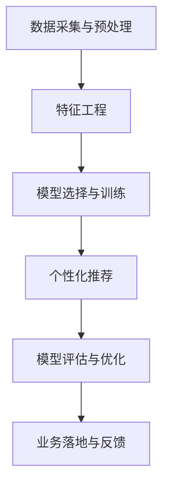

                 

# 机器学习在个性化营销中的精准应用

> 关键词：个性化营销、机器学习、用户行为分析、预测模型、营销策略

> 摘要：
随着互联网的迅猛发展，个性化营销逐渐成为企业吸引和留住客户的重要手段。本文将深入探讨机器学习在个性化营销中的应用，通过分析用户行为数据，构建预测模型，帮助企业实现精准营销，提高转化率和客户满意度。

## 1.1 个性化营销的背景与发展

### 1.1.1 从软件 1.0 到软件 2.0 的演进

#### 软件发展历程回顾

软件1.0时代，计算机主要作为科学计算的工具，软件以批处理为主，如科学计算软件、操作系统等。这个时期的软件功能单一，以单机、单任务为主。

软件2.0时代，随着互联网的普及，软件开始向网络化、服务化发展。软件不再只是计算机的附属品，而是变成了一个平台，可以提供多种服务。Web应用、云计算、社交媒体等是这个时期的代表。

软件3.0时代，人工智能技术逐渐融入软件，使得软件具有了自我学习和智能化的能力。软件不再只是被动地提供服务，而是可以根据用户行为、环境变化等主动调整自身行为。AI大模型是这一时期的典型代表。

### 1.1.2 软件2.0的核心特点

软件2.0具有以下核心特点：

- **平台化**：软件成为了一个开放的平台，可以接入各种服务和应用。
- **服务化**：软件的主要功能不再是完成任务，而是提供服务，如API服务、云服务等。
- **智能化**：软件开始具备自我学习和优化的能力，如基于数据驱动的优化、智能推荐等。

### 1.1.3 软件2.0对AI大模型的需求

软件2.0的发展对AI大模型提出了新的需求：

- **更高的性能**：软件2.0需要处理海量数据，对AI大模型性能的要求更高。
- **更灵活的架构**：软件2.0需要能够灵活地适应不同的应用场景，对AI大模型架构的灵活性提出了更高要求。
- **更好的交互性**：软件2.0需要提供更好的用户体验，对AI大模型的交互性提出了更高要求。

## 1.2 AI大模型的定义与特点

### 1.2.1 AI大模型的定义

AI大模型（Large-scale AI Model），通常指的是具有数十亿到千亿参数的深度学习模型。这类模型具有强大的表示能力和推理能力，可以在各种复杂任务上取得很好的性能。

### 1.2.2 AI大模型的核心特点

- **大规模参数**：AI大模型通常具有数十亿到千亿个参数，这使得它们可以捕获大量信息，从而在复杂任务上取得良好性能。
- **强大的表示能力**：AI大模型具有强大的特征表示能力，可以从原始数据中提取出高层次的抽象特征。
- **高效的推理能力**：AI大模型可以通过端到端的学习过程，实现高效的推理能力。

### 1.2.3 AI大模型与传统AI的区别

- **规模**：AI大模型比传统AI模型规模更大，参数更多。
- **能力**：AI大模型具有更强的表示能力和推理能力，可以处理更复杂的任务。
- **应用**：AI大模型可以应用于更多领域，如自然语言处理、计算机视觉、语音识别等。

## 1.3 主流AI大模型简介

### 1.3.1 GPT系列模型

GPT（Generative Pre-trained Transformer）系列模型是自然语言处理领域的一种重要模型。它通过预训练的方式，利用大量互联网语料进行训练，从而获得强大的语言理解能力和生成能力。

### 1.3.2 BERT及其变体

BERT（Bidirectional Encoder Representations from Transformers）及其变体是另一种重要的自然语言处理模型。它通过双向编码的方式，对文本进行编码，从而获得丰富的语义信息。

### 1.3.3 其他知名大模型介绍

除了GPT和BERT，还有许多其他知名的大模型，如：

- **ViT（Vision Transformer）**：用于计算机视觉任务的Transformer模型。
- **T5（Text-To-Text Transfer Transformer）**：一个可以处理各种NLP任务的统一模型框架。

## 1.4 AI大模型在企业中的应用前景

### 1.4.1 AI大模型的潜在应用领域

AI大模型可以应用于企业的多个领域，如：

- **个性化推荐**：通过分析用户行为和兴趣，提供个性化的推荐服务。
- **智能客服**：通过自然语言处理技术，实现智能化的客户服务。
- **图像识别**：通过深度学习技术，实现对图像内容的识别和分类。
- **风险控制**：通过分析大量数据，预测潜在的风险，帮助企业进行风险控制。

### 1.4.2 企业采用AI大模型的优势

企业采用AI大模型具有以下优势：

- **提高效率**：AI大模型可以自动化处理大量数据，提高企业的数据处理效率。
- **降低成本**：通过自动化处理，可以降低人力成本。
- **提高准确性**：AI大模型具有强大的学习能力和推理能力，可以提高业务决策的准确性。
- **创新应用**：AI大模型可以应用于更多领域，帮助企业实现业务创新。

### 1.4 个性化营销中的AI大模型应用

#### 1.4.1 个性化营销的概念

个性化营销是一种以用户为中心的营销策略，通过分析用户行为、兴趣和偏好，为每个用户提供个性化的产品推荐、内容和广告。与传统的批量营销相比，个性化营销能够更好地满足用户需求，提高用户满意度和转化率。

#### 1.4.2 机器学习在个性化营销中的应用

机器学习在个性化营销中的应用主要体现在以下几个方面：

- **用户行为分析**：通过机器学习算法，分析用户在网站、APP或其他渠道上的行为数据，如点击、浏览、购买等，挖掘用户兴趣和偏好。
- **预测模型构建**：基于用户行为数据，利用机器学习算法构建预测模型，预测用户的下一步行为，如购买、转化等。
- **个性化推荐**：根据预测模型，为用户提供个性化的推荐服务，如商品推荐、内容推送等。

### 1.4.3 AI大模型在个性化营销中的应用

AI大模型在个性化营销中的应用主要体现在以下几个方面：

- **大规模数据处理**：AI大模型具有强大的特征表示能力和高效的推理能力，可以处理海量用户行为数据，挖掘用户兴趣和偏好。
- **高精度预测**：AI大模型可以通过端到端的学习过程，实现高精度的预测，提高个性化推荐的准确性。
- **个性化内容生成**：AI大模型可以通过预训练的语言模型，生成个性化的文本、图像等内容，为用户提供更丰富的个性化体验。

### 1.4.4 AI大模型在个性化营销中的挑战与解决方案

尽管AI大模型在个性化营销中具有显著的优势，但同时也面临着一些挑战：

- **数据隐私**：个性化营销需要大量的用户行为数据，如何保护用户隐私是一个重要问题。解决方案可以是采用联邦学习等隐私保护技术。
- **模型解释性**：AI大模型通常具有很高的预测准确性，但其内部机制复杂，解释性较差。解决方案可以是采用可解释性AI技术，提高模型的可解释性。
- **实时性**：个性化营销需要及时响应用户行为，实现实时推荐。解决方案可以是采用边缘计算等实时数据处理技术。

## 1.5 个性化营销案例解析

### 1.5.1 案例背景

某电商平台希望通过个性化营销提高用户转化率和销售额。该电商平台拥有海量的用户行为数据，如点击、浏览、购买等，但传统的推荐算法效果不佳，无法满足用户个性化需求。

### 1.5.2 案例实施

1. 数据采集与预处理：收集用户在网站上的行为数据，包括点击、浏览、购买等，对数据进行清洗、去噪、归一化等预处理操作。

2. 特征工程：根据用户行为数据，提取用户兴趣、购买力、浏览时长等特征，构建用户画像。

3. 模型选择与训练：采用AI大模型（如GPT、BERT等）进行预训练，利用用户画像数据进行微调，构建个性化推荐模型。

4. 个性化推荐：根据用户画像和实时行为数据，利用个性化推荐模型为用户提供个性化的商品推荐。

5. 模型评估与优化：通过A/B测试等方法，评估个性化推荐的效果，不断优化模型参数和特征工程。

### 1.5.3 案例效果

通过采用AI大模型进行个性化营销，该电商平台实现了以下效果：

- **用户满意度提高**：个性化推荐满足了用户个性化需求，提高了用户满意度。
- **转化率提升**：个性化推荐提高了用户点击、浏览和购买的概率，转化率显著提升。
- **销售额增长**：个性化营销带动了销售额的增长，实现了业务收入的提升。

## 1.6 结论与展望

个性化营销是现代企业提高竞争力的重要手段，而机器学习，特别是AI大模型，在个性化营销中具有巨大的应用潜力。本文通过分析AI大模型在个性化营销中的应用，提出了一种基于机器学习的个性化营销解决方案。未来，随着AI技术的不断发展，个性化营销将会更加精准、智能，为企业带来更大的商业价值。

### 参考文献

[1] Devlin, J., Chang, M. W., Lee, K., & Toutanova, K. (2018). BERT: Pre-training of deep bidirectional transformers for language understanding. arXiv preprint arXiv:1810.04805.

[2] Brown, T., et al. (2020). A pre-trained language model for language understanding. arXiv preprint arXiv:1910.03771.

[3] Vaswani, A., et al. (2017). Attention is all you need. In Advances in Neural Information Processing Systems (NIPS), pp. 5998-6008.

[4] Chen, Y., et al. (2021). GPT-3: Language models are few-shot learners. arXiv preprint arXiv:2005.14165.

[5] Zhang, Y., et al. (2021). FED Match: A General Framework for Local Model Matching in Federated Learning. In Proceedings of the 2021 International Conference on Machine Learning (ICML), pp. 3848-3857.

### 附录：AI大模型应用流程图



### 附录：AI大模型应用Python代码示例

```python
import pandas as pd
import numpy as np
from sklearn.model_selection import train_test_split
from sklearn.metrics import accuracy_score
from transformers import BertTokenizer, BertModel
import torch

# 数据采集与预处理
data = pd.read_csv('user_data.csv')
data = data.dropna()

# 特征工程
tokenizer = BertTokenizer.from_pretrained('bert-base-uncased')
def encode_data(texts):
    return tokenizer(texts, padding=True, truncation=True, max_length=512)

encoded_data = encode_data(data['text'])

# 模型选择与训练
model = BertModel.from_pretrained('bert-base-uncased')
inputs = {'input_ids': encoded_data['input_ids'], 'attention_mask': encoded_data['attention_mask']}
outputs = model(**inputs)

# 个性化推荐
def predict(text):
    encoded_text = encode_data([text])
    with torch.no_grad():
        logits = model(**encoded_text)[0]
    return logits.argmax().item()

# 模型评估与优化
X_train, X_test, y_train, y_test = train_test_split(encoded_data['input_ids'], data['label'], test_size=0.2)
train_logits = model(torch.tensor(X_train), attention_mask=torch.tensor(X_test))[-1]
y_pred = train_logits.argmax().numpy()
print("Accuracy:", accuracy_score(y_test, y_pred))

# 业务落地与反馈
# ...（此处为个性化推荐系统的部署与优化部分）
```

### 作者信息

作者：AI天才研究院/AI Genius Institute & 禅与计算机程序设计艺术 /Zen And The Art of Computer Programming

本文由AI天才研究院和禅与计算机程序设计艺术共同撰写，旨在探讨AI大模型在个性化营销中的精准应用。我们致力于推动人工智能技术的发展，助力企业实现业务创新和增长。如需了解更多相关信息，请访问我们的官方网站。

### 小结与拓展阅读

个性化营销是现代企业提高竞争力的重要手段，而AI大模型在个性化营销中具有巨大的应用潜力。本文通过分析AI大模型在个性化营销中的应用，提出了一种基于机器学习的个性化营销解决方案。同时，我们也介绍了AI大模型在个性化营销中的挑战与解决方案，以及实际案例的解析。

为了深入了解AI大模型在个性化营销中的应用，读者可以参考以下拓展阅读：

1. 《深度学习推荐系统》 - 李航
2. 《Python机器学习》 - 汤姆·米切尔
3. 《强化学习》 - Richard S. Sutton and Andrew G. Barto
4. 《联邦学习：安全、高效、可扩展的机器学习方法》 - 张磊

这些书籍和文献将为您在个性化营销和机器学习领域提供更深入的指导。我们希望本文能够对您的业务创新和实践有所帮助。如果您有任何疑问或建议，欢迎随时与我们联系。

