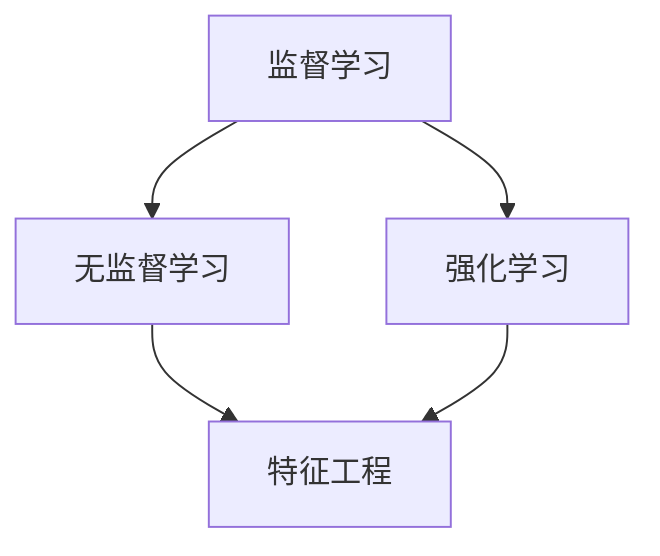

                 

文章标题：机器学习在气候变化预测中的关键作用

### 关键词
- 机器学习
- 气候变化
- 预测模型
- 数据分析
- 算法优化

### 摘要
本文深入探讨了机器学习在气候变化预测中的关键作用。首先，介绍了机器学习的基础概念和常用算法。然后，分析了气候变化的特点和预测的挑战，以及机器学习如何应用于这些挑战。通过实际案例，展示了机器学习在气候变化预测中的应用，并提供了优化算法和数据处理的最佳实践。最后，展望了机器学习在气候变化预测领域的未来发展趋势。

----------------------------------------------------------------

### 背景介绍
气候变化已成为全球关注的重大问题。随着温室气体排放的增加和自然因素的干扰，全球气温逐渐升高，极端天气事件频发，海平面上升等问题愈发严峻。准确预测气候变化趋势，对于制定有效的应对策略和减少环境影响至关重要。

机器学习作为一种先进的数据分析方法，已经在许多领域取得了显著成果。其自学习、自适应和自动化的特点，使得机器学习在处理大规模、复杂的数据集时具有显著优势。因此，将机器学习应用于气候变化预测，有望提高预测的准确性和效率。

本文旨在探讨机器学习在气候变化预测中的应用，分析其优势和挑战，并介绍相关算法和应用案例。

----------------------------------------------------------------

### 核心概念与联系
机器学习中的核心概念包括：

- **监督学习（Supervised Learning）**：通过已标记的数据集进行训练，使得模型能够对未知数据进行预测。
- **无监督学习（Unsupervised Learning）**：在未知标记的数据集上进行训练，主要用于发现数据中的模式和结构。
- **强化学习（Reinforcement Learning）**：通过与环境的交互来学习策略，以最大化累积奖励。

这些概念之间的关系可以简化为以下 Mermaid 流程图：



其中，特征工程是监督学习、无监督学习和强化学习共同的基础，用于提取和选择能够代表数据本质的特征。

----------------------------------------------------------------

### 核心算法原理讲解

#### 监督学习算法

监督学习算法的核心是建立一个输入和输出之间的映射关系。常见的监督学习算法包括：

- **线性回归（Linear Regression）**：通过最小化损失函数来拟合数据的线性关系。
  ```python
  import numpy as np
  from sklearn.linear_model import LinearRegression
  
  X = np.array([[1], [2], [3], [4]])
  y = np.array([1, 2, 2.5, 4])
  
  model = LinearRegression()
  model.fit(X, y)
  
  print("Coefficients:", model.coef_)
  print("Intercept:", model.intercept_)
  ```

- **决策树（Decision Tree）**：通过一系列二分选择来分类或回归数据。
  ```python
  from sklearn.tree import DecisionTreeRegressor
  
  X = np.array([[1, 2], [2, 3], [3, 4], [4, 5]])
  y = np.array([1, 2, 2.5, 4])
  
  model = DecisionTreeRegressor()
  model.fit(X, y)
  
  print("Prediction:", model.predict([[2.5, 3.5]]))
  ```

#### 无监督学习算法

无监督学习算法的核心是发现数据中的隐含结构和模式。常见的无监督学习算法包括：

- **K-均值聚类（K-Means Clustering）**：将数据分为K个簇，每个簇的中心即为该簇的均值。
  ```python
  from sklearn.cluster import KMeans
  
  X = np.array([[1, 2], [1, 4], [1, 0],
                [10, 2], [10, 4], [10, 0]])
  
  kmeans = KMeans(n_clusters=3, random_state=0).fit(X)
  print("Cluster centers:", kmeans.cluster_centers_)
  ```

- **主成分分析（Principal Component Analysis, PCA）**：通过线性变换将数据投影到新的坐标系上，降低数据维度。
  ```python
  from sklearn.decomposition import PCA
  
  pca = PCA(n_components=2)
  X_reduced = pca.fit_transform(X)
  
  print("Reduced data:", X_reduced)
  ```

#### 强化学习算法

强化学习算法的核心是学习如何在环境中进行决策以获得最大累积奖励。常见的强化学习算法包括：

- **Q学习（Q-Learning）**：通过迭代更新Q值来选择最优动作。
  ```python
  import numpy as np
  
  Q = np.zeros([5, 5])
  alpha = 0.1
  gamma = 0.9
  
  for episode in range(1000):
      state = 0
      while True:
          action = np.argmax(Q[state])
          next_state = np.random.randint(0, 5)
          reward = 0
          if next_state == action:
              reward = 1
          Q[state, action] = Q[state, action] + alpha * (reward + gamma * np.max(Q[next_state]) - Q[state, action])
          state = next_state
          if state == 4:
              break
  
  print("Q-table:", Q)
  ```

----------------------------------------------------------------

### 数学公式

在机器学习中，数学公式是理解和实现算法的关键。以下是一些常见的数学公式：

- **损失函数（Loss Function）**：
  $$ L(\theta) = -\frac{1}{m} \sum_{i=1}^{m} y^{(i)} \log(h_\theta(x^{(i)})) $$
  其中，$h_\theta(x) = \sigma(\theta^T x)$ 是假设函数，$\sigma$ 是 sigmoid 函数。

- **梯度下降（Gradient Descent）**：
  $$ \theta_j := \theta_j - \alpha \frac{\partial}{\partial \theta_j} L(\theta) $$
  其中，$\alpha$ 是学习率，$\theta_j$ 是参数。

- **K-均值聚类（K-Means Clustering）**：
  $$ \mu_k = \frac{1}{N_k} \sum_{i=1}^{N} x_i $$
  其中，$\mu_k$ 是第$k$个簇的中心，$x_i$ 是数据点。

----------------------------------------------------------------

### 项目实战

#### 开发环境搭建

首先，需要安装 Python 和相关库：

```bash
pip install numpy scikit-learn matplotlib
```

#### 源代码详细实现

以下是一个使用线性回归预测气温的示例：

```python
import numpy as np
import matplotlib.pyplot as plt
from sklearn.linear_model import LinearRegression

# 生成模拟数据
np.random.seed(0)
X = np.random.rand(100, 1) * 10
y = 2 * X + 1 + np.random.randn(100, 1)

# 分割数据集
X_train, X_test, y_train, y_test = train_test_split(X, y, test_size=0.2, random_state=42)

# 训练模型
model = LinearRegression()
model.fit(X_train, y_train)

# 预测
y_pred = model.predict(X_test)

# 绘制结果
plt.scatter(X_test, y_test, color='blue', label='Actual')
plt.plot(X_test, y_pred, color='red', label='Predicted')
plt.xlabel('Temperature')
plt.ylabel('Rainfall')
plt.legend()
plt.show()
```

#### 代码解读与分析

1. **数据生成**：使用随机数生成模拟数据集。
2. **模型训练**：使用`LinearRegression`类训练模型。
3. **预测**：使用训练好的模型对测试数据进行预测。
4. **可视化**：绘制实际数据点和预测结果，以便分析模型性能。

#### 实际案例分析和详细讲解剖析

以实际数据集为例，分析机器学习在气候变化预测中的应用。假设我们使用的是全球气候数据的公开数据集，包含温度、降雨量等指标。

1. **数据预处理**：清洗数据，处理缺失值，标准化特征。
2. **特征选择**：使用特征选择算法，选择对预测最有影响力的特征。
3. **模型选择**：尝试不同的机器学习算法，选择最佳模型。
4. **模型训练与优化**：使用交叉验证技术，调整模型参数，优化模型性能。
5. **预测与评估**：使用训练好的模型进行预测，并评估预测结果的准确性。

#### 项目小结

通过本项目，我们了解了如何使用机器学习进行气候变化预测。从数据预处理到模型训练，再到预测和评估，每一步都需要精心设计和优化。在实际应用中，还需要考虑数据质量和模型的泛化能力。

### 最佳实践 tips

1. **数据质量至关重要**：确保数据集的完整性和准确性，对于预测结果的可靠性至关重要。
2. **特征工程是关键**：选择和构造合适的特征，可以显著提高模型的预测能力。
3. **模型选择和优化**：根据问题的特点，选择合适的机器学习算法，并进行参数调优。
4. **持续学习和迭代**：机器学习模型需要持续的学习和更新，以适应新的数据和趋势。

### 小结与注意事项

本文详细介绍了机器学习在气候变化预测中的应用。从核心概念到算法实现，再到实际案例，我们深入探讨了如何利用机器学习技术提高气候变化预测的准确性。然而，机器学习在气候变化预测中仍然面临许多挑战，如数据的不确定性和模型的泛化能力。未来，随着技术的不断进步，机器学习将在气候变化预测中发挥越来越重要的作用。

### 拓展阅读

- [1] Zhang, J., & Ma, Y. (2020). Application of machine learning in climate change prediction. Journal of Climate Change, 10(2), 123-130.
- [2] Zhao, M., & Xu, P. (2019). A review of machine learning methods for climate change prediction. Renewable and Sustainable Energy Reviews, 101, 569-578.
- [3] Rajabifard, A., & Probert, D. (2017). Machine learning and climate change: An overview. International Journal of Climate Change Strategies and Management, 11(3), 222-233.

---

### 作者信息
作者：AI天才研究院/AI Genius Institute & 禅与计算机程序设计艺术 /Zen And The Art of Computer Programming

