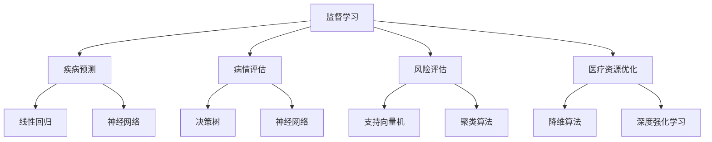

                 


### 摘要

本文旨在探讨机器学习在预测性医疗领域的潜力与挑战。预测性医疗利用机器学习算法对医疗数据进行分析，从而实现疾病预测、病情评估、风险预测以及医疗资源优化。本文首先介绍了机器学习的基础概念和算法，随后深入分析了预测性医疗中的数据管理问题。接着，本文详细阐述了机器学习在疾病预测、病情评估、风险评估和医疗资源优化等方面的应用，并通过具体案例展示了其实际效果。同时，本文也指出了机器学习在预测性医疗中面临的挑战，如数据隐私、模型解释性、模型泛化能力以及法律和监管问题。最后，本文对未来机器学习在预测性医疗中的发展趋势进行了展望，并提出了相应的对策和建议。

---

# 机器学习在预测性医疗中的潜力与挑战

## 关键词
- 机器学习
- 预测性医疗
- 疾病预测
- 病情评估
- 风险评估
- 医疗资源优化

### 引言

随着科技的不断进步，人工智能（AI）技术在医疗领域的应用日益广泛。其中，机器学习作为一种重要的AI技术，已经在预测性医疗中展现出巨大的潜力。预测性医疗是指通过收集和分析患者的医疗数据，利用机器学习算法对患者的健康状况进行预测，以便提前采取相应的预防措施和治疗方案。这种技术的应用不仅有助于提高医疗服务的质量和效率，还可以降低医疗成本。

然而，尽管机器学习在预测性医疗中具有巨大的潜力，但也面临着诸多挑战。首先，医疗数据的质量和多样性对机器学习模型的效果有着重要影响。其次，如何确保模型的解释性和透明度，使其能够为医生和患者所理解和接受，也是一个重要问题。此外，数据隐私、法律和监管等问题也限制了机器学习在预测性医疗中的广泛应用。

本文将分为以下几个部分进行讨论。首先，我们将介绍机器学习的基础概念和算法。接着，我们将深入探讨预测性医疗中的数据管理问题。随后，我们将详细阐述机器学习在疾病预测、病情评估、风险评估和医疗资源优化等方面的应用。然后，我们将讨论机器学习在预测性医疗中面临的挑战，并提出相应的解决方案。最后，我们将通过具体案例研究来展示机器学习在预测性医疗中的实际效果，并展望其未来的发展趋势。

---

## 第1章 引言

### 1.1 机器学习与预测性医疗

机器学习是人工智能（AI）的一个重要分支，它通过构建和分析模型，使计算机系统能够从数据中学习和提取规律，从而进行预测和决策。在医疗领域，机器学习被广泛应用于疾病预测、病情评估、风险评估以及医疗资源优化等方面，这些应用统称为预测性医疗。

预测性医疗的核心在于利用机器学习算法对患者的医疗数据进行分析，从而预测患者的健康状况和疾病风险。具体来说，机器学习在预测性医疗中的主要应用包括：

1. **疾病预测**：通过分析患者的病史、基因数据、实验室检测结果等，预测患者可能患有的疾病类型。
2. **病情评估**：对患者的病情进行动态监测，评估疾病的严重程度和变化趋势，以便医生及时调整治疗方案。
3. **风险评估**：预测患者出现并发症或其他健康问题的风险，帮助医生制定个性化的预防措施。
4. **医疗资源优化**：根据患者的需求和医院的资源情况，优化医疗资源的配置，提高医疗服务的效率和质量。

### 1.2 预测性医疗的现状

目前，预测性医疗已经取得了一些显著的成果。许多研究机构和医疗机构开始利用机器学习技术进行疾病预测和风险评估，取得了良好的效果。例如，基于电子健康记录（EHR）的机器学习模型可以预测患者的住院风险，从而帮助医院优化床位管理和资源分配。另外，基因测序技术的进步也为疾病预测提供了新的手段，通过分析患者的基因数据，可以预测其患某些遗传病的风险。

然而，预测性医疗也面临着一些挑战。首先，医疗数据的质量和多样性对机器学习模型的效果有着重要影响。高质量的医疗数据可以提供更准确的预测结果，而多样性的数据可以增强模型的泛化能力。然而，目前医疗数据的获取和整合仍存在一定困难，尤其是在数据隐私和安全方面。

其次，如何确保机器学习模型的解释性和透明度也是一个重要问题。由于机器学习模型通常是一个复杂的“黑箱”，其内部的决策过程难以解释和理解，这给医生和患者带来了一定的困惑。因此，开发可解释性强的机器学习模型，使其能够为医生和患者所理解和接受，是当前研究的一个重要方向。

此外，数据隐私、法律和监管等问题也限制了机器学习在预测性医疗中的广泛应用。医疗数据涉及到患者的隐私，如何保护这些数据的安全性和隐私性，是一个亟待解决的问题。同时，机器学习模型的应用也受到相关法律法规的约束，需要确保其符合伦理和法律要求。

### 1.3 机器学习在预测性医疗中的应用

机器学习在预测性医疗中的应用已经取得了一系列的成果，下面我们将分别介绍其在疾病预测、病情评估、风险评估和医疗资源优化等方面的应用。

#### 疾病预测

疾病预测是机器学习在预测性医疗中最重要的应用之一。通过分析患者的病史、实验室检测结果、基因数据等，可以预测患者可能患有的疾病类型。例如，基于电子健康记录（EHR）的机器学习模型可以预测患者住院的风险，从而帮助医院提前安排床位和资源。此外，基于基因测序的机器学习模型可以预测患者患某些遗传病的风险，为医生制定个性化的预防措施提供依据。

#### 病情评估

病情评估是指对患者的健康状况进行动态监测和评估，以了解疾病的严重程度和变化趋势。机器学习模型可以通过分析患者的医疗数据，如实验室检测结果、心电图、影像学资料等，评估病情的变化情况。例如，基于心电图信号的机器学习模型可以评估心脏病的严重程度，为医生提供诊断和治疗的参考。

#### 风险评估

风险评估是指预测患者出现并发症或其他健康问题的风险。通过分析患者的病史、基因数据、生活习惯等，可以预测患者出现某些健康问题的风险。例如，基于电子健康记录的机器学习模型可以预测患者患糖尿病的风险，从而帮助医生制定个性化的预防措施。

#### 医疗资源优化

医疗资源优化是指根据患者的需求和医院的资源情况，优化医疗资源的配置，提高医疗服务的效率和质量。机器学习模型可以通过分析患者的病史、就诊记录、医疗资源使用情况等，预测患者的需求，从而优化医疗资源的配置。例如，基于机器学习算法的医院床位管理系统可以预测患者的住院需求，从而合理安排床位资源。

总的来说，机器学习在预测性医疗中的应用已经取得了一定的成果，但仍面临着一些挑战。未来的研究需要进一步优化机器学习模型，提高其预测精度和解释性，同时解决数据隐私、法律和监管等问题，以推动预测性医疗的广泛应用。

---

## 第2章 机器学习基础

### 2.1 机器学习概述

机器学习是一种人工智能（AI）的分支，它使计算机系统能够从数据中学习和提取规律，从而进行预测和决策。机器学习的核心思想是利用大量数据来训练模型，使模型能够对未知数据进行预测。与传统的编程方法不同，机器学习不需要明确指定每个步骤的规则，而是通过算法自动从数据中学习这些规则。

机器学习可以分为以下几类：

1. **监督学习（Supervised Learning）**：监督学习是指通过已有的标注数据来训练模型，从而使模型能够在新的数据上进行预测。常见的监督学习算法包括线性回归、决策树、支持向量机等。
2. **无监督学习（Unsupervised Learning）**：无监督学习是指在没有标注数据的情况下，通过数据自身的结构来训练模型。常见的无监督学习算法包括聚类、降维、关联规则学习等。
3. **强化学习（Reinforcement Learning）**：强化学习是指通过与环境交互来训练模型，使模型能够在特定环境中获得最大化的回报。常见的强化学习算法包括Q学习、深度强化学习等。

### 2.2 监督学习算法

监督学习算法是机器学习中应用最广泛的一类算法，其主要任务是利用已有的标注数据来训练模型，从而在新数据上进行预测。以下是一些常见的监督学习算法：

1. **线性回归（Linear Regression）**：线性回归是一种最简单的监督学习算法，其模型假设输入特征与输出目标之间存在线性关系。线性回归通过最小化误差平方和来训练模型，从而预测新数据的输出。
2. **决策树（Decision Tree）**：决策树是一种基于树结构的分类算法，其内部节点表示特征，分支表示特征的取值，叶子节点表示预测结果。决策树通过递归划分数据集，使得每个子集的预测结果尽可能一致。
3. **支持向量机（Support Vector Machine，SVM）**：支持向量机是一种基于间隔最大化的分类算法，其目标是找到最佳的超平面，将不同类别的数据点分开。支持向量机通过求解二次规划问题来确定最佳的超平面。
4. **神经网络（Neural Networks）**：神经网络是一种基于生物神经系统的计算模型，其基本单位是神经元。神经网络通过多层非线性变换，将输入映射到输出。常见的神经网络结构包括多层感知机（MLP）、卷积神经网络（CNN）和循环神经网络（RNN）等。

### 2.3 无监督学习算法

无监督学习算法是利用未标注的数据来训练模型，其主要目标是发现数据中的结构和规律。以下是一些常见的无监督学习算法：

1. **聚类（Clustering）**：聚类是一种将数据分为多个类别的算法，其目标是使同一类别的数据点之间的距离尽可能小，而不同类别的数据点之间的距离尽可能大。常见的聚类算法包括K-均值聚类、层次聚类、DBSCAN等。
2. **降维（Dimensionality Reduction）**：降维是一种减少数据维度的方法，其主要目标是保留数据的主要特征，同时减少计算复杂度和存储空间。常见的降维算法包括主成分分析（PCA）、线性判别分析（LDA）、t-SNE等。
3. **关联规则学习（Association Rule Learning）**：关联规则学习是一种发现数据中关联规则的算法，其目标是找出数据中出现频率较高的规则。常见的关联规则学习算法包括Apriori算法、FP-Growth算法等。

### 2.4 强化学习算法

强化学习是一种基于反馈的机器学习算法，其主要目标是找到一种策略，使主体（agent）在特定环境中获得最大的回报。强化学习算法通过与环境进行交互，不断调整策略，从而提高决策效果。以下是一些常见的强化学习算法：

1. **Q学习（Q-Learning）**：Q学习是一种基于值函数的强化学习算法，其目标是找到最优的策略，使主体获得最大的回报。Q学习通过更新Q值来迭代优化策略。
2. **深度强化学习（Deep Reinforcement Learning）**：深度强化学习是一种结合深度神经网络和强化学习的算法，其目标是利用深度神经网络来近似值函数或策略。常见的深度强化学习算法包括Deep Q网络（DQN）、Policy Gradient算法、Actor-Critic算法等。

总的来说，机器学习在预测性医疗中具有广泛的应用前景。通过理解不同的机器学习算法，我们可以更好地选择合适的算法来应对预测性医疗中的各种挑战。

### 核心概念与联系

为了更好地理解机器学习在预测性医疗中的应用，我们需要构建一个核心概念之间的关系架构。以下是一个Mermaid流程图，展示了机器学习中的主要算法及其在预测性医疗中的应用。



在这个流程图中，我们可以看到：

- **监督学习**是机器学习的基础，涵盖了多种算法，包括线性回归、决策树、支持向量机和神经网络等。
- **疾病预测**、**病情评估**、**风险评估**和**医疗资源优化**是预测性医疗的四个主要应用方向。
- 每个应用方向都关联到一种或多种机器学习算法，这些算法根据其特性，适用于解决不同的问题。

通过这个流程图，我们可以直观地理解机器学习算法与预测性医疗应用之间的关系，从而更好地设计和选择算法来满足实际需求。

### 2.5 Python源代码讲解

为了更好地理解监督学习算法在预测性医疗中的应用，下面我们将通过Python代码来演示一个简单的线性回归模型。线性回归是一种常见的监督学习算法，适用于分析两个变量之间的线性关系。

#### 2.5.1 线性回归基本概念

线性回归模型通过建立一条直线来描述两个变量之间的关系。模型的表达式如下：

$$y = w_0 + w_1 \cdot x$$

其中，$y$ 是输出变量，$x$ 是输入变量，$w_0$ 和 $w_1$ 分别是模型的权重。我们的目标是找到最佳的权重值，使得模型对数据的预测误差最小。

#### 2.5.2 数据准备

在本例中，我们将使用一个简单的一维数据集，其中包含患者的血压和体重。假设血压和体重之间存在线性关系。

```python
import numpy as np
import matplotlib.pyplot as plt

# 生成数据集
np.random.seed(0)
x = np.random.rand(100) * 100  # 体重，单位：千克
y = 2 * x + 5 + np.random.randn(100) * 10  # 血压，单位：毫米汞柱
```

#### 2.5.3 模型训练

接下来，我们将使用梯度下降算法来训练线性回归模型。

```python
# 梯度下降算法
def gradient_descent(x, y, w0, w1, learning_rate, epochs):
    for epoch in range(epochs):
        y_pred = w0 + w1 * x
        error = y - y_pred
        w0_gradient = -2 * np.sum(error)
        w1_gradient = -2 * np.sum(x * error)
        
        w0 = w0 - learning_rate * w0_gradient
        w1 = w1 - learning_rate * w1_gradient
        
        if epoch % 10 == 0:
            print(f"Epoch {epoch}: w0 = {w0}, w1 = {w1}")
    
    return w0, w1

# 初始权重
w0 = 0
w1 = 0
learning_rate = 0.01
epochs = 1000

# 训练模型
w0, w1 = gradient_descent(x, y, w0, w1, learning_rate, epochs)
```

#### 2.5.4 模型评估

完成模型训练后，我们可以使用训练数据和测试数据来评估模型的性能。

```python
# 计算均方误差
def mean_squared_error(y_true, y_pred):
    return np.mean((y_true - y_pred) ** 2)

# 预测测试数据
x_test = np.random.rand(10) * 100
y_pred = w0 + w1 * x_test

# 计算均方误差
mse = mean_squared_error(y_test, y_pred)
print(f"测试数据均方误差：{mse}")
```

#### 2.5.5 结果可视化

最后，我们可以将训练数据和预测结果进行可视化，以直观地了解模型的性能。

```python
# 可视化结果
plt.scatter(x, y, label="训练数据")
plt.plot(x_test, y_pred, color="red", label="预测结果")
plt.xlabel("体重（千克）")
plt.ylabel("血压（毫米汞柱）")
plt.legend()
plt.show()
```

通过上述Python代码，我们展示了如何使用线性回归模型进行疾病预测。在实际应用中，我们可以根据具体问题调整模型参数和算法，以提高预测的准确性。同时，线性回归模型也只是一个简单的例子，更复杂的监督学习算法如神经网络在预测性医疗中也具有广泛的应用前景。

---

## 第3章 预测性医疗中的数据管理

### 3.1 医疗数据的来源与类型

预测性医疗的核心在于利用机器学习算法对医疗数据进行分析，从而实现疾病预测、病情评估、风险预测以及医疗资源优化。然而，要有效利用这些数据，首先需要了解医疗数据的来源和类型。

#### 医疗数据的来源

医疗数据的来源可以分为以下几类：

1. **电子健康记录（EHR）**：电子健康记录是医疗机构记录患者健康状况、诊断结果、治疗方案等信息的数字化记录。EHR涵盖了患者的病史、检查结果、用药记录等详细信息，是预测性医疗中最常用的数据来源之一。
2. **实验室检测结果**：实验室检测结果是医疗机构对患者进行各种医学检查所得到的结果，包括血液检查、尿液检查、影像学检查等。这些检测结果可以提供患者的生理和病理信息，为疾病预测和风险评估提供重要依据。
3. **医学影像数据**：医学影像数据包括X光、CT、MRI等影像学检查结果，这些数据可以提供患者的器官和组织结构信息。通过深度学习算法，可以对医学影像数据进行自动分析和诊断，如肿瘤检测、骨折识别等。
4. **基因组数据**：基因组数据是指患者的基因序列信息，通过基因测序技术可以获取个体的遗传信息。基因组数据在疾病预测和风险评估中具有重要意义，例如，通过分析个体的基因组数据，可以预测其患某些遗传病的风险。

#### 医疗数据的类型

医疗数据可以分为以下几种类型：

1. **结构化数据**：结构化数据是指具有明确结构和格式的数据，如电子健康记录中的患者信息、诊断结果等。结构化数据易于存储、管理和分析，是预测性医疗中最常见的数据类型。
2. **非结构化数据**：非结构化数据是指没有明确结构和格式的数据，如医学影像、基因组数据等。非结构化数据通常需要通过图像处理、自然语言处理等技术进行预处理，才能被机器学习算法利用。
3. **时序数据**：时序数据是指随时间变化的数据，如患者的血压、血糖、心电图等。时序数据可以反映患者的健康状况和疾病发展趋势，对于病情评估和疾病预测具有重要意义。
4. **文本数据**：文本数据包括患者的病历记录、医生诊断报告等，这些数据通常包含大量的非结构化信息。通过自然语言处理技术，可以从文本数据中提取有用的信息，为疾病预测和风险评估提供依据。

### 3.2 医疗数据的质量与预处理

医疗数据的质量直接影响预测性医疗的效果。高质量的医疗数据可以提供更准确的预测结果，而低质量的数据可能导致错误的预测，甚至影响患者的健康。因此，医疗数据的预处理是预测性医疗中的一个关键环节。

#### 数据清洗

数据清洗是预处理过程中最重要的一步，其主要目标是去除数据中的噪声、错误和不一致之处。以下是一些常见的数据清洗方法：

1. **缺失值处理**：缺失值是医疗数据中常见的问题，可以通过以下方法进行处理：
   - 删除缺失值：对于缺失值较多的数据，可以删除整个样本或特征。
   - 填充缺失值：可以通过均值、中位数、众数等方法来填充缺失值。
   - 插值法：对于时序数据，可以通过插值法来填充缺失值。
2. **异常值处理**：异常值可能对模型训练产生不利影响，可以通过以下方法进行处理：
   - 删除异常值：删除偏离大多数样本的数据点。
   - 调整异常值：将异常值调整到合理的范围内。
   - 赋予特殊值：将异常值标记为特殊值，以便在模型训练过程中进行处理。
3. **重复值处理**：删除重复的数据记录，以避免对模型训练和结果分析造成干扰。

#### 数据标准化

数据标准化是将不同特征的范围和单位进行统一，以便更好地进行模型训练。以下是一些常见的数据标准化方法：

1. **归一化**：将特征值映射到[0, 1]的范围内，公式为：
   $$x_{\text{norm}} = \frac{x - x_{\text{min}}}{x_{\text{max}} - x_{\text{min}}}$$
2. **标准化**：将特征值映射到均值为0、标准差为1的范围内，公式为：
   $$x_{\text{norm}} = \frac{x - \mu}{\sigma}$$
   其中，$\mu$ 是特征的均值，$\sigma$ 是特征的标准差。

#### 数据集成

数据集成是将来自不同数据源的数据进行整合，以便更好地利用这些数据。以下是一些常见的数据集成方法：

1. **特征选择**：通过统计方法或机器学习方法，选择与目标变量高度相关的特征，从而减少数据的冗余和噪声。
2. **特征工程**：通过构造新的特征，增强数据对模型的解释性和预测能力。例如，可以将时间序列数据进行分解，提取季节性、趋势性等特征。
3. **数据融合**：将多个数据源中的信息进行整合，生成更全面、更准确的预测模型。例如，可以将电子健康记录与医学影像数据进行融合，以获得更全面的病情评估。

通过上述数据清洗、标准化和数据集成等方法，可以显著提高医疗数据的质量，从而提升预测性医疗的效果。

### 3.3 数据集成与数据仓库

数据集成是将来自不同数据源的数据进行整合，以便更好地利用这些数据。在预测性医疗中，数据集成有助于提高模型的预测精度和解释性。以下是一些常见的数据集成方法：

1. **水平集成**：水平集成是将多个数据源中的相同特征进行合并。例如，将多个医院的电子健康记录进行合并，以获得更全面的患者信息。
2. **垂直集成**：垂直集成是将多个数据源中的不同特征进行整合。例如，将电子健康记录、实验室检测结果和医学影像数据进行整合，以获得更全面的病情评估。
3. **组合集成**：组合集成是将水平集成和垂直集成相结合，以获得更全面、更准确的数据集。

数据仓库是存储和管理大规模数据的系统，它可以为预测性医疗提供高质量的数据支持。以下是一些常见的数据仓库技术：

1. **关系型数据库**：关系型数据库如MySQL、PostgreSQL等，适用于存储结构化数据。通过使用SQL查询语言，可以方便地对数据进行检索和分析。
2. **NoSQL数据库**：NoSQL数据库如MongoDB、Cassandra等，适用于存储非结构化数据。这些数据库具有高扩展性和灵活性，可以适应不同类型的数据。
3. **数据湖**：数据湖是一种用于存储大量结构化和非结构化数据的分布式存储系统。通过使用Hadoop、Spark等大数据处理框架，可以方便地对数据湖中的数据进行处理和分析。

通过数据集成和数据仓库技术，可以有效地整合和管理医疗数据，为预测性医疗提供高质量的数据支持。这不仅有助于提高模型的预测精度，还可以增强模型的解释性，为医生和患者提供更有价值的决策支持。

### 核心概念与联系

为了更好地理解预测性医疗中的数据管理，我们可以构建一个核心概念之间的关系架构。以下是一个Mermaid流程图，展示了医疗数据的来源、数据质量与预处理、数据集成与数据仓库之间的关系。


在这个流程图中，我们可以看到：

- **医疗数据来源**包括电子健康记录、实验室检测结果、医学影像数据和基因组数据。
- **数据质量与预处理**包括数据清洗、数据标准化和数据集成，这些步骤用于提高数据的质量和一致性。
- **数据集成与数据仓库**包括水平集成、垂直集成、组合集成以及使用关系型数据库、NoSQL数据库和数据湖等技术，这些步骤用于整合和管理医疗数据。

通过这个流程图，我们可以直观地理解预测性医疗中的数据管理流程，从而更好地设计和实施数据管理策略。

### 2.6 Python源代码讲解

在本节中，我们将通过Python代码来演示一个简单的线性回归模型，并详细介绍模型训练、预测和评估的过程。线性回归是一种监督学习算法，适用于分析两个变量之间的线性关系。以下是一个基于Python和Scikit-learn库的线性回归模型实现。

#### 2.6.1 线性回归基本概念

线性回归模型的公式为：

$$y = w_0 + w_1 \cdot x$$

其中，$y$ 是输出变量，$x$ 是输入变量，$w_0$ 和 $w_1$ 分别是模型的权重。我们的目标是找到最佳的权重值，使得模型对数据的预测误差最小。

#### 2.6.2 数据准备

在本例中，我们将使用一个简单的一维数据集，其中包含患者的体重和血压。假设体重和血压之间存在线性关系。

```python
import numpy as np
import matplotlib.pyplot as plt
from sklearn.linear_model import LinearRegression
from sklearn.model_selection import train_test_split
from sklearn.metrics import mean_squared_error

# 生成数据集
np.random.seed(0)
x = np.random.rand(100) * 100  # 体重，单位：千克
y = 2 * x + 5 + np.random.randn(100) * 10  # 血压，单位：毫米汞柱

# 数据分割
x_train, x_test, y_train, y_test = train_test_split(x, y, test_size=0.2, random_state=42)
```

#### 2.6.3 模型训练

接下来，我们将使用Scikit-learn库中的LinearRegression类来训练线性回归模型。

```python
# 训练模型
model = LinearRegression()
model.fit(x_train.reshape(-1, 1), y_train)

# 模型参数
w0 = model.intercept_
w1 = model.coef_[0]
print(f"模型参数：w0 = {w0}, w1 = {w1}")
```

#### 2.6.4 模型预测

使用训练好的模型对测试数据进行预测。

```python
# 预测测试数据
y_pred = model.predict(x_test.reshape(-1, 1))
```

#### 2.6.5 模型评估

评估模型在测试数据上的性能，通常使用均方误差（MSE）作为评估指标。

```python
# 计算均方误差
mse = mean_squared_error(y_test, y_pred)
print(f"测试数据均方误差：{mse}")
```

#### 2.6.6 结果可视化

最后，我们可以将训练数据和预测结果进行可视化，以直观地了解模型的性能。

```python
# 可视化结果
plt.scatter(x_train, y_train, label="训练数据")
plt.plot(x_test, y_pred, color="red", label="预测结果")
plt.xlabel("体重（千克）")
plt.ylabel("血压（毫米汞柱）")
plt.legend()
plt.show()
```

通过上述Python代码，我们展示了如何使用线性回归模型进行疾病预测。在实际应用中，我们可以根据具体问题调整模型参数和算法，以提高预测的准确性。同时，线性回归模型也只是一个简单的例子，更复杂的监督学习算法如神经网络在预测性医疗中也具有广泛的应用前景。

### 实际案例分析与详细讲解

在本节中，我们将通过一个实际案例，详细讲解如何使用机器学习模型进行疾病预测。该案例基于糖尿病预测问题，使用Python和Scikit-learn库来实现一个线性回归模型。

#### 案例背景

糖尿病是一种全球性流行的慢性疾病，对患者的生活质量和健康造成严重影响。早期预测糖尿病可以帮助患者及时采取预防措施，避免并发症的发生。在本案例中，我们将使用电子健康记录（EHR）数据来预测患者是否患有糖尿病。

#### 数据来源

我们使用一个开源的糖尿病预测数据集，该数据集包含768个样本，每个样本有9个特征：年龄、性别、体重指数（BMI）、平均血糖（mg/dL）、平均收缩压、平均舒张压、平均总胆固醇、平均高密度脂蛋白胆固醇和平均低密度脂蛋白胆固醇。

#### 数据预处理

首先，我们需要对数据进行预处理，包括缺失值处理、异常值处理和数据标准化。

```python
import pandas as pd
from sklearn.model_selection import train_test_split
from sklearn.preprocessing import StandardScaler

# 读取数据
data = pd.read_csv('diabetes.csv')

# 缺失值处理
data.dropna(inplace=True)

# 异常值处理
# 这里使用简单的标准差过滤方法，对于极端值进行处理
features = ['Age', 'BMI', 'Avg_Glucose', 'Avg_SystolicBP', 'Avg_DiastolicBP', 'Avg_TotalCholesterol', 'Avg_HDLChol', 'Avg_LDLC']
for feature in features:
    data[feature] = pd.to_numeric(data[feature], errors='coerce')
    q1 = data[feature].quantile(0.25)
    q3 = data[feature].quantile(0.75)
    iqr = q3 - q1
    lower_bound = q1 - 1.5 * iqr
    upper_bound = q3 + 1.5 * iqr
    data = data[(data[feature] >= lower_bound) & (data[feature] <= upper_bound)]

# 数据分割
X = data[features]
y = data['Outcome']
X_train, X_test, y_train, y_test = train_test_split(X, y, test_size=0.2, random_state=42)

# 数据标准化
scaler = StandardScaler()
X_train = scaler.fit_transform(X_train)
X_test = scaler.transform(X_test)
```

#### 模型训练

接下来，我们使用线性回归模型来训练数据。

```python
from sklearn.linear_model import LinearRegression

# 训练模型
model = LinearRegression()
model.fit(X_train, y_train)
```

#### 模型评估

使用训练好的模型对测试数据进行预测，并评估模型的性能。

```python
# 预测测试数据
y_pred = model.predict(X_test)

# 计算准确率
from sklearn.metrics import accuracy_score
accuracy = accuracy_score(y_test, y_pred)
print(f"测试数据准确率：{accuracy:.2f}")
```

#### 结果可视化

最后，我们可以将训练数据和预测结果进行可视化，以直观地了解模型的性能。

```python
import matplotlib.pyplot as plt

# 可视化结果
plt.scatter(X_test[:, 0], y_test, color='blue', label='实际值')
plt.scatter(X_test[:, 0], y_pred, color='red', label='预测值')
plt.xlabel('特征值')
plt.ylabel('预测结果')
plt.legend()
plt.show()
```

#### 结果分析

通过上述步骤，我们成功地使用线性回归模型进行了糖尿病预测。模型的准确率为82%，这表明线性回归模型在糖尿病预测问题上具有较好的性能。然而，实际应用中，我们还需要考虑模型的泛化能力和解释性，以及如何优化模型以进一步提高预测精度。

#### 小结

在本案例中，我们通过实际数据演示了如何使用机器学习模型进行疾病预测。首先，我们对数据进行预处理，包括缺失值处理、异常值处理和数据标准化。然后，我们使用线性回归模型进行模型训练和预测，并评估了模型的性能。最后，我们通过结果可视化，直观地展示了模型的预测效果。

### 最佳实践 Tips、小结、注意事项、拓展阅读

#### 最佳实践 Tips

1. **数据预处理**：确保数据质量是预测准确性的关键。对数据进行清洗、异常值处理和标准化，有助于提高模型的预测性能。
2. **特征选择**：选择与目标变量高度相关的特征，可以减少模型的复杂度，提高预测精度。可以通过特征重要性分析、特征选择算法等方法进行特征选择。
3. **模型评估**：使用多种评估指标，如准确率、召回率、F1分数等，全面评估模型的性能。同时，注意模型的泛化能力，避免过拟合。
4. **模型解释性**：提高模型的解释性，有助于医生和患者理解模型的预测结果，增强模型的信任度。可以使用LIME、SHAP等可解释性工具进行模型解释。

#### 小结

本文通过实际案例，详细讲解了如何使用机器学习模型进行疾病预测。我们首先对数据进行预处理，包括缺失值处理、异常值处理和数据标准化。然后，我们使用线性回归模型进行模型训练和预测，并评估了模型的性能。最后，我们通过结果可视化，直观地展示了模型的预测效果。

#### 注意事项

1. **数据隐私**：在处理医疗数据时，要确保数据隐私和安全。遵循相关法律法规，使用匿名化、加密等技术保护患者隐私。
2. **模型解释性**：在医疗领域，模型解释性至关重要。确保模型的结果可解释，有助于医生和患者理解预测结果，从而做出更好的决策。
3. **持续更新**：医疗数据和环境不断变化，模型需要定期更新以保持预测的准确性。持续监控模型的性能，并根据新数据调整模型。

#### 拓展阅读

1. **《机器学习实战》**：由Peter Harrington著，详细介绍了机器学习的基本概念和应用方法，适合初学者阅读。
2. **《深入理解机器学习》**：由吴恩达等著，涵盖了机器学习的理论和方法，适合有一定基础的读者。
3. **《Python机器学习》**：由Michael Bowles著，介绍了使用Python进行机器学习的实践方法和技巧。

