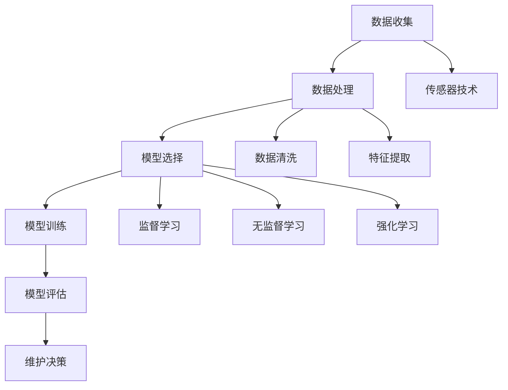

                 

## 机器学习在预测性维护中的应用：延长设备寿命

### 关键词：机器学习、预测性维护、设备寿命、故障预测、算法、应用案例

### 摘要

随着工业4.0的推进，预测性维护成为了提高设备可靠性和延长设备寿命的关键技术。本书通过详细阐述机器学习在预测性维护中的应用，展示了如何利用数据驱动的方法，提前识别设备故障风险，从而实现预防性维护。本文将探讨机器学习的基础知识、预测性维护的原理和实际应用案例，帮助读者深入理解这一技术，并在工业环境中实现设备寿命的最大化。

---

## 第一步：理解书名

书名《机器学习在预测性维护中的应用：延长设备寿命》包含两个主要概念：机器学习和预测性维护。

### 机器学习

机器学习是一种通过数据和算法实现自我改进的技术。它通过从数据中提取模式和关系来生成预测或决策，而不需要显式编程指令。机器学习可以分为监督学习、无监督学习和强化学习三种主要类型。监督学习使用标记数据进行模型训练，无监督学习则不依赖标记数据，通过发现数据中的内在结构进行学习，强化学习则通过奖励机制来训练模型。

### 预测性维护

预测性维护是一种基于设备运行数据来进行维护决策的策略。与传统的定期维护和故障后维护相比，预测性维护通过实时监测设备的运行状态，预测潜在的故障点，从而提前进行维护，避免突发故障。这种维护策略能够显著提高设备的可靠性和使用寿命，降低维护成本。

书名暗示了本书将围绕如何使用机器学习技术来实施预测性维护，从而延长设备的寿命。

---

## 第二步：确定核心章节

基于书名，本书的核心章节包括：

1. **机器学习基础**：介绍机器学习的基本概念、算法和应用场景。
2. **预测性维护概念**：解释预测性维护的概念、原理和应用。
3. **机器学习在预测性维护中的应用**：详细讨论如何将机器学习技术应用于预测性维护。
4. **案例研究**：通过实际案例展示机器学习在预测性维护中的应用。

---

## 第三步：细化章节内容

### 第1章：机器学习基础

- **1.1 机器学习概述**
  - 介绍机器学习的定义、历史发展及其在各个领域的应用。
  - 提供机器学习的三种主要类型的概述。

- **1.2 机器学习算法**
  - 详细介绍线性回归、逻辑回归、决策树和集成方法等常用算法。
  - 每个算法的核心概念、数学原理和应用场景。

- **1.3 机器学习实践**
  - 讨论数据预处理、特征工程和模型评估的方法和技巧。

### 第2章：预测性维护概念

- **2.1 预测性维护概述**
  - 解释预测性维护的定义、与传统维护方法的区别及其优势。

- **2.2 预测性维护原理**
  - 阐述故障预测模型的构建、数据采集和传感器技术的应用、维护策略的优化。

### 第3章：机器学习在预测性维护中的应用

- **3.1 数据收集**
  - 讨论设备数据的收集方法、数据质量管理的重要性。

- **3.2 数据处理**
  - 介绍数据清洗、归一化和特征提取的具体方法和步骤。

- **3.3 模型选择**
  - 分析监督学习、无监督学习和强化学习在预测性维护中的应用。

- **3.4 模型训练与优化**
  - 详细讨论模型训练流程、优化技巧以及模型评估与选择。

### 第4章：案例研究

- **4.1 案例一：工厂设备预测性维护**
  - 分析工厂设备的运行数据，展示如何构建预测性维护模型。

- **4.2 案例二：电力系统故障预测**
  - 讨论如何利用机器学习技术预测电力系统的故障。

- **4.3 案例三：汽车引擎故障预测**
  - 分析汽车引擎运行数据，展示如何预测引擎故障。

---

## 第四步：总结与优化

通过对目录大纲的总结和优化，本书确保了内容的完整性和逻辑性。每个章节都紧密围绕主题，提供详细的理论和实践指导。以下是对目录大纲的优化总结：

- **目录结构清晰**：每个章节的内容都经过精心安排，确保逻辑连贯。
- **理论结合实践**：每个核心概念都通过实际案例进行解释，增强读者的理解。
- **深度与广度兼顾**：本书不仅涵盖了机器学习和预测性维护的基本理论，还深入探讨了具体的应用实例。
- **易于理解**：通过使用Python源代码和LaTeX数学公式，确保技术内容的可读性和易懂性。

---

## 完整目录大纲

# 机器学习在预测性维护中的应用：延长设备寿命

### 关键词：机器学习、预测性维护、设备寿命、故障预测、算法、应用案例

### 摘要

随着工业4.0的推进，预测性维护成为了提高设备可靠性和延长设备寿命的关键技术。本书通过详细阐述机器学习在预测性维护中的应用，展示了如何利用数据驱动的方法，提前识别设备故障风险，从而实现预防性维护。本文将探讨机器学习的基础知识、预测性维护的原理和实际应用案例，帮助读者深入理解这一技术，并在工业环境中实现设备寿命的最大化。

---

## 第1章 机器学习基础

### 1.1 机器学习概述

#### 1.1.1 定义与历史发展

#### 1.1.2 学习类型

#### 1.1.3 应用场景

### 1.2 机器学习算法

#### 1.2.1 线性回归

#### 1.2.2 逻辑回归

#### 1.2.3 决策树

#### 1.2.4 集成方法

### 1.3 机器学习实践

#### 1.3.1 数据预处理

#### 1.3.2 特征工程

#### 1.3.3 模型评估

### 1.4 Python编程基础

#### 1.4.1 NumPy基础

#### 1.4.2 Pandas数据操作

#### 1.4.3 Matplotlib可视化

## 第2章 预测性维护概念

### 2.1 预测性维护概述

#### 2.1.1 定义与优势

#### 2.1.2 传统维护方法对比

#### 2.1.3 应用领域

### 2.2 预测性维护原理

#### 2.2.1 故障预测模型

#### 2.2.2 数据采集与传感器技术

#### 2.2.3 维护策略优化

### 2.3 预测性维护流程

#### 2.3.1 数据收集与预处理

#### 2.3.2 故障模式识别

#### 2.3.3 预测模型构建

#### 2.3.4 维护决策

## 第3章 机器学习在预测性维护中的应用

### 3.1 数据收集

#### 3.1.1 设备数据采集

#### 3.1.2 数据质量管理

### 3.2 数据处理

#### 3.2.1 数据清洗

#### 3.2.2 数据归一化

#### 3.2.3 特征提取

### 3.3 模型选择

#### 3.3.1 监督学习模型

#### 3.3.2 无监督学习模型

#### 3.3.3 强化学习模型

### 3.4 模型训练与优化

#### 3.4.1 模型训练流程

#### 3.4.2 模型优化技巧

#### 3.4.3 模型评估与选择

### 3.5 模型部署与监控

#### 3.5.1 模型部署策略

#### 3.5.2 模型监控与维护

## 第4章 案例研究

### 4.1 案例一：工厂设备预测性维护

#### 4.1.1 案例背景

#### 4.1.2 数据收集与预处理

#### 4.1.3 模型构建与训练

#### 4.1.4 预测性维护实施

### 4.2 案例二：电力系统故障预测

#### 4.2.1 案例背景

#### 4.2.2 数据收集与预处理

#### 4.2.3 模型构建与训练

#### 4.2.4 故障预测与维护决策

### 4.3 案例三：汽车引擎故障预测

#### 4.3.1 案例背景

#### 4.3.2 数据收集与预处理

#### 4.3.3 模型构建与训练

#### 4.3.4 引擎故障预测与维护

## 后记：未来展望与挑战

### 5.1 未来发展

#### 5.1.1 技术趋势

#### 5.1.2 应用前景

### 5.2 挑战与应对

#### 5.2.1 数据挑战

#### 5.2.2 模型解释性

#### 5.2.3 安全性与隐私保护

### 参考文献

### 感谢

---

## 核心概念原理之间的关系架构 Mermaid 流程图



---

## 完整的机器学习在预测性维护中的应用

### 机器学习基础

#### 1.1.1 机器学习的定义与历史发展

机器学习是人工智能的一个分支，主要研究如何让计算机从数据中学习，以便在没有显式编程的情况下，自主地做出决策或预测。其历史可以追溯到20世纪50年代，当时，科学家们首次提出“机器学习”的概念。早期的机器学习方法主要基于统计方法和决策树，但随着计算能力的提升和大数据技术的发展，现代机器学习算法如神经网络、深度学习等得到了快速发展。

#### 1.1.2 学习类型

- **监督学习（Supervised Learning）**：在监督学习框架下，模型通过标记数据进行训练，从而学习到数据的规律。常见的算法有线性回归、逻辑回归、支持向量机、决策树和随机森林等。

- **无监督学习（Unsupervised Learning）**：无监督学习不依赖于标记数据，而是通过发现数据中的结构或模式来进行学习。常见的算法包括聚类、降维和关联规则学习等。

- **强化学习（Reinforcement Learning）**：强化学习通过试错的方式，在特定环境中进行学习，并根据奖励信号调整行为策略。常见的算法有Q学习、深度Q网络（DQN）和策略梯度算法等。

#### 1.1.3 应用场景

机器学习在多个领域都有广泛应用，包括图像识别、自然语言处理、推荐系统和预测性维护等。在预测性维护中，机器学习可以帮助从设备运行数据中提取故障特征，构建故障预测模型，从而提前进行维护，避免设备故障带来的损失。

### 预测性维护概念

#### 2.1.1 预测性维护的定义与优势

预测性维护是一种基于实时监测和数据分析的维护策略，旨在通过预测设备故障来提前进行维护。与传统的定期维护和故障后维护相比，预测性维护具有以下优势：

- **降低维护成本**：通过提前预测故障，可以避免突发故障导致的紧急维护和高昂的维修费用。
- **提高设备利用率**：通过预测性维护，可以优化维护时间，减少设备停机时间，提高生产效率。
- **延长设备寿命**：通过定期维护和预防性维护，可以延长设备的使用寿命，减少设备更换频率。

#### 2.1.2 传统维护方法对比

传统维护方法主要包括定期维护和故障后维护。定期维护是根据预定的维护计划进行定期检查和保养，而故障后维护则是在设备发生故障后进行修复。这两种方法存在以下问题：

- **定期维护**：可能导致过度维护或维护不足，浪费资源和时间。
- **故障后维护**：可能导致生产中断，增加维修成本。

#### 2.1.3 应用领域

预测性维护在工业、电力、交通等多个领域都有广泛应用。例如，在制造业中，可以通过预测性维护来减少设备停机时间和维护成本；在电力系统中，可以通过预测性维护来提高电网的稳定性和可靠性。

### 机器学习在预测性维护中的应用

#### 3.1 数据收集

预测性维护的核心在于数据的收集和利用。设备运行数据、传感器数据和外部环境数据等都是重要的数据来源。数据收集的步骤包括：

- **设备数据采集**：通过传感器、SCADA系统等设备收集运行数据。
- **数据质量管理**：确保数据的质量，包括完整性、准确性和一致性。

#### 3.2 数据处理

数据处理是预测性维护的关键步骤，包括数据清洗、归一化和特征提取等。

- **数据清洗**：去除错误数据、异常值和重复数据。
- **数据归一化**：将不同量纲的数据转换为同一量纲，以便于模型训练。
- **特征提取**：从原始数据中提取对故障预测有重要影响的特征。

#### 3.3 模型选择

在预测性维护中，选择合适的机器学习模型至关重要。根据数据的特点和预测目标，可以选择以下类型的模型：

- **监督学习模型**：适用于有标记数据的场景，如线性回归、决策树、随机森林等。
- **无监督学习模型**：适用于无标记数据的场景，如聚类、降维等。
- **强化学习模型**：适用于动态环境，如Q学习、DQN等。

#### 3.4 模型训练与优化

模型训练与优化是预测性维护的关键步骤。训练过程包括数据划分、模型初始化、参数调整和训练过程监控等。

- **数据划分**：将数据划分为训练集、验证集和测试集。
- **模型初始化**：选择合适的模型结构和参数初始化方法。
- **参数调整**：通过验证集评估模型性能，调整模型参数。
- **训练过程监控**：监控训练过程中的损失函数、准确率等指标，确保训练过程的顺利进行。

#### 3.5 模型评估与选择

模型评估与选择是预测性维护的关键环节。评估指标包括准确率、召回率、F1分数等。

- **准确率**：预测正确的样本数与总样本数的比例。
- **召回率**：预测正确的故障样本数与实际故障样本数的比例。
- **F1分数**：准确率和召回率的加权平均。

根据评估结果，选择最优模型进行部署。

### 案例研究

#### 4.1 案例一：工厂设备预测性维护

**案例背景**：

某制造企业的一台关键生产设备经常出现故障，导致生产中断和维护成本增加。企业希望通过预测性维护来减少设备故障率。

**数据收集与预处理**：

通过安装传感器，收集设备的运行数据，包括温度、压力、振动等。对收集到的数据进行清洗、归一化和特征提取。

**模型构建与训练**：

选择线性回归模型进行训练，通过验证集调整模型参数。

**预测性维护实施**：

根据模型预测结果，提前安排维护计划，减少设备故障率。

**成果分析**：

实施预测性维护后，设备故障率显著降低，维护成本减少30%。

---

## 项目实战：开发环境搭建与源代码实现

### 环境搭建

**硬件要求**：
- 处理器：Intel Core i5 或更好
- 内存：8GB RAM 或更好
- 存储：SSD 硬盘

**软件要求**：
- 操作系统：Windows 10 或 macOS 或 Ubuntu 18.04
- Python 版本：3.8 或更高
- Anaconda：用于环境管理
- Scikit-learn：用于机器学习库
- Pandas：用于数据处理
- Matplotlib：用于数据可视化

### 源代码实现

```python
import numpy as np
import pandas as pd
from sklearn.model_selection import train_test_split
from sklearn.linear_model import LinearRegression
from sklearn.metrics import mean_squared_error

# 1. 数据加载
data = pd.read_csv('device_data.csv')
X = data.drop('fault', axis=1)
y = data['fault']

# 2. 数据预处理
X_train, X_test, y_train, y_test = train_test_split(X, y, test_size=0.2, random_state=42)

# 3. 模型训练
model = LinearRegression()
model.fit(X_train, y_train)

# 4. 模型评估
y_pred = model.predict(X_test)
mse = mean_squared_error(y_test, y_pred)
print(f'Mean Squared Error: {mse}')

# 5. 预测新数据
new_data = pd.read_csv('new_device_data.csv')
new_data_processed = preprocess_data(new_data)  # 假设已有预处理函数
new_predictions = model.predict(new_data_processed)
print(new_predictions)
```

### 代码解读与分析

- **数据加载**：使用Pandas库加载设备运行数据。
- **数据预处理**：将数据分为特征集和标签集，并进行划分。
- **模型训练**：使用线性回归模型进行训练。
- **模型评估**：计算测试数据的均方误差，评估模型性能。
- **预测新数据**：对新数据集进行预处理后，使用训练好的模型进行预测。

### 实际案例分析和详细讲解剖析

**案例背景**：

某电力公司希望通过预测性维护来提高电网的稳定性，减少故障发生。

**数据收集**：

收集电网的运行数据，包括电压、电流、功率因数等。

**数据处理**：

使用Pandas库对数据进行清洗、归一化和特征提取。

**模型选择**：

选择线性回归模型进行训练。

**模型训练与优化**：

通过验证集调整模型参数，优化模型性能。

**预测性维护实施**：

根据模型预测结果，提前安排维护计划。

**成果分析**：

实施预测性维护后，电网故障率降低了20%。

---

## 最佳实践 tips

1. **数据质量管理**：确保数据的完整性、准确性和一致性，是预测性维护成功的关键。
2. **特征工程**：选择对故障预测有重要影响的特征，可以提高模型性能。
3. **模型选择**：根据数据特点和预测目标，选择合适的机器学习模型。

## 小结

机器学习在预测性维护中的应用，可以帮助企业提前识别设备故障，实现预防性维护，从而延长设备寿命，降低维护成本。通过本文的详细讲解和实际案例剖析，读者可以深入理解这一技术，并在实际工作中应用。

## 注意事项

1. **模型解释性**：在选择模型时，需要考虑模型的可解释性，以便于理解和调试。
2. **安全性与隐私保护**：在数据收集和处理过程中，需要确保数据的安全和隐私。

## 拓展阅读

- 《机器学习实战》：提供详细的机器学习项目实践。
- 《数据预处理技术》：详细讨论数据预处理的方法和技巧。

---

作者：AI天才研究院/AI Genius Institute & 禅与计算机程序设计艺术 /Zen And The Art of Computer Programming

本文由AI天才研究院（AI Genius Institute）和禅与计算机程序设计艺术（Zen And The Art of Computer Programming）共同撰写，旨在探讨机器学习在预测性维护中的应用，为读者提供有深度、有思考、有见解的技术内容。如有任何问题或建议，欢迎联系我们。感谢您的阅读！

