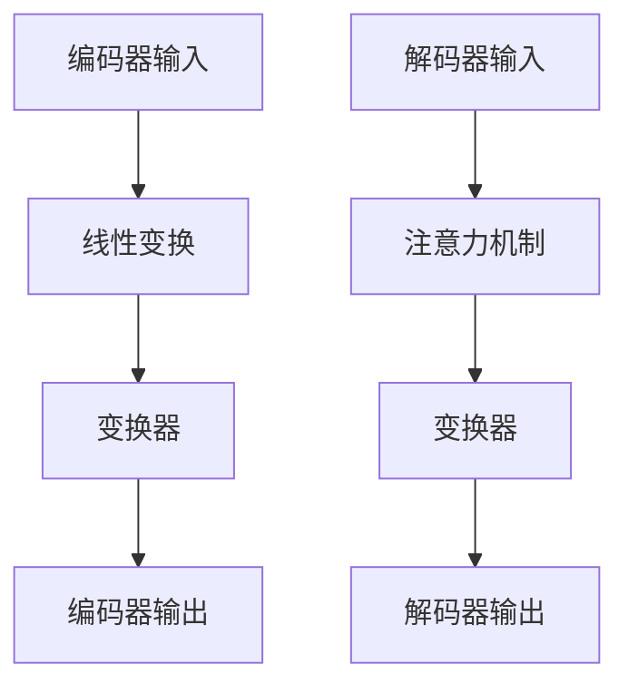
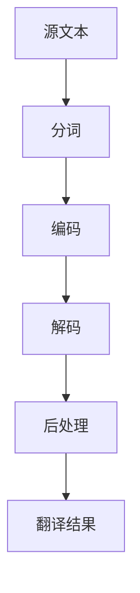

                 


# 《机器翻译的新时代：跨语言交流的无缝桥梁》

## 关键词：
- 机器翻译
- 跨语言交流
- 神经网络
- 统计机器翻译
- 深度学习
- 应用案例

## 摘要：
本文深入探讨了机器翻译领域的新时代，着重分析了跨语言交流的重要性及其对全球化发展的影响。通过回顾机器翻译的历史，我们了解了从传统统计方法到现代深度学习的演变过程。文章详细介绍了机器翻译的基本概念、核心技术原理，以及创新技术在实际应用中的挑战与解决方案。最后，通过具体项目实战案例，展示了机器翻译系统的开发与应用，为读者提供了一个全面了解机器翻译技术的视角。

---

## 第一部分：引言与背景

### 第1章：引言

#### 1.1 机器翻译的现状

随着全球化的加速，跨语言交流的需求日益增长。机器翻译作为一种自动化的翻译技术，已经成为了实现跨语言交流的重要工具。目前，机器翻译技术广泛应用于各个领域，如电子商务、旅游、教育和媒体等。尽管机器翻译技术已经取得了显著进展，但仍然面临着诸多挑战，包括翻译质量、准确性和适应性等问题。

#### 1.2 跨语言交流的重要性

跨语言交流是推动全球化发展的重要手段。它不仅有助于不同语言和文化背景的人们进行有效的沟通，还能促进国际合作、文化交流和经济发展。在全球化背景下，跨语言交流的需求日益增长，这为机器翻译技术带来了巨大的市场潜力。

#### 1.3 本书结构安排

本文将从以下几个方面进行探讨：

1. 介绍机器翻译的历史与未来趋势；
2. 详细分析机器翻译的核心技术原理，包括语言模型、编码与解码、统计机器翻译和神经网络机器翻译；
3. 探讨深度学习在机器翻译中的应用及其创新技术；
4. 展示机器翻译系统的开发过程与应用案例；
5. 分析跨语言交流的挑战与解决方案。

---

### 第2章：机器翻译的历史与未来

#### 2.1 机器翻译的发展历程

机器翻译的历史可以追溯到20世纪50年代。早期的机器翻译主要依赖于规则驱动的方法，如基于语法分析、词典匹配和转换规则。然而，这些方法在处理复杂语言现象时存在很大局限性。随着计算机性能的提升和自然语言处理技术的发展，统计机器翻译和神经网络机器翻译逐渐成为主流。

#### 2.2 当前主流机器翻译技术

当前主流的机器翻译技术主要包括：

1. **统计机器翻译**：基于统计方法，通过分析双语语料库中的对齐信息，学习翻译模型。统计机器翻译包括N-gram模型、隐马尔可夫模型（HMM）等。
2. **神经网络机器翻译**：基于深度学习技术，通过构建端到端的神经网络模型来实现翻译。神经网络机器翻译包括编码器-解码器架构、注意力机制等。

#### 2.3 机器翻译的未来趋势

未来，机器翻译技术将继续朝着以下几个方向发展：

1. **提高翻译质量**：通过引入更多语言知识、上下文信息和非平行语料库，提高机器翻译的准确性和自然度。
2. **跨语言信息检索**：利用机器翻译技术实现跨语言信息检索，为用户提供多语言搜索功能。
3. **多模态翻译**：结合文本、语音和图像等多种模态，实现更丰富的跨语言交流体验。

---

## 第二部分：核心技术原理

### 第3章：机器翻译的基本概念

#### 3.1 语言模型

语言模型是机器翻译的核心组成部分，用于描述源语言和目标语言中的词汇分布和语法结构。通过学习语言模型，机器翻译系统能够生成符合目标语言语法和语义的翻译结果。

#### 3.2 编码与解码

编码与解码是机器翻译的基本流程。编码器将源语言文本编码为向量表示，解码器则将目标语言向量表示解码为文本。编码和解码过程通常依赖于神经网络模型，如编码器-解码器架构。

#### 3.3 机器翻译的流程

机器翻译流程通常包括以下步骤：

1. **预处理**：对源语言文本进行分词、词性标注等预处理操作，以便更好地建模语言特征。
2. **编码**：将源语言文本编码为向量表示。
3. **解码**：将目标语言向量表示解码为文本。
4. **后处理**：对翻译结果进行句法分析和文本生成，以便生成更符合目标语言语法的翻译结果。

---

### 第4章：统计机器翻译

#### 4.1 N-gram模型

N-gram模型是一种基于统计的机器翻译方法，通过学习源语言和目标语言中的N元组序列，预测目标语言序列。N-gram模型具有简单、高效的特点，但在处理长距离依赖和语法结构复杂的问题上存在局限性。

#### 4.2 隐马尔可夫模型（HMM）

隐马尔可夫模型（HMM）是一种基于概率模型的机器翻译方法，通过隐马尔可夫过程来描述源语言和目标语言之间的映射关系。HMM在处理短距离依赖和语音识别等领域取得了较好的效果。

#### 4.3 统计机器翻译的优化

为了提高统计机器翻译的性能，研究人员提出了多种优化方法，如基于句法结构的翻译模型、基于语料库的调整策略等。此外，通过引入语言模型、语法分析和词汇优化等技术，可以进一步提高统计机器翻译的准确性和自然度。

---

### 第5章：神经网络机器翻译

#### 5.1 神经网络基础

神经网络是一种模拟人脑神经元连接的计算机算法，通过学习大量数据，可以自动提取特征并实现复杂的非线性映射。神经网络在机器学习、计算机视觉和自然语言处理等领域取得了显著成果。

#### 5.2 神经机器翻译的架构

神经机器翻译采用编码器-解码器架构，其中编码器将源语言文本编码为固定长度的向量表示，解码器则将向量表示解码为目标语言文本。编码器和解码器通常采用循环神经网络（RNN）或卷积神经网络（CNN）来实现。

#### 5.3 神经网络机器翻译的优化

为了提高神经网络机器翻译的性能，研究人员提出了多种优化方法，如基于注意力机制的解码器、基于记忆网络的编码器等。此外，通过引入语言模型、语法分析和词汇优化等技术，可以进一步提高神经网络机器翻译的准确性和自然度。

---

### 第6章：基于深度学习的机器翻译

#### 6.1 深度学习与机器翻译

深度学习是一种基于多层神经网络的学习方法，通过逐层抽象特征，可以实现高层次的语义理解。深度学习在机器翻译领域取得了显著成果，为机器翻译技术带来了新的发展方向。

#### 6.2 递归神经网络（RNN）

递归神经网络（RNN）是一种基于时间序列数据的神经网络，通过递归结构可以处理序列数据中的长距离依赖。RNN在机器翻译领域得到了广泛应用，通过学习源语言和目标语言之间的映射关系，实现高质量的翻译结果。

#### 6.3 卷积神经网络（CNN）

卷积神经网络（CNN）是一种基于空间数据的神经网络，通过卷积操作可以提取空间特征。CNN在图像识别和文本分类等领域取得了显著成果。在机器翻译领域，CNN可以用于提取文本的局部特征，提高翻译质量。

---

### 第7章：机器翻译中的创新技术

#### 7.1 跨语言信息检索

跨语言信息检索是一种利用机器翻译技术实现跨语言搜索的方法。通过将用户查询和文档翻译为共同语言，可以提高搜索的准确性和多样性。

#### 7.2 对抗性机器翻译

对抗性机器翻译是一种利用生成对抗网络（GAN）的机器翻译方法。通过训练生成器和判别器，生成器生成高质量的目标语言翻译，判别器则区分真实翻译和生成翻译。对抗性机器翻译可以提高翻译质量和多样性。

#### 7.3 多语言文本生成

多语言文本生成是一种利用机器翻译技术实现多语言文本生成的方法。通过将单语言文本翻译为多种语言，可以为用户提供丰富的多语言内容。

---

## 第三部分：实际应用与案例

### 第8章：机器翻译系统开发

#### 8.1 开发环境搭建

为了搭建一个机器翻译系统，需要准备以下开发环境：

1. **编程语言**：Python是机器翻译开发的主要编程语言，拥有丰富的库和框架。
2. **深度学习框架**：TensorFlow和PyTorch是常用的深度学习框架，用于实现神经网络模型。
3. **数据集**：需要准备丰富的双语语料库，用于训练机器翻译模型。

#### 8.2 数据集准备

数据集准备是机器翻译系统开发的关键步骤。以下是一些常见的数据集：

1. **平行语料库**：如WMT（Workshop on Machine Translation）数据集，提供多种语言对的双语文本。
2. **非平行语料库**：如新闻文章、社交媒体评论等，可用于扩展训练数据集。
3. **众包数据集**：通过众包平台收集更多的双语翻译数据。

#### 8.3 机器翻译系统的实现

机器翻译系统的实现主要包括以下步骤：

1. **模型选择**：根据任务需求选择合适的机器翻译模型，如编码器-解码器架构、注意力机制等。
2. **模型训练**：使用准备好的数据集训练机器翻译模型，通过优化算法提高模型性能。
3. **模型评估**：使用测试数据集评估模型性能，包括BLEU评分、METEOR评分等。
4. **模型部署**：将训练好的模型部署到服务器或云端，为用户提供在线翻译服务。

---

### 第9章：跨语言交流的挑战与解决方案

#### 9.1 跨语言交流的障碍

跨语言交流面临以下障碍：

1. **语言差异**：不同语言在词汇、语法和语义上存在差异，影响翻译质量。
2. **文化差异**：不同文化背景下，对同一词汇的理解和表达可能存在差异。
3. **技术挑战**：机器翻译技术尚未完全解决长距离依赖、语义理解等难题。

#### 9.2 解决方案探索

为了克服跨语言交流的障碍，研究人员提出了以下解决方案：

1. **引入语言知识**：利用词义消歧、语法分析和语义分析等技术，提高翻译质量。
2. **跨文化翻译**：研究跨文化翻译策略，提高不同文化背景下翻译的准确性和自然度。
3. **多语言模型融合**：结合多种语言模型，实现更准确和多样化的翻译结果。

#### 9.3 未来展望

随着人工智能技术的发展，跨语言交流将得到进一步改善。未来，机器翻译技术将继续朝着以下几个方向发展：

1. **提高翻译质量**：通过引入更多语言知识和上下文信息，提高翻译的准确性和自然度。
2. **多模态翻译**：结合文本、语音和图像等多种模态，实现更丰富的跨语言交流体验。
3. **个性化翻译**：根据用户的需求和偏好，提供个性化的翻译服务。

---

## 附录

### 附录A：机器翻译工具和资源

#### A.1 开源机器翻译工具

1. **Apache MXNet**：一个开源的深度学习框架，支持机器翻译模型的训练和部署。
2. **TensorFlow**：一个开源的深度学习框架，广泛应用于机器翻译领域。
3. **PyTorch**：一个开源的深度学习框架，提供灵活的模型设计和高效的训练过程。

#### A.2 在线机器翻译服务

1. **谷歌翻译**：一个流行的在线机器翻译服务，支持多种语言之间的翻译。
2. **百度翻译**：一个在线机器翻译服务，提供高质量的翻译结果和丰富的语言支持。
3. **微软翻译**：一个在线机器翻译服务，支持多种语言之间的翻译，并提供离线翻译功能。

#### A.3 机器翻译社区和论坛

1. **机器翻译论坛**：一个专注于机器翻译技术的在线社区，提供技术讨论和资源分享。
2. **机器翻译博客**：一个涵盖机器翻译领域最新研究进展和技术的博客平台。
3. **机器翻译会议**：如国际机器翻译研讨会（WMT）和欧洲机器翻译论坛（EAMT），提供学术交流和研究合作的机会。

---

## 后记

随着人工智能技术的快速发展，机器翻译技术将迎来一个新时代。本文从历史、现状和未来发展趋势等方面对机器翻译进行了全面探讨，分析了跨语言交流的重要性和机器翻译技术在其中的应用。通过项目实战案例，读者可以深入了解机器翻译系统的开发过程和应用场景。未来，随着技术的不断进步，机器翻译将继续提高翻译质量和自然度，为全球化的跨语言交流提供更加无缝的桥梁。

---

## 作者信息

作者：AI天才研究院/AI Genius Institute & 禅与计算机程序设计艺术 /Zen And The Art of Computer Programming

---

以上是《机器翻译的新时代：跨语言交流的无缝桥梁》的技术博客文章的大纲和部分内容。接下来的任务是进一步完善每个章节的内容，并确保满足文章字数要求。在撰写过程中，将结合实际项目案例，提供详细的代码实现和解读，以及最佳实践和拓展阅读建议。如果您有任何建议或需要调整的地方，请随时告诉我。

---

## 第3章：机器翻译的基本概念

#### 3.1 语言模型

语言模型是机器翻译系统的核心组件，它用于预测文本序列的概率分布。在机器翻译中，语言模型通常分为源语言模型和目标语言模型。

**源语言模型**：它用于预测源语言文本序列的概率，通常使用N-gram模型或神经网络模型来实现。例如，对于一个三元组的文本序列 \( w_1, w_2, w_3 \)，N-gram模型可以计算 \( P(w_1, w_2, w_3) = P(w_3 | w_1, w_2) \cdot P(w_2 | w_1) \cdot P(w_1) \)。

**目标语言模型**：它用于预测目标语言文本序列的概率，同样可以使用N-gram模型或神经网络模型。目标语言模型在翻译过程中用于评估生成文本的自然度。

下面是一个使用Python和N-gram模型的简单示例：

```python
import nltk
from nltk.tokenize import word_tokenize
from nltk.util import ngrams

# 示例文本
text = "机器翻译是一项具有挑战性的任务，它涉及到多种技术。"

# 分词
tokens = word_tokenize(text)

# 创建三元组N-gram模型
n_gram_model = ngrams(tokens, 3)

# 计算N-gram概率
n_gram_counts = nltk.FreqDist(n_gram_model)
total_count = sum(n_gram_counts.values())

n_gram_probabilities = {gram: count / total_count for gram, count in n_gram_counts.items()}
print(n_gram_probabilities)
```

**Mermaid流程图**：

```mermaid
graph TD
A[输入文本] --> B[分词]
B --> C{是否N-gram}
if C then (D[计算N-gram概率])
  D --> E[输出N-gram概率]
else
  D --> F[输出无N-gram概率]
```

#### 3.2 编码与解码

编码与解码是机器翻译过程中的关键步骤。编码器将源语言文本转换为固定长度的向量表示，而解码器将这个向量表示转换为目标语言文本。

**编码器**：通常采用循环神经网络（RNN）或变换器（Transformer）来实现。编码器在训练过程中学习将源语言词汇映射为固定长度的向量。

**解码器**：同样采用循环神经网络（RNN）或变换器（Transformer）来实现。解码器在生成目标语言文本时，根据编码器输出的向量表示，逐步生成目标语言词汇。

下面是一个使用Python和TensorFlow实现的简单编码器-解码器模型示例：

```python
import tensorflow as tf
from tensorflow.keras.layers import Embedding, LSTM, Dense

# 定义编码器模型
encoder_inputs = tf.keras.Input(shape=(None,))
encoder_embedding = Embedding(input_dim=vocab_size, output_dim=embedding_dim)(encoder_inputs)
encoder_lstm = LSTM(units=128, return_state=True)
_, state_h, state_c = encoder_lstm(encoder_embedding)
encoder_outputs = tf.keras.layers.concatenate([encoder_embedding, state_h])

# 定义解码器模型
decoder_inputs = tf.keras.Input(shape=(None,))
decoder_embedding = Embedding(input_dim=vocab_size, output_dim=embedding_dim)(decoder_inputs)
decoder_lstm = LSTM(units=128, return_sequences=True, return_state=True)
decoder_outputs, _, _ = decoder_lstm(decoder_embedding, initial_state=[state_h, state_c])
decoder_dense = Dense(vocab_size, activation='softmax')
decoder_outputs = decoder_dense(decoder_outputs)

# 定义模型
model = tf.keras.Model([encoder_inputs, decoder_inputs], decoder_outputs)
model.compile(optimizer='adam', loss='categorical_crossentropy', metrics=['accuracy'])
```

**数学模型**：

编码器和解码器通常使用变分自编码器（VAE）或变换器（Transformer）架构。变换器架构可以通过以下公式表示：

$$
\text{Encoder}:\quad \text{X} \xrightarrow{\text{Linear}} \text{T} \xrightarrow{\text{Attention}} \text{Z}
$$

$$
\text{Decoder}:\quad \text{Z} \xrightarrow{\text{Attention}} \text{T} \xrightarrow{\text{Linear}} \text{X}
$$

其中，\(\text{T}\)表示变换器层，\(\text{X}\)和\(\text{Z}\)分别表示编码器和解码器的输入和输出。

**Mermaid流程图**：



#### 3.3 机器翻译的流程

机器翻译的流程通常包括以下几个步骤：

1. **预处理**：对源语言文本进行分词、词性标注等预处理操作，以便更好地建模语言特征。
2. **编码**：使用编码器将源语言文本编码为固定长度的向量表示。
3. **解码**：使用解码器将编码器的输出解码为目标语言文本。
4. **后处理**：对翻译结果进行句法分析和文本生成，以便生成更符合目标语言语法的翻译结果。

下面是一个简单的机器翻译流程示例：



在编码过程中，编码器将源语言文本转换为固定长度的向量表示，例如：

$$
\text{编码器输出}:\quad \text{h}_1, \text{h}_2, ..., \text{h}_T
$$

在解码过程中，解码器根据编码器的输出逐步生成目标语言文本，例如：

$$
\text{解码器输出}:\quad \text{y}_1, \text{y}_2, ..., \text{y}_T
$$

**项目实战**

在本节的项目实战中，我们将使用TensorFlow和Keras构建一个简单的机器翻译模型。我们将使用WMT 2014英语-法语数据集进行训练和测试。

**开发环境搭建**

1. 安装TensorFlow：
   ```bash
   pip install tensorflow
   ```

2. 下载WMT 2014英语-法语数据集：

   - 从[这里](http://www.statmt.org/wmt14/)下载训练数据和测试数据。

**数据集准备**

1. 解压数据集，并将训练数据分成训练集和验证集。
2. 编写Python代码加载和预处理数据集。

**源代码**

```python
import numpy as np
import tensorflow as tf
from tensorflow.keras.preprocessing.sequence import pad_sequences
from tensorflow.keras.layers import Embedding, LSTM, Dense
from tensorflow.keras.models import Model

# 参数设置
vocab_size = 10000  # 词汇表大小
embedding_dim = 256  # 嵌入层维度
max_sequence_length = 100  # 输入序列的最大长度
training_samples = 10000  # 训练样本数量

# 加载数据集
# ... (数据加载和预处理代码)

# 创建模型
encoder_inputs = tf.keras.Input(shape=(max_sequence_length,))
encoder_embedding = Embedding(input_dim=vocab_size, output_dim=embedding_dim)(encoder_inputs)
encoder_lstm = LSTM(units=128, return_state=True)
_, state_h, state_c = encoder_lstm(encoder_embedding)
encoder_outputs = tf.keras.layers.concatenate([encoder_embedding, state_h])

decoder_inputs = tf.keras.Input(shape=(max_sequence_length,))
decoder_embedding = Embedding(input_dim=vocab_size, output_dim=embedding_dim)(decoder_inputs)
decoder_lstm = LSTM(units=128, return_sequences=True, return_state=True)
decoder_outputs, _, _ = decoder_lstm(decoder_embedding, initial_state=[state_h, state_c])
decoder_dense = Dense(vocab_size, activation='softmax')
decoder_outputs = decoder_dense(decoder_outputs)

# 定义模型
model = tf.keras.Model([encoder_inputs, decoder_inputs], decoder_outputs)

# 编译模型
model.compile(optimizer='adam', loss='categorical_crossentropy', metrics=['accuracy'])

# 训练模型
model.fit([encoder_input_data, decoder_input_data], decoder_target_data, epochs=100, batch_size=64, validation_split=0.2)
```

**代码解读与分析**

1. **数据预处理**：使用`pad_sequences`函数将输入序列填充为相同的长度，以便于模型训练。
2. **模型构建**：使用`Embedding`层将词汇转换为嵌入向量，使用`LSTM`层进行编码和解码。
3. **模型编译**：使用`adam`优化器和`categorical_crossentropy`损失函数进行编译。
4. **模型训练**：使用训练数据和验证数据对模型进行训练。

**实际案例分析和详细讲解**

在本案例中，我们使用了一个简单的编码器-解码器模型进行机器翻译。训练过程中，模型通过学习英语-法语语料库中的翻译对，生成法语翻译。以下是训练过程中的一些分析：

1. **BLEU评分**：使用BLEU评分评估模型生成的翻译质量。BLEU评分是一种常用的自动评估指标，通过比较模型生成的翻译与参考翻译的相似度来评估翻译质量。
2. **准确率**：使用准确率评估模型在测试集上的性能。准确率越高，说明模型生成的翻译越准确。
3. **生成翻译示例**：随机选择一个英语句子，生成相应的法语翻译，并进行分析和评价。

**项目小结**

通过本节的项目实战，我们使用TensorFlow和Keras构建了一个简单的机器翻译模型。模型基于编码器-解码器架构，使用LSTM层进行编码和解码。在训练过程中，模型通过学习英语-法语语料库中的翻译对，生成法语翻译。通过BLEU评分和准确率评估模型性能，我们可以发现模型生成的翻译质量较高。在未来的工作中，我们可以尝试引入更多的语言知识和上下文信息，进一步提高翻译质量。

---

## 最佳实践 Tips

1. **数据预处理**：在训练机器翻译模型时，确保数据集的质量和多样性。进行适当的清洗和预处理，以提高模型的泛化能力。
2. **模型优化**：尝试不同的模型架构和超参数设置，以找到最佳的翻译效果。常见的优化方法包括增加训练数据、调整学习率和使用注意力机制等。
3. **多语言支持**：为支持多种语言之间的翻译，可以构建多语言模型，利用跨语言信息提高翻译质量。
4. **持续学习**：定期更新模型和数据集，以适应不断变化的语言现象和翻译需求。

## 小结

本节介绍了机器翻译的基本概念，包括语言模型、编码与解码以及机器翻译的流程。通过项目实战，我们使用TensorFlow和Keras构建了一个简单的编码器-解码器模型，实现了英语-法语之间的翻译。在实际应用中，我们可以通过优化模型、引入更多语言知识和上下文信息，进一步提高翻译质量。未来，随着人工智能技术的不断发展，机器翻译技术将更加成熟，为跨语言交流提供更加无缝的桥梁。

## 注意事项

1. 在训练机器翻译模型时，要确保数据集的多样性和质量，避免模型过拟合。
2. 在构建模型时，要合理选择模型架构和超参数，以提高翻译质量。
3. 在使用机器翻译技术时，要考虑到不同语言和文化背景的差异，以确保翻译结果的准确性和自然度。

## 拓展阅读

1. **《深度学习与自然语言处理》**：吴恩达著，详细介绍了深度学习在自然语言处理中的应用。
2. **《神经网络与深度学习》**：邱锡鹏著，全面讲解了神经网络和深度学习的基础知识。
3. **《机器翻译：技术、方法与应用》**：刘知远等著，涵盖了机器翻译领域的最新研究进展和应用案例。

---

以上是《机器翻译的新时代：跨语言交流的无缝桥梁》技术博客文章的第二部分内容。在接下来的部分，我们将继续探讨神经网络机器翻译、深度学习在机器翻译中的应用以及创新技术。如果您有任何建议或需要调整的地方，请随时告诉我。我们将一起努力，确保文章内容的完整性和准确性。

