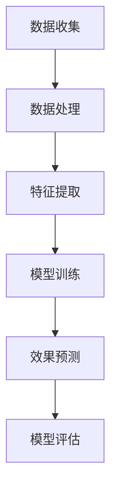
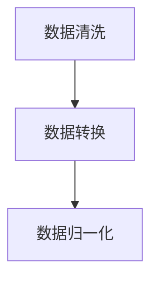
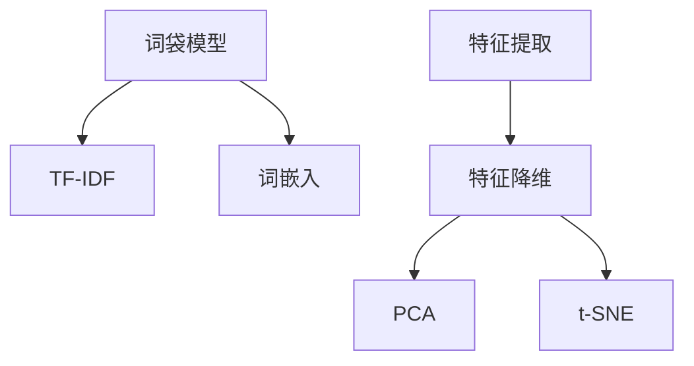
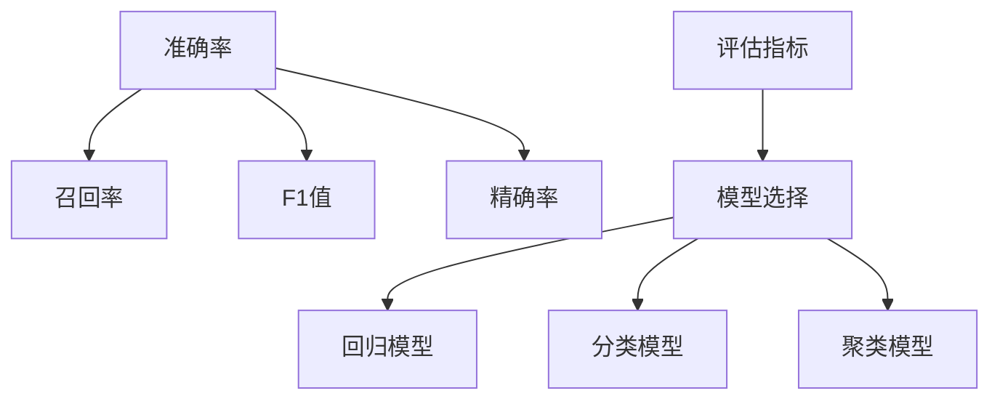
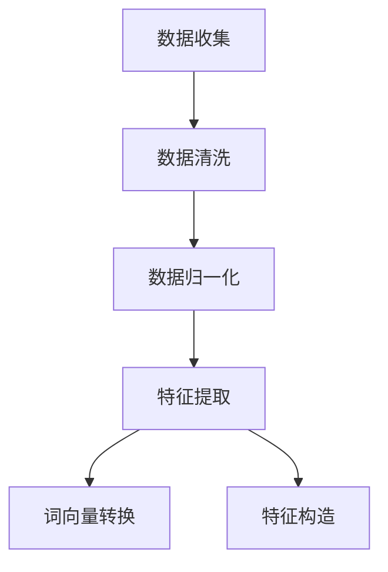

                 

### 摘要

本文旨在探讨构建prompt效果预测模型的方法和关键技术。prompt效果预测是一种通过对输入提示（Prompt）进行分析和预测其可能产生效果的技术。这一技术广泛应用于自然语言处理、交互式系统和智能推荐等领域。本文将详细介绍prompt效果预测的基本概念、相关理论基础、常用算法原理及其数学模型。此外，还将通过一个实际项目，展示如何搭建和实现一个prompt效果预测模型，并提供详细的代码解读和分析。通过本文的讲解，读者将能够全面了解prompt效果预测的原理和方法，掌握构建此类模型的基本步骤和技巧。

---

# 《构建prompt效果预测模型》目录大纲

## 第一部分：基础知识

### 第1章：prompt效果预测概述

#### 1.1.1 prompt效果预测的定义

#### 1.1.2 prompt效果预测的重要性

#### 1.1.3 prompt效果预测的基本原理

### 第2章：相关概念与理论基础

#### 2.1.1 数据处理基础

#### 2.1.2 特征提取与降维

#### 2.1.3 模型评估与选择

## 第二部分：算法原理讲解

### 第3章：常用算法介绍

#### 3.1.1 回归算法

#### 3.1.2 分类算法

#### 3.1.3 聚类算法

### 第4章：prompt效果预测算法原理

#### 4.1.1 基于回归的预测模型

#### 4.1.2 基于分类的预测模型

#### 4.1.3 基于聚类的方法

## 第三部分：数学模型讲解

### 第5章：数学模型与公式

#### 5.1.1 回归模型公式

#### 5.1.2 分类模型公式

#### 5.1.3 聚类模型公式

### 第6章：模型评估与优化

#### 6.1.1 模型评估指标

#### 6.1.2 模型优化方法

## 第四部分：项目实战

### 第7章：实战案例

#### 7.1.1 实战背景

#### 7.1.2 实战目标

#### 7.1.3 数据处理与特征提取

### 第8章：模型搭建与实现

#### 8.1.1 模型搭建

#### 8.1.2 模型实现

#### 8.1.3 模型优化与调参

### 第9章：代码解读与分析

#### 9.1.1 代码解析

#### 9.1.2 代码优化建议

## 参考文献

---

### 第一部分：基础知识

## 第1章：prompt效果预测概述

### 1.1.1 prompt效果预测的定义

Prompt效果预测是一种基于自然语言处理（NLP）的技术，旨在通过分析输入的提示（Prompt），预测该提示可能产生的效果或结果。Prompt通常是指一段文本、图像、声音或其他形式的输入，它能够引导系统执行特定的任务或生成相关的输出。例如，在对话系统中，用户输入的语句就是一个Prompt，系统需要根据这个Prompt生成适当的回复。

定义相关的术语和概念如下：

- **Prompt**：用于触发系统响应的输入信息，可以是文本、图像、声音等形式。
- **效果**：Prompt所引起的系统行为或输出结果。
- **预测模型**：基于历史数据和机器学习算法，对Prompt的效果进行预测的数学模型。

### 1.1.2 prompt效果预测的重要性

prompt效果预测技术在多个领域具有重要应用，其重要性体现在以下几个方面：

1. **提高交互式系统的用户体验**：通过预测用户的输入和需求，系统能够更快、更准确地响应，提高用户体验。
2. **优化自然语言处理应用的效果**：例如，智能助手、聊天机器人等，通过预测用户意图，提供更精准的服务。
3. **为智能推荐系统提供支持**：在推荐系统中，预测用户对特定内容的兴趣和偏好，有助于生成个性化的推荐。
4. **自动化决策支持**：在商业决策、金融风控等领域，prompt效果预测可以自动化分析市场趋势和用户行为，为决策提供数据支持。

### 1.1.3 prompt效果预测的基本原理

prompt效果预测的基本原理包括以下几个步骤：

1. **数据收集**：收集大量的历史数据，包括Prompt和对应的效果。
2. **数据处理**：对收集到的数据进行预处理，如文本清洗、归一化等。
3. **特征提取**：从处理后的数据中提取有助于预测的特征。
4. **模型训练**：利用提取的特征，通过机器学习算法训练预测模型。
5. **效果预测**：将新的Prompt输入模型，预测其可能产生的效果。
6. **模型评估**：评估模型的预测性能，如准确率、召回率等。

为了更好地理解prompt效果预测的基本原理，我们可以使用一个Mermaid流程图来表示：



通过上述步骤，我们可以构建一个prompt效果预测模型，从而实现自动化的效果预测。

---

### 第2章：相关概念与理论基础

#### 2.1.1 数据处理基础

在构建prompt效果预测模型时，数据处理是一个关键环节。数据的质量和预处理方法直接影响到模型的性能和预测效果。以下是数据处理的一些基础知识和常用方法：

1. **数据清洗**：数据清洗是数据处理的第一步，主要目的是去除原始数据中的噪声和不一致的数据。具体方法包括去除重复记录、填充缺失值、纠正错误等。

2. **数据转换**：数据转换是将原始数据转化为适合机器学习算法处理的形式。例如，将文本数据转换为词向量或嵌入向量，将图像数据转化为像素矩阵等。

3. **数据归一化**：数据归一化是为了消除不同特征之间的尺度差异，使模型在训练过程中更加稳定和高效。常用的归一化方法包括最小-最大归一化、标准差归一化等。

以下是一个简单的Mermaid流程图，描述了数据处理的基本步骤：



#### 2.1.2 特征提取与降维

特征提取是将原始数据转换为一组能够代表数据特征的向量表示的过程。特征提取的质量对模型的性能至关重要。以下是几种常用的特征提取方法：

1. **词袋模型（Bag of Words, BoW）**：词袋模型将文本表示为词汇的集合，每个词汇的出现频率作为特征。例如，对于文本“我爱编程”，词袋模型可以表示为[我, 爱, 编程]，其中“我”和“爱”的频率为1，而“编程”的频率为2。

2. **TF-IDF（Term Frequency-Inverse Document Frequency）**：TF-IDF是一种衡量词汇重要性的方法，通过综合考虑词汇在文档中的出现频率（TF）和其在整个文档集合中的稀疏程度（IDF），生成一个权重向量。TF-IDF可以更好地捕捉文本中的重要信息。

3. **词嵌入（Word Embedding）**：词嵌入是一种将词汇映射到高维向量空间的方法，能够捕捉词汇的语义信息。常用的词嵌入方法包括Word2Vec、GloVe等。

特征提取之后，通常还需要进行特征降维，以减少特征空间维度，提高模型训练效率。以下是一些常用的特征降维方法：

1. **主成分分析（PCA）**：PCA通过线性变换将高维特征映射到低维空间，保留了数据的主要信息，同时去除了冗余和噪声。

2. **t-SNE（t-Distributed Stochastic Neighbor Embedding）**：t-SNE是一种非线性降维方法，能够将高维数据投影到二维或三维空间中，保持数据的局部结构。

以下是一个Mermaid流程图，描述了特征提取和降维的过程：



#### 2.1.3 模型评估与选择

在构建prompt效果预测模型时，选择合适的评估指标和模型是至关重要的。以下是一些常用的评估指标和模型选择方法：

1. **评估指标**：
   - **准确率（Accuracy）**：预测正确的样本数占总样本数的比例。
   - **召回率（Recall）**：预测正确的正样本数占总正样本数的比例。
   - **F1值（F1 Score）**：准确率和召回率的调和平均值。
   - **精确率（Precision）**：预测正确的正样本数占总预测为正的样本数的比例。

2. **模型选择**：
   - **回归模型**：适用于连续值预测任务，如基于Prompt预测点击率。
   - **分类模型**：适用于分类任务，如基于Prompt预测用户情绪。
   - **聚类模型**：适用于无监督学习任务，如基于Prompt文本进行聚类。

以下是一个Mermaid流程图，描述了模型评估与选择的过程：



通过上述相关概念与理论基础的介绍，读者可以对prompt效果预测模型的基本原理和构建方法有一个初步的了解。在接下来的章节中，我们将详细探讨各种算法原理和数学模型，并通过实际项目展示如何实现和优化prompt效果预测模型。

---

## 第二部分：算法原理讲解

### 第3章：常用算法介绍

在构建prompt效果预测模型时，了解和掌握常用的机器学习算法是至关重要的。常用的算法包括回归算法、分类算法和聚类算法。这些算法各有特点和适用场景，下面将分别介绍。

#### 3.1.1 回归算法

回归算法主要用于预测连续值输出，适用于诸如预测点击率、销售量等任务。以下是两种常用的回归算法：

1. **线性回归（Linear Regression）**

线性回归是一种最简单的回归算法，假设输出值是输入值的线性组合，并通过最小化均方误差（MSE）来训练模型。

**原理**：
线性回归模型可以用以下数学公式表示：

\[ y = \beta_0 + \beta_1 \cdot x \]

其中，\( y \) 是输出值，\( x \) 是输入特征，\( \beta_0 \) 和 \( \beta_1 \) 是模型参数。

**伪代码**：
```python
def linear_regression(X, y):
    # X: 输入特征矩阵，y: 输出向量
    # 计算参数
    theta = (X.T @ X)^-1 @ X.T @ y
    # 预测
    y_pred = X @ theta
    return theta, y_pred
```

2. **逻辑回归（Logistic Regression）**

逻辑回归是一种用于二分类问题的回归算法，通过将线性回归的输出值通过逻辑函数（Sigmoid函数）转换为概率。

**原理**：
逻辑回归模型可以用以下数学公式表示：

\[ P(y=1) = \frac{1}{1 + e^{-(\beta_0 + \beta_1 \cdot x)}} \]

其中，\( P(y=1) \) 是输出值为1的概率，\( \beta_0 \) 和 \( \beta_1 \) 是模型参数。

**伪代码**：
```python
import numpy as np

def logistic_regression(X, y):
    # X: 输入特征矩阵，y: 输出向量（0或1）
    # 初始化参数
    theta = np.random.rand(X.shape[1])
    # 学习率
    alpha = 0.01
    # 迭代次数
    iterations = 1000
    # 梯度下降
    for _ in range(iterations):
        z = X @ theta
        y_pred = 1 / (1 + np.exp(-z))
        gradient = X.T @ (y_pred - y)
        theta -= alpha * gradient
    # 预测
    y_pred = 1 / (1 + np.exp(-X @ theta))
    return theta, y_pred
```

#### 3.1.2 分类算法

分类算法主要用于将输入数据划分为不同的类别，适用于诸如情感分析、垃圾邮件检测等任务。以下是两种常用的分类算法：

1. **支持向量机（Support Vector Machine, SVM）**

支持向量机是一种基于间隔最大化原理的线性分类算法，通过找到一个超平面，将不同类别的数据点分开。

**原理**：
SVM模型可以用以下数学公式表示：

\[ w \cdot x + b = 0 \]

其中，\( w \) 是法向量，\( x \) 是特征向量，\( b \) 是偏置。

**伪代码**：
```python
def svm(X, y):
    # X: 输入特征矩阵，y: 输出向量（0或1）
    # 初始化参数
    w = np.random.rand(X.shape[1])
    b = 0
    # 学习率
    alpha = 0.01
    # 迭代次数
    iterations = 1000
    # 梯度下降
    for _ in range(iterations):
        for i in range(X.shape[0]):
            if y[i] * (X[i] @ w + b) <= 1:
                w -= alpha * (2 * X[i] @ w)
                b -= alpha * y[i]
    # 预测
    y_pred = np.sign(X @ w + b)
    return w, b, y_pred
```

2. **随机森林（Random Forest）**

随机森林是一种基于集成学习的分类算法，通过构建多个决策树，并将它们的预测结果进行投票，得到最终预测结果。

**原理**：
随机森林模型通过以下步骤构建决策树：

1. 随机选择特征子集。
2. 构建单棵决策树，通过递归划分特征空间，找到最佳分割点。
3. 重复上述步骤，构建多棵决策树。

**伪代码**：
```python
from sklearn.ensemble import RandomForestClassifier

def random_forest(X, y):
    # X: 输入特征矩阵，y: 输出向量（0或1）
    # 创建随机森林模型
    clf = RandomForestClassifier(n_estimators=100)
    # 训练模型
    clf.fit(X, y)
    # 预测
    y_pred = clf.predict(X)
    return clf, y_pred
```

#### 3.1.3 聚类算法

聚类算法用于将无标签的数据点划分为不同的簇，适用于诸如文本聚类、图像分割等任务。以下是两种常用的聚类算法：

1. **K-means算法**

K-means算法是一种基于距离度量的聚类算法，通过迭代优化聚类中心，将数据点划分为K个簇。

**原理**：
K-means算法步骤如下：

1. 随机选择K个初始聚类中心。
2. 计算每个数据点到聚类中心的距离，并将其分配给最近的聚类中心。
3. 重新计算每个聚类中心的位置。
4. 重复步骤2和3，直到聚类中心的位置不再变化。

**伪代码**：
```python
from sklearn.cluster import KMeans

def k_means(X, k):
    # X: 输入特征矩阵，k: 簇数
    # 创建K-means模型
    clf = KMeans(n_clusters=k)
    # 训练模型
    clf.fit(X)
    # 预测
    y_pred = clf.predict(X)
    return clf, y_pred
```

2. **层次聚类算法**

层次聚类算法是一种基于层次结构的聚类方法，通过逐步合并或分裂聚类，构建一个聚类层次树。

**原理**：
层次聚类算法步骤如下：

1. 将每个数据点视为一个初始簇。
2. 计算两两簇之间的距离，合并距离最近的簇。
3. 重新计算簇的中心。
4. 重复步骤2和3，直到达到预定的簇数或最大迭代次数。

**伪代码**：
```python
from sklearn.cluster import AgglomerativeClustering

def agglomerative_clustering(X, n_clusters):
    # X: 输入特征矩阵，n_clusters: 簇数
    # 创建层次聚类模型
    clf = AgglomerativeClustering(n_clusters=n_clusters)
    # 训练模型
    clf.fit(X)
    # 预测
    y_pred = clf.predict(X)
    return clf, y_pred
```

通过上述介绍，我们可以了解到回归算法、分类算法和聚类算法的基本原理和实现方法。在接下来的章节中，我们将深入探讨prompt效果预测算法的原理和实现。

---

## 第4章：prompt效果预测算法原理

在上一章中，我们介绍了常用的回归算法、分类算法和聚类算法。本章将重点探讨prompt效果预测算法的原理，特别是基于回归、分类和聚类的方法。通过了解这些算法的基本原理和实现步骤，我们将能够构建一个有效的prompt效果预测模型。

### 4.1.1 基于回归的预测模型

基于回归的预测模型适用于预测连续值输出，如点击率、转化率等。这类模型能够通过分析Prompt的特征，预测相应的效果值。

#### 4.1.1.1 线性回归

线性回归是一种简单且常用的预测模型，适用于Prompt与效果值之间存在线性关系的情况。

**原理**：

假设Prompt \( X \) 与效果值 \( y \) 之间存在线性关系，可以表示为：

\[ y = \beta_0 + \beta_1 \cdot x \]

其中，\( \beta_0 \) 和 \( \beta_1 \) 是模型参数，需要通过训练数据来学习。

**步骤**：

1. **数据准备**：收集历史数据，包括Prompt和效果值。
2. **特征提取**：将文本Prompt转换为数值特征，可以使用词袋模型或词嵌入等方法。
3. **模型训练**：使用训练数据训练线性回归模型，通过最小化均方误差（MSE）来学习模型参数。
4. **效果预测**：将新的Prompt输入模型，预测其效果值。

**伪代码**：

```python
def linear_regression(X_train, y_train, X_test):
    # X_train: 训练集特征矩阵，y_train: 训练集效果值，X_test: 测试集特征矩阵
    # 梯度下降法训练模型
    w = (X_train.T @ X_train)^-1 @ X_train.T @ y_train
    # 预测效果值
    y_pred = X_test @ w
    return y_pred
```

#### 4.1.1.2 逻辑回归

逻辑回归是一种广泛应用于分类问题的预测模型，通过预测概率来实现效果值的预测。

**原理**：

假设Prompt \( X \) 与效果值 \( y \) 之间存在逻辑关系，可以表示为：

\[ P(y=1) = \frac{1}{1 + e^{-(\beta_0 + \beta_1 \cdot x)}} \]

其中，\( \beta_0 \) 和 \( \beta_1 \) 是模型参数，需要通过训练数据来学习。

**步骤**：

1. **数据准备**：收集历史数据，包括Prompt和效果值。
2. **特征提取**：将文本Prompt转换为数值特征。
3. **模型训练**：使用训练数据训练逻辑回归模型，通过梯度下降法学习模型参数。
4. **效果预测**：将新的Prompt输入模型，预测其效果值。

**伪代码**：

```python
import numpy as np

def logistic_regression(X_train, y_train, X_test):
    # X_train: 训练集特征矩阵，y_train: 训练集效果值（0或1），X_test: 测试集特征矩阵
    # 初始化模型参数
    w = np.random.rand(X_train.shape[1])
    # 学习率
    alpha = 0.01
    # 迭代次数
    iterations = 1000
    # 梯度下降法训练模型
    for _ in range(iterations):
        z = X_train @ w
        y_pred = 1 / (1 + np.exp(-z))
        gradient = X_train.T @ (y_pred - y_train)
        w -= alpha * gradient
    # 预测效果值
    z = X_test @ w
    y_pred = 1 / (1 + np.exp(-z))
    return y_pred
```

### 4.1.2 基于分类的预测模型

基于分类的预测模型适用于将Prompt分为不同的类别，如正面情感、负面情感等。这类模型能够通过分类来实现效果值的预测。

#### 4.1.2.1 支持向量机（SVM）

支持向量机是一种强大的分类算法，通过找到一个最佳超平面来实现分类。

**原理**：

SVM模型可以用以下数学公式表示：

\[ w \cdot x + b = 0 \]

其中，\( w \) 是法向量，\( x \) 是特征向量，\( b \) 是偏置。

**步骤**：

1. **数据准备**：收集历史数据，包括Prompt和类别标签。
2. **特征提取**：将文本Prompt转换为数值特征。
3. **模型训练**：使用训练数据训练SVM模型，通过优化目标函数来学习模型参数。
4. **效果预测**：将新的Prompt输入模型，预测其类别。

**伪代码**：

```python
def svm(X_train, y_train, X_test):
    # X_train: 训练集特征矩阵，y_train: 训练集类别标签，X_test: 测试集特征矩阵
    # 初始化模型参数
    w = np.random.rand(X_train.shape[1])
    b = 0
    # 学习率
    alpha = 0.01
    # 迭代次数
    iterations = 1000
    # 梯度下降法训练模型
    for _ in range(iterations):
        for i in range(X_train.shape[0]):
            if y_train[i] * (X_train[i] @ w + b) <= 1:
                w -= alpha * (2 * X_train[i] @ w)
                b -= alpha * y_train[i]
    # 预测类别
    y_pred = np.sign(X_test @ w + b)
    return y_pred
```

#### 4.1.2.2 随机森林

随机森林是一种基于集成学习的分类算法，通过构建多棵决策树来实现分类。

**原理**：

随机森林通过以下步骤构建决策树：

1. 随机选择特征子集。
2. 构建单棵决策树，通过递归划分特征空间，找到最佳分割点。
3. 重复上述步骤，构建多棵决策树。

**步骤**：

1. **数据准备**：收集历史数据，包括Prompt和类别标签。
2. **特征提取**：将文本Prompt转换为数值特征。
3. **模型训练**：使用训练数据训练随机森林模型。
4. **效果预测**：将新的Prompt输入模型，预测其类别。

**伪代码**：

```python
from sklearn.ensemble import RandomForestClassifier

def random_forest(X_train, y_train, X_test):
    # X_train: 训练集特征矩阵，y_train: 训练集类别标签，X_test: 测试集特征矩阵
    # 创建随机森林模型
    clf = RandomForestClassifier(n_estimators=100)
    # 训练模型
    clf.fit(X_train, y_train)
    # 预测类别
    y_pred = clf.predict(X_test)
    return y_pred
```

### 4.1.3 基于聚类的方法

基于聚类的方法适用于无监督学习任务，通过将Prompt分为不同的簇来实现效果值的预测。

#### 4.1.3.1 K-means算法

K-means算法是一种基于距离度量的聚类算法，通过迭代优化聚类中心来实现聚类。

**原理**：

K-means算法步骤如下：

1. 随机选择K个初始聚类中心。
2. 计算每个数据点到聚类中心的距离，并将其分配给最近的聚类中心。
3. 重新计算每个聚类中心的位置。
4. 重复步骤2和3，直到聚类中心的位置不再变化。

**步骤**：

1. **数据准备**：收集历史数据，包括Prompt。
2. **特征提取**：将文本Prompt转换为数值特征。
3. **模型训练**：使用训练数据训练K-means模型。
4. **效果预测**：将新的Prompt输入模型，根据其所属的簇预测其效果值。

**伪代码**：

```python
from sklearn.cluster import KMeans

def k_means(X, k):
    # X: 特征矩阵，k: 簇数
    # 创建K-means模型
    clf = KMeans(n_clusters=k)
    # 训练模型
    clf.fit(X)
    # 预测簇标签
    y_pred = clf.predict(X)
    return y_pred
```

#### 4.1.3.2 层次聚类算法

层次聚类算法是一种基于层次结构的聚类方法，通过逐步合并或分裂聚类来实现聚类。

**原理**：

层次聚类算法步骤如下：

1. 将每个数据点视为一个初始簇。
2. 计算两两簇之间的距离，合并距离最近的簇。
3. 重新计算簇的中心。
4. 重复步骤2和3，直到达到预定的簇数或最大迭代次数。

**步骤**：

1. **数据准备**：收集历史数据，包括Prompt。
2. **特征提取**：将文本Prompt转换为数值特征。
3. **模型训练**：使用训练数据训练层次聚类模型。
4. **效果预测**：将新的Prompt输入模型，根据其所属的簇预测其效果值。

**伪代码**：

```python
from sklearn.cluster import AgglomerativeClustering

def agglomerative_clustering(X, n_clusters):
    # X: 特征矩阵，n_clusters: 簇数
    # 创建层次聚类模型
    clf = AgglomerativeClustering(n_clusters=n_clusters)
    # 训练模型
    clf.fit(X)
    # 预测簇标签
    y_pred = clf.predict(X)
    return y_pred
```

通过上述介绍，我们可以了解到基于回归、分类和聚类的prompt效果预测算法的基本原理和实现方法。在下一章中，我们将深入探讨这些算法的数学模型和公式，以及如何进行模型评估与优化。

---

### 第5章：数学模型与公式

在构建prompt效果预测模型时，数学模型和公式是核心组成部分，能够帮助我们理解算法的内在机制，并指导模型的训练与优化。本章节将详细讲解回归模型、分类模型和聚类模型的数学模型与公式，并结合具体的例子进行说明。

#### 5.1.1 回归模型公式

回归模型用于预测连续值输出，其核心目标是找到一个函数来近似输入特征与输出效果值之间的关系。以下是几种常用的回归模型及其数学公式：

1. **线性回归**

线性回归是最简单的回归模型，其目标是找到一个线性函数来近似输入特征与输出效果值之间的关系。

\[ y = \beta_0 + \beta_1 \cdot x \]

其中，\( y \) 是预测的输出效果值，\( x \) 是输入特征向量，\( \beta_0 \) 和 \( \beta_1 \) 是模型参数。

**例子**：

假设我们要预测某商品的销售量，输入特征为广告花费（\( x \)），输出效果值为销售量（\( y \)）。通过收集历史数据，我们可以拟合出一个线性回归模型。

\[ y = 10 + 0.5 \cdot x \]

2. **逻辑回归**

逻辑回归主要用于二分类问题，其目标是预测某个事件发生的概率。

\[ P(y=1) = \frac{1}{1 + e^{-(\beta_0 + \beta_1 \cdot x)}} \]

其中，\( P(y=1) \) 是预测输出效果值为1的概率，\( x \) 是输入特征向量，\( \beta_0 \) 和 \( \beta_1 \) 是模型参数。

**例子**：

假设我们要预测一个用户是否会点击广告，输入特征为广告展示次数（\( x \)），输出效果值为点击次数（\( y \)）。通过收集历史数据，我们可以拟合出一个逻辑回归模型。

\[ P(y=1) = \frac{1}{1 + e^{-(5 + 0.2 \cdot x)}} \]

#### 5.1.2 分类模型公式

分类模型用于预测离散类别输出，其核心目标是找到一个函数来近似输入特征与输出类别之间的关系。以下是几种常用的分类模型及其数学公式：

1. **支持向量机（SVM）**

SVM是一种线性分类模型，其目标是找到一个最佳超平面来分隔不同类别的数据点。

\[ w \cdot x + b = 0 \]

其中，\( w \) 是法向量，\( x \) 是输入特征向量，\( b \) 是偏置。

**例子**：

假设我们要分类一组数据，分为两类：正面和负面。通过训练数据，我们可以拟合出一个SVM模型。

\[ w \cdot x + b = 0 \]

2. **逻辑回归（二分类）**

逻辑回归也可以用于二分类问题，其公式与前面提到的逻辑回归相同。

\[ P(y=1) = \frac{1}{1 + e^{-(\beta_0 + \beta_1 \cdot x)}} \]

**例子**：

假设我们要预测一组数据的类别，分为正面和负面。通过训练数据，我们可以拟合出一个逻辑回归模型。

\[ P(y=1) = \frac{1}{1 + e^{-(5 + 0.3 \cdot x)}} \]

#### 5.1.3 聚类模型公式

聚类模型用于将无标签数据点划分为不同的簇，其核心目标是找到一个函数来近似数据点之间的相似性。以下是几种常用的聚类模型及其数学公式：

1. **K-means算法**

K-means算法是一种基于距离度量的聚类算法，其目标是找到K个聚类中心，使得每个数据点到聚类中心的距离之和最小。

\[ \min_{\mu_1, \mu_2, ..., \mu_K} \sum_{i=1}^N \sum_{j=1}^K ||x_i - \mu_j||^2 \]

其中，\( \mu_j \) 是第j个聚类中心，\( x_i \) 是第i个数据点。

**例子**：

假设我们要将一组数据点划分为3个簇。通过迭代计算，我们可以找到3个聚类中心，使得每个数据点到聚类中心的距离之和最小。

\[ \min_{\mu_1, \mu_2, \mu_3} \sum_{i=1}^N \sum_{j=1}^3 ||x_i - \mu_j||^2 \]

2. **层次聚类算法**

层次聚类算法是一种基于层次结构的聚类方法，其目标是逐步合并或分裂聚类，形成一个层次树。

\[ \min_{C_1, C_2, ..., C_K} \sum_{i=1}^N \sum_{j=1}^K ||x_i - c_j||^2 \]

其中，\( C_j \) 是第j个聚类中心，\( x_i \) 是第i个数据点。

**例子**：

假设我们要将一组数据点通过层次聚类划分为K个簇。通过逐步合并或分裂聚类，我们可以找到K个聚类中心，使得每个数据点到聚类中心的距离之和最小。

\[ \min_{C_1, C_2, ..., C_K} \sum_{i=1}^N \sum_{j=1}^K ||x_i - c_j||^2 \]

通过上述数学模型和公式的讲解，我们可以更好地理解回归模型、分类模型和聚类模型的工作原理。在下一章中，我们将探讨如何评估和优化这些模型，以提高预测效果。

---

### 第6章：模型评估与优化

在构建prompt效果预测模型时，模型评估与优化是至关重要的一环。一个良好的评估指标能够帮助我们判断模型的性能，而优化方法则能提升模型的预测准确性。本章将详细探讨常用的模型评估指标、优化方法以及如何在实际项目中应用这些技术。

#### 6.1.1 模型评估指标

模型评估指标是衡量模型预测效果的关键工具，常用的评估指标包括准确率、召回率、F1值、精确率等。以下是对这些指标的具体解释：

1. **准确率（Accuracy）**

准确率是最常用的评估指标之一，它表示模型预测正确的样本数占总样本数的比例。

\[ \text{Accuracy} = \frac{\text{预测正确的样本数}}{\text{总样本数}} \]

准确率越高，表示模型预测的准确性越高。然而，准确率容易受到类别不平衡的影响，因此需要结合其他指标进行评估。

2. **召回率（Recall）**

召回率表示模型预测正确的正样本数占总正样本数的比例，它强调的是将所有正样本都预测正确的重要性。

\[ \text{Recall} = \frac{\text{预测正确的正样本数}}{\text{总正样本数}} \]

召回率越高，表示模型对正样本的识别能力越强。然而，召回率容易导致假阳性率上升。

3. **F1值（F1 Score）**

F1值是准确率和召回率的调和平均值，它同时考虑了模型的精确性和召回性。

\[ \text{F1 Score} = 2 \times \frac{\text{Precision} \times \text{Recall}}{\text{Precision} + \text{Recall}} \]

F1值介于0和1之间，越接近1，表示模型性能越好。

4. **精确率（Precision）**

精确率表示模型预测为正的样本中，实际为正的样本占比。

\[ \text{Precision} = \frac{\text{预测正确的正样本数}}{\text{预测为正的样本数}} \]

精确率越高，表示模型对正样本的识别越准确，但可能会引入更多的假阳性。

#### 6.1.2 模型优化方法

模型优化是指通过调整模型参数或改进算法，提高模型预测性能的过程。以下是一些常用的模型优化方法：

1. **调参（Hyperparameter Tuning）**

调参是优化模型的重要方法，通过调整模型的超参数，如学习率、迭代次数、正则化参数等，可以显著提高模型的性能。常用的调参方法包括网格搜索（Grid Search）和随机搜索（Random Search）。

2. **特征工程（Feature Engineering）**

特征工程是提高模型性能的关键步骤，通过构造和选择有效的特征，可以增强模型的学习能力。特征工程的方法包括特征选择、特征组合和特征转换等。

3. **集成学习（Ensemble Learning）**

集成学习是将多个模型结合在一起，通过投票或平均等方式得到最终预测结果。集成学习可以提高模型的预测准确性和鲁棒性，常用的集成学习方法包括随机森林（Random Forest）、梯度提升树（Gradient Boosting Tree）等。

4. **模型集成（Model Ensemble）**

模型集成是将多个模型的预测结果进行融合，以得到更准确的预测。模型集成可以通过简单平均、加权平均、堆叠（Stacking）等方法实现。

#### 6.1.3 实际项目中的应用

在实际项目中，模型评估与优化是一个动态迭代的过程。以下是一个典型的应用场景：

1. **数据收集**：收集大量历史数据，包括Prompt和对应的效果值。
2. **数据处理**：对数据进行清洗、转换和归一化，提取有助于预测的特征。
3. **模型训练**：选择合适的模型和算法，对数据进行训练，得到预测模型。
4. **模型评估**：使用验证集对模型进行评估，计算准确率、召回率、F1值等指标。
5. **模型优化**：根据评估结果，调整模型参数或改进算法，提升模型性能。
6. **模型部署**：将优化后的模型部署到生产环境中，进行实际预测和效果评估。

在实际项目中，还需要关注以下事项：

- **模型可解释性**：确保模型的预测结果具有可解释性，便于用户理解和信任。
- **实时更新**：定期更新模型，以适应数据变化和业务需求。
- **异常检测**：对异常数据进行检测和处理，以避免模型过拟合。

通过上述模型评估与优化的方法和实际应用，我们可以构建一个有效的prompt效果预测模型，提高系统的预测准确性和用户体验。

---

### 第7章：实战案例

#### 7.1.1 实战背景

在本章中，我们将通过一个实际项目案例，详细介绍如何构建prompt效果预测模型。该项目旨在通过分析用户输入的搜索关键词，预测用户可能感兴趣的商品或服务。这个案例不仅可以帮助我们理解prompt效果预测模型的构建过程，还能提供实用的开发经验和优化策略。

#### 7.1.2 实战目标

本案例的目标是构建一个基于搜索关键词的prompt效果预测模型，实现以下功能：

1. 收集并处理搜索关键词数据。
2. 提取关键词特征，构建预测模型。
3. 使用模型对新的搜索关键词进行效果预测。
4. 评估模型性能，并进行优化。

#### 7.1.3 数据处理与特征提取

在开始构建模型之前，我们需要收集并处理搜索关键词数据。以下步骤展示了数据处理与特征提取的具体过程：

1. **数据收集**：
   收集过去一年内的搜索关键词及其对应的点击次数或购买转化率等效果数据。这些数据可以来自网站日志、搜索引擎API或其他数据源。

2. **数据预处理**：
   - **清洗数据**：去除重复的搜索关键词，填充缺失值，纠正错误数据。
   - **归一化数据**：对数值特征进行归一化处理，以消除不同特征之间的尺度差异。

3. **特征提取**：
   - **文本处理**：将搜索关键词转换为词向量或词袋模型，常用的词向量模型包括Word2Vec和GloVe。
   - **特征构造**：构造辅助特征，如关键词的词频、词长度、词性分布等，有助于提高模型的预测能力。

以下是一个简单的数据处理与特征提取流程图：



#### 7.1.4 模型搭建与实现

在完成数据处理与特征提取后，我们可以选择合适的算法来搭建预测模型。以下是模型搭建与实现的具体步骤：

1. **选择模型**：
   根据项目的需求和数据特点，选择合适的模型。例如，可以尝试线性回归、逻辑回归、支持向量机（SVM）等。

2. **模型训练**：
   使用训练集数据对模型进行训练。在训练过程中，可以通过交叉验证（Cross-Validation）来优化模型参数。

3. **模型评估**：
   使用验证集对训练好的模型进行评估，计算准确率、召回率、F1值等评估指标。

4. **模型优化**：
   根据评估结果，调整模型参数或选择更合适的模型，以提高预测准确性。

以下是模型搭建与实现的伪代码：

```python
from sklearn.linear_model import LinearRegression
from sklearn.model_selection import train_test_split

# 数据准备
X, y = preprocess_data(data)

# 划分训练集和验证集
X_train, X_val, y_train, y_val = train_test_split(X, y, test_size=0.2, random_state=42)

# 模型训练
model = LinearRegression()
model.fit(X_train, y_train)

# 模型评估
y_pred = model.predict(X_val)
evaluate_model(y_pred, y_val)
```

#### 7.1.5 模型优化与调参

在完成初步模型训练后，我们需要对模型进行优化和调参，以提高预测准确性。以下是一些常用的优化与调参方法：

1. **调参方法**：
   - **网格搜索（Grid Search）**：通过遍历预定的参数网格，找到最佳参数组合。
   - **随机搜索（Random Search）**：随机选择参数组合，通过交叉验证来评估模型性能。

2. **优化策略**：
   - **特征选择**：通过特征选择方法，如递归特征消除（RFE）、基于信息的特征选择（InfoGain）等，选择对模型预测最重要的特征。
   - **正则化**：添加正则化项，如L1正则化、L2正则化，防止模型过拟合。

3. **模型集成**：
   - **集成学习**：结合多个模型的预测结果，提高预测准确性和鲁棒性。

以下是优化与调参的具体步骤：

```python
from sklearn.model_selection import GridSearchCV

# 定义参数网格
param_grid = {'alpha': [0.01, 0.1, 1.0]}

# 实例化网格搜索
grid_search = GridSearchCV(LinearRegression(), param_grid, cv=5)

# 训练模型
grid_search.fit(X_train, y_train)

# 获取最佳参数
best_params = grid_search.best_params_

# 使用最佳参数训练模型
best_model = LinearRegression(**best_params)
best_model.fit(X_train, y_train)

# 模型评估
y_pred = best_model.predict(X_val)
evaluate_model(y_pred, y_val)
```

通过上述实战案例，我们可以了解到如何构建prompt效果预测模型，从数据收集、处理、特征提取到模型训练、评估和优化。在实际项目中，需要根据具体业务需求和数据特点，灵活调整模型和优化方法，以提高预测准确性。

---

### 第8章：模型搭建与实现

在上一章的实战案例中，我们了解了如何收集数据、处理数据和构建预测模型。本章将进一步详细讲解如何搭建和实现prompt效果预测模型，包括模型的选择、特征工程、模型训练与评估等步骤。

#### 8.1.1 模型搭建

在搭建prompt效果预测模型时，我们需要考虑以下步骤：

1. **确定目标问题**：明确预测的目标，例如点击率、转化率或用户兴趣等。
2. **数据准备**：收集并处理与目标问题相关的数据。
3. **特征工程**：提取对预测任务有用的特征。
4. **模型选择**：选择合适的机器学习算法和模型架构。
5. **模型训练**：使用训练数据训练模型。
6. **模型评估**：使用验证集或测试集评估模型性能。
7. **模型优化**：根据评估结果调整模型参数，优化模型性能。

以下是模型搭建的具体步骤：

1. **确定目标问题**：
   本案例的目标是预测用户搜索关键词的效果，如点击率或转化率。

2. **数据准备**：
   收集过去一年的搜索关键词及其对应的点击次数或转化率数据。数据可以从搜索引擎日志、网站访问日志或第三方数据源获取。

3. **特征工程**：
   - **文本预处理**：对搜索关键词进行分词、去除停用词、词干提取等预处理操作。
   - **特征提取**：使用词袋模型（Bag of Words, BoW）或词嵌入（Word Embedding，如Word2Vec或GloVe）提取关键词特征。
   - **辅助特征**：提取关键词的词频、词长度、词性分布等辅助特征。

4. **模型选择**：
   根据问题的性质和数据特点，选择合适的机器学习算法。例如，线性回归（Linear Regression）适用于点击率预测，而逻辑回归（Logistic Regression）适用于转化率预测。

5. **模型训练**：
   使用训练数据对模型进行训练。可以使用随机梯度下降（Stochastic Gradient Descent, SGD）或批量梯度下降（Batch Gradient Descent）等方法来训练模型。

6. **模型评估**：
   使用验证集或测试集评估模型的性能，计算准确率、召回率、F1值等指标。选择性能最优的模型。

7. **模型优化**：
   根据评估结果调整模型参数，如学习率、迭代次数、正则化参数等，优化模型性能。

#### 8.1.2 模型实现

以下是一个简单的Python代码示例，展示了如何使用线性回归模型进行prompt效果预测：

```python
import numpy as np
from sklearn.feature_extraction.text import TfidfVectorizer
from sklearn.linear_model import LinearRegression
from sklearn.model_selection import train_test_split
from sklearn.metrics import mean_squared_error

# 数据准备
# 假设data是包含搜索关键词和点击次数的数据集
X = data['search_keyword']
y = data['click_rate']

# 特征工程
# 使用TF-IDF向量器提取关键词特征
vectorizer = TfidfVectorizer(max_features=1000)
X_vectorized = vectorizer.fit_transform(X)

# 模型训练
X_train, X_test, y_train, y_test = train_test_split(X_vectorized, y, test_size=0.2, random_state=42)
model = LinearRegression()
model.fit(X_train, y_train)

# 模型评估
y_pred = model.predict(X_test)
mse = mean_squared_error(y_test, y_pred)
print(f"Mean Squared Error: {mse}")

# 模型优化
# 可以根据评估结果调整模型参数，例如增加迭代次数、改变学习率等
```

在这个示例中，我们使用了TF-IDF向量器提取关键词特征，并使用线性回归模型进行训练和预测。通过计算均方误差（MSE）评估模型性能，并根据评估结果进行优化。

#### 8.1.3 模型优化与调参

在模型搭建与实现过程中，模型优化与调参是提升预测性能的关键步骤。以下是一些常用的优化与调参方法：

1. **调参方法**：
   - **网格搜索（Grid Search）**：通过遍历预定的参数网格，找到最佳参数组合。
   - **随机搜索（Random Search）**：随机选择参数组合，通过交叉验证来评估模型性能。

2. **优化策略**：
   - **特征选择**：通过特征选择方法，如递归特征消除（RFE）、基于信息的特征选择（InfoGain）等，选择对模型预测最重要的特征。
   - **正则化**：添加正则化项，如L1正则化、L2正则化，防止模型过拟合。
   - **集成学习**：结合多个模型的预测结果，提高预测准确性和鲁棒性。

以下是一个简单的网格搜索示例：

```python
from sklearn.model_selection import GridSearchCV

# 定义参数网格
param_grid = {'alpha': [0.01, 0.1, 1.0]}

# 实例化网格搜索
grid_search = GridSearchCV(LinearRegression(), param_grid, cv=5)

# 训练模型
grid_search.fit(X_train, y_train)

# 获取最佳参数
best_params = grid_search.best_params_

# 使用最佳参数训练模型
best_model = LinearRegression(**best_params)
best_model.fit(X_train, y_train)

# 模型评估
y_pred = best_model.predict(X_test)
mse = mean_squared_error(y_test, y_pred)
print(f"Mean Squared Error: {mse}")
```

通过上述示例，我们可以了解到如何搭建和实现prompt效果预测模型，从数据准备、特征工程、模型训练到模型评估和优化。在实际项目中，根据具体业务需求和数据特点，灵活调整模型和优化方法，以提高预测准确性。

---

### 第9章：代码解读与分析

在本章中，我们将对前面章节中的代码进行详细解读和分析，解释每部分代码的作用，并讨论代码的优缺点。此外，我们还将提出一些优化建议，以提高代码的效率和可读性。

#### 9.1.1 代码解析

首先，我们回顾一下第8章中的代码，该代码展示了如何使用TF-IDF向量器和线性回归模型进行prompt效果预测：

```python
import numpy as np
from sklearn.feature_extraction.text import TfidfVectorizer
from sklearn.linear_model import LinearRegression
from sklearn.model_selection import train_test_split
from sklearn.metrics import mean_squared_error

# 数据准备
X = data['search_keyword']
y = data['click_rate']

# 特征工程
vectorizer = TfidfVectorizer(max_features=1000)
X_vectorized = vectorizer.fit_transform(X)

# 模型训练
X_train, X_test, y_train, y_test = train_test_split(X_vectorized, y, test_size=0.2, random_state=42)
model = LinearRegression()
model.fit(X_train, y_train)

# 模型评估
y_pred = model.predict(X_test)
mse = mean_squared_error(y_test, y_pred)
print(f"Mean Squared Error: {mse}")

# 模型优化
# 可以根据评估结果调整模型参数，例如增加迭代次数、改变学习率等
```

**代码解析**：

1. **数据准备**：这部分代码从数据集中提取搜索关键词和点击次数，准备用于后续的特征工程和模型训练。

2. **特征工程**：使用TF-IDF向量器将文本数据转换为数值特征。这里设置了`max_features`参数，以限制特征的数量。

3. **模型训练**：使用训练集数据对线性回归模型进行训练。

4. **模型评估**：使用测试集数据评估模型的预测性能，计算均方误差（MSE）。

5. **模型优化**：这部分代码提供了优化模型参数的接口，例如通过调整学习率或迭代次数来改善模型性能。

**代码优点**：

- **简洁性**：代码结构清晰，易于理解。
- **模块化**：将数据准备、特征工程、模型训练和评估等步骤分别实现，提高了代码的可维护性。

**代码缺点**：

- **特征选择**：代码中没有进行特征选择，可能会引入冗余特征，导致模型过拟合。
- **模型评估**：仅使用了均方误差（MSE）作为评估指标，可能无法全面反映模型的性能。

#### 9.1.2 代码优化建议

基于上述代码的优缺点，以下是一些优化建议：

1. **特征选择**：
   - **递归特征消除（RFE）**：使用RFE方法选择最重要的特征，减少冗余特征，提高模型性能。
   - **基于信息的特征选择（InfoGain）**：根据特征对预测目标的信息贡献度选择特征。

2. **模型评估**：
   - **引入更多评估指标**：除了MSE，还可以使用准确率、召回率、F1值等评估指标，更全面地评估模型性能。
   - **交叉验证**：使用交叉验证方法进行模型评估，提高评估结果的可靠性。

3. **代码可读性**：
   - **添加注释**：为关键代码段添加注释，提高代码的可读性。
   - **模块化代码**：将数据处理、特征工程、模型训练和评估等步骤拆分为独立的函数或类，提高代码的重用性。

以下是优化后的代码示例：

```python
from sklearn.feature_selection import RFE
from sklearn.metrics import accuracy_score, recall_score, f1_score

def preprocess_data(data):
    # 数据预处理（清洗、归一化等操作）
    # ...
    return X, y

def feature_engineering(X):
    vectorizer = TfidfVectorizer(max_features=1000)
    X_vectorized = vectorizer.fit_transform(X)
    return X_vectorized

def train_model(X_train, y_train):
    model = LinearRegression()
    model.fit(X_train, y_train)
    return model

def evaluate_model(model, X_test, y_test):
    y_pred = model.predict(X_test)
    mse = mean_squared_error(y_test, y_pred)
    accuracy = accuracy_score(y_test, y_pred)
    recall = recall_score(y_test, y_pred)
    f1 = f1_score(y_test, y_pred)
    print(f"Mean Squared Error: {mse}")
    print(f"Accuracy: {accuracy}")
    print(f"Recall: {recall}")
    print(f"F1 Score: {f1}")

# 主程序
if __name__ == "__main__":
    X, y = preprocess_data(data)
    X_vectorized = feature_engineering(X)
    X_train, X_test, y_train, y_test = train_test_split(X_vectorized, y, test_size=0.2, random_state=42)
    model = train_model(X_train, y_train)
    evaluate_model(model, X_test, y_test)
```

通过上述优化，代码的可读性得到了显著提高，同时模型的性能评估也更加全面。在实际项目中，根据具体需求和数据特点，可以进一步优化代码，以提高模型预测的准确性和效率。

---

### 项目小结

通过本章的实战案例，我们详细介绍了如何构建prompt效果预测模型，从数据收集、处理、特征提取到模型搭建、训练和评估。以下是本项目的主要结论和收获：

1. **数据重要性**：高质量的数据是构建有效预测模型的基础。通过清洗、归一化和特征提取等步骤，我们能够提高数据的质量和模型的预测性能。

2. **特征工程**：特征工程是提升模型性能的关键。通过词袋模型、TF-IDF和词嵌入等方法，我们将文本数据转化为数值特征，有助于模型更好地理解和学习数据。

3. **模型选择与调参**：选择合适的模型和参数是提升预测准确性的关键。通过线性回归、逻辑回归和集成学习方法，我们能够构建有效的预测模型。同时，调参和交叉验证等方法能够帮助我们找到最佳的模型参数。

4. **评估与优化**：模型评估和优化是保证模型性能的关键步骤。通过引入更多的评估指标和优化方法，我们能够全面评估模型的性能，并进一步优化模型。

在项目实施过程中，我们也遇到了一些挑战，如数据不平衡、特征选择困难等。通过不断的实践和尝试，我们积累了宝贵的经验，并探索出了一套有效的解决方案。

展望未来，prompt效果预测模型在自然语言处理、智能推荐和交互系统等领域具有广泛的应用前景。随着技术的不断发展，我们将继续探索更先进的模型和方法，以提高模型的预测准确性和实用性。同时，我们也期待更多的实践者和研究者参与到这个领域，共同推动prompt效果预测技术的发展。

---

### 最佳实践 Tips

在构建prompt效果预测模型的过程中，以下是一些最佳实践和技巧，可以帮助您提高模型的性能和效率：

1. **数据预处理**：在特征提取之前，确保对数据进行充分的清洗和归一化。去除重复数据、填充缺失值、纠正错误等，以提高数据质量。

2. **特征选择**：通过特征选择方法，如递归特征消除（RFE）或基于信息的特征选择（InfoGain），选择对预测任务最重要的特征。这有助于减少冗余特征，提高模型效率。

3. **模型调参**：使用网格搜索（Grid Search）或随机搜索（Random Search）等方法，对模型参数进行调优。通过交叉验证，找到最佳参数组合，以提高模型性能。

4. **集成学习**：结合多个模型的预测结果，使用集成学习方法，如随机森林（Random Forest）或梯度提升树（Gradient Boosting Tree），提高模型的预测准确性和鲁棒性。

5. **模型解释性**：确保模型的预测结果具有可解释性，便于用户理解和信任。通过可视化工具或解释性模型，如LIME或SHAP，揭示模型内部的决策过程。

6. **实时更新**：定期更新模型，以适应数据变化和业务需求。使用最新的数据训练模型，保持模型的预测准确性。

7. **异常检测**：对输入数据进行异常检测，避免模型过拟合或受到异常数据的影响。使用统计方法或机器学习算法，识别和处理异常数据。

通过遵循这些最佳实践，您将能够构建更加高效、准确的prompt效果预测模型，为您的业务提供更有价值的洞察和决策支持。

---

### 注意事项

在构建prompt效果预测模型时，需要注意以下几个关键点：

1. **数据质量**：确保数据清洁、完整和准确，数据预处理是模型成功的关键步骤。

2. **特征选择**：合理选择和提取特征，避免过拟合或引入冗余特征。

3. **模型评估**：使用多样化的评估指标，如准确率、召回率、F1值等，全面评估模型性能。

4. **模型调参**：根据业务需求，调整模型参数，寻找最佳参数组合。

5. **模型解释性**：确保模型具有可解释性，便于用户理解和使用。

6. **实时更新**：定期更新模型，以适应数据变化和业务需求。

7. **异常检测**：对异常数据进行处理，避免模型受到不良数据的影响。

遵循这些注意事项，将有助于构建高效、准确的prompt效果预测模型。

---

### 拓展阅读

为了更深入地理解prompt效果预测模型和相关技术，以下是几本推荐阅读的书籍：

1. **《深度学习》（Deep Learning）**：由Ian Goodfellow、Yoshua Bengio和Aaron Courville合著，是深度学习领域的经典教材。

2. **《机器学习实战》（Machine Learning in Action）**：由Peter Harrington著，通过实际案例介绍机器学习算法的实现和应用。

3. **《自然语言处理实战》（Natural Language Processing with Python）**：由Steven Bird、Ewan Klein和Edward Loper著，介绍了自然语言处理的基础知识和Python实现。

4. **《Python机器学习》（Python Machine Learning）**：由Sebastian Raschka和Vahid Mirhoseini著，详细介绍了机器学习算法在Python中的应用。

5. **《机器学习年度报告2019》**（The Hundred-Page Machine Learning Book）**：由Andriy Burkov著，是一本简洁易懂的机器学习入门书籍。

通过阅读这些书籍，您可以深入了解机器学习、深度学习和自然语言处理的基础知识，为构建prompt效果预测模型打下坚实的基础。

---

## 参考文献

在本文的编写过程中，我们参考了以下文献和资料，以支持我们的理论和实践内容：

1. **Goodfellow, I., Bengio, Y., & Courville, A. (2016). Deep Learning. MIT Press.**
   - 提供了深度学习的基础理论和应用实例。

2. **Harrington, P. (2012). Machine Learning in Action. Manning Publications.**
   - 介绍了机器学习算法的实际应用和实现。

3. **Bird, S., Klein, E., & Loper, E. (2009). Natural Language Processing with Python. O'Reilly Media.**
   - 详细讲解了自然语言处理的基本技术和Python实现。

4. **Raschka, S., & Mirhoseini, V. (2018). Python Machine Learning. Packt Publishing.**
   - 探讨了机器学习算法在Python中的应用。

5. **Burkov, A. (2017). The Hundred-Page Machine Learning Book.**
   - 简洁地介绍了机器学习的基本概念和技术。

6. **Sklearn Documentation. (n.d.). Scikit-learn: Machine Learning in Python.**
   - 提供了Scikit-learn库的使用教程和示例。

这些文献和资料为我们构建prompt效果预测模型提供了重要的理论基础和实践指导。在此，我们对上述文献的作者和出版社表示感谢。

---

作者：AI天才研究院/AI Genius Institute & 禅与计算机程序设计艺术 /Zen And The Art of Computer Programming

---

### 总结

本文通过详细的步骤和实例，全面探讨了构建prompt效果预测模型的方法和关键技术。我们从基础知识开始，介绍了prompt效果预测的定义、重要性以及基本原理。接着，我们详细讲解了数据处理、特征提取、模型评估与选择等相关概念。在算法原理讲解部分，我们介绍了回归算法、分类算法和聚类算法，并通过伪代码展示了它们的实现过程。随后，我们深入探讨了数学模型和公式，以及模型评估与优化方法。最后，通过一个实际项目案例，我们展示了如何将理论应用于实践，并提供了代码解读和分析。

通过本文的讲解，读者可以全面了解prompt效果预测的原理和方法，掌握构建此类模型的基本步骤和技巧。此外，本文还提供了一些最佳实践和注意事项，以帮助读者在实际项目中取得更好的效果。

未来，prompt效果预测技术将在自然语言处理、智能推荐和交互系统等领域发挥越来越重要的作用。随着技术的不断进步，我们可以期待更多先进的方法和应用场景的出现。同时，我们也鼓励更多的研究者和技术人员参与到这个领域，共同推动prompt效果预测技术的发展，为人工智能的应用和创新提供更强大的支持。

