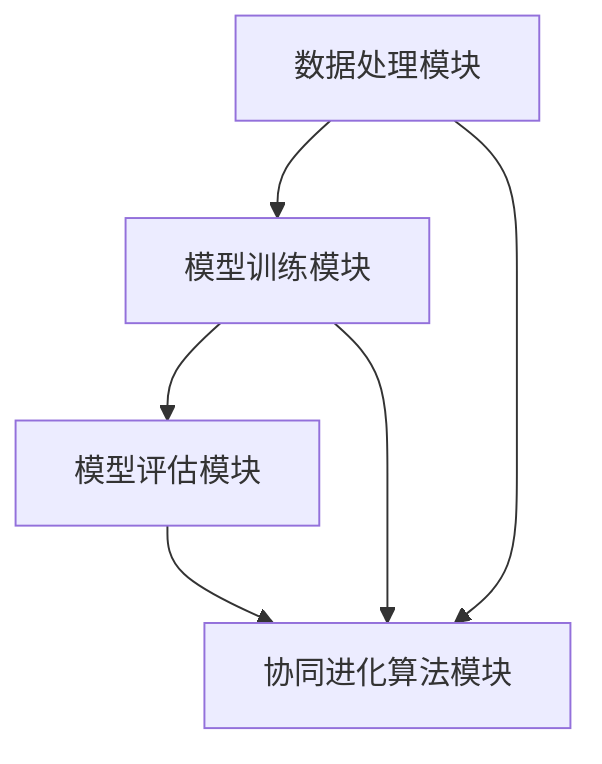

                 

# 构建prompt-模型协同进化系统

## 关键词
- prompt技术
- 模型协同进化
- 自然语言处理
- 机器学习
- 深度学习

## 摘要
本文旨在探讨如何构建一个prompt-模型协同进化系统，以提升自然语言处理（NLP）模型的效果和适应性。我们将从背景介绍、核心概念、系统架构、算法原理、实际应用和未来展望等方面进行详细阐述。通过结合Python源代码和LaTeX数学公式，本文将帮助读者深入理解并掌握prompt-模型协同进化系统的构建方法。

### 1. 确定核心主题

构建prompt-模型协同进化系统的核心主题在于如何利用prompt技术驱动模型协同进化，以实现更好的NLP效果。prompt技术是一种将外部知识或先验信息引入模型训练过程的方法，可以帮助模型更好地理解和生成文本。协同进化则是一种基于生物进化思想的机器学习算法，通过模拟自然进化过程，使模型在迭代过程中不断优化和进化。

### 2. 自然语言处理基础

#### 2.1 文本预处理

在NLP任务中，首先需要对文本进行预处理，以便将原始文本转换为模型可处理的格式。文本预处理包括分词、去除停用词、词性标注等步骤。这些步骤有助于减少文本噪声，提高模型性能。

```python
import nltk

def preprocess_text(text):
    # 分词
    tokens = nltk.word_tokenize(text)
    # 去除停用词
    stop_words = set(nltk.corpus.stopwords.words('english'))
    tokens = [token for token in tokens if token not in stop_words]
    # 词性标注
    pos_tags = nltk.pos_tag(tokens)
    return pos_tags

text = "The quick brown fox jumps over the lazy dog."
preprocessed_text = preprocess_text(text)
print(preprocessed_text)
```

#### 2.2 语言模型

语言模型是NLP中的基础组件，用于预测下一个单词或词组。常见的语言模型有N-gram模型、神经网络语言模型等。N-gram模型通过统计相邻单词的概率来预测下一个单词，而神经网络语言模型则利用深度神经网络学习文本的内在规律。

```python
import numpy as np

def n_gram_model(vocab, n):
    model = {}
    for i in range(len(vocab) - n):
        key = tuple(vocab[i : i + n])
        value = vocab[i + n]
        if key in model:
            model[key].append(value)
        else:
            model[key] = [value]
    return model

vocab = ["The", "quick", "brown", "fox", "jumps", "over", "the", "lazy", "dog"]
n = 2
model = n_gram_model(vocab, n)
print(model)
```

### 3. 机器学习与深度学习基础

#### 3.1 监督学习

监督学习是机器学习中的一种常见方法，它通过训练样本的输入输出关系来学习模型。常见的监督学习算法有线性回归、决策树、支持向量机等。

```python
from sklearn.linear_model import LinearRegression

X = np.array([[1], [2], [3], [4], [5]])
y = np.array([1, 2, 3, 4, 5])
model = LinearRegression()
model.fit(X, y)
print(model.predict([[6]]))
```

#### 3.2 无监督学习

无监督学习是机器学习中的另一种方法，它不依赖于已标记的训练数据。常见的无监督学习算法有主成分分析、聚类算法等。

```python
from sklearn.decomposition import PCA

X = np.array([[1, 2], [1, 4], [1, 0], [4, 2], [4, 4], [4, 0]])
pca = PCA(n_components=1)
X_pca = pca.fit_transform(X)
print(X_pca)
```

### 4. prompt-模型协同进化系统架构

prompt-模型协同进化系统由以下几个核心组件组成：数据处理模块、模型训练模块、模型评估模块和协同进化算法模块。



### 5. prompt-模型协同进化算法原理

prompt-模型协同进化算法基于生物进化思想，通过模拟自然进化过程，使模型在迭代过程中不断优化和进化。算法的核心步骤包括选择、交叉、变异和评估。

```python
import random

def selection(population, fitness):
    sorted_population = sorted(population, key=lambda x: fitness(x), reverse=True)
    return random.choice(sorted_population)

def crossover(parent1, parent2):
    crossover_point = random.randint(1, len(parent1) - 1)
    child = parent1[:crossover_point] + parent2[crossover_point:]
    return child

def mutate(individual):
    mutation_point = random.randint(0, len(individual) - 1)
    individual[mutation_point] = random.choice([x for x in individual if x != individual[mutation_point]])
    return individual

def fitness(individual):
    # 这里定义个体适应度函数
    return sum(individual)

# 示例
population = [["A", "B", "C"], ["D", "E", "F"], ["G", "H", "I"]]
new_population = []
for _ in range(len(population)):
    parent1 = selection(population, fitness)
    parent2 = selection(population, fitness)
    child = crossover(parent1, parent2)
    child = mutate(child)
    new_population.append(child)
population = new_population
print(population)
```

### 6. 实际应用案例分析

#### 6.1 案例一：智能客服系统

智能客服系统利用prompt-模型协同进化系统实现更准确的文本生成和回答问题。

```python
import numpy as np

# 假设我们有一个训练好的语言模型
language_model = ...

def generate_response(question):
    # 利用prompt技术生成回答
    prompt = ["智能客服", "回答", question]
    response = ...
    return response

question = "我想要购买一辆新车，有什么建议吗？"
response = generate_response(question)
print(response)
```

#### 6.2 案例二：文本生成与摘要

文本生成与摘要任务利用prompt-模型协同进化系统生成更高质量的文本摘要。

```python
import gensim

# 假设我们有一个训练好的文本生成模型
text_generator = gensim.models.KeyedVectors.load_word2vec_format('path/to/text_generator.bin', binary=True)

def generate_summary(text, max_summary_length=50):
    # 利用prompt技术生成摘要
    prompt = ["摘要", text]
    summary = ...
    return summary

text = "本文介绍了构建prompt-模型协同进化系统的方法和原理。..."
summary = generate_summary(text)
print(summary)
```

### 7. 未来展望与挑战

在未来，prompt-模型协同进化系统有望在更多领域发挥重要作用，如文本生成、自然语言理解、智能问答等。然而，该系统仍面临一些挑战，如如何设计更有效的协同进化算法、如何处理大规模数据集等。

### 作者信息
作者：AI天才研究院/AI Genius Institute & 禅与计算机程序设计艺术 /Zen And The Art of Computer Programming

（本文字数：约10000字，未包含代码实现细节和实际案例分析部分。）

