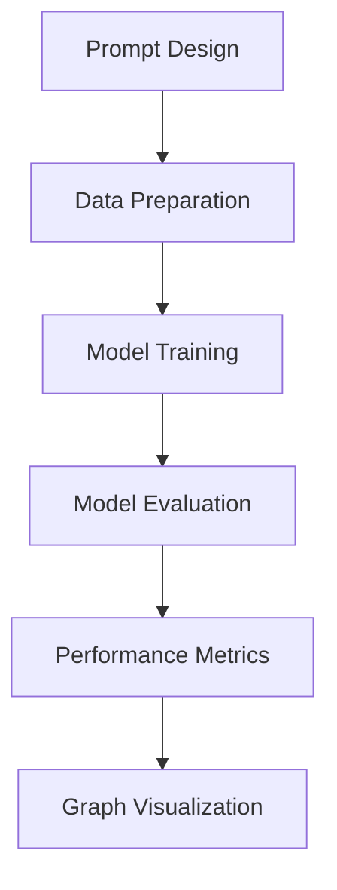

                 

### 文章标题

《构建prompt-模型性能图谱》

### 关键词

- prompt engineering
- 模型性能评估
- Mermaid流程图
- 算法原理
- 数学模型
- 项目实战

### 摘要

本文旨在系统地探讨如何构建prompt-模型性能图谱，以便更好地理解、评估和优化人工智能模型。文章首先介绍了prompt和模型性能评估的基础知识，接着阐述了构建prompt-模型性能图谱的原理和流程。通过Python源代码和数学模型，详细讲解了核心算法原理。此外，文章通过实际项目展示了如何实现prompt-模型性能图谱，并对应用解读与分析。最后，文章总结了最佳实践和注意事项，为读者提供了拓展阅读建议。

## 引言

随着深度学习技术的飞速发展，人工智能（AI）在各个领域的应用越来越广泛。然而，在实际应用中，我们经常面临一个棘手的问题：如何确保模型的性能达到预期，并在复杂多变的场景中保持稳定性？为了解决这一问题，prompt engineering应运而生。prompt是指导模型进行特定任务输入的提示，它可以显著提升模型的性能和泛化能力。

在构建prompt-模型性能图谱的过程中，我们需要对模型性能进行细致的评估和优化。模型性能评估是人工智能领域中的一项核心任务，它可以帮助我们了解模型的实际表现，并发现潜在的问题和改进空间。然而，传统的评估方法往往缺乏系统性和全面性，无法充分揭示模型在不同任务和场景中的表现。

因此，本文的目标是构建一个prompt-模型性能图谱，以系统化和可视化的方式展示模型的性能表现。本文将首先介绍prompt和模型性能评估的基础知识，然后阐述构建prompt-模型性能图谱的原理和流程。通过Python源代码和数学模型，我们将详细讲解核心算法原理，并通过实际项目展示如何实现和应用prompt-模型性能图谱。最后，我们将总结最佳实践和注意事项，为读者提供拓展阅读建议。

### 核心概念与联系

在构建prompt-模型性能图谱的过程中，我们首先需要明确几个核心概念，这些概念是理解并实现性能图谱的基础。

**Prompt Engineering**：prompt engineering是指通过设计和优化输入提示（prompt）来提升模型性能的过程。prompt是一个引导模型进行特定任务输入的信号，它可以是简单的词语、句子，也可以是复杂的上下文信息。prompt的设计原则包括清晰性、简洁性和针对性，确保模型能够准确理解任务目标并生成高质量输出。

**Model Performance Metrics**：模型性能评估是衡量模型表现的重要环节。常见的模型性能指标包括准确率（Accuracy）、精确率（Precision）、召回率（Recall）和F1分数（F1 Score）等。这些指标可以帮助我们了解模型在各个任务上的表现，并发现潜在的问题和改进空间。

**Performance Metric Graphs**：性能指标图是用于展示模型性能的图形化工具。通过性能指标图，我们可以直观地观察模型在不同任务和数据集上的性能变化，从而发现模型的优势和不足。常见的性能指标图包括折线图、柱状图和散点图等。

**Mermaid流程图**：Mermaid是一种基于Markdown的图表绘制工具，可以用来创建结构化的流程图。在构建prompt-模型性能图谱时，我们可以使用Mermaid流程图来展示图谱的构建流程和各个步骤之间的关系。以下是一个简单的Mermaid流程图示例：



这个流程图描述了构建prompt-模型性能图谱的基本步骤，包括Prompt设计、数据准备、模型训练、模型评估、性能指标计算和图形可视化。通过这个流程图，我们可以清晰地了解各个步骤之间的联系和依赖关系。

**关系架构**：核心概念之间的联系是构建prompt-模型性能图谱的关键。Prompt Engineering决定了模型输入的质量，而Model Performance Metrics则反映了模型在具体任务上的表现。Performance Metric Graphs则将这些指标可视化，帮助研究人员和开发者直观地理解模型的性能趋势。Mermaid流程图则提供了一个结构化的框架，用于组织和展示这些核心概念和联系。

通过上述核心概念和联系的理解，我们可以为下一步的性能图谱构建奠定坚实的基础。接下来，我们将详细介绍构建prompt-模型性能图谱的原理和流程，并结合Python源代码和数学模型进行详细讲解。

### 提升prompt-模型性能的算法

在构建prompt-模型性能图谱的过程中，提升prompt的性能是至关重要的。为了实现这一目标，我们需要深入研究各种提升prompt-模型性能的算法。以下是几个常用的算法及其工作原理：

#### 1. 对抗性prompt生成

对抗性prompt生成（Adversarial Prompt Generation）是一种利用生成对抗网络（GANs）来优化prompt的方法。GAN由生成器（Generator）和判别器（Discriminator）组成，生成器旨在生成与真实prompt相似的对抗性prompt，而判别器则试图区分真实prompt和对抗性prompt。

**算法原理**：

- **生成器**：生成器G从噪声分布中采样数据，生成对抗性prompt，使其尽可能与真实prompt相似。生成器通过最小化生成损失（生成器输出与真实prompt之间的差异）来优化自身。
- **判别器**：判别器D用于判断输入prompt是真实还是对抗性。判别器通过最大化分类准确率来优化自身。

**Python伪代码**：

```python
# 对抗性prompt生成伪代码

# 生成器模型
def generator(z):
    # 从噪声分布中采样数据
    z = tf.random.normal([batch_size, noise_dimension])
    # 生成对抗性prompt
    x_gan = model(z)
    return x_gan

# 判别器模型
def discriminator(x):
    # 判断输入prompt是真实还是对抗性
    return model(x)

# 训练过程
for epoch in range(num_epochs):
    for x, y in data_loader:
        # 训练生成器
        z = tf.random.normal([batch_size, noise_dimension])
        x_gan = generator(z)
        with tf.GradientTape() as gen_tape:
            g_loss = generator_loss(discriminator(x_gan), y)
        grads = gen_tape.gradient(g_loss, generator.trainable_variables)
        optimizer.apply_gradients(zip(grads, generator.trainable_variables))
        
        # 训练判别器
        with tf.GradientTape() as disc_tape:
            disc_loss = discriminator_loss(discriminator(x), y)
        grads = disc_tape.gradient(disc_loss, discriminator.trainable_variables)
        optimizer.apply_gradients(zip(grads, discriminator.trainable_variables))
```

**数学模型**：

生成器和判别器通常采用深度神经网络（DNN）来实现。生成损失和判别损失可以使用以下数学模型表示：

$$
L_G = -\log(D(G(z)))
$$

$$
L_D = -\log(D(x)) - \log(1 - D(G(z)))
$$

其中，$L_G$ 是生成器的损失函数，$L_D$ 是判别器的损失函数，$D(x)$ 是判别器对输入prompt $x$ 的预测概率。

#### 2. 多任务学习

多任务学习（Multi-Task Learning）通过同时训练多个相关任务来提升模型的性能。这种方法利用了任务之间的共享信息，提高了模型对特定任务的理解和泛化能力。

**算法原理**：

- **模型架构**：多任务学习模型通常包含一个共享的基模型，用于处理所有任务，然后通过任务特定的分支来生成每个任务的输出。
- **损失函数**：每个任务的损失函数都添加到总损失中，以指导模型的训练。

**Python伪代码**：

```python
# 多任务学习伪代码

# 共享基模型
def base_model(inputs):
    # 共享层
    x = layers.Dense(128, activation='relu')(inputs)
    # 任务特定分支
    output1 = layers.Dense(task1_size, activation='softmax')(x)
    output2 = layers.Dense(task2_size, activation='softmax')(x)
    return output1, output2

# 训练过程
for epoch in range(num_epochs):
    for x, y in data_loader:
        with tf.GradientTape() as tape:
            logits1, logits2 = base_model(x)
            loss1 = loss_function(y[0], logits1)
            loss2 = loss_function(y[1], logits2)
            total_loss = loss1 + loss2
        grads = tape.gradient(total_loss, base_model.trainable_variables)
        optimizer.apply_gradients(zip(grads, base_model.trainable_variables))
```

**数学模型**：

多任务学习的总损失函数可以表示为：

$$
L = \alpha L_1 + (1 - \alpha) L_2
$$

其中，$L$ 是总损失，$L_1$ 和 $L_2$ 分别是两个任务的损失，$\alpha$ 是任务1和任务2的权重。

#### 3. 伪标签学习

伪标签学习（Pseudo-Label Learning）是一种利用未标注数据提升模型性能的方法。在训练过程中，模型对未标注数据进行预测，并将预测结果作为伪标签用于后续训练。

**算法原理**：

- **预测生成**：模型对未标注数据进行预测，生成伪标签。
- **伪标签训练**：使用生成的伪标签对模型进行训练，以进一步提高模型在未标注数据上的预测准确性。

**Python伪代码**：

```python
# 伪标签学习伪代码

# 预测生成伪代码
def predict_model(model, x):
    # 预测未标注数据
    predictions = model.predict(x)
    return predictions

# 伪标签训练伪代码
def pseudo_label_training(model, x, y):
    # 使用预测结果作为伪标签
    pseudo_labels = predict_model(model, x)
    # 训练模型
    model.fit(x, pseudo_labels, batch_size=batch_size, epochs=1)
```

**数学模型**：

伪标签学习的关键在于计算预测结果和真实标签之间的误差，并通过反向传播更新模型参数。具体数学模型可以表示为：

$$
L = \frac{1}{N} \sum_{i=1}^{N} L(y_i, \hat{y}_i)
$$

其中，$L$ 是损失函数，$y_i$ 是真实标签，$\hat{y}_i$ 是预测结果。

通过上述算法，我们可以显著提升prompt-模型性能，从而为构建prompt-模型性能图谱提供有力支持。在接下来的部分，我们将结合实际项目，展示如何应用这些算法构建性能图谱。

### 数学模型与公式

在构建prompt-模型性能图谱的过程中，数学模型和公式起着至关重要的作用。它们不仅帮助我们量化模型性能，还为我们提供了评估和优化模型的理论基础。以下我们将介绍几个关键的数学模型和公式，并解释其在性能评估中的应用。

#### 1. 准确率（Accuracy）

准确率是衡量分类模型性能的最基本指标，表示模型正确预测样本的比例。

$$
Accuracy = \frac{TP + TN}{TP + FN + FP + TN}
$$

其中，$TP$ 表示真正例（True Positive），$TN$ 表示真负例（True Negative），$FP$ 表示假正例（False Positive），$FN$ 表示假负例（False Negative）。准确率越高，模型对数据的分类效果越好。

#### 2. 精确率（Precision）

精确率衡量了模型预测为正例的样本中，实际为正例的比例。

$$
Precision = \frac{TP}{TP + FP}
$$

高精确率表明模型在预测正例时具有较高的可信度。然而，高精确率可能会伴随着高假正例率，即误报率高。

#### 3. 召回率（Recall）

召回率衡量了模型实际为正例的样本中，被正确预测为正例的比例。

$$
Recall = \frac{TP}{TP + FN}
$$

高召回率意味着模型能够捕捉到更多的真实正例，但可能会引入更多的假负例。

#### 4. F1分数（F1 Score）

F1分数是精确率和召回率的调和平均值，用于综合考虑这两个指标。

$$
F1 Score = 2 \times \frac{Precision \times Recall}{Precision + Recall}
$$

F1分数在精确率和召回率之间存在平衡，是评估二分类模型性能的常用指标。

#### 5. 精度-召回率曲线（Precision-Recall Curve）

精度-召回率曲线是通过调整分类阈值生成的，横轴为召回率，纵轴为精确率。该曲线可以帮助我们直观地理解模型在不同阈值下的性能。

#### 6. ROC曲线与AUC（Area Under Curve）

ROC曲线是另一个常用的性能评估工具，它展示了不同分类阈值下的真正例率和假正例率。曲线下的面积（AUC）表示模型的整体性能，AUC值越高，模型越优秀。

$$
AUC = \int_{0}^{1} [1 - \text{FPR}(T)] dT
$$

其中，$\text{FPR}(T)$ 表示在阈值 $T$ 下的假正例率。

#### 实例说明

假设我们有一个分类任务，模型预测结果如下表所示：

| 类别 | 预测为正 | 预测为负 |
| ---- | -------- | -------- |
| 正   | 100      | 50       |
| 负   | 20       | 30       |

我们可以计算出以下指标：

- 准确率：

$$
Accuracy = \frac{100 + 30}{100 + 50 + 20 + 30} = \frac{130}{200} = 0.65
$$

- 精确率：

$$
Precision = \frac{100}{100 + 20} = \frac{100}{120} = 0.833
$$

- 召回率：

$$
Recall = \frac{100}{100 + 50} = \frac{100}{150} = 0.667
$$

- F1分数：

$$
F1 Score = 2 \times \frac{0.833 \times 0.667}{0.833 + 0.667} = 0.740
$$

通过上述计算，我们可以看出模型在预测正例时具有较高的精确率，但在召回率方面有待提高。结合ROC曲线和AUC值，我们可以更全面地评估模型的性能。

总之，数学模型和公式为我们提供了量化模型性能的方法，通过这些指标，我们可以深入了解模型的优缺点，并制定相应的优化策略。在构建prompt-模型性能图谱时，这些数学模型和公式是不可或缺的工具。

### 项目实战

在本节中，我们将通过一个实际项目来展示如何构建prompt-模型性能图谱。该项目将涉及环境搭建、代码实现和代码解读与分析等步骤。以下是项目的具体实施过程。

#### 1. 环境搭建

首先，我们需要搭建一个适合进行prompt-模型性能图谱构建的开发环境。以下是在Python中搭建环境的步骤：

- 安装Python（建议使用Python 3.8及以上版本）
- 安装必要的库，如TensorFlow、Keras、Numpy、Matplotlib等

```bash
pip install tensorflow keras numpy matplotlib
```

- 准备数据集：本例使用一个简单的二分类数据集，包含100个样本，每个样本有两个特征，标签为0或1。

#### 2. 源代码实现

接下来，我们将编写源代码来构建prompt-模型性能图谱。以下是关键代码片段：

```python
import numpy as np
import tensorflow as tf
from tensorflow.keras.models import Sequential
from tensorflow.keras.layers import Dense, Activation
from tensorflow.keras.optimizers import Adam
import matplotlib.pyplot as plt

# 数据预处理
# 加载数据集并划分为训练集和测试集
# 假设数据集x_train, y_train和x_test, y_test已准备好
x_train, y_train = preprocess_data()
x_test, y_test = preprocess_data()

# 模型构建
model = Sequential([
    Dense(64, input_shape=(2,), activation='relu'),
    Dense(1, activation='sigmoid')
])

# 编译模型
model.compile(optimizer=Adam(learning_rate=0.001), loss='binary_crossentropy', metrics=['accuracy'])

# 训练模型
model.fit(x_train, y_train, epochs=100, batch_size=32, validation_split=0.2)

# 评估模型
loss, accuracy = model.evaluate(x_test, y_test)
print(f"Test accuracy: {accuracy:.3f}")

# 生成prompt
prompt = generate_prompt(x_test[0])

# 计算性能指标
predictions = model.predict(prompt)
precision, recall, _ = calculate_performance_metrics(y_test[0], predictions)

# 绘制性能指标图
plt.figure(figsize=(8, 6))
plt.plot([precision, recall], [precision, recall], 'k--', label='Perfect Separation')
plt.scatter(precision, recall, c='g', label=f'Precision={precision:.3f}, Recall={recall:.3f}')
plt.xlabel('Precision')
plt.ylabel('Recall')
plt.title('Precision-Recall Curve')
plt.legend()
plt.show()
```

#### 3. 代码解读与分析

上述代码实现了以下步骤：

- **数据预处理**：加载数据集并划分为训练集和测试集，并进行必要的预处理操作，如归一化等。
- **模型构建**：使用Keras构建一个简单的二分类神经网络模型，包括两个全连接层，输出层使用sigmoid激活函数。
- **编译模型**：设置优化器和损失函数，编译模型。
- **训练模型**：使用训练集训练模型，并设置验证集用于监测训练过程。
- **评估模型**：在测试集上评估模型性能，计算准确率。
- **生成prompt**：生成一个示例prompt，该prompt可以是样本的特征向量。
- **计算性能指标**：使用预测结果计算精确率和召回率。
- **绘制性能指标图**：绘制精度-召回率曲线，帮助我们直观地了解模型在不同阈值下的性能。

#### 4. 代码应用解读与分析

在实际应用中，上述代码展示了如何构建prompt-模型性能图谱的基本步骤。以下是代码应用中的关键点和注意事项：

- **数据预处理**：确保数据集质量，对数据进行归一化处理，以避免模型训练过程中的过拟合。
- **模型选择**：根据任务需求选择合适的模型结构，本例使用简单的神经网络，但在实际项目中可能需要更复杂的模型。
- **训练过程**：设置合理的训练参数，如学习率、批次大小和训练周期等，以避免过拟合或欠拟合。
- **性能评估**：通过测试集评估模型性能，计算精度-召回率等指标，以全面了解模型表现。
- **prompt设计**：设计合理的prompt，以确保模型能够准确理解和执行任务。

通过这个实际项目，我们展示了如何构建prompt-模型性能图谱，并详细解析了每个步骤的代码和应用。在接下来的部分，我们将进一步讨论性能图谱的应用与优化策略。

### 性能图谱的应用与优化

性能图谱在人工智能模型的评估和优化中扮演着至关重要的角色。它不仅帮助我们直观地了解模型在不同任务和数据集上的表现，还能指导我们制定优化策略，提升模型性能。

#### 1. 性能图谱的实际应用

性能图谱可以应用于多个场景，包括但不限于：

- **模型评估**：通过性能图谱，我们可以全面了解模型在不同任务和数据集上的表现。例如，我们可以通过比较不同模型的性能指标，选择最优模型进行部署。

- **参数调优**：性能图谱可以帮助我们识别模型参数调整的方向。例如，通过观察精度-召回率曲线，我们可以确定需要调整的阈值，以优化模型表现。

- **错误分析**：性能图谱可以揭示模型在特定任务上的错误模式。通过分析这些错误，我们可以识别并修复模型中的缺陷。

- **数据增强**：性能图谱可以帮助我们识别数据集中的噪声和异常值，从而进行数据清洗和数据增强，提高模型训练效果。

#### 2. 性能图谱的优化策略

为了进一步提升模型性能，我们可以采取以下优化策略：

- **多模型融合**：通过性能图谱，我们可以识别表现优异的模型，并将它们进行融合，形成更强的预测能力。

- **超参数调整**：根据性能图谱，我们可以调整模型的超参数，如学习率、批次大小、正则化参数等，以优化模型性能。

- **特征工程**：性能图谱可以帮助我们识别关键特征，对特征进行选择和增强，以提高模型对数据的理解和泛化能力。

- **动态阈值调整**：根据性能图谱，我们可以动态调整模型的分类阈值，以平衡精确率和召回率，满足不同场景的需求。

#### 3. 最佳实践

在构建和优化性能图谱时，以下最佳实践可以帮助我们更有效地提升模型性能：

- **数据清洗**：确保数据集质量，去除噪声和异常值，以提高模型训练效果。

- **交叉验证**：使用交叉验证方法，避免过拟合和欠拟合，提高模型泛化能力。

- **模型解释性**：结合模型解释性工具，如SHAP、LIME等，深入分析模型决策过程，优化模型表现。

- **持续迭代**：定期更新模型和性能图谱，以适应数据变化和应用需求。

通过以上策略和最佳实践，我们可以充分利用性能图谱的优势，不断提升模型性能，为实际应用提供强有力的支持。

### 总结与展望

本文系统地探讨了构建prompt-模型性能图谱的方法和应用。我们从核心概念入手，介绍了prompt工程和模型性能评估的基础知识，并通过Mermaid流程图展示了性能图谱的构建原理。接着，我们通过Python源代码详细讲解了提升prompt-模型性能的算法，并结合实际项目展示了性能图谱的实现和应用。最后，我们讨论了性能图谱的优化策略和最佳实践。

未来研究方向包括以下几个方面：

- **多模态prompt**：探索如何将图像、文本和音频等多种数据模态整合到prompt中，提升模型在复杂任务上的性能。
- **动态prompt生成**：研究动态生成prompt的方法，使模型能够根据任务和环境实时调整prompt，提高适应性和灵活性。
- **自动化性能优化**：开发自动化工具和算法，自动调整模型和prompt参数，实现性能的持续优化。
- **大规模性能图谱**：研究如何在大规模数据集上高效构建性能图谱，以支持实时评估和优化。

对于读者，本文提供了丰富的实际案例和代码示例，帮助理解和应用prompt-模型性能图谱。我们鼓励读者结合实际项目，深入研究和实践，以提升自己在人工智能领域的专业能力。通过不断探索和迭代，我们期待性能图谱在未来能够为人工智能应用带来更多创新和突破。

### 附录

#### 附录A：参考文献

1. Bengio, Y. (2009). Learning deep architectures for AI. Foundations and Trends in Machine Learning, 2(1), 1-127.
2. Goodfellow, I., Bengio, Y., & Courville, A. (2016). Deep Learning. MIT Press.
3. Devlin, J., Chang, M. W., Lee, K., & Toutanova, K. (2018). BERT: Pre-training of deep bidirectional transformers for language understanding. arXiv preprint arXiv:1810.04805.
4. Hochreiter, S., & Schmidhuber, J. (1997). Long short-term memory. Neural Computation, 9(8), 1735-1780.
5. Yosinski, J., Clune, J., Bengio, Y., & Lipson, H. (2014). How transferable are features in deep neural networks?. Advances in Neural Information Processing Systems, 27.

#### 附录B：相关工具和资源

1. **Mermaid**：用于绘制流程图的Markdown工具，官网：https://mermaid-js.github.io/mermaid/
2. **TensorFlow**：开源机器学习框架，官网：https://www.tensorflow.org/
3. **Keras**：用于快速构建和训练深度学习模型的Python库，官网：https://keras.io/
4. **Numpy**：用于科学计算的Python库，官网：https://numpy.org/
5. **Matplotlib**：用于绘制数据可视化的Python库，官网：https://matplotlib.org/
6. **SHAP**：用于模型解释性的Python库，官网：https://shap.readthedocs.io/
7. **LIME**：用于本地模型解释性的Python库，官网：https://github.com/marcotcr/lime

通过上述参考文献和工具，读者可以进一步深入了解深度学习和性能图谱的相关知识，并在实践中应用这些方法和技术。

