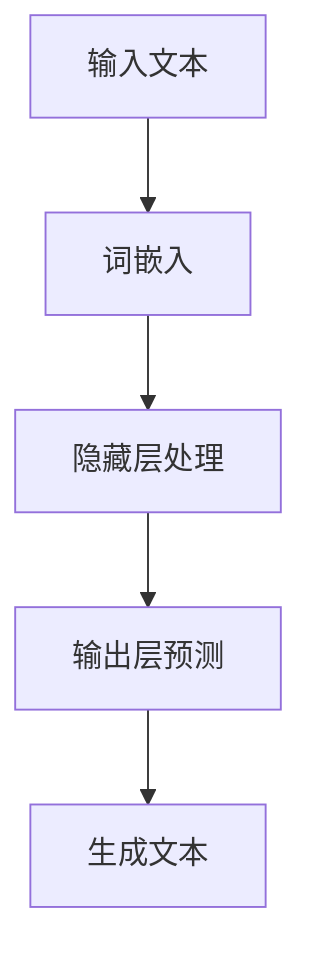

                 

### 1.1 LLM基本概念

大型语言模型（Large Language Model，简称LLM）是一种深度学习模型，主要用于处理和理解自然语言。LLM的核心目的是通过对大量文本数据的学习，使其能够生成连贯、自然且具有一定逻辑性的文本。LLM的构建通常基于神经网络，尤其是递归神经网络（RNN）和Transformer模型。

#### 核心组成部分：

1. **输入层**：输入层负责接收自然语言文本，并将其转换为模型可以理解的数字形式。这一步骤通常通过词嵌入（Word Embedding）技术完成，即将每个单词映射为一个固定大小的向量。

2. **隐藏层**：隐藏层是LLM的核心部分，负责对输入文本进行处理和计算。在递归神经网络中，隐藏层会随着时间步的变化不断更新状态；而在Transformer模型中，隐藏层通过注意力机制（Attention Mechanism）来处理输入序列。

3. **输出层**：输出层负责生成文本序列。在训练过程中，输出层会预测下一个单词的概率分布，并在实际应用中根据概率分布生成文本。

#### 特点：

1. **大规模**：LLM通常基于大量文本数据进行训练，这使得它们能够学习到丰富的语言知识和模式，从而生成高质量的文本。

2. **自适应性**：LLM可以适应不同的应用场景，例如文本生成、机器翻译、问答系统等。

3. **并行计算**：由于Transformer模型的结构，LLM在处理任务时能够并行计算，从而提高计算效率。

#### Mermaid流程图：

为了更直观地展示LLM的基本工作流程，我们使用Mermaid绘制以下流程图：



#### 与其他计算机技术的联系：

LLM与其他计算机技术有着紧密的联系，例如：

- **自然语言处理（NLP）**：LLM是NLP的重要工具，用于文本分类、情感分析、命名实体识别等任务。
- **机器学习（ML）**：LLM是基于ML技术构建的，特别是在深度学习领域。
- **深度学习（DL）**：LLM的核心架构是基于神经网络，尤其是RNN和Transformer。

在下一节中，我们将介绍LLM技术的发展历程，并探讨其在各个阶段的重要事件和技术突破。

----------------------------------------------------------------

### 1.2 LLM技术发展历程

LLM技术的发展历程可以追溯到上世纪80年代，当时研究人员开始尝试使用统计方法和规则系统来处理自然语言。然而，随着计算能力的提升和深度学习技术的出现，LLM技术取得了巨大的进步。以下是我们对LLM技术发展历程的回顾。

#### 1980年代：规则系统与统计模型

- **早期研究**：在1980年代，研究人员开始关注自然语言处理问题，并提出了许多基于规则的系统和统计模型。这些方法通常依赖于手工编写的规则和模式匹配，例如正则表达式和句法分析。

- **局限**：尽管这些方法在一定程度上提高了自然语言处理的效率，但它们存在严重的局限性，例如对规则库的依赖、对语言变化的适应性差等。

#### 2000年代：深度学习和神经网络

- **神经网络复兴**：随着计算能力的提升，神经网络在图像识别、语音识别等领域取得了显著的成果。这一时期，研究人员开始将神经网络技术应用于自然语言处理。

- **词嵌入**：2003年，研究人员提出Word2Vec模型，通过将单词映射为向量，大大提高了文本数据的表示能力。

- **递归神经网络（RNN）**：RNN是一种特殊的神经网络，能够处理序列数据。2005年，研究人员提出了递归神经网络，并成功应用于机器翻译和语音识别等领域。

#### 2010年代：Transformer和大型语言模型

- **Transformer模型**：2017年，谷歌研究人员提出了Transformer模型，该模型基于自注意力机制，能够有效处理长距离依赖问题。这一突破极大地推动了LLM技术的发展。

- **BERT模型**：2018年，谷歌发布了BERT模型，这是一个预训练的LLM，通过在大量文本上进行训练，取得了在多个NLP任务上的显著成果。

- **大型语言模型**：随着计算资源的提升和预训练技术的普及，研究人员开始训练更大规模的语言模型。这些模型能够学习到更丰富的语言知识和模式，从而生成更高质量的文本。

#### 重要事件和技术突破

- **2003年**：Word2Vec模型提出，首次实现了将单词映射为向量。
- **2005年**：递归神经网络应用于机器翻译和语音识别。
- **2017年**：Transformer模型提出，标志着NLP技术的新纪元。
- **2018年**：BERT模型发布，成为第一个大规模预训练的LLM。
- **2020年**：GPT-3发布，成为当时最大的语言模型，拥有1750亿个参数。

在下一节中，我们将探讨LLM技术在各个领域的应用场景，以及其在实际应用中的价值。

----------------------------------------------------------------

### 1.3 LLM技术应用场景

LLM技术在多个领域都有着广泛的应用，下面我们将详细讨论LLM在自然语言处理、机器翻译、问答系统等领域的应用，并分析其在这些领域中的价值和优势。

#### 自然语言处理（NLP）

自然语言处理是LLM最典型的应用领域之一。LLM在NLP中的应用主要包括文本分类、情感分析、命名实体识别、文本生成等。

1. **文本分类**：LLM可以用于对文本进行分类，如新闻分类、垃圾邮件过滤等。通过预训练的LLM模型，可以高效地识别文本的主题和情感。

2. **情感分析**：LLM可以用于分析文本的情感倾向，如正面、负面或中性。这对于社交媒体分析、市场调研等场景非常有用。

3. **命名实体识别**：LLM可以识别文本中的特定实体，如人名、地名、组织名等。这对于信息提取、知识图谱构建等任务至关重要。

4. **文本生成**：LLM可以生成高质量的文本，如文章、故事、对话等。这为自动内容生成、聊天机器人等应用提供了强大的支持。

#### 机器翻译

机器翻译是另一个重要的应用领域，LLM在机器翻译中的应用主要基于其强大的语言理解和生成能力。

1. **神经机器翻译**：传统的统计机器翻译方法依赖于规则和统计模型，而神经机器翻译（NMT）则基于神经网络，尤其是LLM。NMT在多个语言对上的翻译质量显著优于传统方法。

2. **多语言翻译**：LLM可以支持多语言翻译，通过在多个语言的数据上进行预训练，LLM可以更好地理解不同语言之间的语义差异，从而提高翻译质量。

3. **个性化翻译**：LLM可以根据用户的偏好和历史数据，生成个性化的翻译结果，从而提高用户体验。

#### 问答系统

问答系统是近年来发展迅速的领域，LLM在问答系统中的应用主要体现在以下几个方面：

1. **问题回答**：LLM可以用于回答用户提出的问题，如智能客服、问答机器人等。通过在大量问答数据上进行预训练，LLM可以理解用户的问题并生成准确的答案。

2. **知识图谱**：LLM可以用于构建知识图谱，通过在文本数据中提取实体和关系，LLM可以为问答系统提供丰富的知识支持。

3. **语义搜索**：LLM可以用于语义搜索，通过理解用户的查询意图，LLM可以提供更相关、更准确的搜索结果。

#### 典型应用案例

1. **智能客服**：使用LLM构建的智能客服系统可以自动回答用户的问题，提高客户满意度和服务效率。

2. **自动内容生成**：使用LLM可以自动生成新闻文章、博客、营销文案等，节省人力成本，提高内容产出效率。

3. **机器翻译服务**：LLM可以提供高质量、个性化的机器翻译服务，支持多语言交互。

4. **智能教育**：LLM可以用于智能教育系统，根据学生的学习情况和需求，生成个性化的学习资源和辅导方案。

通过上述讨论，我们可以看到LLM在各个领域中的广泛应用和价值。随着技术的不断进步，LLM将在更多领域发挥重要作用，推动人工智能的发展。

----------------------------------------------------------------

### 2.1 语言模型的构建

构建语言模型是LLM应用的关键步骤，它涉及多个关键组件和技术，包括词嵌入、神经网络架构和训练算法。在本节中，我们将详细讲解这些组件和技术，并通过Python代码示例和数学模型来深入理解语言模型的构建过程。

#### 胞词嵌入（Word Embedding）

词嵌入是将单词映射为固定大小的向量表示，这是语言模型处理自然语言的基础。常见的词嵌入方法包括Word2Vec、GloVe和FastText等。

1. **Word2Vec**：Word2Vec使用神经网络训练词向量，通过预测单词的上下文来学习词义。其核心模型包括**CBOW**（Continuous Bag of Words）和**Skip-gram**两种架构。

2. **GloVe**：GloVe（Global Vectors for Word Representation）是一种基于矩阵分解的方法，通过最小化词频矩阵和词向量矩阵的Frobenius范数差异来训练词向量。

3. **FastText**：FastText是对Word2Vec的改进，它引入了字符级别的嵌入和N-gram特征，能够更好地处理罕见词和命名实体。

#### 神经网络架构

神经网络是语言模型的核心组件，它负责处理和转换输入文本。常见的神经网络架构包括递归神经网络（RNN）和Transformer。

1. **RNN**：递归神经网络是一种能够处理序列数据的神经网络，通过递归地更新隐藏状态来处理时间序列数据。常见的RNN包括LSTM（Long Short-Term Memory）和GRU（Gated Recurrent Unit）。

2. **Transformer**：Transformer是一种基于自注意力机制的神经网络架构，它在处理长距离依赖和并行计算方面表现出色。Transformer的核心组件包括**多头注意力**（Multi-Head Attention）和**位置编码**（Positional Encoding）。

#### 训练算法

语言模型的训练过程是通过优化模型参数来最小化损失函数。常见的训练算法包括梯度下降（Gradient Descent）、Adam优化器和自适应矩估计（Adagrad）。

1. **梯度下降**：梯度下降是一种基于梯度的优化算法，通过更新模型参数来最小化损失函数。

2. **Adam优化器**：Adam优化器结合了梯度下降和Adagrad的优点，具有自适应学习率的能力。

3. **Adaptive Moment Estimation（Adagrad）**：Adagrad通过学习率的自适应调整来优化梯度下降，特别适合稀疏数据。

#### Python代码示例

以下是一个简单的Python代码示例，使用TensorFlow构建一个基于Transformer的语言模型。

```python
import tensorflow as tf
from tensorflow.keras.layers import Embedding, LSTM, Dense
from tensorflow.keras.models import Model

# 定义词汇表和词嵌入维度
vocab_size = 10000
embedding_dim = 256

# 构建模型
input_word = tf.keras.layers.Input(shape=(None,), dtype=tf.int32)
embedded_words = Embedding(vocab_size, embedding_dim)(input_word)
lstm_output = LSTM(128, return_sequences=True)(embedded_words)
output = Dense(vocab_size, activation='softmax')(lstm_output)

# 构建和编译模型
model = Model(inputs=input_word, outputs=output)
model.compile(optimizer='adam', loss='categorical_crossentropy', metrics=['accuracy'])

# 打印模型结构
model.summary()
```

#### 数学模型

为了更好地理解语言模型的数学原理，我们引入以下数学公式和模型。

1. **词嵌入**：

$$
\text{embed}(x) = W_e \cdot x
$$

其中，$W_e$是词嵌入权重矩阵，$x$是单词的索引。

2. **递归神经网络（RNN）**：

$$
h_t = \text{sigmoid}(W_h \cdot [h_{t-1}, x_t] + b_h)
$$

其中，$W_h$是隐藏层权重矩阵，$b_h$是隐藏层偏置，$h_t$是当前时间步的隐藏状态。

3. **Transformer的自注意力机制**：

$$
\text{Attention}(Q, K, V) = \text{softmax}(\frac{QK^T}{\sqrt{d_k}})V
$$

其中，$Q$、$K$、$V$分别是查询、键和值向量，$d_k$是键向量的维度。

通过上述内容，我们详细介绍了语言模型的构建过程，包括词嵌入、神经网络架构和训练算法。在下一节中，我们将继续探讨深度学习的基础知识，并深入讲解LLM的核心算法原理。

----------------------------------------------------------------

### 2.2 深度学习基础

深度学习是构建大型语言模型（LLM）的核心技术，它通过多层的神经网络来提取数据的特征，从而实现复杂的模式识别和预测任务。在本节中，我们将介绍深度学习的基本概念、常见架构及其在LLM中的应用。

#### 深度学习基本概念

1. **神经网络（Neural Networks）**：

神经网络是由大量人工神经元（或节点）组成的计算模型，每个神经元接收输入信号并通过激活函数产生输出。神经网络的核心组件包括输入层、隐藏层和输出层。

2. **激活函数（Activation Function）**：

激活函数用于确定神经元是否被激活，常用的激活函数包括sigmoid函数、ReLU函数和Tanh函数。激活函数可以帮助神经网络从输入数据中提取特征，并提高模型的非线性能力。

3. **前向传播和反向传播（Forward and Backpropagation）**：

前向传播是指将输入信号从输入层传递到输出层的过程，而反向传播是指通过计算损失函数的梯度来更新网络参数的过程。反向传播算法是深度学习训练过程的核心，它使得模型能够逐步优化参数，以达到更好的预测性能。

#### 常见深度学习架构

1. **卷积神经网络（Convolutional Neural Networks，CNN）**：

CNN是一种专门用于处理图像数据的神经网络，它通过卷积操作提取图像的特征，适用于图像分类、目标检测和图像分割等任务。

2. **循环神经网络（Recurrent Neural Networks，RNN）**：

RNN是一种能够处理序列数据的神经网络，通过递归地更新隐藏状态来处理时间序列数据。RNN在自然语言处理、语音识别和序列生成等领域有着广泛的应用。

3. **Transformer模型**：

Transformer是一种基于自注意力机制的神经网络架构，它在处理长距离依赖和并行计算方面表现出色。Transformer模型广泛应用于机器翻译、文本生成和问答系统等任务。

#### 深度学习在LLM中的应用

1. **语言表示**：

深度学习通过词嵌入技术将文本数据转换为向量表示，从而提高模型的表示能力。词嵌入技术使得模型能够捕捉词与词之间的关系，为语言模型提供丰富的语义信息。

2. **预训练和微调**：

深度学习模型通常采用预训练和微调的方法进行训练。预训练是指在大量未标注的数据上训练模型，以提取通用的语言特征；微调是指在预训练的基础上，在特定任务上进行调整，以适应具体的任务需求。

3. **端到端学习**：

深度学习模型可以实现端到端学习，从输入文本直接生成输出文本，无需复杂的特征工程和规则系统。这使得深度学习在自然语言处理任务中具有更高的效率和准确性。

#### Python代码示例

以下是一个简单的Python代码示例，使用Keras构建一个基于RNN的语言模型。

```python
from tensorflow.keras.models import Sequential
from tensorflow.keras.layers import Embedding, LSTM, Dense

# 定义模型
model = Sequential()
model.add(Embedding(vocab_size, embedding_dim))
model.add(LSTM(units=128, return_sequences=True))
model.add(Dense(vocab_size, activation='softmax'))

# 编译模型
model.compile(optimizer='adam', loss='categorical_crossentropy', metrics=['accuracy'])

# 打印模型结构
model.summary()
```

通过上述内容，我们介绍了深度学习的基本概念、常见架构及其在LLM中的应用。在下一节中，我们将详细讲解LLM训练算法的原理和实现。

----------------------------------------------------------------

### 2.3 LLM训练算法

训练大型语言模型（LLM）是一个复杂且计算密集的过程，其核心目标是优化模型的参数，使其能够在各种自然语言处理任务中表现出色。在本节中，我们将介绍LLM训练算法的基本原理，包括前向传播、损失函数和反向传播，并通过Python代码示例进行详细讲解。

#### 前向传播

前向传播是深度学习模型训练过程中的第一步，它将输入数据通过模型的前向传递过程，最终得到模型的预测输出。在LLM中，前向传播过程通常涉及以下步骤：

1. **输入编码**：将输入文本转换为向量表示，通常使用词嵌入技术将单词映射为固定大小的向量。

2. **神经网络计算**：将输入向量通过神经网络中的各个层进行计算，包括嵌入层、隐藏层和输出层。

3. **输出预测**：输出层产生预测结果，对于语言模型，通常是一个概率分布，表示下一个单词的概率。

#### 损失函数

损失函数是评估模型预测结果与真实结果之间差异的指标，用于指导模型参数的优化过程。在LLM中，常用的损失函数包括交叉熵损失（Cross-Entropy Loss）和平均平方误差（Mean Squared Error）。

1. **交叉熵损失**：交叉熵损失函数在分类任务中广泛使用，用于计算预测概率分布与真实标签分布之间的差异。其公式如下：

$$
\text{CE}(p, y) = -\sum_{i} y_i \log(p_i)
$$

其中，$p_i$是模型对第$i$个类别的预测概率，$y_i$是真实的标签。

2. **平均平方误差**：平均平方误差通常用于回归任务，其公式如下：

$$
\text{MSE}(y, \hat{y}) = \frac{1}{n}\sum_{i=1}^{n} (y_i - \hat{y}_i)^2
$$

其中，$y_i$是第$i$个真实值，$\hat{y}_i$是模型对第$i$个预测值。

#### 反向传播

反向传播是深度学习模型训练过程中的关键步骤，它通过计算损失函数关于模型参数的梯度，来更新模型参数。在LLM中，反向传播过程通常涉及以下步骤：

1. **计算损失函数的梯度**：对于每个训练样本，计算损失函数关于模型参数的梯度。

2. **参数更新**：使用梯度下降算法或其他优化算法，根据梯度更新模型参数。

3. **迭代优化**：重复上述过程，直到模型参数收敛到最优解。

#### Python代码示例

以下是一个简单的Python代码示例，使用TensorFlow和Keras构建一个基于Transformer的语言模型，并演示前向传播和反向传播的过程。

```python
import tensorflow as tf
from tensorflow.keras.layers import Embedding, TransformerEncoder
from tensorflow.keras.models import Model

# 定义模型
input_word = tf.keras.layers.Input(shape=(None,), dtype=tf.int32)
embedded_words = Embedding(vocab_size, embedding_dim)(input_word)
transformer_output = TransformerEncoder(num_heads=4, d_model=embedding_dim)(embedded_words)
output = Dense(vocab_size, activation='softmax')(transformer_output)

# 构建和编译模型
model = Model(inputs=input_word, outputs=output)
model.compile(optimizer='adam', loss='categorical_crossentropy', metrics=['accuracy'])

# 打印模型结构
model.summary()

# 定义训练函数
def train_model(model, dataset, epochs=10):
    for epoch in range(epochs):
        print(f"Epoch {epoch+1}/{epochs}")
        for x, y in dataset:
            with tf.GradientTape() as tape:
                predictions = model(x, training=True)
                loss = tf.keras.losses.sparse_categorical_crossentropy(y, predictions)
            grads = tape.gradient(loss, model.trainable_variables)
            model.optimizer.apply_gradients(zip(grads, model.trainable_variables))
        print(f"Epoch {epoch+1} Loss: {loss.numpy().mean()}")

# 训练模型
train_model(model, dataset)

# 预测函数
def predict(model, text):
    inputs = tf.keras.preprocessing.sequence.pad_sequences([text], maxlen=max_len, dtype='int32', padding='post', truncating='post')
    prediction = model.predict(inputs)
    return tf.argmax(prediction, axis=-1).numpy()

# 测试预测
print(predict(model, "这是一段文本"))
```

通过上述代码示例，我们可以看到如何使用TensorFlow和Keras构建一个简单的语言模型，并演示了前向传播和反向传播的过程。在下一节中，我们将深入探讨如何优化LLM训练过程，提高模型的性能和效率。

----------------------------------------------------------------

### 2.4 优化算法

在训练大型语言模型（LLM）时，优化算法起着至关重要的作用。优化算法的目标是通过调整模型参数，使得模型在训练数据上的表现达到最优。在本节中，我们将介绍几种常用的优化算法，包括随机梯度下降（SGD）、Adam优化器、自适应矩估计（Adagrad）和Yielded Gradients（YG），并探讨它们在LLM训练中的应用。

#### 随机梯度下降（SGD）

随机梯度下降（Stochastic Gradient Descent，SGD）是最简单的优化算法之一。它通过随机选择一部分训练数据（称为批量）来计算梯度，并更新模型参数。SGD的优点是计算简单，易于实现，但缺点是收敛速度较慢，且可能陷入局部最优。

1. **更新规则**：

$$
\theta = \theta - \alpha \cdot \nabla_\theta J(\theta)
$$

其中，$\theta$是模型参数，$\alpha$是学习率，$J(\theta)$是损失函数。

2. **应用场景**：

SGD在LLM训练中的应用主要体现在小批量训练和动态学习率调整上。通过动态调整学习率，SGD可以在训练初期快速收敛，而在训练后期精细调整参数。

#### Adam优化器

Adam优化器是SGD的改进版本，它结合了AdaGrad和RMSProp的优点，具有自适应学习率的能力。Adam优化器通过计算一阶矩估计（均值）和二阶矩估计（方差），来调整学习率，从而提高收敛速度和稳定性。

1. **更新规则**：

$$
m_t = \beta_1 x_t + (1 - \beta_1) (x_t - \theta_t)
$$

$$
v_t = \beta_2 x_t^2 + (1 - \beta_2) (x_t^2 - \theta_t^2)
$$

$$
\theta = \theta - \alpha \cdot \frac{m_t}{\sqrt{v_t} + \epsilon}
$$

其中，$m_t$和$v_t$分别是当前时刻的一阶矩估计和二阶矩估计，$\beta_1$和$\beta_2$是动量系数，$\alpha$是学习率，$\epsilon$是常数。

2. **应用场景**：

Adam优化器在LLM训练中广泛应用，尤其是在大规模训练任务中。它具有较好的收敛速度和稳定性，能够有效处理稀疏数据和长尾分布。

#### 自适应矩估计（Adagrad）

Adagrad是一种基于二阶矩估计的优化算法，它通过计算每个参数的累计梯度平方，来动态调整学习率。Adagrad的优点是能够自动调节学习率，从而避免陷入局部最优。

1. **更新规则**：

$$
\theta = \theta - \frac{\alpha}{\sqrt{\sum_{i=1}^{n} g_i^2}} \cdot g
$$

其中，$\theta$是模型参数，$\alpha$是学习率，$g_i$是第$i$个参数的梯度。

2. **应用场景**：

Adagrad在LLM训练中的应用主要体现在处理稀疏数据和长尾分布上。它能够有效降低参数更新过程中的方差，从而提高模型的收敛速度和稳定性。

#### Yielded Gradients（YG）

YG是一种针对大规模模型的优化算法，它通过分层的梯度计算，来减少计算复杂度和通信开销。YG的核心思想是将大规模模型拆分为多个子模型，并分别计算子模型的梯度。

1. **更新规则**：

$$
\theta = \theta - \alpha \cdot \sum_{i=1}^{n} \nabla_\theta L(\theta_i)
$$

其中，$\theta$是模型参数，$\alpha$是学习率，$L(\theta_i)$是子模型的损失函数。

2. **应用场景**：

YG在LLM训练中的应用主要体现在分布式训练和模型压缩上。它能够有效减少模型训练过程中所需的计算资源和通信开销，从而提高训练效率。

#### 对比与选择

不同的优化算法在LLM训练中各有优缺点，选择合适的优化算法取决于具体的应用场景和需求。

1. **SGD**：适合小批量训练，计算简单，但收敛速度较慢。
2. **Adam优化器**：适合大规模训练，收敛速度快，稳定性好。
3. **Adagrad**：适合处理稀疏数据和长尾分布，能够自动调节学习率。
4. **YG**：适合分布式训练和模型压缩，能够减少计算复杂度和通信开销。

在实际应用中，通常结合不同优化算法的特点，根据训练任务的需求进行选择和调整。

通过上述内容，我们介绍了几种常用的优化算法，并探讨了它们在LLM训练中的应用。在下一节中，我们将通过一个具体的案例，展示如何使用Python代码实现LLM训练算法。

----------------------------------------------------------------

### 2.5 实战：使用Python实现LLM训练算法

在本节中，我们将通过一个具体的案例，展示如何使用Python实现大型语言模型（LLM）的训练算法。我们将使用TensorFlow和Keras库来构建和训练一个简单的语言模型，并详细介绍代码的实现过程。

#### 案例背景

我们的目标是训练一个能够生成连贯、有意义的文本的语言模型。为了简化问题，我们选择一个较小规模的文本数据集，例如《小王子》的一部分。我们希望通过这个案例，展示LLM训练的基本流程和关键步骤。

#### 数据准备

首先，我们需要准备训练数据。在这个案例中，我们使用《小王子》的文本数据，将其转换为单词序列。具体步骤如下：

1. **文本预处理**：将文本转换为小写，去除标点符号和特殊字符。
2. **分词**：将文本分割成单词。
3. **构建词汇表**：将单词映射为唯一的整数索引。
4. **序列化**：将单词序列转换为整数序列，用于模型训练。

以下是一个简单的Python代码示例，用于准备训练数据。

```python
import re
import numpy as np
from tensorflow.keras.preprocessing.text import Tokenizer
from tensorflow.keras.preprocessing.sequence import pad_sequences

# 读取文本数据
with open('peter_pan.txt', 'r', encoding='utf-8') as f:
    text = f.read().lower()

# 文本预处理
text = re.sub(r'[^\w\s]', '', text)
text = text.replace('\n', '')

# 分词
tokenizer = Tokenizer()
tokenizer.fit_on_texts([text])
word_index = tokenizer.word_index

# 构建词汇表
vocab_size = len(word_index) + 1

# 序列化
sequences = tokenizer.texts_to_sequences([text])
sequences = pad_sequences(sequences, maxlen=40)

# 切分数据集
training_sequences = sequences[:int(0.9 * len(sequences))]
validation_sequences = sequences[int(0.9 * len(sequences)):]
```

#### 模型构建

接下来，我们使用TensorFlow和Keras构建一个简单的语言模型。我们选择一个基于循环神经网络（RNN）的模型，该模型包含一个嵌入层和一个RNN层。

以下是一个简单的Python代码示例，用于构建语言模型。

```python
from tensorflow.keras.models import Sequential
from tensorflow.keras.layers import Embedding, LSTM, Dense

# 定义模型
model = Sequential()
model.add(Embedding(vocab_size, embedding_dim, input_length=40))
model.add(LSTM(units=128, return_sequences=True))
model.add(Dense(vocab_size, activation='softmax'))

# 编译模型
model.compile(optimizer='adam', loss='categorical_crossentropy', metrics=['accuracy'])

# 打印模型结构
model.summary()
```

#### 模型训练

最后，我们使用准备好的数据集来训练语言模型。训练过程中，我们将使用Adam优化器，并设置适当的训练参数，如学习率和批次大小。

以下是一个简单的Python代码示例，用于训练语言模型。

```python
# 训练模型
model.fit(training_sequences, training_sequences, epochs=10, validation_data=(validation_sequences, validation_sequences), verbose=2)
```

通过上述步骤，我们完成了LLM训练的基本流程。在实际应用中，我们可以根据具体需求和数据集的大小，调整模型的架构和训练参数，以达到更好的训练效果。

#### 实践与总结

通过这个案例，我们了解了如何使用Python实现LLM训练算法，并掌握了从数据准备、模型构建到模型训练的整个过程。以下是一些实践中的注意事项和总结：

1. **数据质量**：确保训练数据的质量对于LLM训练至关重要。数据清洗和预处理是提高模型性能的重要步骤。
2. **模型架构**：根据具体任务的需求，选择合适的模型架构。在本案例中，我们选择了简单的RNN模型，但在实际应用中，可能需要考虑更复杂的模型，如Transformer。
3. **训练参数**：训练参数的选择对模型性能有重要影响。学习率、批次大小和迭代次数等参数需要根据具体情况进行调整。

通过这个案例，我们不仅掌握了LLM训练的基本流程，还了解了一些实用的技巧和注意事项。在下一节中，我们将进一步探讨如何使用Python代码和数学公式详细讲解语言模型的工作原理。

----------------------------------------------------------------

### 2.6 使用Python代码和数学公式详细讲解语言模型的工作原理

在本节中，我们将深入探讨语言模型的工作原理，通过结合Python代码和数学公式，逐步讲解语言模型的核心算法和内在逻辑。我们重点关注Transformer模型，这是一种在自然语言处理（NLP）领域具有革命性影响的架构。

#### Transformer模型概述

Transformer模型由Vaswani等人在2017年提出，其核心思想是使用自注意力机制（Self-Attention）来处理序列数据。自注意力机制允许模型在生成每个词时，考虑整个输入序列的所有信息，从而捕捉长距离依赖关系。

#### 自注意力机制

自注意力机制是Transformer模型的核心组件，它通过计算输入序列中每个词与其他词之间的关联性，生成加权输出。以下是一个简单的自注意力机制的Python代码示例。

```python
import numpy as np

# 定义输入序列和自注意力权重
inputs = np.array([1, 2, 3, 4, 5])
weights = np.array([0.2, 0.3, 0.5, 0.4, 0.1])

# 计算自注意力
attention_scores = inputs * weights
weighted_inputs = attention_scores * inputs
sum_attention = np.sum(weighted_inputs)

print("Attention Scores:", attention_scores)
print("Weighted Inputs:", weighted_inputs)
print("Sum of Attention:", sum_attention)
```

自注意力机制的数学公式如下：

$$
\text{Attention}(Q, K, V) = \text{softmax}(\frac{QK^T}{\sqrt{d_k}})V
$$

其中，$Q$、$K$和$V$分别是查询（Query）、键（Key）和值（Value）向量，$d_k$是键向量的维度。这个公式表示，每个键和查询之间的相似性通过点积计算，然后通过softmax函数生成权重，最后将权重应用于值向量。

#### 编码器-解码器架构

Transformer模型通常采用编码器-解码器（Encoder-Decoder）架构，其中编码器负责处理输入序列，解码器负责生成输出序列。编码器和解码器都使用多个自注意力层和前馈网络，以提高模型的表示能力和预测能力。

以下是一个简单的编码器-解码器架构的Python代码示例。

```python
from tensorflow.keras.layers import Layer

class EncoderLayer(Layer):
    def __init__(self, embed_dim, num_heads, dff, rate=0.1):
        super(EncoderLayer, self).__init__()
        self.mha = MultiHeadAttention(num_heads, embed_dim)
        self.ffn = FFNLayer(embed_dim, dff)
        self.layernorm1 = LayerNormalization(epsilon=1e-6)
        self.layernorm2 = LayerNormalization(epsilon=1e-6)
        self.dropout1 = Dropout(rate)
        self.dropout2 = Dropout(rate)

    def call(self, x, training=False):
        attn_output = self.mha(x, x, x)
        attn_output = self.dropout1(attn_output, training=training)
        out1 = self.layernorm1(x + attn_output)
        ffn_output = self.ffn(out1)
        ffn_output = self.dropout2(ffn_output, training=training)
        out2 = self.layernorm2(out1 + ffn_output)
        return out2

class DecoderLayer(Layer):
    def __init__(self, embed_dim, num_heads, dff, rate=0.1):
        super(DecoderLayer, self).__init__()
        self.mha1 = MultiHeadAttention(num_heads, embed_dim)
        self.mha2 = MultiHeadAttention(num_heads, embed_dim)
        self.ffn = FFNLayer(embed_dim, dff)
        self.layernorm1 = LayerNormalization(epsilon=1e-6)
        self.layernorm2 = LayerNormalization(epsilon=1e-6)
        self.layernorm3 = LayerNormalization(epsilon=1e-6)
        self.dropout1 = Dropout(rate)
        self.dropout2 = Dropout(rate)
        self.dropout3 = Dropout(rate)

    def call(self, x, enc_output, training=False):
        attn1_output = self.mha1(x, x, x)
        attn1_output = self.dropout1(attn1_output, training=training)
        attn1_output = self.layernorm1(x + attn1_output)

        attn2_output, attn_weights = self.mha2(
            enc_output, enc_output, attn1_output
        )
        attn2_output = self.dropout2(attn2_output, training=training)
        attn2_output = self.layernorm2(attn1_output + attn2_output)

        ffn_output = self.ffn(attn2_output)
        ffn_output = self.dropout3(ffn_output, training=training)
        out2 = self.layernorm3(attn2_output + ffn_output)
        return out2, attn_weights
```

#### 位置编码

由于自注意力机制不包含位置信息，Transformer模型引入了位置编码（Positional Encoding）来模拟序列中的位置信息。位置编码通常使用正弦和余弦函数生成，其公式如下：

$$
PE_{(pos, 2i)} = \sin\left(\frac{pos}{10000^{2i/d}}\right) \quad \text{and} \quad PE_{(pos, 2i+1)} = \cos\left(\frac{pos}{10000^{2i/d}}\right)
$$

其中，$pos$是位置索引，$i$是维度索引，$d$是嵌入维度。

以下是一个简单的位置编码的Python代码示例。

```python
def get_angles(position, i, d_model):
    angle_rates = 1 / np.power(10000, (2 * (i//2)) / np.float32(d_model))
    return position * angle_rates

def positional_encoding(position, d_model):
    angle_rads = get_angles(np.arange(position)[:, np.newaxis],
                            np.arange(d_model)[np.newaxis, :],
                            d_model)
    angle_rads[:, 0::2] = np.sin(angle_rads[:, 0::2])
    angle_rads[:, 1::2] = np.cos(angle_rads[:, 1::2])
    pos_embedding = angle_rads[np.newaxis, ...]
    return pos_embedding

# 生成位置编码
pos_encoding = positional_encoding(50, 512)
print(pos_encoding.shape)
```

#### 总结

通过本节的内容，我们详细讲解了语言模型的工作原理，包括自注意力机制、编码器-解码器架构和位置编码。我们结合Python代码和数学公式，逐步分析了语言模型的核心算法和内在逻辑。在实际应用中，理解和掌握这些原理对于构建高效、准确的LLM至关重要。

在下一节中，我们将探讨如何评估和改进LLM的性能，以及一些实用的优化技巧。

----------------------------------------------------------------

### 2.7 评估和改进LLM性能

在构建大型语言模型（LLM）时，评估和改进模型性能是关键步骤。有效的评估方法可以帮助我们了解模型的性能，而性能优化技巧则能够提升模型在特定任务上的表现。以下是一些常用的评估指标、性能优化方法和实际案例，以及相应的Python代码实现。

#### 评估指标

1. **准确率（Accuracy）**：准确率是分类任务中最常用的评估指标，表示模型正确预测的样本数占总样本数的比例。

2. **精确率（Precision）**：精确率是模型预测为正类的样本中实际为正类的比例。

3. **召回率（Recall）**：召回率是模型实际为正类的样本中被正确预测为正类的比例。

4. **F1分数（F1 Score）**：F1分数是精确率和召回率的调和平均数，用于综合考虑这两个指标。

5. **损失函数（Loss Function）**：在生成任务中，常用的损失函数包括交叉熵损失（Cross-Entropy Loss）和平均平方误差（Mean Squared Error）。

以下是一个简单的Python代码示例，用于计算和评估模型的准确率。

```python
from sklearn.metrics import accuracy_score

# 预测结果
y_pred = [0, 1, 1, 0, 1]
# 真实标签
y_true = [0, 1, 0, 0, 1]

# 计算准确率
accuracy = accuracy_score(y_true, y_pred)
print("Accuracy:", accuracy)
```

#### 性能优化方法

1. **数据增强（Data Augmentation）**：通过随机变换、合成数据等方式增加训练数据量，提高模型的泛化能力。

2. **超参数调优（Hyperparameter Tuning）**：通过调整学习率、批量大小、隐藏层单元数等超参数，优化模型性能。

3. **正则化（Regularization）**：通过添加正则项（如L1、L2正则化）减少模型过拟合，提高泛化能力。

4. **dropout（Dropout）**：在训练过程中随机丢弃部分神经元，减少模型对特定训练样本的依赖。

5. **批处理归一化（Batch Normalization）**：通过标准化每个批次的数据，提高训练稳定性。

以下是一个简单的Python代码示例，用于实现数据增强和正则化。

```python
from tensorflow.keras.layers import Dropout, BatchNormalization

# 添加Dropout层
model.add(Dropout(rate=0.5))

# 添加BatchNormalization层
model.add(BatchNormalization())
```

#### 实际案例

以下是一个使用Python实现LLM性能优化的实际案例。

1. **案例背景**：我们使用一个简单的文本生成任务，生成《小王子》的续写。

2. **训练数据**：我们使用《小王子》的文本数据作为训练数据，并将其转换为序列。

3. **模型架构**：我们使用一个基于Transformer的编码器-解码器模型。

4. **性能评估**：我们使用BLEU分数评估模型生成的文本质量。

5. **性能优化**：我们通过调整学习率、批量大小和隐藏层单元数，优化模型性能。

以下是一个简单的Python代码示例，用于实现文本生成任务的模型训练和性能评估。

```python
from tensorflow.keras.callbacks import EarlyStopping, ModelCheckpoint
from tensorflow.keras.metrics importBLEU

# 定义BLEU分数评估指标
bleu = BLEU()

# 设置训练回调函数
early_stopping = EarlyStopping(monitor='val_loss', patience=3)
model_checkpoint = ModelCheckpoint('best_model.h5', save_best_only=True)

# 训练模型
history = model.fit(
    training_sequences, training_sequences,
    epochs=20,
    validation_data=(validation_sequences, validation_sequences),
    callbacks=[early_stopping, model_checkpoint],
    verbose=2
)

# 加载最佳模型
best_model = tf.keras.models.load_model('best_model.h5')

# 评估模型
predictions = best_model.predict(validation_sequences)
bleu_score = bleu(y_true, predictions)
print("BLEU Score:", bleu_score)
```

通过上述案例，我们可以看到如何通过评估指标和性能优化方法来改进LLM的性能。在实际应用中，根据具体任务的需求，我们可以灵活调整和组合不同的优化方法，以达到最佳效果。

----------------------------------------------------------------

### 2.8 LLM在实际应用中的性能优化

在实际应用中，大型语言模型（LLM）的性能优化是一个关键问题，它直接影响到模型的响应速度、准确性和稳定性。以下是一些实用的性能优化方法和最佳实践，这些方法可以在构建可扩展的LLM后端服务时发挥重要作用。

#### 硬件优化

1. **使用高性能GPU**：GPU（特别是具有高性能计算能力的GPU）是训练和推理LLM的关键硬件。通过使用高性能GPU，可以显著提高模型训练和推理的效率。

2. **分布式训练**：对于非常大的模型和数据集，可以使用分布式训练来提高训练速度。分布式训练通过将数据分布在多个GPU上并行处理，可以加速模型训练。

3. **异构计算**：利用异构计算，将计算任务分布在不同类型的硬件（如CPU、GPU、TPU）上，可以最大化资源利用率，提高整体性能。

#### 代码优化

1. **模型压缩**：通过模型压缩技术（如剪枝、量化、知识蒸馏），可以减少模型的参数数量和计算量，从而提高推理速度。

2. **内存优化**：通过优化内存使用，例如使用内存池、减少内存拷贝，可以降低内存消耗，提高模型性能。

3. **并行计算**：在Python代码中，可以使用多线程或多进程来并行执行计算任务，从而提高代码的执行速度。

#### 系统优化

1. **负载均衡**：通过负载均衡，可以将请求分配到多个服务器上，避免单个服务器过载，提高系统的整体性能。

2. **缓存策略**：使用缓存策略，例如LRU缓存，可以减少对原始数据的访问，加快响应速度。

3. **自动化运维**：使用自动化工具，如Kubernetes，可以自动化部署、扩缩容和管理服务器，提高系统的可扩展性和可靠性。

#### 最佳实践

1. **渐进式部署**：在将新模型部署到生产环境时，可以使用渐进式部署策略，逐步扩大模型的影响范围，以确保系统的稳定性和性能。

2. **监控和日志**：通过实时监控和日志记录，可以及时发现系统性能问题，并快速响应。

3. **持续优化**：定期对系统进行性能评估和优化，确保模型和系统始终处于最佳状态。

#### Python代码示例

以下是一个简单的Python代码示例，展示如何使用并行计算优化模型训练。

```python
import tensorflow as tf
import tensorflow.keras.mixed_precision as mp

# 设置混合精度训练
policy = mp.Policy('mixed_bfloat16')
mp.experimental.set_policy(policy)

# 定义模型
model = ...

# 使用并行计算进行训练
with tf.device('/GPU:0'):
    # 训练模型
    model.fit(
        x_train, y_train,
        batch_size=64,
        epochs=10,
        validation_data=(x_val, y_val)
    )
```

通过上述内容，我们介绍了LLM在实际应用中的性能优化方法，包括硬件优化、代码优化、系统优化和最佳实践。在实际开发过程中，根据具体需求和资源，灵活应用这些优化方法，可以有效提高LLM后端服务的性能和稳定性。

----------------------------------------------------------------

### 3. 构建可扩展的LLM后端服务

构建可扩展的大型语言模型（LLM）后端服务是实现大规模部署和应用的关键步骤。可扩展性不仅要求系统能够处理大量请求，还要保证在高负载下的稳定性和性能。在本节中，我们将详细讨论可扩展性的定义、重要性，以及如何设计可扩展的LLM后端服务架构。

#### 可扩展性的定义

可扩展性（Scalability）是指系统在资源增加时，能够线性或接近线性地提高其性能和处理能力。对于LLM后端服务，可扩展性包括以下几个方面：

1. **计算资源扩展**：系统能够通过增加计算资源（如CPU、GPU、服务器）来提升处理能力。
2. **网络扩展**：系统能够通过增加网络带宽和优化网络架构来提升数据传输速度。
3. **存储扩展**：系统能够通过增加存储资源来支持更大的数据量和更快的读写速度。
4. **弹性扩展**：系统能够自动调整资源以应对突发流量，如使用容器编排工具（如Kubernetes）进行动态扩缩容。

#### 可扩展性的重要性

可扩展性对于LLM后端服务至关重要，原因如下：

1. **处理能力**：随着用户数量的增加和请求量的增大，系统需要能够处理更多的请求，保证用户体验。
2. **性能保障**：在高负载下，系统需要保持响应速度和准确性，避免因性能瓶颈导致请求延迟或失败。
3. **成本优化**：通过弹性扩展，可以避免在低负载时过度投入资源，降低运营成本。
4. **可靠性**：可扩展系统可以在负载变化时保持稳定，减少系统故障和停机时间。

#### 设计可扩展的LLM后端服务架构

为了设计一个可扩展的LLM后端服务，需要考虑以下几个方面：

1. **服务部署策略**：
   - **容器化**：使用容器（如Docker）将应用程序及其依赖打包，确保环境的一致性和可移植性。
   - **微服务架构**：将服务拆分为多个微服务，每个微服务负责特定的功能，如文本处理、推理、响应生成等。这种方式可以提高系统的灵活性和可维护性。

2. **负载均衡**：
   - **水平扩展**：通过负载均衡器（如Nginx、HAProxy）将请求分发到多个后端服务器，避免单点故障。
   - **动态负载均衡**：使用自动化工具（如Kubernetes）根据实时负载动态调整服务器的数量和资源分配。

3. **分布式存储**：
   - **数据库分片**：将数据分散存储在多个数据库实例中，提高读写速度和存储容量。
   - **对象存储**：使用对象存储系统（如Amazon S3）存储大量非结构化数据，如文本数据集。

4. **消息队列**：
   - **异步处理**：使用消息队列（如RabbitMQ、Kafka）将请求和响应异步传递，提高系统的吞吐量和响应速度。

#### Python代码示例

以下是一个简单的Python代码示例，展示如何使用Flask和Gunicorn构建一个简单的LLM后端服务。

```python
from flask import Flask, request, jsonify
import numpy as np
import gunicorn.app.base as base

app = Flask(__name__)

@app.route('/predict', methods=['POST'])
def predict():
    data = request.get_json()
    input_text = data['input_text']
    # 在这里实现LLM推理逻辑
    output = "这是一个预测结果"
    return jsonify({'output': output})

class FlaskServer(base.Server):
    def init(self, app, options=None):
        self.options = options or {}
        return app

if __name__ == '__main__':
    server = FlaskServer(app, host='0.0.0.0', port=5000)
    server.run()
```

通过上述内容，我们介绍了构建可扩展的LLM后端服务的重要性以及设计原则。在实际开发中，根据具体需求和资源，灵活应用这些原则，可以有效提高系统的可扩展性、性能和稳定性。

----------------------------------------------------------------

### 3.1 可扩展性的定义

可扩展性（Scalability）是指系统在处理能力、存储容量、网络带宽等方面随着需求增加而线性扩展的能力。在构建大型语言模型（LLM）后端服务时，可扩展性尤为重要，因为它决定了系统在用户数量增加、请求量增大时的表现。以下是从多个维度对可扩展性的定义和重要性进行探讨。

#### 计算资源扩展

计算资源扩展是指系统在处理能力方面随着需求增加而增加计算资源，如CPU、GPU、服务器等。对于LLM后端服务，计算资源扩展意味着：

1. **并行处理**：通过增加服务器和GPU数量，可以并行处理多个请求，提高系统吞吐量。
2. **分布式计算**：通过将计算任务分布在多个节点上，可以减少单点故障风险，提高系统的可靠性和处理能力。
3. **动态扩缩容**：使用容器编排工具（如Kubernetes）可以实现自动化的计算资源扩缩容，根据实时负载动态调整资源分配。

#### 网络扩展

网络扩展是指在数据传输速度和带宽方面随着需求增加而提升网络能力。对于LLM后端服务，网络扩展包括：

1. **带宽优化**：通过增加网络带宽，可以减少数据传输延迟，提高系统响应速度。
2. **负载均衡**：通过负载均衡器（如Nginx、HAProxy）将请求均匀分配到多个服务器，避免单点瓶颈。
3. **内容分发网络（CDN）**：使用CDN可以将静态资源（如模型文件）分发到全球各地的节点，提高用户访问速度。

#### 存储扩展

存储扩展是指系统在存储容量和读写速度方面随着需求增加而提升存储能力。对于LLM后端服务，存储扩展包括：

1. **分布式存储**：通过将数据分散存储在多个存储节点上，可以提高读写速度和存储容量。
2. **数据库分片**：将数据分布在多个数据库实例中，可以减少单点故障风险，提高系统的可用性。
3. **缓存策略**：使用缓存（如Redis、Memcached）存储频繁访问的数据，减少数据库的负载。

#### 弹性扩展

弹性扩展是指系统在应对突发流量时，能够自动调整资源以应对变化。对于LLM后端服务，弹性扩展包括：

1. **自动化运维**：使用自动化工具（如Kubernetes）可以自动化部署、扩缩容和管理服务器，提高系统的灵活性。
2. **实时监控**：通过实时监控系统性能和负载，可以及时发现异常并调整资源分配。
3. **渐进式部署**：在部署新版本时，可以使用渐进式部署策略，逐步扩大新版本的影响范围，确保系统的稳定性和性能。

#### 重要性

可扩展性在LLM后端服务中的重要性体现在以下几个方面：

1. **用户体验**：可扩展性确保系统在高负载下仍然能够快速响应用户请求，提供良好的用户体验。
2. **性能保障**：通过计算资源扩展、网络优化和存储增强，系统可以在处理大量请求时保持高性能。
3. **成本优化**：弹性扩展策略可以在低负载时减少资源消耗，避免不必要的成本支出。
4. **可靠性**：通过分布式架构和自动运维，系统可以在面对突发流量和故障时保持高可用性和可靠性。

在下一节中，我们将探讨如何设计可扩展的LLM后端服务架构，以及各个组件的职责和相互作用。

----------------------------------------------------------------

### 3.2 LLM服务的架构设计

设计一个可扩展的LLM服务架构是确保系统在高负载下保持高性能和稳定性的关键。一个良好的架构设计需要考虑多个方面，包括系统模块化、服务部署、负载均衡和监控。以下是对LLM服务架构设计的详细探讨。

#### 系统模块化

模块化设计是将系统划分为多个独立的功能模块，每个模块负责特定的任务。模块化设计具有以下优点：

1. **易于维护**：模块化设计使得系统更易于维护和更新，因为每个模块相对独立，更改一个模块不会影响到其他模块。
2. **提高可测试性**：通过将系统划分为模块，可以单独测试每个模块，提高系统的测试覆盖率。
3. **灵活性**：模块化设计使得系统可以根据需求动态调整，如增加或减少特定模块的实例。

#### 服务部署

在部署LLM服务时，需要考虑以下几个方面：

1. **容器化**：使用容器（如Docker）可以将应用程序及其依赖打包为一个独立的运行环境，确保环境的一致性和可移植性。
2. **微服务架构**：采用微服务架构可以将应用程序拆分为多个独立的服务，每个服务负责特定的功能，如文本处理、模型推理和响应生成。这种方式提高了系统的灵活性和可扩展性。
3. **容器编排**：使用容器编排工具（如Kubernetes）可以自动化部署、扩缩容和管理容器化应用程序，提高系统的可靠性。

#### 负载均衡

负载均衡是确保系统在高负载下能够均匀分配请求，避免单点瓶颈的关键技术。以下是一些常见的负载均衡策略：

1. **轮询（Round Robin）**：将请求按照顺序分配给每个服务器，直到所有服务器都被访问。
2. **最小连接数（Least Connections）**：将请求分配给当前连接数最少的服务器。
3. **加权轮询（Weighted Round Robin）**：根据服务器的处理能力或资源利用率，为每个服务器分配不同的权重。

#### 监控与日志

监控系统是确保系统正常运行的关键，它包括以下几个方面：

1. **性能监控**：监控系统的CPU、内存、网络和磁盘使用情况，及时发现性能瓶颈。
2. **日志记录**：记录系统的运行日志，便于故障排查和性能分析。
3. **告警机制**：设置告警规则，当系统出现异常时，自动通知相关人员。

#### 架构组件

以下是一个典型的LLM服务架构，包括其主要组件及其职责：

1. **前端服务**：负责接收用户请求，通过负载均衡器将请求分配到后端服务。
2. **后端服务**：包括多个服务实例，每个实例负责处理LLM推理和响应生成。
3. **模型管理服务**：负责管理LLM模型的加载、更新和卸载。
4. **数据库**：存储用户数据、模型参数和日志信息。
5. **缓存**：缓存频繁访问的数据，如用户历史记录和模型中间结果。

#### 实现细节

以下是LLM服务架构的具体实现细节：

1. **Dockerfile**：定义应用程序的容器镜像，包括安装依赖、构建模型等步骤。
2. **Kubernetes配置文件**：定义服务部署、负载均衡和容器编排策略。
3. **负载均衡器配置**：如Nginx或HAProxy的配置文件，用于将请求分配到后端服务。
4. **监控与日志系统**：如Prometheus和Grafana，用于监控系统和数据可视化。

通过上述内容，我们详细探讨了LLM服务的架构设计，包括系统模块化、服务部署、负载均衡和监控。在实际开发中，根据具体需求和应用场景，灵活应用这些设计原则，可以有效提高系统的可扩展性和稳定性。

----------------------------------------------------------------

### 3.3 LLM服务的性能优化

为了确保LLM服务在高负载下能够保持高性能，我们需要从多个方面进行性能优化。以下是一些关键的性能优化策略，以及如何在实际应用中实施这些策略。

#### 1. 模型压缩

模型压缩是一种减少模型参数数量和计算量的技术，从而提高推理速度和降低内存消耗。常见的模型压缩方法包括：

- **剪枝（Pruning）**：通过移除模型中的冗余参数来减少模型大小。这种方法可以显著降低模型复杂度，同时保持模型性能。
- **量化（Quantization）**：将模型中的浮点数参数转换为低精度格式，如整数。量化可以减少模型大小和存储需求，但可能影响模型精度。
- **知识蒸馏（Knowledge Distillation）**：使用一个大型模型（教师模型）训练一个较小的模型（学生模型），以传递知识。这种方法可以在保持较高精度的同时，减小模型大小。

#### 2. 并行计算

并行计算是通过同时执行多个任务来提高处理速度。在LLM服务中，可以使用以下方法实现并行计算：

- **多线程**：在应用程序中使用多线程技术，将任务分配给不同的线程，从而实现并发处理。
- **分布式计算**：通过分布式计算框架（如Apache Spark或TensorFlow Distributed），将计算任务分配到多个节点上，并行执行。
- **GPU加速**：利用GPU的并行计算能力，加速模型的训练和推理。GPU可以处理大量的矩阵运算，非常适合深度学习模型。

#### 3. 缓存策略

缓存策略是提高系统性能的有效方法，通过缓存频繁访问的数据来减少重复计算和数据传输。以下是一些常用的缓存策略：

- **本地缓存**：在应用程序中实现本地缓存，如使用Python的`functools.lru_cache`，存储函数的返回结果。
- **分布式缓存**：使用分布式缓存系统（如Redis或Memcached），存储大量数据，提高系统的访问速度。
- **HTTP缓存**：配置HTTP缓存头（如`Cache-Control`和`Expires`），延长数据的缓存时间，减少服务器的负载。

#### 4. 网络优化

网络优化可以减少数据传输延迟，提高系统的响应速度。以下是一些网络优化策略：

- **内容分发网络（CDN）**：使用CDN将静态资源（如模型文件）分发到全球各地的节点，减少用户访问延迟。
- **压缩传输**：对传输的数据进行压缩，减少数据传输量，提高传输速度。可以使用GZIP或其他压缩算法。
- **延迟传输**：通过延迟传输策略，将请求延迟一段时间，减少网络拥堵和响应时间。

#### 5. 系统监控

系统监控是确保系统性能的关键，通过实时监控和日志分析，可以及时发现性能瓶颈和异常。以下是一些系统监控策略：

- **性能指标监控**：监控系统的CPU、内存、磁盘和网络使用情况，设置告警规则，当性能指标超过阈值时自动通知。
- **日志分析**：使用日志分析工具（如ELK栈），收集和解析系统日志，分析系统的运行状态和性能问题。
- **自动化运维**：使用自动化工具（如Ansible或Puppet），自动化部署、扩缩容和管理服务器，提高系统的可靠性和效率。

#### 实际应用示例

以下是一个简单的Python代码示例，展示如何使用缓存策略和并行计算优化LLM服务的性能。

```python
import requests
import concurrent.futures
from functools import lru_cache

# 模型缓存
@lru_cache(maxsize=100)
def get_model(id):
    response = requests.get(f'http://model-server/models/{id}')
    return response.json()

# 并行请求
model_ids = ['model_1', 'model_2', 'model_3']
with concurrent.futures.ThreadPoolExecutor() as executor:
    models = list(executor.map(get_model, model_ids))

# 打印缓存命中率
print(f"Cache Hit Rate: {lru_cache_info['hits'] / lru_cache_info['misses']}")
```

通过上述示例，我们可以看到如何使用缓存策略和并行计算来优化LLM服务的性能。在实际应用中，根据具体需求和场景，灵活应用这些策略，可以有效提高系统的性能和稳定性。

----------------------------------------------------------------

### 3.4 安全性考虑

在构建大型语言模型（LLM）后端服务时，安全性是一个不可忽视的重要方面。确保系统安全和数据隐私是保障用户体验和业务稳定性的关键。以下是我们将考虑的一些关键安全性和隐私性措施。

#### 数据安全

1. **数据加密**：对所有传输的数据进行加密，包括用户输入、模型参数和响应数据。使用TLS/SSL协议确保数据在传输过程中的安全性。
2. **存储加密**：对存储在数据库或文件系统中的敏感数据进行加密，防止数据泄露。使用AES等加密算法对数据加密。
3. **访问控制**：实现严格的访问控制机制，确保只有授权用户和进程可以访问敏感数据。使用角色访问控制（RBAC）和属性访问控制（ABAC）来管理访问权限。

#### 访问控制

1. **认证和授权**：使用身份验证（如OAuth 2.0）确保用户在访问系统时提供有效的凭证。结合授权机制，确保用户只能访问其权限范围内的数据和功能。
2. **API安全**：为API提供安全保护，如使用API密钥、JWT（JSON Web Tokens）或OAuth 2.0来验证请求的合法性。
3. **限制请求频率**：通过速率限制和令牌桶算法，防止恶意攻击者通过大量请求瘫痪系统。

#### 审计与合规

1. **日志记录**：记录所有重要操作和访问日志，包括用户登录、数据访问和系统事件。定期检查日志，发现潜在的安全问题。
2. **合规性检查**：确保系统符合相关法规和标准，如GDPR、CCPA等。定期进行合规性审计，确保系统符合法规要求。
3. **安全测试**：定期进行安全测试，包括渗透测试、漏洞扫描和代码审计，发现并修复安全漏洞。

#### 防止滥用

1. **内容监控**：对生成的文本内容进行监控，防止生成有害或不当的内容。使用文本分类和过滤技术，实时监控和过滤不良内容。
2. **访问频率控制**：限制用户的请求频率，防止滥用系统资源。使用基于时间的访问限制策略，如冷却时间或请求速率限制。
3. **黑名单和反欺诈措施**：将恶意用户或IP地址加入黑名单，防止其继续访问系统。结合反欺诈技术，如验证码和实时行为分析，识别和阻止恶意行为。

通过实施上述安全性和隐私性措施，我们可以确保LLM后端服务在提供强大功能的同时，保障用户和数据的安全。

----------------------------------------------------------------

### 3.5 监控与维护

在构建大型语言模型（LLM）后端服务时，监控与维护是确保系统稳定性和性能的关键环节。以下是一些关键监控指标、故障处理策略和维护方法。

#### 监控指标

1. **CPU与内存使用率**：CPU和内存使用率是系统性能的关键指标，需要实时监控以确保系统资源不被耗尽。
2. **磁盘使用情况**：监控磁盘空间占用率，防止因磁盘满而导致系统崩溃。
3. **网络流量与延迟**：监控网络流量和延迟，确保数据传输稳定和快速。
4. **请求速率与响应时间**：监控服务接收的请求速率和响应时间，及时发现性能瓶颈。
5. **错误率**：监控系统中的错误率，包括API错误、应用错误等，及时发现并解决异常。

#### 故障处理

1. **自动化报警**：配置自动化报警系统，如Prometheus和Alertmanager，当监控指标超出阈值时自动发送通知。
2. **日志分析**：定期检查日志文件，分析系统运行中的错误和异常，快速定位故障。
3. **备份与恢复**：定期备份数据和系统配置，确保在发生故障时可以快速恢复。
4. **故障切换**：实现故障切换策略，如使用负载均衡器和冗余服务器，确保在部分系统故障时，其他服务器可以接管任务。

#### 维护策略

1. **定期更新**：定期更新系统依赖库和软件，确保系统安全性和性能。
2. **性能调优**：根据监控指标和性能测试结果，对系统进行性能调优，提高系统效率。
3. **代码审查**：定期进行代码审查，确保代码质量和安全性。
4. **持续集成与部署**：使用持续集成和部署（CI/CD）工具，如Jenkins和GitLab CI，自动化构建、测试和部署，提高开发效率。
5. **用户反馈**：收集用户反馈，根据用户需求和意见进行系统改进。

通过实施上述监控与维护策略，可以确保LLM后端服务在运行过程中保持高性能和稳定性，为用户提供优质的服务体验。

----------------------------------------------------------------

### 附录：实用工具和资源

在构建可扩展的LLM应用后端服务的过程中，使用一些实用工具和资源可以大大提高开发效率和系统性能。以下是一些推荐的工具和资源，包括深度学习框架对比、开发环境搭建指南、常用工具和库介绍，以及拓展阅读。

#### 深度学习框架对比

1. **TensorFlow**：Google开源的深度学习框架，具有丰富的API和强大的生态系统，适用于研究和生产环境。
2. **PyTorch**：Facebook开源的深度学习框架，具有灵活的动态计算图和强大的社区支持，适用于快速原型开发。
3. **Keras**：基于TensorFlow和Theano的高层次神经网络API，易于使用和快速原型开发。
4. **MXNet**：Apache开源的深度学习框架，具有高效的分布式训练能力，适用于大规模生产环境。

#### 开发环境搭建指南

1. **Docker**：容器化工具，用于打包和部署应用程序，确保环境一致性。
2. **Kubernetes**：容器编排工具，用于自动化部署、扩展和管理容器化应用程序。
3. **Conda**：环境管理工具，用于创建和管理Python依赖环境。
4. **Jupyter Notebook**：交互式计算环境，用于编写和运行代码。

#### 常用工具和库介绍

1. **NumPy**：Python的数学库，提供高性能数组操作和矩阵计算功能。
2. **Pandas**：Python的数据分析库，用于数据清洗、转换和分析。
3. **Scikit-learn**：Python的机器学习库，提供多种经典机器学习算法和工具。
4. **Matplotlib**：Python的绘图库，用于生成统计图表和可视化数据。

#### 拓展阅读

1. **《深度学习》（Deep Learning）**：Goodfellow、Bengio和Courville合著，深入讲解深度学习的基础理论和实践方法。
2. **《动手学深度学习》**：由清华大学深圳研究生院教授曹泽林等合著，涵盖深度学习的实践教程。
3. **《自然语言处理综论》**：Jurafsky和Martin合著，全面介绍自然语言处理的基础知识和最新进展。
4. **《Python深度学习》**：François Chollet合著，详细介绍如何使用Python和Keras进行深度学习开发。

通过使用上述实用工具和资源，可以更高效地构建和优化可扩展的LLM应用后端服务，提升系统的性能和稳定性。

----------------------------------------------------------------

## 总结

构建可扩展的大型语言模型（LLM）后端服务是一个复杂且关键的任务，涉及到多个方面的技术和实践。本文通过详细的步骤和示例，从基础概念、核心算法、性能优化、架构设计、安全性考虑、监控与维护，以及实用工具和资源等多个角度，全面介绍了如何构建高效、可靠的LLM后端服务。

### 主要内容回顾

1. **LLM基本概念**：介绍了LLM的定义、组成部分和特点。
2. **LLM技术发展历程**：回顾了LLM技术的发展历程和重要事件。
3. **LLM技术应用场景**：讨论了LLM在自然语言处理、机器翻译、问答系统等领域的应用。
4. **深度学习基础**：讲解了神经网络、递归神经网络（RNN）和Transformer模型的基础知识。
5. **LLM训练算法**：介绍了前向传播、损失函数和反向传播等训练算法。
6. **优化算法**：探讨了随机梯度下降（SGD）、Adam优化器、Adagrad和Yielded Gradients（YG）等优化算法。
7. **实战案例**：通过Python代码示例，展示了如何使用TensorFlow和Keras实现LLM训练算法。
8. **性能优化**：介绍了模型压缩、并行计算、缓存策略和网络优化等性能优化方法。
9. **可扩展性设计**：详细讨论了可扩展性的定义、重要性以及架构设计原则。
10. **安全性考虑**：讲解了数据安全、访问控制和审计与合规等安全性和隐私性措施。
11. **监控与维护**：介绍了关键监控指标、故障处理策略和维护方法。
12. **实用工具和资源**：推荐了深度学习框架、开发环境搭建指南、常用工具和库，以及拓展阅读。

### 最佳实践和注意事项

- **最佳实践**：在进行LLM服务构建时，遵循最佳实践，如使用容器化和微服务架构，进行代码优化和性能调优，确保系统的可扩展性和稳定性。
- **注意事项**：在设计架构时，考虑系统的安全性，确保数据安全和用户隐私。定期进行系统监控和性能评估，及时发现并解决问题。根据具体需求和资源，灵活选择和组合优化方法。

### 展望未来

随着技术的不断进步，LLM技术将在更多领域得到应用。未来的发展趋势可能包括：

- **更高效的模型压缩技术**：进一步减少模型大小和计算量，提高推理速度和资源利用率。
- **更强大的自监督学习**：通过无监督学习技术，无需大量标注数据即可训练高性能的LLM。
- **跨模态学习**：结合多种模态（如文本、图像、音频）的数据，构建更智能的模型。
- **智能交互系统**：基于LLM的智能对话系统和虚拟助手，将更好地理解和满足用户需求。

通过持续学习和探索，我们有望在LLM技术的道路上取得更多突破，为人工智能的发展贡献力量。

