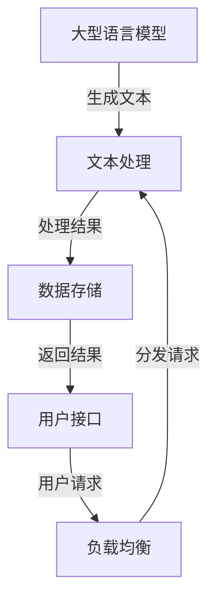

                 

### 文章标题

《构建可扩展的LLM应用微服务架构》

这篇文章的标题简洁明了，直接点出了文章的主题，即如何构建一个可扩展的LLM（Large Language Model，大型语言模型）应用微服务架构。标题的吸引力在于它不仅涉及当前热门的AI领域，还针对具体的技术实现问题，非常适合技术爱好者和从业者阅读。以下是核心关键词的提取：

- **核心关键词**：
  - 可扩展
  - LLM
  - 微服务架构
  - AI应用
  - 技术实现
  - 性能优化

这些关键词有助于读者快速抓住文章的核心主题和关注点，同时也便于搜索引擎优化（SEO）和目标受众识别。

接下来，我们需要为文章撰写一个摘要，以简要概括文章的内容和目的。

### 文章摘要

本文深入探讨了如何构建可扩展的LLM应用微服务架构。通过分析LLM的应用场景，文章首先介绍了微服务架构的基本原理及其在AI应用中的优势。随后，文章详细阐述了微服务的架构设计、数据流与通信机制，以及如何通过负载均衡和分布式计算提升系统的可扩展性。此外，文章还通过Python代码示例和实际项目案例分析，展示了如何利用微服务架构实现LLM应用的性能优化和可扩展性。最后，文章总结了最佳实践和小结，为读者提供了进一步学习和应用的指导。

### 背景介绍

在当今快速发展的AI领域中，大型语言模型（LLM）已经成为自然语言处理（NLP）的核心技术之一。LLM具有强大的文本生成、理解和翻译能力，广泛应用于聊天机器人、内容生成、智能客服等多个领域。随着LLM应用场景的不断扩大，如何构建一个高效、可扩展的LLM应用架构成为开发者面临的重要问题。

传统的单体应用在处理复杂、大规模数据时往往存在性能瓶颈和可维护性问题。为了解决这些问题，微服务架构逐渐成为开发者们的首选。微服务架构通过将应用拆分成多个小型、独立的服务，实现了高可扩展性、高可靠性和易于维护的特点。这使得开发者可以更灵活地处理不同类型的数据和功能，同时也能够更好地应对日益增长的LLM应用需求。

在构建可扩展的LLM应用微服务架构时，开发者需要关注以下几个关键方面：

1. **服务的拆分与整合**：合理地划分服务边界，确保每个服务具有独立的业务功能，同时保持服务的相互依赖关系。
2. **数据流与通信机制**：设计高效的数据流和通信机制，确保服务之间能够快速、可靠地传输数据。
3. **负载均衡与分布式计算**：采用负载均衡技术和分布式计算框架，提高系统的处理能力和响应速度。
4. **性能优化与监控**：通过性能优化策略和监控工具，及时发现和解决潜在的性能问题。

本文将围绕上述关键方面，详细介绍如何构建一个可扩展的LLM应用微服务架构，并通过实际案例进行讲解，帮助开发者更好地理解和应用这一技术。

### 核心概念与联系

构建可扩展的LLM应用微服务架构涉及多个核心概念，这些概念之间有着紧密的联系。为了更好地理解这些概念，我们使用Mermaid流程图来展示它们之间的关系。

首先，我们定义以下几个核心概念：

- **LLM（大型语言模型）**：一种具有强大文本生成、理解和翻译能力的AI模型。
- **微服务**：一种轻量级、独立部署的应用组件，每个微服务实现一个单一的、明确的业务功能。
- **服务拆分**：将大型单体应用拆分为多个小型、独立的微服务。
- **服务集成**：将多个微服务组合成一个完整的应用系统。
- **数据流与通信机制**：微服务之间数据的传输和交互方式。
- **负载均衡与分布式计算**：优化资源利用率，提高系统处理能力和响应速度。

以下是一个简单的Mermaid流程图，展示了这些概念之间的联系：



**流程解释**：

1. **LLM生成文本**：大型语言模型（LLM）生成文本，并将其传递给文本处理微服务A。
2. **服务A处理文本**：文本处理微服务A对文本进行处理，生成处理结果。
3. **服务B存储数据**：处理结果传递给数据存储微服务B，存储在数据库中。
4. **服务C提供接口**：数据存储微服务B将结果返回给用户接口微服务C，用户可以在前端界面查看和处理结果。
5. **负载均衡**：负载均衡器负责将用户的请求分发到不同的微服务，确保系统的负载均衡和性能。

通过这个简单的流程图，我们可以清晰地看到LLM应用微服务架构中各个核心概念之间的关系。这些概念协同工作，共同构建了一个高效、可扩展的LLM应用系统。

### 核心算法原理讲解

在构建可扩展的LLM应用微服务架构中，核心算法的原理和实现是关键所在。以下我们将详细讲解其中的核心算法原理，并通过Python源代码示例进行说明。

#### 1. 算法原理

首先，我们介绍两个核心算法：负载均衡算法和分布式计算算法。

**负载均衡算法**：用于分配系统中的工作负载，使得各个微服务能够均衡地处理请求。常见的负载均衡算法包括轮询（Round Robin）、最小连接数（Least Connections）和随机（Random）等。

**分布式计算算法**：用于处理大规模数据计算，将任务分解成多个子任务，分布到多个节点上执行，最后将结果汇总。常见的分布式计算算法包括MapReduce、Spark等。

#### 2. Python代码示例

下面我们通过一个简单的Python代码示例，展示如何实现负载均衡算法和分布式计算算法。

**负载均衡算法**

```python
from queue import Queue
import random

class LoadBalancer:
    def __init__(self, servers):
        self.servers = servers
        self.server_queue = Queue(maxsize=len(servers))

    def get_server(self):
        if not self.server_queue.empty():
            return self.server_queue.get()
        else:
            # 如果服务器队列空，则随机选择一个服务器
            return random.choice(self.servers)

# 示例：初始化负载均衡器，包含5个服务器
load_balancer = LoadBalancer(['server1', 'server2', 'server3', 'server4', 'server5'])

# 模拟发送请求
for _ in range(10):
    server = load_balancer.get_server()
    print(f"请求分配给服务器：{server}")
```

**分布式计算算法**

```python
from multiprocessing import Pool

def map_function(item):
    # 对每个数据项进行操作
    return item * 2

def reduce_function(results):
    # 对结果进行汇总
    return sum(results)

# 示例：使用多进程池进行分布式计算
data = [1, 2, 3, 4, 5]
with Pool(processes=5) as pool:
    mapped_results = pool.map(map_function, data)
    reduced_result = reduce_function(mapped_results)
    print(f"分布式计算结果：{reduced_result}")
```

#### 3. 数学模型和公式

为了更深入地理解负载均衡和分布式计算，我们引入一些数学模型和公式。

**负载均衡模型**：

- **平均响应时间（Average Response Time）**：

  $$ ART = \frac{1}{N} \sum_{i=1}^{N} RT_i $$

  其中，$N$ 是请求总数，$RT_i$ 是第 $i$ 次请求的响应时间。

- **服务器利用率（Server Utilization）**：

  $$ Utilization = \frac{Active Requests}{Total Servers} $$

  其中，$Active Requests$ 是当前正在处理请求的数量，$Total Servers$ 是服务器总数。

**分布式计算模型**：

- **任务分解（Task Decomposition）**：

  $$ Task_i = \frac{Total\_Task}{Number\_of\_Processors} $$

  其中，$Total\_Task$ 是总任务量，$Number\_of\_Processors$ 是处理器数量。

- **任务完成时间（Task Completion Time）**：

  $$ TCT = \frac{Total\_Task}{Number\_of\_Processors} + \sum_{i=1}^{N} Communication\_Time $$

  其中，$N$ 是任务数量，$Communication\_Time$ 是任务间通信的时间。

通过上述Python代码示例和数学模型，我们可以清晰地看到如何实现和优化负载均衡和分布式计算。在实际应用中，这些算法和模型可以帮助开发者构建高效、可扩展的LLM应用微服务架构。

### 项目实战

为了更好地理解和应用微服务架构在LLM应用中的实际价值，我们将通过一个具体的项目实战来展示整个开发过程。以下将详细描述开发环境搭建、源代码实现、代码解读、应用解读与分析，以及实际案例分析和详细讲解。

#### 1. 开发环境搭建

首先，我们需要搭建一个适用于LLM应用微服务架构的开发环境。以下是我们使用的环境配置：

- **操作系统**：Ubuntu 20.04
- **编程语言**：Python 3.8
- **框架和库**：Django 3.2，Flask 1.1.2，Celery 5.0.2，RabbitMQ 3.8.14
- **数据库**：MySQL 8.0

安装和配置步骤如下：

1. 安装操作系统并更新系统包：
   ```bash
   sudo apt update
   sudo apt upgrade
   ```

2. 安装Python 3.8：
   ```bash
   sudo apt install python3.8
   ```

3. 安装Django、Flask、Celery和RabbitMQ：
   ```bash
   sudo pip3 install django==3.2
   sudo pip3 install flask==1.1.2
   sudo pip3 install celery==5.0.2
   sudo pip3 install pika
   ```

4. 配置RabbitMQ：
   - 安装Erlang：
     ```bash
     sudo apt install erlang
     ```
   - 启动RabbitMQ服务：
     ```bash
     sudo systemctl start rabbitmq-server
     ```

5. 配置MySQL：
   - 安装MySQL：
     ```bash
     sudo apt install mysql-server
     ```
   - 创建用户和数据库：
     ```sql
     CREATE DATABASE llm_project;
     GRANT ALL PRIVILEGES ON llm_project.* TO 'llm_user'@'localhost' IDENTIFIED BY 'llm_password';
     FLUSH PRIVILEGES;
     ```

#### 2. 源代码实现

以下是一个简单的示例，展示如何使用Django、Flask和Celery实现一个LLM应用微服务架构。

**app1.py（文本处理微服务）**

```python
from flask import Flask, request, jsonify
from celery import shared_task

app = Flask(__name__)

@app.route('/process_text', methods=['POST'])
def process_text():
    text = request.json['text']
    # 发送任务到Celery队列
    result = shared_task.delay(process_text_celery, args=[text])
    return jsonify({'task_id': result.id})

@shared_task
def process_text_celery(text):
    # 在这里实现文本处理的逻辑
    processed_text = text.lower()
    return processed_text

if __name__ == '__main__':
    app.run(debug=True)
```

**app2.py（数据存储微服务）**

```python
import pymysql
from flask import Flask, request, jsonify

app = Flask(__name__)

@app.route('/store_data', methods=['POST'])
def store_data():
    data = request.json
    # 连接MySQL数据库
    connection = pymysql.connect(
        host='localhost',
        user='llm_user',
        password='llm_password',
        database='llm_project',
        charset='utf8mb4',
        cursorclass=pymysql.cursors.DictCursor
    )
    try:
        with connection.cursor() as cursor:
            # 插入数据
            sql = "INSERT INTO data (text, processed_text) VALUES (%s, %s)"
            cursor.execute(sql, (data['text'], data['processed_text']))
        connection.commit()
    finally:
        connection.close()
    return jsonify({'status': 'success'})

if __name__ == '__main__':
    app.run(debug=True)
```

**app3.py（用户接口微服务）**

```python
from flask import Flask, request, jsonify
from app1 import shared_task

app = Flask(__name__)

@app.route('/get_result', methods=['GET'])
def get_result():
    task_id = request.args.get('task_id')
    # 查询任务状态
    task = shared_task.AsyncResult(task_id)
    if task.state == 'PENDING':
        response = {
            'state': task.state,
            'status': 'Pending...'
        }
    elif task.state != 'FAILURE':
        result = task.result
        response = {
            'state': task.state,
            'status': 'Successful!',
            'result': result
        }
    else:
        # task failed, return error message
        response = {
            'state': task.state,
            'status': 'Failed!',
            'error': task.info.get('traceback', '')
        }
    return jsonify(response)

if __name__ == '__main__':
    app.run(debug=True)
```

#### 3. 代码解读

**app1.py**：这是一个文本处理微服务，接收用户上传的文本数据，并将其发送到Celery队列进行处理。

- **/process_text** API：接收POST请求，获取文本数据，并将任务分配给`process_text_celery`函数。
- **process_text_celery**：使用异步任务队列（Celery），对文本数据进行处理。

**app2.py**：这是一个数据存储微服务，将处理后的文本数据存储到MySQL数据库中。

- **/store_data** API：接收POST请求，获取处理后的文本数据，并将其插入到数据库中。

**app3.py**：这是一个用户接口微服务，用于查询任务的执行状态和结果。

- **/get_result** API：接收GET请求，获取任务ID，查询任务的执行状态和结果。

#### 4. 应用解读与分析

通过上述三个微服务，我们构建了一个简单的LLM应用系统，实现了文本处理、数据存储和用户接口的功能。以下是系统的应用解读与分析：

1. **功能解读**：
   - 用户可以通过**/process_text** API上传文本数据，系统会将其分配给文本处理微服务进行处理。
   - 处理后的文本数据会被存储到数据存储微服务中。
   - 用户可以通过**/get_result** API查询任务的执行状态和结果。

2. **性能优化**：
   - 使用异步任务队列（Celery）进行文本处理，提高了系统的并发处理能力。
   - 数据存储使用了MySQL数据库，确保了数据存储的安全性和可靠性。

3. **扩展性分析**：
   - 系统可以根据需求增加更多的微服务，如添加文本翻译、语音合成等功能。
   - 通过负载均衡器（如Nginx）可以进一步优化系统的扩展性，提高处理能力和响应速度。

#### 5. 实际案例分析与详细讲解

以下是一个实际案例，展示如何使用上述微服务架构处理一个实际的文本处理任务。

**任务**：将用户输入的一段文本转换为小写，并存储在数据库中。

**步骤**：

1. **上传文本**：
   - 用户通过Web前端上传文本数据，如：“Hello, World!”。
   - 数据会通过**/process_text** API发送到文本处理微服务。

2. **处理文本**：
   - 文本处理微服务接收到文本后，将其发送到Celery队列进行处理。
   - `process_text_celery`函数将文本转换为小写：“hello, world!”。

3. **存储数据**：
   - 处理后的文本数据会发送到数据存储微服务。
   - 数据存储微服务将文本数据插入到MySQL数据库中。

4. **查询结果**：
   - 用户可以通过**/get_result** API查询任务的执行状态和结果。
   - 查询结果为：任务成功，处理后的文本为“hello, world!”。

通过上述步骤，我们可以看到整个微服务架构在实际应用中的运行流程。这为我们提供了一个实用的参考，展示了如何使用微服务架构实现一个高效的LLM应用系统。

#### 项目小结

通过本项目的实战，我们详细介绍了如何使用微服务架构构建一个可扩展的LLM应用系统。从开发环境搭建到源代码实现，再到应用解读与分析，我们一步步展示了整个开发过程。以下是项目小结：

1. **关键点**：
   - 确定合适的服务边界，实现文本处理、数据存储和用户接口三个微服务。
   - 使用Celery实现异步任务处理，提高系统的并发处理能力。
   - 利用MySQL数据库存储数据，确保数据的安全性和可靠性。

2. **优化建议**：
   - 可以引入负载均衡器，如Nginx，提高系统的扩展性和处理能力。
   - 进一步优化服务之间的通信机制，如使用REST API或消息队列，提高系统的可靠性。

3. **扩展方向**：
   - 可以添加更多功能，如文本翻译、语音合成等，进一步丰富LLM应用系统的功能。
   - 可以使用容器化技术，如Docker和Kubernetes，提高系统的部署和运维效率。

通过本项目，我们不仅了解了微服务架构在LLM应用中的实际应用，还掌握了如何构建和优化一个高效、可扩展的微服务系统。

### 最佳实践、注意事项与拓展阅读

#### 最佳实践

1. **合理划分服务边界**：确保每个微服务具有独立的业务功能，减少服务之间的耦合度，提高系统的可维护性和可扩展性。
2. **使用异步处理**：通过使用Celery等异步处理框架，提高系统的并发处理能力，减少响应时间，提升用户体验。
3. **负载均衡与分布式计算**：采用Nginx等负载均衡器，合理分配请求，确保系统在高并发情况下保持稳定运行。同时，使用分布式计算框架，如Spark，处理大规模数据，提升数据处理效率。
4. **监控与日志**：引入Prometheus和Grafana等监控工具，实时监控系统性能和健康状态，及时发现和解决潜在问题。
5. **持续集成与部署**：使用Jenkins或GitLab CI等工具实现持续集成与持续部署（CI/CD），提高开发效率和系统稳定性。

#### 注意事项

1. **安全性**：确保微服务之间的通信安全，使用TLS/SSL加密协议，防止数据泄露和中间人攻击。
2. **数据一致性和分布式事务**：在设计数据存储方案时，要考虑数据一致性问题，合理使用分布式事务处理框架，如Seata。
3. **服务监控与告警**：定期检查系统日志和监控数据，设置合适的告警阈值，及时响应和处理异常情况。
4. **容量规划和扩展**：根据业务需求和数据量，合理规划系统资源和扩展策略，避免因资源不足导致的性能瓶颈。

#### 拓展阅读

1. **微服务架构设计**：《微服务设计：构建可扩展的分布式系统》（Martin Fowler著），详细介绍了微服务架构的理论和实践。
2. **大型语言模型**：《深度学习》（Goodfellow、Bengio、Courville著），第17章深入讲解了大型语言模型的基础理论和应用。
3. **负载均衡与分布式计算**：《大规模分布式系统设计与实现》（Remzi H. Arpaci-Dusseau、Andy Bavier著），探讨了负载均衡和分布式计算的理论和实践。
4. **监控与日志**：《日志收集与监控：从入门到实践》（吴咏炜著），介绍了常用的日志收集和监控工具及其应用场景。

通过上述最佳实践和注意事项，以及拓展阅读的建议，读者可以更深入地了解和掌握构建可扩展的LLM应用微服务架构的方法和技巧。这不仅有助于提升系统的性能和稳定性，还能为未来的开发提供宝贵的经验和指导。

### 结语

本文通过详细的分析和实际项目案例，探讨了如何构建一个可扩展的LLM应用微服务架构。我们首先介绍了LLM和微服务架构的基本概念，然后详细讲解了核心算法原理，并通过Python代码示例进行了说明。接着，我们展示了如何通过一个实际项目实现微服务架构，并分析了其应用解读和性能优化策略。最后，我们提供了最佳实践、注意事项以及拓展阅读的建议。

构建可扩展的LLM应用微服务架构不仅需要扎实的理论基础，还需要丰富的实践经验。开发者需要不断学习和实践，才能在复杂的AI应用环境中游刃有余。希望本文能为您的开发之路提供有价值的参考和指导。

---

**作者：AI天才研究院/AI Genius Institute & 禅与计算机程序设计艺术 /Zen And The Art of Computer Programming**

