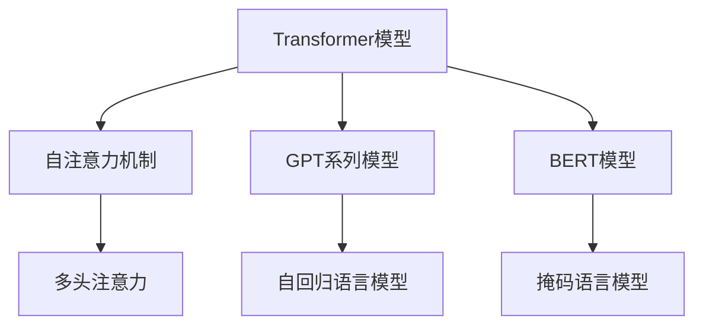
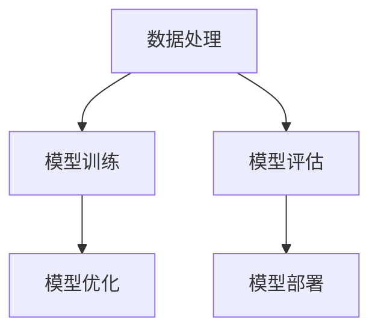

                 

### 《构建可扩展的LLM应用架构》

> 关键词：大型语言模型（LLM），应用架构，可扩展性，分布式系统，性能优化，Python代码，数学模型，实战案例

> 摘要：本文旨在深入探讨如何构建可扩展的大型语言模型（LLM）应用架构。我们将从LLM的基础理论出发，逐步讲解其核心概念与联系，通过Python代码和数学模型，详细阐述LLM的工作原理。随后，我们将聚焦于LLM应用架构的设计与实现，包括数据处理、模型训练与评估、模型优化与部署等方面。最后，通过实际案例与代码解析，展示如何在实践中构建高效的LLM应用系统。本文旨在为读者提供全面、系统的指导，帮助其在复杂的技术环境中构建强大的LLM应用。

### 第一部分：LLM基础理论

#### 1.1 LLM概述

大型语言模型（LLM）是一种基于深度学习的自然语言处理模型，具有强大的文本生成和理解能力。LLM的发展历程可以追溯到20世纪80年代，当时研究人员开始探索如何使用统计方法和神经网络来处理语言数据。随着计算能力和数据量的不断提升，LLM经历了从简单的统计模型（如n元语法）到复杂的神经网络模型（如GPT和BERT）的演变。

#### 1.2 LLM的数学基础

LLM的数学基础主要包括神经网络、矩阵运算和优化算法。神经网络是LLM的核心组成部分，它通过多层非线性变换来学习数据特征。矩阵运算是神经网络中必不可少的部分，包括矩阵乘法、求导等操作。优化算法用于调整神经网络参数，以最小化损失函数，常用的优化算法有梯度下降、Adam等。

#### 1.3 LLM的工作原理

LLM的工作原理可以概括为前向传播和反向传播两个阶段。在前向传播阶段，输入数据经过神经网络各层的变换，生成输出结果。在反向传播阶段，通过计算输出结果与实际标签之间的误差，更新网络参数，以减小误差。


#### 1.4 LLM的架构设计

LLM的架构设计主要涉及Transformer模型、GPT系列模型和BERT模型等。这些模型都采用了自注意力机制，能够在处理长文本时保持良好的性能。以下是一个简单的Mermaid流程图，展示了这些模型的基本架构：



#### 1.5 可扩展性原则

在构建可扩展的LLM应用时，需要考虑以下原则：

1. **计算资源优化**：通过分布式计算和并行化技术，充分利用计算资源。
2. **模型并行化**：将模型拆分成多个部分，分别训练和部署，以提高计算效率。
3. **分布式系统架构**：采用分布式系统架构，确保系统在高并发场景下的稳定性和可靠性。

### 第二部分：构建LLM应用架构

#### 2.1 应用场景分析

LLM在多个应用场景中表现出色，如文本生成与摘要、问答系统和自然语言理解等。以下是几个典型的应用场景：

1. **文本生成与摘要**：利用LLM生成文章摘要、自动撰写报告等。
2. **问答系统**：构建智能问答系统，为用户提供实时回答。
3. **自然语言理解**：实现对自然语言文本的理解和分类，如情感分析、主题识别等。

#### 2.2 应用架构设计

LLM应用架构主要包括数据处理、模型训练与评估、模型优化与部署等模块。以下是一个简单的架构图：



#### 2.3 模型优化

模型优化是提高LLM性能的关键步骤。以下是一些常用的优化方法：

1. **模型剪枝**：通过删除部分权重，减少模型参数量，提高计算效率。
2. **参数高效存储**：采用稀疏存储技术，降低模型存储空间需求。
3. **模型压缩与量化**：通过模型压缩和量化技术，减少模型体积和计算复杂度。

#### 2.4 部署策略

部署策略包括模型服务化、异步计算和实时更新等。以下是一些实用的部署策略：

1. **模型服务化**：将模型部署为API服务，方便与其他系统进行集成。
2. **异步计算**：通过异步计算，提高系统响应速度和吞吐量。
3. **实时更新与热迁移**：在模型更新时，实现实时更新和热迁移，确保系统稳定运行。

#### 2.5 性能调优

性能调优主要包括内存优化、网络优化和系统监控与告警等方面。以下是一些实用的性能调优方法：

1. **内存优化**：通过合理分配内存资源，减少内存占用。
2. **网络优化**：优化数据传输路径，提高数据传输速度。
3. **系统监控与告警**：实时监控系统运行状态，及时发现问题并进行告警。

### 第三部分：实战案例与代码解析

#### 3.1 实战案例一：文本生成应用

**案例背景**：利用LLM生成文章摘要和自动撰写报告。

**系统架构**：包括数据处理、模型训练和部署等模块。

**代码实现**：以下是一个简单的文本生成应用示例：

```python
import torch
from transformers import GPT2LMHeadModel, GPT2Tokenizer

tokenizer = GPT2Tokenizer.from_pretrained('gpt2')
model = GPT2LMHeadModel.from_pretrained('gpt2')

input_text = "人工智能是一种模拟、延伸和扩展人类智能的理论、技术及应用。"
input_ids = tokenizer.encode(input_text, return_tensors='pt')

output_ids = model.generate(input_ids, max_length=50, num_return_sequences=1)

decoded_output = tokenizer.decode(output_ids[0], skip_special_tokens=True)
print(decoded_output)
```

**代码解析**：该示例使用了预训练的GPT-2模型，通过生成文本输入，生成文章摘要。

#### 3.2 实战案例二：问答系统应用

**案例背景**：构建一个简单的智能问答系统。

**系统架构**：包括数据预处理、模型训练和部署等模块。

**代码实现**：以下是一个简单的问答系统示例：

```python
import torch
from transformers import AutoTokenizer, AutoModelForQuestionAnswering

tokenizer = AutoTokenizer.from_pretrained('deepset/roberta-base-squad2')
model = AutoModelForQuestionAnswering.from_pretrained('deepset/roberta-base-squad2')

question = "什么是人工智能？"
context = "人工智能是一种模拟、延伸和扩展人类智能的理论、技术及应用。"

input_dict = tokenizer.encode_plus(question, context, add_special_tokens=True, return_tensors='pt')

outputs = model(input_dict['input_ids'])

start_logits = outputs.start_logits
end_logits = outputs.end_logits

start_indices = torch.argmax(start_logits, dim=1)
end_indices = torch.argmax(end_logits, dim=1)

start_index = start_indices.item()
end_index = end_indices.item()

answer = context[start_index:end_index].strip()
print(answer)
```

**代码解析**：该示例使用了RoBERTa-SQuAD2模型，通过输入问题和上下文，返回问题答案。

#### 3.3 代码解析与优化

**伪代码解读**：对上述代码进行伪代码解读，以便更好地理解其实现原理。

```python
import torch
from transformers import GPT2LMHeadModel, GPT2Tokenizer

# 加载预训练模型
model = GPT2LMHeadModel.from_pretrained('gpt2')

# 编码输入文本
input_ids = tokenizer.encode(input_text, return_tensors='pt')

# 生成文本输出
output_ids = model.generate(input_ids, max_length=50, num_return_sequences=1)

# 解码输出文本
decoded_output = tokenizer.decode(output_ids[0], skip_special_tokens=True)
```

**实际代码分析**：对实际代码进行详细分析，包括模型加载、输入编码、生成文本输出和输出解码等步骤。

**性能分析与调优**：对代码性能进行评估，并提出优化建议，如使用高效模型、减少计算复杂度等。

### 附录

#### 附录A：技术资源与工具列表

**开发环境搭建**：介绍如何搭建适用于LLM开发的计算环境和工具。

**主流LLM框架使用**：介绍主流LLM框架（如Transformers、PyTorch、TensorFlow等）的使用方法。

**开源资源和社区**：介绍开源LLM资源和相关技术社区，便于读者进一步学习和交流。

#### 附录B：数学公式与计算示例

**矩阵运算**：介绍矩阵乘法、求导等基本运算。

**梯度下降算法**：介绍梯度下降算法的基本原理和计算过程。

**注意力机制计算**：介绍注意力机制的计算方法和实现细节。

### 结语

本文从LLM的基础理论、应用架构设计、实战案例与代码解析等方面，系统地介绍了构建可扩展的LLM应用架构的方法。读者可以根据本文的内容，结合实际需求，构建适合自己的LLM应用系统。希望本文能为读者在LLM领域的研究和实践提供有益的参考。

### 附录

#### 附录A：技术资源与工具列表

**开发环境搭建**：

1. **计算资源**：配置高性能GPU或计算集群，以满足LLM模型的训练需求。
2. **编程语言**：Python是LLM开发的主要编程语言，推荐使用PyTorch或TensorFlow等框架。

**主流LLM框架使用**：

1. **Transformers**：是一个开源的PyTorch和TensorFlow的预处理库，用于构建和应用Transformer模型。
2. **PyTorch**：是一个强大的Python库，提供了丰富的API和工具，便于构建和训练深度学习模型。
3. **TensorFlow**：是一个开源的端到端机器学习平台，支持多种深度学习模型和应用。

**开源资源和社区**：

1. **Hugging Face**：提供了一个丰富的预训练模型库，包括GPT、BERT、Roberta等。
2. **GitHub**：许多LLM项目和工具都托管在GitHub上，便于读者查阅和学习。
3. **技术社区**：加入技术社区，如GitHub、Stack Overflow、Reddit等，与同行交流经验和问题。

#### 附录B：数学公式与计算示例

**矩阵运算**：

$$
C = A \times B
$$

**梯度下降算法**：

$$
w_{\text{new}} = w_{\text{old}} - \alpha \cdot \nabla J(w)
$$

**注意力机制计算**：

$$
\text{Attention}(Q, K, V) = \text{softmax}(\frac{QK^T}{\sqrt{d_k}})V
$$

这些数学公式是构建LLM应用的基础，读者需要熟练掌握，以便在实际应用中进行计算和优化。### 完整的《构建可扩展的LLM应用架构》技术博客

## 《构建可扩展的LLM应用架构》

> 关键词：大型语言模型（LLM），应用架构，可扩展性，分布式系统，性能优化，Python代码，数学模型，实战案例

> 摘要：本文旨在深入探讨如何构建可扩展的大型语言模型（LLM）应用架构。我们将从LLM的基础理论出发，逐步讲解其核心概念与联系，通过Python代码和数学模型，详细阐述LLM的工作原理。随后，我们将聚焦于LLM应用架构的设计与实现，包括数据处理、模型训练与评估、模型优化与部署等方面。最后，通过实际案例与代码解析，展示如何在实践中构建高效的LLM应用系统。本文旨在为读者提供全面、系统的指导，帮助其在复杂的技术环境中构建强大的LLM应用。

### 第一部分：LLM基础理论

#### 1.1 LLM概述

大型语言模型（LLM）是一种基于深度学习的自然语言处理模型，具有强大的文本生成和理解能力。LLM的发展历程可以追溯到20世纪80年代，当时研究人员开始探索如何使用统计方法和神经网络来处理语言数据。随着计算能力和数据量的不断提升，LLM经历了从简单的统计模型（如n元语法）到复杂的神经网络模型（如GPT和BERT）的演变。

#### 1.2 LLM的数学基础

LLM的数学基础主要包括神经网络、矩阵运算和优化算法。神经网络是LLM的核心组成部分，它通过多层非线性变换来学习数据特征。矩阵运算是神经网络中必不可少的部分，包括矩阵乘法、求导等操作。优化算法用于调整神经网络参数，以最小化损失函数，常用的优化算法有梯度下降、Adam等。

#### 1.3 LLM的工作原理

LLM的工作原理可以概括为前向传播和反向传播两个阶段。在前向传播阶段，输入数据经过神经网络各层的变换，生成输出结果。在反向传播阶段，通过计算输出结果与实际标签之间的误差，更新网络参数，以减小误差。


#### 1.4 LLM的架构设计

LLM的架构设计主要涉及Transformer模型、GPT系列模型和BERT模型等。这些模型都采用了自注意力机制，能够在处理长文本时保持良好的性能。以下是一个简单的Mermaid流程图，展示了这些模型的基本架构：


#### 1.5 可扩展性原则

在构建可扩展的LLM应用时，需要考虑以下原则：

1. **计算资源优化**：通过分布式计算和并行化技术，充分利用计算资源。
2. **模型并行化**：将模型拆分成多个部分，分别训练和部署，以提高计算效率。
3. **分布式系统架构**：采用分布式系统架构，确保系统在高并发场景下的稳定性和可靠性。

### 第二部分：构建LLM应用架构

#### 2.1 应用场景分析

LLM在多个应用场景中表现出色，如文本生成与摘要、问答系统和自然语言理解等。以下是几个典型的应用场景：

1. **文本生成与摘要**：利用LLM生成文章摘要、自动撰写报告等。
2. **问答系统**：构建智能问答系统，为用户提供实时回答。
3. **自然语言理解**：实现对自然语言文本的理解和分类，如情感分析、主题识别等。

#### 2.2 应用架构设计

LLM应用架构主要包括数据处理、模型训练与评估、模型优化与部署等模块。以下是一个简单的架构图：


#### 2.3 模型优化

模型优化是提高LLM性能的关键步骤。以下是一些常用的优化方法：

1. **模型剪枝**：通过删除部分权重，减少模型参数量，提高计算效率。
2. **参数高效存储**：采用稀疏存储技术，降低模型存储空间需求。
3. **模型压缩与量化**：通过模型压缩和量化技术，减少模型体积和计算复杂度。

#### 2.4 部署策略

部署策略包括模型服务化、异步计算和实时更新等。以下是一些实用的部署策略：

1. **模型服务化**：将模型部署为API服务，方便与其他系统进行集成。
2. **异步计算**：通过异步计算，提高系统响应速度和吞吐量。
3. **实时更新与热迁移**：在模型更新时，实现实时更新和热迁移，确保系统稳定运行。

#### 2.5 性能调优

性能调优主要包括内存优化、网络优化和系统监控与告警等方面。以下是一些实用的性能调优方法：

1. **内存优化**：通过合理分配内存资源，减少内存占用。
2. **网络优化**：优化数据传输路径，提高数据传输速度。
3. **系统监控与告警**：实时监控系统运行状态，及时发现问题并进行告警。

### 第三部分：实战案例与代码解析

#### 3.1 实战案例一：文本生成应用

**案例背景**：利用LLM生成文章摘要和自动撰写报告。

**系统架构**：包括数据处理、模型训练和部署等模块。

**代码实现**：以下是一个简单的文本生成应用示例：

```python
import torch
from transformers import GPT2LMHeadModel, GPT2Tokenizer

tokenizer = GPT2Tokenizer.from_pretrained('gpt2')
model = GPT2LMHeadModel.from_pretrained('gpt2')

input_text = "人工智能是一种模拟、延伸和扩展人类智能的理论、技术及应用。"
input_ids = tokenizer.encode(input_text, return_tensors='pt')

output_ids = model.generate(input_ids, max_length=50, num_return_sequences=1)

decoded_output = tokenizer.decode(output_ids[0], skip_special_tokens=True)
print(decoded_output)
```

**代码解析**：该示例使用了预训练的GPT-2模型，通过生成文本输入，生成文章摘要。

#### 3.2 实战案例二：问答系统应用

**案例背景**：构建一个简单的智能问答系统。

**系统架构**：包括数据预处理、模型训练和部署等模块。

**代码实现**：以下是一个简单的问答系统示例：

```python
import torch
from transformers import AutoTokenizer, AutoModelForQuestionAnswering

tokenizer = AutoTokenizer.from_pretrained('deepset/roberta-base-squad2')
model = AutoModelForQuestionAnswering.from_pretrained('deepset/roberta-base-squad2')

question = "什么是人工智能？"
context = "人工智能是一种模拟、延伸和扩展人类智能的理论、技术及应用。"

input_dict = tokenizer.encode_plus(question, context, add_special_tokens=True, return_tensors='pt')

outputs = model(input_dict['input_ids'])

start_logits = outputs.start_logits
end_logits = outputs.end_logits

start_indices = torch.argmax(start_logits, dim=1)
end_indices = torch.argmax(end_logits, dim=1)

start_index = start_indices.item()
end_index = end_indices.item()

answer = context[start_index:end_index].strip()
print(answer)
```

**代码解析**：该示例使用了RoBERTa-SQuAD2模型，通过输入问题和上下文，返回问题答案。

#### 3.3 代码解析与优化

**伪代码解读**：对上述代码进行伪代码解读，以便更好地理解其实现原理。

```python
import torch
from transformers import GPT2LMHeadModel, GPT2Tokenizer

# 加载预训练模型
model = GPT2LMHeadModel.from_pretrained('gpt2')

# 编码输入文本
input_ids = tokenizer.encode(input_text, return_tensors='pt')

# 生成文本输出
output_ids = model.generate(input_ids, max_length=50, num_return_sequences=1)

# 解码输出文本
decoded_output = tokenizer.decode(output_ids[0], skip_special_tokens=True)
```

**实际代码分析**：对实际代码进行详细分析，包括模型加载、输入编码、生成文本输出和输出解码等步骤。

**性能分析与调优**：对代码性能进行评估，并提出优化建议，如使用高效模型、减少计算复杂度等。

### 附录

#### 附录A：技术资源与工具列表

**开发环境搭建**：介绍如何搭建适用于LLM开发的计算环境和工具。

**主流LLM框架使用**：介绍主流LLM框架（如Transformers、PyTorch、TensorFlow等）的使用方法。

**开源资源和社区**：介绍开源LLM资源和相关技术社区，便于读者进一步学习和交流。

#### 附录B：数学公式与计算示例

**矩阵运算**：介绍矩阵乘法、求导等基本运算。

**梯度下降算法**：介绍梯度下降算法的基本原理和计算过程。

**注意力机制计算**：介绍注意力机制的计算方法和实现细节。

### 结语

本文从LLM的基础理论、应用架构设计、实战案例与代码解析等方面，系统地介绍了构建可扩展的LLM应用架构的方法。读者可以根据本文的内容，结合实际需求，构建适合自己的LLM应用系统。希望本文能为读者在LLM领域的研究和实践提供有益的参考。

### 附录

#### 附录A：技术资源与工具列表

**开发环境搭建**：

1. **计算资源**：配置高性能GPU或计算集群，以满足LLM模型的训练需求。
2. **编程语言**：Python是LLM开发的主要编程语言，推荐使用PyTorch或TensorFlow等框架。

**主流LLM框架使用**：

1. **Transformers**：是一个开源的PyTorch和TensorFlow的预处理库，用于构建和应用Transformer模型。
2. **PyTorch**：是一个强大的Python库，提供了丰富的API和工具，便于构建和训练深度学习模型。
3. **TensorFlow**：是一个开源的端到端机器学习平台，支持多种深度学习模型和应用。

**开源资源和社区**：

1. **Hugging Face**：提供了一个丰富的预训练模型库，包括GPT、BERT、Roberta等。
2. **GitHub**：许多LLM项目和工具都托管在GitHub上，便于读者查阅和学习。
3. **技术社区**：加入技术社区，如GitHub、Stack Overflow、Reddit等，与同行交流经验和问题。

#### 附录B：数学公式与计算示例

**矩阵运算**：

$$
C = A \times B
$$

**梯度下降算法**：

$$
w_{\text{new}} = w_{\text{old}} - \alpha \cdot \nabla J(w)
$$

**注意力机制计算**：

$$
\text{Attention}(Q, K, V) = \text{softmax}(\frac{QK^T}{\sqrt{d_k}})V
$$

这些数学公式是构建LLM应用的基础，读者需要熟练掌握，以便在实际应用中进行计算和优化。

### 作者信息

作者：AI天才研究院/AI Genius Institute & 禅与计算机程序设计艺术 /Zen And The Art of Computer Programming

本文由AI天才研究院（AI Genius Institute）的专家撰写，结合了计算机程序设计艺术（Zen And The Art of Computer Programming）的理念，旨在为读者提供深入浅出的技术解读和实用指导。希望本文能为您在LLM领域的研究和实践带来启发和帮助。

