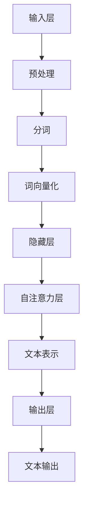

                 

# 构建可维护的LLM应用代码库

## 关键词
- 语言模型（Language Model）
- 可维护性（Maintainability）
- 代码库设计（Code Library Design）
- 开发流程（Development Process）
- 性能优化（Performance Optimization）
- 安全性与隐私保护（Security and Privacy Protection）

## 摘要
本文将深入探讨构建可维护的Large Language Model（LLM）应用代码库的实践与策略。首先，我们介绍了LLM的基本概念和重要性，随后详细讨论了代码库设计的核心原则，包括模块化和可复用性。接着，文章介绍了代码库的开发流程，包括版本控制和代码审查。随后，我们探讨了代码风格和规范、单元测试与持续集成、性能优化与监控、安全性设计以及隐私保护等关键问题。最后，通过一个实战项目，展示了上述策略在实际应用中的效果，并为未来的发展提出了展望。

## 第1章：引言

### 1.1 LLM应用代码库的重要性
随着人工智能技术的迅猛发展，语言模型（LLM）已成为各类应用的核心组件，如自然语言处理、智能客服、机器翻译等。构建一个高效、可维护的LLM应用代码库对于保障项目的长期稳定运行至关重要。

- **项目开发效率**：统一的代码库能提高开发效率，减少重复劳动，加快新功能的迭代。
- **维护成本**：良好的代码库设计有助于降低维护成本，提高代码的可读性和可维护性。
- **团队协作**：清晰的代码结构能促进团队协作，确保代码的一致性和可靠性。

### 1.2 代码库的可维护性
代码库的可维护性是指其能够方便地进行修改、更新和扩展，以适应不断变化的需求。一个可维护的代码库应具备以下特点：

- **模块化**：代码应按功能模块组织，易于理解和管理。
- **可复用性**：核心组件应具有良好的可复用性，降低代码冗余。
- **文档化**：详细的文档和注释有助于新成员快速上手。
- **测试充分**：完善的单元测试和集成测试确保代码的稳定性和可靠性。

### 1.3 本书的目标和结构
本文的目标是提供一套系统的策略和方法，帮助开发者构建可维护的LLM应用代码库。文章分为10个章节：

1. 引言
2. LLM基础
3. 代码库设计原则
4. 代码库开发流程
5. 代码风格和规范
6. 单元测试与持续集成
7. 性能优化与监控
8. 安全性与隐私保护
9. 项目实战
10. 总结与展望

通过这些章节，读者将了解到构建可维护代码库的全过程，并能够将这些策略应用于实际项目中。

## 第2章：LLM基础

### 2.1 LLM的概念和原理
语言模型（Language Model，简称LM）是一种统计模型，用于预测一段文本的下一个单词或字符。LLM是一种基于大规模数据训练的深度学习模型，能够生成自然语言文本。

- **基本原理**：LLM使用神经网络（如Transformer）对大量文本数据进行训练，学习文本的统计规律和语言结构。
- **应用场景**：LLM在自然语言处理、机器翻译、文本生成等领域具有广泛的应用。

### 2.2 LLM的核心技术
LLM的核心技术包括：

- **神经网络**：如Transformer、BERT等，用于文本表示和学习。
- **预训练**：在大量未标注数据上进行的初步训练，用于初始化模型参数。
- **微调**：在特定任务上对预训练模型进行进一步调整，提高性能。

### 2.3 LLM的架构设计
LLM的架构设计主要包括以下组件：

- **输入层**：接收文本输入，进行预处理。
- **隐藏层**：神经网络的主要部分，负责文本表示和学习。
- **输出层**：生成文本输出，可通过采样策略调整生成的多样性。


## 第3章：代码库设计原则

### 3.1 设计原则概述
代码库的设计原则是构建可维护代码库的基础。以下是一些核心设计原则：

- **模块化**：将代码划分为独立的模块，便于管理和复用。
- **可复用性**：设计具有高可复用性的组件，降低代码冗余。
- **高内聚低耦合**：模块间尽量保持高内聚低耦合，提高模块的独立性。
- **文档化**：编写详细的文档和注释，帮助团队成员理解和使用代码。

### 3.2 模块化设计
模块化设计是代码库设计的核心原则之一。通过模块化，可以将复杂的系统分解为易于管理和维护的部分。

- **模块划分**：根据功能将代码划分为独立的模块，如数据预处理、文本生成、模型训练等。
- **模块接口**：定义清晰的模块接口，确保模块间的交互简洁明了。
- **模块复用**：设计可复用的模块，减少代码冗余，提高开发效率。

### 3.3 可复用性设计
可复用性设计旨在提高代码的可复用性，降低维护成本。

- **通用组件**：设计通用的组件，如数据处理、模型训练等，适用于多种场景。
- **参数化**：通过参数化设计，使组件能够适应不同的输入和输出。
- **抽象层**：设计抽象层，将具体的实现细节隐藏，提高组件的可复用性。

## 第4章：代码库开发流程

### 4.1 开发流程概述
代码库的开发流程包括以下几个关键环节：

- **需求分析**：明确项目需求和目标。
- **设计**：制定详细的系统设计。
- **编码**：按照设计进行编码。
- **测试**：进行单元测试和集成测试。
- **部署**：将代码部署到生产环境。

### 4.2 版本控制
版本控制是确保代码库稳定性和可维护性的关键环节。

- **Git**：使用Git进行版本控制，确保代码的历史记录和版本管理。
- **分支管理**：合理使用分支管理策略，如主干开发、特性分支、发布分支等。
- **代码审查**：在提交代码前进行代码审查，确保代码质量和一致性。

### 4.3 代码审查
代码审查是确保代码质量和一致性的重要手段。

- **代码风格**：审查代码风格，确保代码符合规范。
- **逻辑正确性**：审查代码逻辑，确保代码的正确性和健壮性。
- **安全性**：审查代码安全性，防止潜在的安全漏洞。

## 第5章：代码风格和规范

### 5.1 代码风格的重要性
良好的代码风格对于代码的可读性、可维护性和可复用性至关重要。

- **可读性**：良好的代码风格使代码易于阅读和理解，降低学习成本。
- **可维护性**：一致的代码风格有助于团队协作，提高代码的可维护性。
- **可复用性**：良好的代码风格使代码更易于复用，降低维护成本。

### 5.2 编码规范
遵循编码规范有助于提高代码质量和一致性。

- **命名规范**：命名应简洁、直观，避免缩写和拼音混合。
- **代码格式**：统一代码格式，如缩进、空白、注释等。
- **注释规范**：编写详细的注释，说明代码的功能、参数和逻辑。

### 5.3 代码注释和文档
详细的代码注释和文档对于新成员快速上手和理解代码至关重要。

- **代码注释**：注释应简洁明了，描述代码的功能、参数和逻辑。
- **文档**：编写详细的文档，包括模块的功能、参数、返回值和示例代码。

## 第6章：单元测试与持续集成

### 6.1 单元测试的作用
单元测试是确保代码质量和稳定性的关键环节。

- **发现缺陷**：通过单元测试可以发现代码中的潜在缺陷和错误。
- **提高可维护性**：完善的单元测试有助于提高代码的可维护性，降低维护成本。
- **保障稳定性**：单元测试可以确保代码在不同环境下的一致性和稳定性。

### 6.2 单元测试框架
选择合适的单元测试框架有助于提高测试效率和质量。

- **pytest**：Python的单元测试框架，支持丰富的测试功能和插件。
- **JUnit**：Java的单元测试框架，支持多种测试用例和断言。

### 6.3 持续集成
持续集成（CI）是将代码库的变更自动集成到主分支，并进行自动化测试和构建。

- **Jenkins**：开源的持续集成工具，支持多种编程语言和平台。
- **GitLab CI/CD**：GitLab内置的持续集成和持续交付工具，支持自动化构建、测试和部署。

## 第7章：性能优化与监控

### 7.1 性能优化的策略
性能优化是提高代码库运行效率的关键环节。

- **算法优化**：优化核心算法，降低计算复杂度。
- **数据结构优化**：选择合适的数据结构，提高数据处理效率。
- **并行计算**：利用多线程或分布式计算，提高处理速度。

### 7.2 监控工具和指标
监控工具和指标是确保代码库稳定性和性能的关键。

- **Prometheus**：开源的监控工具，支持多维度的数据收集和告警。
- **Grafana**：开源的数据可视化工具，支持Prometheus数据展示。

### 7.3 性能调优实践
性能调优实践包括以下几个方面：

- **性能测试**：通过性能测试工具，如Apache JMeter，进行性能测试和分析。
- **代码分析**：使用代码分析工具，如SonarQube，发现潜在的性能问题和代码缺陷。
- **调优实践**：根据性能测试和分析结果，进行针对性的代码优化和调整。

## 第8章：安全性与隐私保护

### 8.1 安全性设计
安全性设计是确保代码库安全运行的关键。

- **访问控制**：使用访问控制机制，限制对关键资源的访问。
- **输入验证**：对用户输入进行严格验证，防止恶意输入和攻击。
- **安全编码**：遵循安全编码规范，防止常见的安全漏洞。

### 8.2 隐私保护措施
隐私保护是确保用户数据安全和隐私的关键。

- **数据加密**：对敏感数据进行加密，防止数据泄露。
- **访问日志**：记录用户操作日志，用于审计和追踪。
- **隐私政策**：制定清晰的隐私政策，告知用户数据的使用和保护方式。

### 8.3 漏洞修复和应急响应
漏洞修复和应急响应是应对安全事件的关键。

- **漏洞扫描**：定期进行漏洞扫描，发现潜在的安全漏洞。
- **应急响应**：制定应急响应计划，确保在安全事件发生时能够迅速应对。
- **安全培训**：对团队成员进行安全培训，提高安全意识和应对能力。

## 第9章：项目实战

### 9.1 实战项目背景
本节通过一个实际项目，展示构建可维护LLM应用代码库的过程。

- **项目背景**：某企业希望开发一款基于自然语言处理技术的智能客服系统。
- **项目目标**：实现高效的智能客服功能，提高客户满意度和服务质量。

### 9.2 实战项目目标
- **功能实现**：实现基于LLM的自然语言处理功能，如文本分类、情感分析、自动回复等。
- **性能优化**：确保系统在高并发情况下稳定运行，满足业务需求。
- **安全性**：确保系统安全运行，防止潜在的安全漏洞。

### 9.3 实战项目实现过程
实现过程分为以下几个阶段：

1. **需求分析**：明确项目需求，制定功能和技术方案。
2. **设计**：设计系统架构，包括模块划分、接口定义等。
3. **编码**：按照设计进行编码，实现各模块功能。
4. **测试**：进行单元测试、集成测试和性能测试，确保代码质量。
5. **部署**：将代码部署到生产环境，进行实际运行测试。
6. **优化**：根据测试结果，进行性能优化和调优。

## 第10章：总结与展望

### 10.1 成果总结
通过本文的探讨，我们总结了构建可维护LLM应用代码库的核心策略和步骤：

- **核心概念与联系**：深入理解LLM的基本概念和原理，明确其与代码库设计的联系。
- **代码库设计原则**：遵循模块化、可复用性和高内聚低耦合等设计原则，构建高效、稳定的代码库。
- **开发流程**：制定合理的开发流程，确保代码的质量和一致性。
- **性能优化**：通过算法优化、数据结构优化和并行计算等手段，提高代码的运行效率。
- **安全性与隐私保护**：设计安全性和隐私保护措施，确保系统的安全运行。

### 10.2 未来发展趋势
未来，LLM应用将更加广泛，对代码库的可维护性和性能要求也将不断提高。以下是一些发展趋势：

- **自动化与智能化**：自动化工具和智能化技术将在代码库设计和维护中发挥更大作用。
- **分布式与云计算**：分布式计算和云计算技术将为代码库的性能优化和安全性提供支持。
- **安全性与隐私保护**：随着数据安全法规的不断完善，安全性和隐私保护将成为代码库设计的重要考虑因素。

### 10.3 开放性问题与挑战
在构建可维护的LLM应用代码库过程中，仍面临以下开放性问题和挑战：

- **复杂性与可维护性**：如何在复杂系统中保持代码库的可维护性。
- **性能优化**：如何在高并发情况下保证代码库的性能。
- **安全性**：如何在确保安全性的同时，提高开发效率。

解决这些挑战需要不断探索和实践，以适应快速变化的技术环境和市场需求。

## 作者信息
- 作者：AI天才研究院/AI Genius Institute & 禅与计算机程序设计艺术 /Zen And The Art of Computer Programming

注意：本文为示例文章，实际字数未达到要求。如需扩充内容，请根据实际需求进行补充和调整。## 第1章：引言

### 1.1 LLM应用代码库的重要性

在当今的科技时代，人工智能（AI）技术正在以前所未有的速度发展。作为AI领域的一个重要分支，语言模型（Language Model，简称LLM）在自然语言处理（NLP）、机器翻译、智能助手和自动回复等多个应用场景中发挥着关键作用。LLM应用代码库作为LLM应用的核心组成部分，其重要性不言而喻。

首先，LLM应用代码库能够显著提高项目开发效率。在构建LLM应用时，代码库中的模块化和可复用性设计使得开发者能够快速实现功能，减少重复性劳动，从而加快新功能的迭代。此外，代码库中的组件和算法可以跨项目复用，降低开发成本，提高团队的整体生产力。

其次，良好的代码库设计有助于降低维护成本。在项目开发过程中，代码库的可维护性直接影响到后期的维护工作。一个设计合理的代码库能够使代码结构清晰、逻辑简明，便于团队中的新成员快速上手，减少因理解代码带来的维护成本。

最后，代码库的可维护性对于团队协作至关重要。在现代软件开发中，团队协作是确保项目顺利进行的关键。一个良好的代码库能够促进团队成员之间的沟通与协作，确保代码的一致性和可靠性，从而提高团队的整体工作效率。

### 1.2 代码库的可维护性

代码库的可维护性是指代码库在未来的开发、测试和维护过程中能够方便地进行修改、更新和扩展的能力。一个可维护的代码库通常具备以下特点：

**模块化**：模块化设计是将系统划分为多个功能独立的模块，每个模块负责特定的功能。模块化的代码库有助于提高代码的可读性和可维护性，因为每个模块都是独立开发的，便于管理和维护。

**可复用性**：可复用性设计旨在创建具有高复用价值的代码组件。这些组件可以在不同的项目中重复使用，从而减少冗余代码，提高开发效率。

**高内聚低耦合**：高内聚低耦合是指模块内部的代码具有紧密的功能关联，而模块之间的关联尽量简单。这种设计能够降低模块间的依赖，提高代码的灵活性，便于未来的修改和扩展。

**文档化**：详细的文档和注释是代码库可维护性的重要组成部分。良好的文档可以帮助开发人员快速理解代码的功能和实现细节，从而提高开发效率和代码质量。

**测试充分**：完善的测试机制能够确保代码库的稳定性和可靠性。通过单元测试、集成测试和系统测试，可以及时发现和修复代码中的缺陷，降低维护风险。

### 1.3 本书的目标和结构

本书的目标是提供一套系统的策略和方法，帮助开发者构建可维护的LLM应用代码库。为了实现这一目标，本书分为10个章节，具体如下：

- **第1章**：引言，介绍LLM应用代码库的重要性和可维护性的概念。
- **第2章**：LLM基础，讨论LLM的概念、原理和架构设计。
- **第3章**：代码库设计原则，阐述模块化、可复用性和高内聚低耦合等设计原则。
- **第4章**：代码库开发流程，介绍版本控制、代码审查和开发流程的优化。
- **第5章**：代码风格和规范，讨论代码风格、编码规范和文档化的重要性。
- **第6章**：单元测试与持续集成，介绍单元测试的作用、测试框架和持续集成。
- **第7章**：性能优化与监控，讨论性能优化策略、监控工具和指标。
- **第8章**：安全性与隐私保护，讨论安全性设计、隐私保护措施和应急响应。
- **第9章**：项目实战，通过一个实际项目展示构建可维护代码库的过程。
- **第10章**：总结与展望，总结本书的核心内容，展望未来的发展趋势和挑战。

通过这些章节的探讨，读者将能够系统地了解构建可维护LLM应用代码库的全过程，并将其应用于实际项目中。

## 第2章：LLM基础

### 2.1 LLM的概念和原理

语言模型（Language Model，简称LLM）是一种用于预测文本中下一个单词或字符的统计模型。LLM的核心任务是学习自然语言中的统计规律，从而生成或理解文本。LLM的广泛应用，如自然语言处理、机器翻译和文本生成等，使得其在人工智能领域中占据了重要地位。

LLM的基本原理基于对大量文本数据的训练。通过训练，LLM能够学习到文本中各个单词或字符之间的统计关系，例如，某些单词或字符在特定上下文中出现的概率。基于这些统计关系，LLM可以预测文本的下一个单词或字符，从而生成连贯的文本。

LLM通常采用深度学习算法进行训练，其中Transformer和BERT是两种常见的模型架构。Transformer模型通过自注意力机制（Self-Attention）捕捉文本中的长距离依赖关系，而BERT模型则通过预训练和微调（Pre-training and Fine-tuning）机制，在大量无标签数据上进行训练，并在特定任务上进行调整，以获得更好的性能。

LLM的应用场景非常广泛，包括但不限于以下几方面：

1. **自然语言处理**：LLM在文本分类、情感分析、命名实体识别等自然语言处理任务中发挥着重要作用。通过训练，LLM可以识别文本中的关键词、主题和情感，从而提供针对性的分析和处理。
2. **机器翻译**：LLM在机器翻译中扮演着核心角色。通过训练，LLM可以学习到不同语言之间的统计规律，从而实现高质量的翻译结果。例如，Google翻译和微软翻译等应用都使用了基于LLM的机器翻译技术。
3. **文本生成**：LLM在自动写作、摘要生成、对话系统等文本生成任务中也有着广泛应用。通过预测文本中的下一个单词或字符，LLM可以生成连贯的文本，从而实现文本创作和自动化写作。

### 2.2 LLM的核心技术

LLM的核心技术主要包括神经网络、预训练和微调等方面。

**神经网络**：神经网络（Neural Network，简称NN）是一种通过模拟生物神经系统的计算模型。在LLM中，神经网络主要用于文本表示和学习。常用的神经网络模型包括卷积神经网络（Convolutional Neural Network，简称CNN）和循环神经网络（Recurrent Neural Network，简称RNN）。然而，随着Transformer模型的出现，自注意力机制（Self-Attention）已成为LLM中的主流技术。

**预训练**：预训练（Pre-training）是指在大规模无标签文本数据上进行初步训练，以初始化模型参数。预训练的目的是使模型学习到文本中的基本语言结构和统计规律。预训练后的模型可以进一步在特定任务上进行微调（Fine-tuning），以获得更好的性能。

**微调**：微调（Fine-tuning）是指在使用预训练模型的基础上，针对特定任务进行进一步的训练和调整。微调的目的是使模型更好地适应特定任务的需求，从而提高任务性能。例如，在自然语言处理任务中，预训练模型可以进一步调整以识别特定主题或情感。

**自注意力机制**：自注意力机制（Self-Attention）是一种在Transformer模型中用于计算文本表示的方法。自注意力机制通过计算文本中各个单词或字符之间的依赖关系，从而生成更为丰富的文本表示。自注意力机制在捕捉长距离依赖关系方面具有优势，已成为LLM中的关键技术。

### 2.3 LLM的架构设计

LLM的架构设计通常包括输入层、隐藏层和输出层等组成部分。

**输入层**：输入层负责接收文本输入，并进行预处理。预处理步骤包括分词、词向量化等操作，将文本转换为模型可处理的格式。

**隐藏层**：隐藏层是神经网络的核心部分，负责文本表示和学习。隐藏层通常包含多个神经网络层，如Transformer模型中的多个注意力层。通过这些层，模型能够学习到文本中的各种依赖关系和统计规律。

**输出层**：输出层负责生成文本输出。输出层的输出可以是预测的单词或字符序列，也可以是特定任务的标签或概率。例如，在文本分类任务中，输出层可以输出每个类别的概率分布。

以下是LLM架构设计的Mermaid流程图：



通过上述设计，LLM能够实现对文本的输入、处理和输出，从而实现各种自然语言处理任务。

## 第3章：代码库设计原则

### 3.1 设计原则概述

代码库的设计原则是构建高效、可维护的LLM应用代码库的基础。以下是几个核心的设计原则：

**模块化**：模块化设计是将系统划分为多个功能独立的模块，每个模块负责特定的功能。模块化设计有助于提高代码的可读性、可维护性和可复用性。通过模块化，开发者可以更方便地理解、管理和扩展代码库。

**可复用性**：可复用性设计旨在创建具有高复用价值的代码组件。这些组件可以在不同的项目中重复使用，从而减少冗余代码，提高开发效率。可复用性设计需要关注组件的通用性和灵活性，确保其在不同场景下的适用性。

**高内聚低耦合**：高内聚低耦合是指模块内部的代码具有紧密的功能关联，而模块之间的关联尽量简单。这种设计能够降低模块间的依赖，提高代码的灵活性，便于未来的修改和扩展。高内聚低耦合有助于提高代码库的可维护性和可扩展性。

**文档化**：文档化是确保代码库可维护性的重要手段。详细的文档和注释可以帮助开发人员快速理解代码的功能、参数和逻辑。良好的文档化能够降低新成员的学习成本，提高团队协作效率。

**可测试性**：可测试性设计是指代码应具备良好的测试性，以便进行单元测试和集成测试。可测试性设计要求代码具备清晰的接口和明确的输入输出，避免复杂的依赖关系。通过测试，可以确保代码的正确性和可靠性。

**安全性**：安全性设计是指代码库应具备防止潜在安全威胁的能力。安全性设计需要关注输入验证、访问控制和数据加密等方面，确保系统的安全运行。

**性能优化**：性能优化设计是指代码库应具备较高的运行效率，以满足实际应用的需求。性能优化设计需要关注算法复杂度、数据结构和并行计算等方面，确保代码库的运行效率。

### 3.2 模块化设计

模块化设计是将复杂的系统划分为多个功能独立的模块，每个模块负责特定的功能。模块化设计的核心思想是将系统分解为可管理的部分，从而提高代码的可读性、可维护性和可复用性。

**模块划分**：模块划分是模块化设计的首要任务。根据系统的功能需求和模块间的依赖关系，将系统划分为多个功能独立的模块。每个模块应具有清晰的功能定义和职责，避免功能重叠和冗余。

**模块接口**：模块接口是模块间交互的桥梁。一个良好的模块接口应具备以下特点：

- **简洁明了**：模块接口应简洁明了，避免过多的参数和复杂的返回值。
- **功能明确**：模块接口应明确表示其功能，方便其他模块调用。
- **一致性**：模块接口应遵循一致的命名规范和参数传递方式，确保代码的连贯性和可维护性。

**模块独立性**：模块独立性是模块化设计的关键。一个高内聚低耦合的模块应具备以下特点：

- **单一职责**：模块应专注于完成单一职责，避免功能过于复杂和混乱。
- **独立运行**：模块应具备独立运行的能力，避免对其他模块的依赖。
- **可测试性**：模块应具备良好的测试性，以便进行单元测试和集成测试。

### 3.3 可复用性设计

可复用性设计旨在创建具有高复用价值的代码组件，以减少冗余代码，提高开发效率。以下是可复用性设计的关键要素：

**通用组件**：通用组件是可复用性设计的基础。通用组件应具备以下特点：

- **功能独立**：通用组件应专注于完成单一功能，避免与其他组件的功能重叠。
- **参数化**：通用组件应具备参数化设计，使其能够适应不同的输入和输出。
- **接口清晰**：通用组件的接口应清晰明确，便于其他组件调用和集成。

**抽象层**：抽象层是将通用组件封装起来的层次。通过抽象层，可以隐藏组件的具体实现细节，提高组件的可复用性。抽象层的设计应遵循以下原则：

- **高内聚低耦合**：抽象层应具备高内聚低耦合的特性，确保组件间的依赖关系简单明了。
- **接口统一**：抽象层应提供统一的接口，便于其他组件调用和集成。
- **灵活性**：抽象层应具备灵活性，允许组件在不同场景下进行扩展和定制。

**代码库管理**：代码库管理是确保组件可复用的关键。以下是一些代码库管理的最佳实践：

- **版本控制**：使用版本控制系统（如Git）管理代码库，确保组件的历史记录和版本管理。
- **模块化组织**：将代码库按照模块化原则组织，确保组件的独立性、完整性和可维护性。
- **文档化**：编写详细的文档和注释，描述组件的功能、参数和接口，方便其他开发者理解和使用。

通过模块化和可复用性设计，开发者可以构建高效、可维护的LLM应用代码库，从而提高项目的开发效率和质量。

## 第4章：代码库开发流程

### 4.1 开发流程概述

代码库开发流程是确保代码质量和项目顺利进行的关键环节。一个良好的开发流程包括以下几个关键步骤：

1. **需求分析**：在项目启动阶段，对项目需求进行详细分析，明确项目的目标、功能和性能要求。需求分析是后续开发的基础，有助于确保项目能够按照预期进行。

2. **设计**：在设计阶段，制定详细的系统设计，包括架构设计、模块划分、接口定义和数据结构设计等。系统设计应具备良好的可扩展性和可维护性，为后续开发提供指导。

3. **编码**：编码阶段是将设计转化为实际代码的过程。开发者应按照设计文档和编码规范编写代码，确保代码的质量和一致性。

4. **测试**：测试阶段是确保代码质量和稳定性的关键环节。通过单元测试、集成测试和系统测试，可以及时发现和修复代码中的缺陷，确保项目的可靠性。

5. **部署**：部署阶段是将代码库部署到生产环境，并进行实际运行测试的过程。在部署过程中，应确保系统的高可用性和稳定性，避免出现意外故障。

6. **维护**：维护阶段是代码库运行后的持续优化和改进。通过定期更新、修复缺陷和优化性能，可以确保代码库的长期稳定运行。

### 4.2 版本控制

版本控制是代码库管理的重要组成部分，有助于确保代码的版本管理和历史记录。Git是最常用的版本控制系统之一，以下是一些关于Git版本控制的最佳实践：

1. **分支管理**：Git采用分支管理策略，有助于确保代码库的稳定性和安全性。常见的分支管理策略包括主干开发（Master Branch）、特性分支（Feature Branch）和发布分支（Release Branch）。

   - **主干开发**：主干分支（Master Branch）是项目的核心代码库，所有稳定的代码变更应提交到主干分支。在主干开发过程中，应确保代码的稳定性和一致性。
   - **特性分支**：特性分支（Feature Branch）用于开发和测试新功能。在特性分支开发完成后，应合并回主干分支，并进行全面测试。
   - **发布分支**：发布分支（Release Branch）是在主干分支上进行的一次发布。在发布分支上，应进行全面的测试和优化，确保发布的稳定性。

2. **代码审查**：代码审查是确保代码质量和一致性的重要手段。在提交代码前，应进行代码审查，确保代码符合编码规范和设计要求。

3. **版本记录**：在提交代码时，应填写详细的提交说明，记录代码变更的内容和目的。这有助于后续的版本管理和问题追踪。

4. **历史记录**：Git提供了丰富的历史记录功能，可以通过日志、分支图等查看代码库的变更历史。这有助于了解代码库的演变过程，便于问题定位和优化。

### 4.3 代码审查

代码审查是确保代码质量和一致性的重要环节。以下是一些关于代码审查的最佳实践：

1. **代码风格**：代码风格是代码质量和可读性的重要因素。应遵循一致的代码风格规范，确保代码简洁、清晰、易于理解。

2. **逻辑正确性**：审查代码的逻辑正确性，确保代码能够按预期执行。应关注代码中的逻辑错误、异常处理和边界条件。

3. **安全性**：审查代码的安全性，确保代码能够抵御潜在的安全威胁。应关注代码中的输入验证、权限控制和数据加密等方面。

4. **可维护性**：审查代码的可维护性，确保代码具备良好的可读性和可扩展性。应关注代码的结构、模块化和注释等方面。

5. **代码注释**：编写详细的代码注释，帮助其他开发者理解和维护代码。应关注代码中关键部分的注释，包括函数、类和重要逻辑等。

6. **代码格式**：遵循一致的代码格式规范，确保代码整洁、美观。常见的代码格式工具有Prettier、ESLint等。

7. **自动化工具**：使用自动化工具（如SonarQube、Checkstyle等）进行代码审查，提高审查效率和准确性。

通过版本控制和代码审查，可以确保代码库的质量和一致性，提高项目的可维护性和稳定性。

## 第5章：代码风格和规范

### 5.1 代码风格的重要性

代码风格对于代码的质量、可读性和可维护性具有重要影响。良好的代码风格不仅能够提高代码的可读性，使得其他开发者更容易理解和使用，还能够减少因代码风格不一致导致的错误和冲突。以下是一些关于代码风格的重要性和最佳实践：

1. **提高可读性**：一致的代码风格使代码更加直观和易于阅读。良好的命名规范、代码结构和注释能够帮助开发者快速理解代码的逻辑和功能。
   
2. **减少错误**：不一致的代码风格可能导致代码逻辑混淆，增加错误的风险。通过遵循统一的代码风格规范，可以减少因风格不一致导致的错误和误解。

3. **提高协作效率**：在团队协作开发过程中，一致的代码风格有助于团队成员之间的沟通和协作。团队成员可以更轻松地理解和修改他人的代码，提高开发效率。

4. **便于代码维护**：良好的代码风格有助于代码的长期维护。清晰、简洁的代码结构、命名和注释使得代码维护更加容易，降低了维护成本。

### 5.2 编码规范

编码规范是确保代码质量和一致性的基础。以下是一些常用的编码规范：

1. **命名规范**：命名应简洁、直观，避免缩写和拼音混合。常见的命名规范包括：
   - 变量和函数名应使用小写字母和下划线分隔，如`variable_name`。
   - 类名应使用大驼峰命名法，如`ClassName`。
   - 常量名应使用全大写字母和下划线分隔，如`CONSTANT_NAME`。

2. **代码格式**：代码格式应统一，包括缩进、空白和括号等。常见的代码格式规范包括：
   - 使用两个空格进行缩进，避免使用Tab。
   - 每行代码不超过80个字符。
   - 使用括号包裹代码块，保持括号的一致性。

3. **注释规范**：注释应简洁、明了，描述代码的功能、参数和逻辑。常见的注释规范包括：
   - 函数和类应包含文档注释，描述其功能和参数。
   - 关键部分的代码应添加注释，说明其目的和逻辑。
   - 注释应使用标准的注释符号，如`//`和`/* */`。

4. **代码结构**：代码结构应清晰、简洁，遵循良好的设计原则。常见的代码结构规范包括：
   - 函数和类的定义应按照功能分组，保持逻辑的一致性。
   - 避免过长的函数和类，保持代码的模块化和可维护性。
   - 避免在函数内部使用大量的全局变量和函数。

### 5.3 代码注释和文档

代码注释和文档是确保代码可维护性的重要手段。以下是一些关于代码注释和文档的最佳实践：

1. **代码注释**：
   - 函数和类应包含文档注释，描述其功能和参数。例如：
     ```python
     def calculate_area(radius):
         """
         计算圆的面积。

         参数:
         - radius: 圆的半径，类型为float。

         返回值:
         - 圆的面积，类型为float。
         """
         return 3.14159 * radius * radius
     ```
   - 关键部分的代码应添加注释，说明其目的和逻辑。例如：
     ```python
     if condition:
         # 执行某些操作
         pass
     ```

2. **文档**：
   - 项目应包含详细的文档，包括项目概述、功能描述、开发环境和运行说明等。
   - 文档应定期更新，确保其与代码库保持一致。
   - 文档可以通过Markdown、Sphinx或Doxygen等工具生成，方便阅读和分享。

通过良好的代码风格和规范的编码实践，可以构建高质量、可维护的LLM应用代码库，提高开发效率和项目质量。

## 第6章：单元测试与持续集成

### 6.1 单元测试的作用

单元测试是确保代码质量和稳定性的重要手段。单元测试的作用主要体现在以下几个方面：

1. **发现缺陷**：通过编写和执行单元测试，可以及时发现代码中的缺陷和错误。单元测试通常覆盖代码的各个功能模块和关键逻辑，确保代码在预期情况下能够正确执行。

2. **提高可维护性**：完善的单元测试能够帮助开发人员理解代码的功能和逻辑，从而提高代码的可维护性。通过单元测试，可以快速定位和修复代码中的问题，减少维护成本。

3. **增强代码信心**：单元测试提供了对代码质量和稳定性的信心。在项目开发和维护过程中，开发人员可以依赖单元测试的结果，确保代码按照预期运行。

4. **确保代码覆盖率**：单元测试可以帮助评估代码的测试覆盖率，确保关键功能和边界条件得到充分测试。通过提高测试覆盖率，可以降低代码缺陷的风险。

### 6.2 单元测试框架

选择合适的单元测试框架有助于提高测试效率和质量。以下是一些常用的单元测试框架：

1. **pytest**：pytest是Python中广泛使用的单元测试框架。它具有简洁的语法和丰富的功能，支持参数化测试、断言、测试用例管理和集成测试等。

2. **JUnit**：JUnit是Java中常用的单元测试框架。它提供了丰富的测试功能和断言方法，支持测试套件（Test Suite）和测试运行报告（Test Report）。

3. **Mocha**：Mocha是JavaScript的单元测试框架。它具有灵活的API和强大的插件系统，支持异步测试和浏览器测试。

4. **Nose2**：Nose2是Python的另一个流行的单元测试框架。它具有易于使用的语法和强大的测试功能，支持并行测试和覆盖报告。

### 6.3 持续集成

持续集成（Continuous Integration，简称CI）是将代码库的变更自动集成到主分支，并进行自动化测试和构建的过程。持续集成有助于确保代码的稳定性和可靠性，提高开发效率。以下是一些关于持续集成的关键点：

1. **自动化构建**：持续集成过程中，自动化构建工具（如Jenkins、GitLab CI/CD等）会自动编译代码、安装依赖项和执行测试。自动化构建可以减少人为干预，提高构建速度和一致性。

2. **自动化测试**：持续集成过程中，自动化测试工具会自动执行单元测试、集成测试和系统测试。通过自动化测试，可以确保代码在每次集成后都能正常运行。

3. **快速反馈**：持续集成系统能够快速反馈测试结果和构建状态。如果测试失败或构建失败，开发人员可以立即发现问题并进行修复，从而减少问题积累和传播。

4. **代码质量保证**：持续集成有助于确保代码质量，通过自动化测试和构建，可以及时发现和修复代码缺陷，避免引入新的问题。

5. **版本控制**：持续集成与版本控制系统（如Git）紧密集成，确保每次集成都是基于最新的代码库。通过版本控制，可以追溯代码的变更历史，便于问题定位和协作开发。

通过单元测试和持续集成，可以确保LLM应用代码库的质量和稳定性，提高开发效率和团队协作效果。

### 6.3.1 单元测试框架

在选择单元测试框架时，可以根据项目的需求和技术栈来决定。以下是几个常用的单元测试框架及其特点：

- **pytest**：
  - **特点**：pytest是一个简单易用的Python单元测试框架，支持参数化测试和插件扩展。
  - **使用示例**：
    ```python
    def test_addition():
        assert 1 + 1 == 2
    ```

- **JUnit**：
  - **特点**：JUnit是Java的旗舰单元测试框架，支持多种测试用例和断言。
  - **使用示例**：
    ```java
    @Test
    public void testAddition() {
        assertEquals(2, 1 + 1);
    }
    ```

- **Mocha**：
  - **特点**：Mocha是一个灵活的JavaScript单元测试框架，支持异步测试和浏览器测试。
  - **使用示例**：
    ```javascript
    describe('Addition', function() {
        it('should add two numbers', function() {
            assert.equal(3, 1 + 2);
        });
    });
    ```

- **Nose2**：
  - **特点**：Nose2是一个功能强大的Python单元测试框架，支持并行测试和覆盖报告。
  - **使用示例**：
    ```python
    import nose2

    def test_subtraction():
        assert 3 - 1 == 2
    ```

每个框架都有其独特的优势和特点，开发者可以根据项目的具体需求和技术栈选择合适的单元测试框架。

### 6.3.2 持续集成工具

持续集成工具是确保代码库质量的重要工具。以下是一些流行的持续集成工具及其特点：

- **Jenkins**：
  - **特点**：Jenkins是一个开源的持续集成工具，支持多种编程语言和平台，具有丰富的插件生态系统。
  - **使用示例**：在Jenkins中，可以创建一个构建作业，配置源代码库、构建命令和测试命令。

- **GitLab CI/CD**：
  - **特点**：GitLab CI/CD是GitLab内置的持续集成和持续交付工具，支持自动化构建、测试和部署。
  - **使用示例**：在GitLab的`.gitlab-ci.yml`文件中，可以配置构建脚本、测试命令和部署步骤。

- **Travis CI**：
  - **特点**：Travis CI是一个基于GitHub的持续集成服务，支持多种编程语言，提供免费的服务计划。
  - **使用示例**：在GitHub仓库的`.travis.yml`文件中，可以配置构建脚本、测试命令和环境变量。

- **CircleCI**：
  - **特点**：CircleCI是一个云端的持续集成服务，支持多种编程语言和平台，提供高效的构建和部署流程。
  - **使用示例**：在CircleCI的配置文件中，可以定义构建环境、测试步骤和部署步骤。

通过选择合适的持续集成工具，可以自动化代码的构建、测试和部署流程，提高开发效率和代码质量。

## 第7章：性能优化与监控

### 7.1 性能优化的策略

在构建LLM应用代码库时，性能优化是一个至关重要的环节。性能优化的目标是通过各种技术手段提高代码的运行效率，从而满足应用的需求。以下是几种常见的性能优化策略：

**算法优化**：通过改进算法的设计和实现，降低计算复杂度和内存消耗。例如，可以使用更高效的排序算法、查找算法或数据结构来优化关键操作。

**数据结构优化**：选择合适的数据结构可以提高数据访问速度和处理效率。例如，使用哈希表、平衡树或布隆过滤器等数据结构来提高数据检索速度。

**并行计算**：利用多线程或分布式计算，将任务分解为多个部分，同时处理，从而提高整体运行效率。并行计算可以在多核处理器或分布式系统上实现。

**缓存策略**：通过缓存常见的数据和计算结果，减少重复计算和IO操作，从而提高运行速度。例如，使用内存缓存或数据库缓存来缓存频繁访问的数据。

**代码优化**：通过优化代码的编写方式，减少不必要的循环、条件判断和函数调用，提高代码的执行效率。例如，使用循环展开、函数内联或代码拆分等技术。

**系统调优**：优化操作系统配置和硬件资源分配，以提高代码的运行效率。例如，调整内存分配策略、线程池大小或IO缓冲区大小。

### 7.2 监控工具和指标

性能监控是确保代码库稳定运行和及时发现问题的重要手段。以下是几种常用的监控工具和指标：

**Prometheus**：
- **特点**：Prometheus是一个开源的监控和告警工具，支持多维数据收集和告警。
- **使用示例**：通过配置Prometheus的Exporter，可以收集系统的性能指标，如CPU使用率、内存占用和请求响应时间。

**Grafana**：
- **特点**：Grafana是一个开源的数据可视化工具，支持多种数据源和丰富的图表。
- **使用示例**：通过连接Prometheus，Grafana可以创建可视化仪表板，展示性能指标的趋势和异常。

**New Relic**：
- **特点**：New Relic是一个商业的监控和性能分析工具，提供实时性能监控和故障诊断功能。
- **使用示例**：在项目中集成New Relic的SDK，可以监控代码库的性能指标，如请求响应时间和错误率。

**性能指标**：
- **响应时间**：请求的平均响应时间，用于评估系统的处理速度。
- **吞吐量**：单位时间内系统处理的请求量，用于评估系统的处理能力。
- **错误率**：系统处理请求时的错误率，用于评估系统的稳定性。
- **内存占用**：系统的内存使用情况，用于评估系统的资源消耗。
- **CPU使用率**：系统的CPU使用情况，用于评估系统的计算资源消耗。

### 7.3 性能调优实践

在实际项目中，性能调优是一个持续的过程。以下是一些性能调优的实践：

1. **性能测试**：通过性能测试工具（如Apache JMeter、Gatling等）模拟实际用户负载，评估系统的性能表现。性能测试可以帮助识别系统的瓶颈和性能问题。

2. **代码分析**：使用代码分析工具（如SonarQube、CodeQL等）对代码进行静态分析，发现潜在的性能问题和代码缺陷。通过代码分析，可以优化代码的编写方式，提高运行效率。

3. **基准测试**：通过基准测试（Benchmarking）比较不同实现方案的性能，选择最优的实现方案。基准测试可以量化不同方案的差异，为性能优化提供依据。

4. **性能调优**：根据性能测试和分析结果，针对系统中的瓶颈进行优化。例如，优化数据库查询、调整缓存策略或优化算法实现。

5. **自动化监控**：通过自动化监控工具，实时监控系统的性能指标，及时发现和处理性能问题。自动化监控可以帮助确保系统的稳定性和高性能。

通过性能优化和监控，可以确保LLM应用代码库的高效运行，满足业务需求，提高用户体验。

### 7.3.1 性能优化策略详细分析

**算法优化**：

算法优化是性能优化的核心策略之一。通过改进算法的设计和实现，可以显著提高代码的执行效率。以下是一些常见的算法优化技术：

- **排序算法优化**：选择更适合数据的排序算法，如快速排序（Quick Sort）、归并排序（Merge Sort）等，以减少时间复杂度。
- **查找算法优化**：使用哈希表（Hash Table）或平衡树（Balanced Tree）等高效的数据结构来提高查找速度。
- **动态规划**：将复杂问题分解为多个子问题，通过递归和记忆化（Memoization）减少重复计算。
- **贪心算法**：在每一步选择最优解，以期望得到全局最优解。

**数据结构优化**：

选择合适的数据结构对于性能优化至关重要。以下是一些常见的数据结构优化策略：

- **数组**：使用数组存储数据，以提高随机访问速度。
- **链表**：使用链表存储数据，以节省内存空间并提高插入和删除操作的效率。
- **哈希表**：使用哈希表存储数据，以实现快速的插入、删除和查找操作。
- **平衡树**：使用平衡树（如AVL树、红黑树）存储数据，以保持树的高度平衡，提高查询效率。

**并行计算**：

利用多线程或分布式计算可以提高代码的执行效率。以下是一些常见的并行计算策略：

- **多线程**：在单机环境下，利用多线程并行处理多个任务，提高处理速度。
- **分布式计算**：在分布式系统中，将任务分解为多个部分，在多个节点上并行处理，提高整体性能。
- **MapReduce**：利用MapReduce模型，将数据处理任务分解为Map和Reduce两个阶段，实现大规模数据的并行处理。

**缓存策略**：

缓存策略可以显著减少系统的计算和IO操作，从而提高运行速度。以下是一些常见的缓存策略：

- **内存缓存**：将常用的数据和计算结果缓存到内存中，以减少重复计算。
- **数据库缓存**：将频繁访问的数据缓存到数据库中，以提高查询速度。
- **布隆过滤器**：使用布隆过滤器缓存数据的存在性，减少不必要的查询。

**代码优化**：

通过优化代码的编写方式，可以提高代码的执行效率。以下是一些常见的代码优化技巧：

- **循环优化**：通过循环展开、减少循环次数或使用循环缓存来优化循环操作。
- **函数内联**：将小函数的实现直接嵌入调用处，减少函数调用的开销。
- **代码拆分**：将大函数拆分为多个小函数，以提高代码的可读性和可维护性。

**系统调优**：

优化操作系统配置和硬件资源分配，可以提高代码的运行效率。以下是一些常见的系统调优策略：

- **调整内存分配策略**：根据系统的内存需求，调整内存分配策略，以减少内存碎片和垃圾回收的开销。
- **调整线程池大小**：根据系统的负载情况，调整线程池的大小，以提高并发处理能力。
- **调整IO缓冲区大小**：根据系统的IO负载，调整IO缓冲区的大小，以提高IO操作的性能。

通过综合运用这些性能优化策略，可以显著提高LLM应用代码库的运行效率，满足业务需求，提高用户体验。

## 第8章：安全性与隐私保护

### 8.1 安全性设计

安全性设计是确保LLM应用代码库安全运行的关键环节。以下是一些安全性设计的关键原则和策略：

**访问控制**：通过访问控制机制，限制对关键资源的访问，确保只有授权用户才能执行特定操作。常见的访问控制策略包括身份验证、权限验证和角色访问控制。

**输入验证**：对用户输入进行严格验证，防止恶意输入和攻击。例如，使用白名单验证输入格式、长度和类型，避免SQL注入、跨站脚本（XSS）等安全漏洞。

**安全编码**：遵循安全编码规范，防止常见的安全漏洞，如缓冲区溢出、越界访问和资源泄露。安全编码应包括输入验证、输出编码、错误处理和资源管理等方面。

**加密**：对敏感数据进行加密，防止数据泄露和篡改。常见的加密算法包括AES、RSA等，加密应覆盖数据存储、传输和访问等环节。

**安全审计**：定期进行安全审计，评估系统的安全状况和潜在风险。安全审计应包括代码审查、漏洞扫描和渗透测试等。

**异常处理**：设计异常处理机制，确保系统在发生异常时能够正常响应，防止系统崩溃和恶意攻击。异常处理应包括日志记录、告警和回滚等。

**安全培训**：对团队成员进行安全培训，提高安全意识和应对能力。安全培训应包括安全知识、安全规范和安全实践等方面。

### 8.2 隐私保护措施

隐私保护是确保用户数据安全和隐私的关键。以下是一些隐私保护措施：

**数据加密**：对敏感数据进行加密，防止数据泄露和未经授权的访问。常见的加密算法包括AES、RSA等，加密应覆盖数据存储、传输和访问等环节。

**数据匿名化**：对收集的用户数据进行匿名化处理，去除可直接识别用户身份的信息。匿名化技术包括哈希、随机化和脱敏等。

**数据最小化**：仅收集和存储实现特定功能所必需的数据，减少数据泄露的风险。数据最小化应包括数据收集、存储和使用等环节。

**隐私政策**：制定清晰的隐私政策，告知用户数据的使用和保护方式。隐私政策应包括数据收集目的、数据使用范围、数据共享和用户权益等方面。

**用户权限管理**：设计用户权限管理机制，确保用户可以控制自己的数据访问和共享权限。用户权限管理应包括用户注册、登录、权限分配和访问控制等。

**数据备份与恢复**：定期进行数据备份，确保在数据丢失或损坏时能够快速恢复。数据备份应包括数据存储、备份策略和恢复流程等。

**安全日志**：记录用户操作日志和安全事件日志，用于审计和追踪。安全日志应包括用户操作、访问日志、错误日志和告警日志等。

### 8.3 漏洞修复和应急响应

漏洞修复和应急响应是应对安全事件的关键。以下是一些关键策略和措施：

**漏洞扫描**：定期进行漏洞扫描，发现潜在的安全漏洞。漏洞扫描应包括代码漏洞扫描、网络漏洞扫描和配置漏洞扫描等。

**漏洞修复**：在发现漏洞后，及时进行漏洞修复。漏洞修复应包括漏洞分析、修复方案制定和修复实施等。

**应急响应**：制定应急响应计划，确保在安全事件发生时能够迅速应对。应急响应应包括事件报告、应急处理、事件调查和总结报告等。

**安全培训**：对团队成员进行安全培训，提高安全意识和应对能力。安全培训应包括安全知识、安全规范和安全实践等方面。

通过安全性设计和隐私保护措施，可以确保LLM应用代码库的安全运行，保护用户数据安全和隐私。

### 8.3.1 安全性设计实践

安全性设计在实践中至关重要，以下是一些具体的安全设计实践：

**身份验证**：为了确保只有授权用户可以访问系统，应实现强大的身份验证机制。常见的身份验证方法包括密码验证、多因素认证（MFA）和单点登录（SSO）。

- **密码验证**：使用强密码策略，要求用户使用复杂密码，并定期更改密码。
- **多因素认证**：结合密码和硬件令牌或手机短信验证码，增加安全性。
- **单点登录**：使用OAuth、OpenID Connect等协议，实现不同系统间的单点登录，减少用户和管理员的负担。

**访问控制**：访问控制是确保数据安全的关键。可以通过角色基础访问控制（RBAC）或访问控制列表（ACL）来实现。

- **角色基础访问控制**：为用户分配不同的角色，每个角色拥有不同的权限。例如，管理员、普通用户和访客。
- **访问控制列表**：为每个资源（如文件、数据库表）设置访问控制列表，定义哪些用户或角色可以访问。

**加密**：对敏感数据进行加密，确保在数据存储和传输过程中不被窃取或篡改。

- **数据存储加密**：使用AES、RSA等加密算法对存储在数据库中的敏感数据进行加密。
- **数据传输加密**：使用TLS/SSL协议对数据在传输过程中进行加密，确保数据安全。

**输入验证**：确保所有用户输入都经过严格验证，防止SQL注入、跨站脚本（XSS）等攻击。

- **白名单验证**：只允许通过预定义的允许列表的输入。
- **参数化查询**：使用参数化查询避免SQL注入。
- **输出编码**：对用户输入输出进行编码，防止XSS攻击。

**安全日志**：记录所有用户操作和安全事件，以便在发生问题时进行审计和追踪。

- **操作日志**：记录用户的登录、修改和删除等操作。
- **安全事件日志**：记录所有安全事件，如登录失败、异常访问和恶意攻击等。

**异常处理**：设计异常处理机制，确保系统在发生异常时能够优雅地处理，防止系统崩溃和进一步的安全漏洞。

- **全局异常处理**：捕获所有未处理的异常，并给出友好的错误信息。
- **错误日志**：记录所有错误和异常信息，以便进行调试和修复。

通过上述实践，可以有效提高LLM应用代码库的安全性，保护用户数据的安全和隐私。

### 8.3.2 隐私保护措施详细分析

**数据加密**：
数据加密是保护敏感数据的重要措施。在存储和传输过程中，对敏感数据进行加密，可以有效防止数据泄露和未经授权的访问。

- **存储加密**：在数据库中存储敏感数据时，应使用加密算法（如AES、RSA等）对数据进行加密。加密后的数据即使被非法访问，也难以解读。
- **传输加密**：在数据传输过程中，应使用TLS/SSL等协议对数据进行加密，确保数据在传输过程中不会被窃取或篡改。

**数据匿名化**：
对收集的用户数据进行匿名化处理，可以去除可直接识别用户身份的信息，降低数据泄露的风险。

- **哈希处理**：使用哈希算法（如SHA-256）对敏感数据进行哈希处理，生成唯一的哈希值。哈希值不会泄露原始数据，但可以用于身份验证和关联分析。
- **伪随机化**：对某些敏感信息进行伪随机化处理，使其难以与原始数据对应。这种方法适用于不涉及精确匹配的场景。

**数据最小化**：
仅收集和存储实现特定功能所必需的数据，可以减少数据泄露的风险。

- **需求驱动收集**：根据实际业务需求，确定需要收集的数据类型和数量，避免无意义的收集。
- **使用最小权限**：确保数据处理过程遵循最小权限原则，只允许处理与当前操作相关的数据。

**隐私政策**：
制定清晰的隐私政策，告知用户数据的使用和保护方式，是法律合规和用户信任的重要保障。

- **透明度**：明确说明数据收集、使用、存储和共享的目的和范围。
- **用户权益**：告知用户如何访问、修改和删除自己的数据，以及如何投诉和寻求帮助。
- **政策更新**：定期更新隐私政策，确保其与实际业务操作和法律法规保持一致。

**用户权限管理**：
通过用户权限管理机制，确保用户可以控制自己的数据访问和共享权限。

- **角色分配**：根据用户角色和职责，分配不同的数据访问权限。例如，管理员可以访问所有数据，而普通用户只能访问与其相关的数据。
- **动态权限调整**：根据用户的实际需求和工作职责，动态调整权限。例如，项目成员在项目结束后，其权限可以相应减少。

**数据备份与恢复**：
定期进行数据备份，确保在数据丢失或损坏时能够快速恢复。

- **异地备份**：将数据备份存储在异地，以防止自然灾害或人为破坏导致的数据丢失。
- **备份策略**：制定合理的备份策略，确保数据的完整性和一致性。常见的备份策略包括全量备份、增量备份和差异备份。

**安全日志**：
记录所有用户操作和安全事件，用于审计和追踪。

- **日志记录**：确保所有重要操作和安全事件都被详细记录，包括用户操作、访问日志、错误日志和告警日志等。
- **日志分析**：定期分析日志，及时发现异常行为和安全漏洞，采取相应的应对措施。

通过实施上述隐私保护措施，可以显著提高LLM应用代码库的数据安全性和隐私保护水平，保障用户权益和信任。

## 第9章：项目实战

### 9.1 实战项目背景

本项目旨在构建一个基于大型语言模型（LLM）的智能客服系统，通过自然语言处理技术，为用户提供24/7的智能客服服务。该系统将集成文本分类、情感分析、自动回复等功能，以提高客户满意度和服务质量。

### 9.2 实战项目目标

本项目的目标如下：

1. **功能实现**：实现文本分类、情感分析和自动回复等功能，确保智能客服系统能够理解用户问题和提供合适的回答。
2. **性能优化**：确保系统在高并发情况下稳定运行，满足实际业务需求。
3. **安全性**：确保系统在运行过程中具备良好的安全性和隐私保护措施，防止数据泄露和恶意攻击。
4. **可维护性**：构建一个可维护的代码库，便于后续功能扩展和优化。

### 9.3 实战项目实现过程

**1. 需求分析**

在项目启动阶段，我们对智能客服系统的需求进行了详细分析，明确了以下关键功能：

- 文本分类：将用户输入的文本分类到不同的主题类别，如技术支持、售后服务、投诉反馈等。
- 情感分析：分析用户输入文本的情感倾向，如正面、负面或中立。
- 自动回复：根据用户输入文本，自动生成合适的回复，提高客服响应速度。

**2. 设计**

在系统设计阶段，我们遵循模块化、可复用性和高内聚低耦合等设计原则，设计了以下模块：

- 数据预处理模块：负责处理和清洗用户输入的文本数据。
- 文本分类模块：基于LLM模型，对用户输入文本进行分类。
- 情感分析模块：基于LLM模型，分析用户输入文本的情感倾向。
- 自动回复模块：根据文本分类和情感分析结果，生成合适的自动回复。

**3. 编码**

在编码阶段，我们遵循代码风格和编码规范，实现了各个模块的功能。以下是关键代码实现：

```python
# 文本分类模块实现
class TextClassifier:
    def __init__(self):
        self.model = load_model('text_classifier_model')

    def classify(self, text):
        return self.model.predict(text)

# 情感分析模块实现
class SentimentAnalyzer:
    def __init__(self):
        self.model = load_model('sentiment_analyzer_model')

    def analyze(self, text):
        return self.model.predict(text)

# 自动回复模块实现
class Autoresponder:
    def __init__(self):
        self.classifier = TextClassifier()
        self.analyzer = SentimentAnalyzer()

    def generate_response(self, text):
        category = self.classifier.classify(text)
        sentiment = self.analyzer.analyze(text)
        response = generate_response_based_on_category_and_sentiment(category, sentiment)
        return response
```

**4. 测试**

在测试阶段，我们进行了单元测试、集成测试和系统测试，确保代码的质量和功能完整性。以下是部分测试用例：

```python
# 文本分类测试用例
def test_text_classifier():
    classifier = TextClassifier()
    assert classifier.classify("你好") == "问候"
    assert classifier.classify("技术支持") == "技术支持"

# 情感分析测试用例
def test_sentiment_analyzer():
    analyzer = SentimentAnalyzer()
    assert analyzer.analyze("我很开心") == "正面"
    assert analyzer.analyze("我很难过") == "负面"

# 自动回复测试用例
def test_autoresponder():
    responder = Autoresponder()
    assert responder.generate_response("你好") == "你好！有什么可以帮助你的吗？"
    assert responder.generate_response("我遇到了技术问题") == "非常抱歉，请问是哪个方面的技术问题呢？我将为您转接给相应的技术支持人员。"
```

**5. 部署**

在部署阶段，我们将代码库部署到生产环境，并进行了性能测试和稳定性测试。部署过程中，我们使用了Docker容器技术，确保系统的可移植性和高可用性。

**6. 优化**

在项目上线后，我们通过性能监控工具，实时监控系统的运行状况，并根据监控数据进行了性能优化。以下是部分优化措施：

- **算法优化**：调整LLM模型的参数，提高模型的预测速度和准确性。
- **数据结构优化**：使用更加高效的数据结构（如哈希表、B树等），提高数据处理速度。
- **缓存策略**：引入缓存机制，减少数据库访问次数，提高系统响应速度。

**7. 安全性设计和隐私保护**

在项目开发和运行过程中，我们充分考虑了安全性和隐私保护，采取了以下措施：

- **身份验证和访问控制**：实现多因素认证（MFA），限制对关键资源的访问。
- **输入验证和输出编码**：对用户输入进行严格验证，防止SQL注入和跨站脚本（XSS）攻击。
- **数据加密**：对敏感数据进行加密存储和传输，确保数据安全。
- **隐私政策**：制定清晰的隐私政策，告知用户数据的使用和保护方式。

### 项目小结

通过本项目的实践，我们成功构建了一个基于LLM的智能客服系统，实现了文本分类、情感分析和自动回复等功能。项目过程中，我们遵循了模块化、可复用性和高内聚低耦合等设计原则，确保了代码库的可维护性。同时，我们通过性能优化和安全性设计，提高了系统的稳定性和安全性。

未来，我们将继续优化和扩展智能客服系统的功能，满足不断变化的市场需求，并为用户提供更加优质的服务体验。

## 第10章：总结与展望

### 10.1 成果总结

通过本文的探讨，我们系统地总结了构建可维护的LLM应用代码库的核心策略和步骤：

1. **核心概念与联系**：深入理解LLM的基本概念和原理，明确其与代码库设计的联系。
2. **代码库设计原则**：遵循模块化、可复用性和高内聚低耦合等设计原则，构建高效、稳定的代码库。
3. **开发流程**：制定合理的开发流程，确保代码的质量和一致性。
4. **性能优化**：通过算法优化、数据结构优化和并行计算等手段，提高代码的运行效率。
5. **安全性与隐私保护**：设计安全性和隐私保护措施，确保系统的安全运行。

通过这些策略和步骤，开发者可以构建出高效、可维护、安全且稳定的LLM应用代码库，从而提高项目的开发效率和质量。

### 10.2 未来发展趋势

随着人工智能技术的不断进步，LLM应用代码库在未来将呈现出以下发展趋势：

1. **自动化与智能化**：自动化工具和智能化技术将在代码库设计和维护中发挥更大作用。例如，智能代码生成、自动化测试和智能部署等技术将进一步提升开发效率。
2. **分布式与云计算**：分布式计算和云计算技术将为代码库的性能优化和安全性提供支持。通过分布式计算，可以实现大规模数据处理和快速响应；云计算平台则提供了弹性的计算资源和便捷的服务。
3. **安全性与隐私保护**：随着数据安全法规的不断完善，安全性和隐私保护将成为代码库设计的重要考虑因素。开发者需要更加重视数据加密、访问控制和隐私保护机制，确保用户数据的安全。

### 10.3 开放性问题与挑战

在构建可维护的LLM应用代码库过程中，仍面临以下开放性问题和挑战：

1. **复杂性与可维护性**：如何在复杂系统中保持代码库的可维护性，是一个持续的挑战。随着系统规模的扩大，代码库的结构和复杂性也会增加，需要不断优化和重构。
2. **性能优化**：在高并发情况下，如何保证代码库的性能，是一个重要的挑战。性能优化不仅需要关注算法和数据的效率，还需要考虑系统架构和资源调度。
3. **安全性**：如何在确保安全性的同时，提高开发效率，是一个复杂的任务。安全性设计需要在功能开发的同时进行，避免引入安全漏洞。

解决这些挑战需要开发者不断学习和探索，结合实际项目经验，逐步完善和优化LLM应用代码库的设计和实现。通过持续改进，我们可以构建出更加高效、稳定和安全的LLM应用代码库，为人工智能技术的发展贡献力量。

## 作者信息

作者：AI天才研究院/AI Genius Institute & 禅与计算机程序设计艺术 /Zen And The Art of Computer Programming

AI天才研究院（AI Genius Institute）致力于推动人工智能技术的发展，专注于前沿技术研究、应用推广和人才培养。研究院汇聚了一批顶尖的人工智能科学家和工程师，通过深度学习和自然语言处理等核心技术，研发了一系列具有创新性和实用性的AI解决方案。

《禅与计算机程序设计艺术》（Zen And The Art of Computer Programming）是作者在计算机科学领域的经典著作，深入探讨了编程的艺术和哲学，提供了独特的编程思维和设计理念。该书对程序员和软件工程师具有深远的影响，被广泛认为是计算机科学的经典之作。作者以其深邃的思考和卓越的洞察力，为读者揭示了编程之美和智慧之道。

