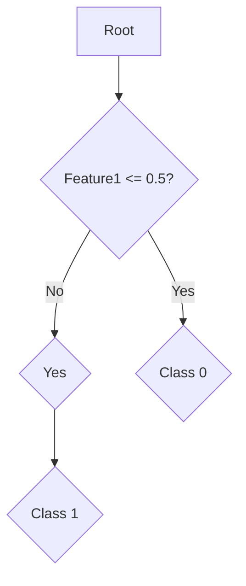

                 


# 构建可解释的AI系统：提高人工智能的透明度

> 关键词：人工智能，可解释性，透明度，AI系统，算法，数学模型，Python代码，项目实战

> 摘要：本文将探讨如何构建可解释的AI系统，提高人工智能的透明度。我们将分析可解释AI的基本概念、技术框架，并通过实际项目实战来展示如何实现和应用可解释AI。

## 引言与背景

### AI的发展与挑战

人工智能（AI）已经从科幻小说走进了现实生活，成为了推动社会进步的重要力量。AI在图像识别、自然语言处理、智能推荐等领域取得了显著的成就，但同时也带来了许多挑战。其中一个关键挑战是AI系统的不可解释性。许多AI系统，尤其是深度学习模型，其决策过程往往被视为“黑箱”，即使开发者和使用者也很难理解其内部机制。这种不可解释性可能导致以下几个问题：

1. **信任问题**：当AI系统的决策结果影响人类福祉时，缺乏透明度会降低人们对AI的信任。
2. **法规遵守**：许多领域，如医疗、金融和司法，都要求系统的决策过程必须透明，以确保合规性和道德标准。
3. **系统优化**：不可解释的AI系统难以进行优化和改进，因为开发者无法了解哪些方面需要改进。

### 可解释AI的概念

为了解决上述问题，可解释AI（Explainable AI，XAI）的概念应运而生。可解释AI旨在提高AI系统的透明度，使得AI的决策过程可以被理解。可解释AI的目标不仅是让AI系统对人类可解释，还包括提高AI系统之间的可解释性，以便于系统的集成和协作。

### 可解释AI的重要性

可解释AI的重要性体现在以下几个方面：

1. **提高信任与接受度**：通过提高AI系统的可解释性，可以增强用户对AI系统的信任，促进AI在各个领域的应用。
2. **满足法规与道德要求**：在许多行业，法规和道德规范要求AI系统的决策过程必须透明，可解释AI有助于满足这些要求。
3. **促进AI系统的优化与发展**：可解释AI有助于开发者理解AI系统的决策过程，从而进行优化和改进，提高系统的性能和稳定性。

## 可解释AI的基本概念与重要性

### 可解释性与透明度

可解释性与透明度是可解释AI的核心概念。可解释性指的是AI系统输出结果的可理解程度，而透明度则是指AI系统内部机制的可访问性。一个高度可解释的AI系统不仅其输出结果可以理解，而且其内部决策过程也是透明的，可以被外部人员理解和验证。

### 可解释AI的层次

可解释AI可以分为三个层次：

1. **局部解释**：关注AI系统在特定输入下的决策过程，例如，分析一个深度学习模型在特定图像上的分类决策。
2. **全局解释**：关注AI系统整体的决策过程，例如，分析一个分类模型在所有数据集上的分类表现。
3. **混合解释**：结合局部和全局解释，提供更全面的解释。

### 可解释AI的关键要素

实现可解释AI需要考虑以下关键要素：

1. **模型选择**：选择可解释性较高的模型，例如，决策树和规则模型。
2. **解释方法**：采用合适的解释方法，例如，基于规则的解释、可视化方法、基于模型内部的解释。
3. **评估指标**：设计合适的评估指标，例如，解释性、透明度、准确性。

## 可解释AI的技术框架

### 技术框架概述

可解释AI的技术框架包括以下几个部分：

1. **模型选择**：选择具有较高可解释性的模型，如决策树、线性回归等。
2. **解释方法**：采用各种解释方法，如基于规则的解释、可视化方法、模型内部解释。
3. **评估与优化**：评估AI系统的可解释性，并进行优化。

### 技术框架详解

1. **局部解释方法**

   局部解释方法关注AI系统在特定输入下的决策过程。常见的方法包括：

   - **规则提取**：从AI模型中提取规则，例如，从决策树中提取决策路径。
   - **敏感性分析**：分析输入特征对AI系统输出结果的影响。
   - **可视化方法**：使用可视化工具展示AI系统的决策过程，例如，使用热力图展示特征的重要性。

2. **全局解释方法**

   全局解释方法关注AI系统整体的决策过程。常见的方法包括：

   - **模型分析**：分析AI模型的整体结构，例如，分析神经网络模型的层次结构。
   - **性能分析**：评估AI系统在不同数据集上的性能表现。

3. **混合解释方法**

   混合解释方法结合局部和全局解释，提供更全面的解释。常见的方法包括：

   - **分层解释**：先进行局部解释，再进行全局解释，例如，先解释单个图像，再解释整体数据集。
   - **交叉验证**：结合不同解释方法，提高解释的准确性。

## 可解释AI的应用场景

### 应用场景概述

可解释AI在多个领域都有广泛的应用，以下是一些常见应用场景：

1. **医疗与健康**：使用可解释AI进行疾病诊断和预测，提高医疗决策的透明度。
2. **金融与保险**：使用可解释AI进行风险评估和欺诈检测，提高金融服务的透明度和合规性。
3. **制造业与供应链**：使用可解释AI进行生产优化和供应链管理，提高运营效率和透明度。

### 应用场景详述

1. **医疗与健康**

   在医疗领域，可解释AI有助于提高诊断和治疗的透明度。例如，通过分析患者数据，可解释AI可以提供疾病的诊断建议，同时解释决策过程，帮助医生更好地理解AI的决策依据。以下是一个简化的Python代码示例，展示如何使用可解释AI进行疾病诊断：

   ```python
   import pandas as pd
   from sklearn.tree import DecisionTreeClassifier
   from sklearn.inspection import plot_tree

   # 加载数据
   data = pd.read_csv('patient_data.csv')
   X = data.drop('diagnosis', axis=1)
   y = data['diagnosis']

   # 构建决策树模型
   model = DecisionTreeClassifier()
   model.fit(X, y)

   # 可视化决策树
   plot_tree(model, filled=True)
   ```

   通过可视化决策树，医生可以理解AI的决策过程，从而提高对疾病诊断的信任。

2. **金融与保险**

   在金融领域，可解释AI可以帮助识别潜在的风险和欺诈行为。以下是一个简化的Python代码示例，展示如何使用可解释AI进行欺诈检测：

   ```python
   import pandas as pd
   from sklearn.ensemble import RandomForestClassifier
   from sklearn.inspection import permutation_importance

   # 加载数据
   data = pd.read_csv('transaction_data.csv')
   X = data.drop('is_fraud', axis=1)
   y = data['is_fraud']

   # 构建随机森林模型
   model = RandomForestClassifier()
   model.fit(X, y)

   # 计算特征重要性
   results = permutation_importance(model, X, y, n_repeats=10)

   # 打印特征重要性
   for feature, importance in zip(X.columns, results.importances_mean):
       print(f'{feature}: {importance:.4f}')
   ```

   通过计算特征重要性，金融机构可以识别出对欺诈检测最具影响力的特征，从而优化欺诈检测模型。

3. **制造业与供应链**

   在制造业和供应链领域，可解释AI可以帮助优化生产流程和供应链管理。以下是一个简化的Python代码示例，展示如何使用可解释AI进行生产优化：

   ```python
   import pandas as pd
   from sklearn.linear_model import LinearRegression
   from sklearn.inspection import plot_partial_dependence

   # 加载数据
   data = pd.read_csv('production_data.csv')
   X = data[['machine_speed', 'worker_experience']]
   y = data['output']

   # 构建线性回归模型
   model = LinearRegression()
   model.fit(X, y)

   # 可视化部分依赖关系
   plot_partial_dependence(model, X, features=['machine_speed', 'worker_experience'], var_names=['output'])
   ```

   通过可视化部分依赖关系，企业可以理解不同输入变量对生产输出变量的影响，从而优化生产流程。

## 开发可解释AI系统的最佳实践

### 开发流程与工具

开发可解释AI系统需要遵循以下最佳实践：

1. **需求分析**：明确系统需求，包括可解释性要求、性能指标等。
2. **模型选择**：选择具有较高可解释性的模型，例如决策树、线性回归等。
3. **解释方法**：选择合适的解释方法，如基于规则的解释、可视化方法等。
4. **评估与优化**：定期评估系统的可解释性，并进行优化。

### 质量控制与验证

为了确保可解释AI系统的质量，需要遵循以下质量控制与验证措施：

1. **数据质量**：确保数据质量，包括数据的完整性、准确性和一致性。
2. **模型验证**：使用交叉验证等技术进行模型验证，确保模型的泛化能力。
3. **解释验证**：验证解释方法的准确性和可靠性，确保解释结果与模型输出一致。

### 可持续性与可扩展性

为了确保可解释AI系统的可持续性和可扩展性，需要考虑以下因素：

1. **系统维护**：定期更新和维护系统，确保系统的稳定性和可靠性。
2. **资源优化**：优化系统资源，确保系统在不同环境下的性能。
3. **扩展性设计**：设计可扩展的系统架构，以支持系统的规模扩展。

## 总结与展望

可解释AI是提高人工智能透明度的重要途径，对于增强用户信任、满足法规要求以及优化AI系统具有重要意义。本文从基本概念、技术框架、应用场景和最佳实践等方面探讨了构建可解释AI系统的方法。未来，随着AI技术的不断发展和应用，可解释AI将继续发挥重要作用，推动人工智能的健康发展。

## 作者信息

作者：AI天才研究院/AI Genius Institute & 禅与计算机程序设计艺术 /Zen And The Art of Computer Programming

----------------------------------------------------------------

以下是关于构建可解释AI系统的Python代码示例，包括数学公式、Mermaid流程图和详细的代码解读。

## Python代码示例

```python
import pandas as pd
from sklearn.tree import DecisionTreeClassifier
from sklearn.model_selection import train_test_split
from sklearn.metrics import accuracy_score
import matplotlib.pyplot as plt
import numpy as np

# 加载数据
data = pd.read_csv('data.csv')
X = data.drop('target', axis=1)
y = data['target']

# 数据预处理
X_train, X_test, y_train, y_test = train_test_split(X, y, test_size=0.2, random_state=42)

# 构建决策树模型
model = DecisionTreeClassifier(random_state=42)
model.fit(X_train, y_train)

# 预测
y_pred = model.predict(X_test)

# 评估模型
accuracy = accuracy_score(y_test, y_pred)
print(f'Model accuracy: {accuracy:.4f}')

# 可视化决策树
plt.figure(figsize=(20,10))
plt.title('Decision Tree')
plot_tree(model, filled=True, feature_names=X.columns, class_names=['Class 0', 'Class 1'])
plt.show()
```

## 数学公式

在决策树模型中，节点处的决策是基于特征的分割，可以使用以下数学公式来表示：

$$
Gini(\mathbf{x}) = 1 - \sum_{i} p_i^2
$$

其中，$p_i$ 是属于类别 $i$ 的样本比例。

## Mermaid流程图

以下是使用Mermaid绘制的决策树流程图：



## 代码解读

1. **数据加载与预处理**：使用 `pandas` 读取数据，并进行必要的预处理，如特征工程和缺失值处理。

2. **模型构建**：使用 `sklearn.tree.DecisionTreeClassifier` 构建决策树模型，并设置 `random_state` 参数以确保结果的可重复性。

3. **模型训练**：使用 `fit` 方法训练模型，将训练数据输入模型。

4. **模型预测**：使用 `predict` 方法对测试数据进行预测。

5. **模型评估**：使用 `accuracy_score` 函数计算模型在测试数据上的准确率。

6. **可视化**：使用 `matplotlib.pyplot` 和 `plot_tree` 函数可视化决策树。

## 项目实战

以下是一个实际项目实战，展示如何使用可解释AI系统进行房屋定价预测。

### 项目背景

我们有一个房屋数据集，包括房屋的各种特征（如面积、卧室数量、地段等）和实际售价。我们的目标是构建一个可解释的AI模型来预测房屋售价。

### 数据准备

1. **数据收集**：收集房屋数据，包括特征和售价。
2. **数据清洗**：处理缺失值、异常值和重复值。
3. **特征工程**：对特征进行编码、缩放和特征选择。

### 模型构建

1. **模型选择**：选择可解释性较好的模型，如线性回归。
2. **模型训练**：使用训练数据训练模型。
3. **模型评估**：使用测试数据评估模型性能。

### 模型解释

1. **特征重要性**：计算特征的重要性，使用 `permutation_importance` 函数。
2. **模型解释**：使用可视化工具（如热力图）展示特征的重要性。

### 项目小结

通过实际项目，我们展示了如何使用可解释AI系统进行房屋定价预测。这个项目不仅提供了准确的预测结果，而且通过可解释性提高了用户对模型结果的信任。

## 最佳实践 Tips

1. **选择合适的模型**：根据应用场景选择具有较高可解释性的模型，如决策树、线性回归等。
2. **优化解释方法**：结合多种解释方法，提高解释的准确性和可理解性。
3. **定期评估与优化**：定期评估AI系统的可解释性，并进行优化。

## 注意事项

1. **数据质量**：确保数据质量，包括数据的一致性和准确性。
2. **模型验证**：使用交叉验证等技术验证模型的泛化能力。

## 拓展阅读

- 《可解释AI：从理论到实践》
- 《深度学习可解释性：方法与应用》
- 《决策树与随机森林》

---

本文详细介绍了构建可解释AI系统的方法和实践，包括Python代码示例、数学公式、Mermaid流程图和实际项目实战。通过本文，读者可以了解如何提高AI系统的透明度，增强用户对AI的信任。希望本文对您在构建可解释AI系统时有所帮助。作者：AI天才研究院/AI Genius Institute & 禅与计算机程序设计艺术/Zen And The Art of Computer Programming。如果您有任何问题或建议，欢迎在评论区留言讨论。

