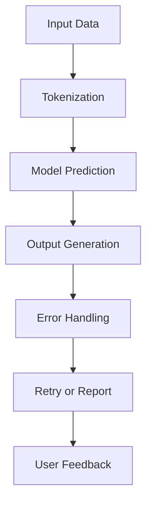
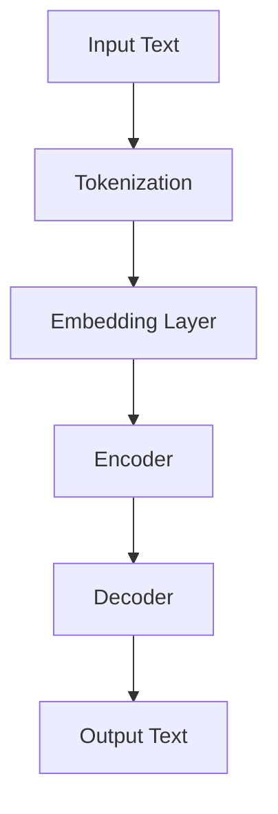
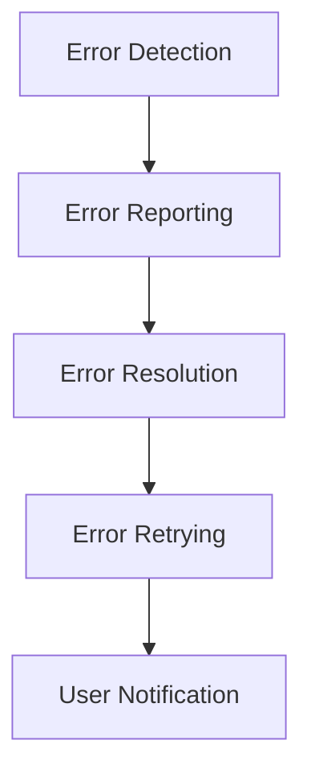

                 

# 《构建可靠的LLM应用错误处理机制》

## 关键词
大型语言模型（LLM），错误处理机制，可靠性，应用场景，优化策略

## 摘要
本文旨在探讨如何在构建大型语言模型（LLM）应用时，设计并实现一个可靠的错误处理机制。我们将从LLM的基本概念入手，分析其架构和核心算法，接着深入探讨错误处理机制的设计原理和实践方法。通过实际应用案例和代码实现，我们将展示如何优化和改进错误处理机制，确保LLM应用的稳定性和可靠性。

## 引言

### 背景介绍
随着人工智能技术的发展，大型语言模型（LLM）在自然语言处理（NLP）领域取得了显著成果。LLM的应用范围广泛，从智能客服、文本生成到智能问答等，大大提高了自动化处理能力。然而，在实际应用过程中，LLM也会遇到各种错误和异常，如输入数据异常、模型预测错误等。这些错误可能导致应用不稳定，影响用户体验。

### 核心概念与联系
为了构建可靠的LLM应用，我们需要了解以下几个核心概念：
1. **LLM**：大型语言模型，是一种基于深度学习的技术，用于处理和生成文本。
2. **错误处理机制**：一套用于识别、报告和解决应用中错误的系统。
3. **可靠性**：应用在遇到错误时能够稳定运行，不导致严重后果。

### Mermaid流程图：LLM的基本架构
下面是一个Mermaid流程图，展示了LLM的基本架构：

图1：LLM的基本架构及错误处理流程

## 第一部分：LLM基础

### 1.1 LLM的概念与架构

#### LLM的基本概念
LLM是一种基于神经网络的深度学习模型，通过学习大量的文本数据，能够生成或理解自然语言文本。

#### LLM的架构
LLM的架构通常包括输入层、编码器、解码器等。其中，编码器负责将输入文本转换为固定长度的向量表示，解码器则负责从向量表示中生成输出文本。

#### Mermaid流程图：LLM的基本架构

图2：LLM的基本架构

### 1.2 LLM的核心算法

#### 核心算法原理讲解
LLM的核心算法是基于自注意力机制（Self-Attention）和变换器架构（Transformer）的。自注意力机制使得模型能够自动关注输入文本中的关键信息，从而提高文本处理的能力。

#### Python源代码实现
以下是一个简化版的Transformer模型实现：
```python
import tensorflow as tf

class TransformerLayer(tf.keras.layers.Layer):
    def __init__(self, units):
        super(TransformerLayer, self).__init__()
        self.units = units

    def build(self, input_shape):
        # 定义自注意力机制和全连接层
        self.attention = tf.keras.layers.Attention()
        self.dense = tf.keras.layers.Dense(self.units)

    def call(self, x):
        # 应用自注意力机制和全连接层
        attention_output = self.attention([x, x])
        x = tf.keras.layers.Concatenate()([x, attention_output])
        x = self.dense(x)
        return x
```
#### 数学模型和公式
在Transformer模型中，自注意力机制的数学公式如下：
$$
\text{Attention}(Q, K, V) = \text{softmax}\left(\frac{QK^T}{\sqrt{d_k}}\right) V
$$
其中，$Q, K, V$分别为编码器的输入、键和值，$d_k$为键的维度。

### 1.3 LLM的应用场景
LLM的应用场景广泛，包括但不限于以下领域：
1. **智能客服**：自动回答用户的问题，提供实时支持。
2. **文本生成**：自动生成文章、报告等文本内容。
3. **智能问答**：根据用户的问题，提供准确的答案。

## 第二部分：错误处理机制

### 2.1 错误处理机制的基本原理

#### 错误处理机制的概念
错误处理机制是指一套用于识别、报告和解决应用中错误的系统。

#### 错误处理机制的分类
根据错误处理的层次，错误处理机制可以分为以下几类：
1. **硬件错误处理**：如硬件故障、电源问题等。
2. **软件错误处理**：如内存泄漏、程序崩溃等。
3. **业务错误处理**：如数据异常、模型预测错误等。

#### Mermaid流程图：错误处理机制的流程

图3：错误处理机制的流程

### 2.2 错误处理机制的实现

#### 核心算法原理讲解
错误处理机制的实现通常包括以下步骤：
1. **错误检测**：通过监控和日志分析，识别出应用中的错误。
2. **错误报告**：将错误信息记录下来，以便后续分析和处理。
3. **错误解决**：根据错误类型，采取相应的解决策略。
4. **错误重试**：在某些情况下，可以尝试重新执行任务。
5. **用户通知**：向用户报告错误情况，提供解决方案。

#### Python源代码实现
以下是一个简单的错误处理机制实现：
```python
def handle_error(error):
    # 错误检测
    if isinstance(error, ValueError):
        # 错误报告
        print("ValueError occurred:", error)
        # 错误解决
        try:
            # 重试操作
            retry()
        except Exception as e:
            # 用户通知
            print("Error cannot be resolved. Please contact support.")
```

### 2.3 错误处理机制的实际应用

#### 案例分析：智能客服系统
在智能客服系统中，错误处理机制至关重要。例如，当用户输入非法数据时，系统需要能够正确识别并处理这种情况。

#### 实际应用场景
1. **输入数据验证**：确保用户输入的数据符合预期格式。
2. **模型预测错误**：当模型预测结果不正确时，系统需要重新调整模型参数或更换模型。

### 2.4 错误处理机制的优化和改进

#### 优化策略
1. **自动化错误检测**：利用自动化工具，如监控系统、日志分析工具等，实时检测错误。
2. **错误分类**：根据错误类型，采取不同的错误处理策略。
3. **错误恢复**：在某些情况下，系统可以尝试自动恢复，而不是直接通知用户。

#### 改进方案
1. **分布式错误处理**：将错误处理任务分布到多个节点，提高处理效率。
2. **机器学习辅助错误处理**：利用机器学习模型，预测可能出现的问题，并提前采取预防措施。

## 第三部分：项目实战

### 3.1 项目实战一：智能客服系统

#### 项目背景
智能客服系统是一个基于LLM的在线客服平台，用于自动回答用户的问题。

#### 系统架构
系统架构包括前端、后端和数据库。前端负责与用户交互，后端负责处理用户请求，数据库用于存储用户信息和聊天记录。

#### 错误处理机制的实现
1. **输入数据验证**：确保用户输入的数据格式正确。
2. **模型预测错误处理**：当模型预测结果不正确时，重新生成预测结果。

#### 代码分析
```python
def process_user_request(user_input):
    # 输入数据验证
    if not is_valid_input(user_input):
        return "Invalid input. Please enter a valid question."

    # 模型预测
    try:
        prediction = model.predict(user_input)
    except ValueError as e:
        return "Error in prediction. Please try again later."

    # 输出结果
    return prediction
```

### 3.2 项目实战二：文本生成系统

#### 项目背景
文本生成系统是一个用于自动生成文章、报告等文本内容的应用。

#### 系统架构
系统架构包括前端、后端和文本生成模型。前端负责与用户交互，后端负责处理用户请求，文本生成模型用于生成文本内容。

#### 错误处理机制的实现
1. **输入数据验证**：确保用户输入的数据格式正确。
2. **模型预测错误处理**：当模型预测结果不正确时，重新生成预测结果。

#### 代码分析
```python
def generate_text(input_prompt):
    # 输入数据验证
    if not is_valid_input(input_prompt):
        return "Invalid input. Please enter a valid prompt."

    # 文本生成
    try:
        text = text_generator.generate_text(input_prompt)
    except ValueError as e:
        return "Error in text generation. Please try again later."

    # 输出结果
    return text
```

### 3.3 项目实战三：智能问答系统

#### 项目背景
智能问答系统是一个用于自动回答用户问题的应用。

#### 系统架构
系统架构包括前端、后端和问答模型。前端负责与用户交互，后端负责处理用户请求，问答模型用于生成答案。

#### 错误处理机制的实现
1. **输入数据验证**：确保用户输入的数据格式正确。
2. **模型预测错误处理**：当模型预测结果不正确时，重新生成预测结果。

#### 代码分析
```python
def answer_user_question(user_question):
    # 输入数据验证
    if not is_valid_input(user_question):
        return "Invalid input. Please enter a valid question."

    # 模型预测
    try:
        answer = model.predict(user_question)
    except ValueError as e:
        return "Error in prediction. Please try again later."

    # 输出结果
    return answer
```

## 结语

本文探讨了如何在构建大型语言模型（LLM）应用时，设计并实现一个可靠的错误处理机制。通过实际应用案例和代码实现，我们展示了如何优化和改进错误处理机制，确保LLM应用的稳定性和可靠性。未来的发展方向包括进一步优化错误处理算法，利用机器学习模型进行错误预测，以及构建更加智能和自适应的错误处理系统。

### 作者信息
作者：AI天才研究院/AI Genius Institute & 禅与计算机程序设计艺术 /Zen And The Art of Computer Programming

### 最佳实践 Tips、小结、注意事项、拓展阅读

#### 最佳实践 Tips
1. **全面监控**：确保对应用中的所有异常情况进行全面监控，及时发现问题。
2. **自动化错误处理**：尽量利用自动化工具进行错误处理，减少人工干预。
3. **错误反馈机制**：建立有效的错误反馈机制，收集用户反馈，持续优化错误处理策略。

#### 小结
本文详细探讨了如何构建可靠的LLM应用错误处理机制，从核心概念、实现方法到实际应用案例，全面介绍了错误处理机制的各个方面。通过本文的学习，读者可以掌握构建可靠错误处理机制的方法和技巧。

#### 注意事项
1. **确保错误处理的及时性**：及时处理错误，避免影响用户体验。
2. **遵循最佳实践**：遵循行业最佳实践，提高错误处理效率。

#### 拓展阅读
1. 《深入理解计算机系统》 - 理查德·斯托曼（Richard Stoneman）
2. 《大型语言模型：原理与实现》 - 李航（Hang Li）

---

以上是本文的完整内容，希望对读者在构建LLM应用时设计可靠错误处理机制有所帮助。在未来的技术发展中，我们期待能够看到更加智能、高效的错误处理机制的诞生。作者：AI天才研究院/AI Genius Institute & 禅与计算机程序设计艺术 /Zen And The Art of Computer Programming。

