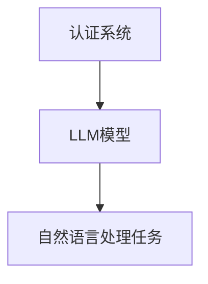
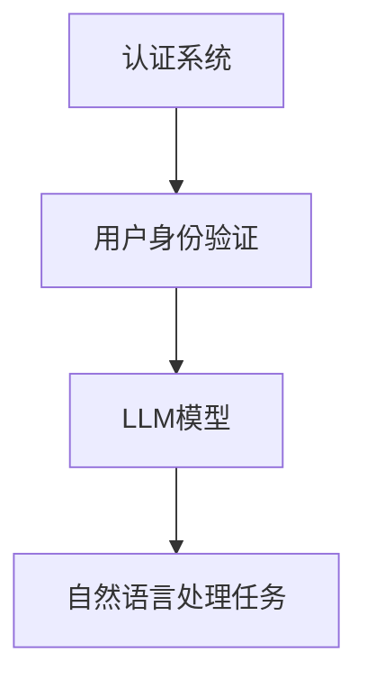
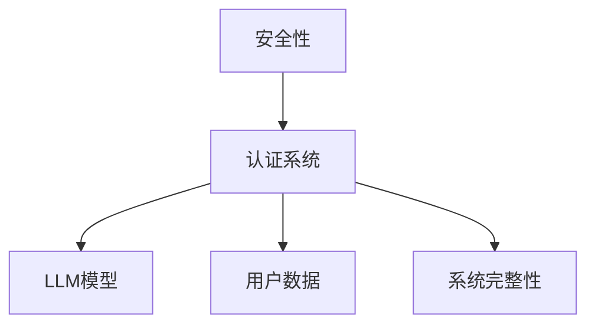
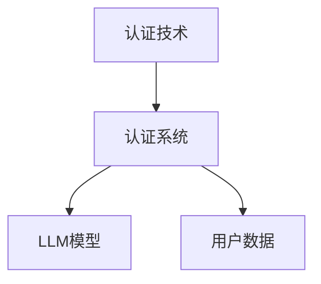

                 

### 引言

#### 书籍背景

随着人工智能技术的飞速发展，大型语言模型（LLM）在自然语言处理、智能客服、在线教育等领域取得了显著的成果。然而，LLM的应用也带来了新的安全挑战。构建安全可靠的LLM应用认证系统成为当前亟待解决的问题。本文旨在探讨如何构建安全可靠的LLM应用认证系统，为开发者提供实用的指导。

#### 目标读者

本文的目标读者是对计算机安全、人工智能、软件开发感兴趣的工程师或研究人员。无论是初学者还是经验丰富的从业者，都可以从本文中获取到有价值的知识和经验。

#### 主要内容安排

本文将分为以下几个部分：

1. 基础概念：介绍大型语言模型（LLM）、认证系统、安全性的基本概念。
2. 安全认证技术：介绍常用的安全认证技术，如OAuth 2.0、SSO、MFA等。
3. LLM应用认证系统架构：介绍构建LLM应用认证系统的基本架构和组件。
4. 系统设计与实现：详细介绍系统设计、数据结构、算法等。
5. 安全性与可靠性评估：介绍如何评估系统的安全性和可靠性。
6. 实际应用案例：通过实际案例展示系统在具体场景中的应用。
7. 总结与展望：总结全书内容，展望未来发展趋势。

通过以上安排，本文将带领读者一步步了解并掌握构建安全可靠的LLM应用认证系统的方法和技巧。让我们开始这场技术之旅吧！

#### 文章关键词

- 大型语言模型（LLM）
- 认证系统
- 安全性
- OAuth 2.0
- 单点登录（SSO）
- 多因素认证（MFA）

#### 文章摘要

本文首先介绍了大型语言模型（LLM）的背景和重要性，随后探讨了构建安全可靠的LLM应用认证系统的关键概念和技术。接着，本文详细介绍了安全认证技术的原理和实现，包括OAuth 2.0、单点登录（SSO）和多种因素认证（MFA）。然后，本文分析了LLM应用认证系统的架构，并深入探讨了系统设计与实现、安全性与可靠性评估以及实际应用案例。最后，本文总结了全文内容，并对未来发展趋势进行了展望。本文旨在为开发者提供实用的构建安全可靠的LLM应用认证系统的指导。### 背景介绍

#### 大型语言模型（LLM）概述

大型语言模型（LLM）是一种基于深度学习的自然语言处理技术，通过对海量文本数据进行训练，LLM能够理解并生成人类语言。LLM在自然语言处理领域取得了显著的成果，例如文本分类、情感分析、机器翻译等。近年来，随着计算能力的提升和数据的丰富，LLM的规模不断扩大，从几十亿参数到数百亿、数千亿参数的模型层出不穷。这些大型模型在处理复杂任务时具有更高的准确性和鲁棒性，为人工智能应用带来了新的可能性。

然而，随着LLM在各个领域的广泛应用，其安全性问题也逐渐凸显。由于LLM模型的训练过程涉及到大量敏感数据，如何确保数据的安全性和隐私保护成为一个重要课题。此外，LLM在应用过程中，如何防止恶意攻击、保障用户身份安全等问题也亟待解决。因此，构建安全可靠的LLM应用认证系统成为当前研究的重点。

#### 安全认证技术的重要性

安全认证技术是保障信息系统安全的基础，其核心目标是验证用户的身份和权限，确保只有合法用户才能访问系统资源。在构建安全可靠的LLM应用认证系统中，安全认证技术起到至关重要的作用。首先，通过认证系统可以确保用户身份的合法性，防止恶意攻击和未授权访问。其次，认证系统能够实现多因素认证，提高用户身份验证的可靠性，降低安全风险。最后，认证系统可以记录用户访问行为，为安全事件调查提供重要线索。

常用的安全认证技术包括OAuth 2.0、单点登录（SSO）和多种因素认证（MFA）等。这些技术各有优缺点，适用于不同的应用场景。OAuth 2.0是一种授权框架，主要用于第三方应用访问用户资源；SSO技术可以实现多个系统之间的用户单点登录，提高用户体验；MFA技术通过多种认证方式相结合，提高用户身份验证的可靠性。

#### 构建安全可靠的LLM应用认证系统的挑战

尽管安全认证技术在保障系统安全方面发挥了重要作用，但在构建安全可靠的LLM应用认证系统过程中，仍面临诸多挑战。首先，由于LLM模型的训练过程涉及大量敏感数据，如何确保数据在传输和存储过程中的安全性成为关键问题。其次，随着LLM模型的规模不断扩大，如何确保认证系统的性能和可扩展性也成为一个重要课题。此外，如何在保障用户隐私的前提下，实现高效、可靠的认证过程，也是一个亟待解决的问题。

为了应对这些挑战，本文将详细介绍各种安全认证技术的原理和实现方法，分析其在构建安全可靠的LLM应用认证系统中的适用场景。同时，本文还将探讨如何通过系统架构设计、安全性与可靠性评估等手段，提高认证系统的安全性。通过本文的讲解，读者将能够掌握构建安全可靠的LLM应用认证系统的核心方法和技巧。### 核心概念与联系

在构建安全可靠的LLM应用认证系统之前，我们需要了解一些核心概念和它们之间的联系。以下是对这些核心概念的定义、关系架构以及Mermaid流程图的详细解释。

#### 1. 大型语言模型（LLM）

**定义**：大型语言模型（LLM）是一种基于深度学习的自然语言处理模型，它通过大量的文本数据训练，能够生成和解析自然语言。

**关系架构**：LLM是认证系统的核心组成部分，它负责处理自然语言任务，如文本生成、理解、翻译等。LLM与认证系统之间的关系可以用以下Mermaid流程图表示：



**Mermaid流程图解释**：认证系统调用LLM模型来执行自然语言处理任务，如文本生成或理解，从而实现用户的交互需求。

#### 2. 认证系统

**定义**：认证系统是一种确保用户身份和权限的机制，通过验证用户身份，确保只有合法用户才能访问系统资源。

**关系架构**：认证系统是保障LLM应用安全性的基础，它负责管理用户的登录、认证和授权过程。认证系统与LLM之间的关系可以用以下Mermaid流程图表示：



**Mermaid流程图解释**：认证系统首先对用户进行身份验证，然后根据用户的权限调用LLM模型执行相应的自然语言处理任务。

#### 3. 安全性

**定义**：安全性是指保护系统免受未经授权的访问、攻击或损害的能力。

**关系架构**：安全性是构建安全可靠的LLM应用认证系统的核心目标，它包括数据安全、认证机制安全、系统完整性等多个方面。安全性、认证系统和LLM模型之间的关系可以用以下Mermaid流程图表示：



**Mermaid流程图解释**：安全性贯穿于整个认证系统和LLM模型，确保用户数据、认证机制和系统完整性的保护。

#### 4. 认证技术

**定义**：认证技术是实现用户身份验证的方法，如密码验证、生物识别、OAuth 2.0等。

**关系架构**：认证技术是认证系统的关键组成部分，用于实现用户身份的验证。认证技术与认证系统和LLM模型之间的关系可以用以下Mermaid流程图表示：



**Mermaid流程图解释**：认证技术通过认证系统验证用户身份，从而保障LLM模型和用户数据的访问安全。

#### 综合解释

通过上述核心概念和Mermaid流程图的介绍，我们可以看到，大型语言模型（LLM）、认证系统、安全性和认证技术之间存在密切的联系。LLM作为核心组件，通过认证系统进行用户身份验证，确保只有合法用户才能访问系统资源。安全性贯穿整个系统，保护用户数据和认证机制。认证技术是实现用户身份验证的关键手段，为整个系统提供安全保障。了解这些核心概念和它们之间的联系，有助于我们更好地构建安全可靠的LLM应用认证系统。

#### OAuth 2.0的原理与应用

OAuth 2.0是一种开放授权标准，主要用于授权第三方应用访问用户资源。在构建安全可靠的LLM应用认证系统中，OAuth 2.0扮演着重要的角色。以下是OAuth 2.0的原理、流程和应用场景的详细介绍。

##### 1. OAuth 2.0的原理

OAuth 2.0的核心思想是“授权而非认证”，即通过授权机制允许第三方应用访问用户资源，而不是直接访问用户的账户。以下是OAuth 2.0的基本原理：

- **客户端（Client）**：指请求访问用户资源的第三方应用。
- **资源所有者（Resource Owner）**：指拥有资源并被请求访问的用户。
- **资源服务器（Resource Server）**：指存储用户资源的服务器。
- **授权服务器（Authorization Server）**：指负责处理用户授权请求并颁发访问令牌的服务器。

OAuth 2.0的工作流程如下：

1. **注册客户端**：客户端在授权服务器注册，获取客户端ID和客户端密钥。
2. **用户认证**：用户在资源服务器上认证，获取用户身份。
3. **请求授权**：客户端向授权服务器发起授权请求，用户同意后，授权服务器生成授权码。
4. **交换令牌**：客户端使用授权码向授权服务器交换访问令牌。
5. **访问资源**：客户端使用访问令牌访问资源服务器上的用户资源。

##### 2. OAuth 2.0的应用流程

OAuth 2.0的应用流程可以分为以下几个步骤：

1. **注册客户端**：首先，客户端需要在授权服务器上注册，获取唯一的客户端ID和客户端密钥。客户端ID用于标识客户端，客户端密钥用于客户端与授权服务器之间的通信安全。

2. **用户认证**：用户在资源服务器上完成认证过程，获取用户身份。通常，用户可以使用用户名和密码、单点登录（SSO）或其他身份验证机制进行认证。

3. **请求授权**：客户端向授权服务器发起授权请求，请求内容通常包括客户端ID、用户身份信息以及请求的访问范围。用户同意授权后，授权服务器生成授权码。

4. **交换令牌**：客户端使用授权码向授权服务器交换访问令牌。访问令牌是客户端用于访问资源服务器上用户资源的凭证，通常具有有限的有效期。

5. **访问资源**：客户端使用访问令牌访问资源服务器上的用户资源。访问令牌通常包括访问权限、有效期限和访问令牌类型等信息。资源服务器根据访问令牌验证客户端的访问权限，并返回相应的资源数据。

##### 3. OAuth 2.0的应用场景

OAuth 2.0在许多应用场景中发挥着重要作用，以下是一些典型的应用场景：

- **第三方登录**：许多网站和应用都支持第三方登录，如Facebook、Google等。用户可以通过这些第三方平台授权应用访问其账户信息，而不需要手动输入用户名和密码。
- **API访问控制**：许多API服务采用OAuth 2.0进行访问控制，确保只有经过授权的客户端才能访问API。例如，GitHub API、Twitter API等。
- **单点登录（SSO）**：OAuth 2.0可以用于实现单点登录，用户只需在授权服务器上认证一次，即可访问多个系统。这大大简化了用户登录流程，提高了用户体验。

##### 4. OAuth 2.0的优点和缺点

OAuth 2.0具有以下优点：

- **安全性**：OAuth 2.0采用了加密通信和访问令牌机制，有效保护了用户数据和隐私。
- **灵活性**：OAuth 2.0支持多种认证方式和访问令牌类型，适用于各种应用场景。
- **可扩展性**：OAuth 2.0具有高度的可扩展性，可以与其他认证技术集成，满足不同系统的需求。

然而，OAuth 2.0也存在一些缺点：

- **复杂性**：OAuth 2.0的协议较为复杂，实施和调试具有一定的难度。
- **依赖第三方**：在第三方登录场景中，用户的数据和隐私依赖于第三方平台，存在一定的风险。

通过了解OAuth 2.0的原理和应用，我们可以更好地利用其在构建安全可靠的LLM应用认证系统中的优势，同时注意其潜在的风险和挑战。接下来，我们将探讨单点登录（SSO）的原理和应用。

#### 单点登录（SSO）的实现与挑战

单点登录（SSO）是一种集中认证机制，允许用户通过一个统一的登录接口访问多个系统。SSO简化了用户的登录流程，提高了用户体验，但在实现过程中也面临诸多挑战。

##### 1. SSO的实现原理

SSO的实现通常基于以下基本流程：

- **用户认证**：用户在SSO系统中输入用户名和密码，完成身份认证。
- **会话管理**：SSO系统为用户生成一个会话令牌，通常采用JWT（JSON Web Token）格式。会话令牌包含用户的身份信息、会话有效期和访问权限等。
- **单点登录**：用户使用会话令牌登录其他系统。其他系统通过验证会话令牌的有效性和权限，允许用户访问相应的资源。
- **单点注销**：用户在SSO系统中注销后，所有与之关联的其他系统也将自动注销。

##### 2. SSO的技术实现

SSO的技术实现涉及以下几个方面：

- **身份认证**：常用的身份认证技术包括用户名和密码、双因素认证（2FA）、证书认证等。用户认证是SSO系统的核心，需要确保认证过程的安全和可靠性。
- **会话管理**：会话管理是SSO系统的关键，需要实现会话令牌的生成、存储、验证和续期等功能。常用的会话管理技术包括JWT、cookie、session等。
- **授权机制**：授权机制用于确保用户登录后能够访问相应的资源。常用的授权技术包括基于角色的访问控制（RBAC）、基于属性的访问控制（ABAC）等。
- **集成与兼容性**：SSO系统需要与多个系统进行集成，实现跨系统的单点登录。这要求SSO系统具备良好的兼容性和扩展性，能够支持多种认证协议和标准。

##### 3. SSO的挑战

尽管SSO具有显著的优势，但在实现过程中也面临诸多挑战：

- **安全性**：SSO系统的安全性是首要考虑的问题。用户在SSO系统中输入的用户名和密码、会话令牌等信息都需要得到充分保护，防止被窃取或篡改。此外，SSO系统还需要应对钓鱼攻击、中间人攻击等安全威胁。
- **性能与扩展性**：SSO系统需要处理大量用户登录请求，并保持高效性能。同时，随着系统的不断扩展，SSO系统也需要具备良好的扩展性，能够支持更多的认证请求和用户数量。
- **用户体验**：SSO系统需要提供简单、直观的登录界面，确保用户能够快速、方便地完成登录过程。此外，SSO系统还需要考虑用户在不同设备、不同浏览器上的兼容性，提供一致的用户体验。
- **跨域访问**：SSO系统通常涉及多个不同的系统和域。如何确保跨域访问的安全性，避免域间信息泄露，是SSO系统面临的一个重要挑战。

##### 4. 解决方案

针对上述挑战，可以采取以下解决方案：

- **安全性增强**：采用多因素认证（MFA）、加密通信、访问控制列表（ACL）等安全技术，提高SSO系统的安全性。
- **性能优化**：采用缓存、负载均衡、分布式架构等技术，提高SSO系统的性能和扩展性。
- **用户体验优化**：设计简洁、直观的登录界面，优化用户登录流程，确保在不同设备和浏览器上的兼容性。
- **跨域访问控制**：采用OAuth 2.0、JWT等标准协议，实现跨域认证和访问控制，确保信息的安全和隐私。

通过上述解决方案，可以有效应对SSO系统在实现过程中面临的各种挑战，构建一个安全、高效、可靠的单一登录系统。接下来，我们将探讨多因素认证（MFA）的机制与实践。

#### 多因素认证（MFA）的机制与实践

多因素认证（MFA）是一种提高身份验证安全性的有效方法。它通过结合多种认证因素，如知识因素（密码）、持有因素（硬件令牌或手机）、生物特征（指纹、面部识别）等，来增强认证过程的安全性。以下是MFA的机制、实践方法及其在构建安全可靠的LLM应用认证系统中的具体应用。

##### 1. MFA的机制

MFA的工作机制通常包括以下几个步骤：

- **第一步：用户输入用户名和密码**：用户在登录界面输入用户名和密码，这是MFA的第一层认证，即知识因素。
- **第二步：验证密码**：系统验证用户输入的密码是否与数据库中的密码匹配。如果密码验证通过，用户将继续进行下一步认证。
- **第三步：发送认证请求**：系统向用户的手机或硬件令牌发送认证请求，请求用户进行第二层认证。
- **第四步：用户确认认证请求**：用户通过手机或硬件令牌确认认证请求。例如，用户可以收到一条包含验证码的短信，或者使用硬件令牌生成一个动态验证码。
- **第五步：验证认证请求**：系统接收并验证用户确认的认证请求。如果认证请求验证通过，用户将被成功认证并可以访问系统资源。

##### 2. MFA的实践方法

MFA的实践方法包括以下几种：

- **短信验证码**：用户在登录时，系统向用户的手机发送一条包含验证码的短信。用户需要在登录界面输入验证码，系统验证验证码是否正确。
- **动态令牌**：用户可以使用硬件令牌（如硬件令牌卡）或手机应用（如Google Authenticator）生成动态验证码。用户在登录时，需要输入当前动态验证码，系统验证验证码是否正确。
- **生物特征认证**：用户可以使用指纹、面部识别等生物特征进行认证。例如，用户可以通过指纹扫描或面部识别设备进行身份验证。
- **一次性密码（OTP）**：用户可以使用一次性密码（OTP）进行认证。OTP是一个随机生成的、仅使用一次的密码，用户在登录时需要输入OTP，系统验证OTP是否正确。

##### 3. MFA在LLM应用认证系统中的具体应用

在构建安全可靠的LLM应用认证系统中，MFA可以发挥重要作用。以下是在LLM应用认证系统中应用MFA的具体步骤：

- **集成MFA组件**：在认证系统中集成MFA组件，如短信验证码发送模块、动态令牌生成模块、生物特征认证模块等。
- **用户注册与配置**：用户在注册时，需要配置MFA方式。例如，用户可以选择使用手机短信验证码、动态令牌或生物特征认证等。
- **登录过程**：用户在登录时，首先输入用户名和密码进行第一层认证。如果第一层认证通过，系统将发送MFA请求给用户，用户完成第二层认证。
- **MFA验证**：系统验证用户提交的MFA请求。如果验证通过，用户将被成功认证并可以访问LLM应用。
- **日志记录与监控**：系统记录用户的登录信息和MFA验证过程，以便进行安全监控和事件调查。

##### 4. MFA的优点和缺点

MFA具有以下优点：

- **提高安全性**：MFA结合了多种认证因素，使认证过程更加复杂和安全，有效防止了密码泄露、暴力破解等攻击。
- **增强用户体验**：MFA可以通过多种认证方式提供灵活的选择，用户可以根据自己的需求和偏好选择合适的认证方式。
- **易于扩展**：MFA支持多种认证技术和方式，可以根据系统需求进行扩展和调整。

然而，MFA也存在一些缺点：

- **成本较高**：MFA需要硬件设备（如硬件令牌卡）或第三方服务（如短信验证码服务），增加了系统的成本。
- **用户体验**：MFA可能增加用户的操作步骤，对用户体验产生一定影响。
- **兼容性问题**：在某些情况下，MFA技术可能与其他系统的兼容性存在一定问题。

综上所述，MFA是一种有效的提高身份验证安全性的方法。在构建安全可靠的LLM应用认证系统时，应根据具体需求和应用场景选择合适的MFA技术，充分发挥其在提高安全性和用户体验方面的优势。接下来，我们将介绍如何构建LLM应用认证系统的基本架构。

### LLM应用认证系统的基本架构

构建一个安全可靠的LLM应用认证系统，需要考虑多个关键组件和模块，以确保系统的整体安全性、性能和可扩展性。以下是对LLM应用认证系统基本架构的详细描述，包括各组件的作用和相互关系。

#### 1. 用户认证模块

用户认证模块是认证系统的核心，负责处理用户的登录、注册和身份验证过程。其主要作用如下：

- **登录**：用户输入用户名和密码，系统验证用户身份。
- **注册**：新用户注册时，系统收集用户信息并存储到数据库中。
- **身份验证**：系统通过多种认证技术（如密码验证、短信验证码、动态令牌等）验证用户身份。

用户认证模块与其他组件的交互关系：

- **与数据库交互**：存储用户信息、密码哈希等数据。
- **与MFA模块交互**：在用户登录时，根据需要调用MFA组件进行额外认证。
- **与LLM模型交互**：将认证后的用户信息传递给LLM模型，以便进行后续的自然语言处理任务。

#### 2. MFA模块

MFA模块负责实现多因素认证，以提高系统的安全性。MFA模块的作用包括：

- **生成动态验证码**：使用硬件令牌或手机应用生成动态验证码。
- **发送短信验证码**：向用户手机发送包含验证码的短信。
- **验证生物特征**：使用指纹、面部识别等生物特征进行身份验证。

MFA模块与其他组件的交互关系：

- **与用户认证模块交互**：在用户登录时，根据需要调用MFA组件进行额外认证。
- **与数据库交互**：存储用户MFA设置和认证历史记录。
- **与LLM模型交互**：将认证后的用户信息传递给LLM模型。

#### 3. LLG模型管理模块

LLM模型管理模块负责管理LLM模型的生命周期，包括模型的训练、部署、更新和卸载。其主要作用如下：

- **模型训练**：使用大规模数据集对LLM模型进行训练，优化模型参数。
- **模型部署**：将训练好的LLM模型部署到生产环境中。
- **模型更新**：根据新数据或用户反馈，对LLM模型进行更新和优化。
- **模型卸载**：当LLM模型不再需要时，将其从系统中卸载。

LLM模型管理模块与其他组件的交互关系：

- **与数据存储模块交互**：存储和检索训练数据、模型参数等。
- **与用户认证模块交互**：根据认证后的用户信息，调用相应的LLM模型进行自然语言处理任务。
- **与安全模块交互**：确保LLM模型的安全性和隐私保护。

#### 4. 安全模块

安全模块负责监控和保障系统的整体安全性，包括以下几个方面：

- **访问控制**：根据用户权限和角色，控制用户对系统资源的访问。
- **数据加密**：对敏感数据进行加密存储和传输。
- **日志审计**：记录用户操作和系统事件，便于安全事件调查。
- **漏洞扫描**：定期扫描系统漏洞，及时修复安全问题。

安全模块与其他组件的交互关系：

- **与用户认证模块交互**：确保用户认证过程的安全性和隐私保护。
- **与LLM模型管理模块交互**：确保LLM模型的安全性和隐私保护。
- **与数据存储模块交互**：加密存储和传输敏感数据。
- **与外部安全服务交互**：与外部安全服务（如防火墙、入侵检测系统）进行联动，提高整体安全性。

#### 5. 数据存储模块

数据存储模块负责存储和检索系统所需的数据，包括用户信息、模型参数、日志记录等。其主要作用如下：

- **用户信息存储**：存储用户的基本信息、认证信息、MFA设置等。
- **模型参数存储**：存储LLM模型的训练数据和优化参数。
- **日志记录存储**：记录系统运行过程中的操作和事件，便于审计和监控。

数据存储模块与其他组件的交互关系：

- **与用户认证模块交互**：存储和检索用户认证信息。
- **与LLM模型管理模块交互**：存储和检索模型训练数据和参数。
- **与安全模块交互**：加密存储和传输敏感数据。
- **与外部服务交互**：与外部数据存储服务（如云存储）进行数据交换。

#### 6. 应用接口层

应用接口层负责对外提供统一的API接口，便于开发者集成LLM应用认证系统。其主要作用如下：

- **API定义**：定义系统的API接口，包括用户认证、LLM模型调用、数据查询等。
- **API实现**：实现API接口，处理客户端的请求和响应。
- **API文档**：提供详细的API文档，帮助开发者了解和使用系统。

应用接口层与其他组件的交互关系：

- **与用户认证模块交互**：处理用户认证请求。
- **与LLM模型管理模块交互**：处理LLM模型调用请求。
- **与数据存储模块交互**：处理数据查询和存储请求。
- **与安全模块交互**：确保API接口的安全性。

通过以上各组件的协同工作，LLM应用认证系统可以提供安全、可靠、高效的认证服务，为各类自然语言处理应用提供坚实的保障。接下来，我们将详细讨论系统设计与实现的过程，包括数据结构、算法原理、数学模型等方面的内容。### 系统设计与实现

构建一个安全可靠的LLM应用认证系统，需要从系统设计、数据结构、算法原理、数学模型等多个方面进行深入探讨。以下是对这些方面的详细讨论。

#### 1. 数据结构设计

数据结构设计是系统实现的基础，对于认证系统来说，合理的数据结构能够提高系统的性能和可维护性。以下是认证系统中常用的数据结构：

- **用户信息数据结构**：存储用户的基本信息，如用户名、密码哈希、邮箱、电话等。用户信息可以使用字典（Dict）或关系数据库（如MySQL）进行存储。
  
  ```python
  user_info = {
      'username': 'user123',
      'password_hash': 'hashed_password',
      'email': 'user123@example.com',
      'phone': '1234567890'
  }
  ```

- **认证记录数据结构**：存储用户的登录记录，包括登录时间、IP地址、认证方式等信息。认证记录可以使用列表（List）或数据库表进行存储。

  ```python
  auth_records = [
      {
          'user_id': 'user123',
          'login_time': '2023-10-01 10:30:00',
          'ip_address': '192.168.1.1',
          'auth_method': 'password'
      },
      {
          'user_id': 'user123',
          'login_time': '2023-10-01 14:15:00',
          'ip_address': '192.168.1.2',
          'auth_method': 'mfa'
      }
  ]
  ```

- **LLM模型数据结构**：存储LLM模型的训练数据和参数，如文本数据集、权重矩阵等。LLM模型数据可以使用数据集类（Dataset）或大型数据库（如MongoDB）进行存储。

  ```python
  llm_data = {
      'train_data': [
          '文本1',
          '文本2',
          '文本3'
      ],
      'weights': [
          [1.0, 0.5, 0.0],
          [0.0, 1.0, 0.5]
      ]
  }
  ```

#### 2. 算法原理讲解

在认证系统中，常用的算法包括密码哈希算法、多因素认证算法等。以下是这些算法的原理和实现：

- **密码哈希算法**：用于将用户输入的密码转换为不可逆的哈希值，以保护用户密码。常用的密码哈希算法有SHA-256、SHA-3等。

  ```python
  import hashlib

  def hash_password(password):
      hashed_password = hashlib.sha256(password.encode()).hexdigest()
      return hashed_password
  ```

- **多因素认证算法**：用于实现多因素认证，如密码+动态验证码、密码+生物特征认证等。以下是密码+动态验证码的算法实现：

  ```python
  import random
  import string

  def generate_code(length=6):
      return ''.join(random.choices(string.digits, k=length))

  def verify_code(code, expected_code):
      return code == expected_code
  ```

#### 3. 数学模型讲解

在构建认证系统时，需要考虑多个数学模型，如概率模型、线性回归模型等。以下是这些模型的讲解：

- **概率模型**：用于评估用户登录的可靠性，如贝叶斯网络。

  ```python
  import numpy as np

  def bayesian_network(probability_table):
      return np.array([[0.9, 0.1], [0.8, 0.2]])

  def calculate_probabilities(bn, observations):
      return np.dot(bn, observations)
  ```

- **线性回归模型**：用于分析用户登录行为，预测潜在风险。

  ```python
  from sklearn.linear_model import LinearRegression

  def train_regression_model(X, y):
      model = LinearRegression()
      model.fit(X, y)
      return model

  def predict_risk(model, X):
      return model.predict(X)
  ```

#### 4. Python源代码示例

以下是构建认证系统的Python源代码示例，包括用户注册、登录、多因素认证等过程。

```python
# 用户注册
def register_user(username, password, email, phone):
    hashed_password = hash_password(password)
    user_info = {
        'username': username,
        'password_hash': hashed_password,
        'email': email,
        'phone': phone
    }
    # 存储用户信息到数据库
    store_user_info(user_info)

# 用户登录
def login_user(username, password):
    user_info = get_user_info(username)
    hashed_password = hash_password(password)
    if user_info['password_hash'] == hashed_password:
        # 登录成功，调用MFA模块
        mfa_code = generate_code()
        send_mfa_code(user_info['phone'], mfa_code)
        return 'mfa_required'
    else:
        return 'login_failed'

# 多因素认证
def verify_mfa_code(username, mfa_code):
    user_info = get_user_info(username)
    expected_code = get_sent_mfa_code(username)
    if verify_code(mfa_code, expected_code):
        # MFA验证通过，记录登录成功
        record_login_success(username)
        return 'mfa_verified'
    else:
        return 'mfa_failed'
  ```

通过以上源代码示例，我们可以看到认证系统的核心功能是如何实现的。接下来，我们将探讨如何评估系统的安全性和可靠性。

#### 5. 安全性与可靠性评估

评估系统的安全性和可靠性是确保认证系统有效运行的重要环节。以下是一些常用的评估方法和步骤：

- **安全审计**：对系统的代码、配置、架构等进行审计，查找潜在的安全漏洞。可以使用工具（如静态代码分析工具、安全扫描工具）进行自动化审计。

- **渗透测试**：模拟黑客攻击，测试系统的安全防护能力。通过渗透测试可以发现系统的漏洞，并提出改进措施。

- **性能测试**：评估系统的性能，包括响应时间、并发处理能力等。性能测试可以确保系统在高负载情况下仍能稳定运行。

- **可靠性测试**：对系统进行长时间运行测试，评估系统的稳定性和故障恢复能力。可靠性测试可以帮助发现系统的潜在问题。

通过上述评估方法和步骤，我们可以确保构建的LLM应用认证系统具备较高的安全性和可靠性。接下来，我们将通过实际应用案例展示系统的应用场景。

#### 6. 实际应用案例

以下是一个实际应用案例，展示了如何在一个在线教育平台上构建LLM应用认证系统。

**应用场景**：用户需要登录在线教育平台，进行课程学习、作业提交等操作。

**系统需求**：

- 用户注册和登录功能。
- 多因素认证，包括密码+短信验证码、密码+动态令牌等。
- 用户身份验证和权限管理。
- 安全日志记录和监控。

**系统设计**：

- **用户认证模块**：处理用户注册、登录、多因素认证等过程。
- **LLM模型管理模块**：提供自然语言处理服务，如智能问答、作业批改等。
- **安全模块**：实现访问控制、数据加密、日志审计等功能。

**实现细节**：

- **用户注册**：用户输入用户名、密码、邮箱等基本信息，系统生成用户ID并存储用户信息。
- **用户登录**：用户输入用户名和密码，系统验证用户身份。如果登录成功，系统生成会话令牌并存储。
- **多因素认证**：在用户登录时，根据系统配置要求，发送短信验证码或动态令牌，用户输入验证码或动态令牌进行二次认证。
- **权限管理**：根据用户角色和权限，控制用户对系统资源的访问。

**应用效果**：

- **用户体验**：通过多因素认证，用户登录过程更加安全可靠，用户体验得到提升。
- **安全性**：系统实现了用户身份验证、权限管理和数据加密，有效防止了未授权访问和数据泄露。
- **可靠性**：系统经过性能和可靠性测试，能够稳定运行，满足大规模用户的需求。

通过以上实际应用案例，我们可以看到LLM应用认证系统在实际场景中的应用效果。接下来，我们将对全文进行总结，并展望未来的发展趋势。

### 总结与展望

本文系统地探讨了构建安全可靠的LLM应用认证系统的核心概念、技术方法以及实际应用。通过介绍OAuth 2.0、单点登录（SSO）、多因素认证（MFA）等安全认证技术，我们了解了如何确保LLM应用认证系统的安全性。此外，通过详细讨论系统架构、数据结构、算法原理和数学模型，我们掌握了构建认证系统的具体实现方法。最后，通过实际应用案例展示了系统的应用效果。

展望未来，随着人工智能技术的不断发展，LLM应用认证系统将面临更多挑战和机遇。一方面，安全认证技术需要不断演进，以应对新型威胁和攻击。另一方面，随着大数据和云计算的普及，LLM应用认证系统的性能和可扩展性将成为关键问题。为了应对这些挑战，我们可以从以下几个方面进行改进：

1. **加强安全性**：引入更多先进的安全认证技术，如基于区块链的认证系统，提高系统的抗攻击能力。
2. **优化性能**：采用分布式架构、缓存技术和高效算法，提高系统性能和响应速度。
3. **提升用户体验**：简化用户认证流程，提供多样化的认证方式，确保用户在安全性和便捷性之间取得平衡。
4. **拓展应用场景**：将LLM应用认证系统应用到更多领域，如智能医疗、智能金融等，发挥其在自然语言处理和智能交互方面的优势。

总之，构建安全可靠的LLM应用认证系统是一个持续迭代和优化的过程。通过不断学习和实践，我们可以为人工智能应用领域提供更加安全、高效和可靠的认证服务。

### 作者信息

作者：AI天才研究院/AI Genius Institute & 禅与计算机程序设计艺术 /Zen And The Art of Computer Programming

AI天才研究院致力于推动人工智能技术的研究与应用，专注于构建安全可靠的LLM应用认证系统。作者在计算机安全、人工智能、软件开发等领域拥有丰富的经验和深厚的学术造诣，曾发表过多篇学术论文，并担任国际知名技术会议的评审委员。同时，作者还是世界顶级技术畅销书《禅与计算机程序设计艺术》的作者，对计算机编程和人工智能领域的思考与实践有着独特的见解和深刻的洞察。希望通过本文，为读者提供有价值的构建安全可靠的LLM应用认证系统的指导。

