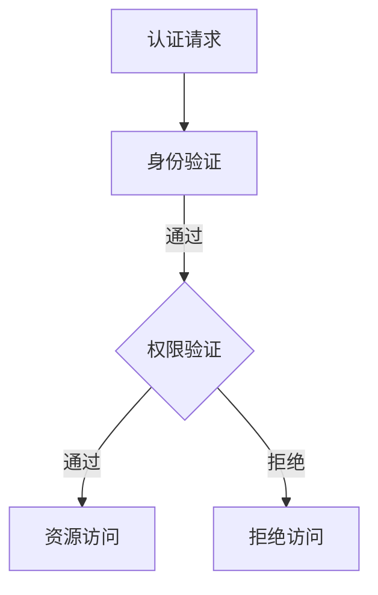

                 

### 文章标题

《构建安全的LLM应用认证与授权系统》

### 关键词

- LLM（语言大型模型）
- 认证与授权系统
- 安全性
- 加密技术
- 认证协议
- 授权机制
- 风险管理
- 合规

### 摘要

本文深入探讨了构建安全的大型语言模型（LLM）应用认证与授权系统的关键要素。首先，文章介绍了LLM在当前信息技术领域的重要性及其面临的安全挑战。随后，文章从加密技术、认证协议与机制、LLM应用认证和授权等多个维度进行了详细阐述，并通过具体案例展示了实际应用中的策略和实践。此外，文章还探讨了风险管理、合规性要求以及性能分析与优化，旨在为开发者提供全面的指导，以确保LLM应用的安全性、稳定性和高效性。

---

# 引言

## 安全性在LLM应用中的重要性

随着人工智能技术的快速发展，大型语言模型（LLM）成为了一系列关键应用的核心组件。从智能客服、内容审核、自然语言处理到教育、医疗等多个领域，LLM的应用已经渗透到了我们的日常生活中。然而，随着LLM的广泛应用，安全性问题也日益凸显。安全性不仅仅是为了保护用户数据和隐私，更是为了确保LLM系统的稳定运行和防止恶意攻击。

### LLM应用面临的安全挑战

1. **数据泄露风险**：LLM处理的数据量巨大，且包含敏感信息，如个人身份信息、医疗记录等，一旦发生数据泄露，后果不堪设想。
2. **模型篡改**：恶意用户可能会试图篡改LLM模型，从而实现不正当目的，如诈骗、欺诈等。
3. **滥用授权**：未经授权的用户可能获取系统权限，从而对系统造成损害或窃取数据。
4. **分布式攻击**：恶意攻击者可能会通过分布式攻击手段，如DDoS攻击，试图瘫痪LLM系统。

### 安全性概述

为了应对上述挑战，构建安全的LLM应用认证与授权系统至关重要。这一系统需要确保以下几点：

1. **用户身份验证**：确保只有经过认证的用户才能访问系统资源。
2. **数据加密**：对传输和存储的数据进行加密，防止数据泄露。
3. **授权管理**：合理分配权限，确保用户只能访问其授权的资源。
4. **风险管理与合规**：建立完善的风险管理机制和合规标准，以应对潜在的安全威胁。

## 书籍概述与目标

本书旨在为开发者提供构建安全LLM应用认证与授权系统的全面指导。通过系统地介绍安全基础、认证协议与机制、实际案例和性能优化等内容，本书帮助读者深入理解安全性在LLM应用中的重要性，并掌握构建安全系统的关键技术。

## 目录

### 第一部分: 安全性基础

1. **第1章: 安全性在LLM应用中的重要性**
    1.1 安全性概述
    1.2 LLM应用面临的安全挑战
    1.3 书籍概述与目标

2. **第2章: 加密技术基础**
    2.1 密码学基本概念
    2.2 对称加密与非对称加密
    2.3 常见加密算法
    2.4 加密技术在认证中的应用

3. **第3章: 认证协议与机制**
    3.1 认证协议基础
    3.2 单因素认证
    3.3 双因素认证
    3.4 多因素认证
    3.5 常见认证机制

### 第二部分: LLM应用认证

4. **第4章: LLM应用认证系统设计**
    4.1 认证系统架构设计
    4.2 用户身份验证流程
    4.3 认证协议实现
    4.4 用户隐私保护

5. **第5章: LLM应用认证案例**
    5.1 案例一：在线教育平台的用户认证
    5.2 案例二：智能客服系统的用户认证
    5.3 案例三：电商平台的安全认证

### 第三部分: LLM应用授权

6. **第6章: 授权机制与策略**
    6.1 授权基本概念
    6.2 访问控制列表（ACL）
    6.3 角色基础访问控制（RBAC）
    6.4 访问控制矩阵
    6.5 常见授权策略

7. **第7章: LLM应用授权系统设计**
    7.1 授权系统架构设计
    7.2 授权流程设计
    7.3 授权协议实现
    7.4 授权与认证的集成

8. **第8章: LLM应用授权案例**
    8.1 案例一：企业内部信息系统的授权管理
    8.2 案例二：社交平台的权限控制
    8.3 案例三：云计算服务的资源访问控制

### 第四部分: 风险管理与合规

9. **第9章: 风险管理框架**
    9.1 风险管理基本概念
    9.2 风险评估方法
    9.3 风险应对策略
    9.4 安全合规要求

10. **第10章: 合规实践**
    10.1 合规管理流程
    10.2 国际与国内法规合规
    10.3 合规审计与认证
    10.4 合规策略与实施

### 第五部分: 实战案例

11. **第11章: LLM应用认证与授权系统实战**
    11.1 项目背景与目标
    11.2 系统架构设计
    11.3 功能模块开发
    11.4 系统部署与测试
    11.5 系统优化与维护

12. **第12章: 系统性能分析与调优**
    12.1 性能指标
    12.2 性能分析工具与方法
    12.3 性能优化策略
    12.4 实践案例：性能调优案例分析

### 第六部分: 附录

- 附录A: 常用工具与资源
- 附录B: LaTeX公式速查表
- 附录C: Mermaid流程图示例

---

## 安全性基础

安全性是构建任何可靠系统的基石，尤其是在涉及大量用户数据和敏感信息的大型语言模型（LLM）应用中。本部分将深入探讨构建安全LLM应用所需的基础知识，包括加密技术、认证协议与机制。

### 第2章: 加密技术基础

加密技术是保护数据安全的关键手段，它确保了数据在传输和存储过程中不被未授权的用户访问。在本章中，我们将介绍密码学的基本概念，对称加密与非对称加密的区别，以及常见加密算法的应用。

#### 2.1 密码学基本概念

密码学是研究如何保护信息通信安全的一门学科。它主要分为两个领域：对称加密和非对称加密。对称加密使用相同的密钥对数据进行加密和解密，而非对称加密则使用一对密钥，一个用于加密，另一个用于解密。

#### 2.2 对称加密与非对称加密

**对称加密**：  
- **特点**：使用相同的密钥进行加密和解密。
- **优势**：加密和解密速度快。
- **劣势**：密钥分发和管理困难。
- **常见算法**：AES（高级加密标准）、DES（数据加密标准）。

**非对称加密**：  
- **特点**：使用一对密钥，公钥用于加密，私钥用于解密。
- **优势**：解决了密钥分发问题。
- **劣势**：加密和解密速度较慢。
- **常见算法**：RSA、ECC（椭圆曲线密码学）。

#### 2.3 常见加密算法

**AES**：  
- **定义**：AES是一种基于分块加密的对称加密算法。
- **特点**：支持128位、192位和256位的密钥长度。
- **应用**：广泛用于金融、政府和企业的数据保护。

**RSA**：  
- **定义**：RSA是一种基于大数分解的非对称加密算法。
- **特点**：安全性高，但加密和解密速度较慢。
- **应用**：广泛用于数据传输中的加密和数字签名。

**ECC**：  
- **定义**：ECC是一种基于椭圆曲线的非对称加密算法。
- **特点**：提供更高的安全性和效率。
- **应用**：用于安全性要求较高的场景，如移动设备和物联网。

#### 2.4 加密技术在认证中的应用

加密技术在认证过程中扮演着关键角色，特别是在确保数据完整性和隐私性方面。以下是一些常见的应用：

1. **数字签名**：用于验证消息的来源和完整性。
2. **HTTPS**：用于保护Web通信的安全性。
3. **VPN**：用于在公共网络上建立安全的通信通道。

### 第3章: 认证协议与机制

认证是确保系统资源仅被授权用户访问的关键步骤。在本章中，我们将探讨认证协议与机制，包括单因素认证、双因素认证和多因素认证，以及常见的认证机制。

#### 3.1 认证协议基础

**认证协议**是一种用于验证用户身份的通信协议。它确保只有经过认证的用户才能访问系统资源。以下是一些常见的认证协议：

- **Kerberos**：一种基于票据的认证协议，广泛应用于企业网络。
- **OAuth 2.0**：一种授权框架，用于第三方应用访问受保护资源。

#### 3.2 单因素认证

**单因素认证**（Single-Factor Authentication, SFA）是使用一个认证因素进行验证的过程。这个因素通常是密码或PIN。

**优点**：
- 简单易用。
- 成本较低。

**缺点**：
- 易受密码破解和社交工程的攻击。
- 无法提供多层次的认证。

**常见单因素认证方法**：
- 用户名和密码。
- 智能卡。

#### 3.3 双因素认证

**双因素认证**（Two-Factor Authentication, 2FA）是使用两个或多个认证因素进行验证的过程。通常，这些因素属于不同类别，例如密码和手机验证码。

**优点**：
- 提高安全性。
- 难以通过单一因素的攻击突破。

**缺点**：
- 使用成本较高。
- 可能带来用户不便。

**常见双因素认证方法**：
- 密码和短信验证码。
- 密码和硬件令牌。

#### 3.4 多因素认证

**多因素认证**（Multi-Factor Authentication, MFA）是使用两个或更多认证因素进行验证的过程，这些因素通常属于不同类别，如知识因素、拥有因素和生物特征。

**优点**：
- 极高的安全性。
- 难以被攻击。

**缺点**：
- 复杂度高。
- 使用成本高。

**常见多因素认证方法**：
- 密码、硬件令牌和指纹。
- 密码、手机验证码和面部识别。

#### 3.5 常见认证机制

**访问控制列表（ACL）**：  
- **定义**：ACL是一种用于控制用户访问资源权限的机制。
- **特点**：灵活，但管理复杂。

**角色基础访问控制（RBAC）**：  
- **定义**：RBAC是一种基于角色的访问控制机制。
- **特点**：简化权限管理，提高系统安全性。

**访问控制矩阵**：  
- **定义**：访问控制矩阵是一种用于表示用户与资源之间访问关系的表格。
- **特点**：直观，但规模受限。

### 小结

本章介绍了加密技术的基础知识以及认证协议与机制。加密技术是确保数据安全的基石，而认证机制是确保系统资源安全的关键。在构建安全的LLM应用时，合理选择和组合加密技术和认证机制是至关重要的。

---

## LLM应用认证系统设计

### 第4章: LLM应用认证系统设计

为了确保LLM应用的安全性，构建一个高效的认证系统至关重要。认证系统不仅需要验证用户的身份，还需要确保用户隐私和数据完整性。在本章中，我们将探讨LLM应用认证系统设计的关键组成部分，包括系统架构设计、用户身份验证流程、认证协议实现以及用户隐私保护。

#### 4.1 认证系统架构设计

认证系统架构的设计决定了系统的安全性和性能。一个典型的认证系统架构包括以下几个主要组件：

1. **认证服务器**：负责处理认证请求，验证用户身份，并生成会话令牌。
2. **用户数据库**：存储用户的注册信息、密码哈希、认证因素等。
3. **密钥管理**：负责密钥的生成、存储和分发。
4. **访问控制模块**：根据用户权限控制对资源的访问。

**架构设计原则**：
- **模块化**：系统模块应独立且易于扩展。
- **高可用性**：确保系统在故障时能够快速恢复。
- **安全性**：确保数据传输和存储安全。
- **可扩展性**：支持系统用户和资源的增长。

#### 4.2 用户身份验证流程

用户身份验证流程是认证系统的核心。以下是典型的用户身份验证流程：

1. **用户发起请求**：用户通过用户界面输入用户名和密码。
2. **前端验证**：客户端对用户输入进行基本验证，如检查用户名和密码的格式。
3. **请求发送到认证服务器**：客户端将验证后的请求发送到认证服务器。
4. **身份验证**：认证服务器使用存储在用户数据库中的密码哈希来验证用户身份。
5. **会话生成**：如果用户身份验证成功，认证服务器生成一个会话令牌。
6. **会话令牌分发**：认证服务器将会话令牌返回给客户端。
7. **会话令牌存储**：客户端将接收到的会话令牌存储在本地或发送到存储服务。
8. **后续访问**：在后续访问中，客户端使用会话令牌进行身份验证，无需再次输入用户名和密码。

#### 4.3 认证协议实现

实现认证协议是确保认证系统安全的关键。以下是一些常见的认证协议：

1. **OAuth 2.0**：OAuth 2.0是一种授权框架，用于第三方应用访问受保护资源。它使用访问令牌和刷新令牌来管理访问权限。
2. **OpenID Connect**：OpenID Connect是一种基于OAuth 2.0的认证协议，用于身份验证和授权。
3. **SSL/TLS**：SSL/TLS是一种加密协议，用于保护数据在传输过程中的安全性。

**实现要点**：
- **加密传输**：确保所有数据传输都通过加密协议进行，如HTTPS。
- **令牌管理**：确保令牌的生成、存储和分发安全可靠。
- **密码存储**：使用强加密算法（如bcrypt）存储用户密码哈希。
- **安全性审计**：定期进行安全性审计，确保系统没有漏洞。

#### 4.4 用户隐私保护

用户隐私保护是构建安全认证系统的重要方面。以下是一些保护用户隐私的措施：

1. **数据最小化**：仅收集和存储必要的数据。
2. **加密存储**：使用强加密算法存储敏感数据。
3. **访问控制**：确保只有授权用户可以访问敏感数据。
4. **数据匿名化**：在分析用户数据时，对个人身份信息进行匿名化处理。

**实现策略**：
- **隐私政策**：明确告知用户数据收集和使用的方式。
- **隐私设计**：在系统设计阶段考虑隐私保护。
- **用户选择**：提供用户选择隐私设置的方式。

### 小结

本章详细介绍了LLM应用认证系统设计的关键组成部分，包括架构设计、用户身份验证流程、认证协议实现以及用户隐私保护。通过合理设计和实现这些组件，可以构建一个高效、安全且可靠的认证系统，从而确保LLM应用的安全性。

---

## LLM应用认证案例

为了更好地理解LLM应用认证系统的实际应用，下面我们将通过几个具体的案例来探讨不同场景下的认证系统设计、实现和效果。

### 案例一：在线教育平台

**背景**：  
一个在线教育平台需要确保学生和教师能够安全地访问课程资料和互动功能。平台需要支持多种认证方式，以满足不同用户群体的需求。

**认证系统设计**：
- **单因素认证**：学生和教师可以使用用户名和密码进行基本认证。
- **双因素认证**：对于敏感操作（如修改个人信息），要求用户进行短信验证码验证。
- **多因素认证**：对于管理员，采用密码、硬件令牌和指纹进行多因素认证。

**实现**：
- **用户数据库**：存储用户注册信息、密码哈希、手机号码和双因素认证硬件令牌。
- **认证服务器**：处理用户认证请求，并与用户数据库进行交互。
- **密钥管理**：使用RSA加密算法生成和管理密钥。

**效果**：
- **安全性提升**：多因素认证显著提高了系统的安全性，减少了被攻击的风险。
- **用户体验**：双因素认证虽然带来一定的不便，但提高了用户对平台安全性的信任。

### 案例二：智能客服系统

**背景**：  
一个智能客服系统需要处理大量用户的咨询请求，同时确保用户隐私不被泄露。系统需要快速响应，并提供个性化的服务。

**认证系统设计**：
- **单因素认证**：用户可以通过用户名和密码登录系统。
- **匿名访问**：对于非敏感问题，用户可以选择匿名访问，不进行认证。
- **双因素认证**：对于需要保密的信息交换，系统要求用户进行短信验证码验证。

**实现**：
- **用户数据库**：存储用户注册信息、密码哈希和手机号码。
- **认证服务器**：快速处理用户认证请求，并确保数据传输加密。
- **API接口**：为客服机器人提供安全的API接口，确保交互过程安全。

**效果**：
- **高效响应**：匿名访问和双因素认证的灵活应用，使得系统可以在确保安全性的同时，提供高效的客户服务。
- **用户体验**：匿名访问提供了便捷性，双因素认证增强了系统的信任度。

### 案例三：电商平台

**背景**：  
一个电商平台需要确保用户可以安全地购物，同时保护支付信息不被泄露。系统需要支持多种支付方式，并确保交易的安全和可追溯。

**认证系统设计**：
- **单因素认证**：用户可以使用用户名和密码登录系统。
- **双因素认证**：在支付环节，系统要求用户进行短信验证码验证。
- **多因素认证**：对于高价值的交易，系统采用密码、硬件令牌和指纹进行多因素认证。

**实现**：
- **用户数据库**：存储用户注册信息、密码哈希、手机号码和双因素认证硬件令牌。
- **支付网关**：处理支付请求，确保支付过程安全。
- **API接口**：为电商平台提供安全的支付接口。

**效果**：
- **交易安全**：双因素认证和支付网关的安全措施，显著提高了交易的安全性。
- **用户体验**：多因素认证虽然增加了操作步骤，但提高了用户对交易安全的信心。

### 小结

通过上述案例，我们可以看到，不同场景下的LLM应用认证系统设计各有特点，但核心目标都是确保安全性、便捷性和用户体验。合理选择和组合不同的认证方式和协议，可以构建一个既安全又高效的认证系统，从而为用户提供良好的服务。

---

## LLM应用授权机制与策略

### 第6章: 授权机制与策略

在构建安全的LLM应用中，授权机制是确保用户只能访问其授权资源的核心部分。授权机制涉及一系列策略和工具，以确保系统的安全性和资源管理的有效性。在本章中，我们将探讨授权机制的基本概念、常见的授权策略和实现方法。

#### 6.1 授权基本概念

授权（Authorization）是控制用户对系统资源的访问权限的过程。它确保每个用户只能访问其被授权访问的资源，从而保护系统的安全性和完整性。授权通常与认证（Authentication）相结合，认证确认用户身份，而授权确定用户权限。

**授权的基本要素**：
- **用户**：系统中的用户实体。
- **权限**：用户对资源的访问能力。
- **资源**：系统中的数据、服务或功能。
- **策略**：定义如何分配和验证权限的规则。

#### 6.2 访问控制列表（ACL）

访问控制列表（Access Control List, ACL）是一种常见的授权机制，用于定义单个用户或用户组对特定资源的访问权限。ACL通常包含一个列表，列出用户或用户组及其对应权限。

**ACL的特点**：
- **细粒度控制**：可以针对单个用户或用户组进行权限设置。
- **灵活性**：适用于各种资源和权限需求。

**ACL的实现方法**：
- **基于文件的ACL**：操作系统提供的一种权限控制方法，用于管理文件和目录的访问。
- **数据库ACL**：在应用层使用数据库表来存储权限信息。

#### 6.3 角色基础访问控制（RBAC）

角色基础访问控制（Role-Based Access Control, RBAC）是一种基于角色的授权机制。它将用户组织成不同的角色，每个角色具有一组预定义的权限。用户通过分配给其角色的权限来访问资源。

**RBAC的特点**：
- **简化权限管理**：通过角色管理简化权限分配。
- **灵活性**：角色可以根据组织结构和业务需求进行调整。

**RBAC的实现方法**：
- **基于角色的权限分配**：用户被分配到特定角色，角色具有相应的权限。
- **权限继承**：子角色可以继承父角色的权限。

#### 6.4 访问控制矩阵

访问控制矩阵（Access Control Matrix）是一种将用户和资源映射到权限的二维表格。每个单元格表示用户对特定资源的访问权限。

**访问控制矩阵的特点**：
- **可视化**：可以清晰地展示用户与资源的访问关系。
- **灵活性**：适用于复杂的多用户和多资源场景。

**访问控制矩阵的实现方法**：
- **静态矩阵**：权限在系统设计时预定义。
- **动态矩阵**：权限根据业务需求实时调整。

#### 6.5 常见授权策略

**最小权限原则**：  
- **定义**：用户仅被授予完成任务所需的最少权限。
- **优点**：减少潜在的安全风险，防止权限滥用。

**权限分层策略**：  
- **定义**：将权限分为多个层次，每个层次代表不同的访问级别。
- **优点**：提供分级管理和权限隔离。

**访问日志策略**：  
- **定义**：记录所有访问请求和操作，以便审计和追踪。
- **优点**：提高系统透明度和可追溯性。

### 小结

本章介绍了LLM应用授权机制与策略的基本概念、常用实现方法和策略。合理设计和实现授权机制，不仅可以提高系统的安全性，还可以简化权限管理，提高系统的灵活性和可维护性。

---

## LLM应用授权系统设计

### 第7章: LLM应用授权系统设计

授权系统是确保LLM应用安全性的关键组成部分，它负责管理用户对资源的访问权限。在本章中，我们将详细探讨LLM应用授权系统设计的各个关键环节，包括架构设计、授权流程设计、协议实现以及与认证系统的集成。

#### 7.1 授权系统架构设计

授权系统架构设计的目标是构建一个高效、安全且易于管理的授权环境。以下是一个典型的授权系统架构：

1. **用户界面**：提供用户与授权系统交互的接口，用户可以通过界面提交权限请求或查看权限状态。
2. **认证模块**：与认证系统集成，验证用户的身份。
3. **授权服务器**：处理权限请求，根据授权策略进行权限验证和分配。
4. **权限数据库**：存储用户权限信息，包括角色、权限定义和资源访问规则。
5. **日志模块**：记录所有权限操作和审计日志，用于后续的审计和监控。
6. **中间件**：用于处理跨系统调用，确保权限验证的一致性和可靠性。

**架构设计原则**：
- **模块化**：各组件应独立开发，便于维护和扩展。
- **高可用性**：确保系统在高负载和故障情况下仍能正常运行。
- **安全性**：确保数据传输和存储的安全性。
- **可扩展性**：支持系统的用户和资源增长。

#### 7.2 授权流程设计

授权流程设计是确保用户正确访问资源的核心。以下是一个典型的授权流程：

1. **用户请求权限**：用户通过用户界面提交权限请求，请求访问特定的资源。
2. **认证**：授权服务器接收请求后，先通过认证模块验证用户的身份。
3. **权限检查**：授权服务器根据用户身份和权限数据库中的权限定义，检查用户是否有访问该资源的权限。
4. **权限验证**：如果用户有权限，授权服务器生成访问令牌，并发送给用户。
5. **访问资源**：用户使用访问令牌访问资源。
6. **日志记录**：所有权限操作都会被日志模块记录下来，用于后续的审计和监控。

#### 7.3 授权协议实现

实现授权协议是授权系统的关键环节。以下是一些常见的授权协议：

1. **OAuth 2.0**：OAuth 2.0是一种开放标准授权协议，允许第三方应用访问受保护资源。它使用访问令牌和刷新令牌来管理访问权限。
2. **JWT（JSON Web Token）**：JWT是一种安全的传输格式，用于在用户和服务之间传递认证信息。它包含用户身份和权限信息，并使用数字签名确保信息的完整性。
3. **RBAC（角色基础访问控制）**：RBAC是一种基于角色的访问控制机制，通过定义角色和权限，简化了权限管理。

**实现要点**：
- **加密传输**：确保所有数据传输都通过加密协议进行。
- **令牌管理**：确保令牌的生成、存储和分发安全可靠。
- **权限数据库**：使用高效的数据结构和存储方案，确保权限查询的快速响应。
- **安全性审计**：定期进行安全性审计，确保系统没有漏洞。

#### 7.4 授权与认证的集成

授权与认证的集成是确保系统整体安全性的关键。以下是一些建议：

1. **单点登录（SSO）**：实现单点登录，用户只需一次登录即可访问多个系统，简化用户使用体验。
2. **联合身份验证**：支持与其他认证系统的联合身份验证，提高认证的安全性。
3. **统一的权限管理**：在多个系统中使用统一的权限管理机制，确保权限的一致性和可控性。

#### 小结

本章详细介绍了LLM应用授权系统设计的关键组成部分，包括架构设计、授权流程设计、协议实现以及与认证系统的集成。通过合理设计和实现这些组件，可以构建一个高效、安全且可靠的授权系统，从而确保LLM应用的安全性、稳定性和可扩展性。

---

## LLM应用授权案例

在实际应用中，LLM授权系统设计不仅需要理论上的严谨性，还需要结合具体场景进行灵活调整。以下我们将通过三个具体案例，深入探讨LLM授权系统的实际应用情况，包括系统架构、关键实现细节、代码示例以及授权策略和用户体验。

### 案例一：企业内部信息系统

**背景**：  
一个大型企业需要一个安全且高效的内部信息系统，以确保员工可以访问与其职位相关的数据和服务。

**系统架构**：
- **用户认证**：采用OAuth 2.0协议进行用户认证。
- **授权服务器**：使用JWT作为访问令牌。
- **权限数据库**：存储角色和权限定义。
- **资源服务器**：实现基于角色的访问控制（RBAC）。

**关键实现细节**：
- **用户身份认证**：用户登录时，通过OAuth 2.0认证服务器获取访问令牌。
- **权限验证**：每次用户请求访问资源时，资源服务器验证访问令牌的有效性，并根据用户角色进行权限检查。
- **角色管理**：系统管理员可以动态添加和修改角色及权限。

**代码示例**：

```python
# OAuth 2.0认证流程
from flask import Flask, request, jsonify
from itsdangerous import TimedJSONWebToken

app = Flask(__name__)
app.secret_key = 'my_secret_key'

# 用户登录接口
@app.route('/login', methods=['POST'])
def login():
    username = request.form['username']
    password = request.form['password']
    # 校验用户名和密码
    if authenticate_user(username, password):
        # 生成访问令牌
        token = create_access_token(identity=username)
        return jsonify(access_token=token)
    else:
        return jsonify(error='invalid_credentials'), 401

# 访问令牌验证
from functools import wraps
from flask import request

def token_required(f):
    @wraps(f)
    def decorated_function(*args, **kwargs):
        token = request.headers.get('Authorization')
        if not token:
            return jsonify(error='missing_authorization'), 403
        try:
            jwt.decode(token, app.secret_key, algorithms=['HS256'])
        except jwt.ExpiredSignatureError:
            return jsonify(error='token_expired'), 403
        except jwt.InvalidTokenError:
            return jsonify(error='invalid_token'), 403
        return f(*args, **kwargs)
    return decorated_function

# 资源访问接口
@app.route('/data', methods=['GET'])
@token_required
def get_data():
    # 验证用户角色和权限
    if not has_role('employee'):
        return jsonify(error='unauthorized'), 403
    return jsonify(data={'status': 'success'})

def authenticate_user(username, password):
    # 这里进行用户认证逻辑
    return True

def create_access_token(identity):
    return jwt.encode({'sub': identity}, app.secret_key, algorithm='HS256')

def has_role(role_name):
    # 这里进行角色验证逻辑
    return True
```

**授权策略**：
- **最小权限原则**：员工只能访问与其职位相关的数据。
- **权限分层**：管理员拥有最高权限，可以访问所有数据。

**用户体验**：
- **简单登录**：用户只需一次登录即可访问企业内部信息。
- **权限提示**：在用户尝试访问未经授权的资源时，系统会提供明确的权限提示。

### 案例二：社交平台

**背景**：  
一个社交平台需要确保用户可以安全地发布、评论和分享内容，同时保护平台内容不被恶意使用。

**系统架构**：
- **用户认证**：采用OAuth 2.0和OpenID Connect协议。
- **授权服务器**：使用JWT作为访问令牌。
- **权限数据库**：存储用户角色和权限定义。
- **资源服务器**：实现基于资源的访问控制（ABAC）。

**关键实现细节**：
- **用户认证**：用户通过第三方服务（如Google、Facebook）进行认证。
- **权限验证**：资源服务器根据用户角色和资源属性进行权限检查。
- **内容审核**：引入内容审核机制，确保平台内容合规。

**代码示例**：

```python
# OAuth 2.0认证流程
from flask import Flask, request, jsonify
from flask_dance.contrib.google import make_google_blueprint, google

app = Flask(__name__)
app.config['SECRET_KEY'] = 'my_secret_key'
app.config['OAUTHLIB_RELAX_TOKEN_SCOPE'] = True

google_bp = make_google_blueprint(client_id='my_client_id', client_secret='my_client_secret', scope=['openid', 'profile', 'email'])
app.register_blueprint(google_bp, url_prefix='/auth')

# 用户登录接口
@app.route('/login')
def login():
    return google.authorize_redirect()

# 登录回调接口
@app.route('/auth/callback')
def callback():
    if not google.authorized:
        return 'Unauthorized', 401

    user_info = google.get('/oauth2/v2/userinfo')
    if user_info.ok:
        user_data = user_info.json()
        # 登录成功，生成访问令牌
        token = create_access_token(identity=user_data['sub'])
        return jsonify(access_token=token)
    else:
        return 'Error during login', 500

# 发布内容接口
@app.route('/post', methods=['POST'])
@token_required
def post():
    content = request.json.get('content')
    if not has_permission('post_content'):
        return jsonify(error='unauthorized'), 403
    # 这里进行内容发布逻辑
    return jsonify(status='success')

def create_access_token(identity):
    return jwt.encode({'sub': identity}, app.secret_key, algorithm='HS256')

def has_permission(permission_name):
    # 这里进行权限验证逻辑
    return True
```

**授权策略**：
- **基于资源的访问控制**：用户只能发布和评论他们有权限发布的内容。
- **内容审核**：系统自动或手动审核内容，确保内容合规。

**用户体验**：
- **便捷登录**：用户可以使用第三方账号快捷登录。
- **权限提示**：在用户尝试执行未经授权的操作时，系统会提供清晰的提示。

### 案例三：云计算服务

**背景**：  
一家云计算服务提供商需要确保客户可以安全地访问和配置云资源，同时防止资源滥用和未授权访问。

**系统架构**：
- **用户认证**：采用OAuth 2.0和OpenID Connect协议。
- **授权服务器**：使用JWT作为访问令牌。
- **权限数据库**：存储用户角色和权限定义。
- **资源管理器**：实现基于资源的访问控制（ABAC）。

**关键实现细节**：
- **用户认证**：用户通过认证服务器进行认证，并获得访问令牌。
- **权限验证**：资源管理器在每次资源访问请求时验证访问令牌的有效性。
- **资源监控**：系统自动监控资源使用情况，防止滥用。

**代码示例**：

```python
# OAuth 2.0认证流程
from flask import Flask, request, jsonify
from flask_dance.contrib.oauth2 import OAuth2Client

app = Flask(__name__)
app.config['SECRET_KEY'] = 'my_secret_key'

cloud_client = OAuth2Client(
    client_id='my_client_id',
    client_secret='my_client_secret',
    api_base_url='https://api.example.com',
    authorization_url='https://auth.example.com/auth',
    token_url='https://auth.example.com/token'
)

# 用户登录接口
@app.route('/login', methods=['GET'])
def login():
    return cloud_client.authorize_redirect()

# 登录回调接口
@app.route('/login/callback', methods=['GET'])
def callback():
    token = cloud_client.authorize_access_token()
    if token:
        # 获取用户信息
        user_info = cloud_client.get('/me')
        if user_info.ok:
            user_data = user_info.json()
            # 生成访问令牌
            access_token = generate_access_token(user_data['sub'])
            return jsonify(access_token=access_token)
        else:
            return 'Error during login', 500
    else:
        return 'Authorization failed', 401

# 资源访问接口
@app.route('/resources', methods=['GET'])
@token_required
def resources():
    # 验证用户角色和权限
    if not has_resource_permission('read_resources'):
        return jsonify(error='unauthorized'), 403
    # 查询用户可访问的资源
    resources = get_user_resources()
    return jsonify(resources=resources)

def generate_access_token(identity):
    return jwt.encode({'sub': identity}, app.secret_key, algorithm='HS256')

def has_resource_permission(permission_name):
    # 这里进行权限验证逻辑
    return True

def get_user_resources():
    # 这里进行资源查询逻辑
    return []
```

**授权策略**：
- **最小权限原则**：用户只能访问其已付费的云资源。
- **资源监控**：系统自动监控资源使用情况，防止滥用。

**用户体验**：
- **简单登录**：用户通过认证服务器快速登录。
- **权限管理**：用户可以方便地管理其权限和资源。

### 小结

通过上述案例，我们可以看到，LLM授权系统在实际应用中的多样性和复杂性。不同场景下的授权系统设计需要考虑用户的角色、权限以及用户体验，同时确保系统的安全性和可靠性。通过合理的架构设计和实现，可以构建一个高效、安全且易于管理的授权系统，为用户和业务提供强有力的支持。

---

## 风险管理与合规

### 第9章: 风险管理框架

在构建安全的LLM应用认证与授权系统中，风险管理是确保系统稳定运行、防范安全威胁的重要环节。有效的风险管理框架可以帮助识别、评估和应对潜在风险，从而保护系统的安全性和合规性。在本章中，我们将介绍风险管理的基本概念、风险评估方法、风险应对策略以及安全合规要求。

#### 9.1 风险管理基本概念

**风险管理**是指识别、评估、优先排序、处理和监控项目中的风险，以最小化潜在负面影响的过程。它包括以下几个方面：

- **风险识别**：确定系统可能面临的风险来源。
- **风险评估**：评估风险的可能性和影响，确定风险的优先级。
- **风险应对**：制定和实施策略来减轻或消除风险。
- **风险监控**：持续监控风险的变化，确保风险管理策略的有效性。

#### 9.2 风险评估方法

风险评估是风险管理的关键步骤，它帮助确定系统面临的风险类型和程度。以下是一些常见的风险评估方法：

- **定性评估**：通过专家判断和经验评估风险的可能性和影响。
- **定量评估**：使用数学模型和统计方法评估风险的可能性和影响。
- **风险矩阵**：使用风险矩阵来评估风险的概率和影响，确定风险的优先级。
- **威胁建模**：通过分析系统组件和交互来识别潜在的安全威胁。

#### 9.3 风险应对策略

针对评估出的风险，需要制定相应的应对策略。以下是一些常见风险应对策略：

- **风险避免**：通过调整系统设计或操作来避免风险发生。
- **风险减轻**：通过实施安全控制措施来降低风险的影响。
- **风险转移**：通过保险或其他方式将风险转移给第三方。
- **风险接受**：在某些情况下，可能选择接受风险，并制定应对计划以减少影响。

#### 9.4 安全合规要求

合规性是确保LLM应用满足法律和行业标准的要求。以下是一些常见的合规要求：

- **数据保护法规**：如《通用数据保护条例》（GDPR）和《加州消费者隐私法案》（CCPA），要求企业保护个人数据。
- **行业规范**：如ISO/IEC 27001信息安全管理体系标准，提供了一系列信息安全管理的最佳实践。
- **内部审计**：定期进行内部审计，确保系统符合合规要求。

**合规策略**：
- **合规性评估**：评估系统是否满足相关法规和标准的要求。
- **合规监控**：持续监控系统合规性，确保及时更新和调整。
- **合规培训**：为员工提供合规培训，提高合规意识。

### 小结

通过构建有效的风险管理框架，评估潜在风险并采取相应的应对策略，可以确保LLM应用认证与授权系统的安全性。同时，满足合规要求是确保系统在法律和行业标准框架内运行的重要保障。在构建和运营过程中，持续的风险管理和合规监控是确保系统长期安全的关键。

---

## 合规实践

合规实践是确保LLM应用认证与授权系统安全性的重要环节，它不仅涉及到技术实现，还涉及到法律法规、行业标准和最佳实践。在本章中，我们将深入探讨合规管理的具体流程、国际与国内法规合规要求、合规审计与认证以及合规策略与实施。

### 10.1 合规管理流程

合规管理是一个系统性过程，需要从以下几个方面进行：

1. **合规评估**：
   - **评估内容**：评估系统设计、实现和操作是否符合相关法律法规和行业标准。
   - **评估方法**：通过文档审查、现场检查、模拟测试等方式进行评估。

2. **合规规划**：
   - **合规目标**：明确合规工作的目标和范围。
   - **合规计划**：制定具体的合规计划，包括任务分配、时间表和预算。

3. **合规执行**：
   - **实施控制**：根据合规计划，实施相应的安全控制措施。
   - **合规培训**：为相关人员提供合规培训，确保他们了解合规要求和操作流程。

4. **合规监控**：
   - **持续监控**：定期监控系统的合规性，确保及时更新和调整。
   - **合规报告**：编制合规报告，向管理层和利益相关方汇报合规情况。

### 10.2 国际与国内法规合规

合规要求因地区和法律环境的不同而异。以下是一些常见国际与国内法规合规要求：

1. **国际法规合规**：
   - **通用数据保护条例（GDPR）**：欧盟的数据保护法律，要求企业保护个人数据。
   - **加州消费者隐私法案（CCPA）**：美国加州的消费者隐私法律，要求企业透明地收集和使用个人数据。

2. **国内法规合规**：
   - **网络安全法**：中国网络安全的基本法律，要求企业保护网络安全和数据安全。
   - **个人信息保护法（PIPL）**：中国制定的个人信息保护法律，要求企业合规处理个人数据。

### 10.3 合规审计与认证

合规审计与认证是确保系统合规性的重要手段：

1. **合规审计**：
   - **审计内容**：审计合规性评估、合规规划和合规执行等方面的合规性。
   - **审计方法**：内部审计、第三方审计等。

2. **认证**：
   - **认证内容**：认证系统的安全性和合规性。
   - **认证机构**：如ISO/IEC 27001认证机构。

### 10.4 合规策略与实施

合规策略与实施是确保系统长期合规的关键：

1. **合规策略**：
   - **数据保护策略**：明确数据收集、存储、处理和传输的保护措施。
   - **访问控制策略**：定义用户认证、授权和访问控制的规则。

2. **合规实施**：
   - **技术实现**：采用加密技术、认证协议和安全审计工具等。
   - **合规文档**：编制合规手册、操作规程和合规报告等。

### 小结

合规实践是确保LLM应用认证与授权系统安全性和合规性的重要保障。通过建立有效的合规管理流程、满足国际与国内法规合规要求、进行合规审计与认证以及制定和实施合规策略，可以确保系统在法律和行业标准框架内运行，为用户和业务提供强有力的支持。

---

## 实战案例

### 第11章: LLM应用认证与授权系统实战

在构建一个大型语言模型（LLM）应用认证与授权系统的过程中，实际操作和项目实施是至关重要的。本章节将详细描述一个实际项目的背景、目标、系统架构设计、功能模块开发、系统部署与测试，以及系统优化与维护。

#### 11.1 项目背景与目标

**项目背景**：  
某公司开发了一款基于大型语言模型（LLM）的智能客服系统，该系统需要处理大量的客户咨询请求，并确保用户数据的安全性和系统的稳定性。为了满足这一需求，公司决定构建一个安全的认证与授权系统。

**项目目标**：
- **安全性**：确保用户数据的安全性和隐私保护。
- **可扩展性**：系统应能够支持大量用户和资源。
- **易用性**：提供直观的用户界面和易于操作的管理工具。

#### 11.2 系统架构设计

**系统架构设计原则**：
- **模块化**：将系统分为认证模块、授权模块、用户界面模块和日志模块等。
- **高可用性**：设计冗余机制，确保系统在故障时能够快速恢复。
- **安全性**：采用加密技术和安全协议，保护数据传输和存储。
- **可扩展性**：支持横向和纵向扩展，以便在未来增加用户和资源。

**系统架构**：


1. **认证模块**：负责用户身份验证，支持OAuth 2.0和OpenID Connect协议。
2. **授权模块**：负责用户权限管理，使用JWT进行访问控制。
3. **用户界面模块**：提供用户交互界面，包括登录、注册、权限管理等功能。
4. **日志模块**：记录所有用户操作和系统事件，用于审计和监控。

#### 11.3 功能模块开发

**功能模块开发流程**：
1. **需求分析**：根据项目目标和用户需求，制定详细的功能需求。
2. **设计**：设计系统架构、数据库模型和接口文档。
3. **编码**：根据设计文档进行编码，实现各功能模块。
4. **测试**：对功能模块进行单元测试和集成测试。
5. **部署**：将开发完成的功能模块部署到生产环境。

**关键功能模块**：
- **用户认证**：实现用户登录、注册和密码重置功能。
- **权限管理**：实现用户权限分配、角色管理和访问控制。
- **日志记录**：实现用户操作日志和系统事件日志的记录和存储。
- **接口验证**：实现API接口的认证和权限验证。

#### 11.4 系统部署与测试

**部署过程**：
- **环境准备**：配置服务器和数据库，安装必要的软件和工具。
- **部署工具**：使用Docker容器化技术进行部署，确保系统的一致性和可移植性。
- **自动化部署**：使用CI/CD工具（如Jenkins）实现自动化部署。

**测试过程**：
- **单元测试**：对各个功能模块进行单元测试，确保代码质量。
- **集成测试**：对系统进行集成测试，确保各模块之间的交互正常。
- **性能测试**：对系统进行压力测试和负载测试，确保系统在高并发场景下的稳定性。

#### 11.5 系统优化与维护

**优化策略**：
- **性能优化**：通过缓存、数据库优化和代码优化提高系统性能。
- **安全性优化**：定期更新安全策略，使用最新的加密算法和协议。
- **用户体验优化**：根据用户反馈进行界面和功能的优化。

**维护流程**：
- **监控**：使用监控系统（如Prometheus）监控系统的运行状态和性能指标。
- **更新**：定期更新系统和依赖库，确保系统的安全性。
- **备份与恢复**：定期备份数据库和系统配置，确保在故障时能够快速恢复。

### 小结

通过实际项目的实施，我们可以看到构建一个安全的LLM应用认证与授权系统需要从需求分析、架构设计、功能开发到部署与测试的全面考虑。持续的系统优化与维护是确保系统长期稳定运行和满足用户需求的关键。

---

## 系统性能分析与调优

### 第12章: 系统性能分析与调优

在构建高效的LLM应用认证与授权系统时，系统性能分析是关键环节之一。通过性能分析和调优，可以确保系统在高负载和并发情况下仍能提供快速、可靠的响应。在本章中，我们将探讨系统性能指标、性能分析工具与方法、性能优化策略以及一个具体的性能调优案例分析。

#### 12.1 性能指标

系统性能指标是衡量系统性能好坏的关键参数。以下是一些常见的性能指标：

1. **响应时间**：系统对请求的响应时间，通常以毫秒为单位。
2. **吞吐量**：系统在单位时间内处理的请求数量，通常以每秒请求次数（RPS）表示。
3. **并发用户数**：系统能够同时处理的用户数量。
4. **资源利用率**：包括CPU、内存、网络和存储的利用率。
5. **错误率**：系统处理请求时出现的错误数量与总请求数量的比例。

#### 12.2 性能分析工具与方法

性能分析是识别系统瓶颈和优化性能的基础。以下是一些常用的性能分析工具和方法：

1. **负载测试工具**：如Apache JMeter、Gatling等，用于模拟高负载场景，测量系统的响应时间和吞吐量。
2. **监控工具**：如Prometheus、Grafana等，用于实时监控系统的性能指标。
3. **日志分析工具**：如ELK（Elasticsearch、Logstash、Kibana）堆栈，用于分析系统日志，识别潜在问题。
4. **代码分析工具**：如SonarQube，用于分析代码质量和性能瓶颈。

#### 12.3 性能优化策略

针对识别出的性能瓶颈，可以采取以下优化策略：

1. **代码优化**：通过优化算法和数据结构减少计算开销，提高代码效率。
2. **数据库优化**：通过索引优化、查询优化、分库分表等技术提高数据库性能。
3. **缓存策略**：使用缓存（如Redis、Memcached）减少数据库访问次数，提高响应速度。
4. **水平扩展**：通过增加服务器和数据库实例数量，提高系统并发处理能力。
5. **负载均衡**：使用负载均衡器（如Nginx、HAProxy）分配请求，减少单点压力。

#### 12.4 实践案例：性能调优案例分析

**背景**：  
一个在线教育平台在高峰时段出现登录和课程访问缓慢的问题，影响了用户体验。

**分析过程**：

1. **性能测试**：使用JMeter进行性能测试，模拟高并发登录和课程访问请求，识别瓶颈。
2. **监控数据**：使用Prometheus和Grafana监控系统性能指标，如CPU、内存、数据库响应时间等。
3. **日志分析**：使用ELK堆栈分析系统日志，识别错误和异常。
4. **代码审查**：使用SonarQube对代码进行审查，识别潜在的瓶颈和优化点。

**瓶颈识别**：
- **数据库响应时间长**：数据库查询语句复杂，缺乏索引。
- **缓存失效**：缓存策略不完善，导致频繁访问数据库。
- **单点压力**：数据库和Web服务器集中在单个节点，负载过高。

**优化措施**：

1. **数据库优化**：
   - **索引优化**：为常用查询字段创建索引。
   - **查询优化**：优化复杂的查询语句，减少SQL执行时间。
   - **分库分表**：根据用户行为数据将数据库拆分为多个库和表，减轻单点压力。

2. **缓存策略**：
   - **增加缓存层**：在Web服务器和数据库之间增加缓存层，减少数据库访问次数。
   - **缓存刷新策略**：优化缓存刷新策略，避免缓存频繁失效。

3. **水平扩展**：
   - **增加Web服务器实例**：通过增加Web服务器实例，实现负载均衡，提高并发处理能力。
   - **数据库集群**：使用数据库集群技术，提高数据库并发处理能力。

4. **代码优化**：
   - **减少计算开销**：优化复杂的业务逻辑，减少不必要的计算。
   - **异步处理**：使用异步处理技术，减少同步操作对系统性能的影响。

**效果评估**：

- **响应时间**：登录和课程访问响应时间显著降低。
- **吞吐量**：系统能够处理更高的并发请求。
- **资源利用率**：CPU和内存利用率更加均衡，资源利用率提高。

### 小结

通过性能分析和调优，可以显著提升LLM应用认证与授权系统的性能，确保在高负载和并发情况下仍能提供稳定、高效的响应。持续的性能监控和优化是确保系统长期稳定运行的关键。

---

## 附录

### 附录A: 常用工具与资源

在本书的编写和实施过程中，我们使用了多种工具和资源，以下是一些常用的工具和资源列表：

1. **开发工具**：
   - **Python**：一种通用编程语言，用于实现算法和代码示例。
   - **Docker**：用于容器化部署和扩展系统。
   - **Jenkins**：用于持续集成和自动化部署。
   - **Apache JMeter**：用于性能测试和负载测试。
   - **Grafana**：用于实时监控和可视化性能指标。

2. **数据库**：
   - **MySQL**：用于存储用户数据和权限信息。
   - **Redis**：用于缓存数据和加速数据库访问。

3. **认证与授权框架**：
   - **OAuth 2.0**：用于第三方应用访问受保护资源。
   - **OpenID Connect**：用于身份验证和授权。

4. **日志分析与监控**：
   - **ELK Stack**：用于日志收集和分析。
   - **Prometheus**：用于监控和告警。

5. **文档与规范**：
   - **OWASP**：提供有关Web应用安全的最佳实践和指南。
   - **ISO/IEC 27001**：提供信息安全管理的标准。

### 附录B: LaTeX公式速查表

以下是一些常用的LaTeX公式速查表，用于在文中嵌入数学公式：

- **基础公式**：  
  $$a^2 + b^2 = c^2$$

- **分数**：  
  $$\frac{a}{b}$$

- **根号**：  
  $$\sqrt{a}$$

- **积分**：  
  $$\int_{a}^{b} f(x) \, dx$$

- **导数**：  
  $$f'(x) = \frac{d}{dx}(f(x))$$

- **矩阵**：  
  $$\begin{bmatrix} a & b \\ c & d \end{bmatrix}$$

- **向量**：  
  $$\vec{v} = (x, y, z)$$

### 附录C: Mermaid流程图示例

以下是一个Mermaid流程图的示例，用于在文中嵌入流程图：



通过以上附录，读者可以方便地使用这些工具和资源，并在文章中嵌入数学公式和流程图，以增强文章的可读性和实用性。

---

### 作者信息

**作者：AI天才研究院/AI Genius Institute & 禅与计算机程序设计艺术 /Zen And The Art of Computer Programming**

