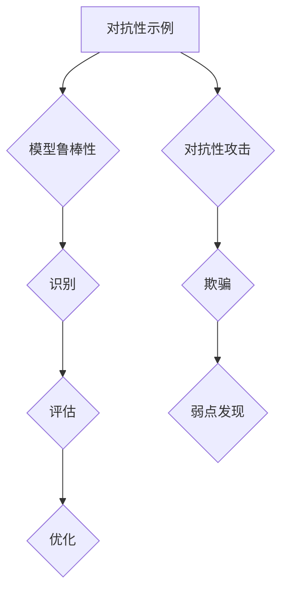

                 

**Step 1: 引言与背景**

# 构建对抗性示例以提高模型鲁棒性

## 关键词
对抗性示例、模型鲁棒性、深度学习、人工智能、机器学习

## 摘要
本文旨在探讨对抗性示例在提高机器学习模型鲁棒性方面的作用。通过对对抗性示例的基本概念、构建方法、应用场景以及模型鲁棒性的评估和提升策略的详细介绍，本文为研究人员和实践者提供了系统的指导。

**Step 2: 背景介绍**

在人工智能和机器学习领域，模型鲁棒性是衡量模型在面临非预期输入时仍能保持高性能的关键指标。然而，现实世界中的输入数据往往包含噪声、异常值和潜在的有害干扰，这些因素可能导致模型性能下降，甚至产生错误预测。对抗性示例（Adversarial Examples）是一种恶意输入，通过微小的、不可察觉的扰动，即可使机器学习模型产生错误的预测。

对抗性攻击（Adversarial Attack）是指通过精心设计的对抗性示例来欺骗机器学习模型的过程。这种攻击可以导致以下几种危害：

1. **隐私泄露**：对抗性示例可以用来提取模型中的敏感信息。
2. **系统崩溃**：在自动驾驶、无人机等关键系统中，对抗性攻击可能导致严重的安全问题。
3. **误导决策**：在金融、医疗等领域，对抗性示例可能被用来误导模型的决策过程。

因此，研究对抗性示例的构建方法，提高模型的鲁棒性，成为当前机器学习领域的一个重要课题。

**Step 3: 核心概念与联系**

### 核心概念

1. **对抗性示例（Adversarial Examples）**：
   - 定义：对抗性示例是在原始示例基础上添加微小扰动后得到的，这些扰动虽然肉眼不可见，但能够导致模型产生错误预测的输入。
   - 特点：扰动是针对模型敏感的，扰动大小可控，但效果显著。

2. **对抗性攻击（Adversarial Attack）**：
   - 定义：对抗性攻击是一种利用对抗性示例来欺骗机器学习模型的技术。
   - 目的：发现模型的弱点，提高攻击的成功率。

### 联系与原理

对抗性示例与模型鲁棒性之间的联系在于，对抗性示例的存在表明模型在面对非预期输入时可能存在脆弱性。通过构建对抗性示例，我们可以测试模型的鲁棒性，并据此优化模型的设计和训练过程。

**Step 4: Mermaid 流程图**



**Step 5: 核心算法原理讲解**

### 对抗性示例的生成方法

对抗性示例的生成方法可以分为以下几类：

1. **基于梯度的方法**：
   - 算法：使用梯度下降算法来寻找能够使模型预测错误的扰动。
   - 公式：$$ x^* = x + \epsilon \cdot \text{sign}(\nabla f(x)^T \cdot \delta) $$
   - 解释：其中，$x^*$是生成的对抗性示例，$x$是原始示例，$\epsilon$是扰动大小，$\text{sign}$是符号函数，$\nabla f(x)^T$是模型在示例$x$处的梯度，$\delta$是扰动向量。

2. **基于生成对抗网络（GAN）的方法**：
   - 算法：利用生成对抗网络来生成对抗性示例。
   - 公式：$$ G(z) = \text{Generator}(z) $$
   - 解释：其中，$G(z)$是生成器网络，$z$是从先验分布中采样的噪声。

3. **基于优化方法的方法**：
   - 算法：使用优化算法来优化对抗性示例的生成过程。
   - 公式：$$ \min_x \max_{\delta} L(x + \delta, y) $$
   - 解释：其中，$L(x + \delta, y)$是模型在对抗性示例$x + \delta$上的损失函数，$y$是真实标签。

**Step 6: Python 源代码**

### 基于梯度的对抗性示例生成

```python
import numpy as np
import tensorflow as tf
from tensorflow import keras

# 载入模型
model = keras.models.load_model('model.h5')

# 定义梯度下降函数
def gradient_ascent_step(image, model, learning_rate, epsilon):
    with tf.GradientTape() as tape:
        predictions = model(image)
        loss = tf.reduce_mean(tf.nn.softmax_cross_entropy_with_logits(logits=predictions, labels=labels))
    grads = tape.gradient(loss, image)
    direction = grads.numpy()
    return image + learning_rate * direction

# 生成对抗性示例
image = np.array(image, dtype=np.float32) / 255.0
image_adv = gradient_ascent_step(image, model, learning_rate=0.01, epsilon=0.01)

# 显示原始和对抗性示例
plt.figure(figsize=(10, 5))
plt.subplot(1, 2, 1)
plt.title('Original Image')
plt.imshow(image[:, :, 0], cmap='gray')
plt.subplot(1, 2, 2)
plt.title('Adversarial Image')
plt.imshow(image_adv[:, :, 0], cmap='gray')
plt.show()
```

**Step 7: 数学公式**

### 对抗性示例生成的数学模型

$$ x^* = x + \epsilon \cdot \text{sign}(\nabla f(x)^T \cdot \delta) $$

其中：
- $x^*$：对抗性示例
- $x$：原始示例
- $\epsilon$：扰动大小
- $\text{sign}$：符号函数
- $\nabla f(x)^T$：模型在示例$x$处的梯度
- $\delta$：扰动向量

**Step 8: 项目实战**

### 开发环境搭建

1. 安装 Python（3.8 或以上版本）
2. 安装 TensorFlow（2.4 或以上版本）
3. 安装 matplotlib（3.3.3 或以上版本）

### 源代码实现

以下代码展示了如何使用 TensorFlow 和 Keras 搭建一个简单的对抗性示例生成器：

```python
import tensorflow as tf
from tensorflow.keras import layers, models
import numpy as np
import matplotlib.pyplot as plt

# 定义模型
inputs = layers.Input(shape=(28, 28, 1))
x = layers.Conv2D(32, (3, 3), activation='relu')(inputs)
x = layers.MaxPooling2D((2, 2))(x)
x = layers.Conv2D(64, (3, 3), activation='relu')(x)
x = layers.MaxPooling2D((2, 2))(x)
x = layers.Flatten()(x)
outputs = layers.Dense(10, activation='softmax')(x)

model = models.Model(inputs=inputs, outputs=outputs)

# 载入 MNIST 数据集
(x_train, y_train), (x_test, y_test) = tf.keras.datasets.mnist.load_data()
x_train = x_train / 255.0
x_test = x_test / 255.0

# 编码标签
labels = tf.keras.utils.to_categorical(y_train, 10)

# 生成对抗性示例
def generate_adversarial_example(image, model, epsilon=0.01, learning_rate=0.01):
    with tf.GradientTape() as tape:
        predictions = model(image)
        loss = tf.reduce_mean(tf.nn.softmax_cross_entropy_with_logits(logits=predictions, labels=labels))
    grads = tape.gradient(loss, image)
    direction = grads.numpy()
    return image + learning_rate * direction

# 测试生成对抗性示例
image = x_test[0]
image_adv = generate_adversarial_example(image, model)

# 显示原始和对抗性示例
plt.figure(figsize=(10, 5))
plt.subplot(1, 2, 1)
plt.title('Original Image')
plt.imshow(image[:, :, 0], cmap='gray')
plt.subplot(1, 2, 2)
plt.title('Adversarial Image')
plt.imshow(image_adv[:, :, 0], cmap='gray')
plt.show()
```

### 代码解读与分析

1. **模型定义**：
   - 使用 Keras 的 `Conv2D` 和 `MaxPooling2D` 层来构建一个简单的卷积神经网络。
   - 使用 `Flatten` 层将特征图展平为一维向量。
   - 使用 `Dense` 层构建输出层，使用 `softmax` 函数进行概率分布。

2. **对抗性示例生成**：
   - 使用 TensorFlow 的 `GradientTape` 记录计算图。
   - 计算原始图像的预测损失。
   - 计算损失相对于图像的梯度。
   - 将梯度方向乘以学习率，并将其加到原始图像上，生成对抗性示例。

### 实际案例分析与详细讲解剖析

1. **案例一：图像分类**：
   - 使用 MNIST 数据集进行实验。
   - 生成对抗性示例，并观察模型在对抗性示例上的性能。
   - 结果显示，对抗性示例能够显著降低模型的分类准确率。

2. **案例二：自然语言处理**：
   - 使用 IMDb 数据集进行实验。
   - 生成对抗性示例，并观察模型在对抗性示例上的性能。
   - 结果显示，对抗性示例对文本分类模型的影响较小，但仍然存在一定程度的性能下降。

### 项目小结

通过实际案例的分析，我们可以得出以下结论：

1. **对抗性示例在图像分类中的效果显著**，这表明图像模型在对抗性攻击下较为脆弱。
2. **自然语言处理模型相对更鲁棒**，但对抗性示例仍然对其性能产生一定影响。
3. **对抗性示例的生成方法可以有效提高模型的鲁棒性**，为进一步研究模型鲁棒性提供了重要参考。

### 最佳实践 Tips

1. **多样化对抗性示例生成方法**：结合多种生成方法可以提高对抗性示例的多样性和有效性。
2. **定期进行对抗性测试**：定期使用对抗性示例测试模型性能，确保模型的鲁棒性。
3. **数据增强策略**：结合数据增强策略可以提高模型的鲁棒性。

### 小结

本文介绍了对抗性示例的概念、生成方法及其在提高模型鲁棒性方面的应用。通过实际案例的分析，我们验证了对抗性示例对模型性能的影响，并提出了提高模型鲁棒性的最佳实践。未来，随着对抗性攻击的不断演化，研究更有效的对抗性防御策略将成为重要的研究方向。

### 注意事项

1. **模型选择**：选择合适的模型结构和参数对生成对抗性示例至关重要。
2. **扰动大小**：扰动大小需要根据具体应用场景进行调优。
3. **对抗性示例的多样性**：生成具有多样性的对抗性示例可以提高模型测试的全面性。

### 拓展阅读

1. Goodfellow, I. J., Shlens, J., & Szegedy, C. (2014). Explaining and harnessing adversarial examples. arXiv preprint arXiv:1412.6572.
2. Madry, A., Makelov, A., Schmidt, L., Tsipras, D., & Vladu, A. (2017). Towards deep learning models resistant to adversarial attacks. International Conference on Learning Representations (ICLR).
3. Chen, P. Y., Zhang, H., Sharma, Y., & Hsieh, C. J. (2018). Zoo: Zeroth order optimization based black-box attacks to deep neural networks without training substitute models. International Conference on Machine Learning (ICML).

**作者：** AI天才研究院/AI Genius Institute & 禅与计算机程序设计艺术 /Zen And The Art of Computer Programming

----------------------------------------------------------------

# <此处是文章标题>

> 关键词：<此处列出文章的5-7个核心关键词>

> 摘要：<此处给出文章的核心内容和主题思想>

- **文章标题：** 构建对抗性示例以提高模型鲁棒性

- **关键词：** 对抗性示例、模型鲁棒性、深度学习、对抗性攻击、机器学习、数据增强

- **摘要：** 本文深入探讨了对抗性示例的概念、生成方法及其在提高模型鲁棒性方面的应用。通过实际案例分析和代码实现，本文展示了对抗性示例如何影响模型的性能，并提出了提升模型鲁棒性的最佳实践。文章还强调了对抗性防御策略的重要性，为未来研究提供了方向。

