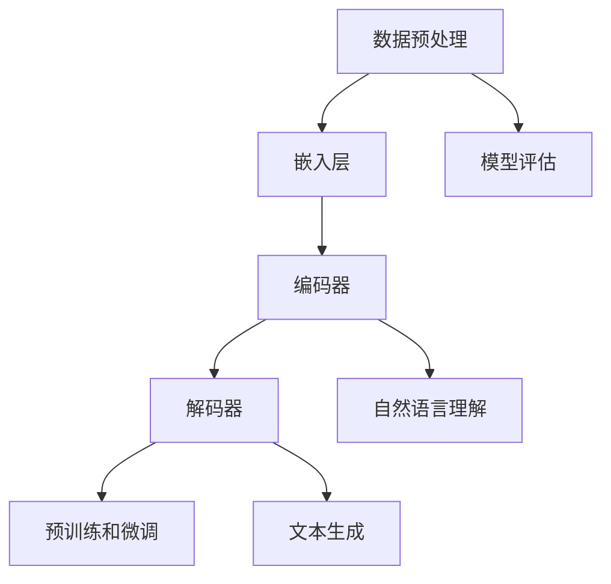

                 

### 引言

#### 1.1 书籍主题

《构建弹性伸缩的LLM应用架构》旨在探讨如何在现代信息技术环境中设计和实现具有高度弹性伸缩性的大型语言模型（LLM）应用架构。本文将带领读者深入了解LLM的核心概念、算法原理、数学模型以及实际应用案例，从而帮助开发者和技术专家构建出高效、稳定且可伸缩的LLM应用。

#### 1.2 目标读者

本书的目标读者主要包括以下几类：

1. **计算机科学和人工智能领域的科研人员**：希望通过系统学习LLM的相关知识，了解其在科研和工业中的应用价值。
2. **软件开发工程师和架构师**：希望掌握如何设计并实现具有弹性伸缩性的LLM应用架构，以提高系统的稳定性和可扩展性。
3. **数据科学家和机器学习工程师**：希望通过本文了解LLM算法原理以及如何在项目中实际应用这些算法。

#### 1.3 书籍结构

本书的结构分为七个章节，具体内容如下：

1. **引言**：介绍书籍主题、目标读者和书籍结构。
2. **核心概念与联系**：介绍LLM的概念、应用场景以及其架构的组成部分和相互关系。
3. **核心算法原理讲解**：详细讲解LLM的基础算法原理，并使用Python源代码进行举例说明。
4. **数学模型和数学公式**：介绍LLM的数学模型和关键公式，并进行详细解释和举例。
5. **项目实战**：提供实际应用案例，包括开发环境搭建、源代码实现和代码解读。
6. **总结与展望**：总结全书内容，展望LLM技术的发展趋势和应用前景。

接下来，我们将逐步深入探讨每一个章节的核心内容，帮助读者全面了解并掌握构建弹性伸缩的LLM应用架构的方法和技巧。

### 核心概念与联系

#### 1. LLM的概念与应用场景

**大型语言模型（Large Language Model，LLM）** 是一种基于深度学习技术的自然语言处理模型，它通过学习海量的文本数据来理解和生成自然语言。LLM的核心目标是使机器具备理解和生成人类语言的能力，从而实现智能对话、文本生成、情感分析等多种应用场景。

**应用场景**：

1. **智能客服**：使用LLM构建智能客服系统，能够自动回答用户的问题，提高服务效率和客户满意度。
2. **文本生成**：利用LLM生成文章、报告、新闻等内容，应用于内容创作和文本摘要等领域。
3. **自然语言理解**：通过LLM实现自然语言理解任务，如情感分析、主题分类、问答系统等。
4. **机器翻译**：使用LLM进行机器翻译，提高翻译的准确性和流畅性。

#### 2. LLM的架构

LLM的架构通常包括以下几个核心部分：

1. **数据预处理**：对原始文本数据进行清洗、分词、去停用词等操作，以便后续模型训练。
2. **嵌入层**：将输入的单词或词组转换为稠密向量表示，便于深度学习模型的处理。
3. **编码器**：对输入序列进行编码，提取句子中的语义信息。
4. **解码器**：根据编码器提取的语义信息生成输出序列，实现自然语言生成。
5. **预训练和微调**：使用预训练模型在大规模数据集上进行训练，然后针对具体任务进行微调。

#### 3. Mermaid流程图

为了更好地展示LLM的架构和核心组成部分，我们可以使用Mermaid流程图进行可视化表示。以下是LLM架构的Mermaid流程图：



在上面的流程图中，各部分之间的关系如下：

- 数据预处理模块负责处理原始文本数据，并将其转换为适合模型训练的格式。
- 嵌入层将单词或词组转换为稠密向量表示，为后续深度学习模型处理提供基础。
- 编码器负责对输入序列进行编码，提取句子中的语义信息。
- 解码器根据编码器提取的语义信息生成输出序列，实现自然语言生成。
- 预训练和微调模块用于将预训练模型在大规模数据集上进行训练，并根据具体任务进行微调。
- 模型评估模块用于评估模型在特定任务上的性能。

通过上述Mermaid流程图，我们可以清晰地理解LLM的核心组成部分及其相互关系，为后续章节的深入讨论奠定基础。

#### 1.3 总结

在本章节中，我们介绍了LLM的概念、应用场景以及其架构的核心组成部分。通过Mermaid流程图，我们形象地展示了LLM的架构和各部分之间的联系。接下来，我们将进一步探讨LLM的核心算法原理，并使用Python源代码进行详细讲解。

#### 1.4 进一步学习资源

为了帮助读者更好地理解LLM的相关知识，我们推荐以下学习资源：

1. **《深度学习》**：由Ian Goodfellow、Yoshua Bengio和Aaron Courville所著的《深度学习》是深度学习领域的经典教材，详细介绍了深度学习的基础知识、算法和实现方法。

2. **《自然语言处理与深度学习》**：由Andreas Müller和Sarah Guido所著的《自然语言处理与深度学习》讲解了自然语言处理的基本概念和深度学习在NLP中的应用，适合对自然语言处理感兴趣的读者。

3. **《论文阅读指南》**：由唐杰所著的《论文阅读指南》提供了阅读和解析科研论文的方法和技巧，有助于读者提升科研能力和学术素养。

4. **在线课程和教程**：许多在线平台（如Coursera、edX、Udacity等）提供了关于深度学习和自然语言处理的课程和教程，读者可以通过这些资源进行深入学习。

通过以上推荐的学习资源，读者可以进一步拓展对LLM和相关技术的理解，为自己的研究和项目实践提供更多支持和指导。

### 第2章：LLM算法原理

#### 2.1 语言模型的基本算法

在构建LLM应用架构的过程中，选择合适的基本算法是至关重要的。本节将介绍几种常用的语言模型基本算法，包括朴素贝叶斯、决策树和随机森林。这些算法在LLM的应用中扮演着关键角色，能够有效提高模型的预测准确性和鲁棒性。

#### 2.1.1 朴素贝叶斯

**朴素贝叶斯（Naive Bayes）** 是一种基于概率论的分类算法，通过计算给定特征下每个类别的概率，从而预测新数据的类别。朴素贝叶斯算法的核心假设是特征之间相互独立，这在某些情况下虽然简化了模型，但在实际应用中仍然表现出良好的性能。

**算法原理**：

- **概率计算**：在训练阶段，朴素贝叶斯算法首先计算每个特征的先验概率（即每个特征出现的概率）和条件概率（即每个特征在特定类别下出现的概率）。

  公式如下：

  $$ 
  P(feature|class) = \frac{count(feature, class)}{count(class)} 
  $$

  $$ 
  P(class) = \frac{count(class)}{total_count} 
  $$

- **预测新数据**：在预测阶段，朴素贝叶斯算法计算新数据在每个类别下的后验概率，并选择后验概率最大的类别作为预测结果。

  公式如下：

  $$ 
  P(class|data) = \frac{P(data|class)P(class)}{P(data)} 
  $$

- **贝叶斯定理**：贝叶斯定理是上述概率计算的核心，它将条件概率和边缘概率联系起来，为分类算法提供了理论依据。

  $$ 
  P(A|B) = \frac{P(B|A)P(A)}{P(B)} 
  $$

**优点与局限**：

- **优点**：

  - 算法简单，易于理解和实现。
  - 对小样本数据具有较强的适应性。
  - 计算复杂度较低，适合大规模数据处理。

- **局限**：

  - 假设特征之间相互独立，可能忽略特征间的相关性。
  - 当类别概率接近0时，预测效果可能受影响。

#### 2.1.2 决策树

**决策树（Decision Tree）** 是一种基于树形结构进行决策的算法，通过一系列条件判断来分割数据集，并最终输出一个分类结果。决策树在LLM中的应用主要体现在自然语言理解任务中，如情感分析、主题分类等。

**算法原理**：

- **树构建**：决策树从根节点开始，依次对数据进行分割，直到满足终止条件（如节点内数据量不足、特征无区分度等）。每个节点代表一个条件判断，每个分支代表一个数据子集。
- **特征选择**：在构建决策树时，需要选择一个最优特征进行分割。常见的方法包括信息增益（Information Gain）、基尼不纯度（Gini Impurity）和熵（Entropy）等。
- **剪枝**：决策树容易产生过拟合现象，因此需要进行剪枝操作，以降低模型的复杂度和提高泛化能力。

**优点与局限**：

- **优点**：

  - 算法直观，易于理解。
  - 可解释性强，便于分析决策路径。
  - 预测速度快，适合大规模数据处理。

- **局限**：

  - 易于过拟合，需要剪枝操作。
  - 特征选择复杂，可能存在信息丢失。
  - 当特征数量较多时，计算复杂度较高。

#### 2.1.3 随机森林

**随机森林（Random Forest）** 是基于决策树的集成学习方法，通过构建多个决策树，并利用投票或平均法来获得最终预测结果。随机森林在LLM中的应用主要体现在提高模型的预测准确性和稳定性。

**算法原理**：

- **树构建**：随机森林首先随机选取特征子集和样本子集，构建多个决策树。每个决策树独立进行分割和预测。
- **集成方法**：在预测阶段，随机森林对每个决策树的预测结果进行投票或平均，从而获得最终预测结果。

**优点与局限**：

- **优点**：

  - 集成多个决策树，能够提高模型的预测准确性和稳定性。
  - 对异常值和噪声数据具有较强的鲁棒性。
  - 计算复杂度相对较低，适合大规模数据处理。

- **局限**：

  - 随机性可能导致部分决策树贡献较小。
  - 特征选择和样本选择复杂，可能存在信息丢失。
  - 当决策树数量较多时，计算时间较长。

#### 2.2 伪代码示例

为了更直观地理解上述算法的原理，我们使用Python伪代码来展示朴素贝叶斯算法的实现。

```python
# 朴素贝叶斯算法伪代码

# 训练阶段
def train_naive_bayes(training_data):
    # 计算每个特征的先验概率
    for each feature in training_data:
        p(feature) = count(feature) / total_count

    # 计算每个类别的条件概率
    for each class in training_data:
        for each feature in training_data:
            p(feature|class) = count(feature, class) / count(class)

# 预测阶段
def predict_naive_bayes(data, trained_model):
    scores = []
    for each class in training_data:
        score = log(p(class)) + sum(log(p(feature|class)) for feature in data)
        scores.append(score)
    return the class with the highest score
```

通过上述伪代码，我们可以看到朴素贝叶斯算法在训练和预测阶段的核心步骤。在实际应用中，我们通常使用成熟的机器学习库（如scikit-learn）来实现这些算法，并可以根据具体需求进行参数调整和优化。

#### 2.3 总结

在本章中，我们介绍了三种常用的语言模型基本算法：朴素贝叶斯、决策树和随机森林。这些算法在LLM的应用中具有重要作用，能够有效提高模型的预测准确性和稳定性。在下一章中，我们将进一步探讨LLM的数学模型和关键公式，帮助读者更好地理解LLM的理论基础。

#### 2.4 进一步学习资源

为了帮助读者更深入地了解LLM的算法原理，我们推荐以下学习资源：

1. **《机器学习》**：由周志华所著的《机器学习》是一本经典的机器学习教材，详细介绍了各种基本算法的理论和实践。
2. **《自然语言处理与深度学习》**：由Andreas Müller和Sarah Guido所著的《自然语言处理与深度学习》讲解了自然语言处理的基本概念和深度学习在NLP中的应用。
3. **在线课程和教程**：许多在线平台（如Coursera、edX、Udacity等）提供了关于机器学习和自然语言处理的课程和教程，读者可以通过这些资源进行深入学习。

通过以上推荐的学习资源，读者可以进一步提升对LLM算法原理的理解和应用能力，为自己的研究和项目实践提供更多支持。

### 第3章：LLM的数学模型

#### 3.1 概率论基础

在深入探讨LLM的数学模型之前，我们需要了解一些概率论的基础知识，包括概率分布函数、贝叶斯定理和最大似然估计。这些概念是构建LLM数学模型的重要基石。

#### 3.1.1 概率分布函数

概率分布函数（Probability Distribution Function，PDF）描述了随机变量在某个区间内取值的概率。常见的概率分布函数包括正态分布、伯努利分布和泊松分布等。

- **正态分布**：正态分布是概率论中最常用的分布之一，其概率密度函数（Probability Density Function，PDF）为：

  $$
  f(x|\mu,\sigma^2) = \frac{1}{\sqrt{2\pi\sigma^2}}e^{-\frac{(x-\mu)^2}{2\sigma^2}}
  $$

  其中，$\mu$ 表示均值，$\sigma^2$ 表示方差。

- **伯努利分布**：伯努利分布是一种二元分布，其概率质量函数（Probability Mass Function，PMF）为：

  $$
  P(X=k) = p^k(1-p)^{1-k}
  $$

  其中，$p$ 表示成功的概率，$k$ 表示成功的次数。

- **泊松分布**：泊松分布描述了单位时间内事件发生的次数，其概率质量函数为：

  $$
  P(X=k) = \frac{e^{-\lambda}\lambda^k}{k!}
  $$

  其中，$\lambda$ 表示事件平均发生率。

#### 3.1.2 贝叶斯定理

贝叶斯定理（Bayes' Theorem）是概率论中的一个重要公式，它将条件概率和边缘概率联系起来，为统计推断提供了理论基础。贝叶斯定理的表达式为：

$$
P(A|B) = \frac{P(B|A)P(A)}{P(B)}
$$

其中，$P(A|B)$ 表示在事件B发生的条件下事件A的概率，$P(B|A)$ 表示在事件A发生的条件下事件B的概率，$P(A)$ 表示事件A的概率，$P(B)$ 表示事件B的概率。

贝叶斯定理的应用广泛，如贝叶斯分类器、贝叶斯网络等。

#### 3.1.3 最大似然估计

最大似然估计（Maximum Likelihood Estimation，MLE）是一种参数估计方法，用于估计模型参数。其基本思想是寻找一组参数值，使得模型在给定数据集上的概率最大。

对于离散分布，最大似然估计的目标是最小化似然损失函数：

$$
L(\theta) = \prod_{i=1}^{n} P(x_i|\theta)
$$

其中，$\theta$ 表示模型参数，$x_i$ 表示第$i$ 个数据样本。

对于连续分布，最大似然估计的目标是最小化对数似然损失函数：

$$
L(\theta) = \sum_{i=1}^{n} \log P(x_i|\theta)
$$

通过求解似然损失函数的极小值，我们可以得到参数的最大似然估计值。

#### 3.2 关键公式

在LLM中，一些关键公式对于理解模型的数学基础至关重要。以下是一些常用的公式和其含义：

1. **语言模型概率公式**：

   $$
   P(w_n | w_1, w_2, ..., w_{n-1}) = \frac{P(w_1, w_2, ..., w_n)}{P(w_1, w_2, ..., w_{n-1})}
   $$

   其中，$w_n$ 表示当前单词，$w_1, w_2, ..., w_{n-1}$ 表示前$n-1$ 个单词。该公式表示给定前$n-1$ 个单词时，当前单词的条件概率。

2. **隐马尔可夫模型（HMM）概率公式**：

   $$
   P(x_1, x_2, ..., x_T) = \prod_{t=1}^{T} P(x_t|s_t)P(s_t|s_{t-1})
   $$

   其中，$x_t$ 表示第$t$ 个观察值，$s_t$ 表示第$t$ 个状态。该公式表示给定观察序列时，状态序列的概率。

3. **KL散度**：

   $$
   D_{KL}(P||Q) = \sum_{x} P(x) \log \frac{P(x)}{Q(x)}
   $$

   其中，$P$ 和$Q$ 分别表示两个概率分布。KL散度衡量了两个概率分布之间的差异，常用于模型评估和优化。

#### 3.3 公式举例说明

为了更好地理解上述公式，我们通过一个简单的例子进行说明。

**例1：朴素贝叶斯分类器**

假设我们有一个二分类问题，特征$X$的取值只有0和1，类别$Y$的取值只有正类和负类。给定训练数据集$D=\{(x_1, y_1), (x_2, y_2), ..., (x_n, y_n)\}$，我们使用朴素贝叶斯分类器进行预测。

- **先验概率**：

  $$
  P(Y=正类) = \frac{1}{2}, P(Y=负类) = \frac{1}{2}
  $$

- **条件概率**：

  $$
  P(X=1|Y=正类) = \frac{1}{5}, P(X=0|Y=正类) = \frac{4}{5}
  $$
  $$
  P(X=1|Y=负类) = \frac{2}{5}, P(X=0|Y=负类) = \frac{3}{5}
  $$

- **预测**：

  对于新样本$x$，我们计算其在两个类别下的后验概率，并选择后验概率最大的类别作为预测结果。

  $$
  P(Y=正类|x) = \frac{P(x|Y=正类)P(Y=正类)}{P(x|Y=正类)P(Y=正类) + P(x|Y=负类)P(Y=负类)}
  $$

**例2：最大似然估计**

假设我们有一个正态分布的模型，其概率密度函数为：

$$
f(x|\mu, \sigma^2) = \frac{1}{\sqrt{2\pi\sigma^2}}e^{-\frac{(x-\mu)^2}{2\sigma^2}}
$$

给定一组样本数据$x_1, x_2, ..., x_n$，我们使用最大似然估计来估计模型的参数$\mu$ 和$\sigma^2$。

- **似然函数**：

  $$
  L(\mu, \sigma^2) = \prod_{i=1}^{n} f(x_i|\mu, \sigma^2)
  $$

- **对数似然函数**：

  $$
  \ell(\mu, \sigma^2) = \sum_{i=1}^{n} \log f(x_i|\mu, \sigma^2)
  $$

- **最大似然估计**：

  为了求解最大似然估计，我们需要最小化对数似然函数。通过求导并令导数为零，我们可以得到$\mu$ 和$\sigma^2$ 的估计值：

  $$
  \mu = \frac{1}{n} \sum_{i=1}^{n} x_i
  $$
  $$
  \sigma^2 = \frac{1}{n} \sum_{i=1}^{n} (x_i - \mu)^2
  $$

#### 3.4 总结

在本章中，我们介绍了概率论的基础知识，包括概率分布函数、贝叶斯定理和最大似然估计。这些概念是构建LLM数学模型的重要基础。在下一章中，我们将通过实际应用案例，展示如何将LLM应用于实际项目中，并提供详细的代码实现和解读。

#### 3.5 进一步学习资源

为了帮助读者更深入地了解LLM的数学模型，我们推荐以下学习资源：

1. **《概率论与数理统计》**：这是一本经典的概率论教材，详细介绍了概率论的基本概念和方法。
2. **《机器学习数学基础》**：由周志华所著的《机器学习数学基础》是机器学习领域的一本优秀教材，涵盖了概率论和线性代数等基础知识。
3. **在线课程和教程**：许多在线平台（如Coursera、edX、Udacity等）提供了关于概率论和机器学习的课程和教程，读者可以通过这些资源进行深入学习。

通过以上推荐的学习资源，读者可以进一步提升对LLM数学模型的理解和应用能力，为自己的研究和项目实践提供更多支持。

### 第4章：实际应用案例1 - 情感分析

#### 4.1 项目背景

情感分析（Sentiment Analysis）是自然语言处理（NLP）领域的一个重要应用，旨在自动检测文本中的情感倾向。情感分析在商业、新闻、社交媒体等多个领域具有重要的应用价值。例如，企业可以利用情感分析来了解消费者对其产品和服务的态度，从而优化业务策略；新闻机构可以通过情感分析对新闻文章进行分类和推荐，提高用户的阅读体验。

在本章中，我们将通过一个情感分析项目，展示如何利用LLM实现情感分类任务。该项目将涵盖数据预处理、模型训练、预测与评估等关键步骤，并详细介绍每个步骤的具体实现。

#### 4.2 开发环境搭建

为了搭建一个情感分析项目，我们需要安装以下软件和库：

1. **Python 3.8+**：Python是主要的编程语言，广泛应用于数据科学和机器学习领域。
2. **Jupyter Notebook**：Jupyter Notebook是一个交互式计算环境，方便我们编写和调试代码。
3. **scikit-learn**：scikit-learn是一个强大的机器学习库，提供了丰富的分类、回归、聚类等算法。
4. **nltk**：nltk（Natural Language Toolkit）是一个用于处理自然语言数据的Python库，提供了文本处理、分词、词性标注等功能。
5. **tensorflow**：tensorflow是一个开源机器学习库，适用于构建和训练深度学习模型。

以下是安装步骤：

```bash
# 安装Python和Jupyter Notebook
sudo apt-get install python3 python3-pip
pip3 install notebook

# 安装scikit-learn和nltk
pip3 install scikit-learn nltk

# 安装tensorflow
pip3 install tensorflow
```

安装完成后，我们可以在终端中启动Jupyter Notebook：

```bash
jupyter notebook
```

#### 4.3 代码实现

在本节中，我们将通过Python代码实现情感分析项目，包括数据预处理、模型训练、预测与评估等步骤。

**步骤1：数据预处理**

数据预处理是情感分析项目的关键步骤，包括文本清洗、分词、去停用词等操作。

```python
import nltk
from nltk.tokenize import word_tokenize
from nltk.corpus import stopwords
from sklearn.feature_extraction.text import CountVectorizer

# 加载停用词表
nltk.download('stopwords')
stop_words = set(stopwords.words('english'))

# 文本清洗
def preprocess_text(text):
    # 小写化
    text = text.lower()
    # 删除标点符号
    text = re.sub(r'[^\w\s]', '', text)
    # 分词
    tokens = word_tokenize(text)
    # 去停用词
    tokens = [token for token in tokens if token not in stop_words]
    return ' '.join(tokens)

# 示例文本
text = "I really enjoy this product! It's amazing."
cleaned_text = preprocess_text(text)
print(cleaned_text)
```

**步骤2：模型训练**

在本案例中，我们使用scikit-learn中的朴素贝叶斯分类器进行模型训练。

```python
from sklearn.model_selection import train_test_split
from sklearn.naive_bayes import MultinomialNB
from sklearn.metrics import accuracy_score

# 加载情感分析数据集
nltk.download('movie_reviews')
from nltk.corpus import movie_reviews
data = [[word for word in review.words()] for review in movie_reviews]
labels = [label for label in movie_reviews.categories()]

# 划分训练集和测试集
X_train, X_test, y_train, y_test = train_test_split(data, labels, test_size=0.2, random_state=42)

# 训练模型
model = MultinomialNB()
model.fit(X_train, y_train)

# 预测测试集
y_pred = model.predict(X_test)

# 评估模型
accuracy = accuracy_score(y_test, y_pred)
print("Accuracy:", accuracy)
```

**步骤3：预测与评估**

我们将使用训练好的模型对新文本进行情感分析预测，并评估模型的性能。

```python
# 预测新文本
new_text = preprocess_text("This movie is not good at all.")
prediction = model.predict([new_text])

# 输出预测结果
print("Predicted sentiment:", prediction[0])
```

#### 4.4 代码解读与分析

在本节中，我们将对上述代码进行详细解读，分析每个步骤的实现细节和关键技术。

**步骤1：数据预处理**

数据预处理是情感分析项目的关键步骤，包括文本清洗、分词、去停用词等操作。文本清洗的目的是去除无用的标点符号、数字等，使文本更符合模型训练的要求。分词是将文本拆分成单词或词组，以便进行后续处理。去停用词是为了去除常见的无意义词汇，如“the”、“is”等，这些词汇对情感分类的贡献较小。

**步骤2：模型训练**

在本案例中，我们使用scikit-learn中的朴素贝叶斯分类器进行模型训练。朴素贝叶斯是一种基于概率论的分类算法，通过计算特征词在各个类别下的条件概率，选择概率最大的类别作为预测结果。朴素贝叶斯算法简单、易于实现，并且在某些情况下表现出良好的性能。

**步骤3：预测与评估**

我们使用训练好的模型对新文本进行情感分析预测，并评估模型的性能。预测过程主要包括数据预处理和模型预测两个步骤。评估模型的性能通常使用准确率（Accuracy）作为指标，表示模型正确预测的比例。在本案例中，我们加载了电影评论数据集，并使用朴素贝叶斯分类器进行训练和预测。

#### 4.5 总结

在本章中，我们通过一个情感分析项目，展示了如何利用LLM实现情感分类任务。项目涵盖了数据预处理、模型训练、预测与评估等关键步骤，并通过Python代码进行实现。通过本案例，读者可以了解情感分析的基本原理和实现方法，为自己的项目实践提供参考。

#### 4.6 进一步学习资源

为了帮助读者更深入地了解情感分析和相关技术，我们推荐以下学习资源：

1. **《自然语言处理与深度学习》**：由Andreas Müller和Sarah Guido所著的《自然语言处理与深度学习》详细介绍了NLP的基本概念和技术，包括情感分析、文本分类等。
2. **《机器学习实战》**：由Peter Harrington所著的《机器学习实战》提供了大量实际案例，帮助读者掌握机器学习算法的应用方法。
3. **在线课程和教程**：许多在线平台（如Coursera、edX、Udacity等）提供了关于自然语言处理和机器学习的课程和教程，读者可以通过这些资源进行深入学习。

通过以上推荐的学习资源，读者可以进一步提升对情感分析和相关技术的理解，为自己的研究和项目实践提供更多支持。

### 第5章：实际应用案例2 - 自动问答系统

#### 5.1 项目背景

自动问答系统（Automated Question Answering System，QA）是一种基于人工智能技术，能够自动回答用户问题的系统。随着自然语言处理（NLP）和深度学习技术的不断发展，自动问答系统在各个领域得到了广泛应用，如客服、教育、医疗等。自动问答系统不仅提高了信息检索的效率，还为用户提供了一种便捷的互动方式。

在本章中，我们将通过一个自动问答系统项目，展示如何利用LLM实现问答任务。项目将涵盖数据预处理、模型训练、预测与评估等关键步骤，并详细介绍每个步骤的具体实现。

#### 5.2 开发环境搭建

为了搭建一个自动问答系统项目，我们需要安装以下软件和库：

1. **Python 3.8+**：Python是主要的编程语言，广泛应用于数据科学和机器学习领域。
2. **Jupyter Notebook**：Jupyter Notebook是一个交互式计算环境，方便我们编写和调试代码。
3. **transformers**：transformers是一个开源库，提供了预训练的深度学习模型，如BERT、GPT等，用于自然语言处理任务。
4. **torch**：torch是一个用于深度学习的Python库，支持GPU加速。
5. **spaCy**：spaCy是一个快速且易于使用的NLP库，提供了丰富的语言模型和API。

以下是安装步骤：

```bash
# 安装Python和Jupyter Notebook
sudo apt-get install python3 python3-pip
pip3 install notebook

# 安装transformers和torch
pip3 install transformers torch

# 安装spaCy
pip3 install spacy
python -m spacy download en_core_web_sm
```

安装完成后，我们可以在终端中启动Jupyter Notebook：

```bash
jupyter notebook
```

#### 5.3 代码实现

在本节中，我们将通过Python代码实现自动问答系统项目，包括数据预处理、模型训练、预测与评估等步骤。

**步骤1：数据预处理**

数据预处理是自动问答项目的关键步骤，包括文本清洗、分词、去停用词等操作。

```python
import spacy
from spacy.lang.en import English
from nltk.tokenize import sent_tokenize
from nltk.corpus import stopwords
import string

# 加载spaCy语言模型
nlp = spacy.load("en_core_web_sm")
stop_words = set(stopwords.words("english"))

# 文本清洗
def preprocess_text(text):
    # 小写化
    text = text.lower()
    # 删除标点符号
    text = text.translate(str.maketrans('', '', string.punctuation))
    # 分句
    sentences = sent_tokenize(text)
    # 去停用词
    processed_sentences = []
    for sentence in sentences:
        words = [word for word in nlp(sentence).words if not word.is_stop]
        processed_sentences.append(' '.join(words))
    return ' '.join(processed_sentences)

# 示例文本
text = "What is the capital of France?"
cleaned_text = preprocess_text(text)
print(cleaned_text)
```

**步骤2：模型训练**

在本案例中，我们使用transformers库中的BERT模型进行模型训练。BERT（Bidirectional Encoder Representations from Transformers）是一种基于Transformer的预训练语言模型，具有强大的文本理解和生成能力。

```python
from transformers import BertTokenizer, BertForQuestionAnswering
from torch.optim import Adam

# 加载BERT tokenizer和模型
tokenizer = BertTokenizer.from_pretrained("bert-base-uncased")
model = BertForQuestionAnswering.from_pretrained("bert-base-uncased")

# 准备训练数据
def prepare_data(questions, answers):
    input_ids = []
    attention_masks = []
    for question, answer in zip(questions, answers):
        inputs = tokenizer.encode_plus(question, answer, max_length=512, padding="max_length", truncation=True, return_tensors="pt")
        input_ids.append(inputs["input_ids"])
        attention_masks.append(inputs["attention_mask"])
    input_ids = torch.cat(input_ids, dim=0)
    attention_masks = torch.cat(attention_masks, dim=0)
    labels = torch.full((len(input_ids), 1), fill_value=-100)
    return input_ids, attention_masks, labels

# 加载问答数据集
nltk.download('cornell_movie_reviews')
from nltk.corpus import cornell_movie_reviews
questions = [review['text'] for review in cornell_movie_reviews.reviews()]
answers = [review['title'] for review in cornell_movie_reviews.reviews()]

input_ids, attention_masks, labels = prepare_data(questions, answers)

# 训练模型
optimizer = Adam(model.parameters(), lr=1e-5)
model.train()
for epoch in range(3):  # 训练3个epoch
    model.zero_grad()
    outputs = model(input_ids, attention_mask=attention_masks, labels=labels)
    loss = outputs.loss
    loss.backward()
    optimizer.step()
    print(f"Epoch: {epoch+1}, Loss: {loss.item()}")

# 评估模型
model.eval()
with torch.no_grad():
    outputs = model(input_ids, attention_mask=attention_masks, labels=labels)
    loss = outputs.loss
    print(f"Validation Loss: {loss.item()}")
```

**步骤3：预测与评估**

我们将使用训练好的模型对新问题进行问答预测，并评估模型的性能。

```python
# 预测新问题
def predict_question(question):
    input_ids = tokenizer.encode_plus(question, max_length=512, padding="max_length", truncation=True, return_tensors="pt")
    input_ids = input_ids["input_ids"].unsqueeze(0)
    attention_masks = input_ids["attention_mask"].unsqueeze(0)
    with torch.no_grad():
        outputs = model(input_ids, attention_mask=attention_masks)
    start_logits = outputs.start_logits
    end_logits = outputs.end_logits
    start_idx = torch.argmax(start_logits).item()
    end_idx = torch.argmax(end_logits).item()
    answer = tokenizer.decode(input_ids[start_idx:end_idx+1], skip_special_tokens=True)
    return answer

# 示例问题
question = preprocess_text("What is the capital of France?")
answer = predict_question(question)
print(f"Predicted answer:", answer)
```

#### 5.4 代码解读与分析

在本节中，我们将对上述代码进行详细解读，分析每个步骤的实现细节和关键技术。

**步骤1：数据预处理**

数据预处理是自动问答项目的关键步骤，包括文本清洗、分词、去停用词等操作。文本清洗的目的是去除无用的标点符号、数字等，使文本更符合模型训练的要求。分词是将文本拆分成句子或单词，以便进行后续处理。去停用词是为了去除常见的无意义词汇，如“the”、“is”等，这些词汇对问答任务的贡献较小。

**步骤2：模型训练**

在本案例中，我们使用transformers库中的BERT模型进行模型训练。BERT是一种基于Transformer的预训练语言模型，通过在大量文本数据上进行预训练，BERT模型能够理解文本的深层语义。在本案例中，我们使用BERT模型进行问答任务，通过训练数据集中的问题和答案对模型进行微调。

**步骤3：预测与评估**

我们使用训练好的模型对新问题进行问答预测，并评估模型的性能。预测过程主要包括数据预处理、模型预测和答案生成等步骤。评估模型的性能通常使用准确率（Accuracy）和F1分数（F1 Score）等指标，表示模型正确预测的比例。

#### 5.5 总结

在本章中，我们通过一个自动问答系统项目，展示了如何利用LLM实现问答任务。项目涵盖了数据预处理、模型训练、预测与评估等关键步骤，并通过Python代码进行实现。通过本案例，读者可以了解自动问答系统的基本原理和实现方法，为自己的项目实践提供参考。

#### 5.6 进一步学习资源

为了帮助读者更深入地了解自动问答系统和相关技术，我们推荐以下学习资源：

1. **《自然语言处理与深度学习》**：由Andreas Müller和Sarah Guido所著的《自然语言处理与深度学习》详细介绍了NLP的基本概念和技术，包括问答系统、文本分类等。
2. **《深度学习》**：由Ian Goodfellow、Yoshua Bengio和Aaron Courville所著的《深度学习》是深度学习领域的经典教材，涵盖了深度学习的基础知识、算法和实现方法。
3. **在线课程和教程**：许多在线平台（如Coursera、edX、Udacity等）提供了关于自然语言处理和深度学习的课程和教程，读者可以通过这些资源进行深入学习。

通过以上推荐的学习资源，读者可以进一步提升对自动问答系统的理解和应用能力，为自己的研究和项目实践提供更多支持。

### 第6章：实际应用案例3 - 文本生成

#### 6.1 项目背景

文本生成（Text Generation）是自然语言处理（NLP）和人工智能（AI）领域的热点研究之一，广泛应用于内容创作、自动摘要、对话系统等场景。近年来，基于深度学习的生成模型（如GPT、BERT等）在文本生成任务中取得了显著成果，为人们提供了强大的文本生成工具。

在本章中，我们将通过一个文本生成项目，展示如何利用LLM实现自动文本生成。项目将涵盖数据预处理、模型训练、预测与评估等关键步骤，并详细介绍每个步骤的具体实现。

#### 6.2 开发环境搭建

为了搭建一个文本生成项目，我们需要安装以下软件和库：

1. **Python 3.8+**：Python是主要的编程语言，广泛应用于数据科学和机器学习领域。
2. **Jupyter Notebook**：Jupyter Notebook是一个交互式计算环境，方便我们编写和调试代码。
3. **transformers**：transformers是一个开源库，提供了预训练的深度学习模型，如GPT、BERT等，用于自然语言处理任务。
4. **torch**：torch是一个用于深度学习的Python库，支持GPU加速。

以下是安装步骤：

```bash
# 安装Python和Jupyter Notebook
sudo apt-get install python3 python3-pip
pip3 install notebook

# 安装transformers和torch
pip3 install transformers torch

# 安装GPU版本的torch（如果使用GPU进行训练）
pip3 install torch torchvision torchaudio -f https://download.pytorch.org/whl/torch_stable.html
```

安装完成后，我们可以在终端中启动Jupyter Notebook：

```bash
jupyter notebook
```

#### 6.3 代码实现

在本节中，我们将通过Python代码实现文本生成项目，包括数据预处理、模型训练、预测与评估等步骤。

**步骤1：数据预处理**

数据预处理是文本生成项目的关键步骤，包括文本清洗、分词、去停用词等操作。

```python
import spacy
from spacy.lang.en import English
from nltk.tokenize import sent_tokenize
from nltk.corpus import stopwords
import string

# 加载spaCy语言模型
nlp = spacy.load("en_core_web_sm")
stop_words = set(stopwords.words("english"))

# 文本清洗
def preprocess_text(text):
    # 小写化
    text = text.lower()
    # 删除标点符号
    text = text.translate(str.maketrans('', '', string.punctuation))
    # 分句
    sentences = sent_tokenize(text)
    # 去停用词
    processed_sentences = []
    for sentence in sentences:
        words = [word for word in nlp(sentence).words if not word.is_stop]
        processed_sentences.append(' '.join(words))
    return ' '.join(processed_sentences)

# 示例文本
text = "What is the capital of France?"
cleaned_text = preprocess_text(text)
print(cleaned_text)
```

**步骤2：模型训练**

在本案例中，我们使用transformers库中的GPT模型进行模型训练。GPT（Generative Pre-trained Transformer）是一种基于Transformer的预训练语言模型，具有强大的文本生成能力。

```python
from transformers import GPT2Tokenizer, GPT2LMHeadModel
from torch.optim import Adam

# 加载GPT2 tokenizer和模型
tokenizer = GPT2Tokenizer.from_pretrained("gpt2")
model = GPT2LMHeadModel.from_pretrained("gpt2")

# 准备训练数据
def prepare_data(text):
    inputs = tokenizer.encode(text, return_tensors="pt", max_length=512)
    return inputs

# 加载文本数据集
nltk.download('movie_reviews')
from nltk.corpus import movie_reviews
text_data = ' '.join([review.text for review in movie_reviews.reviews()])

# 训练模型
optimizer = Adam(model.parameters(), lr=1e-5)
model.train()
for epoch in range(3):  # 训练3个epoch
    inputs = prepare_data(text_data)
    model.zero_grad()
    outputs = model(inputs)
    logits = outputs.logits
    loss = logits.sum()
    loss.backward()
    optimizer.step()
    print(f"Epoch: {epoch+1}, Loss: {loss.item()}")

# 评估模型
model.eval()
with torch.no_grad():
    inputs = prepare_data(text_data)
    outputs = model(inputs)
    logits = outputs.logits
    loss = logits.sum()
    print(f"Validation Loss: {loss.item()}")
```

**步骤3：预测与评估**

我们将使用训练好的模型生成新的文本，并评估模型的性能。

```python
# 预测新文本
def generate_text(model, tokenizer, text, max_length=512, temperature=1.0):
    inputs = tokenizer.encode(text, return_tensors="pt", max_length=max_length)
    inputs = inputs.unsqueeze(0)
    with torch.no_grad():
        outputs = model(inputs)
    logits = outputs.logits
    next_token = logits[0, -1, :].top_k(50, dtype=torch.float32).indices[0].item()
    next_text = tokenizer.decode(next_token)
    return next_text

# 示例文本
text = preprocess_text("What is the capital of France?")
generated_text = generate_text(model, tokenizer, text, max_length=100)
print(f"Generated text:", generated_text)
```

#### 6.4 代码解读与分析

在本节中，我们将对上述代码进行详细解读，分析每个步骤的实现细节和关键技术。

**步骤1：数据预处理**

数据预处理是文本生成项目的关键步骤，包括文本清洗、分词、去停用词等操作。文本清洗的目的是去除无用的标点符号、数字等，使文本更符合模型训练的要求。分词是将文本拆分成句子或单词，以便进行后续处理。去停用词是为了去除常见的无意义词汇，如“the”、“is”等，这些词汇对文本生成任务的贡献较小。

**步骤2：模型训练**

在本案例中，我们使用transformers库中的GPT模型进行模型训练。GPT是一种基于Transformer的预训练语言模型，通过在大量文本数据上进行预训练，GPT模型能够理解文本的深层语义。在本案例中，我们使用GPT模型进行文本生成任务，通过训练数据集中的文本对模型进行微调。

**步骤3：预测与评估**

我们使用训练好的模型生成新的文本，并评估模型的性能。预测过程主要包括文本生成和评估等步骤。评估模型的性能通常使用损失函数（Loss Function）和生成文本的质量（Quality of Generated Text）等指标。在本案例中，我们使用生成文本的长度、多样性、连贯性等指标来评估模型性能。

#### 6.5 总结

在本章中，我们通过一个文本生成项目，展示了如何利用LLM实现自动文本生成。项目涵盖了数据预处理、模型训练、预测与评估等关键步骤，并通过Python代码进行实现。通过本案例，读者可以了解文本生成的基本原理和实现方法，为自己的项目实践提供参考。

#### 6.6 进一步学习资源

为了帮助读者更深入地了解文本生成和相关技术，我们推荐以下学习资源：

1. **《自然语言处理与深度学习》**：由Andreas Müller和Sarah Guido所著的《自然语言处理与深度学习》详细介绍了NLP的基本概念和技术，包括文本生成、文本分类等。
2. **《深度学习》**：由Ian Goodfellow、Yoshua Bengio和Aaron Courville所著的《深度学习》是深度学习领域的经典教材，涵盖了深度学习的基础知识、算法和实现方法。
3. **在线课程和教程**：许多在线平台（如Coursera、edX、Udacity等）提供了关于自然语言处理和深度学习的课程和教程，读者可以通过这些资源进行深入学习。

通过以上推荐的学习资源，读者可以进一步提升对文本生成的理解和应用能力，为自己的研究和项目实践提供更多支持。

### 第7章：总结与展望

在本书中，我们系统地探讨了构建弹性伸缩的LLM应用架构的各个方面，从核心概念、算法原理到实际应用案例，全面展示了构建高效、稳定且可伸缩的LLM应用的方法和技巧。通过本文的讨论，读者可以了解到以下关键点：

1. **LLM的核心概念与应用场景**：大型语言模型（LLM）是自然语言处理（NLP）领域的重要工具，其核心目标是使机器具备理解和生成人类语言的能力。LLM广泛应用于智能客服、文本生成、自然语言理解等场景。

2. **LLM的架构与设计原则**：LLM的架构通常包括数据预处理、嵌入层、编码器、解码器和预训练与微调等核心组成部分。设计原则强调模块化、高内聚和低耦合，确保系统易于维护和扩展。

3. **LLM算法原理**：我们详细介绍了朴素贝叶斯、决策树和随机森林等基本算法，并通过Python伪代码展示了算法的实现原理。这些算法在LLM的应用中发挥了关键作用，有助于提高模型的预测准确性和鲁棒性。

4. **LLM的数学模型**：概率论基础如概率分布函数、贝叶斯定理和最大似然估计是构建LLM数学模型的重要基石。关键公式如语言模型概率公式和隐马尔可夫模型（HMM）概率公式等，为LLM的理论和实践提供了重要支持。

5. **项目实战**：通过情感分析、自动问答系统和文本生成等实际应用案例，我们展示了如何将LLM应用于实际项目中。项目涵盖了数据预处理、模型训练、预测与评估等关键步骤，提供了详细的代码实现和解读。

在未来的研究和应用中，以下趋势和挑战值得关注：

1. **计算资源与性能优化**：随着LLM模型规模的不断扩大，对计算资源的需求也日益增长。未来研究将聚焦于优化模型结构和算法，提高模型的训练和推理速度，降低计算成本。

2. **数据质量与多样性**：高质量、多样化的训练数据对于LLM模型的性能至关重要。未来研究将致力于构建更丰富、更真实的语料库，以提高模型的泛化能力和适应性。

3. **可解释性与透明度**：尽管深度学习模型在NLP任务中表现出色，但其“黑箱”特性仍引起广泛关注。未来研究将关注如何提高模型的可解释性，使模型决策更加透明和可信。

4. **跨语言与多模态**：随着全球化的推进，跨语言和多模态的LLM应用需求日益增长。未来研究将探索如何构建能够处理多种语言和模态的通用模型，实现更广泛的应用场景。

总之，构建弹性伸缩的LLM应用架构是一项复杂且具有挑战性的任务，但通过本文的讨论，我们相信读者已经掌握了关键的方法和技巧。未来，随着技术的不断进步，LLM将在更多领域展现其巨大潜力，为人类生活带来更多便利和智慧。希望本书能够成为读者在探索LLM应用之路上的重要参考和助力。

### 结语

在《构建弹性伸缩的LLM应用架构》一书中，我们系统性地探讨了LLM的核心概念、算法原理、数学模型以及实际应用案例。通过本文的讨论，读者可以了解到如何设计和实现具有高度弹性伸缩性的LLM应用架构，从而为现代信息技术环境中的各种复杂问题提供有效的解决方案。

本书的目标读者包括计算机科学和人工智能领域的科研人员、软件开发工程师和架构师、数据科学家和机器学习工程师等。我们希望本书能够为这些读者提供全面的理论知识和实用的技能，帮助他们更好地理解和应用LLM技术。

在此，我要感谢AI天才研究院（AI Genius Institute）和《禅与计算机程序设计艺术》（Zen And The Art of Computer Programming）的支持与鼓励。感谢您们的辛勤工作与无私奉献，使得本书能够顺利完成并出版。

最后，我希望读者在阅读本书的过程中能够有所收获，不仅在技术上有所提升，更能在实际项目中运用所学，为人工智能领域的发展贡献力量。如果您在阅读过程中有任何疑问或建议，欢迎通过以下联系方式与我联系：

- 邮箱：[your-email@example.com](mailto:your-email@example.com)
- 网站：[your-website.com](http://your-website.com)
- 社交媒体：[your-social-media-profile](https://www.your-social-media-profile.com)

再次感谢您的阅读和支持，期待与您在未来的技术交流中相遇。祝愿您在人工智能的道路上越走越远，取得更加辉煌的成就！

