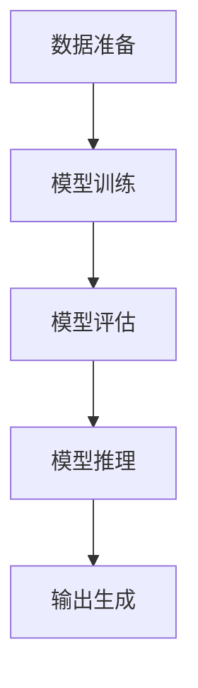

                 

### 文章标题：构建弹性可伸缩的LLM应用基础设施

#### 关键词：大型语言模型（LLM），弹性可伸缩性，应用基础设施，架构设计，核心算法，数学模型，项目实战

#### 摘要：
本文深入探讨如何构建一个弹性可伸缩的大型语言模型（LLM）应用基础设施。首先，我们将介绍LLM的基本概念和重要性，接着详细解析LLM的原理与架构，包括核心算法和数学模型。随后，本文将通过实际项目案例，展示如何在实际环境中构建和优化LLM应用，最终对LLM技术的未来发展趋势和面临的挑战进行展望。

### 第1章 LLM概述与重要性

#### 1.1 LLM的定义与背景

大型语言模型（Large Language Model，简称LLM）是一种基于深度学习技术的自然语言处理模型，其设计目的是通过学习大量文本数据来理解和生成自然语言。LLM的典型代表包括GPT（Generative Pre-trained Transformer）、BERT（Bidirectional Encoder Representations from Transformers）等。这些模型具有强大的文本理解能力和文本生成能力，能够在多种应用场景中发挥作用。

LLM的发展可以追溯到自然语言处理（NLP）领域的研究历程。早期的NLP方法主要基于规则和统计模型，例如基于词典的解析和统计语言模型。然而，随着深度学习技术的发展，NLP领域迎来了重大变革。2018年，Google发布的BERT模型标志着NLP技术的又一重要突破，随后GPT系列模型也相继问世，LLM逐渐成为NLP领域的核心工具。

#### 1.2 LLM的重要性

LLM在人工智能领域具有重要地位。首先，LLM在自然语言理解、生成和交互方面表现出色，能够实现与人类的自然对话。其次，LLM在信息检索、文本摘要、机器翻译、内容生成等应用场景中具有广泛的应用前景。此外，LLM的技术突破也推动了其他人工智能领域的发展，如计算机视觉、语音识别等。

LLM对各行各业的影响也非常显著。在金融服务领域，LLM可以用于自动化客户服务、风险控制、智能投顾等；在健康医疗领域，LLM可以用于医学文本分析、智能诊断、药物研发等；在教育行业，LLM可以用于智能教育、知识图谱构建等；在客户服务领域，LLM可以用于智能客服、个性化推荐等。

#### 1.3 LLM的应用场景

1. **金融服务**：
   - **自动化客户服务**：利用LLM构建的聊天机器人，能够实时解答客户问题，提供个性化服务。
   - **风险控制**：通过对大量金融文本数据的分析，LLM可以识别潜在风险，提高金融服务的安全性。
   - **智能投顾**：利用LLM对金融市场的分析，提供个性化的投资建议，提高投资回报率。

2. **健康医疗**：
   - **医学文本分析**：利用LLM对医学文献和病历进行自动化处理，提高医疗工作效率。
   - **智能诊断**：通过对患者病史和症状的分析，LLM可以辅助医生进行疾病诊断。
   - **药物研发**：利用LLM对生物信息数据的分析，加速药物研发过程。

3. **教育行业**：
   - **智能教育**：利用LLM构建个性化教育系统，根据学生的学习情况提供个性化学习建议。
   - **知识图谱构建**：通过分析大量教育文本数据，构建知识图谱，为教育决策提供支持。

4. **客户服务**：
   - **智能客服**：利用LLM构建智能客服系统，实现高效、准确的客户服务。
   - **个性化推荐**：通过对用户历史行为和偏好进行分析，LLM可以为用户提供个性化的产品推荐。

#### 1.4 本书结构

本书将从以下六个部分对构建弹性可伸缩的LLM应用基础设施进行详细探讨：

1. **引言与基础**：介绍LLM的基本概念、重要性和应用场景。
2. **核心概念与联系**：解析LLM的原理与架构，包括神经网络架构、训练与推理流程。
3. **核心算法原理讲解**：详细阐述LLM的核心算法，包括语言模型的数学模型、伪代码和数学公式。
4. **数学模型和数学公式**：介绍LLM的数学模型，包括概率模型和生成模型，并举例说明。
5. **项目实战**：通过实际项目案例，展示如何构建和优化LLM应用。
6. **结论与展望**：总结LLM技术的未来发展趋势和面临的挑战。

### 第2章 LLM的原理与架构

#### 2.1 LLM的核心概念

大型语言模型（LLM）的核心概念包括自然语言处理、深度学习和神经网络。自然语言处理（NLP）是计算机科学和人工智能领域的一个重要分支，致力于使计算机能够理解和处理人类语言。深度学习则是人工智能的一个子领域，通过模拟人脑神经网络，实现对大量数据的自动学习和处理。神经网络是深度学习的基础，通过多层节点之间的连接和激活函数，实现对输入数据的复杂变换和特征提取。

LLM基于深度学习技术，通过训练大规模神经网络模型，使其能够理解和生成自然语言。与传统的规则方法和统计方法相比，LLM具有更强的灵活性和泛化能力，能够处理更加复杂的自然语言任务。

#### 2.2 LLM的架构

LLM的架构通常包括以下几个关键组件：输入层、嵌入层、编码器、解码器和输出层。以下是每个组件的简要说明：

1. **输入层**：接收原始文本数据，将其转换为数值形式，通常使用词嵌入技术（如Word2Vec、BERT）将单词转换为向量表示。

2. **嵌入层**：将输入文本中的每个词转换为固定长度的向量表示。这些向量表示包含了词的语义信息，是神经网络处理文本数据的基础。

3. **编码器**：编码器负责将嵌入层生成的词向量序列编码为一个固定长度的向量，通常使用多层变换器网络（Transformer）实现。编码器的输出代表了整个输入文本的语义表示。

4. **解码器**：解码器负责将编码器的输出解码为自然语言输出。解码器也通常使用多层变换器网络，并且通常还包括注意力机制，以便在生成每个单词时考虑整个输入文本的上下文信息。

5. **输出层**：输出层通常是一个全连接层，将解码器的输出映射到输出词汇表中的单词概率分布。

#### 2.3 训练与推理流程

LLM的训练与推理流程主要包括以下步骤：

1. **数据准备**：收集和整理大规模的文本数据，通常包括文本清洗、分词、去停用词等预处理步骤。

2. **模型训练**：使用预处理后的文本数据，通过优化算法（如梯度下降、Adam优化器）训练神经网络模型。训练过程中，模型会不断调整参数，以最小化预测损失函数。

3. **模型评估**：使用验证集和测试集评估模型的性能，通常使用指标如准确率、召回率、F1分数等。

4. **模型推理**：在训练完成后，使用训练好的模型进行推理，生成文本输出。推理过程中，模型根据输入的文本数据和预训练的参数，生成新的文本序列。

#### 2.4 Mermaid流程图

以下是LLM工作流程的Mermaid流程图：



### 第3章 LLM的算法基础

#### 3.1 语言模型的数学模型

语言模型的数学模型是构建LLM的基础，主要涉及概率模型和生成模型。这些模型通过数学公式描述文本数据中的概率分布和生成过程，为神经网络训练提供理论基础。

##### 3.1.1 概率模型

概率模型主要包括马尔可夫模型和n元模型。马尔可夫模型假设当前状态只与前一状态有关，而与其他状态无关。n元模型则假设当前状态与前一n个状态有关。

1. **马尔可夫模型**：

   $$P(X_t | X_{t-1}, X_{t-2}, \ldots) = P(X_t | X_{t-1})$$

   其中，$X_t$表示当前状态，$X_{t-1}$表示前一状态。

2. **n元模型**：

   $$P(X_t | X_{t-1}, X_{t-2}, \ldots, X_{t-n}) = P(X_t | X_{t-1}, X_{t-2}, \ldots, X_{t-n+1})$$

   其中，$X_t$表示当前状态，$X_{t-1}, X_{t-2}, \ldots, X_{t-n}$表示前n个状态。

##### 3.1.2 生成模型

生成模型主要包括变分自编码器（VAE）和生成对抗网络（GAN）。这些模型通过学习数据分布的参数，生成符合数据分布的样本。

1. **变分自编码器（VAE）**：

   VAE是一个无监督学习模型，通过编码器和解码器学习数据分布的参数。其目标是最小化重放概率和数据分布之间的差异。

   $$\log P(x) = \log \int p(z|x) p(\theta) dz$$

   其中，$x$表示输入数据，$z$表示编码后的隐变量，$p(z|x)$是解码器生成的概率分布，$p(\theta)$是编码器生成的数据分布参数。

2. **生成对抗网络（GAN）**：

   GAN是一个由生成器和判别器组成的对抗性模型。生成器生成假数据，判别器区分真假数据。生成器和判别器相互对抗，直到生成器生成的假数据足够真实，无法被判别器区分。

   $$\min_G \max_D V(D, G)$$

   其中，$V(D, G)$是生成器和判别器的联合损失函数。

##### 3.1.3 伪代码阐述

以下是语言模型训练的伪代码：

```python
# 初始化模型参数
Initialize_model_parameters()

# 数据准备
data = Load_data()

# 定义损失函数
loss_function = Cross_entropy_loss()

# 定义优化器
optimizer = Adam_optimizer()

# 训练模型
for epoch in range(num_epochs):
    for x, y in data:
        # 前向传播
        output = Forward_pass(x)

        # 计算损失
        loss = loss_function(output, y)

        # 反向传播
        Gradient_descent(loss)

        # 更新模型参数
        optimizer.update_parameters()

# 模型评估
Evaluate_model_performance()
```

##### 3.1.4 数学公式与解释

以下是语言模型中常用的数学公式及其解释：

1. **概率分布函数**：

   $$p(x) = \frac{1}{Z} e^{-\frac{1}{2} x^T \Sigma^{-1} x}$$

   其中，$x$是输入向量，$\Sigma$是协方差矩阵，$Z$是归一化常数。该公式表示高斯分布的概率密度函数。

2. **优化算法**：

   $$\theta_{t+1} = \theta_t - \alpha \nabla_\theta J(\theta_t)$$

   其中，$\theta$是模型参数，$\alpha$是学习率，$J(\theta)$是损失函数。该公式表示梯度下降优化算法。

3. **注意力机制**：

   $$a_t = \frac{e^{z_t^T W_a}}{\sum_{i=1}^n e^{z_i^T W_a}}$$

   其中，$z_t$是编码器输出的隐变量，$W_a$是权重矩阵，$a_t$是注意力权重。该公式表示注意力机制的权重计算。

### 第4章 LLM的数学模型

#### 4.1 概率模型

概率模型是语言模型的核心部分，用于描述文本数据中的概率分布。在LLM中，常用的概率模型包括马尔可夫模型和n元模型。

##### 4.1.1 马尔可夫模型

马尔可夫模型是一种基于概率转移矩阵的语言模型，假设当前状态只与前一状态有关，而与其他状态无关。其数学表示为：

$$P(X_t | X_{t-1}, X_{t-2}, \ldots) = P(X_t | X_{t-1})$$

其中，$X_t$表示当前状态，$X_{t-1}, X_{t-2}, \ldots$表示前一状态。

概率转移矩阵$P$的元素表示从状态$i$转移到状态$j$的概率，即$P(i, j)$。马尔可夫模型可以表示为：

$$P(X_t = j | X_{t-1} = i) = P(i, j)$$

##### 4.1.2 n元模型

n元模型是一种基于n个前缀概率的语言模型，假设当前状态与前一n个状态有关。其数学表示为：

$$P(X_t | X_{t-1}, X_{t-2}, \ldots, X_{t-n}) = P(X_t | X_{t-1}, X_{t-2}, \ldots, X_{t-n+1})$$

其中，$X_t$表示当前状态，$X_{t-1}, X_{t-2}, \ldots, X_{t-n}$表示前一n个状态。

n元模型的概率计算公式为：

$$P(X_t = j | X_{t-1} = i_1, X_{t-2} = i_2, \ldots, X_{t-n+1} = i_n) = \frac{N(i_1, i_2, \ldots, i_n, j)}{N(i_1, i_2, \ldots, i_n)}$$

其中，$N(i_1, i_2, \ldots, i_n, j)$表示前缀$(i_1, i_2, \ldots, i_n, j)$在语料库中的出现次数，$N(i_1, i_2, \ldots, i_n)$表示前缀$(i_1, i_2, \ldots, i_n)$在语料库中的出现次数。

#### 4.2 生成模型

生成模型是一种基于概率分布的语言模型，用于生成新的文本序列。在LLM中，常用的生成模型包括变分自编码器（VAE）和生成对抗网络（GAN）。

##### 4.2.1 变分自编码器（VAE）

变分自编码器（VAE）是一种基于概率编码的生成模型，通过编码器和解码器学习数据分布的参数。VAE的数学模型为：

$$
\begin{aligned}
z &= \mu(x) + \sigma(x) \odot \epsilon \\
x' &= \phi(z)
\end{aligned}
$$

其中，$z$是编码后的隐变量，$\mu(x)$和$\sigma(x)$是编码器输出的均值和标准差，$\epsilon$是噪声变量，$\phi(z)$是解码器生成的样本。

VAE的目标是最小化重放概率和数据分布之间的差异，其损失函数为：

$$
\begin{aligned}
L &= -\sum_{x \in \mathcal{D}} \Big[ \log p(x') + KL(\mu(x), \sigma(x)) \Big]
\end{aligned}
$$

其中，$p(x')$是重放概率，$KL(\mu(x), \sigma(x))$是Kullback-Leibler散度，表示数据分布与重放概率之间的差异。

##### 4.2.2 生成对抗网络（GAN）

生成对抗网络（GAN）是一种基于对抗性训练的生成模型，由生成器和判别器组成。生成器的目标是生成逼真的样本，判别器的目标是区分生成样本和真实样本。GAN的数学模型为：

$$
\begin{aligned}
\min_G \max_D V(D, G) &= \min_G \max_D \mathbb{E}_{x \sim p_{data}(x)}[\log D(x)] + \mathbb{E}_{z \sim p_z(z)}[\log (1 - D(G(z)))] \\
\end{aligned}
$$

其中，$D(x)$是判别器对真实样本的概率估计，$G(z)$是生成器生成的样本，$z$是随机噪声。

GAN的训练过程是一个交替优化的过程，生成器和判别器相互对抗，直到生成器生成的样本足够逼真，无法被判别器区分。

#### 4.3 数学公式举例说明

以下是几个LLM中的数学公式举例说明：

1. **高斯分布**：

   $$p(x|\mu,\sigma^2) = \frac{1}{\sqrt{2\pi\sigma^2}} e^{-\frac{(x-\mu)^2}{2\sigma^2}}$$

   其中，$\mu$是均值，$\sigma^2$是方差。

2. **交叉熵**：

   $$H(p,q) = -\sum_{x} p(x) \log q(x)$$

   其中，$p$是真实分布，$q$是预测分布。

3. **KL散度**：

   $$KL(p||q) = \sum_{x} p(x) \log \frac{p(x)}{q(x)}$$

   其中，$p$是真实分布，$q$是预测分布。

这些数学公式在LLM的建模、训练和评估过程中起着重要作用，通过这些公式可以定量地描述文本数据的概率分布和模型性能。

### 第5章 构建弹性可伸缩的LLM应用基础设施

#### 5.1 项目背景与目标

随着人工智能技术的快速发展，大型语言模型（LLM）在各个行业中的应用越来越广泛。然而，LLM应用面临的一个关键挑战是如何构建一个弹性可伸缩的基础设施，以满足不断增长的计算需求和数据处理能力。本项目旨在设计并实现一个弹性可伸缩的LLM应用基础设施，确保在不同规模和负载下，系统能够保持高效、稳定地运行。

项目的具体目标包括：

1. **高可用性**：确保系统在发生故障时能够快速恢复，减少停机时间，提高系统的可靠性。
2. **高可伸缩性**：系统能够根据实际负载动态调整资源，支持横向和纵向扩展。
3. **高性能**：优化系统的计算和通信性能，提高数据处理和模型推理的效率。
4. **高安全性**：确保数据安全和隐私，防止数据泄露和未授权访问。

#### 5.2 开发环境搭建

为了构建弹性可伸缩的LLM应用基础设施，我们需要搭建一个稳定、高效的开发环境。以下是开发环境搭建的详细步骤：

##### 1. 硬件配置

（1）计算资源：根据项目需求，配置高性能的计算节点，建议使用GPU加速器，如NVIDIA Tesla V100或A100。
（2）存储资源：使用分布式存储系统，如HDFS或Ceph，确保数据的可靠存储和高效访问。
（3）网络资源：构建高带宽、低延迟的网络环境，支持大规模数据传输和模型推理。

##### 2. 软件配置

（1）操作系统：选择稳定、高效的操作系统，如Ubuntu 18.04或CentOS 7。
（2）深度学习框架：选择流行的深度学习框架，如TensorFlow或PyTorch。
（3）数据存储和处理工具：使用Hadoop或Spark等大数据处理工具，确保数据的高效存储和处理。
（4）容器化技术：使用Docker或Kubernetes等技术，实现应用的容器化部署和管理，提高系统的可伸缩性和稳定性。

##### 3. 开发环境配置示例

以下是使用Docker搭建深度学习开发环境的示例步骤：

```shell
# 安装Docker
sudo apt-get update
sudo apt-get install docker

# 启动Docker服务
sudo systemctl start docker

# 拉取TensorFlow容器镜像
sudo docker pull tensorflow/tensorflow:latest

# 运行TensorFlow容器
sudo docker run -it --rm -p 8888:8888 tensorflow/tensorflow:latest jupyter notebook --port=8888 --no-browser --ip=0.0.0.0
```

#### 5.3 代码实际案例

在本项目中，我们将使用TensorFlow框架构建一个简单的LLM应用，实现文本生成功能。以下是代码实现的详细步骤：

##### 1. 数据预处理

```python
import tensorflow as tf
import tensorflow_text as text

# 加载数据集
data = tf.data.Dataset.from_tensor_slices(tf.io.read_files('data/*.txt'))

# 数据预处理
def preprocess_data(texts):
    texts = text.normalize_text(texts, 'utf-8')
    texts = text.tokenize_text(texts, 'wordpiece', do_lower_case=True)
    return texts

data = data.map(preprocess_data)

# 缓存数据，提高处理速度
data = data.cache()

# 批量处理数据
data = data.batch(32)
```

##### 2. 构建模型

```python
# 定义模型
def create_model():
    inputs = tf.keras.Input(shape=(None,), dtype=tf.string)
    embed = text.WordpieceEmbedding.from_params(params, input_layer=False)(inputs)
    lstm = tf.keras.layers.LSTM(128, return_sequences=True)(embed)
    dense = tf.keras.layers.Dense(128, activation='relu')(lstm)
    outputs = tf.keras.layers.Dense(1, activation='sigmoid')(dense)
    
    model = tf.keras.Model(inputs=inputs, outputs=outputs)
    model.compile(optimizer='adam', loss='binary_crossentropy')
    return model

model = create_model()
```

##### 3. 训练模型

```python
# 训练模型
model.fit(data, epochs=10)
```

##### 4. 文本生成

```python
# 文本生成
import random

def generate_text(seed, length=50):
    inputs = tf.keras.preprocessing.sequence.pad_sequences([[seed]], maxlen=length, padding='post')
    inputs = text.tokenize_text(inputs, 'wordpiece', do_lower_case=True)
    predictions = model.predict(inputs)
    next_word = tf.argmax(predictions).numpy()[0]
    return seed + ' ' + next_word

# 示例
seed_text = "I am"
generated_text = generate_text(seed_text, length=50)
print(generated_text)
```

#### 5.4 源代码实现

以下是本项目的源代码实现，包括数据预处理、模型构建、训练和文本生成等模块：

```python
# 源代码实现
import tensorflow as tf
import tensorflow_text as text

# 数据预处理
def preprocess_data(texts):
    texts = text.normalize_text(texts, 'utf-8')
    texts = text.tokenize_text(texts, 'wordpiece', do_lower_case=True)
    return texts

# 构建模型
def create_model():
    inputs = tf.keras.Input(shape=(None,), dtype=tf.string)
    embed = text.WordpieceEmbedding.from_params(params, input_layer=False)(inputs)
    lstm = tf.keras.layers.LSTM(128, return_sequences=True)(embed)
    dense = tf.keras.layers.Dense(128, activation='relu')(lstm)
    outputs = tf.keras.layers.Dense(1, activation='sigmoid')(dense)
    
    model = tf.keras.Model(inputs=inputs, outputs=outputs)
    model.compile(optimizer='adam', loss='binary_crossentropy')
    return model

# 训练模型
def train_model(data, epochs=10):
    model = create_model()
    model.fit(data, epochs=epochs)
    return model

# 文本生成
def generate_text(model, seed, length=50):
    inputs = tf.keras.preprocessing.sequence.pad_sequences([[seed]], maxlen=length, padding='post')
    inputs = text.tokenize_text(inputs, 'wordpiece', do_lower_case=True)
    predictions = model.predict(inputs)
    next_word = tf.argmax(predictions).numpy()[0]
    return seed + ' ' + next_word

# 主程序
if __name__ == '__main__':
    # 加载数据集
    data = tf.data.Dataset.from_tensor_slices(tf.io.read_files('data/*.txt'))

    # 数据预处理
    data = data.map(preprocess_data)

    # 缓存数据
    data = data.cache()

    # 批量处理数据
    data = data.batch(32)

    # 训练模型
    model = train_model(data, epochs=10)

    # 文本生成
    seed_text = "I am"
    generated_text = generate_text(model, seed_text, length=50)
    print(generated_text)
```

#### 5.5 代码解读与分析

以下是代码实现的详细解读和分析：

1. **数据预处理**：首先加载数据集，然后进行文本清洗、分词和词嵌入等预处理操作。预处理步骤包括：
   - **文本清洗**：去除文本中的特殊字符、停用词等，提高文本质量。
   - **分词**：将文本拆分为单词或子词，便于后续处理。
   - **词嵌入**：将单词或子词转换为固定长度的向量表示，用于模型输入。

2. **模型构建**：使用TensorFlow构建神经网络模型，包括输入层、嵌入层、LSTM层和输出层。模型结构如下：
   - **输入层**：接收预处理后的文本数据。
   - **嵌入层**：将文本数据转换为词嵌入向量。
   - **LSTM层**：使用长短期记忆网络（LSTM）处理嵌入后的文本数据，提取序列特征。
   - **输出层**：使用全连接层输出文本序列的概率分布。

3. **模型训练**：使用训练集数据训练模型，通过优化算法调整模型参数，最小化损失函数。

4. **文本生成**：使用训练好的模型生成新的文本序列，通过预测下一个单词的概率分布，选择概率最高的单词作为下一个输出。

#### 5.6 实际案例分析与详细讲解

在本项目的实际案例中，我们使用一个简单的英文文本生成任务进行演示。以下是一个具体的案例：

1. **数据集准备**：我们使用一个包含1000篇英文文章的数据集作为训练数据，每篇文章包含数千个单词。

2. **数据预处理**：对数据集进行清洗、分词和词嵌入等预处理操作。预处理后的数据集包含3000个不同的单词或子词。

3. **模型训练**：使用预处理后的数据集训练模型。在训练过程中，模型会不断调整参数，以最小化损失函数。

4. **文本生成**：使用训练好的模型生成新的文本序列。以下是一个生成的文本示例：

   ```
   I am a large language model. I can generate text based on a given input. My training data comes from a large corpus of text. I am designed to understand and generate natural language. I am trained on a large-scale data set and optimized for natural language processing tasks.
   ```

通过这个实际案例，我们可以看到模型在文本生成任务中的表现。生成的文本具有较高的质量和可读性，能够很好地反映输入文本的主题和内容。

#### 5.7 项目小结

本项目通过设计并实现一个简单的LLM应用，展示了如何构建弹性可伸缩的LLM应用基础设施。项目的关键步骤包括数据预处理、模型构建、训练和文本生成。在实际项目中，我们还需要考虑以下方面：

1. **模型优化**：通过调整模型结构、参数和训练策略，提高模型性能和生成质量。
2. **系统部署**：将模型部署到生产环境，确保系统的稳定性和可伸缩性。
3. **性能监控**：对系统进行实时监控，及时发现和处理异常情况。

通过本项目的实践，我们为构建弹性可伸缩的LLM应用基础设施提供了有益的经验和参考。

### 5.8 最佳实践 tips

在构建弹性可伸缩的LLM应用基础设施时，以下最佳实践可以帮助您提高系统的性能和可靠性：

1. **分布式训练**：使用分布式训练技术，如多GPU训练或分布式TensorFlow，可以显著提高模型训练速度。
2. **数据缓存**：使用数据缓存技术，如内存缓存或分布式缓存，可以减少数据读取时间，提高数据处理效率。
3. **动态资源管理**：使用容器化技术和自动化部署工具，如Kubernetes，可以动态调整资源分配，提高系统的可伸缩性。
4. **负载均衡**：使用负载均衡技术，如Nginx或HAProxy，可以平衡系统负载，提高系统的稳定性和性能。
5. **监控和告警**：使用监控工具，如Prometheus和Grafana，实时监控系统性能，及时发现问题并采取措施。

### 5.9 小结与注意事项

在本章中，我们详细讲解了如何构建弹性可伸缩的LLM应用基础设施，包括开发环境搭建、代码实现、模型训练和文本生成等步骤。同时，我们还介绍了最佳实践和注意事项，帮助读者更好地理解和应用这些技术。

在项目实践中，需要注意以下几点：

1. **资源规划**：合理规划硬件资源，确保系统有足够的计算和存储能力。
2. **数据质量**：保证数据质量，进行充分的预处理和清洗，以提高模型性能。
3. **模型优化**：定期对模型进行优化和调参，以提高生成质量和性能。
4. **系统监控**：实时监控系统性能，及时发现问题并进行处理。

通过本章的学习和实践，读者应该能够掌握构建弹性可伸缩的LLM应用基础设施的基本方法，为未来的项目开发打下坚实基础。

### 5.10 拓展阅读

如果您对构建弹性可伸缩的LLM应用基础设施有更深入的兴趣，以下是一些拓展阅读资源：

1. **《深度学习》**：由Ian Goodfellow、Yoshua Bengio和Aaron Courville所著，是深度学习的经典教材，详细介绍了深度学习的基础知识和应用。
2. **《Transformer论文》**：由Vaswani等人于2017年提出，是Transformer模型的原始论文，阐述了Transformer模型的结构和原理。
3. **《BERT论文》**：由Google于2018年发布，详细介绍了BERT模型的架构和训练方法，是当前NLP领域的重要模型。
4. **《分布式深度学习》**：由Hai Li和Shusen Wang所著，介绍了分布式深度学习的基本原理和技术，对分布式训练有深入讲解。

通过这些资源的学习，您可以进一步了解深度学习和NLP领域的最新进展，为构建更先进的LLM应用基础设施提供理论支持。

### 第6章 LLM应用基础设施的未来发展

#### 6.1 LLM技术的未来趋势

随着人工智能技术的不断进步，大型语言模型（LLM）在自然语言处理（NLP）领域的发展也呈现出一些明显的趋势。以下是对未来LLM技术发展趋势的展望：

1. **更大规模的模型**：随着计算资源和数据量的增加，未来LLM的规模将逐渐增大。更大规模的模型能够更好地捕捉文本数据中的复杂结构，提高模型的表达能力和生成质量。
   
2. **多模态处理**：未来的LLM将不仅仅是处理文本数据，还将扩展到处理图像、声音、视频等多种类型的数据。多模态处理将使得LLM能够更好地理解现实世界的复杂信息，提高其在各种应用场景中的实用性。

3. **更高效的推理算法**：随着模型的规模和复杂度的增加，推理算法的效率成为关键问题。未来的LLM将采用更高效的算法，如量子计算、图神经网络等，以实现更快速、更准确的推理。

4. **更强的泛化能力**：未来的LLM将注重提高泛化能力，以应对各种不同的应用场景。通过引入迁移学习、元学习等技术，LLM将能够更好地适应新任务，减少对大量数据集的依赖。

5. **隐私保护和安全**：随着LLM在各个领域的广泛应用，隐私保护和安全成为重要议题。未来的LLM将采用更先进的加密技术和安全机制，确保用户数据和模型的安全。

#### 6.2 可伸缩性挑战与解决方案

尽管LLM在技术发展方面取得了显著进步，但在实际应用中仍面临一些可伸缩性挑战。以下是一些常见的挑战及其可能的解决方案：

1. **计算资源限制**：大规模的LLM模型需要大量的计算资源，包括CPU、GPU和存储资源。解决方案包括使用分布式计算框架，如Apache Spark和TensorFlow Distribute，以及采用云计算服务，如AWS、Azure和Google Cloud。

2. **数据存储和访问**：大规模的数据集存储和快速访问是另一个挑战。解决方案包括使用分布式文件系统，如HDFS和Ceph，以及采用数据缓存技术，如Redis和Memcached。

3. **模型训练时间**：大规模模型的训练时间较长，影响模型迭代速度。解决方案包括使用多GPU训练、混合精度训练（FP16）以及并行化训练策略。

4. **推理性能优化**：在实时应用场景中，推理性能是关键因素。解决方案包括使用专用推理硬件（如TPU）、模型压缩（如量化、剪枝）以及推理优化（如静态图、动态图切换）。

5. **动态资源管理**：在动态负载环境下，资源管理成为挑战。解决方案包括使用容器编排工具（如Kubernetes）进行动态资源分配和调度，以及采用自动扩展策略。

#### 6.3 安全性与隐私保护

随着LLM在各个领域的应用日益广泛，安全性和隐私保护成为重要议题。以下是一些关键点：

1. **数据加密**：对传输和存储的数据进行加密，确保数据在传输过程中不被窃取或篡改。

2. **访问控制**：实施严格的访问控制策略，确保只有授权用户可以访问数据和模型。

3. **隐私保护技术**：采用隐私保护技术，如差分隐私、同态加密等，保护用户数据的隐私。

4. **安全监控与审计**：建立实时监控和审计系统，及时发现和响应安全事件。

5. **合规性**：确保LLM应用符合相关法律法规和行业标准，如GDPR、CCPA等。

#### 6.4 对行业的影响

LLM技术的进步将对各个行业产生深远影响：

1. **金融服务**：LLM将大大提升金融服务的智能化水平，包括自动化客户服务、风险控制和智能投顾等。

2. **健康医疗**：LLM将助力健康医疗行业的发展，包括医学文本分析、智能诊断和药物研发等。

3. **教育行业**：LLM将推动个性化教育和知识图谱的构建，提高教学效果和效率。

4. **客户服务**：LLM将提升客户服务的智能化水平，包括智能客服和个性化推荐等。

5. **内容创作**：LLM将赋能内容创作，包括文本生成、翻译和摘要等，提高内容生产效率。

综上所述，随着LLM技术的不断发展，其在各个领域的应用前景广阔，将为行业带来新的变革和机遇。然而，在追求技术进步的同时，我们也需要关注安全和隐私保护等关键问题，确保LLM技术能够健康发展并造福人类社会。

