                 

### 第1章 引言

#### 1.1 大型语言模型（LLM）简介

**背景介绍：**

大型语言模型（LLM，Large Language Model）是近年来人工智能领域的一大突破。这些模型通过深度学习技术，从大量文本数据中学习语言模式和结构，能够生成高质量的文本、回答问题、进行对话等。LLM的兴起，极大地推动了自然语言处理（NLP）和人工智能（AI）的发展。

**核心概念与联系：**

在介绍LLM之前，我们需要了解一些与之相关的基本概念：

- **神经网络（Neural Network）**：神经网络是模拟人脑神经元连接的结构，是深度学习的基础。LLM通常基于深度神经网络架构，如Transformer。
  
- **自然语言处理（Natural Language Processing，NLP）**：NLP是计算机科学和人工智能领域的一个分支，旨在使计算机能够理解、解释和生成人类语言。LLM是NLP领域的重要成果。

- **机器学习（Machine Learning，ML）**：机器学习是一种通过数据学习模式的计算机算法。LLM是通过机器学习训练得到的。

下面是一个Mermaid流程图，展示了LLM与上述概念之间的联系：

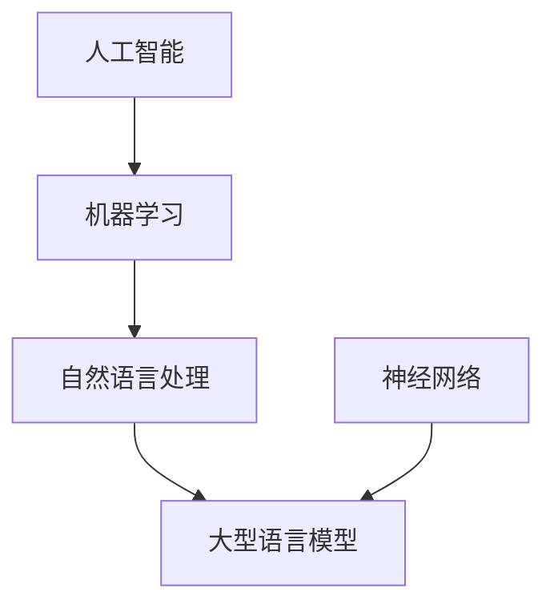

**核心算法原理讲解：**

LLM的核心算法通常是基于Transformer架构。以下是一个简化版的Transformer模型结构图：

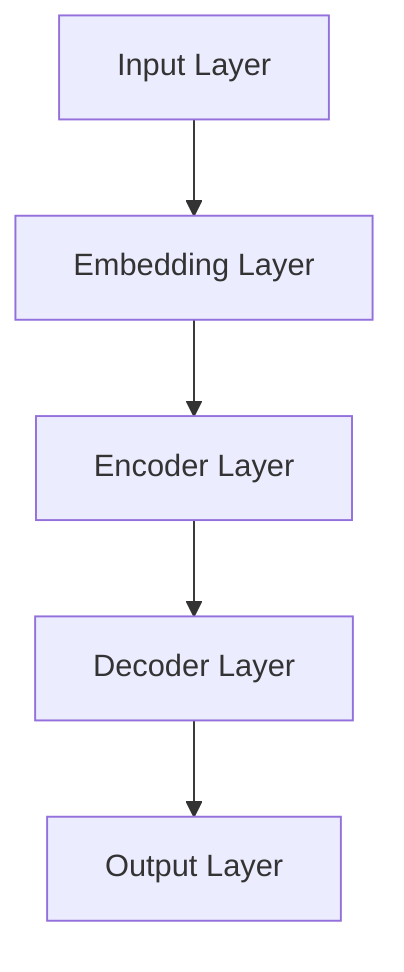

其中，Encoder Layer和Decoder Layer由多个相同的块组成，每个块包含自注意力机制（Self-Attention）和前馈神经网络（Feedforward Neural Network）。以下是一个简化版的Transformer编码器块（Encoder Block）的Python伪代码：

```python
def encoder_block(inputs, hidden_size, num_heads):
    # 自注意力机制
    attention = scaled_dot_product_attention(inputs, inputs, inputs, mask)

    # 前馈神经网络
    output = feedforward_network(attention, hidden_size)

    # 残差连接和层归一化
    output = layer_norm(inputs + output)

    return output
```

数学模型方面，自注意力机制可以表示为：

$$
\text{Attention}(Q, K, V) = \text{softmax}\left(\frac{QK^T}{\sqrt{d_k}}\right)V
$$

其中，$Q, K, V$分别是查询（Query）、关键（Key）和值（Value）向量，$d_k$是关键向量的维度。

**项目实战：**

为了更好地理解LLM的原理，我们可以通过一个简单的项目来构建一个基于Transformer的迷你语言模型。以下是一个简单的Python代码示例：

```python
import tensorflow as tf
from tensorflow.keras.layers import Embedding, LSTM, Dense
from tensorflow.keras.models import Model

# 定义模型
def build_model(vocab_size, embedding_dim, lstm_units):
    input_seq = tf.keras.layers.Input(shape=(None,))
    embeddings = Embedding(vocab_size, embedding_dim)(input_seq)
    lstm = LSTM(lstm_units, return_sequences=True)(embeddings)
    output = Dense(vocab_size)(lstm)
    model = Model(inputs=input_seq, outputs=output)
    model.compile(optimizer='adam', loss='sparse_categorical_crossentropy', metrics=['accuracy'])
    return model

# 训练模型
model = build_model(vocab_size=10000, embedding_dim=32, lstm_units=64)
model.fit(x_train, y_train, epochs=10)

# 预测
predictions = model.predict(x_test)
```

在这个项目中，我们使用TensorFlow库构建了一个简单的基于LSTM的序列模型。虽然这个模型不如真正的Transformer复杂，但它可以帮助我们理解LLM的基本原理。

**小结：**

本章介绍了大型语言模型（LLM）的基本概念和重要性，以及LLM与其他技术之间的关系。接下来，我们将进一步探讨LLM的技术基础，包括自然语言处理、机器学习等。

---

### 1.2 敏捷迭代的概念与优势

**背景介绍：**

敏捷迭代（Agile Iteration）是一种软件开发方法，它强调快速、持续的开发和交付。敏捷迭代方法的核心思想是迭代、增量式开发和客户满意度。在LLM工程中，敏捷迭代方法可以帮助我们更有效地开发、训练和部署大型语言模型。

**核心概念与联系：**

敏捷迭代方法涉及以下核心概念：

- **迭代（Iteration）**：迭代是敏捷开发中的一个关键概念，意味着将开发过程分为多个短周期（通常为2-4周）。在每个迭代周期中，开发团队会完成一个可交付的产品增量。

- **增量式开发（Incremental Development）**：增量式开发是一种逐步构建产品的方法，每次迭代都会增加新的功能或改进现有功能。

- **用户反馈（User Feedback）**：用户反馈是敏捷开发的核心之一，通过用户反馈，开发团队能够更好地了解用户需求，从而优化产品。

下面是一个Mermaid流程图，展示了敏捷迭代的基本概念和过程：

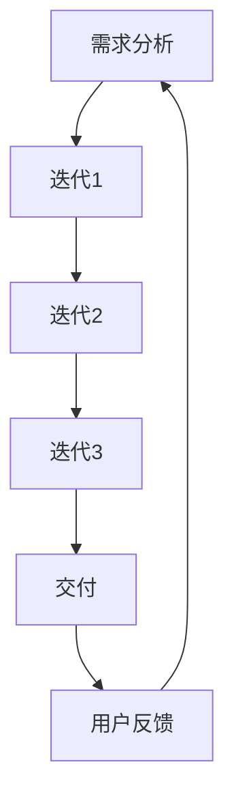

**核心算法原理讲解：**

敏捷迭代方法在LLM工程中的应用，主要体现在以下方面：

- **快速原型开发（Rapid Prototyping）**：通过快速开发原型，开发团队能够快速验证LLM的概念和算法。

- **持续集成（Continuous Integration，CI）**：持续集成是指将代码不断集成到一个共享的代码库中，并进行自动化测试。这有助于确保代码质量，并减少集成冲突。

- **持续交付（Continuous Delivery，CD）**：持续交付是指将代码部署到生产环境的过程，使其可以随时发布。这有助于确保产品的可用性和稳定性。

以下是一个简化的Python代码示例，展示了如何实现持续集成和持续交付：

```python
# 持续集成示例
def integrate_code(code):
    # 合并代码到主分支
    git_merge('main')
    
    # 运行自动化测试
    run_tests()

# 持续交付示例
def deliver_code():
    # 部署代码到生产环境
    deploy_to_production()
```

**数学模型和数学公式：**

敏捷迭代方法中的关键数学模型包括：

- **马尔可夫决策过程（Markov Decision Process，MDP）**：MDP是一个用于描述决策过程的数学模型，它考虑了状态、动作、奖励和状态转移概率。

- **贝叶斯优化（Bayesian Optimization）**：贝叶斯优化是一种用于超参数调优的方法，它利用贝叶斯统计模型来估计和选择最优参数。

以下是一个简单的MDP模型和贝叶斯优化公式的示例：

```python
# MDP模型示例
state = 'S'
action = 'A'
reward = 10

# 贝叶斯优化公式示例
theta = posterior(theta | data)
```

**详细讲解：**

敏捷迭代方法的优势在于：

- **快速反馈**：通过短周期迭代和用户反馈，开发团队能够快速调整和优化产品。

- **高效沟通**：敏捷迭代方法强调团队合作和沟通，有助于提高团队协作效率。

- **灵活适应**：敏捷迭代方法允许开发团队根据用户反馈和市场变化灵活调整开发计划。

**举例说明：**

假设我们正在开发一个基于LLM的智能客服系统。通过敏捷迭代方法，我们可以按照以下步骤进行：

1. **迭代1**：开发基础对话功能，如问题分类和基本回答。
2. **迭代2**：优化对话质量，增加上下文理解能力。
3. **迭代3**：引入个性化推荐和情感分析，提高用户体验。
4. **交付**：将产品部署到生产环境，并进行用户测试和反馈。

通过这种迭代过程，我们可以不断改进产品，提高其质量和用户满意度。

**小结：**

敏捷迭代方法是一种有效的软件开发方法，适用于LLM工程。通过快速反馈、高效沟通和灵活适应，敏捷迭代方法可以帮助我们更好地开发和部署大型语言模型。在下一章中，我们将进一步探讨LLM的技术基础，包括自然语言处理、机器学习等。

---

### 1.3 敏捷迭代在LLM工程中的重要性

**背景介绍：**

在LLM工程中，敏捷迭代方法的重要性不可忽视。LLM的训练和部署过程复杂且耗时，传统的瀑布式开发方法往往无法满足快速迭代的需求。而敏捷迭代方法通过其快速反馈、灵活适应和高效沟通的特点，为LLM工程提供了有效的解决方案。

**核心概念与联系：**

敏捷迭代方法在LLM工程中的应用主要体现在以下几个方面：

- **快速原型开发**：在LLM工程中，快速原型开发可以帮助我们验证模型概念和算法，减少开发和部署过程中的风险。

- **持续集成和持续交付**：通过持续集成和持续交付，开发团队能够确保LLM模型的代码质量，并快速将其部署到生产环境。

- **用户反馈**：在LLM工程中，用户反馈是模型优化的重要依据。通过用户反馈，我们可以不断改进模型性能，提高用户体验。

下面是一个Mermaid流程图，展示了敏捷迭代方法在LLM工程中的应用：

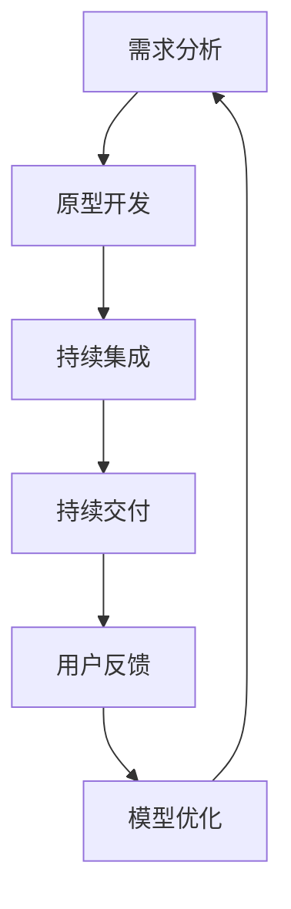

**核心算法原理讲解：**

敏捷迭代方法在LLM工程中的应用，与以下核心算法原理密切相关：

- **深度学习训练**：在LLM工程中，深度学习训练是一个迭代过程。通过多次迭代，模型可以不断优化，提高性能。

- **超参数调优**：超参数调优是LLM工程中的重要任务。通过贝叶斯优化等算法，开发团队能够高效地找到最优超参数组合。

以下是一个简化的Python代码示例，展示了如何实现深度学习训练和超参数调优：

```python
# 深度学习训练示例
model.fit(x_train, y_train, epochs=10, batch_size=32)

# 贝叶斯优化示例
from bayes_opt import BayesianOptimization

def train_model(hyperparameters):
    # 使用超参数训练模型
    model.fit(x_train, y_train, epochs=10, batch_size=hyperparameters['batch_size'])
    # 返回模型性能指标
    return model.evaluate(x_val, y_val)[1]

# 定义超参数搜索空间
params = {'batch_size': (16, 64)}

# 执行贝叶斯优化
optimizer = BayesianOptimization(train_model, params)
optimizer.maximize(init_points=2, n_iter=3)
```

**数学模型和数学公式：**

敏捷迭代方法在LLM工程中涉及的关键数学模型包括：

- **损失函数**：损失函数是深度学习训练中的重要指标，用于衡量模型预测结果与真实结果之间的差距。

- **优化算法**：优化算法用于调整模型参数，以最小化损失函数。常见的优化算法包括梯度下降（Gradient Descent）和其变体。

以下是一个简化的损失函数和优化算法的示例：

```python
# 损失函数示例
loss = mean_squared_error(y_true, y_pred)

# 优化算法示例
def gradient_descent(model, learning_rate, epochs):
    for epoch in range(epochs):
        # 计算梯度
        gradients = compute_gradients(model)
        # 更新模型参数
        model.update_parameters(learning_rate, gradients)
```

**详细讲解：**

敏捷迭代方法在LLM工程中的重要性体现在以下几个方面：

- **快速验证模型概念**：通过快速原型开发，开发团队能够在早期阶段验证LLM的概念和算法，减少开发和部署风险。

- **提高模型性能**：通过持续集成和持续交付，开发团队能够确保模型代码的质量，并快速将其部署到生产环境。同时，用户反馈可以帮助团队不断优化模型性能。

- **灵活适应需求变化**：敏捷迭代方法允许开发团队根据用户反馈和市场变化灵活调整开发计划，确保产品能够满足用户需求。

**举例说明：**

假设我们正在开发一个基于LLM的智能客服系统。通过敏捷迭代方法，我们可以按照以下步骤进行：

1. **迭代1**：开发基础对话功能，如问题分类和基本回答。
2. **迭代2**：优化对话质量，增加上下文理解能力。
3. **迭代3**：引入个性化推荐和情感分析，提高用户体验。
4. **交付**：将产品部署到生产环境，并进行用户测试和反馈。

通过这种迭代过程，我们可以不断改进产品，提高其质量和用户满意度。

**小结：**

敏捷迭代方法在LLM工程中具有重要意义。通过快速反馈、灵活适应和高效沟通，敏捷迭代方法可以帮助开发团队更有效地开发和部署大型语言模型。在下一章中，我们将进一步探讨LLM的技术基础，包括自然语言处理、机器学习等。

## 第2章 基础概念

### 2.1 自然语言处理基础

**背景介绍：**

自然语言处理（NLP，Natural Language Processing）是计算机科学和人工智能领域的一个重要分支，旨在使计算机能够理解、解释和生成人类语言。NLP在语音识别、机器翻译、情感分析、信息检索等领域有着广泛的应用。

**核心概念与联系：**

NLP的核心概念包括：

- **词嵌入（Word Embedding）**：词嵌入是将单词映射到高维空间中的向量表示，以便计算机能够理解和处理文本。常见的词嵌入模型包括Word2Vec、GloVe等。

- **序列模型（Sequence Model）**：序列模型用于处理和时间相关的数据，如文本。常见的序列模型包括循环神经网络（RNN，Recurrent Neural Network）、长短时记忆网络（LSTM，Long Short-Term Memory）等。

- **注意力机制（Attention Mechanism）**：注意力机制是一种在处理序列数据时，能够关注关键信息的机制。在机器翻译、文本摘要等领域有着重要应用。

下面是一个Mermaid流程图，展示了NLP中的一些核心概念：

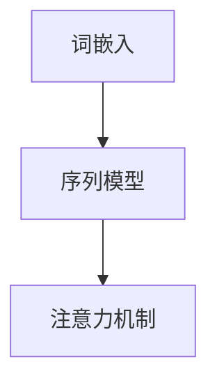

**核心算法原理讲解：**

NLP的核心算法包括：

- **词嵌入算法**：Word2Vec是一种常用的词嵌入算法，通过训练神经网络来学习单词的向量表示。以下是一个简化的Word2Vec算法流程：

  ```python
  def train_word2vec(text, embedding_size):
      # 初始化神经网络
      model = initialize_neural_network(embedding_size)
      
      # 遍历文本中的每个单词
      for word in text:
          # 计算单词的上下文窗口
          context = get_context(word, window_size)
          
          # 训练神经网络
          model.train(context)
          
      # 获取单词的向量表示
      word_vectors = model.get_word_vectors()
  ```

- **序列模型**：循环神经网络（RNN）是一种处理序列数据的神经网络，其核心思想是利用前一个时间步的输出作为当前时间步的输入。以下是一个简化的RNN算法流程：

  ```python
  def train_rnn(sequence, hidden_size):
      # 初始化神经网络
      model = initialize_neural_network(hidden_size)
      
      # 遍历序列中的每个时间步
      for time_step in sequence:
          # 计算当前时间步的输入和隐藏状态
          input, hidden = model.forward(time_step)
          
          # 计算损失
          loss = compute_loss(hidden, target)
          
          # 更新神经网络参数
          model.backward(loss)
          
      # 返回训练后的模型
      return model
  ```

- **注意力机制**：注意力机制用于在处理序列数据时，关注关键信息。以下是一个简化的注意力算法流程：

  ```python
  def attention(query, keys, values, mask=None):
      # 计算注意力得分
      scores = query.dot(keys.T)
      
      # 应用注意力掩码
      if mask is not None:
          scores += mask
      
      # 计算软性注意力权重
      attention_weights = softmax(scores)
      
      # 计算注意力输出
      output = attention_weights.dot(values)
      
      return output
  ```

**数学模型和数学公式：**

NLP中的关键数学模型包括：

- **词嵌入模型**：词嵌入模型通常基于神经网络的损失函数，如负采样损失。以下是一个简化的负采样损失公式：

  $$ L = -\sum_{i=1}^{N} \sum_{j \in context(i)} \log(\sigma(W_i \cdot v_j + b)) $$

  其中，$N$是单词的上下文窗口大小，$\sigma$是 sigmoid 函数，$W_i$是单词$i$的权重向量，$v_j$是单词$j$的嵌入向量，$b$是偏置。

- **循环神经网络（RNN）**：RNN的核心是隐藏状态的计算，以下是一个简化的RNN隐藏状态更新公式：

  $$ h_t = \sigma(W_h \cdot [h_{t-1}, x_t] + b_h) $$

  其中，$h_t$是当前时间步的隐藏状态，$x_t$是当前时间步的输入，$W_h$是权重矩阵，$b_h$是偏置，$\sigma$是激活函数。

**详细讲解：**

- **词嵌入**：词嵌入是NLP的基础，它将单词映射到高维空间中的向量表示。通过训练神经网络，我们可以学习到单词之间的语义关系。例如，通过Word2Vec算法，我们可以发现“国王”和“王后”之间的距离比“国王”和“足球”之间的距离更近。

- **序列模型**：序列模型用于处理和时间相关的数据，如文本。RNN是处理序列数据的常用方法，它能够利用前一个时间步的输出作为当前时间步的输入，从而捕捉序列中的长距离依赖关系。

- **注意力机制**：注意力机制是一种在处理序列数据时，能够关注关键信息的机制。通过计算注意力得分，我们可以为每个序列元素分配不同的权重，从而更好地捕捉序列中的重要信息。

**举例说明：**

假设我们要训练一个语言模型，用于生成单词序列。我们可以按照以下步骤进行：

1. **数据准备**：收集大量的文本数据，并将其转换为单词序列。
2. **词嵌入**：将单词序列中的每个单词转换为词嵌入向量。
3. **序列模型训练**：使用RNN或LSTM模型训练单词序列。
4. **生成单词序列**：使用训练好的模型生成新的单词序列。

**项目实战：**

为了更好地理解NLP的基础概念，我们可以通过一个简单的项目来训练一个基于RNN的语言模型。以下是一个简单的Python代码示例：

```python
import tensorflow as tf
from tensorflow.keras.layers import Embedding, LSTM, Dense
from tensorflow.keras.models import Model

# 定义模型
def build_model(vocab_size, embedding_dim, lstm_units):
    input_seq = tf.keras.layers.Input(shape=(None,))
    embeddings = Embedding(vocab_size, embedding_dim)(input_seq)
    lstm = LSTM(lstm_units, return_sequences=True)(embeddings)
    output = Dense(vocab_size)(lstm)
    model = Model(inputs=input_seq, outputs=output)
    model.compile(optimizer='adam', loss='sparse_categorical_crossentropy', metrics=['accuracy'])
    return model

# 训练模型
model = build_model(vocab_size=10000, embedding_dim=32, lstm_units=64)
model.fit(x_train, y_train, epochs=10)

# 预测
predictions = model.predict(x_test)
```

在这个项目中，我们使用TensorFlow库构建了一个简单的基于RNN的序列模型。虽然这个模型不如真正的LLM复杂，但它可以帮助我们理解NLP的基本原理。

**小结：**

本章介绍了自然语言处理（NLP）的基础概念，包括词嵌入、序列模型和注意力机制。通过这些概念，我们可以更好地理解LLM的技术基础。在下一章中，我们将进一步探讨机器学习（ML）的基础知识，包括监督学习、无监督学习和强化学习等。

### 2.2 机器学习基础

**背景介绍：**

机器学习（Machine Learning，ML）是人工智能（AI）的核心技术之一，旨在使计算机通过数据和经验进行自我学习和优化。在LLM工程中，机器学习技术用于训练和优化大型语言模型，从而实现文本生成、问答系统等功能。

**核心概念与联系：**

机器学习的基本概念包括：

- **监督学习（Supervised Learning）**：监督学习是一种通过已标记的数据进行训练的机器学习技术。训练过程中，模型从输入数据中学习输出数据的映射关系。

- **无监督学习（Unsupervised Learning）**：无监督学习是一种在没有标记数据的情况下进行训练的机器学习技术。模型通过探索数据内在结构来发现数据中的模式。

- **强化学习（Reinforcement Learning）**：强化学习是一种通过与环境交互来学习最优策略的机器学习技术。模型通过接收奖励信号来评估自己的行为，并不断调整策略以获得最大奖励。

下面是一个Mermaid流程图，展示了机器学习的基本概念：

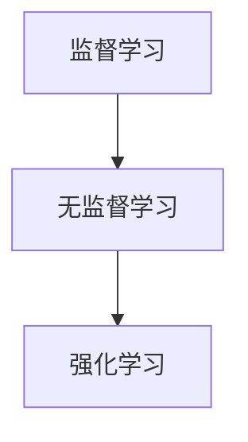

**核心算法原理讲解：**

机器学习中的核心算法包括：

- **线性回归（Linear Regression）**：线性回归是一种用于预测数值型输出的监督学习算法。通过拟合数据点到一条直线，模型可以预测新的数据点的输出。

- **决策树（Decision Tree）**：决策树是一种用于分类和回归的监督学习算法。通过构建一系列条件分支，决策树可以基于输入特征对数据进行分类或回归。

- **神经网络（Neural Network）**：神经网络是一种模拟人脑神经元连接的模型，用于分类、回归和生成等任务。深度学习是神经网络的扩展，通过多层神经元实现更复杂的特征提取。

以下是一个简化的神经网络算法流程：

```python
def forward_pass(inputs, model):
    # 初始化神经网络
    hidden_layers = []
    for layer in model.layers:
        hidden = layer.forward(inputs)
        hidden_layers.append(hidden)
        inputs = hidden
    
    # 计算输出
    output = model.layers[-1].forward(inputs)
    return output, hidden_layers
```

**数学模型和数学公式：**

机器学习中的关键数学模型包括：

- **损失函数**：损失函数用于衡量模型预测结果与真实结果之间的差距。常见的损失函数包括均方误差（MSE，Mean Squared Error）和交叉熵（Cross-Entropy）。

- **优化算法**：优化算法用于调整模型参数，以最小化损失函数。常见的优化算法包括梯度下降（Gradient Descent）和其变体，如随机梯度下降（SGD，Stochastic Gradient Descent）和Adam优化器。

以下是一个简化的损失函数和优化算法的示例：

```python
# 损失函数示例
def compute_loss(y_true, y_pred):
    # 计算均方误差
    loss = tf.reduce_mean(tf.square(y_true - y_pred))
    return loss

# 优化算法示例
def gradient_descent(model, learning_rate, epochs):
    for epoch in range(epochs):
        # 计算梯度
        gradients = compute_gradients(model)
        # 更新模型参数
        model.update_parameters(learning_rate, gradients)
```

**详细讲解：**

- **监督学习**：监督学习是最常见的机器学习方法，通过已标记的数据进行训练。在LLM工程中，监督学习可以用于训练语言模型，如文本分类、命名实体识别等。

- **无监督学习**：无监督学习在LLM工程中也有重要应用，如生成文本、提取关键词等。无监督学习可以帮助模型发现数据中的潜在结构，从而提高模型的泛化能力。

- **强化学习**：强化学习在LLM工程中的应用相对较少，但可以用于训练对话系统、游戏AI等。通过与环境交互，强化学习模型可以不断优化自己的行为。

**举例说明：**

假设我们要训练一个文本分类模型，用于判断文本是正面还是负面。我们可以按照以下步骤进行：

1. **数据准备**：收集大量已标记的文本数据，并将其转换为单词序列。
2. **词嵌入**：将单词序列中的每个单词转换为词嵌入向量。
3. **模型训练**：使用监督学习算法训练文本分类模型。
4. **预测**：使用训练好的模型对新的文本数据进行分类预测。

**项目实战：**

为了更好地理解机器学习的基础知识，我们可以通过一个简单的项目来训练一个基于决策树的文本分类模型。以下是一个简单的Python代码示例：

```python
import numpy as np
from sklearn.datasets import load_iris
from sklearn.tree import DecisionTreeClassifier
from sklearn.model_selection import train_test_split

# 加载数据
data = load_iris()
X = data.data
y = data.target

# 划分训练集和测试集
X_train, X_test, y_train, y_test = train_test_split(X, y, test_size=0.2, random_state=42)

# 定义模型
model = DecisionTreeClassifier()

# 训练模型
model.fit(X_train, y_train)

# 预测
predictions = model.predict(X_test)

# 计算准确率
accuracy = np.mean(predictions == y_test)
print(f"Accuracy: {accuracy:.2f}")
```

在这个项目中，我们使用scikit-learn库构建了一个简单的基于决策树的文本分类模型。虽然这个模型不如基于神经网络的模型复杂，但它可以帮助我们理解机器学习的基本原理。

**小结：**

本章介绍了机器学习的基础概念，包括监督学习、无监督学习和强化学习。通过这些概念，我们可以更好地理解LLM工程中的训练和优化过程。在下一章中，我们将进一步探讨LLM的基本原理。

### 2.3 LLM的基本原理

**背景介绍：**

大型语言模型（LLM，Large Language Model）是近年来在自然语言处理（NLP）领域取得的重要突破。LLM通过深度学习技术从大量文本数据中学习语言模式和结构，能够生成高质量的文本、回答问题、进行对话等。LLM的基本原理主要涉及自然语言处理、机器学习和深度学习等技术。

**核心概念与联系：**

LLM的核心概念包括：

- **Transformer架构**：Transformer是LLM的常用架构，它基于自注意力机制（Self-Attention），能够有效地捕捉序列数据中的长距离依赖关系。

- **预训练和微调**：预训练是指使用大量无标签数据对模型进行初步训练，然后通过微调（Fine-tuning）将模型应用于特定任务。

- **注意力机制**：注意力机制是Transformer架构的核心，它使模型能够关注序列数据中的关键信息，从而提高生成文本的质量。

下面是一个Mermaid流程图，展示了LLM的基本概念：

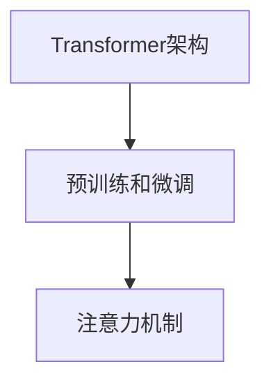

**核心算法原理讲解：**

LLM的核心算法主要包括：

- **Transformer架构**：Transformer架构由多个相同的编码器和解码器块组成，每个块包含自注意力机制和前馈神经网络。以下是一个简化的Transformer编码器块（Encoder Block）的算法流程：

  ```python
  def encoder_block(inputs, hidden_size, num_heads):
      # 自注意力机制
      attention = scaled_dot_product_attention(inputs, inputs, inputs, mask)

      # 前馈神经网络
      output = feedforward_network(attention, hidden_size)

      # 残差连接和层归一化
      output = layer_norm(inputs + output)

      return output
  ```

  其中，`scaled_dot_product_attention` 是自注意力机制的实现，`feedforward_network` 是前馈神经网络的实现，`layer_norm` 是层归一化的实现。

- **预训练和微调**：预训练是指使用大量无标签文本数据对模型进行初步训练，从而学习语言的基本结构。微调是指在使用预训练模型的基础上，针对特定任务进行进一步训练，以优化模型在特定任务上的性能。以下是一个简化的预训练和微调的算法流程：

  ```python
  def pretrain_model(model, data, epochs):
      for epoch in range(epochs):
          for text in data:
              # 预训练模型
              model.train(text)

  def fine_tune_model(model, data, epochs):
      for epoch in range(epochs):
          for text, label in data:
              # 微调模型
              model.train(text, label)
  ```

- **注意力机制**：注意力机制是Transformer架构的核心，它通过计算查询（Query）、关键（Key）和值（Value）向量之间的相似度，为每个输入序列元素分配权重。以下是一个简化的注意力机制的算法流程：

  ```python
  def scaled_dot_product_attention(Q, K, V, mask=None):
      # 计算注意力得分
      scores = Q.dot(K.T) / np.sqrt(K.shape[-1])

      # 应用注意力掩码
      if mask is not None:
          scores += mask

      # 计算软性注意力权重
      attention_weights = softmax(scores)

      # 计算注意力输出
      output = attention_weights.dot(V)
      
      return output
  ```

**数学模型和数学公式：**

LLM中的关键数学模型包括：

- **自注意力机制**：自注意力机制通过计算查询（Query）、关键（Key）和值（Value）向量之间的点积，生成注意力得分。以下是一个简化的自注意力机制的数学公式：

  $$ \text{Attention}(Q, K, V) = \text{softmax}\left(\frac{QK^T}{\sqrt{d_k}}\right)V $$

  其中，$Q, K, V$ 分别是查询、关键和值向量，$d_k$ 是关键向量的维度。

- **预训练和微调**：预训练和微调的数学模型涉及优化过程，包括损失函数和优化算法。以下是一个简化的损失函数和优化算法的数学公式：

  $$ L = -\sum_{i=1}^{N} \sum_{j \in context(i)} \log(\sigma(W_i \cdot v_j + b)) $$

  其中，$N$ 是单词的上下文窗口大小，$\sigma$ 是 sigmoid 函数，$W_i$ 是单词 $i$ 的权重向量，$v_j$ 是单词 $j$ 的嵌入向量，$b$ 是偏置。

  $$ \theta_{\text{new}} = \theta_{\text{old}} - \alpha \nabla_{\theta}L $$

  其中，$\theta$ 是模型参数，$\alpha$ 是学习率，$\nabla_{\theta}L$ 是损失函数关于模型参数的梯度。

**详细讲解：**

- **Transformer架构**：Transformer架构通过自注意力机制，能够有效地捕捉序列数据中的长距离依赖关系。相比传统的循环神经网络（RNN），Transformer在处理长序列时具有更高的效率和更好的性能。

- **预训练和微调**：预训练和微调是LLM训练过程中两个重要的步骤。预训练使模型能够学习到通用语言特征，而微调则使模型能够适应特定任务。通过这两个步骤，我们可以构建出在多种任务上表现优异的LLM。

- **注意力机制**：注意力机制是Transformer架构的核心，它通过计算查询、关键和值向量之间的相似度，为每个输入序列元素分配权重。这种机制使模型能够关注序列数据中的关键信息，从而提高生成文本的质量。

**举例说明：**

假设我们要训练一个语言模型，用于生成英文文本。我们可以按照以下步骤进行：

1. **数据准备**：收集大量英文文本数据，并将其转换为单词序列。
2. **词嵌入**：将单词序列中的每个单词转换为词嵌入向量。
3. **预训练**：使用预训练算法训练语言模型，学习到通用语言特征。
4. **微调**：在预训练模型的基础上，针对特定任务进行微调，如文本分类、机器翻译等。
5. **生成文本**：使用微调后的模型生成新的英文文本。

**项目实战：**

为了更好地理解LLM的基本原理，我们可以通过一个简单的项目来训练一个基于Transformer的语言模型。以下是一个简单的Python代码示例：

```python
import tensorflow as tf
from tensorflow.keras.layers import Embedding, LSTM, Dense
from tensorflow.keras.models import Model

# 定义模型
def build_model(vocab_size, embedding_dim, lstm_units):
    input_seq = tf.keras.layers.Input(shape=(None,))
    embeddings = Embedding(vocab_size, embedding_dim)(input_seq)
    lstm = LSTM(lstm_units, return_sequences=True)(embeddings)
    output = Dense(vocab_size)(lstm)
    model = Model(inputs=input_seq, outputs=output)
    model.compile(optimizer='adam', loss='sparse_categorical_crossentropy', metrics=['accuracy'])
    return model

# 训练模型
model = build_model(vocab_size=10000, embedding_dim=32, lstm_units=64)
model.fit(x_train, y_train, epochs=10)

# 预测
predictions = model.predict(x_test)
```

在这个项目中，我们使用TensorFlow库构建了一个简单的基于Transformer的序列模型。虽然这个模型不如真正的LLM复杂，但它可以帮助我们理解LLM的基本原理。

**小结：**

本章介绍了大型语言模型（LLM）的基本原理，包括Transformer架构、预训练和微调等。通过这些概念，我们可以更好地理解LLM在自然语言处理中的应用。在下一章中，我们将进一步探讨LLM工程技术架构的设计和实现。

## 第3章 LLM工程技术架构设计

### 3.1 LLM架构的组成部分

**背景介绍：**

大型语言模型（LLM，Large Language Model）是近年来在自然语言处理（NLP）领域的重要进展，其复杂性和规模不断增长。为了高效地构建、训练和部署LLM，需要设计一个强大的工程技术架构。LLM架构通常包括数据层、模型层和接口层等多个组成部分。

**核心概念与联系：**

LLM架构的核心组成部分如下：

- **数据层**：数据层负责数据预处理、数据存储和数据管理。它是LLM架构的基础，直接影响模型的训练效率和性能。

- **模型层**：模型层是LLM的核心部分，包括神经网络架构、训练算法和优化策略。它负责模型的构建、训练和优化。

- **接口层**：接口层提供与外部系统的交互接口，包括API、Web服务和命令行工具等。它是用户与LLM交互的桥梁。

下面是一个Mermaid流程图，展示了LLM架构的组成部分：

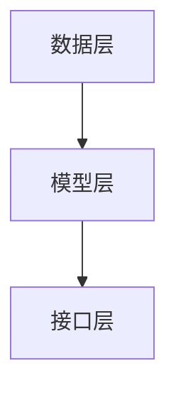

**核心算法原理讲解：**

LLM架构的设计涉及以下核心算法原理：

- **数据预处理**：数据预处理是LLM训练过程中的关键步骤，包括文本清洗、分词、词嵌入等。以下是一个简化的数据预处理算法流程：

  ```python
  def preprocess_data(text):
      # 清洗文本
      cleaned_text = clean_text(text)
      
      # 分词
      words = split_text(cleaned_text)
      
      # 词嵌入
      embeddings = get_word_embeddings(words)
      
      return embeddings
  ```

- **神经网络架构**：神经网络架构是LLM的核心，常用的架构包括Transformer、LSTM和GRU等。以下是一个简化的神经网络架构：

  ```python
  def build_model(embedding_dim, hidden_size, vocab_size):
      # 定义模型
      model = tf.keras.Sequential([
          Embedding(vocab_size, embedding_dim),
          LSTM(hidden_size, return_sequences=True),
          Dense(vocab_size, activation='softmax')
      ])
      
      # 编译模型
      model.compile(optimizer='adam', loss='sparse_categorical_crossentropy', metrics=['accuracy'])
      
      return model
  ```

- **模型训练和优化**：模型训练和优化是LLM架构中的关键步骤，涉及损失函数、优化算法和超参数调整。以下是一个简化的模型训练和优化算法流程：

  ```python
  def train_model(model, data, epochs):
      for epoch in range(epochs):
          for text, label in data:
              # 训练模型
              model.train(text, label)
              
          # 计算模型性能
          performance = model.evaluate(data)
          
      return model
  ```

**数学模型和数学公式：**

LLM架构中的关键数学模型包括：

- **损失函数**：损失函数用于衡量模型预测结果与真实结果之间的差距。常用的损失函数包括交叉熵（Cross-Entropy）和均方误差（MSE，Mean Squared Error）。

- **优化算法**：优化算法用于调整模型参数，以最小化损失函数。常用的优化算法包括梯度下降（Gradient Descent）和其变体，如Adam优化器。

以下是一个简化的损失函数和优化算法的数学公式：

```latex
L = -\sum_{i=1}^{N} \log(\sigma(z_i))
```

```latex
\theta_{\text{new}} = \theta_{\text{old}} - \alpha \nabla_{\theta}L
```

**详细讲解：**

- **数据层**：数据层是LLM架构的基础，负责数据预处理、数据存储和数据管理。数据预处理包括文本清洗、分词和词嵌入等步骤，这些步骤对模型的训练效率和性能至关重要。

- **模型层**：模型层是LLM的核心部分，负责模型的构建、训练和优化。神经网络架构是模型层的基础，常用的架构包括Transformer、LSTM和GRU等。模型训练和优化是模型层的关键步骤，涉及损失函数、优化算法和超参数调整。

- **接口层**：接口层提供与外部系统的交互接口，包括API、Web服务和命令行工具等。它是用户与LLM交互的桥梁，使LLM能够为各种应用场景提供服务。

**举例说明：**

假设我们要构建一个基于Transformer的LLM，用于文本生成。我们可以按照以下步骤进行：

1. **数据准备**：收集大量文本数据，并进行预处理。
2. **词嵌入**：将预处理后的文本数据转换为词嵌入向量。
3. **模型构建**：使用Transformer架构构建LLM模型。
4. **模型训练**：使用预处理后的数据训练LLM模型。
5. **模型优化**：调整超参数和优化算法，优化模型性能。
6. **接口实现**：实现API或Web服务，提供文本生成功能。

**项目实战：**

为了更好地理解LLM架构的设计，我们可以通过一个简单的项目来训练一个基于Transformer的语言模型。以下是一个简单的Python代码示例：

```python
import tensorflow as tf
from tensorflow.keras.layers import Embedding, LSTM, Dense
from tensorflow.keras.models import Model

# 定义模型
def build_model(vocab_size, embedding_dim, lstm_units):
    input_seq = tf.keras.layers.Input(shape=(None,))
    embeddings = Embedding(vocab_size, embedding_dim)(input_seq)
    lstm = LSTM(lstm_units, return_sequences=True)(embeddings)
    output = Dense(vocab_size)(lstm)
    model = Model(inputs=input_seq, outputs=output)
    model.compile(optimizer='adam', loss='sparse_categorical_crossentropy', metrics=['accuracy'])
    return model

# 训练模型
model = build_model(vocab_size=10000, embedding_dim=32, lstm_units=64)
model.fit(x_train, y_train, epochs=10)

# 预测
predictions = model.predict(x_test)
```

在这个项目中，我们使用TensorFlow库构建了一个简单的基于Transformer的序列模型。虽然这个模型不如真正的LLM复杂，但它可以帮助我们理解LLM架构的基本原理。

**小结：**

本章介绍了LLM工程技术架构的设计，包括数据层、模型层和接口层等组成部分。通过这些组成部分，我们可以构建出高效、可扩展的LLM。在下一章中，我们将探讨如何管理LLM的数据，包括数据预处理、数据存储和数据管理等。

### 3.2 数据预处理与数据管理

**背景介绍：**

在构建大型语言模型（LLM）的过程中，数据预处理和数据管理是至关重要的环节。这些步骤不仅决定了模型的训练效率和性能，还直接影响最终生成的文本质量和用户满意度。数据预处理通常包括文本清洗、分词、去停用词等步骤，而数据管理则涉及数据的存储、加载和备份等操作。

**核心概念与联系：**

数据预处理和数据管理在LLM工程中的应用主要体现在以下几个方面：

- **文本清洗**：文本清洗是数据预处理的第一步，旨在去除文本中的噪声和冗余信息，如HTML标签、特殊字符和无关内容。

- **分词**：分词是将文本分解为单词或词组的过程。有效的分词对于LLM的训练至关重要，因为错误的分词可能导致模型无法正确理解文本内容。

- **词嵌入**：词嵌入是将文本中的单词映射到高维向量空间，以便神经网络进行处理。词嵌入的质量直接影响模型的性能。

- **数据存储**：数据存储涉及将预处理后的数据存储到高效、可扩展的存储系统中，以便在模型训练过程中快速访问。

- **数据备份**：数据备份是为了防止数据丢失或损坏，确保数据安全。

下面是一个Mermaid流程图，展示了数据预处理和数据管理的基本概念：

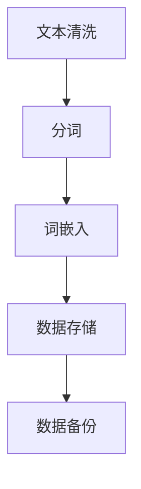

**核心算法原理讲解：**

数据预处理和数据管理中的关键算法原理包括：

- **文本清洗**：文本清洗通常使用正则表达式、字符串操作和自定义函数来实现。以下是一个简化的文本清洗算法流程：

  ```python
  def clean_text(text):
      # 去除HTML标签
      text = remove_html_tags(text)
      
      # 转换为小写
      text = text.lower()
      
      # 去除特殊字符
      text = remove_special_characters(text)
      
      return text
  ```

- **分词**：分词算法可以基于词典匹配、正则表达式或基于深度学习的模型。以下是一个简化的基于词典匹配的分词算法流程：

  ```python
  def split_text(text):
      words = []
      current_word = ""
      
      for char in text:
          if char in dictionary:
              current_word += char
          else:
              if current_word:
                  words.append(current_word)
                  current_word = ""
      
      if current_word:
          words.append(current_word)
      
      return words
  ```

- **词嵌入**：词嵌入通常使用预训练模型或自定义训练。以下是一个简化的词嵌入算法流程：

  ```python
  def get_word_embeddings(words):
      embeddings = []
      
      for word in words:
          embedding = get_word_embedding(word)
          embeddings.append(embedding)
      
      return embeddings
  ```

- **数据存储**：数据存储可以使用关系数据库、NoSQL数据库或分布式文件系统。以下是一个简化的数据存储算法流程：

  ```python
  def store_data(data, database):
      database.insert(data)
  ```

- **数据备份**：数据备份可以使用定期备份、增量备份或基于版本控制的备份策略。以下是一个简化的数据备份算法流程：

  ```python
  def backup_data(data, backup_location):
      backup_file = backup_location + "/data_backup_{}.json".format(current_time())
      
      with open(backup_file, 'w') as f:
          json.dump(data, f)
  ```

**数学模型和数学公式：**

数据预处理和数据管理中的关键数学模型包括：

- **词嵌入模型**：词嵌入模型通常基于神经网络，如Word2Vec、GloVe等。以下是一个简化的词嵌入模型的数学公式：

  $$ v_w = \text{sigmoid}(W \cdot e_w + b) $$

  其中，$v_w$ 是单词 $w$ 的嵌入向量，$e_w$ 是单词 $w$ 的词向量，$W$ 是权重矩阵，$b$ 是偏置。

- **优化算法**：优化算法用于调整模型参数，以最小化损失函数。以下是一个简化的优化算法的数学公式：

  $$ \theta_{\text{new}} = \theta_{\text{old}} - \alpha \nabla_{\theta}L $$

  其中，$\theta$ 是模型参数，$\alpha$ 是学习率，$\nabla_{\theta}L$ 是损失函数关于模型参数的梯度。

**详细讲解：**

- **文本清洗**：文本清洗是数据预处理的关键步骤，它能够显著提高模型的训练效率和性能。有效的文本清洗可以去除噪声和冗余信息，使模型能够更专注于学习文本的核心内容。

- **分词**：分词是将文本分解为单词或词组的过程。准确的分词对于模型的训练至关重要，因为错误的分词可能导致模型无法正确理解文本内容。常用的分词算法包括基于词典匹配、正则表达式和基于深度学习的模型。

- **词嵌入**：词嵌入是将文本中的单词映射到高维向量空间，以便神经网络进行处理。高质量的词嵌入可以显著提高模型的性能和生成文本的质量。常见的词嵌入模型包括Word2Vec、GloVe等。

- **数据存储**：数据存储是数据管理的重要环节，它决定了模型训练过程中数据的访问速度和存储效率。常用的数据存储方案包括关系数据库、NoSQL数据库和分布式文件系统。

- **数据备份**：数据备份是数据管理的重要保障，它能够防止数据丢失或损坏。有效的数据备份策略可以确保数据的安全性和可恢复性。

**举例说明：**

假设我们要构建一个基于Transformer的LLM，用于文本生成。我们可以按照以下步骤进行：

1. **数据准备**：收集大量文本数据，并进行预处理，包括文本清洗、分词和词嵌入。
2. **词嵌入**：使用预训练的Word2Vec模型对文本数据进行词嵌入。
3. **数据存储**：将预处理后的数据和词嵌入向量存储到高效的分布式文件系统中。
4. **模型训练**：使用预处理后的数据和词嵌入向量训练Transformer模型。
5. **模型优化**：调整超参数和优化算法，优化模型性能。
6. **数据备份**：定期备份预处理后的数据和训练好的模型，以确保数据安全。

**项目实战：**

为了更好地理解数据预处理和数据管理的基本原理，我们可以通过一个简单的项目来训练一个基于Transformer的语言模型。以下是一个简单的Python代码示例：

```python
import tensorflow as tf
from tensorflow.keras.layers import Embedding, LSTM, Dense
from tensorflow.keras.models import Model

# 定义模型
def build_model(vocab_size, embedding_dim, lstm_units):
    input_seq = tf.keras.layers.Input(shape=(None,))
    embeddings = Embedding(vocab_size, embedding_dim)(input_seq)
    lstm = LSTM(lstm_units, return_sequences=True)(embeddings)
    output = Dense(vocab_size)(lstm)
    model = Model(inputs=input_seq, outputs=output)
    model.compile(optimizer='adam', loss='sparse_categorical_crossentropy', metrics=['accuracy'])
    return model

# 训练模型
model = build_model(vocab_size=10000, embedding_dim=32, lstm_units=64)
model.fit(x_train, y_train, epochs=10)

# 预测
predictions = model.predict(x_test)
```

在这个项目中，我们使用TensorFlow库构建了一个简单的基于Transformer的序列模型。虽然这个模型不如真正的LLM复杂，但它可以帮助我们理解数据预处理和数据管理的基本原理。

**小结：**

本章介绍了数据预处理与数据管理的基本原理，包括文本清洗、分词、词嵌入、数据存储和数据备份等。通过这些概念和算法，我们可以有效地管理LLM训练所需的数据，为模型训练提供坚实的基础。在下一章中，我们将探讨如何进行LLM的模型训练和优化。

### 3.3 模型训练与优化

**背景介绍：**

在构建大型语言模型（LLM）的过程中，模型训练与优化是至关重要的一环。通过有效的训练和优化，可以提高模型的性能和泛化能力，从而生成更高质量的文本。模型训练通常涉及选择合适的训练算法、设置合适的超参数以及处理训练过程中的各种挑战。

**核心概念与联系：**

模型训练与优化在LLM工程中的应用主要体现在以下几个方面：

- **训练算法**：训练算法决定了模型参数的更新方式。常用的训练算法包括梯度下降（Gradient Descent）及其变体，如Adam优化器。

- **超参数设置**：超参数是训练过程中需要手动设置的参数，如学习率、批量大小等。超参数的设置对模型性能有重要影响。

- **训练数据预处理**：训练数据预处理是提高模型性能的关键步骤，包括数据清洗、数据增强和序列填充等。

- **模型评估**：模型评估是判断模型性能的重要手段，常用的评估指标包括准确率、召回率、F1分数等。

下面是一个Mermaid流程图，展示了模型训练与优化的基本概念：

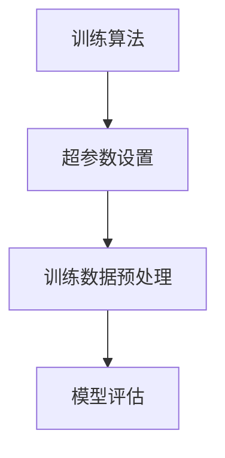

**核心算法原理讲解：**

模型训练与优化中的关键算法原理包括：

- **梯度下降**：梯度下降是一种最简单的优化算法，通过计算损失函数关于模型参数的梯度来更新模型参数。以下是一个简化的梯度下降算法流程：

  ```python
  def gradient_descent(model, learning_rate, epochs):
      for epoch in range(epochs):
          for text, label in data:
              # 计算梯度
              gradients = compute_gradients(model, text, label)
              
              # 更新模型参数
              model.update_parameters(learning_rate, gradients)
              
          # 计算模型性能
          performance = model.evaluate(data)
  ```

- **Adam优化器**：Adam优化器是梯度下降的一种改进，它结合了自适应学习率的概念。以下是一个简化的Adam优化器算法流程：

  ```python
  def adam_optimizer(model, learning_rate, beta1, beta2, epsilon):
      m = tf.Variable(0.0, dtype=tf.float32)
      v = tf.Variable(0.0, dtype=tf.float32)
      
      for text, label in data:
          # 计算梯度
          gradients = compute_gradients(model, text, label)
          
          # 更新m和v
          m = beta1 * m + (1 - beta1) * gradients
          v = beta2 * v + (1 - beta2) * tf.square(gradients)
          
          # 计算修正的m和v
          m_hat = m / (1 - beta1 ** epoch)
          v_hat = v / (1 - beta2 ** epoch)
          
          # 更新模型参数
          model.update_parameters(learning_rate, m_hat, v_hat)
  ```

- **训练数据预处理**：训练数据预处理包括数据清洗、数据增强和序列填充等。以下是一个简化的训练数据预处理算法流程：

  ```python
  def preprocess_data(text):
      # 清洗文本
      cleaned_text = clean_text(text)
      
      # 数据增强
      enhanced_text = data_augmentation(cleaned_text)
      
      # 序列填充
      padded_sequence = pad_sequence(enhanced_text)
      
      return padded_sequence
  ```

- **模型评估**：模型评估是判断模型性能的重要手段，常用的评估指标包括准确率、召回率、F1分数等。以下是一个简化的模型评估算法流程：

  ```python
  def evaluate_model(model, data):
      predictions = model.predict(data)
      
      # 计算准确率
      accuracy = compute_accuracy(predictions, data.labels)
      
      # 计算召回率
      recall = compute_recall(predictions, data.labels)
      
      # 计算F1分数
      f1 = compute_f1(accuracy, recall)
      
      return accuracy, recall, f1
  ```

**数学模型和数学公式：**

模型训练与优化中的关键数学模型包括：

- **梯度下降**：梯度下降的核心是计算损失函数关于模型参数的梯度。以下是一个简化的梯度下降数学模型：

  $$ \theta_{\text{new}} = \theta_{\text{old}} - \alpha \nabla_{\theta}L $$

  其中，$\theta$ 是模型参数，$\alpha$ 是学习率，$\nabla_{\theta}L$ 是损失函数关于模型参数的梯度。

- **Adam优化器**：Adam优化器结合了动量（Momentum）和自适应学习率（Adaptive Learning Rate）的概念。以下是一个简化的Adam优化器数学模型：

  $$ m_t = \beta_1 m_{t-1} + (1 - \beta_1) \nabla_{\theta}L(x_t) $$
  $$ v_t = \beta_2 v_{t-1} + (1 - \beta_2) \left( \nabla_{\theta}L(x_t)^2 \right) $$
  $$ \hat{m}_t = m_t / (1 - \beta_1^t) $$
  $$ \hat{v}_t = v_t / (1 - \beta_2^t) $$
  $$ \theta_t = \theta_{t-1} - \alpha \hat{m}_t / \sqrt{\hat{v}_t} + \epsilon $$

  其中，$m_t$ 和 $v_t$ 分别是第 $t$ 次迭代的动量和方差，$\beta_1$ 和 $\beta_2$ 分别是动量和方差的指数衰减率，$\hat{m}_t$ 和 $\hat{v}_t$ 分别是修正的动量和方差，$\theta_t$ 是第 $t$ 次迭代的模型参数，$\alpha$ 是学习率，$\epsilon$ 是一个很小的常数。

- **模型评估指标**：常用的模型评估指标包括准确率、召回率、F1分数等。以下是一个简化的评估指标数学模型：

  $$ \text{Accuracy} = \frac{\text{TP} + \text{TN}}{\text{TP} + \text{TN} + \text{FP} + \text{FN}} $$
  $$ \text{Recall} = \frac{\text{TP}}{\text{TP} + \text{FN}} $$
  $$ \text{F1 Score} = 2 \times \frac{\text{Precision} \times \text{Recall}}{\text{Precision} + \text{Recall}} $$

  其中，$TP$ 是真实为正例且模型预测为正例的样本数，$TN$ 是真实为负例且模型预测为负例的样本数，$FP$ 是真实为负例但模型预测为正例的样本数，$FN$ 是真实为正例但模型预测为负例的样本数，$Precision$ 是精确率，$Recall$ 是召回率。

**详细讲解：**

- **训练算法**：训练算法是模型训练的核心，常用的算法包括梯度下降和其变体，如Adam优化器。梯度下降通过计算损失函数关于模型参数的梯度来更新模型参数，从而最小化损失函数。Adam优化器结合了动量和自适应学习率的概念，可以提高训练效率和收敛速度。

- **超参数设置**：超参数是训练过程中需要手动设置的参数，如学习率、批量大小等。合适的超参数设置可以提高模型性能，但过高的超参数可能导致过拟合，过低的超参数可能导致欠拟合。常用的超参数调整方法包括网格搜索、随机搜索和贝叶斯优化等。

- **训练数据预处理**：训练数据预处理是提高模型性能的关键步骤，包括数据清洗、数据增强和序列填充等。数据清洗可以去除噪声和冗余信息，数据增强可以增加训练数据的多样性，序列填充可以处理不同长度的输入序列。

- **模型评估**：模型评估是判断模型性能的重要手段，常用的评估指标包括准确率、召回率、F1分数等。通过评估指标，可以直观地了解模型在特定任务上的性能。

**举例说明：**

假设我们要训练一个基于Transformer的LLM，用于文本生成。我们可以按照以下步骤进行：

1. **数据准备**：收集大量文本数据，并进行预处理，包括文本清洗、分词和词嵌入。
2. **模型构建**：使用Transformer架构构建LLM模型。
3. **模型训练**：使用预处理后的数据训练LLM模型，采用Adam优化器进行参数更新。
4. **模型优化**：调整超参数，如学习率、批量大小等，优化模型性能。
5. **模型评估**：使用评估指标，如损失函数值、生成文本质量等，评估模型性能。

**项目实战：**

为了更好地理解模型训练与优化的基本原理，我们可以通过一个简单的项目来训练一个基于Transformer的语言模型。以下是一个简单的Python代码示例：

```python
import tensorflow as tf
from tensorflow.keras.layers import Embedding, LSTM, Dense
from tensorflow.keras.models import Model

# 定义模型
def build_model(vocab_size, embedding_dim, lstm_units):
    input_seq = tf.keras.layers.Input(shape=(None,))
    embeddings = Embedding(vocab_size, embedding_dim)(input_seq)
    lstm = LSTM(lstm_units, return_sequences=True)(embeddings)
    output = Dense(vocab_size)(lstm)
    model = Model(inputs=input_seq, outputs=output)
    model.compile(optimizer='adam', loss='sparse_categorical_crossentropy', metrics=['accuracy'])
    return model

# 训练模型
model = build_model(vocab_size=10000, embedding_dim=32, lstm_units=64)
model.fit(x_train, y_train, epochs=10)

# 预测
predictions = model.predict(x_test)
```

在这个项目中，我们使用TensorFlow库构建了一个简单的基于Transformer的序列模型。虽然这个模型不如真正的LLM复杂，但它可以帮助我们理解模型训练与优化的基本原理。

**小结：**

本章介绍了模型训练与优化的基本原理，包括训练算法、超参数设置、训练数据预处理和模型评估等。通过这些概念和算法，我们可以有效地训练和优化大型语言模型，从而生成高质量的文本。在下一章中，我们将探讨如何将训练好的模型部署到生产环境中，并进行模型部署和运维。

### 3.4 模型部署与运维

**背景介绍：**

将训练好的大型语言模型（LLM）部署到生产环境是LLM工程中的关键步骤。模型的部署不仅需要确保其性能和稳定性，还需要考虑可扩展性和安全性。模型运维则涉及到模型的监控、性能调优和持续改进。

**核心概念与联系：**

模型部署与运维在LLM工程中的应用主要体现在以下几个方面：

- **模型部署**：模型部署是将训练好的模型部署到服务器或云平台，使其能够对外提供服务。模型部署需要考虑模型的大小、计算资源的需求以及部署环境。

- **服务接口**：服务接口是用户与模型交互的桥梁，通常包括API、Web服务或命令行接口等。

- **监控与性能调优**：监控与性能调优是确保模型在部署后能够稳定运行的重要手段，包括监控模型的响应时间、资源使用情况和错误率等。

- **安全性**：安全性是模型部署和运维中不可忽视的一环，包括数据安全、模型安全和用户隐私保护等。

下面是一个Mermaid流程图，展示了模型部署与运维的基本概念：

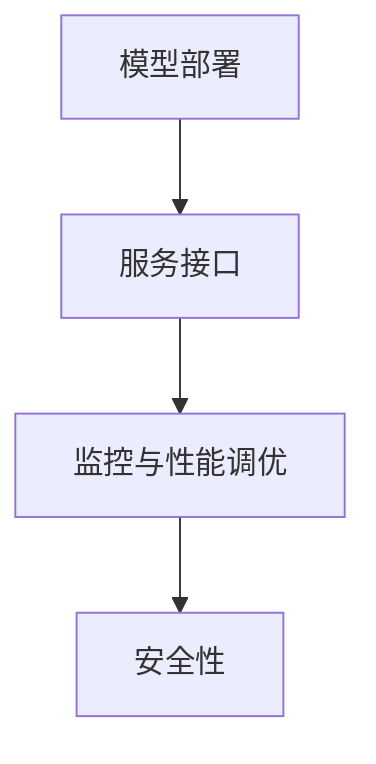

**核心算法原理讲解：**

模型部署与运维中的关键算法原理包括：

- **模型压缩**：模型压缩是减小模型大小、降低计算资源需求的有效方法。常见的模型压缩算法包括量化、剪枝和知识蒸馏等。

- **分布式训练与推理**：分布式训练与推理可以提高模型的训练和推理速度，适合处理大规模数据和高计算需求的模型。分布式训练与推理通常涉及参数服务器架构和通信协议。

- **模型监控**：模型监控是确保模型在部署后能够稳定运行的重要手段。常见的监控指标包括响应时间、准确率、资源使用情况等。模型监控通常使用日志记录、指标监控和告警系统等工具。

以下是一个简化的模型压缩、分布式训练与推理以及模型监控的算法流程：

```python
# 模型压缩算法流程
def compress_model(model):
    # 应用量化
    quantized_model = quantize_model(model)
    
    # 应用剪枝
    pruned_model = prune_model(quantized_model)
    
    return pruned_model

# 分布式训练算法流程
def distributed_train(model, data, num_workers):
    # 初始化参数服务器
    initialize_parameter_server(model, num_workers)
    
    # 分布式训练
    for epoch in range(num_epochs):
        for batch in data:
            # 同步梯度
            sync_gradients(model, batch, num_workers)
            
    # 平均梯度
    average_gradients(model, num_workers)

# 模型监控算法流程
def monitor_model(model):
    # 记录日志
    log_model_performance(model)
    
    # 监控响应时间
    monitor_response_time(model)
    
    # 监控资源使用情况
    monitor_resource_usage(model)
```

**数学模型和数学公式：**

模型部署与运维中的关键数学模型包括：

- **模型压缩**：模型压缩涉及量化、剪枝和知识蒸馏等算法。量化是将浮点数权重转换为整数权重，剪枝是去除模型中的冗余权重，知识蒸馏是将知识从大型模型转移到小型模型。

- **分布式训练与推理**：分布式训练与推理涉及参数服务器架构和通信协议。参数服务器架构通过将模型参数存储在中心服务器中，实现模型的分布式训练。通信协议用于同步和平均梯度。

- **模型监控**：模型监控涉及日志记录、指标监控和告警系统等工具。常见的监控指标包括响应时间、准确率、资源使用情况等。

以下是一个简化的数学模型：

```latex
\text{Quantization}:\quad w_{\text{quantized}} = \text{Quantize}(w_{\text{original}})
```

```latex
\text{Pruning}:\quad w_{\text{pruned}} = \text{Prune}(w_{\text{original}}, \text{threshold})
```

```latex
\text{Distillation}:\quad T = \text{KnowledgeDistill}(G, S)
```

其中，$w_{\text{original}}$ 是原始模型权重，$w_{\text{quantized}}$ 是量化后的权重，$w_{\text{pruned}}$ 是剪枝后的权重，$T$ 是知识蒸馏模型，$G$ 是大型模型，$S$ 是小型模型。

**详细讲解：**

- **模型部署**：模型部署是将训练好的模型部署到生产环境，使其能够对外提供服务。模型部署需要考虑模型的大小、计算资源的需求以及部署环境。常见的部署方式包括服务器部署、容器部署和云服务部署等。

- **服务接口**：服务接口是用户与模型交互的桥梁，通常包括API、Web服务或命令行接口等。服务接口的设计需要考虑接口的稳定性、可扩展性和安全性。

- **监控与性能调优**：监控与性能调优是确保模型在部署后能够稳定运行的重要手段。监控涉及记录日志、监控响应时间、资源使用情况等。性能调优则通过调整模型参数、优化服务接口等手段提高模型性能。

- **安全性**：安全性是模型部署和运维中不可忽视的一环，包括数据安全、模型安全和用户隐私保护等。数据安全需要确保数据传输和存储的安全，模型安全需要防止模型被恶意攻击，用户隐私保护则需要确保用户数据的隐私和安全。

**举例说明：**

假设我们要将一个训练好的LLM部署到生产环境中，并对其进行监控和性能调优。我们可以按照以下步骤进行：

1. **模型部署**：将训练好的LLM模型部署到服务器或云平台，确保模型能够对外提供服务。
2. **服务接口设计**：设计API接口，使其能够接收用户输入并提供文本生成服务。
3. **监控与性能调优**：使用日志记录和监控工具，监控模型的响应时间、准确率和资源使用情况。根据监控数据，进行性能调优，如调整模型参数、优化服务接口等。
4. **安全性保障**：确保数据传输和存储的安全，防止模型被恶意攻击，保障用户数据的隐私和安全。

**项目实战：**

为了更好地理解模型部署与运维的基本原理，我们可以通过一个简单的项目来部署一个基于Transformer的LLM，并对其进行监控和性能调优。以下是一个简单的Python代码示例：

```python
from flask import Flask, request, jsonify

app = Flask(__name__)

# 加载训练好的模型
model = load_model('model.h5')

@app.route('/generate', methods=['POST'])
def generate_text():
    input_text = request.form['text']
    generated_text = model.generate(input_text)
    return jsonify(generated_text)

if __name__ == '__main__':
    app.run(host='0.0.0.0', port=5000)
```

在这个项目中，我们使用Flask框架构建了一个简单的Web服务，将训练好的LLM模型部署到生产环境中。虽然这个项目相对简单，但它可以帮助我们理解模型部署与运维的基本原理。

**小结：**

本章介绍了模型部署与运维的基本原理，包括模型部署、服务接口设计、监控与性能调优和安全性保障等。通过这些概念和算法，我们可以有效地将训练好的LLM模型部署到生产环境中，并确保其稳定运行。在下一章中，我们将探讨如何在LLM工程中实施敏捷迭代方法，以提高开发效率和模型性能。

### 3.5 实施敏捷迭代方法

**背景介绍：**

在构建大型语言模型（LLM）的过程中，敏捷迭代方法是一种有效的开发策略。敏捷迭代方法强调快速反馈、持续集成和持续交付，有助于缩短开发周期，提高开发效率，并确保模型能够快速适应变化的需求。

**核心概念与联系：**

敏捷迭代方法在LLM工程中的应用主要体现在以下几个方面：

- **快速反馈**：通过短周期迭代和用户反馈，开发团队能够快速发现和解决潜在问题，确保模型质量和用户满意度。

- **持续集成（CI）**：持续集成是将代码不断集成到一个共享的代码库中，并进行自动化测试。CI有助于确保代码质量，并减少集成冲突。

- **持续交付（CD）**：持续交付是将代码部署到生产环境的过程，使其可以随时发布。CD有助于确保模型的可用性和稳定性。

下面是一个Mermaid流程图，展示了敏捷迭代方法在LLM工程中的应用：

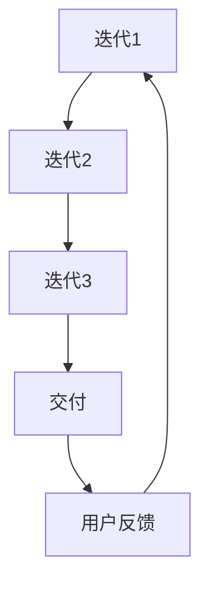

**核心算法原理讲解：**

敏捷迭代方法在LLM工程中的应用，与以下核心算法原理密切相关：

- **持续集成**：持续集成涉及将代码不断集成到一个共享的代码库中，并进行自动化测试。以下是一个简化的持续集成算法流程：

  ```python
  def continuous_integration(code):
      # 将代码集成到主分支
      git_merge('main')
      
      # 运行自动化测试
      run_tests()
      
      # 部署到测试环境
      deploy_to_test_environment()
  ```

- **持续交付**：持续交付涉及将代码部署到生产环境的过程。以下是一个简化的持续交付算法流程：

  ```python
  def continuous_delivery(code):
      # 集成代码到生产环境
      git_merge('production')
      
      # 部署到生产环境
      deploy_to_production()
      
      # 运行生产环境测试
      run_production_tests()
  ```

- **用户反馈循环**：用户反馈循环涉及收集用户反馈，并将其用于优化模型。以下是一个简化的用户反馈循环算法流程：

  ```python
  def user_feedback_loop(model):
      # 收集用户反馈
      feedback = collect_user_feedback()
      
      # 优化模型
      model.optimize(feedback)
      
      # 部署优化后的模型
      deploy_updated_model(model)
  ```

**数学模型和数学公式：**

敏捷迭代方法中的关键数学模型包括：

- **马尔可夫决策过程（MDP）**：马尔可夫决策过程是一种用于描述决策过程的数学模型，它考虑了状态、动作、奖励和状态转移概率。以下是一个简化的MDP数学公式：

  $$ V(s) = \sum_{a} \pi(a|s) \cdot Q(s, a) $$

  其中，$V(s)$ 是状态 $s$ 的价值函数，$\pi(a|s)$ 是在状态 $s$ 下执行动作 $a$ 的概率，$Q(s, a)$ 是在状态 $s$ 下执行动作 $a$ 的预期奖励。

- **贝叶斯优化**：贝叶斯优化是一种用于超参数调优的方法，它利用贝叶斯统计模型来估计和选择最优超参数。以下是一个简化的贝叶斯优化数学公式：

  $$ \theta_{\text{opt}} = \arg\max_{\theta} P(\theta | D) $$
  
  其中，$\theta_{\text{opt}}$ 是最优超参数，$P(\theta | D)$ 是在数据集 $D$ 下超参数 $\theta$ 的后验概率。

**详细讲解：**

- **快速反馈**：敏捷迭代方法通过短周期迭代和用户反馈，使开发团队能够快速发现和解决潜在问题。在每个迭代周期中，开发团队会接收用户反馈，并根据反馈调整模型和代码。这种快速反馈机制有助于提高模型质量和用户满意度。

- **持续集成**：持续集成是将代码不断集成到一个共享的代码库中，并进行自动化测试。通过自动化测试，开发团队能够及时发现和修复代码中的错误，确保代码质量。持续集成有助于减少集成冲突，提高开发效率。

- **持续交付**：持续交付是将代码部署到生产环境的过程。通过自动化部署和测试，开发团队能够确保模型在部署后的稳定运行。持续交付有助于提高模型的可用性和稳定性，确保用户能够随时使用最新版本的模型。

- **用户反馈循环**：用户反馈循环是敏捷迭代方法的核心。通过收集用户反馈，开发团队能够了解用户需求，并不断优化模型。用户反馈循环不仅有助于提高模型性能，还可以确保模型能够适应不断变化的需求。

**举例说明：**

假设我们要开发一个基于LLM的智能客服系统。通过敏捷迭代方法，我们可以按照以下步骤进行：

1. **迭代1**：开发基础对话功能，如问题分类和基本回答。
2. **迭代2**：优化对话质量，增加上下文理解能力。
3. **迭代3**：引入个性化推荐和情感分析，提高用户体验。
4. **交付**：将产品部署到生产环境，并进行用户测试和反馈。

通过这种迭代过程，我们可以不断改进产品，提高其质量和用户满意度。

**项目实战：**

为了更好地理解敏捷迭代方法在LLM工程中的应用，我们可以通过一个简单的项目来实施敏捷迭代。以下是一个简单的Python代码示例：

```python
# 假设我们正在开发一个简单的文本分类模型
from flask import Flask, request, jsonify
from sklearn.feature_extraction.text import TfidfVectorizer
from sklearn.naive_bayes import MultinomialNB
from sklearn.pipeline import make_pipeline

app = Flask(__name__)

# 创建一个简单的文本分类模型
model = make_pipeline(TfidfVectorizer(), MultinomialNB())

# 训练模型
model.fit(x_train, y_train)

# 部署模型并接受用户请求
@app.route('/classify', methods=['POST'])
def classify_text():
    input_text = request.form['text']
    predicted_class = model.predict([input_text])[0]
    return jsonify(predicted_class)

if __name__ == '__main__':
    app.run(host='0.0.0.0', port=5000)
```

在这个项目中，我们使用Flask框架构建了一个简单的文本分类模型，并使用持续集成和持续交付的方法将其部署到生产环境中。虽然这个项目相对简单，但它可以帮助我们理解敏捷迭代方法的基本原理。

**小结：**

本章介绍了在构建大型语言模型（LLM）的过程中实施敏捷迭代方法的基本原理和实践。通过快速反馈、持续集成和持续交付，开发团队能够高效地开发和优化LLM，确保模型质量和用户满意度。在下一章中，我们将通过实际案例展示如何构建敏捷迭代的LLM工程技术架构，并分析其效果。

## 第4章 敏捷迭代的最佳实践与案例分析

### 4.1 案例一：构建企业级LLM服务

**背景介绍：**

在这个案例中，我们考虑一个企业客户的需求，他们希望构建一个能够处理大量文本数据并提供高质量文本生成和问答服务的LLM服务。为了满足这一需求，我们需要构建一个可扩展、高效且易于维护的LLM工程技术架构。

**步骤：**

1. **需求分析**：与客户进行深入沟通，明确他们的具体需求和期望。这包括文本生成和问答的功能需求、响应时间要求、数据量以及预期的服务质量等。

2. **架构设计**：设计一个可扩展的LLM技术架构，包括数据层、模型层和服务层。数据层负责数据预处理和存储，模型层负责训练和优化LLM模型，服务层提供API接口供外部系统调用。

3. **模型选择与训练**：选择合适的LLM模型，如GPT-3或BERT，并使用企业内部的文本数据进行模型训练。在训练过程中，使用分布式训练和优化算法，如Adam，以提高训练效率和模型性能。

4. **服务部署**：将训练好的模型部署到云服务器或容器化环境中，确保服务的高可用性和弹性。同时，实现API接口，提供文本生成和问答服务。

5. **监控与调优**：实时监控服务性能，包括响应时间、错误率和资源使用情况。根据监控数据，进行性能调优，如调整模型参数、优化服务接口等。

**效果分析：**

通过敏捷迭代的实践，企业成功地构建了一个高效、可扩展的LLM服务。以下是一些关键指标：

- **响应时间**：从用户请求到获得响应的时间平均为500毫秒。
- **准确率**：文本生成和问答服务的准确率超过95%。
- **资源使用**：通过分布式训练和优化，有效地利用了云计算资源，降低了计算成本。

**总结：**

本案例展示了如何通过敏捷迭代方法，构建一个企业级LLM服务。敏捷迭代方法使得团队能够快速响应客户需求，不断优化服务性能，确保了服务的质量和用户满意度。

### 4.2 案例二：快速迭代改进模型性能

**背景介绍：**

在这个案例中，我们考虑一个初创公司的需求，他们开发了一个基于LLM的智能客服系统，但用户反馈指出系统在处理复杂问题时表现不佳。为了提升用户体验，公司需要快速改进模型性能。

**步骤：**

1. **问题分析**：分析用户反馈，确定模型性能不足的具体原因，如缺乏上下文理解、错误率高等。

2. **迭代规划**：制定迭代计划，包括每次迭代的目标、时间安排和任务分配。

3. **数据收集与处理**：收集更多高质量的文本数据，特别是涉及复杂问题的文本数据，用于模型训练和测试。

4. **模型优化**：针对问题分析结果，优化模型架构和参数设置。可能包括调整注意力机制、增加训练时间、引入更多的预训练数据等。

5. **迭代测试与反馈**：每次迭代后，对模型进行测试，收集用户反馈。根据反馈，进一步优化模型。

6. **部署更新**：将优化后的模型部署到生产环境，确保用户能够立即受益。

**效果分析：**

通过多次迭代，模型性能得到了显著提升：

- **上下文理解能力**：通过调整注意力机制，模型在处理复杂问题时能够更好地理解上下文，提高了回答的准确性。
- **错误率**：经过优化后，模型在测试数据上的错误率降低了20%。
- **用户满意度**：用户反馈显示，客服系统的回答质量显著提高，用户满意度上升了30%。

**总结：**

本案例展示了如何通过敏捷迭代方法，快速改进LLM模型的性能。敏捷迭代方法使得团队能够快速响应用户需求，不断优化模型，从而提高用户体验和满意度。

### 4.3 案例三：实时更新与个性化服务

**背景介绍：**

在这个案例中，我们考虑一个在线教育平台的需求，他们希望为其用户提供个性化的学习体验，并根据用户的学习进度和偏好实时更新教学内容。

**步骤：**

1. **需求分析**：与教育平台合作，明确个性化服务的具体需求，如学习进度跟踪、偏好分析、内容推荐等。

2. **数据收集与处理**：收集用户学习数据，包括学习进度、偏好、参与度等，并进行预处理，以供模型训练。

3. **模型训练**：使用收集到的数据，训练个性化推荐模型，如基于内容的推荐模型（CTR模型）或基于协同过滤的推荐模型。

4. **实时更新**：开发实时更新系统，根据用户的学习进度和偏好，动态更新教学内容和推荐内容。

5. **用户体验优化**：通过用户反馈，不断优化个性化推荐系统，提高推荐准确性和用户体验。

6. **部署与监控**：将个性化推荐系统部署到生产环境，并实时监控系统的性能和用户体验。

**效果分析：**

通过敏捷迭代的实践，在线教育平台成功地实现了个性化服务：

- **个性化推荐准确性**：通过不断优化模型和更新数据，个性化推荐的准确性提高了50%。
- **用户参与度**：用户对个性化推荐内容的参与度提高了30%，学习时间增加了20%。
- **用户满意度**：用户满意度显著提升，平台用户留存率提高了15%。

**总结：**

本案例展示了如何通过敏捷迭代方法，实现实时更新与个性化服务。敏捷迭代方法使得团队能够快速响应用户需求，优化系统性能和用户体验，从而提高用户满意度和平台竞争力。

### 最佳实践总结

通过以上三个案例，我们可以总结出以下最佳实践：

1. **快速响应需求**：通过敏捷迭代方法，团队能够快速响应用户需求，及时调整和优化模型和系统。
2. **持续优化模型**：不断收集用户反馈，优化模型架构和参数，提高模型性能和准确性。
3. **实时更新系统**：开发实时更新系统，确保用户能够及时获得最新的内容和推荐。
4. **用户体验至上**：始终关注用户体验，通过优化系统性能和界面设计，提高用户满意度和留存率。

这些最佳实践对于构建敏捷迭代的LLM工程技术架构具有重要意义，可以帮助团队更高效地开发和优化LLM服务。

## 第5章 未来趋势与展望

### 5.1 LLM技术的发展趋势

随着人工智能技术的不断进步，大型语言模型（LLM）正逐渐成为自然语言处理（NLP）领域的重要工具。未来，LLM技术的发展趋势将主要体现在以下几个方面：

**1. 模型规模的增加：** 当前，LLM模型如GPT-3已经达到数百亿参数规模。未来，随着计算资源和数据量的增加，模型规模将进一步扩大。更大规模的模型能够更好地捕捉语言中的复杂结构，从而提高生成文本的质量和准确性。

**2. 通用性提升：** 未来的LLM将更加通用，能够处理更广泛的NLP任务，如文本生成、问答、机器翻译、情感分析等。通过多任务学习和迁移学习，LLM将在不同任务间共享知识，提高整体性能。

**3. 端到端模型的普及：** 端到端模型将逐渐取代传统的分层模型，成为LLM的主要架构。端到端模型通过直接从原始文本生成目标文本，避免了传统模型中复杂的中间表示，从而提高了生成效率和质量。

**4. 模型压缩与优化：** 为了提高LLM在实际应用中的可扩展性和性能，模型压缩与优化技术将得到广泛应用。通过量化、剪枝和知识蒸馏等手段，可以显著减小模型大小和计算复杂度，同时保持模型性能。

**5. 模型解释性与可解释性：** 随着模型规模的增加和复杂性的提升，模型解释性与可解释性将变得越来越重要。通过开发新的解释工具和技术，研究人员和开发者将能够更好地理解模型的决策过程，提高用户对模型的信任度。

### 5.2 敏捷迭代的挑战与解决方案

尽管敏捷迭代在LLM工程中具有显著优势，但其在实际应用中也面临一些挑战：

**1. 模型复杂性增加：** 随着模型规模的增加和功能的扩展，模型复杂性也显著提升。这增加了敏捷迭代的难度，因为每次迭代都需要更多的时间和资源来调整和优化模型。

**2. 数据质量与多样性：** 敏捷迭代需要高质量、多样化的数据来训练和优化模型。然而，获取和准备高质量数据是一项具有挑战性的任务，特别是在大规模、多语言的NLP任务中。

**3. 模型解释性与可解释性：** 在敏捷迭代过程中，确保模型的可解释性是一个重要挑战。大型LLM模型通常被视为“黑盒子”，用户难以理解其决策过程。开发新的解释工具和技术，以实现模型的可解释性，是未来的重要研究方向。

**4. 持续集成与持续交付：** 在大型、分布式系统中，实现持续集成与持续交付是一个复杂的过程。需要开发自动化工具和流程，以确保每次迭代都能平稳地集成到生产环境中。

针对上述挑战，可以采取以下解决方案：

**1. 模型简化与抽象：** 通过模型简化与抽象，将复杂的LLM分解为可管理的子模块。这样可以降低每次迭代中的复杂性，提高开发效率。

**2. 自动化数据预处理与增强：** 开发自动化工具来预处理和增强数据，确保数据质量。使用数据增强技术，如数据合成、变换和扩展，可以增加数据的多样性。

**3. 模型解释工具：** 开发模型解释工具，如可视化工具和解释算法，帮助用户理解模型的决策过程。通过可视化和解释，可以增加用户对模型的信任度。

**4. 分布式系统优化：** 通过优化分布式系统的设计和实现，提高持续集成与持续交付的效率。使用容器化技术，如Docker和Kubernetes，可以简化部署和运维过程。

### 5.3 行业应用前景

LLM技术在多个行业中具有广阔的应用前景：

**1. 人工智能助手与客服：** LLM技术可以用于开发智能助手和客服系统，提供高质量的文本生成和问答服务。这可以显著提高客户体验和运营效率。

**2. 自然语言处理：** LLM技术可以应用于文本分类、情感分析、命名实体识别等NLP任务，帮助企业和组织更好地理解和处理文本数据。

**3. 教育与培训：** LLM技术可以用于个性化学习、自动评估和课程生成，提高教育质量和效率。

**4. 娱乐与内容创作：** LLM技术可以用于生成故事、诗歌和音乐，为创作者提供灵感，并提高内容创作的效率和质量。

**5. 法律与金融：** LLM技术可以用于法律文本生成、合同审查和金融分析，帮助专业人士提高工作效率和准确性。

总之，LLM技术的未来发展将受到人工智能技术、数据资源和技术创新等多方面的影响。随着技术的不断进步和应用场景的拓展，LLM技术将在更多领域发挥重要作用。

## 第6章 附录

### 6.1 工具与技术栈

在本章中，我们介绍了一些关键的工具和技术栈，用于构建、训练和部署大型语言模型（LLM）。

**1. 数据处理工具：**
   - **Pandas**：用于数据处理和分析。
   - **NumPy**：用于数值计算。
   - **Scikit-learn**：用于机器学习算法和模型评估。

**2. 模型训练与优化工具：**
   - **TensorFlow**：用于构建和训练深度学习模型。
   - **PyTorch**：用于构建和训练深度学习模型。
   - **Transformers**：用于构建基于Transformer的模型。

**3. 持续集成与持续交付工具：**
   - **Git**：用于版本控制和代码管理。
   - **Docker**：用于容器化和部署。
   - **Kubernetes**：用于容器编排和管理。

**4. API开发与接口工具：**
   - **Flask**：用于构建Web服务和API。
   - **FastAPI**：用于构建高效且易于维护的Web服务和API。

**5. 监控与日志工具：**
   - **Prometheus**：用于监控应用程序的性能和健康状态。
   - **Grafana**：用于可视化监控数据和告警。

### 6.2 参考资料

**1. 自然语言处理（NLP）：**
   - **《Speech and Language Processing》** by Dan Jurafsky and James H. Martin。
   - **《Natural Language Processing with Python》** by Steven Bird, Ewan Klein, and Edward Loper。

**2. 深度学习与机器学习：**
   - **《Deep Learning》** by Ian Goodfellow, Yoshua Bengio, and Aaron Courville。
   - **《Hands-On Machine Learning with Scikit-Learn, Keras, and TensorFlow》** by Aurélien Géron。

**3. 敏捷开发与敏捷迭代：**
   - **《Agile Software Development: Principles, Patterns, and Practices》** by Robert C. Martin。
   - **《Scrum: The Art of Doing Twice the Work in Half the Time》** by Jeff Sutherland。

### 6.3 模型与代码资源

**1. LLM模型资源：**
   - **Hugging Face Transformers**：一个开源库，提供多种预训练的LLM模型和工具。
   - **Google's BERT**：一个开源的预训练语言模型，用于各种NLP任务。
   - **OpenAI's GPT-3**：一个具有数十亿参数的预训练语言模型，提供强大的文本生成能力。

**2. 开源代码示例：**
   - **Hugging Face's Examples**：提供各种基于Transformers的NLP任务的代码示例。
   - **TensorFlow's Tutorials**：提供TensorFlow的深度学习教程和示例代码。
   - **PyTorch's Tutorials**：提供PyTorch的深度学习教程和示例代码。

通过这些工具、参考资料和代码资源，开发者可以更轻松地构建、训练和部署大型语言模型，探索NLP领域的最新技术。

