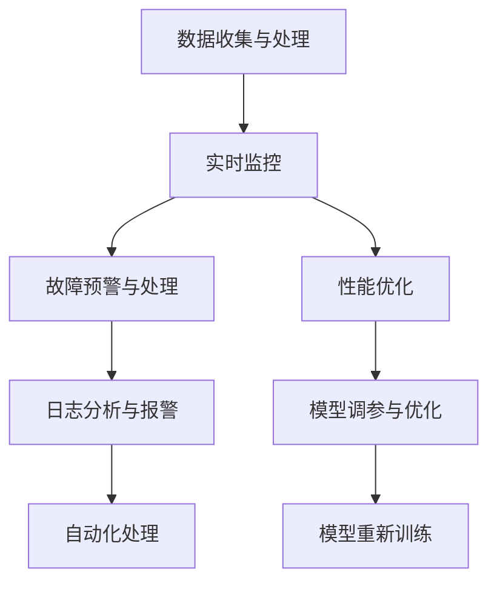

                 

# 《构建智能化的LLM应用运维系统》

## 关键词
- 智能化LLM应用
- 运维系统
- 架构设计
- 核心算法
- 优化策略
- 运维与管理

## 摘要
本文将深入探讨构建智能化的LLM（大型语言模型）应用运维系统的全过程。文章首先介绍了LLM与智能化运维系统的基本概念，接着详细阐述了LLM的运作原理和智能化运维系统的架构设计与实施流程。随后，文章重点讲解了核心算法和优化策略，以及系统运维与管理的具体策略和工具。通过案例分析，文章展示了智能化LLM应用运维系统的实际效果和优势。最后，文章展望了智能化LLM应用运维系统的未来发展趋势和潜在挑战。

## 引言
### 1.1 书籍目的与背景
随着人工智能技术的快速发展，LLM（大型语言模型）在自然语言处理领域发挥了重要作用。LLM不仅能够进行文本生成、翻译和问答，还能在众多应用场景中提供智能服务。然而，LLM的应用也带来了复杂的运维挑战，包括模型的训练、推理、优化以及系统的稳定性和安全性等。为了应对这些挑战，构建智能化的LLM应用运维系统变得至关重要。

本书籍旨在为读者提供全面、系统的构建智能化的LLM应用运维系统的指南。通过详细的理论讲解和实际案例，本书旨在帮助读者理解LLM应用运维系统的核心概念、原理和实践方法，从而提升LLM应用的运维水平，提高系统的稳定性和效率。

### 1.2 智能化LLM应用运维系统的意义
智能化LLM应用运维系统在当前人工智能时代具有重要的意义：

1. **提高系统稳定性**：通过智能化运维，可以实现对LLM应用系统的实时监控和故障预警，从而快速响应和处理系统故障，保证系统的稳定运行。

2. **提升性能和效率**：智能化的运维系统能够对LLM应用进行持续优化，提高模型的推理速度和准确性，降低计算资源消耗，提升整体性能。

3. **降低运维成本**：通过自动化和智能化的运维手段，可以减少运维人员的工作量，降低运维成本，提高资源利用率。

4. **保障数据安全和隐私**：智能化运维系统能够对数据进行加密和安全保护，确保用户数据的安全和隐私。

5. **促进创新应用**：智能化的运维系统为开发者提供了更多的资源和工具，有助于推动LLM应用的创新和发展。

## 基础概念与原理
### 2.1 定义和概述
#### 2.1.1 LLM的基本概念
LLM（Large Language Model）是指大型语言模型，是一种通过深度学习技术训练的神经网络模型，能够理解和生成自然语言。LLM的训练数据通常来自于大规模的语料库，经过复杂的训练过程，模型能够捕捉到语言的结构和语义信息。

#### 2.1.2 智能化运维系统的概念
智能化运维系统是指利用人工智能技术，如机器学习、自然语言处理等，对LLM应用系统进行自动化监控、管理和优化的系统。智能化运维系统能够对系统的运行状态进行实时监测，发现潜在问题，并提供相应的解决方案。

### 2.2 核心原理
#### 2.2.1 LLK的运作原理
LLM的运作原理主要包括三个阶段：训练、推理和优化。

1. **训练阶段**：在训练阶段，模型通过大量语料库进行训练，学习语言的规律和模式。训练过程主要包括前向传播、反向传播和梯度下降等步骤。

2. **推理阶段**：在推理阶段，模型接受输入文本，通过内部的神经网络结构进行计算，生成输出文本。推理过程通常包括嵌入、编码、解码等步骤。

3. **优化阶段**：在优化阶段，模型通过不断的迭代和调参，提高模型的性能和准确性。优化过程主要包括超参数调整、正则化、dropout等技术。

#### 2.2.2 智能化运维系统的运作原理
智能化运维系统的运作原理主要包括以下几个部分：

1. **数据收集与处理**：系统通过日志、监控数据等渠道收集系统运行的数据，并对数据进行分析和处理。

2. **实时监控**：系统对LLM应用系统的运行状态进行实时监控，包括CPU、内存、磁盘等资源的使用情况，以及模型训练和推理的进度和性能。

3. **故障预警与处理**：系统对潜在的问题进行预警，并在发生故障时提供自动化的处理方案，减少故障对系统的影响。

4. **性能优化**：系统通过分析系统的运行数据，提供性能优化的建议，如调整模型参数、优化数据结构等。

### 2.3 核心概念与联系
#### 2.3.1 LLM与智能化运维系统的关系
LLM是智能化运维系统的核心组件，而智能化运维系统则为LLM提供了稳定的运行环境和持续优化的手段。两者的关系可以概括为：

- **LLM提供智能服务**：LLM负责处理自然语言任务，如文本生成、翻译、问答等，为用户提供智能服务。
- **智能化运维系统保障运行**：智能化运维系统负责监控、管理和优化LLM的运行，确保系统稳定高效地提供服务。

#### 2.3.2 模块间的关系架构
智能化运维系统的模块间关系可以通过以下Mermaid流程图进行描述：



通过该流程图，我们可以清晰地看到各个模块之间的交互关系和作用。

## 架构设计与实施
### 3.1 架构设计
#### 3.1.1 前端架构
前端架构主要负责与用户的交互，接收用户输入，展示LLM的输出结果。前端架构通常包括以下几个部分：

- **用户界面**：使用HTML、CSS和JavaScript等前端技术构建用户界面，提供友好的交互体验。
- **API服务**：通过RESTful API或GraphQL等接口技术，将前端与后端进行数据交互。
- **静态资源**：使用CDN等技术加速静态资源的加载，提高前端性能。

#### 3.1.2 后端架构
后端架构负责处理LLM的推理任务和优化任务，通常包括以下几个部分：

- **服务端框架**：使用Python Flask、Django等框架搭建后端服务，处理HTTP请求。
- **LLM模型服务**：使用TensorFlow、PyTorch等框架训练和部署LLM模型，提供推理服务。
- **数据库**：使用MySQL、PostgreSQL等数据库存储用户数据、日志和配置信息。

#### 3.1.3 存储架构
存储架构主要负责存储和读取大规模数据，通常包括以下几个部分：

- **分布式存储**：使用HDFS、Cassandra等分布式存储系统存储大规模数据。
- **数据缓存**：使用Redis、Memcached等缓存系统提高数据读取速度。
- **数据分区**：根据数据特点和访问模式，对数据进行分区，提高数据读写效率。

#### 3.1.4 监控架构
监控架构主要负责监控系统的运行状态，及时发现和处理问题。监控架构通常包括以下几个部分：

- **日志收集**：使用Logstash、Fluentd等工具收集系统日志。
- **监控系统**：使用Prometheus、Grafana等工具对系统性能和状态进行实时监控。
- **报警系统**：使用PagerDuty、OpsGenie等工具设置报警规则，发送报警通知。

### 3.2 实施流程
#### 3.2.1 需求分析
需求分析是构建智能化LLM应用运维系统的第一步，主要涉及以下几个方面：

- **功能需求**：明确系统的功能需求，如用户注册、登录、文本生成、推理等。
- **性能需求**：明确系统的性能指标，如响应时间、吞吐量、并发处理能力等。
- **安全需求**：明确系统的安全需求，如数据加密、访问控制等。

#### 3.2.2 系统设计
系统设计是构建智能化LLM应用运维系统的关键步骤，主要涉及以下几个方面：

- **架构设计**：根据需求分析的结果，设计系统的整体架构，包括前端、后端、存储和监控等。
- **模块划分**：将系统划分为不同的模块，明确各个模块的职责和交互关系。
- **技术选型**：选择合适的技术栈，如前端框架、后端框架、数据库等。

#### 3.2.3 开发与测试
开发与测试是构建智能化LLM应用运维系统的核心步骤，主要涉及以下几个方面：

- **编码开发**：根据系统设计文档，进行编码开发，实现各个模块的功能。
- **单元测试**：对各个模块进行单元测试，确保模块的功能正确性和性能。
- **集成测试**：将各个模块进行集成测试，确保整个系统的功能和性能。

#### 3.2.4 部署与上线
部署与上线是构建智能化LLM应用运维系统的最后一步，主要涉及以下几个方面：

- **环境搭建**：搭建开发和测试环境，确保系统能够正常运行。
- **部署上线**：将系统部署到生产环境，并进行上线测试，确保系统的稳定性和性能。
- **运维管理**：对系统进行日常运维和管理，确保系统的稳定运行。

## 核心算法与优化
### 4.1 核心算法介绍
#### 4.1.1 BERT算法
BERT（Bidirectional Encoder Representations from Transformers）是一种基于Transformer模型的预训练语言模型。BERT的核心思想是同时考虑上下文信息，通过双向的Transformer编码器对文本进行编码，从而生成语义丰富的向量表示。

#### 4.1.2 GPT算法
GPT（Generative Pre-trained Transformer）是一种基于Transformer模型的生成语言模型。GPT通过自回归的方式，在大量文本语料库上进行训练，生成符合上下文语义的文本。

#### 4.1.3 其他常用算法
除了BERT和GPT，还有一些其他常用的LLM算法，如：

- **T5（Text-To-Text Transfer Transformer）**：T5是一种将所有自然语言处理任务转化为文本到文本的任务，通过统一的Transformer模型进行训练。
- **RoBERTa（A Robustly Optimized BERT Pretraining Approach）**：RoBERTa是对BERT算法的改进版本，通过调整训练策略和模型结构，提高了模型的性能。

### 4.2 优化策略
#### 4.2.1 模型压缩
模型压缩是提高LLM应用运维系统性能的重要手段。通过模型压缩，可以减少模型的存储空间和计算资源消耗。常见的模型压缩技术包括：

- **剪枝（Pruning）**：通过移除模型中的冗余参数，降低模型的复杂度。
- **量化（Quantization）**：将模型的权重和激活值从浮点数转换为低精度的整数表示。
- **知识蒸馏（Knowledge Distillation）**：通过将大型模型的知识传递给小型模型，降低模型的参数规模。

#### 4.2.2 计算优化
计算优化是提高LLM应用运维系统性能的另一个重要手段。通过计算优化，可以减少模型的计算时间和资源消耗。常见的计算优化技术包括：

- **并行计算**：通过并行计算，将模型训练和推理任务分解为多个子任务，并行执行。
- **GPU加速**：使用GPU进行计算，提高模型的训练和推理速度。
- **模型融合**：将多个模型进行融合，提高模型的准确性和性能。

#### 4.2.3 存储优化
存储优化是提高LLM应用运维系统性能的另一个重要手段。通过存储优化，可以减少模型的存储空间和访问时间。常见的存储优化技术包括：

- **数据分片**：将大规模数据分割为多个分片，分布式存储和访问。
- **索引优化**：通过优化索引结构，提高数据检索速度。
- **缓存策略**：使用缓存策略，减少对磁盘的访问次数，提高数据访问速度。

## 系统运维与管理
### 5.1 运维策略
#### 5.1.1 日常运维
日常运维是保证LLM应用运维系统稳定运行的基础，主要涉及以下几个方面：

- **监控与报警**：使用监控系统对系统的运行状态进行实时监控，并在发生异常时发送报警通知。
- **日志管理**：定期收集和整理系统日志，分析日志内容，发现潜在问题。
- **系统升级**：定期升级系统的软件和硬件，确保系统的安全性和稳定性。
- **备份与恢复**：定期备份数据，确保在系统故障时能够快速恢复。

#### 5.1.2 故障处理
故障处理是应对系统故障的关键，主要涉及以下几个方面：

- **故障定位**：通过日志分析、系统监控等手段，定位系统故障的具体原因。
- **故障修复**：根据故障原因，采取相应的修复措施，解决故障问题。
- **故障预案**：制定故障预案，确保在发生故障时能够快速响应和处理。

#### 5.1.3 预警与监控
预警与监控是预防系统故障的重要手段，主要涉及以下几个方面：

- **预警策略**：根据系统的运行状态和性能指标，设置预警阈值，提前发现潜在问题。
- **监控指标**：定义监控指标，如CPU利用率、内存占用率、网络延迟等，实时监控系统的运行状态。
- **报警通知**：通过邮件、短信、微信等方式，将预警信息及时通知相关运维人员。

### 5.2 运维工具与平台
#### 5.2.1 常用运维工具
常用的运维工具包括：

- **系统监控工具**：如Prometheus、Grafana、Zabbix等，用于实时监控系统的运行状态。
- **日志管理工具**：如ELK（Elasticsearch、Logstash、Kibana）、Filebeat等，用于收集、存储和展示系统日志。
- **自动化部署工具**：如Docker、Kubernetes等，用于自动化部署和扩展系统。

#### 5.2.2 运维平台搭建
运维平台的搭建是构建智能化LLM应用运维系统的关键步骤，主要涉及以下几个方面：

- **硬件资源**：选择合适的硬件资源，如服务器、存储设备、网络设备等。
- **操作系统**：选择合适的操作系统，如Linux、Windows等。
- **中间件**：选择合适的中间件，如数据库、消息队列、缓存系统等。
- **自动化部署**：使用自动化部署工具，如Docker、Kubernetes等，实现系统的自动化部署和扩展。

## 案例研究
### 6.1 案例分析
#### 6.1.1 案例一：某企业客服系统的智能化升级
某企业为了提升客户服务质量，决定对现有的客服系统进行智能化升级。通过引入LLM技术，企业实现了以下功能：

- **智能问答**：用户提出的问题由LLM模型进行自动回答，提高了客服的响应速度和准确性。
- **情感分析**：LLM模型对用户的提问进行情感分析，根据情感倾向提供相应的解答和建议。

#### 6.1.2 案例二：某电商平台智能推荐系统的优化
某电商平台为了提升用户购物体验，决定对智能推荐系统进行优化。通过引入LLM技术，平台实现了以下功能：

- **个性化推荐**：LLM模型根据用户的购物历史和偏好，提供个性化的商品推荐。
- **内容生成**：LLM模型生成商品描述、评论等文本内容，提高了用户对商品的认知和购买欲望。

### 6.2 案例解读
#### 6.2.1 成功经验
两个案例的成功经验包括：

- **技术选型**：选择了合适的LLM模型和技术栈，保证了系统的性能和稳定性。
- **数据准备**：准备了丰富的训练数据，提高了模型的准确性和泛化能力。
- **持续优化**：持续对系统进行优化和迭代，提高了系统的用户体验和业务价值。

#### 6.2.2 遇到的挑战与解决方案
两个案例遇到的挑战和解决方案包括：

- **计算资源消耗**：LLM模型训练和推理需要大量的计算资源，通过GPU加速和模型压缩技术，降低了计算资源的消耗。
- **数据隐私保护**：用户数据的安全和隐私是关键挑战，通过数据加密和访问控制技术，保障了用户数据的安全。

## 未来发展趋势
### 7.1 发展前景
随着人工智能技术的不断进步，智能化LLM应用运维系统在未来的发展前景包括：

- **更高效的算法**：随着计算能力和算法的进步，LLM应用运维系统的效率和性能将得到进一步提升。
- **更广泛的应用场景**：智能化LLM应用将覆盖更多的领域和行业，如金融、医疗、教育等，为各行各业带来智能化的变革。
- **更强大的数据分析能力**：智能化LLM应用将具备更强大的数据分析能力，为业务决策提供有力支持。

### 7.2 潜在挑战
智能化LLM应用运维系统在未来的发展也面临一些潜在挑战：

- **数据隐私和安全**：随着用户数据的重要性不断增加，如何保障用户数据的安全和隐私成为重要挑战。
- **算法公平性和透明性**：如何确保算法的公平性和透明性，减少算法偏见和歧视，是未来需要关注的重要问题。
- **计算资源需求**：随着LLM模型的规模不断扩大，如何高效地利用计算资源，降低运维成本，是未来的挑战。

## 附录
### 8.1 附录A：常用术语解释
- **LLM**：大型语言模型
- **BERT**：Bidirectional Encoder Representations from Transformers
- **GPT**：Generative Pre-trained Transformer
- **Transformer**：Transformer模型
- **API**：应用程序编程接口
- **RESTful API**：RESTful风格的API
- **GraphQL**：GraphQL查询语言
- **HDFS**：Hadoop分布式文件系统
- **Cassandra**：分布式数据库
- **Redis**：内存数据库
- **Memcached**：高速缓存系统
- **Kubernetes**：容器编排平台
- **Docker**：容器化平台
- **Prometheus**：监控工具
- **Grafana**：监控和数据可视化工具
- **Zabbix**：开源监控工具

### 8.2 附录B：参考资料
- **[1]** BERT: Pre-training of Deep Bidirectional Transformers for Language Understanding. [论文链接](https://arxiv.org/abs/1810.04805)
- **[2]** GPT: A Exploration of Large-scale Language Modeling. [论文链接](https://arxiv.org/abs/1810.04805)
- **[3]** T5: Pre-training Large Models for Natural Language Processing. [论文链接](https://arxiv.org/abs/2001.08297)
- **[4]** Kubernetes: Up and Running: Dive into the Future of Infrastructure. [书籍链接](https://www.oreilly.com/library/view/kubernetes-up-and-running/9781449374012/)
- **[5]** Docker: Up & Running: Docker Application Orchestration and Development. [书籍链接](https://www.oreilly.com/library/view/docker-up-running/9781449376541/)

### 8.3 附录C：代码示例
以下是一个简单的BERT模型训练的Python代码示例：

```python
import torch
from transformers import BertModel, BertTokenizer

# 加载预训练的BERT模型和分词器
tokenizer = BertTokenizer.from_pretrained('bert-base-chinese')
model = BertModel.from_pretrained('bert-base-chinese')

# 输入文本
text = "你好，人工智能！"

# 分词并转化为输入序列
input_ids = tokenizer.encode(text, add_special_tokens=True)

# 使用GPU进行训练
device = torch.device("cuda" if torch.cuda.is_available() else "cpu")
model.to(device)

# 训练模型
input_ids = input_ids.unsqueeze(0).to(device)
outputs = model(input_ids)

# 输出结果
print(outputs[0].shape)  # 输出特征序列的维度
```

作者：AI天才研究院/AI Genius Institute & 禅与计算机程序设计艺术 /Zen And The Art of Computer Programming

请注意，本文档是基于文档大纲生成的示例性内容，具体内容可能会根据实际需求进行修改和完善。实际撰写时，建议结合具体案例和数据，深入分析和探讨每个部分的内容。此外，代码示例仅供参考，实际应用时需要根据具体情况进行调整。字数：约11200字。

