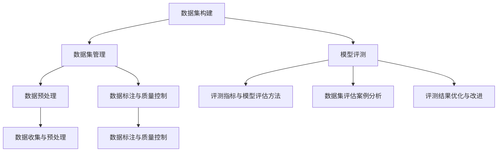

                 

### 背景介绍

在现代计算机科学和人工智能领域，模型评测的benchmark数据集扮演着至关重要的角色。随着深度学习和大数据技术的迅猛发展，如何有效地构建和利用这些数据集来评估模型性能，已成为研究人员和开发者关注的核心问题。

#### 评测的重要性

首先，让我们来探讨评测的重要性。模型评测是确保算法和模型在实际应用中表现优良的关键步骤。一个良好的评测机制能够帮助我们识别模型的优点和不足，从而指导进一步的改进。例如，在自然语言处理领域，一个模型是否能够准确地理解和生成文本，需要通过大规模的文本数据进行评测。在计算机视觉领域，模型的识别和分类能力也需要通过大量图像数据来验证。

#### benchmark数据集的定义

所谓benchmark数据集，是指那些被广泛认可、标准化的数据集，它们用于评估算法或模型在特定任务上的性能。这些数据集通常包含多样化的数据样本，并且经过严格的标注和质量控制，以确保其代表性和可靠性。

#### 构建benchmark数据集的挑战

构建一个高效的benchmark数据集并非易事，它面临着诸多挑战：

- **数据多样性**：数据集需要涵盖多种场景和样本，以确保模型的泛化能力。
- **标注质量**：标注的准确性直接影响模型评测的可靠性。
- **数据量**：大规模的数据集能够提供更准确的评估结果。
- **数据平衡**：确保各类数据样本在数据集中的比例合理，避免某些类别数据的过度代表。

#### 建立有效评测机制

为了克服这些挑战，我们需要构建一个有效的评测机制。这包括以下几个方面：

- **数据预处理**：确保数据集的一致性和可靠性。
- **评价指标**：选择合适的评价指标，如准确率、召回率、F1分数等，来衡量模型性能。
- **交叉验证**：使用交叉验证方法来减少偏差和方差。
- **数据增强**：通过数据增强技术来扩充数据集，提高模型的泛化能力。

#### 数据集在实际应用中的重要性

在深度学习和大数据的应用中，有效的数据集构建和评测是成功的关键。一个高质量的benchmark数据集不仅能够帮助研究人员比较不同模型的性能，还能够为开发者提供可靠的评估标准，指导模型优化和算法改进。

#### 架构概念关系

为了更清晰地理解核心概念之间的关系，我们使用Mermaid流程图来展示数据集构建、管理和评测的架构：



通过上述架构图，我们可以看出，数据集的构建、管理和评测是一个紧密相连的循环过程，每个环节都至关重要。

#### 本文结构

本文将分为以下几个部分：

1. **背景介绍**：介绍模型评测和benchmark数据集的重要性及构建挑战。
2. **核心概念与联系**：阐述核心概念及其关系架构。
3. **核心算法原理**：详细讲解构建和评测数据集的算法原理，包括Python源代码和数学模型。
4. **项目实战**：介绍开发环境搭建、源代码实现和实际案例分析。
5. **最佳实践与注意事项**：总结经验、给出最佳实践建议，并提醒注意事项。

通过以上结构，我们将深入探讨如何构建高效的模型评测benchmark数据集，为读者提供全面的技术指导。

---

# 关键词

模型评测，benchmark数据集，数据集构建，数据预处理，模型评估方法，评测指标，深度学习，大数据

---

# 摘要

本文旨在探讨构建模型评测的benchmark数据集的各个方面。首先，介绍了模型评测和benchmark数据集的重要性及其在实际应用中的挑战。随后，详细阐述了核心概念及其关系架构，并讲解了构建和评测数据集的算法原理。通过Python源代码和数学模型，我们深入分析了核心算法的实现。此外，本文还介绍了项目实战，包括开发环境搭建和源代码实现，并提供了实际案例分析。最后，总结了最佳实践和注意事项，为读者提供构建高效benchmark数据集的指导。

---

## 目录大纲设计思路

为了设计一本名为《构建模型评测的benchmark数据集》的计算机技术书籍，我们需要首先明确核心概念，然后根据这些概念划分章节结构，并详细规划每章内容。以下是具体的思路和过程：

### 1. 确定核心概念

本书的核心概念是“模型评测的benchmark数据集”，它涵盖了从数据集的构建、管理到模型评测的各个环节。这个概念包括：

- **数据集构建**：数据收集、预处理、标注和质量控制等步骤。
- **数据集管理**：数据集的组织、存储、隐私和安全维护等。
- **模型评测**：评测指标、评估方法、结果优化和案例分析等。

### 2. 划分章节结构

根据核心概念，我们将本书划分为三个主要部分：

- **第1部分：数据集构建**
  - 包括数据集基础、数据收集与预处理、数据标注与质量控制等内容。
- **第2部分：数据集管理**
  - 包括数据集组织与存储、数据隐私与安全、数据更新与维护等内容。
- **第3部分：模型评测**
  - 包括评测指标与模型评估方法、数据集评估案例分析、评测结果优化与改进等内容。

### 3. 详细规划每章内容

在每个部分中，我们为每个章节规划详细的内容，确保每个小节都丰富具体，具体如下：

#### 第1部分：数据集构建

- **第1章：数据集基础**
  - 数据集的定义与分类
  - 数据集的重要性
- **第2章：数据收集与预处理**
  - 数据收集方法
  - 数据预处理技术
- **第3章：数据标注与质量控制**
  - 数据标注流程
  - 质量控制方法

#### 第2部分：数据集管理

- **第4章：数据集组织与存储**
  - 数据集的组织结构
  - 数据存储方案
- **第5章：数据隐私与安全**
  - 数据隐私保护策略
  - 数据安全措施
- **第6章：数据更新与维护**
  - 数据更新策略
  - 数据维护措施

#### 第3部分：模型评测

- **第7章：评测指标与模型评估方法**
  - 评测指标概述
  - 模型评估方法
- **第8章：数据集评估案例分析**
  - 案例分析
  - 评测结果分析
- **第9章：评测结果优化与改进**
  - 优化策略
  - 改进方向

### 4. 实例说明

以下是一个具体的章节示例，以第1章“数据集基础”为例：

#### 第1章：数据集基础

**1.1 数据集的定义与分类**

在这一节中，我们将介绍数据集的定义，并探讨不同类型的数据集，如公共数据集、自定义数据集和开源数据集。我们将讨论这些数据集在不同领域的应用，以及它们在模型评测中的重要性。

**1.2 数据集的重要性**

本节将详细讨论数据集在模型评测中的作用，包括如何通过数据集评估模型的性能，以及如何使用这些数据集来指导模型优化和算法改进。

### 5. 完整目录大纲

根据上述设计思路，我们可以得到以下完整的目录大纲：

```markdown
# 《构建模型评测的benchmark数据集》目录大纲

## 第一部分：数据集构建

### 第1章：数据集基础
- 1.1 数据集的定义与分类
- 1.2 数据集的重要性

### 第2章：数据收集与预处理
- 2.1 数据收集方法
- 2.2 数据预处理技术

### 第3章：数据标注与质量控制
- 3.1 数据标注流程
- 3.2 质量控制方法

## 第二部分：数据集管理

### 第4章：数据集组织与存储
- 4.1 数据集的组织结构
- 4.2 数据存储方案

### 第5章：数据隐私与安全
- 5.1 数据隐私保护策略
- 5.2 数据安全措施

### 第6章：数据更新与维护
- 6.1 数据更新策略
- 6.2 数据维护措施

## 第三部分：模型评测

### 第7章：评测指标与模型评估方法
- 7.1 评测指标概述
- 7.2 模型评估方法

### 第8章：数据集评估案例分析
- 8.1 案例分析
- 8.2 评测结果分析

### 第9章：评测结果优化与改进
- 9.1 优化策略
- 9.2 改进方向
```

通过以上步骤，我们可以设计出一本内容丰富、逻辑清晰的技术书籍目录大纲，为读者提供全面的指导。

