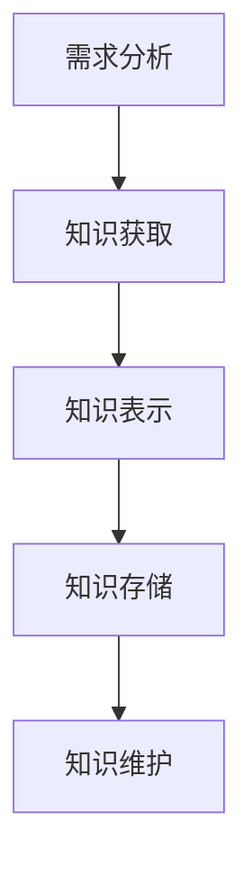
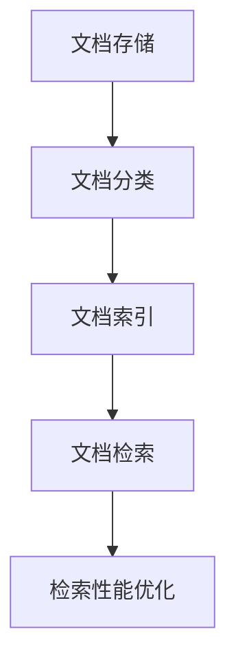

                 

### 引言

**文章标题：构建模型评测的知识库与文档系统**

在人工智能和机器学习领域，模型评测是至关重要的一环。它不仅关系到模型的性能，还影响到后续的应用决策。随着技术的不断进步，如何高效、准确地评估模型已经成为一个热门话题。本文旨在探讨如何构建一个综合性的模型评测知识库与文档系统，为研究人员和实践者提供全面的指导。

**关键词：**模型评测，知识库，文档系统，人工智能，机器学习

**摘要：**

本文首先介绍了模型评测的基本概念和重要性，然后详细阐述了构建模型评测知识库和文档系统的步骤和方法。文章包括以下几个方面：

1. **基础知识**：介绍模型评测所需的预处理技术、评估指标等。
2. **知识库构建**：探讨知识库的设计、表示和获取方法。
3. **文档系统构建**：讲解文档系统的设计原则和实现策略。
4. **模型评测方法**：分析传统和新兴的评测方法。
5. **实践应用**：提供实际案例，展示系统实现和效果分析。
6. **总结与展望**：总结全文，展望未来研究方向。

本文将为模型评测领域的研究人员提供有价值的参考，帮助他们更好地理解和应用模型评测技术。

### 基础知识

**1.1 模型评测概述**

模型评测是指通过一系列的方法和指标来评估机器学习模型的性能。这不仅仅是为了了解模型的准确性，更重要的是为了指导模型优化和实际应用。在模型训练完成后，评测是确保模型能够有效解决实际问题的关键步骤。

**1.2 数据预处理**

数据预处理是模型评测的基础。一个干净、规范化的数据集可以显著提高模型的性能。预处理主要包括以下三个方面：

- **数据清洗**：处理缺失值、异常值和噪声数据。
- **数据标准化**：将不同特征的数据进行统一处理，消除数据规模差异。
- **数据划分**：将数据集划分为训练集、验证集和测试集，以便在不同阶段进行模型训练和评估。

**1.3 评测指标**

评测指标是评估模型性能的关键工具。不同的任务和数据集可能需要不同的指标，但以下几个指标是模型评测中常用的：

- **准确率**：预测正确的样本数占总样本数的比例。
- **召回率**：预测正确的正样本数占总正样本数的比例。
- **F1值**：准确率和召回率的调和平均，综合考虑了精确度和召回率。
- **ROC曲线与AUC**：接收者操作特征曲线和曲线下的面积，用于评估分类器的性能。

**1.4 模型评测流程**

模型评测通常包括以下几个步骤：

1. **数据预处理**：对原始数据进行清洗、标准化和划分。
2. **模型训练**：使用训练集数据训练模型。
3. **模型评估**：使用验证集数据评估模型性能。
4. **模型调整**：根据评估结果调整模型参数。
5. **测试评估**：使用测试集数据对最终模型进行评估。

通过上述基础知识，我们可以更好地理解模型评测的流程和重要性。在接下来的章节中，我们将详细探讨如何构建模型评测的知识库和文档系统。

### 知识库构建

**2.1 知识库概述**

知识库是存储、管理和利用知识的重要系统。在模型评测领域，知识库可以帮助研究人员快速获取相关的算法、指标和最佳实践，从而提高工作效率和准确性。构建一个有效的知识库涉及多个方面，包括知识表示、获取和存储。

**2.2 知识库设计**

知识库的设计是构建知识库的第一步，关键在于如何组织和管理知识。以下是知识库设计的关键要素：

- **知识表示**：选择合适的知识表示方法，如实体-关系模型、图谱模型等。
- **知识获取**：确定如何从各种数据源（如论文、报告、代码库）中获取知识，并确保其准确性和完整性。
- **知识存储**：选择合适的存储方案，如关系型数据库、图数据库等，以高效地存储和管理知识。

**2.3 知识库应用**

知识库在模型评测中的应用主要包括：

- **算法推荐**：根据用户的输入，推荐合适的算法和模型。
- **最佳实践指导**：提供最佳实践案例，帮助用户优化模型评测流程。
- **知识共享与协作**：支持用户之间的知识共享和协作，促进共同进步。

**2.4 知识库构建步骤**

构建知识库的步骤如下：

1. **需求分析**：明确知识库的应用场景和目标用户。
2. **知识获取**：从各种数据源中提取知识，并进行清洗和预处理。
3. **知识表示**：将获取的知识转化为结构化的形式，如实体和关系。
4. **知识存储**：选择合适的存储方案，并将知识库部署到生产环境。
5. **知识维护**：定期更新知识库，确保其内容的准确性和时效性。

**2.5 知识库构建示例**

以下是一个简单的知识库构建示例，使用Mermaid流程图来展示知识库的构建流程：



通过上述步骤，我们可以构建一个功能齐全、易于维护的知识库，为模型评测提供有力支持。

### 文档系统构建

**3.1 文档系统概述**

文档系统是存储、管理和检索模型评测相关文档的重要工具。一个高效的文档系统可以显著提高工作效率，帮助研究人员快速找到所需的信息。构建文档系统需要考虑文档的分类、索引和检索等方面。

**3.2 文档系统设计**

文档系统设计的关键在于如何有效地组织和存储文档。以下是文档系统设计的关键要素：

- **文档分类**：根据文档的内容和用途，将其分类为不同的类别，如算法文档、评测报告、代码文档等。
- **文档索引**：建立文档的索引系统，以便快速查找和定位文档。
- **文档检索**：提供高效的文档检索机制，支持关键词搜索和全文搜索。

**3.3 文档系统实现**

构建文档系统需要选择合适的工具和技术。以下是一些常用的工具和技术：

- **文档存储**：使用关系型数据库或图数据库来存储文档内容。
- **文档分类**：使用自然语言处理技术对文档进行分类。
- **文档检索**：使用搜索引擎或全文检索工具，如Elasticsearch或Solr。

**3.4 文档系统优化**

为了提高文档系统的性能和用户体验，可以采取以下优化策略：

- **检索性能优化**：通过优化索引结构和查询算法，提高检索速度。
- **文档更新策略**：定期更新文档库，确保文档的时效性和准确性。
- **用户权限管理**：根据用户的角色和权限，控制文档的访问和操作权限。

**3.5 文档系统示例**

以下是一个简单的文档系统实现示例，使用Mermaid流程图来展示文档系统的基本架构：



通过上述步骤，我们可以构建一个功能齐全、易于使用的文档系统，为模型评测提供高效的支持。

### 模型评测方法

**4.1 传统评测方法**

传统评测方法主要依赖于统计指标，如准确率、召回率和F1值等，用于评估分类模型的性能。这些指标各自反映了模型在特定方面的表现，但往往需要综合多个指标进行评估。

- **准确率**：预测正确的样本数占总样本数的比例。它关注的是总体表现，但在类别不平衡的情况下可能会失真。
- **召回率**：预测正确的正样本数占总正样本数的比例。它关注的是模型在捕捉正样本方面的能力。
- **F1值**：准确率和召回率的调和平均，综合考虑了精确度和召回率。

**4.2 新兴评测方法**

随着技术的进步，越来越多的新兴评测方法被提出，以更全面地评估模型的性能。以下是一些新兴评测方法：

- **ROC曲线与AUC**：ROC曲线（接收者操作特征曲线）展示了在不同阈值下，模型的真阳性率与假阳性率之间的关系。AUC（曲线下面积）是评估分类器性能的重要指标，值越大表示模型性能越好。
- **交互式评测**：通过用户与模型的交互，实时反馈和调整模型参数，以提升模型性能。这种方法适用于模型复杂、业务场景变化频繁的情况。
- **可视化评测**：通过图形化的方式展示模型性能，帮助用户直观地理解和评估模型。例如，使用热力图、散点图等可视化工具，展示模型的预测结果和分布。

**4.3 模型评测流程**

模型评测通常包括以下步骤：

1. **数据预处理**：对原始数据进行清洗、标准化和划分。
2. **模型训练**：使用训练集数据训练模型。
3. **模型评估**：使用验证集数据评估模型性能。
4. **模型调整**：根据评估结果调整模型参数。
5. **测试评估**：使用测试集数据对最终模型进行评估。

通过上述流程，我们可以全面、客观地评估模型的性能，为模型优化和应用提供有力支持。

### 实践应用

**5.1 项目案例介绍**

在本节中，我们将介绍两个模型评测的项目案例，分别是金融行业的风险控制和医疗领域的疾病预测。这些案例展示了如何在实际应用中构建和优化模型评测系统。

**5.1.1 案例一：金融行业风险控制**

金融行业的风险控制至关重要，尤其是在贷款审批、信用卡欺诈检测等方面。在这个案例中，我们使用了一个基于机器学习的风险评估模型，通过大量的历史数据来预测客户的信用风险。

- **数据来源**：收集了大量的客户数据，包括财务状况、行为数据、社会信用记录等。
- **数据预处理**：对数据进行清洗、标准化和划分，分为训练集、验证集和测试集。
- **模型构建**：采用逻辑回归和随机森林等算法构建风险评估模型。
- **模型评估**：使用准确率、召回率和F1值等指标对模型进行评估。
- **结果分析**：通过分析评估结果，发现模型在预测高风险客户方面具有较好的性能，但召回率有待提高。

**5.1.2 案例二：医疗领域疾病预测**

在医疗领域，疾病预测模型可以帮助医生提前发现潜在的健康问题，提高治疗效果。在这个案例中，我们使用了一个基于深度学习的疾病预测模型，通过分析患者的医疗记录来预测疾病风险。

- **数据来源**：收集了大量的医疗记录数据，包括诊断信息、检查结果、药物使用记录等。
- **数据预处理**：对数据进行清洗、标准化和划分，分为训练集、验证集和测试集。
- **模型构建**：采用卷积神经网络和循环神经网络等深度学习算法构建疾病预测模型。
- **模型评估**：使用ROC曲线和AUC等指标对模型进行评估。
- **结果分析**：通过分析评估结果，发现模型在预测疾病风险方面具有较好的性能，特别是在早期阶段。

**5.2 系统实现**

在上述两个案例中，我们构建了相应的模型评测系统，主要包括以下几个部分：

- **数据预处理模块**：负责对原始数据进行清洗、标准化和划分。
- **模型训练模块**：负责使用训练数据训练模型。
- **模型评估模块**：负责使用验证数据评估模型性能。
- **结果分析模块**：负责对评估结果进行分析和可视化。

以下是系统实现的伪代码示例：

```python
# 数据预处理
def preprocess_data(data):
    # 数据清洗
    clean_data = clean_data(data)
    
    # 数据标准化
    standardized_data = standardize_data(clean_data)
    
    # 数据划分
    train_data, validation_data, test_data = split_data(standardized_data)

# 模型训练
def train_model(train_data):
    # 构建模型
    model = build_model()
    
    # 训练模型
    trained_model = train_model(model, train_data)

# 模型评估
def evaluate_model(model, validation_data):
    # 评估指标
    metrics = evaluate_metrics(model, validation_data)
    
    # 结果分析
    analyze_results(metrics)

# 系统实现
def systemImplementation():
    # 数据预处理
    train_data, validation_data, test_data = preprocess_data(raw_data)
    
    # 模型训练
    trained_model = train_model(train_data)
    
    # 模型评估
    evaluate_model(trained_model, validation_data)
```

**5.3 系统测试与优化**

在系统开发完成后，我们需要对其进行测试和优化，以确保其稳定性和性能。

- **系统测试**：通过模拟真实场景，对系统进行压力测试和性能测试，确保系统能够稳定运行并满足性能要求。
- **模型优化**：根据评估结果，对模型进行调整和优化，以提高其性能。例如，可以通过调整超参数、增加训练数据等方式来优化模型。
- **结果分析**：对测试结果进行分析，评估系统的性能和效果，并根据分析结果进行进一步优化。

通过上述步骤，我们可以构建一个高效、稳定的模型评测系统，为实际应用提供有力支持。

### 总结与展望

本文系统地介绍了构建模型评测知识库与文档系统的步骤和方法，从基础知识、知识库构建、文档系统构建、模型评测方法到实践应用，全面探讨了模型评测的相关内容。通过本文的学习，读者可以了解到：

1. **模型评测的重要性**：模型评测是确保模型性能和有效性的关键步骤。
2. **知识库与文档系统的构建**：如何设计、实现和维护一个功能齐全的模型评测知识库与文档系统。
3. **传统与新兴评测方法的比较**：传统评测方法和新兴评测方法的特点和应用场景。
4. **实践应用**：通过实际案例展示了如何构建和优化模型评测系统。

展望未来，模型评测领域将继续发展，以下是一些可能的研究方向：

1. **多模态数据的评测**：随着多模态数据的应用日益广泛，如何对其进行有效评测成为一个重要课题。
2. **自动化评测工具**：开发自动化评测工具，提高评测效率和准确性。
3. **数据隐私保护**：如何在保护数据隐私的同时进行模型评测，是一个亟待解决的问题。
4. **可解释性研究**：增强模型的可解释性，帮助用户理解模型的决策过程。

总之，模型评测作为人工智能和机器学习领域的关键环节，其重要性不言而喻。通过持续的研究和创新，我们将不断完善模型评测技术，为人工智能的发展提供有力支持。

### 附录

**A.1 相关工具与技术**

在构建模型评测知识库与文档系统的过程中，以下工具和技术是非常有用的：

- **数据预处理工具**：如Pandas、NumPy、Scikit-learn等，用于数据清洗、标准化和划分。
- **知识库构建工具**：如Elasticsearch、Neo4j等，用于知识表示、获取和存储。
- **文档系统构建工具**：如Markdown、Git、Docker等，用于文档编写、版本控制和容器化部署。

**A.2 实用技巧与最佳实践**

- **数据预处理**：确保数据的准确性和一致性，避免因数据质量问题导致模型性能下降。
- **知识库维护**：定期更新知识库，确保知识的时效性和准确性。
- **文档系统优化**：通过优化索引和查询算法，提高文档检索速度。
- **模型优化**：根据评估结果，调整模型参数和算法，以提高模型性能。

通过掌握这些工具和技术，结合最佳实践，我们可以更高效地构建和维护模型评测知识库与文档系统。**作者信息：**

- 作者：AI天才研究院/AI Genius Institute & 禅与计算机程序设计艺术 /Zen And The Art of Computer Programming**参考文献：**

1. Mitchell, T. M. (1997). Machine Learning. McGraw-Hill.
2. Russell, S., & Norvig, P. (2010). Artificial Intelligence: A Modern Approach. Prentice Hall.
3. Kotsiantis, S. B. (2007). Supervised Machine Learning: A Review of Classification Techniques. Informatica, 31(3), 249-268.
4. Han, J., Kamber, M., & Pei, J. (2011). Data Mining: Concepts and Techniques. Morgan Kaufmann.

