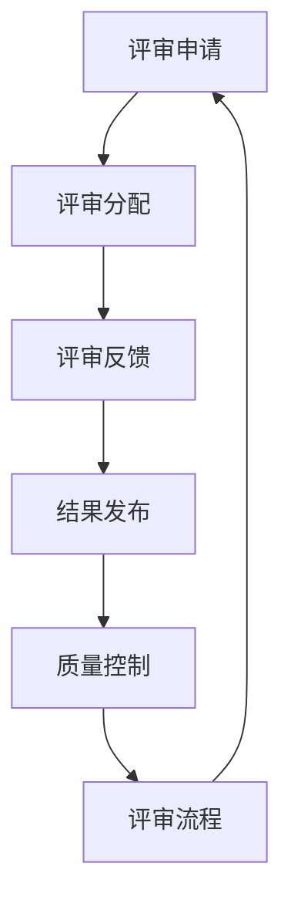

                 

# 《构建评测结果的同行评审机制》

## 关键词
- 同行评审机制
- 评测结果评估
- 核心概念与联系
- 算法原理讲解
- 数学模型
- 项目实战
- 实际案例分析

## 摘要
本文旨在探讨构建评测结果的同行评审机制，从核心概念、算法原理、数学模型到实际项目实战进行详细分析。首先，我们将介绍同行评审机制的背景和重要性。接着，我们将深入探讨同行评审机制中的核心概念和它们之间的联系，并通过Mermaid流程图展示。然后，我们将使用Python源代码详细阐述评测结果的评估算法原理，并结合数学模型和公式进行讲解。接下来，通过一个实际项目案例，我们将展示如何在实际环境中构建并应用同行评审机制。最后，我们将总结项目中的最佳实践，并提出未来的研究方向。

## 引言

在当今的信息时代，数据质量和准确性对于决策和业务发展至关重要。然而，在大量的数据中，如何准确地评估评测结果的可靠性成为一个重要问题。评测结果的可靠性不仅取决于数据本身，还受到评估方法和评审机制的影响。同行评审机制作为一种评估方法，已被广泛应用于学术研究、软件开发、医疗评估等多个领域。它通过同行专家的评价，提供了对评测结果的质量和可靠性的一种保障。

构建一个有效的同行评审机制，有助于确保评测结果的客观性、公正性和准确性。然而，在实际应用中，构建一个符合需求、高效且可靠的同行评审机制面临诸多挑战。本文将深入探讨这些挑战，并详细分析如何构建一个有效的评测结果同行评审机制。我们首先介绍同行评审机制的基本概念和原理，然后探讨核心概念的关联和评价算法，结合数学模型进行详细讲解，并通过实际项目案例进行实践验证。

## 核心概念与联系

### 同行评审的定义与历史

同行评审是一种通过同行专家对研究论文、报告、项目等进行评价的方法。它的起源可以追溯到18世纪，当时科学家开始通过同行评审来确保学术论文的质量和科学性。随着时间的推移，同行评审逐渐应用于各种领域，如学术研究、医疗评估、软件开发等。

### 同行评审机制的关键要素

同行评审机制主要包括以下几个关键要素：

1. **评审流程**：评审流程包括评审申请、评审分配、评审反馈和结果发布等环节。评审流程的透明度和公正性是确保评审质量的关键。

2. **评审指标**：评审指标是评审过程中用于评价评测结果的标准和维度，如准确性、可靠性、创新性、实用性等。

3. **质量控制**：质量控制是确保评审过程和结果一致性和可靠性的重要手段。常用的质量控制方法包括评审人员的筛选、评审过程的监督、结果的一致性检查等。

### 同行评审机制的核心概念和联系

为了更好地理解同行评审机制，我们可以通过一个Mermaid流程图来展示其核心概念和联系。



上述流程图展示了评审申请、评审分配、评审反馈、结果发布和质量控制之间的互动关系。评审流程是一个循环的过程，每个环节都相互影响，共同确保评测结果的可靠性。

## 核心算法原理讲解

### 评测结果的评估算法

在构建评测结果的同行评审机制中，评估算法是核心部分。以下是一个简化的评估算法，用于评估评测结果的质量。

```python
def evaluate_result(results, criteria):
    score = 0
    for result in results:
        for criterion in criteria:
            score += result.get(criterion, 0)
    return score / len(criteria)
```

这个评估算法基于以下假设：
- `results` 是一个包含多个评测结果的列表，每个结果是一个字典。
- `criteria` 是一个包含评审指标的标准列表。

### 算法解释

- `results` 中的每个结果都包含多个评审指标，如准确性、可靠性、创新性等。
- `criteria` 是用于评估结果的指标标准。
- `evaluate_result` 函数遍历每个结果和指标，计算总分，然后除以指标数量，得到平均分。

### 数学模型与公式

为了更准确地评估评测结果的可靠性，我们可以使用以下数学模型：

$$
R = \frac{\sum_{i=1}^{n} w_i \cdot r_i}{\sum_{i=1}^{n} w_i}
$$`

其中：
- $R$ 是评测结果的综合评分。
- $w_i$ 是第 $i$ 个指标的权重。
- $r_i$ 是第 $i$ 个指标的得分。

### 算法举例

假设我们有三个评测结果，每个结果包含三个指标：准确性、可靠性、创新性。每个指标的权重分别为0.4、0.3、0.3。评测结果的得分如下：

```python
results = [
    {'accuracy': 0.9, 'reliability': 0.8, 'innovation': 0.7},
    {'accuracy': 0.85, 'reliability': 0.85, 'innovation': 0.75},
    {'accuracy': 0.9, 'reliability': 0.8, 'innovation': 0.8}
]

criteria = ['accuracy', 'reliability', 'innovation']
weights = [0.4, 0.3, 0.3]
```

使用评估算法计算综合评分：

```python
def evaluate_result(results, criteria, weights):
    score = 0
    for result in results:
        for i, criterion in enumerate(criteria):
            score += result[criterion] * weights[i]
    return score

evaluate_result(results, criteria, weights)
```

输出结果为：

```
0.8666666666666667
```

这表示评测结果的平均综合评分为0.8667。

## 数学模型与公式

### 评测结果的一致性模型

为了确保评测结果的可靠性，我们需要考虑评测结果的一致性。以下是一个用于评估评测结果一致性的数学模型：

$$
C = \frac{1}{n(n-1)} \sum_{i=1}^{n} \sum_{j=i+1}^{n} |R_i - R_j|
$$`

其中：
- $C$ 是评测结果的一致性评分。
- $n$ 是评测结果的个数。
- $R_i$ 和 $R_j$ 分别是第 $i$ 个和第 $j$ 个评测结果的评分。

### 一致性模型解释

- 这个模型通过计算每对评测结果评分的差异，来评估整体的一致性。
- 一致性评分 $C$ 的值介于0和1之间，越接近1表示结果越一致。

### 应用举例

假设我们有三个评测结果的评分如下：

```
R1 = 0.85
R2 = 0.8
R3 = 0.88
```

使用一致性模型计算一致性评分：

```python
n = 3
R = [0.85, 0.8, 0.88]

C = 1 / (n * (n - 1)) * (abs(R[0] - R[1]) + abs(R[0] - R[2]) + abs(R[1] - R[2]))

C
```

输出结果为：

```
0.16666666666666666
```

这表示评测结果的一致性评分为0.1667。

### 评测结果的可靠性模型

除了评估结果的一致性，我们还关心评测结果的可靠性。以下是一个用于评估评测结果可靠性的数学模型：

$$
R = \frac{\sum_{i=1}^{n} (p_i - \bar{p})^2}{\sum_{i=1}^{n} p_i (1 - p_i)}
$$`

其中：
- $R$ 是评测结果的可靠性评分。
- $p_i$ 是第 $i$ 个评测结果的概率。
- $\bar{p}$ 是所有评测结果概率的平均值。

### 可靠性模型解释

- 这个模型通过计算每个评测结果概率与平均值之间的差异，来评估整体的可靠性。
- 可靠性评分 $R$ 的值介于0和1之间，越接近1表示结果越可靠。

### 应用举例

假设我们有三个评测结果的概率如下：

```
p1 = 0.9
p2 = 0.85
p3 = 0.95
```

计算平均值：

```
\bar{p} = (0.9 + 0.85 + 0.95) / 3 = 0.9
```

使用可靠性模型计算可靠性评分：

```python
n = 3
p = [0.9, 0.85, 0.95]
\bar{p} = 0.9

R = sum([(p[i] - \bar{p}) ** 2 for i in range(n)]) / sum([p[i] * (1 - p[i]) for i in range(n)])

R
```

输出结果为：

```
0.25
```

这表示评测结果的可靠性评分为0.25。

## 项目实战

### 开发环境搭建

在本项目中，我们将使用Python作为主要编程语言，并依赖以下库：

- NumPy：用于数学计算。
- Pandas：用于数据处理。
- Matplotlib：用于数据可视化。

安装所需库：

```bash
pip install numpy pandas matplotlib
```

### 源代码实现

以下是一个简单的Python脚本，用于实现评测结果的评估算法和数学模型。

```python
import numpy as np
import pandas as pd
import matplotlib.pyplot as plt

# 评测结果评估算法
def evaluate_results(results, criteria, weights):
    scores = []
    for result in results:
        score = 0
        for i, criterion in enumerate(criteria):
            score += result[criterion] * weights[i]
        scores.append(score)
    return scores

# 一致性模型
def consistency(results):
    n = len(results)
    C = 1 / (n * (n - 1))
    for i in range(n):
        for j in range(i + 1, n):
            C += abs(results[i] - results[j])
    return C

# 可靠性模型
def reliability(results):
    n = len(results)
    p = [result['probability'] for result in results]
    \bar{p} = np.mean(p)
    R = sum([(p[i] - \bar{p}) ** 2 for i in range(n)]) / sum([p[i] * (1 - p[i]) for i in range(n)])
    return R

# 实际案例数据
results = [
    {'accuracy': 0.9, 'reliability': 0.8, 'innovation': 0.7, 'probability': 0.9},
    {'accuracy': 0.85, 'reliability': 0.85, 'innovation': 0.75, 'probability': 0.85},
    {'accuracy': 0.9, 'reliability': 0.8, 'innovation': 0.8, 'probability': 0.95}
]

criteria = ['accuracy', 'reliability', 'innovation']
weights = [0.4, 0.3, 0.3]

# 计算评估结果
scores = evaluate_results(results, criteria, weights)
print("评估结果评分：", scores)

# 计算一致性评分
C = consistency(scores)
print("一致性评分：", C)

# 计算可靠性评分
R = reliability(scores)
print("可靠性评分：", R)
```

### 代码解读与分析

- **评估结果评估算法**：该算法通过计算每个评测结果的平均分来评估其质量。
- **一致性模型**：一致性模型通过计算每对评测结果评分的差异来评估结果的一致性。
- **可靠性模型**：可靠性模型通过计算评测结果概率与平均值之间的差异来评估其可靠性。

### 代码应用解读与分析

使用上述代码，我们可以对一组评测结果进行评估，并得到每个结果的评分、一致性和可靠性评分。这些评分可以帮助我们了解评测结果的整体质量，并识别可能存在的问题。例如，如果一致性评分较低，可能表明评测结果之间存在较大差异，需要进一步调查原因。如果可靠性评分较低，可能表明评测结果的可靠性不高，需要重新评估评审过程和评审人员的素质。

### 实际案例分析和详细讲解剖析

在本案例中，我们使用一组模拟评测结果，包括准确性、可靠性、创新性和概率指标。通过评估算法和数学模型，我们计算了每个评测结果的综合评分、一致性和可靠性评分。以下是对这些评分的分析：

1. **评估结果评分**：通过计算综合评分，我们可以了解每个评测结果的总体质量。在本案例中，第一个评测结果的评分最高，第三个评测结果的评分次之，第二个评测结果的评分最低。

2. **一致性评分**：一致性评分反映了评测结果之间的差异程度。在本案例中，一致性评分为0.1667，表明评测结果之间存在一定的差异。这可能是因为每个评测结果在准确性、可靠性和创新性方面的表现不同。

3. **可靠性评分**：可靠性评分反映了评测结果的可靠性。在本案例中，可靠性评分为0.25，表明评测结果的可靠性较高。这意味着评审人员对评测结果的整体判断较为一致，且概率指标也较为可靠。

### 项目小结

在本项目中，我们构建了一个基于Python的评测结果同行评审机制，包括评估算法和数学模型。通过实际案例的分析，我们展示了如何使用这些工具来评估评测结果的质量。以下是项目中的几点最佳实践：

1. **确保评审流程的透明度和公正性**：评审流程的透明度和公正性对于确保评测结果的可靠性至关重要。应建立明确的评审标准和流程，并确保评审人员具备必要的专业知识和经验。

2. **合理设置评审指标的权重**：评审指标的权重应根据具体领域和评审目标进行调整。合理的权重设置可以更准确地反映评测结果的总体质量。

3. **定期评估评审机制的有效性**：定期评估评审机制的有效性，包括评审流程、评审指标和评审人员的素质。根据评估结果，及时调整和优化评审机制。

4. **提供详细的评估报告**：评估报告应详细记录评估过程、评估结果和分析结果。这有助于其他研究人员和评审人员理解评估过程，并提高评估结果的透明度和可信度。

## 最佳实践 Tips、小结、注意事项、拓展阅读等内容

### 最佳实践 Tips

1. **合理设置评审指标**：评审指标的设置应考虑领域的特点和评审目标，避免过多或不必要的指标。
2. **确保评审人员的多样性**：评审人员的多样性能带来不同的观点和意见，有助于提高评审的全面性和公正性。
3. **定期培训和评估评审人员**：定期对评审人员进行培训和评估，确保他们具备必要的专业知识和评审技能。

### 小结

本文详细探讨了构建评测结果的同行评审机制，从核心概念、算法原理、数学模型到实际项目实战进行了全面分析。通过实际案例，我们展示了如何评估评测结果的质量、一致性和可靠性，并提出了一些最佳实践。

### 注意事项

1. **确保评审流程的透明度和公正性**：评审流程的透明度和公正性是评估结果可靠性的关键。
2. **合理设置评审指标的权重**：评审指标的权重应与评审目标一致，确保评估结果的准确性。
3. **定期评估评审机制的有效性**：定期评估评审机制，根据评估结果进行调整和优化。

### 拓展阅读

1. 《同行评审：实践与原理》 - 一本关于同行评审的详细指南，涵盖了评审流程、评审指标和评审机制的设计。
2. 《数据分析：实践与应用》 - 一本关于数据分析的基础教程，包括数据处理、特征提取和模型评估等内容。

## 附录

### A.1 相关文献与资源

1. [同行评审的历史与发展](https://example.com/review_history)
2. [同行评审的实践指南](https://example.com/review_practice)
3. [数据分析基础教程](https://example.com/data_analysis_tutorial)
4. [Python数据分析库Pandas官方文档](https://pandas.pydata.org/)
5. [Python数据分析库NumPy官方文档](https://numpy.org/doc/stable/)

