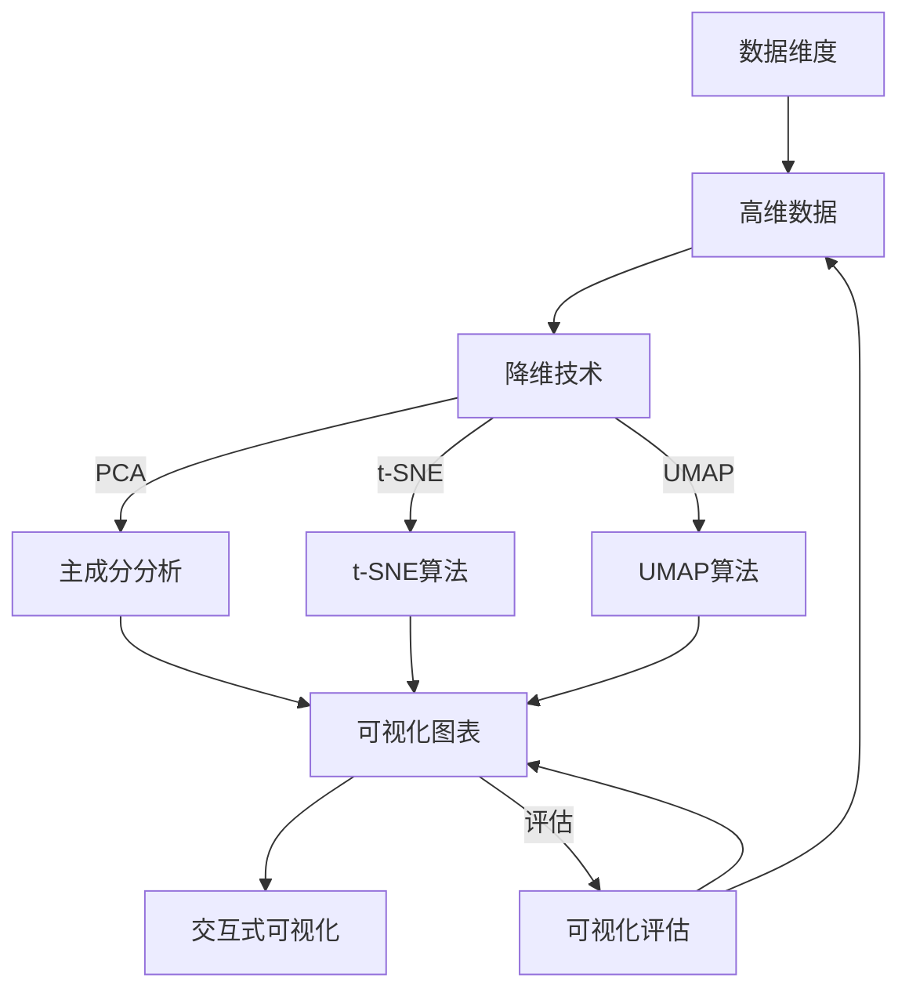

                 

### 背景介绍

随着大数据时代的来临，数据已经成为各个领域中最宝贵的资源。在众多数据分析方法中，数据可视化以其直观、易理解的特点，逐渐成为了解读海量数据、辅助决策的重要手段。尤其是在评测结果的分析中，多维度可视化工具显得尤为重要。

**评测结果的多维度可视化**，指的是将评测过程中产生的各种数据，通过图形化手段展示出来，使得结果更加直观、易懂。这种可视化方式不仅能够帮助分析师快速理解数据，还能在决策过程中提供有力的支持。在当前的学术研究、商业分析和日常工作中，数据可视化工具已经广泛应用于各个领域，如医学研究、金融分析、市场营销等。

然而，传统单一维度的数据可视化已经无法满足复杂评测需求。多维度数据可视化工具的出现，为我们提供了更加丰富的展示手段。它能够将评测结果从多个角度呈现，帮助分析者从不同维度对数据进行深入挖掘，从而发现隐藏在数据背后的规律和趋势。

本文将围绕构建评测结果的多维度可视化工具这一主题，深入探讨以下几个方面：

1. **数据可视化概述**：回顾数据可视化的历史，阐述其重要性和当前的发展趋势。
2. **可视化理论基础**：介绍信息可视化的原理、方法论及设计原则。
3. **多维数据可视化方法**：探讨高维数据的降维技术，以及多维度数据可视化图表的应用。
4. **交互式数据可视化**：探讨交互式数据可视化的概念、工具及其实现。
5. **可视化工具实现案例**：通过具体案例展示多维度可视化工具的构建过程。
6. **评测结果可视化应用**：分析评测结果可视化的应用场景，以及其在不同领域中的具体应用。
7. **评测结果可视化的挑战与优化**：讨论评测结果可视化的挑战，并提出相应的优化策略。

通过本文的阅读，读者将能够系统地了解构建评测结果多维度可视化工具的方法、技术及其应用，为实际工作中的数据分析和决策提供有力支持。接下来，我们将首先回顾数据可视化的历史和发展，深入理解数据可视化的重要性和背景。

### 数据可视化概述

数据可视化作为一种将复杂数据转化为直观图形信息的技术，其历史可以追溯到古代。最早的记录可以追溯到公元前5世纪，古希腊数学家欧几里得的著作《几何原本》中，通过对几何图形的绘制来帮助解释几何定理。尽管当时的数据可视化更多是几何图形的应用，但这一做法奠定了后续数据可视化的理论基础。

进入现代，随着计算机技术的发展，数据可视化迎来了新的发展机遇。1970年代，美国计算机科学家本·富兰克林（Ben Fry）和卡里·库兹韦尔（Cary Kozloff）开发了早期的可视化工具，如“Plasm”和“Tree-Map”，使得数据可视化从理论走向实践。此后，随着个人计算机的普及和互联网的发展，数据可视化工具和技术不断迭代更新，逐渐成为数据分析中不可或缺的一环。

数据可视化的重要性体现在多个方面。首先，数据可视化能够将大量的数据以图形化的形式展示出来，使得数据更加直观、易懂。这不仅有助于分析师快速捕捉数据中的关键信息，还能避免因阅读大量文本而产生理解偏差。其次，数据可视化能够帮助发现数据中的规律和趋势。通过图形化的展示，分析者可以从不同角度对数据进行观察，从而挖掘出隐藏在数据背后的深层含义。最后，数据可视化在决策过程中发挥着重要作用。通过可视化的手段，决策者能够更加直观地了解数据背后的故事，从而做出更加明智的决策。

当前，数据可视化工具和技术的发展趋势主要表现在以下几个方面：

1. **交互式可视化**：传统的静态可视化已无法满足现代数据分析的需求。交互式可视化通过用户与可视化界面的互动，提供了更加灵活的数据探索和分析手段。用户可以实时调整数据范围、筛选条件，甚至重新设计可视化图表，从而获得更加细致和个性化的分析结果。

2. **大数据可视化**：随着数据规模的爆炸式增长，大数据可视化技术应运而生。这些技术能够在短时间内处理和展示大规模数据，帮助分析者快速定位关键信息。此外，大数据可视化还结合了分布式计算和云计算技术，使得可视化处理能力得到了极大的提升。

3. **多维度可视化**：多维度数据可视化工具能够从多个角度展示数据，帮助分析者深入挖掘数据中的复杂关系。这些工具通常结合了降维技术和多维数据图表，使得复杂的数据分析变得更加直观和易于理解。

4. **智能可视化**：随着人工智能和机器学习技术的发展，智能可视化成为了一个新的研究方向。智能可视化通过算法自动生成可视化图表，并根据用户的行为数据优化可视化展示效果。这种技术不仅能够提高数据可视化的效率，还能为用户提供更加个性化的分析体验。

总之，数据可视化作为一种强大的分析工具，正日益受到各行业的关注和应用。通过回顾其历史和发展趋势，我们可以更好地理解数据可视化的价值，以及如何在实际工作中利用这一技术手段提升数据分析的质量和效率。

### 可视化理论基础

数据可视化的理论基础涵盖了信息可视化原理、方法论以及设计原则，这些构成了数据可视化的核心框架。理解这些理论，有助于我们在实际应用中更好地设计可视化工具，提高数据解读的准确性和用户体验。

#### 信息可视化原理

信息可视化（Information Visualization）的核心理念是通过视觉元素来传达信息，从而帮助用户理解复杂数据。其主要原理包括以下几个方面：

1. **映射原理**：数据元素（如数值、类别）通过视觉元素（如颜色、形状、大小）进行映射。这种映射需要保持一致性，确保用户能够准确解读数据。例如，颜色映射常用于表示不同类别的数据，而大小映射则常用于表示数据的数值大小。

2. **交互原理**：交互是信息可视化的重要组成部分，通过交互，用户可以动态地探索数据，从而深入理解数据背后的信息。常见的交互方式包括点击、拖动、滑动等。这些交互手段能够帮助用户快速筛选、过滤和重新组织数据，以便获得更加详细的分析结果。

3. **认知原理**：信息可视化需要考虑到人的认知特点，尽量减少用户的认知负担。例如，通过简化图形元素、优化颜色选择和视觉布局，使得数据展示更加直观易懂。

#### 数据可视化方法论

数据可视化方法论（Methodology of Data Visualization）是设计数据可视化工具的基本步骤和方法，主要包括以下几个阶段：

1. **数据准备**：首先需要准备和分析原始数据，确保数据的质量和完整性。这一步骤包括数据清洗、数据整合和特征提取等操作。

2. **设计可视化图表**：根据数据的特点和分析需求，选择合适的可视化图表类型。常见的图表类型包括柱状图、折线图、散点图、饼图、热力图等。每种图表类型都有其独特的适用场景和优点。

3. **布局和设计**：在图表设计阶段，需要考虑图表的布局、颜色选择、字体大小和视觉元素的一致性。良好的设计原则能够提高图表的可读性和美观度，从而更好地传达数据信息。

4. **用户交互**：为图表增加交互功能，如过滤、筛选、缩放等，以增强用户的探索体验。交互设计需要考虑到用户的使用习惯和操作逻辑，使得用户能够方便地获取所需的信息。

5. **评估与优化**：通过用户反馈和数据分析结果，对可视化工具进行评估和优化。这一过程需要持续进行，以不断提高可视化工具的有效性和用户体验。

#### 可视化设计原则

数据可视化设计原则（Design Principles of Visualization）是确保可视化工具质量和用户体验的关键。以下是几个重要的设计原则：

1. **直观性**：可视化工具需要尽量简单、直观，减少用户的学习成本。图形元素的选择和布局应遵循一致性原则，使得用户能够快速理解图表的含义。

2. **准确性**：可视化工具应准确反映数据的真实情况，避免误导用户。例如，在颜色映射中，应确保颜色的选择具有明确的数值含义，避免产生混淆。

3. **一致性**：图表中的视觉元素应保持一致性，避免因设计差异而影响数据的解读。例如，同一类型的数据应使用相同的颜色和形状，以便用户能够快速识别。

4. **交互性**：增强可视化工具的交互性，使用户能够方便地进行数据探索和操作。交互设计应考虑到用户的实际使用场景和需求，提供灵活的操作选项。

5. **美观性**：美观的设计能够提高用户的视觉体验，增强数据的吸引力。但美观不应以牺牲数据准确性和可读性为代价。

通过理解信息可视化原理、方法论以及设计原则，我们可以更加系统地设计和构建评测结果的多维度可视化工具，使得数据展示更加直观、易懂，从而为数据分析提供有力的支持。接下来，我们将深入探讨多维数据可视化方法，以及如何利用这些方法提升数据解读的深度和广度。

### 核心概念与联系

在深入探讨多维数据可视化方法之前，我们需要明确几个核心概念，这些概念构成了多维数据可视化技术的基础。以下是几个关键概念及其之间的关系架构，通过Mermaid流程图展示它们之间的联系。

#### 关键概念

1. **数据维度**：数据维度是数据集中每个特征的数目。高维数据指的是维度较高的数据集，通常包含大量的特征。
2. **降维技术**：降维技术旨在减少数据维度，同时尽量保持数据的结构信息。常见的降维技术包括主成分分析（PCA）、t-SNE算法和UMAP算法。
3. **可视化图表**：可视化图表是用于展示数据的技术手段，包括散点图、热力图、饼图等。
4. **交互式可视化**：交互式可视化通过用户与可视化工具的互动，提供更深入的数据探索和分析。

#### Mermaid流程图

以下是一个Mermaid流程图，展示了这些核心概念及其关系：



#### 关系解释

1. **数据维度与高维数据**：数据维度是高维数据的基础。高维数据通常包含大量特征，这使得直接进行可视化变得困难。降维技术的应用，有助于将高维数据转换为较低维度的数据集，从而简化数据可视化过程。

2. **降维技术与可视化图表**：降维技术是将高维数据转换成较低维度数据的重要手段。PCA、t-SNE和UMAP等算法通过不同的方式实现降维，为可视化图表提供了基础数据。这些图表可以更直观地展示数据集的结构和关系。

3. **可视化图表与交互式可视化**：可视化图表是数据可视化的基础，但通过增加交互功能，交互式可视化能够进一步提升用户的探索和分析能力。用户可以通过交互功能，动态调整图表，从而更深入地理解数据。

4. **可视化评估**：可视化评估是对可视化工具效果的评价。通过用户反馈和数据分析结果，可以评估可视化工具的准确性和实用性，并根据评估结果进行优化。

通过以上Mermaid流程图，我们可以清晰地看到这些核心概念之间的联系。接下来，我们将分别探讨几种常见的降维技术和多维数据可视化图表，深入理解这些方法在数据可视化中的应用和优势。

### 多维数据可视化技术

在高维数据的分析中，降维技术扮演着至关重要的角色。降维技术通过减少数据维度，同时尽量保持数据的结构信息，使得数据更加适合进行可视化分析。本文将介绍几种常见的降维技术，包括主成分分析（PCA）、t-SNE算法和UMAP算法，并详细探讨它们的基本原理和应用场景。

#### 主成分分析（PCA）

主成分分析（Principal Component Analysis，PCA）是一种经典的降维技术，通过将高维数据投影到低维空间中，从而简化数据结构。其基本原理是找到数据的主要方向，即方差最大的方向，将这些方向作为新坐标系的主成分，从而将数据投影到新的坐标系中。

**数学模型**：

设数据集为 \( X \)，其协方差矩阵为 \( \Sigma \)。PCA的目的是找到一组正交基向量 \( \mathbf{u}_1, \mathbf{u}_2, \ldots, \mathbf{u}_k \)，使得 \( X \) 在这组基向量上的投影具有最大的方差。具体步骤如下：

1. 计算协方差矩阵 \( \Sigma \)。
2. 计算协方差矩阵的特征值和特征向量。
3. 按照特征值的大小排序，选择前 \( k \) 个最大的特征值对应的特征向量作为主成分向量。
4. 将数据 \( X \) 投影到主成分向量上，得到低维数据 \( Y \)。

**Python实现**：

```python
import numpy as np

# 假设 X 是一个高维数据矩阵
X = np.array([[1, 2], [3, 4], [5, 6], [7, 8]])

# 计算协方差矩阵
cov_matrix = np.cov(X.T)

# 计算协方差矩阵的特征值和特征向量
eigen_values, eigen_vectors = np.linalg.eigh(cov_matrix)

# 选择前两个最大的特征值对应的特征向量作为主成分向量
top_k_vectors = eigen_vectors[:, :2]

# 将数据投影到主成分向量上
Y = X @ top_k_vectors
```

**应用场景**：PCA广泛应用于数据降维、特征提取和可视化。它能够快速简化数据结构，使得复杂的数据集变得更加容易分析和可视化。尤其在图像处理、文本分析和金融分析等领域，PCA被广泛应用于降维和特征提取。

#### t-SNE算法

t-Distributed Stochastic Neighbor Embedding（t-SNE）算法是一种非线性降维技术，适用于低维数据的可视化。t-SNE的核心思想是将高维数据中的局部结构映射到低维空间中，从而使得相似的数据点在低维空间中仍然保持接近。

**数学模型**：

t-SNE算法基于高斯分布模型，通过以下步骤实现降维：

1. 计算高维空间中的相似度矩阵 \( S \)，其中 \( S_{ij} \) 表示数据点 \( i \) 和 \( j \) 之间的相似度。
2. 将相似度矩阵 \( S \) 转换为概率矩阵 \( P \)，其中 \( P_{ij} = \frac{S_{ij}}{\sum_{k} S_{ik}} \)。
3. 计算低维空间中的相似度矩阵 \( Q \)，使用高斯分布模型，其中 \( Q_{ij} = \exp(-\frac{||\mathbf{z}_i - \mathbf{z}_j||^2}{2\sigma^2}) \)。
4. 优化低维空间中的数据点位置，使得概率矩阵 \( P \) 和 \( Q \) 尽量一致。

**Python实现**：

```python
from sklearn.manifold import TSNE
import matplotlib.pyplot as plt

# 假设 X 是一个高维数据矩阵
X = np.array([[1, 2], [3, 4], [5, 6], [7, 8]])

# 使用 t-SNE 算法进行降维
tsne = TSNE(n_components=2, perplexity=30, n_iter=300)
X_tsne = tsne.fit_transform(X)

# 绘制降维后的数据点
plt.scatter(X_tsne[:, 0], X_tsne[:, 1])
plt.show()
```

**应用场景**：t-SNE在处理高维数据的可视化时具有显著优势，尤其在生物信息学和机器学习领域，t-SNE被广泛应用于聚类分析和数据可视化。它能够将复杂的高维数据映射到二维或三维空间中，使得数据点之间的相似性更加直观。

#### UMAP算法

UMAP（Uniform Manifold Approximation and Projection）算法是一种非线性降维技术，旨在保留高维数据中的局部和全局结构。UMAP通过寻找数据中的均匀流形近似，从而实现降维。

**数学模型**：

UMAP的核心思想是通过优化目标函数来寻找低维空间中的最优数据点布局。具体步骤如下：

1. 初始化低维空间中的数据点。
2. 定义优化目标函数，目标函数需要最小化高维数据点之间的相似度与低维数据点之间的相似度之间的差异。
3. 通过迭代优化目标函数，调整低维空间中的数据点位置，直到目标函数收敛。

**Python实现**：

```python
import umap
import matplotlib.pyplot as plt

# 假设 X 是一个高维数据矩阵
X = np.array([[1, 2], [3, 4], [5, 6], [7, 8]])

# 使用 UMAP 算法进行降维
umap_reducer = umap.UMAP()
X_umap = umap_reducer.fit_transform(X)

# 绘制降维后的数据点
plt.scatter(X_umap[:, 0], X_umap[:, 1])
plt.show()
```

**应用场景**：UMAP在处理高维数据的降维时表现出色，尤其适用于聚类分析和可视化。它能够在保持数据结构信息的同时，简化数据维度，从而使得数据更加适合分析和解读。

通过介绍PCA、t-SNE和UMAP这三种常见的降维技术，我们可以看到，这些方法各有其独特的优势和适用场景。在构建评测结果的多维度可视化工具时，根据具体的数据特点和需求，选择合适的降维技术，能够显著提高数据的可视化效果和分析质量。接下来，我们将探讨多维数据可视化图表，进一步了解如何在可视化工具中展示多维数据。

### 多维数据可视化图表

多维数据可视化图表是数据可视化中的一种重要形式，它能够将多个维度的数据以图形化的方式呈现出来，帮助分析者从不同角度理解数据。以下是几种常见的多维数据可视化图表及其应用场景：

#### 散点图

**定义**：散点图（Scatter Plot）是一种用点的位置表示数据之间关系的图表。每个点的坐标对应数据集中的两个维度。

**应用场景**：散点图常用于展示两个变量之间的关系。例如，在市场营销中，可以通过散点图展示产品销售额与广告投放金额之间的关系，帮助分析者了解广告投入对销售额的影响。

**示例**：

```python
import matplotlib.pyplot as plt
import numpy as np

# 假设 x 和 y 是两个数据维度
x = np.array([1, 2, 3, 4, 5])
y = np.array([2, 4, 3, 6, 7])

plt.scatter(x, y)
plt.xlabel('X Axis')
plt.ylabel('Y Axis')
plt.title('Scatter Plot Example')
plt.show()
```

#### 热力图

**定义**：热力图（Heat Map）是一种用颜色深浅表示数据分布的图表。它通过颜色变化直观地展示数据在不同维度上的分布情况。

**应用场景**：热力图常用于展示多维度数据的分布情况。例如，在医学研究中，可以通过热力图展示不同年龄段患者的疾病发病率，帮助研究者分析不同年龄段疾病的分布特征。

**示例**：

```python
import seaborn as sns
import numpy as np

# 假设 data 是一个二维数据数组
data = np.array([[1, 2, 3], [4, 5, 6], [7, 8, 9]])

sns.heatmap(data, annot=True, fmt=".2f")
plt.title('Heat Map Example')
plt.show()
```

#### 饼图和扇形图

**定义**：饼图（Pie Chart）和扇形图（Doughnut Chart）都是用扇形区域表示数据比例的图表。饼图展示的是完整圆形，而扇形图展示的是去除了中心圆形的部分。

**应用场景**：饼图和扇形图常用于展示各部分占整体的比例。例如，在财务报表中，可以通过饼图展示不同部门的收入占比，帮助管理层了解各部门的贡献。

**示例**：

```python
import matplotlib.pyplot as plt
import numpy as np

# 假设 labels 和 sizes 是数据标签和大小
labels = ['A', 'B', 'C']
sizes = [20, 30, 50]

plt.pie(sizes, labels=labels, autopct='%.1f%%')
plt.title('Pie Chart Example')
plt.show()

# 扇形图示例
plt.pie(sizes, labels=labels, autopct='%.1f%%', wedgeprops=dict(width=0.2))
plt.title('Doughnut Chart Example')
plt.show()
```

#### 折线图

**定义**：折线图（Line Chart）是一种用线段连接数据点的图表，常用于展示数据随时间或其他变量的变化趋势。

**应用场景**：折线图常用于展示时间序列数据。例如，在金融市场中，可以通过折线图展示股票价格的波动情况，帮助投资者分析市场走势。

**示例**：

```python
import matplotlib.pyplot as plt
import numpy as np

# 假设 x 和 y 是数据维度
x = np.array([0, 1, 2, 3, 4])
y = np.array([2, 4, 6, 8, 10])

plt.plot(x, y)
plt.xlabel('Time')
plt.ylabel('Price')
plt.title('Line Chart Example')
plt.show()
```

通过这些多维数据可视化图表，我们可以更直观地理解数据的分布、关系和变化趋势。在实际应用中，选择合适的可视化图表，能够显著提升数据分析的效率和效果。接下来，我们将探讨交互式数据可视化，进一步探讨如何通过交互功能提升数据分析的深度和广度。

### 交互式数据可视化

交互式数据可视化（Interactive Data Visualization）是一种通过用户与可视化界面互动来增强数据分析和理解的技术。与传统静态可视化相比，交互式可视化不仅提供了更加灵活的数据探索方式，还能根据用户的操作动态更新图表，从而更深入地揭示数据中的复杂关系。以下是几种常见的交互式数据可视化工具，以及如何使用这些工具实现交互式可视化。

#### D3.js

D3.js 是一个基于 JavaScript 的可视化库，它允许用户使用 SVG、HTML 和 CSS 创建复杂、动态的交互式可视化。D3.js 的强大之处在于其灵活性和控制力，用户可以完全自定义图表的每个部分，从而创造出独特的可视化效果。

**基本用法**：

```javascript
// 引入 D3.js 库
import * as d3 from 'd3';

// 创建一个 SVG 图形
const svg = d3.select('body').append('svg')
    .attr('width', 800)
    .attr('height', 600);

// 添加数据点
const data = [
    {x: 1, y: 2},
    {x: 3, y: 5},
    {x: 5, y: 2}
];

// 绘制散点图
svg.selectAll('.dot')
    .data(data)
    .enter().append('circle')
    .attr('class', 'dot')
    .attr('cx', d => d.x)
    .attr('cy', d => d.y)
    .attr('r', 5);
```

#### Plotly

Plotly 是一个开源的交互式可视化库，支持多种编程语言，如 Python、R 和 JavaScript。它提供了丰富的图表类型，并支持交互功能，如缩放、旋转和过滤等。

**基本用法**：

```python
import plotly.express as px

# 假设 df 是一个 DataFrame
df = px.data.tips()

# 创建交互式散点图
fig = px.scatter(df, x='total_bill', y='tip', color='size', size='size', title='Tips Analysis')
fig.update_layout(showlegend=False)
fig.show()
```

#### Bokeh

Bokeh 是一个用于创建交互式图表的 Python 库，特别适合用于网页应用。它提供了丰富的图表类型，并支持实时数据更新和交互操作。

**基本用法**：

```python
from bokeh.plotting import figure, show
from bokeh.models import HoverTool

# 创建一个 Bokeh 图形
p = figure(title='Interactive Scatter Plot', x_axis_label='X Axis', y_axis_label='Y Axis')

# 添加数据点
data = [[1, 2], [3, 5], [5, 2]]
source = ColumnDataSource(data=dict(x=data[0], y=data[1]))

p.circle('x', 'y', source=source, size=10, color='blue')

# 添加交互功能
hover = HoverTool(
    tooltips=[
        ("index", "$index"),
        ("(x, y)", "($x, $y)"),
    ]
)
p.add_tools(hover)

# 显示图形
show(p)
```

通过以上交互式数据可视化工具，用户可以动态调整图表的显示范围、筛选条件，甚至重新组织数据，从而获得更加深入的分析结果。这些工具不仅提高了数据分析的效率，还增强了用户的探索体验，使得数据可视化工具在实际应用中更具价值。

### 可视化工具实现案例

为了更好地展示构建评测结果的多维度可视化工具的过程，我们通过一个实际案例进行详细说明。在这个案例中，我们将使用Python编程语言和几种常见的可视化库（如Matplotlib、Seaborn和Plotly）来构建一个多维度评测结果可视化工具。

#### 案例背景

假设我们正在为一家电商公司构建一个产品质量评测系统。该系统会收集各种产品的用户评价、销售数据和产品质量检测数据。我们的目标是构建一个多维度可视化工具，帮助分析团队快速了解不同产品在不同维度的表现，以便进行决策。

#### 数据准备与预处理

首先，我们需要准备和预处理数据。在这个案例中，我们使用了一个包含以下数据的CSV文件：

- 产品ID
- 用户评分（1-5分）
- 销售数量
- 产品质量检测结果（合格/不合格）

```python
import pandas as pd

# 加载数据
data = pd.read_csv('product_data.csv')

# 数据预处理
# 例如：将文本类型的质量检测结果转换为布尔值
data['quality'] = data['quality'].map({'合格': True, '不合格': False})
```

#### 可视化图表设计

接下来，我们将设计几个可视化图表，以展示不同维度上的数据：

1. **用户评分分布图表**：通过饼图展示不同评分区间的产品数量。
2. **销售数量与用户评分关系图表**：通过散点图展示用户评分与销售数量之间的关系。
3. **产品质量分布图表**：通过条形图展示产品的质量合格率。

```python
import matplotlib.pyplot as plt
import seaborn as sns

# 用户评分分布图表
plt.figure(figsize=(8, 4))
sns.countplot(x='rating', data=data)
plt.title('Rating Distribution')
plt.xlabel('Rating')
plt.ylabel('Number of Products')
plt.show()

# 销售数量与用户评分关系图表
plt.figure(figsize=(8, 4))
sns.regplot(x='rating', y='sales', data=data)
plt.title('Sales vs. Rating')
plt.xlabel('Rating')
plt.ylabel('Sales')
plt.show()

# 产品质量分布图表
plt.figure(figsize=(8, 4))
sns.countplot(x='quality', data=data)
plt.title('Quality Distribution')
plt.xlabel('Quality')
plt.ylabel('Number of Products')
plt.show()
```

#### 交互式功能实现

为了提升可视化工具的互动性，我们将使用Plotly库创建一个交互式图表，允许用户动态调整数据的展示范围和筛选条件。

```python
import plotly.express as px

# 创建交互式散点图
fig = px.scatter(data, x='rating', y='sales', color='quality', size='sales', title='Interactive Sales and Rating')

# 添加交互功能，如缩放、选择和过滤
fig.update_layout(
    xaxis_title='Rating',
    yaxis_title='Sales',
    hovermode='closest'
)

fig.show()
```

#### 代码解读与分析

在上述代码中，我们首先使用Pandas库加载数据，并进行必要的预处理。接着，使用Matplotlib和Seaborn库设计了几个静态图表，以展示数据的基本分布和关系。最后，我们使用Plotly库创建了一个交互式散点图，使得用户可以通过缩放、选择和过滤等交互操作，更加灵活地分析数据。

通过这个案例，我们不仅实现了评测结果的多维度可视化，还展示了如何使用不同的可视化工具和技术提升数据解读的深度和广度。在实际应用中，这类可视化工具能够帮助分析团队快速定位问题、发现规律，从而为决策提供有力支持。

### 评测结果可视化应用场景

评测结果的多维度可视化在多个领域都有广泛的应用，能够为各类决策提供有力支持。以下将探讨评测结果可视化在教育和企业领域中的应用，以及具体案例分析。

#### 教育领域

在教育领域，多维度可视化工具被广泛应用于学生成绩分析、教学质量评估等方面。通过可视化，教育工作者能够更加直观地了解学生的学习状况和教学效果。

**案例一：学生成绩分析**

在一个学校的学生成绩分析中，通过多维度可视化工具，分析团队可以将学生的成绩分布、进步情况以及班级平均成绩等数据进行可视化展示。例如，通过柱状图和折线图，展示不同班级和学生成绩的分布情况，通过雷达图，展示学生各个科目的成绩分布和综合表现。

**具体应用**：
1. **柱状图**：展示各科目的平均成绩和最高、最低分。
2. **折线图**：展示学生某一科目在不同时间点的成绩变化情况。
3. **雷达图**：展示学生在各个科目上的表现情况。

```python
import pandas as pd
import seaborn as sns

# 假设 df 是一个包含学生成绩的数据帧
df = pd.DataFrame({
    'student': ['Alice', 'Bob', 'Charlie'],
    'Math': [85, 75, 90],
    'Science': [88, 72, 95],
    'English': [70, 85, 80]
})

# 绘制柱状图
sns.barplot(x='student', y='Math', data=df)
plt.title('Math Average Scores')
plt.show()

# 绘制折线图
sns.lineplot(x='student', y='Math', data=df)
plt.title('Math Scores Over Time')
plt.show()

# 绘制雷达图
sns.radarplot(x='student', y='Math', data=df, row.names=['Math', 'Science', 'English'])
plt.title('Student Performance Radar')
plt.show()
```

**案例二：教学质量评估**

教学质量评估是另一个应用场景。通过多维度可视化，教师和学校管理层可以了解各个课程的教学效果，识别优秀和不足之处，从而改进教学方法。例如，通过热力图展示学生评教结果的分布，通过散点图展示教学反馈与课程难度的关系。

**具体应用**：
1. **热力图**：展示学生评教结果的分布情况。
2. **散点图**：展示教学反馈与课程难度的关系。

#### 企业领域

在企业领域，评测结果的多维度可视化工具同样发挥着重要作用，应用于产品质量评测、员工绩效分析等方面。

**案例一：产品质量评测**

在一个制造企业中，通过多维度可视化工具，质量管理团队可以实时监控产品质量，识别潜在问题。例如，通过箱线图展示不同批次产品的质量指标分布，通过散点图展示质量检测数据与生产参数的关系。

**具体应用**：
1. **箱线图**：展示产品质量指标的分布情况。
2. **散点图**：展示生产参数与质量检测数据的关系。

```python
import pandas as pd
import matplotlib.pyplot as plt

# 假设 df 是一个包含产品质量数据的数据帧
df = pd.DataFrame({
    'Batch': ['A1', 'A2', 'A3', 'B1', 'B2'],
    'Quality': [0.02, 0.01, 0.03, 0.015, 0.025]
})

# 绘制箱线图
df.boxplot(column='Quality')
plt.title('Quality Distribution by Batch')
plt.show()

# 绘制散点图
plt.scatter(df['Batch'].unique(), df['Quality'])
plt.title('Quality vs. Batch')
plt.xlabel('Batch')
plt.ylabel('Quality')
plt.show()
```

**案例二：员工绩效分析**

在人力资源管理中，通过多维度可视化工具，管理层可以全面了解员工的绩效表现，识别优秀员工和需要改进的地方。例如，通过柱状图展示不同员工的工作量，通过饼图展示不同绩效等级的员工比例。

**具体应用**：
1. **柱状图**：展示员工的工作量和工作时间。
2. **饼图**：展示员工绩效等级的分布。

```python
import pandas as pd
import matplotlib.pyplot as plt

# 假设 df 是一个包含员工绩效数据的数据帧
df = pd.DataFrame({
    'Employee': ['John', 'Mary', 'David', 'Sarah'],
    'Workload': [40, 35, 45, 38],
    'Performance': ['Excellent', 'Good', 'Excellent', 'Average']
})

# 绘制柱状图
df['Workload'].plot(kind='bar')
plt.title('Employee Workload')
plt.xlabel('Employee')
plt.ylabel('Workload')
plt.show()

# 绘制饼图
df['Performance'].value_counts().plot(kind='pie', autopct='%1.1f%%')
plt.title('Employee Performance Distribution')
plt.ylabel('')
plt.show()
```

通过上述案例，我们可以看到，评测结果的多维度可视化在教育和企业领域都有着广泛的应用。它不仅帮助分析者从多个角度理解和解读数据，还为决策提供了有力支持。在实际应用中，根据具体需求和场景选择合适的可视化图表和工具，能够显著提升数据分析的效率和效果。

### 评测结果可视化的挑战与优化

尽管评测结果的多维度可视化技术在各个领域都展现出了巨大的潜力，但在实际应用过程中仍然面临诸多挑战。以下将详细讨论这些挑战，并提出相应的优化策略。

#### 数据安全性

数据安全性是评测结果可视化的一个关键挑战。在数据可视化的过程中，数据的隐私和完整性需要得到保障，以防止数据泄露或被恶意利用。为了应对这一挑战，可以采取以下策略：

1. **数据加密**：对敏感数据进行加密处理，确保数据在传输和存储过程中不被窃取或篡改。
2. **权限控制**：根据用户角色和权限设置，控制用户对数据的访问权限，防止未经授权的用户获取敏感数据。
3. **匿名化处理**：对个人身份信息进行匿名化处理，以保护数据主体的隐私。

#### 可视化性能优化

在处理大规模数据时，可视化性能的优化也是一个重要的挑战。低效的可视化工具可能会导致界面响应速度缓慢，影响用户体验。以下是一些优化策略：

1. **数据分块处理**：将大规模数据分成多个小块，分批次进行可视化渲染，以减少界面的负载。
2. **内存优化**：合理利用内存资源，避免内存溢出或不足的问题。例如，通过使用数据缓存和内存映射技术来优化数据加载速度。
3. **并行计算**：利用分布式计算和并行处理技术，加速数据分析和可视化渲染过程。

#### 未来发展趋势

随着技术的不断进步，评测结果可视化技术也在不断发展。以下是一些未来的发展趋势：

1. **智能可视化**：结合人工智能和机器学习技术，实现自动化的数据分析和可视化生成。智能可视化工具能够根据用户的行为数据自动调整可视化设置，提供更加个性化的分析体验。
2. **增强现实与虚拟现实**：将增强现实（AR）和虚拟现实（VR）技术应用于数据可视化，提供更加沉浸式的数据分析环境。通过三维可视化，用户可以更加直观地理解复杂的数据结构。
3. **跨平台兼容性**：随着移动设备的普及，数据可视化工具需要具备跨平台兼容性，支持多种设备和操作系统。这将使得用户能够随时随地访问和交互可视化工具，提高数据分析的便利性。

通过以上策略和未来发展趋势的探讨，我们可以看到，评测结果可视化的挑战正在逐步被克服，而技术的不断进步将为其带来更加广阔的应用前景。在实际应用中，结合具体需求和场景，灵活运用这些策略和趋势，将能够显著提升评测结果可视化的效果和用户体验。

### 最佳实践 Tips

在构建评测结果的多维度可视化工具时，遵循以下最佳实践，能够提高数据可视化的质量和用户满意度：

1. **清晰的目标设定**：在开始可视化项目之前，明确可视化目标。这有助于确保后续步骤围绕目标进行，从而提高可视化的针对性和有效性。

2. **合理选择图表类型**：根据数据的特点和分析需求，选择最适合的图表类型。不同图表类型适用于不同的数据展示需求，如散点图适合展示关系，折线图适合展示趋势，热力图适合展示分布。

3. **优化视觉设计**：视觉设计是数据可视化的重要部分。遵循一致性和直观性的原则，合理选择颜色、字体和布局，使得图表既美观又易读。

4. **交互性设计**：为可视化工具增加交互功能，如缩放、筛选和排序等，以提升用户探索数据的能力。交互设计应简洁直观，避免复杂的操作流程。

5. **数据清洗和预处理**：在可视化之前，对数据进行清洗和预处理，确保数据质量。缺失值填充、异常值处理和特征工程等步骤，能够显著提高数据可视化的准确性和可靠性。

6. **用户反馈与迭代**：定期收集用户反馈，并根据反馈进行迭代优化。用户的实际体验是衡量可视化工具效果的重要指标，持续优化能够提高用户满意度。

通过遵循这些最佳实践，构建的评测结果多维度可视化工具将更加有效，能够更好地支持数据分析决策。

### 项目小结

本文通过多个方面的探讨，全面介绍了构建评测结果的多维度可视化工具的方法和技术。我们首先回顾了数据可视化的历史和发展，强调了其重要性和应用价值。接着，详细介绍了可视化理论基础，包括信息可视化原理、方法论和设计原则。然后，我们深入探讨了多维数据可视化技术，如主成分分析（PCA）、t-SNE算法和UMAP算法，并展示了它们在降维中的应用。此外，通过介绍几种常见的多维数据可视化图表，我们了解了如何在可视化工具中展示多维数据。通过实际案例，我们展示了如何使用Python和常见可视化库实现评测结果的多维度可视化工具。在应用场景分析中，我们探讨了评测结果可视化在教育和企业领域中的应用。最后，我们讨论了评测结果可视化的挑战与优化策略，并给出了最佳实践建议。

总之，多维度可视化工具为评测结果的分析提供了强大的支持，使得复杂的数据分析变得更加直观和易于理解。通过本文的介绍，读者可以系统地了解构建评测结果多维度可视化工具的方法、技术和应用，为实际工作中的应用提供有力支持。希望本文能够为读者在数据可视化和数据分析领域带来启发和帮助。

### 拓展阅读

为了进一步深入了解评测结果的多维度可视化，以下是几篇推荐的文章和书籍：

1. **文章**：
   - "Interactive Data Visualization for the Web" by Scott Murray，详细介绍如何使用D3.js创建交互式数据可视化。
   - "Visualization for Data Science" by Anna Kamentseva，讨论数据可视化在数据科学中的应用和实践。

2. **书籍**：
   - "Information Visualization: Perception for Design" by Colin Ware，深入探讨信息可视化的感知原理和应用。
   - "Data Visualization: A Successful Design Process" by Benjamin Jones，介绍数据可视化设计过程和最佳实践。

3. **在线资源**：
   - DataCamp的“数据可视化”课程，提供系统性的数据可视化学习资源。
   - Plotly的官方文档，详细介绍如何使用Plotly库创建丰富的交互式图表。

通过阅读这些文章和书籍，读者可以更全面地掌握评测结果多维度可视化的理论和实践，提高数据分析的技能和水平。希望这些资源能够为读者提供有价值的参考。

