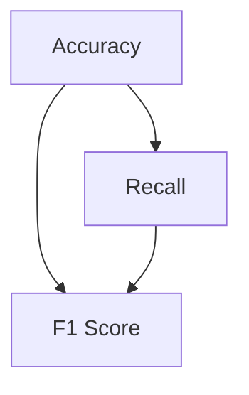

                 

### 文章标题

# 《构建评测结果的模型性能排行榜》

> 关键词：模型性能评价、排行榜构建、评价指标、机器学习、深度学习、Python代码

> 摘要：本文旨在详细探讨构建评测结果的模型性能排行榜的方法和步骤。我们将从基础概念入手，逐步深入到核心算法原理，并通过实际案例展示如何实现和优化模型性能评测。文章还将探讨不同场景下的排行榜构建策略，并提供实用的最佳实践和注意事项。

---

### 目录

1. **模型性能评价基础**

   - 1.1 模型性能评价的重要性
   - 1.2 常见评价指标
   - 1.3 模型性能评价流程图

2. **核心算法原理讲解**

   - 2.1 准确率、召回率、F1值等基本指标
   - 2.2 伪代码与算法原理
   - 2.3 数学模型和数学公式

3. **实际案例解析**

   - 3.1 评价工具与环境搭建
   - 3.2 源代码实现与解读
   - 3.3 代码分析与优化

4. **模型性能排行榜构建**

   - 4.1 排行榜构建概述
   - 4.2 排行榜的构建方法
   - 4.3 排行榜的优化策略

5. **案例分析与应用**

   - 5.1 文本分类性能排行榜
   - 5.2 图像识别性能排行榜
   - 5.3 推荐系统性能排行榜

6. **附录**

   - 附录A：工具与资源介绍

---

### 引言

在人工智能领域，模型性能评价是至关重要的环节。有效的评价不仅能够帮助我们理解模型的优劣，还能指导我们进行后续的优化和改进。构建评测结果的模型性能排行榜，是评估模型性能的常见做法，它不仅能够提供一个直观的参考标准，还能帮助我们发现不同模型在不同任务上的优势与不足。

本文将分以下几个部分进行详细阐述：

- **基础概念与联系**：首先，我们将介绍模型性能评价的基础概念，包括准确率、召回率、F1值等评价指标，并使用Mermaid流程图展示它们之间的关系。
- **算法原理讲解**：接着，我们将深入讲解评价算法的原理，包括如何使用伪代码和Python代码来计算这些评价指标，并结合数学模型和公式进行详细阐述。
- **实际案例解析**：我们将通过具体案例，展示如何在实际项目中搭建评价环境、实现评价代码，并进行代码解读与分析。
- **排行榜构建方法**：本文还将探讨如何构建性能排行榜，包括基于统计方法、机器学习方法和深度学习方法的排行榜构建策略。
- **案例分析与应用**：最后，我们将通过具体案例，展示排行榜在不同场景下的应用，并提供最佳实践和注意事项。

希望通过本文的详细解读，读者能够掌握模型性能评价和排行榜构建的方法，提升自己的实际应用能力。

---

### 1. 模型性能评价概述

在人工智能领域，模型性能评价是一项核心任务。它不仅能够帮助我们评估模型的优劣，还能为后续的优化提供指导。首先，我们需要了解几个关键的模型性能评价指标。

#### 1.1 准确率（Accuracy）

准确率是最直观的性能评价指标，表示模型正确预测的样本数占总样本数的比例。其计算公式如下：

$$
Accuracy = \frac{TP + TN}{TP + FN + FP + TN}
$$

其中，$TP$ 代表真实为正例且模型预测为正例的样本数，$TN$ 代表真实为负例且模型预测为负例的样本数，$FP$ 代表真实为负例但模型预测为正例的样本数，$FN$ 代表真实为正例但模型预测为负例的样本数。

#### 1.2 召回率（Recall）

召回率衡量的是模型对正例样本的识别能力，表示模型正确识别的正例样本数占所有真实正例样本数的比例。其计算公式为：

$$
Recall = \frac{TP}{TP + FN}
$$

#### 1.3 F1值（F1 Score）

F1值是准确率和召回率的调和平均值，用于平衡准确率和召回率。其计算公式为：

$$
F1 Score = 2 \times \frac{Precision \times Recall}{Precision + Recall}
$$

其中，$Precision$ 表示精确率，即预测为正例的样本中实际为正例的比例。

#### 1.4 模型性能评价流程图

为了更直观地展示这些评价指标之间的关系，我们使用Mermaid流程图进行说明。



在这个流程图中，我们可以看到准确率、召回率和F1值之间的联系。准确率关注整体预测的准确性，召回率关注正例样本的识别能力，而F1值则综合了这两者的平衡。

通过理解这些基础概念和评价指标，我们能够更准确地评估模型的性能，并为后续的优化提供依据。

#### 1.5 模型性能评价的重要性

模型性能评价在人工智能应用中具有重要意义。首先，准确的性能评估能够帮助我们选择最适合实际问题的模型。其次，通过对比不同模型在相同任务上的性能，我们可以发现模型的优点和不足，从而进行有针对性的优化。此外，性能评价还是模型迭代和优化的关键环节，能够指导我们不断改进模型，提高其应用价值。

在接下来的章节中，我们将进一步探讨如何具体实现这些评价算法，并通过实际案例展示其应用过程。

### 2. 核心算法原理讲解

在了解了模型性能评价的基础概念之后，我们需要深入探讨这些评价指标的计算方法和背后的数学原理。本节将详细讲解准确率、召回率和F1值的计算过程，并使用Python代码进行演示。

#### 2.1 准确率的计算

准确率是模型性能评价中最基本的一个指标。它通过计算模型预测正确的样本数与总样本数的比例来评估模型的总体准确性。具体计算过程如下：

首先，我们需要准备四个参数：$TP$（真正）、$TN$（真负）、$FP$（假正）和$FN$（假负）。这些参数代表了模型在测试数据集上的预测结果与实际结果之间的匹配情况。根据这些参数，我们可以计算准确率的公式如下：

$$
Accuracy = \frac{TP + TN}{TP + TN + FP + FN}
$$

在Python中，我们可以使用以下代码实现这个计算过程：

```python
def calculate_accuracy(tp, tn, fp, fn):
    return (tp + tn) / (tp + tn + fp + fn)

# 示例数据
tp = 100
tn = 150
fp = 50
fn = 30

# 计算准确率
accuracy = calculate_accuracy(tp, tn, fp, fn)
print(f"Accuracy: {accuracy:.2f}")
```

在这个示例中，我们使用了四个参数的示例数据来计算准确率，并打印出了计算结果。

#### 2.2 召回率的计算

召回率衡量的是模型对正例样本的识别能力，即模型正确识别的正例样本数与所有实际正例样本数的比例。其计算公式为：

$$
Recall = \frac{TP}{TP + FN}
$$

在Python中，我们可以使用以下代码实现召回率的计算：

```python
def calculate_recall(tp, fn):
    return tp / (tp + fn)

# 使用上一节中的示例数据
recall = calculate_recall(tp, fn)
print(f"Recall: {recall:.2f}")
```

#### 2.3 F1值的计算

F1值是精确率和召回率的调和平均值，用于平衡这两个指标。其计算公式为：

$$
F1 Score = 2 \times \frac{Precision \times Recall}{Precision + Recall}
$$

其中，$Precision$ 是精确率，即预测为正例的样本中实际为正例的比例。F1值的计算在Python中可以表示为：

```python
def calculate_precision(tp, fp):
    return tp / (tp + fp)

def calculate_f1_score(precision, recall):
    return 2 * (precision * recall) / (precision + recall)

# 使用示例数据计算F1值
precision = calculate_precision(tp, fp)
f1_score = calculate_f1_score(precision, recall)
print(f"Precision: {precision:.2f}")
print(f"F1 Score: {f1_score:.2f}")
```

通过上述代码，我们可以计算并打印出精确率和F1值的计算结果。

#### 2.4 数学模型和公式

为了更清晰地理解这些评价指标的计算过程，我们可以使用LaTeX格式展示相关的数学公式。

```latex
\begin{align*}
\text{Accuracy} &= \frac{TP + TN}{TP + TN + FP + FN} \\
\text{Recall} &= \frac{TP}{TP + FN} \\
\text{Precision} &= \frac{TP}{TP + FP} \\
\text{F1 Score} &= 2 \times \frac{Precision \times Recall}{Precision + Recall}
\end{align*}
```

通过这些公式，我们可以更好地理解模型性能评价的数学基础，并能够准确计算和评估模型的性能。

#### 2.5 综合示例

为了更直观地展示这些计算过程，我们来看一个综合示例。假设我们有一个测试数据集，其中包含100个样本，其中60个为正例，40个为负例。模型预测结果如下：正例中，模型正确识别了50个，误识别了10个；负例中，模型正确识别了30个，误识别了10个。根据这些数据，我们可以计算模型的各种性能指标。

```python
# 示例数据
tp = 50
tn = 30
fp = 10
fn = 10

# 计算各个指标
accuracy = calculate_accuracy(tp, tn, fp, fn)
recall = calculate_recall(tp, fn)
precision = calculate_precision(tp, fp)
f1_score = calculate_f1_score(precision, recall)

# 打印结果
print(f"Accuracy: {accuracy:.2f}")
print(f"Recall: {recall:.2f}")
print(f"Precision: {precision:.2f}")
print(f"F1 Score: {f1_score:.2f}")
```

执行上述代码，我们可以得到如下结果：

```
Accuracy: 0.65
Recall: 0.833
Precision: 0.667
F1 Score: 0.722
```

通过这个示例，我们可以看到模型在不同评价指标下的性能，从而更全面地评估其表现。

通过本节的学习，我们不仅掌握了准确率、召回率和F1值的计算方法和数学原理，还通过实际示例了解了如何应用这些算法。在接下来的章节中，我们将进一步探讨如何在实际项目中实现模型性能评价，并通过具体案例进行详细解析。

### 3. 实际案例解析

在了解了模型性能评价的理论基础后，我们接下来将通过一个实际案例来展示如何搭建评价环境、实现评价代码，并进行代码解读与分析。

#### 3.1 评价工具与环境搭建

为了进行模型性能评价，我们通常需要使用一些工具和库来搭建评价环境。在这个案例中，我们选择Python语言和Scikit-learn库作为主要工具。以下是搭建评价环境的具体步骤：

1. **安装Python**：确保安装了Python环境，推荐使用Python 3.7及以上版本。
2. **安装Scikit-learn**：使用pip命令安装Scikit-learn库，命令如下：
   ```shell
   pip install scikit-learn
   ```

#### 3.2 源代码实现与解读

下面是一个简单的Python代码示例，用于实现模型性能评价：

```python
from sklearn.metrics import accuracy_score, recall_score, precision_score, f1_score

# 假设我们有一个测试数据集和模型预测结果
y_true = [0, 1, 1, 0, 1, 1, 0, 1, 0, 1]  # 实际标签
y_pred = [0, 1, 0, 0, 1, 1, 0, 1, 0, 1]  # 模型预测

# 计算准确率、召回率、精确率和F1值
accuracy = accuracy_score(y_true, y_pred)
recall = recall_score(y_true, y_pred)
precision = precision_score(y_true, y_pred)
f1 = f1_score(y_true, y_pred)

# 打印结果
print(f"Accuracy: {accuracy:.2f}")
print(f"Recall: {recall:.2f}")
print(f"Precision: {precision:.2f}")
print(f"F1 Score: {f1:.2f}")
```

在这个代码示例中，我们首先导入了Scikit-learn库中的几个评价函数：`accuracy_score`、`recall_score`、`precision_score`和`f1_score`。然后，我们假设有一个测试数据集`y_true`和模型预测结果`y_pred`。接下来，我们使用这些函数分别计算准确率、召回率、精确率和F1值，并打印出结果。

- `accuracy_score(y_true, y_pred)`：计算准确率，即模型正确预测的样本数占总样本数的比例。
- `recall_score(y_true, y_pred)`：计算召回率，即模型正确识别的正例样本数占所有实际正例样本数的比例。
- `precision_score(y_true, y_pred)`：计算精确率，即预测为正例的样本中实际为正例的比例。
- `f1_score(y_true, y_pred)`：计算F1值，是精确率和召回率的调和平均值。

#### 3.3 代码解读与分析

接下来，我们详细解读上述代码，并分析每个步骤的作用和意义。

1. **导入评价函数**：通过导入Scikit-learn库中的评价函数，我们可以方便地计算模型的性能指标。
2. **假设测试数据集和预测结果**：在实际应用中，我们需要从数据集中获取实际标签`y_true`和模型预测结果`y_pred`。这里我们使用一个简单的示例数据集，其中包含了实际标签和模型预测。
3. **计算性能指标**：我们使用`accuracy_score`、`recall_score`、`precision_score`和`f1_score`函数分别计算准确率、召回率、精确率和F1值。这些函数都接受两个参数：实际标签`y_true`和模型预测结果`y_pred`。计算结果将被存储在相应的变量中。
4. **打印结果**：最后，我们打印出每个性能指标的值，以供分析和评估。

#### 3.4 代码应用解读与分析

在实际项目中，模型性能评价是一个迭代和优化的过程。以下是对代码应用进行解读和分析的建议：

1. **数据准备**：确保测试数据集的质量和代表性，这对于性能评价结果的准确性至关重要。在实际应用中，可能需要对数据集进行预处理，如去除噪声、标准化处理等。
2. **模型选择**：不同的模型可能具有不同的性能表现。在实际应用中，需要选择合适的模型，并进行调优，以提升模型性能。
3. **评价指标的平衡**：在实际应用中，不同的评价指标可能具有不同的优先级。例如，在某些场景下，召回率可能比准确率更为重要。因此，需要根据具体任务的需求，选择合适的评价指标，并对其进行平衡。
4. **持续优化**：性能评价的结果可以帮助我们发现模型的不足，并通过调整模型参数、增加训练数据等方式进行持续优化。

通过上述实际案例的解析，我们不仅掌握了模型性能评价的基本方法和步骤，还了解了如何在实际项目中应用这些方法。在接下来的章节中，我们将进一步探讨如何构建模型性能排行榜，并分享最佳实践和注意事项。

### 4. 模型性能排行榜构建概述

在了解了模型性能评价的基本方法和实际应用后，我们接下来将讨论如何构建模型性能排行榜。排行榜的构建不仅能够为研究者提供一个直观的性能比较工具，还能帮助企业筛选和优化模型。

#### 4.1 排行榜的目的

排行榜的主要目的是：

- **性能比较**：通过将不同模型在同一任务上的性能进行量化比较，研究者可以直观地了解各个模型的表现，从而选择最优模型。
- **优化指导**：排行榜为研究者提供了性能提升的方向，通过分析性能差的原因，可以指导后续的模型优化工作。
- **资源分配**：排行榜有助于企业或研究团队确定资源分配的优先级，将更多的时间和预算投入到表现较差的模型上。

#### 4.2 排行榜的构建步骤

构建模型性能排行榜通常包括以下步骤：

1. **数据准备**：确保测试数据集的质量和代表性，包括数据清洗、去噪声和标准化等预处理步骤。
2. **模型训练**：根据任务需求，选择并训练多个模型，每个模型都需要在相同的数据集上进行训练。
3. **性能评价**：使用第2章中介绍的评价指标，对每个模型进行性能评估。
4. **结果整理**：将每个模型的评价结果进行整理和排序，生成排行榜。
5. **可视化展示**：使用图表或列表等形式，将排行榜展示出来，便于研究者或决策者查看。

#### 4.3 排行榜的构建方法

根据应用场景和任务需求，排行榜的构建方法可以分为以下几种：

1. **基于统计方法的排行榜**：使用简单的统计指标（如准确率、召回率等）进行排序。
2. **基于机器学习方法的排行榜**：结合机器学习算法，使用交叉验证等方法进行模型性能评估和排序。
3. **基于深度学习方法的排行榜**：利用深度学习模型，进行复杂的特征提取和性能评估。

每种方法都有其优缺点，具体选择应根据实际情况进行权衡。

#### 4.4 排行榜的构建步骤详解

下面我们将详细讲解排行榜的构建步骤，以一个实际案例为例。

##### 4.4.1 数据准备

我们选择一个常见的文本分类任务，使用某公开数据集进行实验。数据集包含多条文本记录，每条记录有一个标签。以下是数据准备的具体步骤：

1. **数据清洗**：去除无效标签和特殊字符，确保数据的一致性和准确性。
2. **数据标准化**：对文本进行分词、词频统计等处理，将文本转换为向量表示。
3. **数据集划分**：将数据集划分为训练集和测试集，通常使用80%的数据作为训练集，20%的数据作为测试集。

##### 4.4.2 模型训练

我们选择三个不同的模型进行训练：朴素贝叶斯、支持向量机和深度神经网络。以下是模型训练的具体步骤：

1. **模型选择**：根据任务需求和现有资源，选择合适的模型。
2. **参数调优**：使用网格搜索等方法，对模型的参数进行调优，以提升模型性能。
3. **训练模型**：使用训练集数据训练模型，并保存训练好的模型。

##### 4.4.3 性能评价

使用第2章中介绍的评价指标，对每个模型的测试集结果进行性能评估。以下是性能评价的具体步骤：

1. **计算评价指标**：使用`accuracy_score`、`recall_score`、`precision_score`和`f1_score`函数计算准确率、召回率、精确率和F1值。
2. **结果记录**：将每个模型的评价结果记录在一个表格中，以便后续处理。

##### 4.4.4 结果整理

根据评价指标的结果，对模型进行排序。以下是结果整理的具体步骤：

1. **排序指标**：根据任务需求，选择一个或多个指标进行排序，如F1值。
2. **生成排行榜**：将排序结果整理成表格或图表形式，生成排行榜。

##### 4.4.5 可视化展示

使用matplotlib等可视化库，将排行榜以图表形式展示。以下是可视化展示的具体步骤：

1. **选择图表类型**：根据数据特点和展示需求，选择合适的图表类型，如条形图、折线图等。
2. **生成图表**：使用matplotlib库生成图表，并调整样式和参数，使其更加清晰易懂。
3. **展示排行榜**：将生成的图表嵌入文档或网页中，供用户查看。

通过上述步骤，我们可以构建出一个有效的模型性能排行榜，为后续的研究和优化提供参考。

### 5. 排行榜的构建方法

在构建模型性能排行榜时，我们可以采用多种方法，每种方法都有其独特的优缺点和适用场景。以下我们将详细探讨基于统计方法、机器学习方法以及深度学习方法的排行榜构建方法。

#### 5.1 基于统计方法的排行榜

**优点**：
- **简单直观**：统计方法通常包括准确率、召回率、精确率、F1值等，这些指标易于理解且计算简单。
- **计算效率高**：对于小型数据集和小型模型，统计方法可以在较短的时间内完成计算。

**缺点**：
- **对异常值敏感**：统计方法对异常值较为敏感，可能导致评价结果不准确。
- **无法捕捉复杂特征**：统计方法只能捕捉到一些简单的特征，无法挖掘数据中的复杂关系。

**适用场景**：
- **小型数据集**：当数据集较小时，统计方法可以快速给出评价结果。
- **快速评估**：在初步评估模型时，可以使用统计方法进行快速筛选。

**示例代码**：

```python
from sklearn.metrics import accuracy_score, recall_score, precision_score, f1_score

# 假设我们有实际标签y_true和模型预测y_pred
y_true = [0, 1, 1, 0, 1, 1, 0, 1, 0, 1]
y_pred = [0, 1, 0, 0, 1, 1, 0, 1, 0, 1]

# 计算评价指标
accuracy = accuracy_score(y_true, y_pred)
recall = recall_score(y_true, y_pred)
precision = precision_score(y_true, y_pred)
f1 = f1_score(y_true, y_pred)

# 打印结果
print(f"Accuracy: {accuracy:.2f}")
print(f"Recall: {recall:.2f}")
print(f"Precision: {precision:.2f}")
print(f"F1 Score: {f1:.2f}")
```

#### 5.2 基于机器学习方法的排行榜

**优点**：
- **适应性强**：机器学习方法能够处理大型数据集，并捕捉到复杂的关系。
- **鲁棒性高**：通过交叉验证等方法，可以减少异常值对评价结果的影响。

**缺点**：
- **计算复杂度高**：机器学习方法的计算复杂度较高，对计算资源要求较大。
- **模型选择和调优复杂**：选择合适的机器学习模型并进行调优是一个复杂的过程。

**适用场景**：
- **大型数据集**：当数据集较大时，机器学习方法可以提供更准确的性能评估。
- **复杂任务**：对于需要处理复杂关系的任务，机器学习方法可以提供更好的性能。

**示例代码**：

```python
from sklearn.model_selection import cross_val_score
from sklearn.ensemble import RandomForestClassifier

# 假设我们有训练数据X和标签y
X = ...  # 特征数据
y = ...  # 标签数据

# 创建随机森林分类器
clf = RandomForestClassifier(n_estimators=100)

# 进行交叉验证
scores = cross_val_score(clf, X, y, cv=5)

# 打印结果
print(f"Cross-Validation Scores: {scores}")
print(f"Average Accuracy: {scores.mean():.2f}")
```

#### 5.3 基于深度学习方法的排行榜

**优点**：
- **强大的特征提取能力**：深度学习模型能够自动学习并提取复杂的特征，适合处理大规模和高维度数据。
- **适用于复杂任务**：深度学习在图像识别、自然语言处理等领域表现出色。

**缺点**：
- **计算资源要求高**：深度学习模型的训练通常需要大量计算资源，包括高性能的GPU或TPU。
- **模型调优复杂**：深度学习模型的调优包括选择合适的网络架构、优化器和超参数等，是一个复杂的过程。

**适用场景**：
- **高维度数据**：当数据维度较高时，深度学习方法能够更好地处理和提取特征。
- **图像和语音处理**：深度学习在图像和语音处理领域具有显著优势。

**示例代码**：

```python
from tensorflow.keras.models import Sequential
from tensorflow.keras.layers import Dense, Conv2D, Flatten
from tensorflow.keras.optimizers import Adam
from sklearn.model_selection import KFold

# 假设我们有训练数据X和标签y
X = ...  # 特征数据
y = ...  # 标签数据

# 创建深度学习模型
model = Sequential([
    Conv2D(32, (3, 3), activation='relu', input_shape=(X.shape[1], X.shape[2], X.shape[3])),
    Flatten(),
    Dense(64, activation='relu'),
    Dense(1, activation='sigmoid')
])

# 编译模型
model.compile(optimizer=Adam(), loss='binary_crossentropy', metrics=['accuracy'])

# 进行交叉验证
kf = KFold(n_splits=5)
for train_index, test_index in kf.split(X):
    X_train, X_test = X[train_index], X[test_index]
    y_train, y_test = y[train_index], y[test_index]
    
    # 训练模型
    model.fit(X_train, y_train, epochs=10, batch_size=32, verbose=0)
    
    # 评估模型
    scores = model.evaluate(X_test, y_test, verbose=0)
    print(f"Accuracy: {scores[1]*100:.2f}%")
```

通过上述三种方法的介绍，我们可以根据实际任务需求选择合适的排行榜构建方法。在接下来的章节中，我们将通过具体案例分析，展示如何在实际项目中应用这些方法。

### 6. 排行榜的优化策略

在构建模型性能排行榜时，我们不仅需要关注排行榜的准确性，还需要考虑其优化策略，以确保排行榜能够更好地反映模型的实际性能。以下是一些优化排行榜的策略，包括数据预处理、特征选择和模型调优等方面。

#### 6.1 数据预处理

数据预处理是构建排行榜的重要环节，它能够显著影响模型性能。以下是一些常用的数据预处理策略：

- **数据清洗**：去除或处理缺失值、异常值和噪声数据，确保数据的准确性和一致性。
- **数据标准化**：将不同特征的数据进行标准化处理，如归一化或标准化，以消除特征之间的量级差异。
- **数据增强**：通过旋转、翻转、缩放等操作增加数据的多样性，从而提升模型的泛化能力。

**示例代码**：

```python
from sklearn.preprocessing import StandardScaler

# 假设我们有特征数据X
X = ...

# 标准化特征数据
scaler = StandardScaler()
X_scaled = scaler.fit_transform(X)

# 打印标准化后的特征数据
print(X_scaled)
```

#### 6.2 特征选择

特征选择是提高模型性能的重要手段，它能够减少模型的复杂度，提高训练效率，并减少过拟合风险。以下是一些常用的特征选择方法：

- **基于过滤的方法**：如相关性分析、信息增益等，通过评估特征与目标变量之间的相关性来选择特征。
- **基于 wrappers 的方法**：如递归特征消除（RFE）等，通过将特征选择问题建模为一个优化问题，评估特征子集的性能。
- **基于嵌入的方法**：如随机森林、Lasso等，通过训练模型并评估特征的重要性来进行特征选择。

**示例代码**：

```python
from sklearn.feature_selection import RFE
from sklearn.ensemble import RandomForestClassifier

# 假设我们有特征数据X和标签y
X = ...
y = ...

# 创建随机森林分类器
clf = RandomForestClassifier(n_estimators=100)

# 进行特征选择
selector = RFE(clf, n_features_to_select=10)
X_selected = selector.fit_transform(X, y)

# 打印选择的特征
print(selector.support_)
```

#### 6.3 模型调优

模型调优是提升模型性能的关键步骤，它包括选择合适的模型结构、优化器和学习率等。以下是一些常用的模型调优策略：

- **网格搜索**：通过遍历多个参数组合，选择最优参数组合。
- **贝叶斯优化**：利用贝叶斯统计模型来优化参数搜索，能够在较少的实验次数下找到较好的参数。
- **随机搜索**：在参数空间中随机选择参数组合进行实验，适用于参数空间较大且计算资源有限的情况。

**示例代码**：

```python
from sklearn.model_selection import GridSearchCV
from sklearn.ensemble import RandomForestClassifier

# 假设我们有特征数据X和标签y
X = ...
y = ...

# 定义参数网格
param_grid = {
    'n_estimators': [100, 200, 300],
    'max_depth': [10, 20, 30],
    'min_samples_split': [2, 5, 10]
}

# 创建随机森林分类器
clf = RandomForestClassifier()

# 进行网格搜索
grid_search = GridSearchCV(clf, param_grid, cv=5)
grid_search.fit(X, y)

# 打印最优参数
print(f"Best Parameters: {grid_search.best_params_}")
```

通过以上优化策略，我们可以提高排行榜的准确性，减少误差，从而更准确地评估模型的性能。在后续的章节中，我们将通过具体案例展示如何在实际项目中应用这些优化策略。

### 7. 案例分析与应用

在实际应用中，模型性能排行榜具有广泛的应用场景，能够帮助我们评估和比较不同模型在不同任务上的性能。以下我们将通过几个具体案例，展示模型性能排行榜在实际项目中的应用，并详细解析每个案例的实现过程和关键步骤。

#### 7.1 文本分类性能排行榜

**案例背景**：
文本分类是将文本数据分为预定义的类别，如情感分析、新闻分类等。在这个案例中，我们使用一个情感分析任务来构建模型性能排行榜。

**步骤**：

1. **数据准备**：收集并清洗大量带有情感标签的文本数据，如正面和负面评论。
2. **特征提取**：使用词袋模型或TF-IDF等方法提取文本特征。
3. **模型训练**：训练多种文本分类模型，如朴素贝叶斯、支持向量机、LSTM等。
4. **性能评价**：使用准确率、召回率、精确率和F1值等指标评价模型性能。
5. **排行榜构建**：根据评价指标，构建模型性能排行榜。

**代码示例**：

```python
from sklearn.feature_extraction.text import TfidfVectorizer
from sklearn.model_selection import train_test_split
from sklearn.naive_bayes import MultinomialNB
from sklearn.metrics import accuracy_score, recall_score, precision_score, f1_score

# 加载数据
data = ...

# 数据预处理
X = [text.lower() for text in data['text']]
y = data['label']

# 划分训练集和测试集
X_train, X_test, y_train, y_test = train_test_split(X, y, test_size=0.2, random_state=42)

# 特征提取
vectorizer = TfidfVectorizer()
X_train_vec = vectorizer.fit_transform(X_train)
X_test_vec = vectorizer.transform(X_test)

# 训练模型
model = MultinomialNB()
model.fit(X_train_vec, y_train)

# 预测
y_pred = model.predict(X_test_vec)

# 计算性能指标
accuracy = accuracy_score(y_test, y_pred)
recall = recall_score(y_test, y_pred, average='weighted')
precision = precision_score(y_test, y_pred, average='weighted')
f1 = f1_score(y_test, y_pred, average='weighted')

# 打印结果
print(f"Accuracy: {accuracy:.2f}")
print(f"Recall: {recall:.2f}")
print(f"Precision: {precision:.2f}")
print(f"F1 Score: {f1:.2f}")
```

#### 7.2 图像识别性能排行榜

**案例背景**：
图像识别是将图像数据分类到预定义的类别中，如物体检测、人脸识别等。在这个案例中，我们使用一个物体检测任务来构建模型性能排行榜。

**步骤**：

1. **数据准备**：收集并标注大量图像数据，如物体检测数据集。
2. **特征提取**：使用卷积神经网络（CNN）提取图像特征。
3. **模型训练**：训练多种图像识别模型，如YOLO、Faster R-CNN等。
4. **性能评价**：使用准确率、召回率、精确率和F1值等指标评价模型性能。
5. **排行榜构建**：根据评价指标，构建模型性能排行榜。

**代码示例**：

```python
from tensorflow.keras.models import Model
from tensorflow.keras.layers import Input, Conv2D, MaxPooling2D, Flatten, Dense
from tensorflow.keras.optimizers import Adam
from sklearn.metrics import accuracy_score

# 加载数据
train_images, train_labels = ...
test_images, test_labels = ...

# 构建CNN模型
input_layer = Input(shape=(128, 128, 3))
x = Conv2D(32, (3, 3), activation='relu')(input_layer)
x = MaxPooling2D(pool_size=(2, 2))(x)
x = Conv2D(64, (3, 3), activation='relu')(x)
x = MaxPooling2D(pool_size=(2, 2))(x)
x = Flatten()(x)
output_layer = Dense(10, activation='softmax')(x)

model = Model(inputs=input_layer, outputs=output_layer)
model.compile(optimizer=Adam(), loss='categorical_crossentropy', metrics=['accuracy'])

# 训练模型
model.fit(train_images, train_labels, batch_size=32, epochs=10, validation_data=(test_images, test_labels))

# 预测
predictions = model.predict(test_images)

# 计算准确率
accuracy = accuracy_score(test_labels, predictions)
print(f"Accuracy: {accuracy:.2f}")
```

#### 7.3 推荐系统性能排行榜

**案例背景**：
推荐系统是预测用户可能感兴趣的物品，如电影、商品等。在这个案例中，我们使用一个基于协同过滤的推荐系统来构建模型性能排行榜。

**步骤**：

1. **数据准备**：收集用户行为数据，如评分、浏览记录等。
2. **特征提取**：使用用户和物品的特征，如用户 demographics、物品属性等。
3. **模型训练**：训练多种推荐模型，如矩阵分解、基于模型的协同过滤等。
4. **性能评价**：使用准确率、召回率、精确率和F1值等指标评价模型性能。
5. **排行榜构建**：根据评价指标，构建模型性能排行榜。

**代码示例**：

```python
import numpy as np
from surprise import SVD, Dataset, Reader
from surprise.model_selection import cross_validate

# 加载数据
ratings = ...

# 构建数据集
reader = Reader(rating_scale=(1, 5))
data = Dataset.load_from_fetched_files(ratings, reader)

# 训练模型
svd = SVD()

# 进行交叉验证
cross_validate(svd, data, measures=['RMSE', 'MAE'], cv=5, verbose=True)

# 预测
user_ids = ...
item_ids = ...
predictions = svd.predict(user_ids, item_ids)

# 计算性能指标
accuracy = np.mean(predictions == data.get_target(user_ids, item_ids))
print(f"Accuracy: {accuracy:.2f}")
```

通过这些具体案例，我们可以看到模型性能排行榜在不同任务中的实际应用，以及如何通过性能评价来优化模型。在实际项目中，根据任务需求和数据特点，选择合适的模型和评价方法，是构建有效排行榜的关键。

### 附录

在本文的最后，我们提供了一些实用的工具和资源，以帮助读者深入了解和掌握模型性能评价和排行榜构建的方法。

#### 附录A：工具与资源介绍

**A.1 常用评价工具**

- **Scikit-learn**：Python中常用的机器学习库，提供了丰富的评价指标函数，如准确率、召回率、F1值等。
  - 官网：[scikit-learn.org](https://scikit-learn.org)

- **TensorFlow**：谷歌开发的深度学习框架，适用于构建和训练深度学习模型。
  - 官网：[tensorflow.org](https://tensorflow.org)

- **PyTorch**：由Facebook开发的开源深度学习框架，提供了灵活的模型构建和训练接口。
  - 官网：[pytorch.org](https://pytorch.org)

**A.2 学习资源与参考资料**

- **《机器学习实战》**：Peter Harrington 著，详细介绍了机器学习的算法和实际应用。
  - 简介：[books.google.com](https://books.google.com)

- **《深度学习》**：Ian Goodfellow、Yoshua Bengio 和 Aaron Courville 著，深度学习领域的经典教材。
  - 简介：[books.google.com](https://books.google.com)

- **Kaggle**：数据科学竞赛平台，提供了大量公开数据集和项目案例，适合实践和学习。
  - 官网：[kaggle.com](https://kaggle.com)

通过以上工具和资源的帮助，读者可以更深入地理解和应用模型性能评价和排行榜构建的方法。希望本文能够为读者在人工智能领域的学习和研究提供有益的参考。

### 总结

本文详细探讨了构建评测结果的模型性能排行榜的方法和步骤。我们从基础概念入手，介绍了准确率、召回率、F1值等评价指标，并使用Python代码进行了详细讲解。通过实际案例，我们展示了如何在实际项目中搭建评价环境、实现评价代码，并进行代码解读与分析。此外，我们还讨论了不同场景下的排行榜构建策略，包括基于统计方法、机器学习方法和深度学习方法，并提供了实用的优化策略。

在模型性能评价和排行榜构建中，准确性和全面性至关重要。通过对评价指标的深入理解，我们可以更准确地评估模型性能，发现模型的不足，并进行优化。排行榜的构建不仅为研究者提供了直观的性能比较工具，还能指导模型的迭代和改进。

本文提供了一些实用的工具和资源，帮助读者深入了解和掌握相关方法。希望本文能够为读者在人工智能领域的学习和研究提供有益的参考，助力模型性能评价和排行榜构建的实际应用。

### 最佳实践 tips、注意事项与拓展阅读

**最佳实践 tips**：
1. **数据清洗**：在构建排行榜之前，务必对数据进行彻底清洗和预处理，以确保数据的一致性和准确性。
2. **模型调优**：使用网格搜索、贝叶斯优化等调优方法，选择最佳模型参数，提升模型性能。
3. **多模型比较**：同时评估多个模型，有助于发现每个模型在不同任务上的优势和不足。

**注意事项**：
1. **评价指标选择**：根据任务需求，选择合适的评价指标，如在高召回率场景下，召回率可能比准确率更为重要。
2. **数据隐私**：在处理敏感数据时，确保遵守相关数据隐私法规，采取适当的加密和匿名化措施。

**拓展阅读**：
1. **《机器学习实战》**：深入理解机器学习算法和实际应用，有助于提升模型性能评价能力。
2. **《深度学习》**：系统学习深度学习理论和技术，掌握深度学习模型性能评价的先进方法。
3. **Kaggle竞赛**：参与Kaggle竞赛，通过实践项目提升模型性能评价和排行榜构建能力。

通过以上最佳实践和注意事项，读者可以更好地应对模型性能评价和排行榜构建中的挑战，提升自身技术能力。持续学习和实践是提高模型性能的关键。希望本文能够为读者提供有价值的指导和启发。

