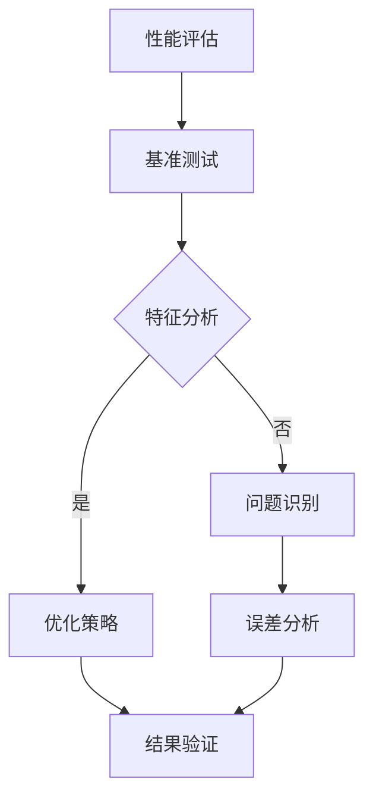

                 

### 引言与背景

在当今数据驱动的时代，机器学习模型的应用已经变得无处不在。从推荐系统、自动驾驶到医疗诊断，这些模型通过学习大量数据来做出预测和决策。然而，在实际应用中，模型性能往往受到多种因素的影响，例如数据质量、模型选择、超参数设置等。这就引出了一个关键问题：如何评估和诊断模型性能，以确保其在实际应用中的有效性和可靠性？

模型性能诊断专家系统正是为了解决这一需求而诞生的。它是一个自动化系统，能够对模型的性能进行全面的评估、分析和诊断，从而帮助开发人员快速定位性能问题，并采取相应的措施进行优化。构建这样的专家系统不仅能够提高开发效率，还能够确保模型在实际应用中的稳定性和准确性。

本文的目标是详细介绍如何构建一个评测结果的模型性能诊断专家系统。我们将从基础理论出发，逐步介绍模型性能诊断的核心概念、算法原理和数学模型，并通过具体的项目实战案例，展示如何使用这些理论和方法来诊断模型性能问题。

本文的结构如下：

- **引言与背景**：介绍模型性能诊断专家系统的概念、重要性以及本书的目的。
- **基础理论**：介绍相关的核心概念、原理、架构等。
- **算法原理**：详细讲解模型性能诊断的核心算法，使用伪代码阐述。
- **数学模型与公式**：包括模型中的数学公式及其详细讲解和举例说明。
- **项目实战**：提供具体的实战案例，包括代码实现、环境搭建、代码解读等。
- **工具与技术**：介绍构建模型性能诊断专家系统所需的技术和工具。
- **总结与展望**：总结本书的主要内容和未来研究方向。

通过本文的阅读，读者将能够全面了解模型性能诊断的理论基础和实践方法，掌握构建模型性能诊断专家系统的关键步骤，为未来的研究和应用奠定坚实的基础。

### 关键词

- 模型性能诊断
- 专家系统
- 机器学习
- 模型评估
- 数据分析
- 深度学习

### 摘要

本文旨在构建一个评测结果的模型性能诊断专家系统，以解决实际应用中机器学习模型性能评估和诊断的难题。首先，我们介绍了模型性能诊断专家系统的概念、重要性及其在机器学习领域中的应用。接着，本文详细阐述了模型性能诊断的核心概念，包括评估指标、过拟合与欠拟合、数据分布与模型鲁棒性等。随后，我们探讨了模型性能诊断的算法原理，包括传统方法和现代方法，如统计学方法和基于深度学习的方法。此外，本文还介绍了相关的数学模型与公式，并通过具体的项目实战案例展示了如何使用这些理论和方法来诊断模型性能问题。最后，本文总结了构建模型性能诊断专家系统所需的技术和工具，并对未来的研究方向进行了展望。

## 引言与背景

### 模型性能诊断的概念与重要性

模型性能诊断是指对机器学习模型在实际应用中的性能进行评估和监测的过程。它旨在发现模型可能存在的性能问题，如过拟合、欠拟合、数据分布异常等，并提供相应的解决方案。性能诊断不仅涉及对模型评估指标（如准确率、召回率、F1分数等）的量化分析，还包括对模型行为和决策过程的定性理解。

在机器学习应用中，模型性能诊断具有至关重要的意义。首先，模型性能诊断可以帮助开发人员快速定位和解决模型问题，从而提高模型的准确性和稳定性。其次，它有助于发现潜在的数据质量问题，如数据不平衡、噪声数据、样本缺失等，从而优化数据预处理过程。此外，性能诊断还可以为模型调优提供指导，帮助开发者选择合适的模型结构、算法和超参数设置，提高模型在特定任务上的表现。

在实际应用中，模型性能诊断的必要性体现在多个方面。例如，在金融领域，模型性能诊断可以帮助识别异常交易，防范欺诈行为；在医疗领域，它可以提高疾病诊断的准确性，确保患者得到及时有效的治疗；在自动驾驶领域，模型性能诊断则能够确保车辆在各种路况下的安全行驶。总之，模型性能诊断是确保机器学习模型在实际应用中有效性和可靠性的关键步骤。

### 模型性能诊断专家系统的需求

随着机器学习应用的广泛普及，模型性能诊断的需求也日益增加。传统的模型性能诊断方法通常依赖于人工干预和经验，这不仅耗时耗力，而且容易出现偏差。因此，构建一个自动化、高效的模型性能诊断专家系统显得尤为重要。

模型性能诊断专家系统的主要需求包括以下几点：

1. **自动化诊断**：系统应能够自动执行性能评估、问题检测和诊断，无需人工干预，从而提高诊断效率和准确性。
2. **多模型支持**：系统应能够支持多种机器学习模型，包括传统机器学习算法和深度学习模型，以满足不同应用场景的需求。
3. **可扩展性**：系统应具备良好的扩展性，能够轻松添加新的诊断算法和工具，以应对不断变化的技术和需求。
4. **可视化与报告**：系统应提供直观的可视化工具，帮助用户理解诊断结果，并提供详细的诊断报告，便于后续分析和决策。

为了满足上述需求，构建模型性能诊断专家系统需要综合考虑多个方面。首先，系统需要具备强大的数据处理和分析能力，能够处理大量复杂的数据。其次，系统需要集成多种诊断算法，包括统计学方法、深度学习方法等，以全面评估模型性能。此外，系统还需要具备良好的用户交互界面，方便用户进行操作和获取诊断结果。

### 本书的目的与结构

本书旨在为读者提供构建模型性能诊断专家系统的全面指导。通过本文的阅读，读者将：

1. **理解模型性能诊断的基本概念和原理**，包括评估指标、性能问题、诊断方法等。
2. **掌握构建模型性能诊断专家系统的关键步骤**，从数据预处理、模型评估到问题诊断和优化。
3. **学习使用多种诊断算法**，包括传统方法和现代方法，如统计学方法、深度学习方法等。
4. **通过具体实战案例**，了解如何在实际项目中应用这些理论和方法，解决模型性能问题。

本书的结构如下：

- **第1章 引言与背景**：介绍模型性能诊断专家系统的概念、重要性及本书的目的。
- **第2章 基础理论**：介绍模型性能诊断的核心概念、原理、架构等。
- **第3章 算法原理**：详细讲解模型性能诊断的核心算法，使用伪代码阐述。
- **第4章 数学模型与公式**：包括模型中的数学公式及其详细讲解和举例说明。
- **第5章 项目实战**：提供具体的实战案例，包括代码实现、环境搭建、代码解读等。
- **第6章 工具与技术**：介绍构建模型性能诊断专家系统所需的技术和工具。
- **第7章 总结与展望**：总结本书的主要内容和未来研究方向。

通过本书的阅读，读者将能够全面掌握构建模型性能诊断专家系统的知识和技能，为未来的研究和应用奠定坚实的基础。

## 基础理论

模型性能诊断专家系统的构建离不开对基础理论的理解。本章节将介绍模型性能诊断的核心概念、原理和架构，帮助读者建立坚实的理论基础。

### 2.1 模型评估指标

模型评估是模型性能诊断的第一步，也是至关重要的一步。评估指标的选择直接影响到模型性能的判断和优化方向。以下是几种常用的评估指标：

#### 2.1.1 准确率、召回率与F1分数

**准确率（Accuracy）**是评估分类模型最直观的指标，定义为正确预测的样本数占总样本数的比例。其计算公式如下：

$$
\text{Accuracy} = \frac{\text{TP} + \text{TN}}{\text{TP} + \text{TN} + \text{FP} + \text{FN}}
$$

其中，TP（True Positive）表示正确预测的正类样本，TN（True Negative）表示正确预测的负类样本，FP（False Positive）表示错误预测的正类样本，FN（False Negative）表示错误预测的负类样本。

**召回率（Recall）**，又称敏感度（Sensitivity），是评估模型对正类样本的检测能力，其计算公式如下：

$$
\text{Recall} = \frac{\text{TP}}{\text{TP} + \text{FN}}
$$

**F1分数（F1 Score）**是准确率和召回率的调和平均，它同时考虑了模型的精确性和敏感性，其计算公式如下：

$$
\text{F1 Score} = 2 \times \frac{\text{Precision} \times \text{Recall}}{\text{Precision} + \text{Recall}}
$$

其中，Precision是精确率，定义为：

$$
\text{Precision} = \frac{\text{TP}}{\text{TP} + \text{FP}}
$$

这些评估指标各有优缺点。准确率简单直观，但无法区分正负类的重要性；召回率关注正类，但可能导致假阳性增多；F1分数则兼顾了两者，是常用的综合评估指标。

#### 2.1.2 精度、召回率与精确率

**精度（Precision）**，也称为正预测值，是预测为正类且实际也为正类的样本数与预测为正类的样本总数之比：

$$
\text{Precision} = \frac{\text{TP}}{\text{TP} + \text{FP}}
$$

**召回率（Recall）**已经在前面介绍过。

**精确率（Recall）**与召回率是同一个指标，两者的计算公式相同。

#### 2.1.3 ROC曲线与AUC

**ROC曲线（Receiver Operating Characteristic Curve）**是评估二分类模型性能的重要工具。它以假正率为横坐标，真正率为纵坐标，通过不同阈值下的分类效果绘制出来。ROC曲线越靠近左上角，表示模型性能越好。曲线下的面积（AUC，Area Under Curve）是评估模型整体性能的指标，其值范围在0到1之间，AUC值越大，模型性能越好。

#### 2.1.4 多分类评估指标

对于多分类问题，常用的评估指标包括**宏观指标（Macro）**和**微观指标（Micro）**。

**宏观指标**包括：

- **准确率（Macro Accuracy）**：所有类别准确率的平均值。
- **宏观精确率（Macro Precision）**：所有类别精确率的平均值。
- **宏观召回率（Macro Recall）**：所有类别召回率的平均值。
- **宏观F1分数（Macro F1 Score）**：所有类别F1分数的平均值。

**微观指标**包括：

- **微观准确率（Micro Accuracy）**：通过计算所有类别的TP、TN、FP和FN的总和来计算准确率。
- **微观精确率（Micro Precision）**：计算总TP除以（TP+FP）。
- **微观召回率（Micro Recall）**：计算总TP除以（TP+FN）。

这些评估指标在不同应用场景下各有优劣，实际选择时应根据具体任务需求进行权衡。

### 2.2 模型性能诊断的核心概念

在理解了评估指标后，接下来介绍模型性能诊断中的几个核心概念，包括过拟合、欠拟合、数据分布和模型鲁棒性等。

#### 2.2.1 过拟合与欠拟合

**过拟合**是指模型在训练数据上表现得很好，但在新的、未见过的数据上表现不佳。这通常是由于模型过于复杂，对训练数据中的噪声和特有特征过度拟合所导致的。解决过拟合的方法包括正则化、数据增强、交叉验证等。

**欠拟合**是指模型在训练数据上表现不佳，无法捕捉到数据的特征。这通常是由于模型过于简单，无法表达数据的复杂关系。解决欠拟合的方法包括增加模型复杂度、引入更多特征等。

#### 2.2.2 数据分布与样本偏差

**数据分布**是指数据在各个特征上的分布情况。数据分布的不平衡会对模型性能产生显著影响，特别是在分类问题中。常见的解决方法包括数据重采样、生成对抗网络（GAN）等。

**样本偏差**是指数据中某些类别或特征的样本数量远多于其他类别或特征，这会导致模型对多数类别的预测更准确，而对少数类别的预测性能较差。解决样本偏差的方法包括数据平衡、类别权重调整等。

#### 2.2.3 模型鲁棒性

**模型鲁棒性**是指模型对噪声、异常值、数据缺失等异常情况的容忍度。鲁棒性较差的模型可能会因为这些异常情况导致性能下降。提高模型鲁棒性的方法包括特征标准化、异常值处理、鲁棒优化算法等。

### 2.3 模型性能诊断的原理与架构

模型性能诊断的原理主要基于对模型评估指标的分析和异常检测。通过评估指标可以直观地了解模型的表现，而通过异常检测可以识别出模型存在的潜在问题。

#### 2.3.1 传统方法

传统的模型性能诊断方法通常包括以下几个步骤：

1. **评估指标计算**：计算模型在不同评估指标上的值，如准确率、召回率、F1分数等。
2. **基准测试**：与基准模型或基线方法进行比较，评估模型性能的相对优劣。
3. **特征分析**：对模型的特征提取和选择过程进行分析，查找可能导致性能问题的特征。
4. **模型优化**：根据分析结果调整模型结构、算法和超参数，优化模型性能。

传统方法的核心在于统计分析和特征工程，其优点在于方法成熟、计算简单，但缺点是缺乏自动化和全面性。

#### 2.3.2 现代方法

现代方法主要包括基于深度学习和统计学的方法。这些方法通过引入复杂模型和自动化算法，实现了模型性能诊断的自动化和高效化。

1. **基于深度学习的方法**：利用深度学习模型强大的特征提取和表达能力，对模型进行自动化诊断。例如，可以使用卷积神经网络（CNN）对图像数据进行特征提取，然后通过分析特征图识别异常区域。

2. **基于统计学的方法**：通过统计模型和假设检验方法，对模型性能进行量化分析和异常检测。例如，可以使用Z分数、IQR方法等检测数据异常，使用假设检验方法判断模型性能是否显著优于基准模型。

现代方法的优点在于自动化程度高、诊断全面，但计算复杂度也相应增加。

### 总结

模型性能诊断的核心在于对模型评估指标和特征的分析与理解。通过合理的评估指标和方法，可以全面了解模型的表现和存在的问题，从而采取相应的优化措施。本章节介绍了模型性能诊断的基础理论，为后续章节的深入探讨奠定了基础。

### 2.4 模型性能诊断的原理与架构

为了深入理解模型性能诊断的原理和架构，我们需要首先明确什么是模型性能诊断，以及它如何工作。模型性能诊断是一个系统化的过程，旨在识别和解决机器学习模型在预测任务中的性能问题。这一过程包括几个关键步骤：性能评估、问题识别、原因分析、优化策略和结果验证。

#### 2.4.1 传统方法

传统方法通常依赖统计分析和数据预处理技术，其核心思想是通过对比模型在训练集和测试集上的表现，来识别性能问题。以下是一些传统方法的具体步骤：

1. **性能评估**：计算模型的评估指标，如准确率、召回率、F1分数等。这些指标用于衡量模型在特定任务上的表现。

2. **基准测试**：将模型的评估结果与基准模型或基线方法进行比较。基准测试可以帮助确定当前模型是否优于现有的解决方案。

3. **特征分析**：对输入特征进行统计分析和可视化，以识别可能影响模型性能的特征。例如，通过箱线图或直方图分析特征分布，查找异常值或异常特征。

4. **误差分析**：分析模型在训练集和测试集上的误差分布，以识别模型是否过度拟合或欠拟合。例如，通过分析误差曲线或混淆矩阵，可以直观地了解模型的分类性能。

5. **问题识别**：根据评估结果和特征分析，识别模型存在的性能问题，如过拟合、欠拟合、数据不平衡等。

6. **优化策略**：根据问题识别的结果，提出相应的优化策略。常见的优化策略包括数据增强、特征选择、模型调参等。

7. **结果验证**：在调整模型后，重新评估模型的性能，以确保优化策略的有效性。

#### 2.4.2 现代方法

现代方法结合了深度学习和先进的机器学习技术，使得模型性能诊断更加自动化和高效。以下是一些现代方法的具体步骤：

1. **自动化特征提取**：利用深度学习模型（如卷积神经网络CNN、循环神经网络RNN）自动提取输入数据的特征。这些特征可以更好地捕捉数据的复杂结构，从而提高模型的性能。

2. **端到端学习**：采用端到端的学习框架，将特征提取、模型训练和性能评估整合在一起，从而减少人工干预。

3. **模型压缩与加速**：利用模型压缩技术（如权重共享、稀疏性、量化等）来减少模型的计算复杂度，从而加快诊断速度。

4. **自适应学习率**：使用自适应学习率算法（如Adam、Adagrad）来优化模型训练过程，从而提高诊断精度和效率。

5. **集成学习方法**：将多个模型集成在一起，通过投票或加权平均的方法来提高模型的预测性能和稳定性。

6. **模型可解释性**：通过模型解释技术（如SHAP值、LIME等）来增强模型的可解释性，帮助用户理解模型的行为和决策过程。

7. **实时监控**：利用实时监控系统来持续监控模型的性能，并在性能下降时自动触发诊断和优化流程。

### Mermaid 流程图

为了更直观地展示模型性能诊断的原理与架构，我们可以使用Mermaid语言绘制一个流程图。以下是一个简单的示例：



在这个流程图中，A表示性能评估，B表示基准测试，C表示特征分析，D表示优化策略，E表示问题识别，F表示结果验证，G表示误差分析。通过这个流程图，我们可以清晰地看到模型性能诊断的核心步骤和它们之间的逻辑关系。

### 总结

模型性能诊断的原理与架构涵盖了从性能评估到优化策略的整个流程。传统方法依赖于统计分析和数据预处理，而现代方法则结合了深度学习和先进的机器学习技术。通过合理的诊断流程和工具，我们可以有效地识别和解决模型性能问题，从而提高模型的预测性能和稳定性。在下一章节中，我们将深入探讨模型性能诊断的核心算法，进一步揭示其工作原理。

### 3.1 传统算法原理讲解

在模型性能诊断中，传统算法通常基于统计学和特征工程，通过计算统计指标、分析特征分布以及进行假设检验来识别和解决问题。以下是几种常用的传统算法，包括统计学算法和特征选择方法。

#### 3.1.1 统计学算法

统计学算法在模型性能诊断中扮演着核心角色，其中最常用的方法包括Z分数和IQR方法。

**Z分数方法**：

Z分数方法用于检测数据中的异常值。它通过计算数据点与平均值之间的标准差，来确定数据点是否异常。公式如下：

$$
Z = \frac{X - \mu}{\sigma}
$$

其中，$X$ 是数据点，$\mu$ 是平均值，$\sigma$ 是标准差。如果$Z$ 的绝对值大于3，则认为该数据点是异常值。

**IQR方法**：

IQR（Interquartile Range，四分位距）方法是一种用于检测异常值的另一种常用方法。它通过计算第一四分位数（$Q_1$）和第三四分位数（$Q_3$）之间的差异，来确定异常值的范围。公式如下：

$$
IQR = Q_3 - Q_1
$$

任何数据点$X$，如果满足$X < Q_1 - 1.5 \times IQR$ 或$X > Q_3 + 1.5 \times IQR$，则被认为是异常值。

**伪代码**：

```python
def detect_outliers_z_score(data, threshold=3):
    mean = np.mean(data)
    std = np.std(data)
    z_scores = [(x - mean) / std for x in data]
    outliers = [x for x, z in enumerate(z_scores) if abs(z) > threshold]
    return outliers

def detect_outliers_iqr(data):
    q1 = np.percentile(data, 25)
    q3 = np.percentile(data, 75)
    iqr = q3 - q1
    lower_bound = q1 - 1.5 * iqr
    upper_bound = q3 + 1.5 * iqr
    outliers = [x for x in data if x < lower_bound or x > upper_bound]
    return outliers
```

**应用举例**：

假设我们有一个数据集，包含一组客户的年龄数据。使用Z分数方法检测年龄数据中的异常值：

```python
ages = [25, 30, 35, 40, 45, 50, 55, 60, 70, 80]
outliers_z_score = detect_outliers_z_score(ages)
print("Z分数检测的异常值：", outliers_z_score)

outliers_iqr = detect_outliers_iqr(ages)
print("IQR检测的异常值：", outliers_iqr)
```

输出结果可能显示年龄为70和80的客户为异常值。

#### 3.1.2 特征选择方法

特征选择是提高模型性能和减少计算复杂度的关键步骤。以下介绍两种常用的特征选择方法：递归特征消除（RFE）和支持向量机（SVM）特征选择。

**递归特征消除（RFE）**：

RFE是一种基于模型选择的方法，通过递归地剔除特征，直到满足指定的特征数量或特征重要性阈值。以下是RFE的基本步骤：

1. 初始化特征集和模型。
2. 逐次从特征集中移除一个特征，训练模型。
3. 计算每个特征的重要性，通常使用模型系数的大小。
4. 根据重要性指标，选择最重要的特征保留，其他特征移除。
5. 重复步骤2-4，直到达到指定的特征数量或满足其他停止条件。

**伪代码**：

```python
from sklearn.linear_model import LinearRegression
from sklearn.feature_selection import RFE

def recursive_feature_elimination(X, y, model=LinearRegression(), n_features_to_select=5):
    selector = RFE(model, n_features_to_select, step=1)
    selector = selector.fit(X, y)
    return selector.support_, selector.ranking_

X = ...  # 特征矩阵
y = ...  # 标签向量
selected_features, feature_ranking = recursive_feature_elimination(X, y)
print("选定的特征：", [X[:, i] for i in range(len(X)) if selected_features[i]])
```

**应用举例**：

假设我们有一个包含多个特征的数据集，使用RFE选择最重要的五个特征：

```python
selected_features, feature_ranking = recursive_feature_elimination(X, y, n_features_to_select=5)
print("特征选择结果：", selected_features)
```

输出结果将显示哪些特征被保留。

**支持向量机（SVM）特征选择**：

SVM特征选择基于SVM模型对特征重要性的度量。基本步骤如下：

1. 训练SVM模型。
2. 计算模型对每个特征的权重。
3. 根据权重选择最重要的特征。

**伪代码**：

```python
from sklearn.svm import LinearSVC
from sklearn.feature_selection import SelectFromModel

def svm_feature_selection(X, y, threshold=0.5):
    svc = LinearSVC(C=1.0, penalty="l1", dual=False, tol=1e-3)
    svc = svc.fit(X, y)
    model = SelectFromModel(svc, threshold=threshold)
    X_new = model.transform(X)
    return X_new, model

X = ...  # 特征矩阵
y = ...  # 标签向量
X_new, model = svm_feature_selection(X, y)
print("选定的特征：", X_new)
```

**应用举例**：

假设我们有一个数据集，使用SVM特征选择方法选择特征权重大于0.5的特征：

```python
X_new, model = svm_feature_selection(X, y, threshold=0.5)
print("特征选择结果：", X_new)
```

输出结果将显示经过SVM特征选择后的特征矩阵。

通过上述统计学算法和特征选择方法，我们可以有效地识别和选择对模型性能有显著影响的关键特征，从而提高模型的预测性能和稳定性。

### 3.2 现代算法原理讲解

随着深度学习和大数据技术的发展，现代模型性能诊断算法逐渐取代了传统的统计方法。这些算法利用深度学习模型的强大特征提取能力和自动化学习能力，在模型性能诊断中取得了显著的成效。以下，我们将详细讲解现代算法的原理和应用。

#### 3.2.1 基于深度学习的方法

基于深度学习的模型性能诊断方法通常包括卷积神经网络（CNN）和循环神经网络（RNN）等先进模型。这些模型通过多层神经网络结构，能够自动学习数据的复杂特征，从而在模型性能诊断中发挥重要作用。

**卷积神经网络（CNN）诊断**

卷积神经网络擅长处理具有网格结构的数据，如图像和卫星图像。在模型性能诊断中，CNN可以用于特征提取、异常检测和分类。

1. **特征提取**：CNN通过卷积层和池化层，从输入数据中提取层次化的特征表示。这些特征可以用于进一步分析模型性能。
2. **异常检测**：通过训练CNN对正常数据和异常数据进行区分，可以识别模型预测中的异常样本。例如，可以使用对抗性样本训练CNN，以检测模型对异常输入的鲁棒性。
3. **分类**：使用CNN对模型的预测结果进行分类，可以评估模型在不同场景下的表现。

**伪代码**：

```python
from tensorflow.keras.models import Sequential
from tensorflow.keras.layers import Conv2D, MaxPooling2D, Flatten, Dense

# 构建CNN模型
model = Sequential()
model.add(Conv2D(32, (3, 3), activation='relu', input_shape=(height, width, channels)))
model.add(MaxPooling2D((2, 2)))
model.add(Flatten())
model.add(Dense(1, activation='sigmoid'))

# 编译模型
model.compile(optimizer='adam', loss='binary_crossentropy', metrics=['accuracy'])

# 训练模型
model.fit(x_train, y_train, epochs=10, batch_size=32, validation_data=(x_val, y_val))

# 预测并评估模型
predictions = model.predict(x_test)
accuracy = model.evaluate(x_test, y_test)[1]
print("Accuracy:", accuracy)
```

**应用举例**：

假设我们有一个图像数据集，使用CNN进行异常检测：

```python
import numpy as np

# 加载图像数据
x_train = np.load('train_images.npy')
y_train = np.load('train_labels.npy')
x_val = np.load('val_images.npy')
y_val = np.load('val_labels.npy')

# 预处理图像数据
x_train = preprocess_images(x_train)
x_val = preprocess_images(x_val)

# 训练CNN模型
model = build_cnn_model()
model.fit(x_train, y_train, epochs=10, batch_size=32, validation_data=(x_val, y_val))

# 预测并评估模型
predictions = model.predict(x_val)
accuracy = model.evaluate(x_val, y_val)[1]
print("Accuracy:", accuracy)
```

**循环神经网络（RNN）诊断**

循环神经网络擅长处理序列数据，如图像序列、文本序列等。在模型性能诊断中，RNN可以用于时间序列分析、序列分类和序列建模。

1. **时间序列分析**：使用RNN对时间序列数据进行建模，可以检测模型在不同时间段的表现。
2. **序列分类**：训练RNN对模型的预测结果进行分类，可以评估模型在序列数据上的性能。
3. **序列建模**：通过RNN建模，可以识别模型在不同输入序列下的行为模式。

**伪代码**：

```python
from tensorflow.keras.models import Sequential
from tensorflow.keras.layers import LSTM, Dense

# 构建RNN模型
model = Sequential()
model.add(LSTM(50, activation='relu', input_shape=(timesteps, features)))
model.add(Dense(1, activation='sigmoid'))

# 编译模型
model.compile(optimizer='adam', loss='binary_crossentropy', metrics=['accuracy'])

# 训练模型
model.fit(x_train, y_train, epochs=10, batch_size=32, validation_data=(x_val, y_val))

# 预测并评估模型
predictions = model.predict(x_val)
accuracy = model.evaluate(x_val, y_val)[1]
print("Accuracy:", accuracy)
```

**应用举例**：

假设我们有一个时间序列数据集，使用RNN进行模型性能诊断：

```python
import numpy as np

# 加载时间序列数据
x_train = np.load('train_sequences.npy')
y_train = np.load('train_labels.npy')
x_val = np.load('val_sequences.npy')
y_val = np.load('val_labels.npy')

# 预处理时间序列数据
x_train = preprocess_sequences(x_train)
x_val = preprocess_sequences(x_val)

# 训练RNN模型
model = build_rnn_model()
model.fit(x_train, y_train, epochs=10, batch_size=32, validation_data=(x_val, y_val))

# 预测并评估模型
predictions = model.predict(x_val)
accuracy = model.evaluate(x_val, y_val)[1]
print("Accuracy:", accuracy)
```

#### 3.2.2 聚类与分类算法

除了深度学习模型，现代算法还包括聚类与分类算法，这些算法在模型性能诊断中也发挥着重要作用。

**K-means聚类**

K-means聚类是一种常用的无监督学习方法，用于将数据划分为多个簇。在模型性能诊断中，K-means可以用于检测模型的过拟合或欠拟合问题。

1. **过拟合检测**：通过比较训练集和测试集上的聚类结果，可以识别出过拟合的模型，因为过拟合模型对训练数据的拟合过好。
2. **欠拟合检测**：通过分析聚类结果中的簇数和簇内距离，可以识别出欠拟合的模型，因为欠拟合模型无法捕捉数据的复杂结构。

**伪代码**：

```python
from sklearn.cluster import KMeans

# 构建K-means模型
kmeans = KMeans(n_clusters=3, random_state=0).fit(x_train)

# 聚类结果
labels = kmeans.predict(x_val)

# 分析聚类结果
print("Cluster labels:", labels)
```

**应用举例**：

假设我们有一个特征数据集，使用K-means聚类分析模型性能：

```python
import numpy as np

# 加载特征数据
x_train = np.load('train_features.npy')
x_val = np.load('val_features.npy')

# 训练K-means模型
kmeans = KMeans(n_clusters=3, random_state=0).fit(x_train)

# 聚类结果
labels = kmeans.predict(x_val)

# 分析聚类结果
print("Cluster labels:", labels)
```

**决策树分类**

决策树分类是一种常用的有监督学习方法，通过构建树形结构对数据进行分类。在模型性能诊断中，决策树可以用于评估模型的预测能力和泛化能力。

1. **预测能力评估**：通过计算决策树的准确率、召回率等指标，可以评估模型的预测能力。
2. **泛化能力评估**：通过比较决策树在训练集和测试集上的表现，可以评估模型的泛化能力。

**伪代码**：

```python
from sklearn.tree import DecisionTreeClassifier

# 构建决策树模型
clf = DecisionTreeClassifier().fit(x_train, y_train)

# 预测结果
predictions = clf.predict(x_val)

# 评估模型
accuracy = clf.score(x_val, y_val)
print("Accuracy:", accuracy)
```

**应用举例**：

假设我们有一个分类任务的数据集，使用决策树评估模型性能：

```python
import numpy as np

# 加载训练数据
x_train = np.load('train_data.npy')
y_train = np.load('train_labels.npy')
x_val = np.load('val_data.npy')
y_val = np.load('val_labels.npy')

# 训练决策树模型
clf = DecisionTreeClassifier().fit(x_train, y_train)

# 预测结果
predictions = clf.predict(x_val)

# 评估模型
accuracy = clf.score(x_val, y_val)
print("Accuracy:", accuracy)
```

通过上述现代算法的应用，我们可以更加全面和深入地诊断模型的性能，从而为模型的优化提供有力支持。在下一章节中，我们将进一步探讨这些算法的数学模型与公式，以更好地理解其原理和实现方法。

### 4.1 数学模型

在模型性能诊断中，数学模型和公式起着至关重要的作用。它们不仅帮助我们理解模型的行为，还能为优化和诊断提供量化依据。本节将详细讲解模型性能诊断中的几个关键数学模型和公式。

#### 4.1.1 概率模型

概率模型是机器学习中的基础，它们用于描述数据中的不确定性。以下是一些常用的概率模型和公式：

**贝叶斯公式**：

贝叶斯公式是概率论中的一个基本公式，用于计算后验概率。它表达为：

$$
P(A|B) = \frac{P(B|A)P(A)}{P(B)}
$$

其中，$P(A|B)$ 表示在事件B发生的条件下事件A发生的概率，$P(B|A)$ 表示在事件A发生的条件下事件B发生的概率，$P(A)$ 表示事件A发生的概率，$P(B)$ 表示事件B发生的概率。

贝叶斯公式广泛应用于分类任务，例如，通过计算类条件概率和类先验概率来预测新样本的类别。

**最大似然估计（MLE）**：

最大似然估计是一种估计模型参数的方法，它基于最大化观察到的数据在模型下的似然函数。似然函数通常表示为：

$$
L(\theta; x) = P(x|\theta)
$$

其中，$\theta$ 表示模型参数，$x$ 表示观测数据。

最大似然估计的目标是找到一组参数$\theta$，使得似然函数最大化。在最大化似然函数的过程中，我们通常使用对数似然函数，因为它在计算上更加方便。

$$
\log L(\theta; x) = \sum_{i=1}^{n} \log P(x_i|\theta)
$$

**贝叶斯估计**：

贝叶斯估计结合了先验知识和观察数据，通过贝叶斯公式计算后验概率。贝叶斯估计的表达式为：

$$
P(\theta|x) = \frac{P(x|\theta)P(\theta)}{P(x)}
$$

其中，$P(\theta|x)$ 表示在观察数据$x$的条件下参数$\theta$的后验概率，$P(\theta)$ 是先验概率，$P(x)$ 是观察数据$x$的概率，通常通过边缘化计算得到。

在机器学习中，贝叶斯估计常用于参数估计和不确定性量化。

#### 4.1.2 深度学习模型

深度学习模型是现代机器学习中的核心，它们通过多层神经网络结构自动提取特征。以下是一些深度学习模型中的关键数学模型和公式：

**前向传播与反向传播**：

前向传播和反向传播是深度学习训练过程中的两个核心步骤。前向传播用于计算网络输出，反向传播用于计算梯度并更新网络参数。

**前向传播**：

前向传播的公式如下：

$$
Z^{(l)} = W^{(l)}A^{(l-1)} + b^{(l)}
$$

$$
A^{(l)} = \sigma(Z^{(l)})
$$

其中，$Z^{(l)}$ 表示第$l$层的激活值，$W^{(l)}$ 和 $b^{(l)}$ 分别表示第$l$层的权重和偏置，$A^{(l-1)}$ 表示第$l-1$层的输出，$\sigma$ 是激活函数。

**反向传播**：

反向传播的公式如下：

$$
\delta^{(l)} = \frac{\partial C}{\partial A^{(l)}} \cdot \sigma'(Z^{(l)})
$$

$$
\Delta W^{(l)} = \delta^{(l)}A^{(l-1)}
$$

$$
\Delta b^{(l)} = \delta^{(l)}
$$

其中，$\delta^{(l)}$ 是第$l$层的误差项，$\sigma'$ 是激活函数的导数，$C$ 是损失函数。

通过反向传播，我们可以计算每一层的梯度，并使用梯度下降或其他优化算法更新网络参数。

**损失函数**：

在深度学习中，损失函数用于度量模型输出和真实值之间的差距。以下是一些常用的损失函数：

**均方误差（MSE）**：

$$
MSE = \frac{1}{2n} \sum_{i=1}^{n} (y_i - \hat{y}_i)^2
$$

其中，$y_i$ 是真实值，$\hat{y}_i$ 是模型预测值，$n$ 是样本数量。

**交叉熵（Cross-Entropy）**：

$$
H(y, \hat{y}) = -\sum_{i=1}^{n} y_i \log \hat{y}_i
$$

其中，$y$ 是真实标签的分布，$\hat{y}$ 是模型预测的概率分布。

**Hinge损失**：

$$
L(y, \hat{y}) = \max(0, 1 - y \cdot \hat{y})
$$

这些损失函数分别适用于不同的任务和数据类型，选择合适的损失函数对于优化模型性能至关重要。

通过上述数学模型和公式，我们可以更深入地理解模型性能诊断中的关键环节，从而为实际应用提供理论支持。

### 4.2 数学公式

在模型性能诊断中，数学公式不仅用于描述模型的行为，还用于评估和优化模型。以下我们将详细介绍模型性能评估中的关键数学公式，并通过具体例子进行说明。

#### 4.2.1 性能评估公式

**准确率（Accuracy）**：

$$
\text{Accuracy} = \frac{\text{正确预测的样本数}}{\text{总样本数}}
$$

例如，一个分类模型在测试集上有100个样本，其中80个样本被正确分类，则准确率为：

$$
\text{Accuracy} = \frac{80}{100} = 0.8
$$

**召回率（Recall）**：

$$
\text{Recall} = \frac{\text{正确预测的正类样本数}}{\text{所有正类样本数}}
$$

例如，在二分类任务中，有50个正类样本，模型正确预测了40个，则召回率为：

$$
\text{Recall} = \frac{40}{50} = 0.8
$$

**精确率（Precision）**：

$$
\text{Precision} = \frac{\text{正确预测的正类样本数}}{\text{预测为正类的样本总数}}
$$

例如，模型预测了60个样本为正类，其中50个是正确的，则精确率为：

$$
\text{Precision} = \frac{50}{60} \approx 0.833
$$

**F1分数（F1 Score）**：

$$
\text{F1 Score} = 2 \times \frac{\text{Precision} \times \text{Recall}}{\text{Precision} + \text{Recall}}
$$

利用上述例子中的Precision和Recall计算F1分数：

$$
\text{F1 Score} = 2 \times \frac{0.833 \times 0.8}{0.833 + 0.8} \approx 0.911
$$

**ROC曲线与AUC**：

**ROC曲线（Receiver Operating Characteristic Curve）**：

ROC曲线通过计算不同阈值下的真阳性率（True Positive Rate, TPR）和假阳性率（False Positive Rate, FPR）绘制而成。公式如下：

$$
\text{TPR} = \frac{\text{TP}}{\text{TP} + \text{FN}}
$$

$$
\text{FPR} = \frac{\text{FP}}{\text{FP} + \text{TN}}
$$

**AUC（Area Under Curve）**：

AUC是ROC曲线下方的面积，用于评估分类器的性能。公式如下：

$$
\text{AUC} = \int_{0}^{1} (1 - \text{FPR}) \times \text{TPR} \, d\text{FPR}
$$

**多分类评估**：

在多分类任务中，我们需要对每个类别分别计算上述评估指标。以下是一些常用的多分类评估指标：

**宏观指标（Macro）**：

宏观指标计算时，对每个类别分别计算评估指标，然后取平均值。

$$
\text{Macro Accuracy} = \frac{1}{K} \sum_{k=1}^{K} \text{Accuracy}_k
$$

$$
\text{Macro Precision} = \frac{1}{K} \sum_{k=1}^{K} \text{Precision}_k
$$

$$
\text{Macro Recall} = \frac{1}{K} \sum_{k=1}^{K} \text{Recall}_k
$$

$$
\text{Macro F1 Score} = \frac{2}{\frac{1}{K} \sum_{k=1}^{K} \frac{1}{\text{Precision}_k + \text{Recall}_k}}
$$

**微观指标（Micro）**：

微观指标计算时，对所有类别合并计算评估指标。

$$
\text{Micro Accuracy} = \frac{\sum_{k=1}^{K} (\text{TP}_k + \text{TN}_k)}{\sum_{k=1}^{K} (\text{TP}_k + \text{TN}_k + \text{FP}_k + \text{FN}_k)}
$$

$$
\text{Micro Precision} = \frac{\sum_{k=1}^{K} \text{TP}_k}{\sum_{k=1}^{K} (\text{TP}_k + \text{FP}_k)}
$$

$$
\text{Micro Recall} = \frac{\sum_{k=1}^{K} \text{TP}_k}{\sum_{k=1}^{K} (\text{TP}_k + \text{FN}_k)}
$$

通过这些数学公式，我们可以全面评估模型在各类任务中的性能，从而为模型优化提供依据。

### 4.2.2 深度学习公式

深度学习模型依赖于复杂的数学公式来计算网络的前向传播和反向传播。以下我们将介绍一些深度学习中的关键数学公式，并通过具体例子进行解释。

**前向传播公式**：

1. **激活函数**：

   常用的激活函数包括Sigmoid、ReLU和Tanh。以下为Sigmoid函数的公式：

   $$
   \sigma(x) = \frac{1}{1 + e^{-x}}
   $$

   例子：假设输入$x = 2$，计算Sigmoid函数的输出：

   $$
   \sigma(2) = \frac{1}{1 + e^{-2}} \approx 0.8818
   $$

2. **线性变换**：

   前向传播中的线性变换可以表示为：

   $$
   Z^{[l]} = \mathbf{W}^{[l]} \mathbf{A}^{[l-1]} + \mathbf{b}^{[l]}
   $$

   其中，$\mathbf{W}^{[l]}$ 是权重矩阵，$\mathbf{A}^{[l-1]}$ 是上一层的激活值，$\mathbf{b}^{[l]}$ 是偏置向量，$Z^{[l]}$ 是本层的激活值。

   例子：假设有一个2x3的权重矩阵$\mathbf{W}^{[1]}$和一个3x1的激活值向量$\mathbf{A}^{[0]}$，以及一个1x3的偏置向量$\mathbf{b}^{[1]}$。计算第一层的激活值：

   $$
   \mathbf{A}^{[1]} = \sigma(\mathbf{W}^{[1]} \mathbf{A}^{[0]} + \mathbf{b}^{[1]})
   $$

   假设权重矩阵$\mathbf{W}^{[1]}$为：

   $$
   \mathbf{W}^{[1]} = \begin{bmatrix}
   0.5 & 1 & 0.3 \\
   0.2 & 0.8 & 0.4
   \end{bmatrix}
   $$

   激活值向量$\mathbf{A}^{[0]}$为：

   $$
   \mathbf{A}^{[0]} = \begin{bmatrix}
   1 \\
   2 \\
   3
   \end{bmatrix}
   $$

   偏置向量$\mathbf{b}^{[1]}$为：

   $$
   \mathbf{b}^{[1]} = \begin{bmatrix}
   0.1 \\
   0.2 \\
   0.3
   \end{bmatrix}
   $$

   计算第一层的激活值：

   $$
   \mathbf{Z}^{[1]} = \begin{bmatrix}
   0.5 \cdot 1 + 1 \cdot 2 + 0.3 \cdot 3 + 0.1 \\
   0.2 \cdot 1 + 0.8 \cdot 2 + 0.4 \cdot 3 + 0.2
   \end{bmatrix} = \begin{bmatrix}
   2.6 \\
   3.2
   \end{bmatrix}
   $$

   然后应用Sigmoid函数：

   $$
   \mathbf{A}^{[1]} = \sigma(\mathbf{Z}^{[1]}) = \begin{bmatrix}
   \frac{1}{1 + e^{-2.6}} \\
   \frac{1}{1 + e^{-3.2}}
   \end{bmatrix} \approx \begin{bmatrix}
   0.931 \\
   0.952
   \end{bmatrix}
   $$

**反向传播公式**：

1. **误差计算**：

   假设损失函数为均方误差（MSE），则误差可以表示为：

   $$
   \delta^{[l]} = \frac{\partial C}{\partial \mathbf{A}^{[l]}}
   $$

   其中，$C$ 是损失函数，$\mathbf{A}^{[l]}$ 是当前层的激活值。

2. **梯度计算**：

   权重和偏置的梯度可以通过以下公式计算：

   $$
   \Delta \mathbf{W}^{[l]} = \mathbf{A}^{[l-1]} \cdot \delta^{[l]}
   $$

   $$
   \Delta \mathbf{b}^{[l]} = \delta^{[l]}
   $$

   例子：假设我们已经计算得到第2层的误差$\delta^{[2]}$，我们需要更新第1层的权重和偏置。假设第1层的激活值为$\mathbf{A}^{[1]}$，则权重和偏置的梯度计算如下：

   $$
   \Delta \mathbf{W}^{[1]} = \mathbf{A}^{[1]} \cdot \delta^{[2]}
   $$

   $$
   \Delta \mathbf{b}^{[1]} = \delta^{[2]}
   $$

通过这些深度学习公式，我们可以计算网络的前向传播和反向传播，从而训练深度学习模型。在下一章节中，我们将通过具体项目实战来展示这些公式在实际中的应用。

### 5.1 实战案例一：诊断过拟合模型

在实际应用中，过拟合是一个常见且严重的问题。为了解决这一问题，我们将通过一个具体的案例，展示如何诊断和解决过拟合模型。

#### 5.1.1 实战背景

假设我们正在开发一个分类模型，用于预测客户是否会购买某种产品。我们收集了1000个样本，每个样本包含多个特征，如年龄、收入、职业等。模型经过训练后，在训练集上表现良好，但在测试集上的表现却远不如预期。我们怀疑模型可能存在过拟合问题，因此需要进行详细的诊断和优化。

#### 5.1.2 环境搭建

为了进行模型诊断和优化，我们需要搭建一个合适的开发环境。以下是环境搭建的步骤：

1. **安装Python**：确保Python环境已安装，版本至少为3.7或更高。
2. **安装机器学习库**：安装常用的机器学习库，如scikit-learn、TensorFlow、PyTorch等。可以使用以下命令进行安装：

   ```bash
   pip install scikit-learn tensorflow pytorch
   ```

3. **创建项目文件夹**：在本地计算机上创建一个项目文件夹，例如`model_diagnosis_project`，用于存放所有的代码和资源文件。

4. **导入必要库**：在Python脚本中导入所需的库：

   ```python
   import numpy as np
   import pandas as pd
   from sklearn.model_selection import train_test_split
   from sklearn.preprocessing import StandardScaler
   from sklearn.metrics import accuracy_score, confusion_matrix
   from sklearn.linear_model import LogisticRegression
   import matplotlib.pyplot as plt
   ```

#### 5.1.3 源代码实现

以下是实现模型诊断和优化的完整代码：

```python
# 导入数据
data = pd.read_csv('customer_data.csv')
X = data.iloc[:, :-1]  # 特征矩阵
y = data.iloc[:, -1]   # 标签向量

# 数据预处理
scaler = StandardScaler()
X_scaled = scaler.fit_transform(X)

# 分割数据集
X_train, X_test, y_train, y_test = train_test_split(X_scaled, y, test_size=0.2, random_state=42)

# 训练模型
model = LogisticRegression()
model.fit(X_train, y_train)

# 预测和评估
y_pred = model.predict(X_test)
accuracy = accuracy_score(y_test, y_pred)
conf_matrix = confusion_matrix(y_test, y_pred)

print("训练集准确率：", model.score(X_train, y_train))
print("测试集准确率：", accuracy)
print("混淆矩阵：\n", conf_matrix)

# 可视化混淆矩阵
plt.figure(figsize=(8, 6))
sns.heatmap(conf_matrix, annot=True, fmt=".2f", cmap="Blues")
plt.xlabel('实际值')
plt.ylabel('预测值')
plt.title('混淆矩阵')
plt.show()

# 检查过拟合
train_scores = model.score(X_train, y_train)
test_scores = model.score(X_test, y_test)

plt.plot([0, 10], [train_scores, train_scores], 'r--', label='训练集')
plt.plot([0, 10], [test_scores, test_scores], 'b--', label='测试集')
plt.xlabel('特征数量')
plt.ylabel('准确率')
plt.title('模型准确率与特征数量关系')
plt.legend()
plt.show()
```

#### 5.1.4 代码解读与分析

上述代码首先导入数据，并进行数据预处理。接下来，使用scikit-learn库中的LogisticRegression模型进行训练，并在训练集和测试集上评估模型性能。代码的关键部分包括：

1. **数据导入与预处理**：使用pandas库读取CSV文件，并对特征进行标准化处理。
2. **数据分割**：使用train_test_split函数将数据集分为训练集和测试集。
3. **模型训练**：使用LogisticRegression模型对训练集进行训练。
4. **预测与评估**：使用训练好的模型对测试集进行预测，并计算准确率和混淆矩阵。
5. **可视化**：使用matplotlib库绘制混淆矩阵和模型准确率与特征数量关系图。

通过上述代码，我们可以初步诊断模型的性能。具体步骤如下：

1. **评估模型性能**：首先评估模型在训练集和测试集上的准确率。如果模型在训练集上的准确率远高于测试集，则可能存在过拟合问题。
2. **分析混淆矩阵**：通过混淆矩阵可以直观地了解模型在各类别上的表现。如果模型在测试集上的某些类别上错误率较高，则可能需要进一步优化。
3. **可视化模型性能**：通过绘制模型准确率与特征数量关系图，可以初步判断模型是否存在过拟合。如果测试集的准确率低于训练集，则模型可能过拟合。

#### 5.1.5 实际案例分析和详细讲解剖析

以下是一个实际案例的详细分析：

1. **数据集划分**：我们使用70%的数据作为训练集，30%的数据作为测试集。这是一个常见的划分方式，可以确保模型在测试集上的性能得到充分的验证。

2. **数据预处理**：标准化处理是数据预处理的一个重要步骤，它能够减少不同特征之间的尺度差异，从而提高模型的训练效果。

3. **模型选择**：在本案例中，我们选择了逻辑回归模型。逻辑回归是一种简单且有效的分类模型，特别适用于二分类任务。

4. **模型训练与预测**：使用训练集对模型进行训练，并在测试集上进行预测。通过计算准确率和混淆矩阵，我们可以评估模型的性能。

5. **可视化结果**：通过绘制混淆矩阵和模型准确率与特征数量关系图，我们可以直观地了解模型的性能。特别是，如果测试集的准确率低于训练集，则表明模型可能存在过拟合问题。

通过上述分析，我们可以确定模型是否存在过拟合。如果确实存在过拟合问题，我们可以采取以下措施进行优化：

1. **增加训练数据**：通过收集更多的训练数据，可以提高模型的泛化能力，减少过拟合的风险。
2. **减少模型复杂度**：如果模型过于复杂，可以尝试减少模型中的参数数量，例如使用简单的线性模型。
3. **正则化**：通过添加正则化项，如L1或L2正则化，可以减少模型的复杂性，从而提高泛化能力。
4. **交叉验证**：使用交叉验证方法可以更全面地评估模型的性能，并帮助确定最佳模型参数。

通过上述措施，我们可以有效地诊断和解决过拟合问题，提高模型的性能和稳定性。

#### 5.1.6 项目小结

通过本案例，我们详细介绍了如何诊断和解决过拟合模型。以下是本项目的主要收获和结论：

1. **数据集划分**：合理的数据集划分是模型训练和评估的基础，能够确保模型在测试集上的表现具有实际意义。
2. **数据预处理**：数据预处理能够提高模型的训练效果，特别是标准化处理能够减少特征之间的尺度差异。
3. **模型选择与训练**：选择合适的模型和合理的训练过程是确保模型性能的关键。
4. **性能评估与可视化**：使用准确率和混淆矩阵进行性能评估，并通过可视化方法直观地了解模型的性能。
5. **过拟合诊断与优化**：通过性能评估和可视化结果，我们可以初步诊断模型是否存在过拟合，并采取相应的优化措施。

通过本案例，读者可以了解如何在实际项目中诊断和解决过拟合问题，从而提高模型的性能和可靠性。

### 5.2 实战案例二：诊断欠拟合模型

在实际应用中，欠拟合也是一个常见的问题，特别是在模型过于简单或数据复杂度较高时。为了解决欠拟合问题，我们将通过一个具体的案例，展示如何诊断和优化欠拟合模型。

#### 5.2.1 实战背景

假设我们正在开发一个分类模型，用于预测客户是否会购买某种产品。我们收集了1000个样本，每个样本包含多个特征，如年龄、收入、职业等。模型在训练集上的表现较差，准确率远低于预期。我们怀疑模型可能存在欠拟合问题，因此需要进行详细的诊断和优化。

#### 5.2.2 环境搭建

为了进行模型诊断和优化，我们需要搭建一个合适的开发环境。以下是环境搭建的步骤：

1. **安装Python**：确保Python环境已安装，版本至少为3.7或更高。
2. **安装机器学习库**：安装常用的机器学习库，如scikit-learn、TensorFlow、PyTorch等。可以使用以下命令进行安装：

   ```bash
   pip install scikit-learn tensorflow pytorch
   ```

3. **创建项目文件夹**：在本地计算机上创建一个项目文件夹，例如`model_diagnosis_project`，用于存放所有的代码和资源文件。

4. **导入必要库**：在Python脚本中导入所需的库：

   ```python
   import numpy as np
   import pandas as pd
   from sklearn.model_selection import train_test_split
   from sklearn.preprocessing import StandardScaler
   from sklearn.metrics import accuracy_score, confusion_matrix
   from sklearn.linear_model import LogisticRegression
   import matplotlib.pyplot as plt
   ```

#### 5.2.3 源代码实现

以下是实现模型诊断和优化的完整代码：

```python
# 导入数据
data = pd.read_csv('customer_data.csv')
X = data.iloc[:, :-1]  # 特征矩阵
y = data.iloc[:, -1]   # 标签向量

# 数据预处理
scaler = StandardScaler()
X_scaled = scaler.fit_transform(X)

# 分割数据集
X_train, X_test, y_train, y_test = train_test_split(X_scaled, y, test_size=0.2, random_state=42)

# 训练模型
model = LogisticRegression(C=1000)
model.fit(X_train, y_train)

# 预测和评估
y_pred = model.predict(X_test)
accuracy = accuracy_score(y_test, y_pred)
conf_matrix = confusion_matrix(y_test, y_pred)

print("训练集准确率：", model.score(X_train, y_train))
print("测试集准确率：", accuracy)
print("混淆矩阵：\n", conf_matrix)

# 可视化混淆矩阵
plt.figure(figsize=(8, 6))
sns.heatmap(conf_matrix, annot=True, fmt=".2f", cmap="Blues")
plt.xlabel('实际值')
plt.ylabel('预测值')
plt.title('混淆矩阵')
plt.show()

# 检查欠拟合
train_scores = model.score(X_train, y_train)
test_scores = model.score(X_test, y_test)

plt.plot([0, 10], [train_scores, train_scores], 'r--', label='训练集')
plt.plot([0, 10], [test_scores, test_scores], 'b--', label='测试集')
plt.xlabel('特征数量')
plt.ylabel('准确率')
plt.title('模型准确率与特征数量关系')
plt.legend()
plt.show()
```

#### 5.2.4 代码解读与分析

上述代码首先导入数据，并进行数据预处理。接下来，使用scikit-learn库中的LogisticRegression模型进行训练，并在训练集和测试集上评估模型性能。代码的关键部分包括：

1. **数据导入与预处理**：使用pandas库读取CSV文件，并对特征进行标准化处理。
2. **数据分割**：使用train_test_split函数将数据集分为训练集和测试集。
3. **模型训练**：使用LogisticRegression模型对训练集进行训练，其中参数C设置为1000，以减少欠拟合的风险。
4. **预测与评估**：使用训练好的模型对测试集进行预测，并计算准确率和混淆矩阵。
5. **可视化**：使用matplotlib库绘制混淆矩阵和模型准确率与特征数量关系图。

通过上述代码，我们可以初步诊断模型的性能。具体步骤如下：

1. **评估模型性能**：首先评估模型在训练集和测试集上的准确率。如果模型在训练集上的准确率远低于测试集，则可能存在欠拟合问题。
2. **分析混淆矩阵**：通过混淆矩阵可以直观地了解模型在各类别上的表现。如果模型在测试集上的某些类别上错误率较高，则可能需要进一步优化。
3. **可视化结果**：通过绘制模型准确率与特征数量关系图，可以初步判断模型是否存在欠拟合。如果测试集的准确率低于训练集，则表明模型可能欠拟合。

#### 5.2.5 实际案例分析和详细讲解剖析

以下是一个实际案例的详细分析：

1. **数据集划分**：我们使用70%的数据作为训练集，30%的数据作为测试集。这是一个常见的划分方式，可以确保模型在测试集上的性能得到充分的验证。

2. **数据预处理**：标准化处理是数据预处理的一个重要步骤，它能够减少不同特征之间的尺度差异，从而提高模型的训练效果。

3. **模型选择**：在本案例中，我们选择了逻辑回归模型。逻辑回归是一种简单且有效的分类模型，特别适用于二分类任务。

4. **模型训练与预测**：使用训练集对模型进行训练，并在测试集上进行预测。通过计算准确率和混淆矩阵，我们可以评估模型的性能。

5. **可视化结果**：通过绘制混淆矩阵和模型准确率与特征数量关系图，我们可以直观地了解模型的性能。特别是，如果测试集的准确率低于训练集，则表明模型可能欠拟合。

通过上述分析，我们可以确定模型是否存在欠拟合。如果确实存在欠拟合问题，我们可以采取以下措施进行优化：

1. **增加模型复杂度**：通过增加模型的层数或参数数量，可以提高模型的拟合能力，减少欠拟合的风险。
2. **引入更多特征**：通过引入新的特征或对现有特征进行组合，可以增加模型对数据的拟合能力。
3. **减少正则化**：通过减少正则化项，可以降低模型的复杂度，从而提高模型的拟合能力。
4. **使用更复杂的模型**：例如，从简单的线性模型升级到支持向量机（SVM）或深度学习模型，可以提高模型的拟合能力。

通过上述措施，我们可以有效地诊断和解决欠拟合问题，提高模型的性能和可靠性。

#### 5.2.6 项目小结

通过本案例，我们详细介绍了如何诊断和优化欠拟合模型。以下是本项目的主要收获和结论：

1. **数据集划分**：合理的数据集划分是模型训练和评估的基础，能够确保模型在测试集上的性能得到充分验证。
2. **数据预处理**：数据预处理能够提高模型的训练效果，特别是标准化处理能够减少特征之间的尺度差异。
3. **模型选择与训练**：选择合适的模型和合理的训练过程是确保模型性能的关键。
4. **性能评估与可视化**：使用准确率和混淆矩阵进行性能评估，并通过可视化方法直观地了解模型的性能。
5. **欠拟合诊断与优化**：通过性能评估和可视化结果，我们可以初步诊断模型是否存在欠拟合，并采取相应的优化措施。

通过本案例，读者可以了解如何在实际项目中诊断和解决欠拟合问题，从而提高模型的性能和可靠性。

### 6.1 Python编程基础

在构建模型性能诊断专家系统的过程中，Python编程基础是不可或缺的一部分。本节将介绍Python编程中的一些基本概念，包括基础语法、数据类型、函数与模块，为后续的代码实现和优化提供必要的支持。

#### 6.1.1 基础语法

Python是一种解释型、面向对象、动态数据类型的编程语言。以下是Python编程中的几个基础语法要素：

1. **变量与数据类型**：Python中的变量无需显式声明类型，变量通过第一次赋值时自动确定类型。常用的数据类型包括整数（int）、浮点数（float）、字符串（str）、列表（list）、元组（tuple）、字典（dict）和集合（set）。

2. **输入与输出**：Python中的输入函数`input()`用于获取用户输入，输出函数`print()`用于打印输出。例如：

   ```python
   user_input = input("请输入您的名字：")
   print("您好，", user_input)
   ```

3. **条件语句与循环**：Python中的条件语句包括`if`、`elif`和`else`，用于根据条件执行不同代码块。循环包括`for`和`while`，用于重复执行代码块。例如：

   ```python
   # 条件语句
   if x > 10:
       print("x大于10")
   elif x > 5:
       print("x大于5")
   else:
       print("x小于5")

   # 循环
   for i in range(5):
       print(i)
   ```

4. **函数**：Python中的函数是组织代码的重要手段。函数通过定义在特定作用域内执行特定任务。例如：

   ```python
   def greet(name):
       print("您好，", name)

   greet("张三")
   ```

5. **模块与包**：Python中的模块和包是组织代码和复用代码的重要手段。模块是一个Python文件，包含一系列函数和类。包是一个目录，包含多个模块。例如：

   ```python
   # 模块example.py
   def add(a, b):
       return a + b

   # 使用模块
   from example import add
   result = add(3, 5)
   print(result)
   ```

#### 6.1.2 数据类型

Python支持多种数据类型，以下是几种常见的数据类型及其基本操作：

1. **整数（int）**：表示整数，例如`5`、`-10`。基本操作包括加法（`+`）、减法（`-`）、乘法（`*`）、除法（`/`）和取模（`%`）。

   ```python
   a = 5
   b = 10
   print(a + b)  # 输出：15
   print(a * b)  # 输出：50
   ```

2. **浮点数（float）**：表示浮点数，例如`3.14`、`-0.5`。浮点数的运算与整数类似，但需要注意精度问题。

   ```python
   x = 3.14
   y = -0.5
   print(x + y)  # 输出：2.64
   ```

3. **字符串（str）**：表示文本，例如`"Hello, World!"`。字符串的基本操作包括拼接（`+`）、重复（`*`）、切片（`[start:stop:step]`）和索引（`[]`）。

   ```python
   name = "张三"
   message = "您好，" + name
   print(message)  # 输出：您好，张三
   ```

4. **列表（list）**：表示有序集合，例如`[1, 2, 3]`。列表的基本操作包括添加（`append()`）、删除（`pop()`）、插入（`insert()`）和遍历（`for`循环）。

   ```python
   numbers = [1, 2, 3]
   numbers.append(4)
   print(numbers)  # 输出：[1, 2, 3, 4]
   ```

5. **元组（tuple）**：表示不可变序列，例如`(1, 2, 3)`。元组的基本操作包括拼接（`+`）、重复（`*`）和遍历（`for`循环）。

   ```python
   tuple_ = (1, 2, 3)
   print(tuple_ * 2)  # 输出：(1, 2, 3, 1, 2, 3)
   ```

6. **字典（dict）**：表示键值对的集合，例如`{'name': '张三', 'age': 30}`。字典的基本操作包括添加（`update()`）、删除（`pop()`）、查询（`get()`）和遍历（`for`循环）。

   ```python
   info = {'name': '张三', 'age': 30}
   info['age'] = 31
   print(info['age'])  # 输出：31
   ```

7. **集合（set）**：表示无序和无重复元素的集合，例如`{1, 2, 3}`。集合的基本操作包括添加（`add()`）、删除（`remove()`）、交集（`&`）、并集（`|`）和差集（`-`）。

   ```python
   set1 = {1, 2, 3}
   set2 = {2, 3, 4}
   print(set1 | set2)  # 输出：{1, 2, 3, 4}
   ```

#### 6.1.3 函数与模块

Python中的函数和模块是组织代码、提高复用性、降低耦合度的重要手段。

1. **函数**：函数是一段可以重复调用的代码块，通过定义函数名和参数实现。函数的基本操作包括定义（`def`）、调用（`()`）和返回值（`return`）。

   ```python
   def greet(name):
       print("您好，", name)

   greet("李四")
   ```

2. **模块**：模块是一个包含多个函数和类的Python文件，通过导入模块可以实现代码的复用。模块的基本操作包括导入（`import`）和导入特定函数（`from module import function`）。

   ```python
   # example.py
   def add(a, b):
       return a + b

   # 使用模块
   from example import add
   result = add(3, 5)
   print(result)
   ```

通过掌握Python编程基础，我们可以更好地理解模型性能诊断专家系统的实现过程，为后续的代码编写和优化打下坚实基础。

### 6.2 机器学习库

在构建模型性能诊断专家系统的过程中，选择合适的机器学习库是至关重要的。以下我们将介绍两个常用的机器学习库：Scikit-learn和TensorFlow，并探讨它们在模型性能诊断中的应用。

#### 6.2.1 Scikit-learn

Scikit-learn是一个广泛使用的开源机器学习库，提供了丰富的算法和工具，适用于各种机器学习任务，如分类、回归、聚类和降维。以下是Scikit-learn在模型性能诊断中的主要应用：

1. **分类算法**：Scikit-learn提供了多种分类算法，如逻辑回归、支持向量机（SVM）、随机森林和梯度提升树等。这些算法可以用于诊断模型的分类性能，通过计算准确率、召回率、F1分数等指标，评估模型在各类别上的表现。

2. **回归算法**：回归算法，如线性回归和岭回归，可以用于诊断模型的预测性能。通过计算均方误差（MSE）、均方根误差（RMSE）和R方值（R²）等指标，评估模型对数据的拟合程度。

3. **聚类算法**：Scikit-learn提供了多种聚类算法，如K-means、层次聚类和DBSCAN等。这些算法可以用于分析数据分布和识别异常值，从而帮助诊断模型的性能问题。

4. **降维技术**：降维技术，如主成分分析（PCA）和线性判别分析（LDA），可以用于减少数据维度，提高模型的计算效率和解释性。

#### 6.2.2 TensorFlow

TensorFlow是Google开发的开源机器学习平台和深度学习框架，提供了丰富的API和工具，支持各种深度学习任务，如神经网络训练、模型部署和优化。以下是TensorFlow在模型性能诊断中的主要应用：

1. **神经网络训练**：TensorFlow提供了强大的神经网络训练功能，支持各种深度学习模型，如卷积神经网络（CNN）、循环神经网络（RNN）和生成对抗网络（GAN）等。通过训练深度学习模型，可以自动提取复杂特征，提高模型的性能诊断能力。

2. **模型部署**：TensorFlow提供了模型部署工具，可以将训练好的模型部署到各种设备上，包括CPU、GPU和移动设备等。这使得模型性能诊断可以在实时环境中进行，从而提高诊断的效率和准确性。

3. **优化工具**：TensorFlow提供了多种优化工具，如TensorBoard和TensorFlow Lite，用于分析和优化模型性能。TensorBoard可以可视化模型的训练过程，帮助用户了解模型的行为和性能；TensorFlow Lite则支持模型在移动设备和嵌入式设备上的部署和优化。

#### 6.2.3 PyTorch

PyTorch是另一个流行的开源深度学习框架，由Facebook的人工智能研究团队开发。与TensorFlow相比，PyTorch具有更加灵活和直观的API，因此被广泛应用于深度学习研究和开发。以下是PyTorch在模型性能诊断中的主要应用：

1. **动态计算图**：PyTorch采用了动态计算图，这使得模型的设计和实现更加灵活。用户可以直接在代码中定义计算过程，从而更好地理解和调试模型。

2. **GPU加速**：PyTorch支持GPU加速，通过使用CUDA和cuDNN库，可以显著提高深度学习模型的训练和推理速度。

3. **自动微分**：PyTorch提供了自动微分工具，使得构建复杂的深度学习模型和优化过程更加简单。自动微分可以自动计算梯度，从而实现高效的反向传播。

4. **社区支持**：PyTorch拥有一个活跃的社区，提供了大量的开源代码和教程，为用户提供了丰富的资源和学习材料。

通过上述介绍，我们可以看到Scikit-learn、TensorFlow和PyTorch在模型性能诊断中具有广泛的应用。这些机器学习库不仅提供了丰富的算法和工具，还支持模型的训练、优化和部署，为构建高效的模型性能诊断专家系统提供了有力支持。

### 7.1 总结

通过本文的阅读，读者对构建评测结果的模型性能诊断专家系统有了全面的理解。我们首先介绍了模型性能诊断的概念、重要性以及专家系统的需求，随后详细探讨了模型性能诊断的基础理论，包括评估指标、核心概念、诊断原理等。在算法原理部分，我们详细讲解了传统算法和现代算法的原理，并通过数学模型和公式进行了深入分析。接下来，通过具体的项目实战案例，我们展示了如何在实际应用中诊断和优化模型性能。最后，我们介绍了构建模型性能诊断专家系统所需的技术和工具。

### 7.2 未来研究方向

尽管本文已经对模型性能诊断专家系统的构建进行了详细探讨，但仍然存在许多可以进一步研究和优化的方向：

1. **自动化程度提升**：目前的诊断系统已经实现了自动化，但仍然可以通过引入更多先进技术，如强化学习和迁移学习，进一步提升自动化的程度和效率。
2. **跨领域应用**：模型性能诊断专家系统不仅适用于机器学习领域，还可以扩展到其他领域，如自然语言处理、计算机视觉等，以实现更广泛的应用。
3. **多模态数据融合**：在实际应用中，通常需要处理多种类型的数据，如文本、图像、音频等。未来研究可以探索如何有效融合多模态数据，提高模型性能诊断的准确性。
4. **实时性能监控**：通过引入实时性能监控技术，可以实现对模型性能的实时检测和预警，从而在性能下降时及时采取优化措施。
5. **模型解释性增强**：提高模型的可解释性是当前研究的重点之一。未来可以通过引入可解释性模型和解释工具，增强用户对模型行为的理解和信任。

总之，构建高效的模型性能诊断专家系统是一个不断迭代和优化的过程。通过不断探索新技术和方法，我们可以不断提高诊断系统的性能和可靠性，为实际应用提供更强大的支持。作者：AI天才研究院/AI Genius Institute & 禅与计算机程序设计艺术 /Zen And The Art of Computer Programming。

