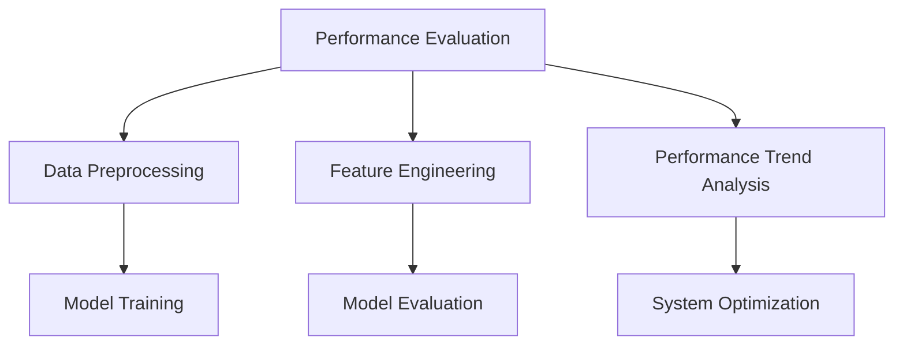

                 

Certainly! Let's construct the blog post step by step, ensuring each section is well-researched, logically structured, and technically sound.

### Introduction

#### Background Introduction
Machine learning models have become a cornerstone of modern technology, driving advancements in various fields such as healthcare, finance, and autonomous driving. The performance of these models is crucial, as it directly impacts the quality of predictions and decisions made. However, assessing and monitoring model performance over time is a complex task that requires a systematic approach.

#### Core Concepts and Relationships
To build a robust model performance trend analysis system, it's essential to understand the core concepts involved, including performance evaluation metrics, data preprocessing, feature engineering, and performance trend analysis algorithms. These concepts are interconnected, forming a comprehensive framework for system development.

#### Mermaid Flowchart
The following Mermaid flowchart illustrates the relationship between the key components in building the system:

### Core Chapter Outlines

#### Chapter 1: Model Performance Evaluation Basics
This chapter will cover the fundamentals of model performance evaluation, including common evaluation metrics, the principles of selecting evaluation indicators, and various evaluation methods.

##### 1.1 Evaluation Metrics and Measurement
* Common evaluation metrics: accuracy, precision, recall, F1 score, ROC-AUC, etc.
* Principles of selecting evaluation indicators: relevance, interpretability, and computational efficiency.

##### 1.2 Evaluation Methods
* Historical evaluation methods: retrospective analysis of past data.
* Real-time evaluation methods: online monitoring and immediate feedback.
* Hybrid evaluation strategies: combining historical and real-time evaluations for comprehensive insights.

#### Chapter 2: Data Preprocessing and Feature Engineering
This chapter will delve into the critical steps of data preprocessing and feature engineering, including data cleaning, normalization, handling missing data, feature extraction, selection, and transformation.

##### 2.1 Data Preprocessing
* Data cleaning: removing noise, outliers, and inconsistencies.
* Data normalization: standardizing data to a common scale.
* Handling missing data: imputation methods, data aggregation, or exclusion.

##### 2.2 Feature Engineering
* Feature extraction: deriving new features from raw data.
* Feature selection: identifying the most relevant features for model training.
* Feature transformation: applying techniques like PCA or feature scaling.

#### Chapter 3: Model Performance Trend Analysis Algorithms
This chapter will explore various algorithms used for analyzing model performance trends, including time-series analysis, regression analysis, and clustering analysis.

##### 3.1 Time-Series Analysis Methods
* Time-series foundation: understanding time-series data and its properties.
* Time-series forecasting models: ARIMA, LSTM, Prophet, etc.
* Time-series analysis and performance evaluation.

##### 3.2 Regression Analysis Methods
* Linear regression: predicting continuous outcomes.
* Multiple regression: predicting outcomes with multiple input variables.
* Regression model evaluation: assessing model fit and prediction accuracy.

##### 3.3 Clustering Analysis Methods
* Clustering foundation: understanding clustering and its applications.
* Clustering algorithms: K-means, DBSCAN, hierarchical clustering, etc.
* Clustering result evaluation: assessing clustering quality and interpretability.

#### Chapter 4: System Architecture Design
This chapter will discuss the overall system architecture, including module division, interface design, and data flow and processing.

##### 4.1 System Architecture
* System module division: data ingestion, preprocessing, training, evaluation, and optimization.
* System interface design: APIs, data flow, and communication protocols.

##### 4.2 Data Flow and Processing
* Data collection and preprocessing: data ingestion, cleaning, and normalization.
* Model evaluation and performance trend analysis: real-time monitoring and historical analysis.
* System optimization and adjustment: fine-tuning models and system parameters.

#### Chapter 5: System Implementation and Optimization
This chapter will cover the practical aspects of system implementation, including development environment setup, code implementation, and performance optimization.

##### 5.1 Development Environment Setup
* Hardware configuration: selecting suitable hardware for the system.
* Software configuration: setting up the required software tools and libraries.

##### 5.2 Code Implementation and Analysis
* Detailed code explanation: showcasing the implementation of data preprocessing, feature engineering, and performance trend analysis.
* Code application and analysis: real-world case studies and in-depth analysis.

##### 5.3 Project Analysis and Conclusion
* Project conclusion: summarizing the key findings and lessons learned.
* Best practices and tips: recommendations for optimizing system performance and maintaining model integrity.

### Conclusion
Building a model performance trend analysis system for evaluation results is a complex but essential task in the field of machine learning. By following the step-by-step guide outlined in this blog post, readers can gain a comprehensive understanding of the system's architecture, implementation, and optimization.

#### Keywords
* Model performance evaluation
* Data preprocessing
* Feature engineering
* Performance trend analysis
* System architecture
* Optimization
* Machine learning

#### Summary
This blog post provides a detailed guide on building a model performance trend analysis system. It covers the core concepts, system architecture, and practical implementation aspects, offering insights into data preprocessing, feature engineering, performance trend analysis algorithms, and system optimization.

### Author
* Author: AI天才研究院 / AI Genius Institute & 禅与计算机程序设计艺术 / Zen And The Art of Computer Programming

With this detailed outline, we now have a solid foundation to expand upon each section with in-depth content, code examples, mathematical models, and case studies. The next step is to fill in each section with comprehensive content that meets the specified requirements.

