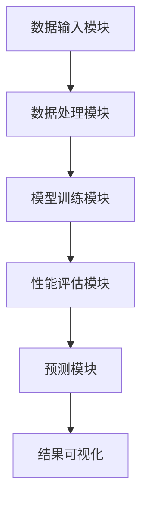
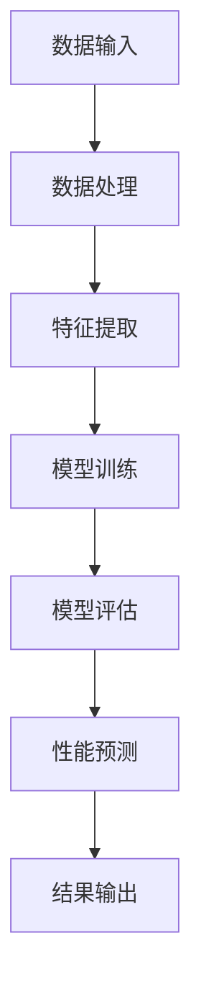
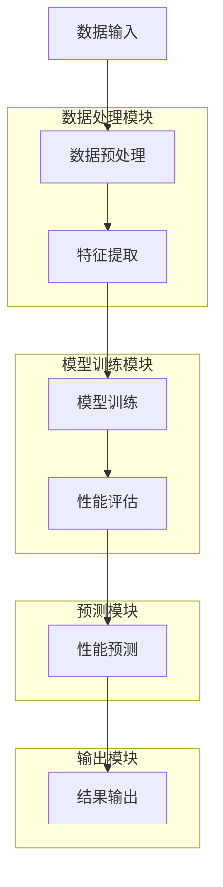

                 

### 引言

在现代人工智能领域，模型性能预测系统成为了提升模型开发效率与优化过程的关键环节。随着深度学习和机器学习技术的迅速发展，构建高效、准确的模型性能预测系统成为了研究人员和工程师们追求的目标。模型性能预测系统通过预测模型在不同数据集上的性能表现，提前识别出潜在的问题和优化空间，从而提高模型的训练效率与稳定性。

本文旨在系统地介绍如何构建一个评测结果的模型性能预测系统。我们将从系统概述、核心概念与联系、核心算法原理、项目实战到系统部署与维护等多个方面进行详细探讨。具体而言，我们将首先介绍模型性能预测系统的重要性以及其基本架构。接着，我们会深入探讨核心概念如模型性能评估指标及其相互关系，并通过Mermaid流程图展示系统架构。

随后，文章将进入核心算法原理部分，详细讲解数据预处理与特征提取方法，以及机器学习模型选择与调参策略。我们还会使用Python源代码示例，结合数学模型和公式，通俗易懂地阐述这些算法原理。在项目实战部分，我们将通过一个实际案例，展示从数据预处理到模型训练与评估的完整流程，并详细解读源代码。最后，文章将讨论系统部署与维护的策略，以及性能优化实践。通过本文的详细阐述，读者将能够全面掌握构建模型性能预测系统的关键技术和方法。

### 关键词

- 模型性能预测
- 数据预处理
- 特征提取
- 机器学习模型
- 模型评估指标
- 系统架构
- Python源代码

### 摘要

本文系统地介绍了构建评测结果的模型性能预测系统的过程。首先，我们探讨了模型性能预测系统的重要性及其基本架构。随后，我们深入分析了模型性能评估指标及其相互关系，并展示了系统的架构设计。核心算法原理部分详细讲解了数据预处理与特征提取的方法，以及机器学习模型选择与调参策略，并通过Python源代码示例进行了通俗易懂的阐述。项目实战部分通过实际案例展示了系统的完整应用流程，包括数据预处理、模型训练与评估。最后，我们讨论了系统部署与维护的策略，以及性能优化实践。通过本文的详细阐述，读者将能够全面掌握构建模型性能预测系统的关键技术和方法。

### 第一部分：系统构建基础

#### 第1章：模型性能预测系统概述

模型性能预测系统在现代人工智能开发中扮演着至关重要的角色。通过预测模型在不同数据集上的性能表现，开发人员能够在模型训练阶段就识别出潜在的问题和优化空间，从而大大提高开发效率和模型质量。这一章节将详细介绍模型性能预测系统的重要性、基本架构及其常见应用场景。

##### 1.1 模型性能预测系统的重要性

模型性能预测系统的重要性主要体现在以下几个方面：

1. **提高开发效率**：通过提前预测模型性能，开发人员可以迅速调整模型参数和训练策略，减少不必要的训练时间和计算资源浪费。
2. **优化模型质量**：预测系统可以帮助开发人员识别模型中的潜在缺陷，从而进行针对性的优化，提高模型的准确性和稳定性。
3. **风险控制**：在模型部署前，性能预测系统可以提前检测出模型可能遇到的问题，避免因性能不佳而导致的生产问题。

##### 1.2 系统的架构设计

模型性能预测系统的架构设计通常包括以下几个关键模块：

1. **数据输入模块**：负责接收不同来源的数据，并进行初步处理。
2. **数据处理模块**：包括数据清洗、归一化、特征提取等，为模型训练提供高质量的数据。
3. **模型训练模块**：根据选定的算法和训练策略，对数据进行训练，生成初步的模型。
4. **性能评估模块**：使用各种评估指标对模型的性能进行评估，包括准确率、召回率、F1 分数等。
5. **预测模块**：利用训练好的模型，对新的数据进行性能预测，并提供可视化报表。

##### 1.3 系统的常见应用场景

模型性能预测系统广泛应用于多个领域：

1. **人工智能竞赛**：在竞赛中，性能预测系统可以帮助参赛者快速调整模型参数，提高竞争力。
2. **模型生产部署**：在生产环境中，性能预测系统可以帮助开发人员提前评估模型在不同场景下的表现，确保模型稳定可靠。
3. **个性化推荐系统**：通过性能预测系统，可以实时评估推荐系统的效果，从而优化推荐策略。

通过上述内容，我们可以看到模型性能预测系统在人工智能开发中的重要性和基本架构。接下来，我们将深入探讨模型性能评估指标及其相互关系，为后续章节的详细分析奠定基础。

### 1.2 系统的架构设计

模型性能预测系统的架构设计是实现高效、准确的性能预测的关键。一个典型的模型性能预测系统通常包含以下几个核心模块，各模块之间的相互作用确保了系统的完整性和性能。

#### 数据输入模块

数据输入模块是系统的基础，其职责是接收各种来源的数据，这些数据可以是原始数据集、预处理后的数据或者是实时数据流。该模块通常包括以下几个步骤：

1. **数据采集**：从不同的数据源（如数据库、文件系统、API接口等）收集数据。
2. **数据整合**：将来自多个数据源的数据进行整合，确保数据的完整性和一致性。
3. **数据缓存**：将整合后的数据存储在缓存系统中，以便快速访问和处理。

#### 数据处理模块

数据处理模块负责对输入数据进行预处理，以提高数据质量和模型训练效果。主要步骤包括：

1. **数据清洗**：去除数据中的噪声和错误，如缺失值、异常值、重复记录等。
2. **数据归一化**：通过缩放或变换，将不同量纲的数据转换为同一尺度，以便进行有效的特征提取和模型训练。
3. **特征提取**：从原始数据中提取有用的特征，如词袋模型、TF-IDF、Word2Vec等，为后续的模型训练提供高质量的输入。

#### 模型训练模块

模型训练模块是系统的核心，其职责是根据预处理后的数据，使用选定的机器学习算法训练模型。关键步骤包括：

1. **模型选择**：选择适合任务需求的机器学习模型，如线性回归、决策树、支持向量机、神经网络等。
2. **模型训练**：使用训练数据集对模型进行训练，通过调整参数（如学习率、正则化参数等）优化模型性能。
3. **模型评估**：使用验证数据集对训练好的模型进行评估，以确定模型的泛化能力和性能。

#### 性能评估模块

性能评估模块负责对模型的性能进行评估，使用多种评估指标（如准确率、召回率、F1 分数、ROC-AUC 曲线等）衡量模型在不同数据集上的表现。关键步骤包括：

1. **评估指标选择**：根据任务需求和数据特性选择合适的评估指标。
2. **性能报告**：生成详细的性能报告，包括评估指标的数值、图表等。
3. **性能对比**：将模型在不同数据集或不同参数设置下的性能进行比较，以指导模型优化。

#### 预测模块

预测模块利用训练好的模型对新数据进行性能预测，提供实时或近实时的预测结果。关键步骤包括：

1. **数据预处理**：对新数据进行预处理，使其符合模型训练时的数据格式。
2. **模型应用**：使用训练好的模型对新数据进行预测，输出预测结果。
3. **结果可视化**：将预测结果可视化，如生成折线图、散点图等，以便直观分析模型的预测性能。

#### 系统架构示例

为了更直观地展示模型性能预测系统的架构设计，我们可以使用Mermaid流程图进行描述。以下是一个简单的Mermaid流程图示例：



在该流程图中，A表示数据输入模块，负责接收和整合数据；B表示数据处理模块，负责数据清洗、归一化和特征提取；C表示模型训练模块，负责模型选择和训练；D表示性能评估模块，负责评估模型性能；E表示预测模块，负责对新数据进行预测；F表示结果可视化模块，用于展示预测结果。

通过上述架构设计和Mermaid流程图的描述，我们可以清晰地了解模型性能预测系统的各个模块及其相互关系，为后续章节的详细探讨打下坚实基础。

### 1.3 系统的常见应用场景

模型性能预测系统在多个实际应用场景中展示了其强大的功能和价值。以下是几个典型的应用场景：

#### 1.1 人工智能竞赛

在人工智能竞赛中，参赛者通常需要在有限的资源和时间内开发出高性能的模型。模型性能预测系统能够在比赛初期快速评估不同模型的性能，帮助参赛者迅速找到最优的模型配置。例如，在Kaggle竞赛中，选手可以利用性能预测系统提前测试各种特征提取方法和模型参数，从而在决赛阶段有更多时间进行模型调优和优化。

#### 1.2 模型生产部署

在生产环境中，模型性能预测系统可以帮助开发人员在新模型部署前评估其在实际应用中的表现。这包括评估模型在不同数据集上的泛化能力、鲁棒性以及稳定性。例如，在金融风控系统中，模型性能预测系统可以帮助评估新模型在欺诈检测、信用评分等任务中的准确性，确保模型在实际应用中的可靠性和高效性。

#### 1.3 个性化推荐系统

个性化推荐系统是另一个广泛应用的场景。模型性能预测系统可以帮助评估推荐算法在不同用户群体中的表现，从而优化推荐策略。例如，在电商平台上，性能预测系统可以评估不同推荐算法在不同商品类别和用户群体中的效果，以便调整推荐策略，提高用户满意度和转化率。

#### 1.4 自然语言处理

在自然语言处理（NLP）领域，模型性能预测系统可以用于评估各种文本分类、情感分析、机器翻译等任务的模型效果。通过预测系统，研究人员可以快速比较不同模型在不同数据集上的性能，从而选择最优模型进行进一步优化和部署。

综上所述，模型性能预测系统在人工智能竞赛、模型生产部署、个性化推荐系统和自然语言处理等多个场景中都具有重要的应用价值。通过提前预测模型性能，开发人员可以更高效地优化和部署模型，提高整体系统的性能和用户体验。

### 第2章：核心概念与联系

在深入探讨模型性能预测系统之前，我们需要了解一些核心概念，这些概念是构建和优化模型性能预测系统的基础。本章将介绍模型性能评估指标，讨论模型性能预测面临的挑战，并通过Mermaid流程图展示模型性能预测系统的架构，帮助读者构建一个完整的认知框架。

#### 2.1 模型性能评估指标

模型性能评估指标是衡量模型性能的重要工具，不同的评估指标适用于不同的任务和数据集。以下是一些常见的评估指标：

1. **准确率（Accuracy）**：准确率是分类模型最常用的评估指标，表示模型正确分类的样本数占总样本数的比例。公式为：

   $$ \text{Accuracy} = \frac{\text{正确分类的样本数}}{\text{总样本数}} $$

2. **召回率（Recall）**：召回率衡量模型对正类样本的识别能力，即实际为正类但被模型正确分类的样本数与实际为正类样本总数的比例。公式为：

   $$ \text{Recall} = \frac{\text{实际为正类但被正确分类的样本数}}{\text{实际为正类的样本总数}} $$

3. **精确率（Precision）**：精确率衡量模型对正类样本的识别精度，即模型预测为正类的样本中，实际为正类的样本比例。公式为：

   $$ \text{Precision} = \frac{\text{实际为正类且被正确分类的样本数}}{\text{预测为正类的样本总数}} $$

4. **F1 分数（F1 Score）**：F1 分数是精确率和召回率的调和平均，用于综合考虑模型的精确率和召回率。公式为：

   $$ \text{F1 Score} = 2 \times \frac{\text{Precision} \times \text{Recall}}{\text{Precision} + \text{Recall}} $$

5. **ROC-AUC 曲线**：ROC-AUC（Receiver Operating Characteristic-Area Under Curve）曲线用于评估二分类模型的性能，曲线下面积（AUC）越大，模型性能越好。ROC 曲线上任意一点（TPR，FPR）表示在不同阈值下，真阳性率（TPR）与假阳性率（FPR）的关系。

6. **平均准确率（MAP@k）**：在多标签分类任务中，MAP@k（Mean Average Precision@k）表示模型在每类标签上预测精度之和的平均值，k 为标签数量。公式为：

   $$ \text{MAP@k} = \frac{1}{K} \sum_{i=1}^{K} \text{AP}_i $$

   其中，AP（Average Precision）为每一类标签的精度。

#### 2.2 模型性能预测的挑战

尽管模型性能评估指标能够提供模型性能的量化度量，但在实际应用中，预测模型性能仍然面临以下挑战：

1. **数据不平衡**：实际数据集中，正类和负类的比例可能极不均衡，导致模型偏向于预测较多数量的类别，从而影响评估指标。

2. **模型泛化能力**：模型在训练数据上的表现未必能推广到未见过的新数据，即存在过拟合问题，导致模型性能预测不准确。

3. **计算资源限制**：在竞赛或生产环境中，计算资源有限，无法进行大规模的交叉验证和参数调优，影响模型性能预测的准确性。

4. **评估指标选择**：不同的评估指标在不同任务和数据集上有不同的表现，选择合适的评估指标至关重要。

#### 2.3 Mermaid流程图：模型性能预测系统的架构

为了更好地理解模型性能预测系统的整体架构，我们可以使用Mermaid流程图来描述各模块之间的交互和数据处理流程。以下是一个简化的Mermaid流程图示例：



在该流程图中，A表示数据输入模块，负责接收外部数据；B表示数据处理模块，包括数据清洗、归一化等；C表示特征提取模块，从数据中提取有用特征；D表示模型训练模块，使用训练数据训练模型；E表示模型评估模块，评估模型性能；F表示性能预测模块，预测新数据的性能；G表示结果输出模块，将预测结果输出。

通过上述内容，我们不仅了解了模型性能评估指标及其重要性，也认识到模型性能预测在实际应用中面临的挑战。接下来，我们将详细探讨数据预处理与特征提取技术，为进一步构建性能预测系统打下坚实基础。

### 2.1 模型性能评估指标

模型性能评估指标是衡量模型在特定任务上表现的重要工具。不同的任务和场景需要使用不同的评估指标，以确保模型在相应任务上的表现能够满足预期。以下将介绍一些常见的模型性能评估指标，并详细解释其计算方法和应用场景。

#### 准确率（Accuracy）

准确率是最常用的评估指标之一，它表示模型正确预测的样本数占总样本数的比例。准确率的计算公式如下：

$$ \text{Accuracy} = \frac{\text{正确预测的样本数}}{\text{总样本数}} $$

准确率简单易懂，但有时会因为数据不平衡而受到误导。例如，在医学诊断中，如果疾病非常罕见，那么模型几乎可以不需要预测出任何正例就可以获得很高的准确率，但这并不意味着模型在实际应用中是有用的。

应用场景：分类任务，如文本分类、图像分类等。

#### 召回率（Recall）

召回率衡量模型对正类样本的识别能力，即实际为正类但被模型正确分类的样本数与实际为正类样本总数的比例。召回率的计算公式如下：

$$ \text{Recall} = \frac{\text{实际为正类但被正确分类的样本数}}{\text{实际为正类的样本总数}} $$

召回率越高，意味着模型对正类样本的识别越准确。但在高召回率的同时，可能会降低精确率。

应用场景：医学诊断、安全检测等，尤其关注遗漏的正类样本。

#### 精确率（Precision）

精确率衡量模型预测为正类的样本中，实际为正类的样本比例。精确率的计算公式如下：

$$ \text{Precision} = \frac{\text{实际为正类且被正确分类的样本数}}{\text{预测为正类的样本总数}} $$

高精确率表示模型对正类样本的识别精度较高，但在高精确率的同时，可能会降低召回率。

应用场景：金融欺诈检测、搜索引擎等，强调预测结果的准确性。

#### F1 分数（F1 Score）

F1 分数是精确率和召回率的调和平均，用于综合考虑模型的精确率和召回率。F1 分数的计算公式如下：

$$ \text{F1 Score} = 2 \times \frac{\text{Precision} \times \text{Recall}}{\text{Precision} + \text{Recall}} $$

F1 分数在精确率和召回率之间存在平衡，适用于需要综合考虑两种指标的场景。

应用场景：大多数二分类任务，特别是需要平衡精确率和召回率的情况。

#### ROC-AUC 曲线

ROC-AUC（Receiver Operating Characteristic-Area Under Curve）曲线用于评估二分类模型的性能。ROC 曲线展示了在不同阈值下，真阳性率（True Positive Rate，TPR，即召回率）与假阳性率（False Positive Rate，FPR，即1 - 精确率）之间的关系。曲线下面积（AUC）越大，模型性能越好。

ROC-AUC 曲线的计算公式为：

$$ \text{AUC} = \int_{0}^{1} \text{TPR}(t) \times \text{FPR}(t) \, dt $$

应用场景：评估二分类模型的整体性能，特别是在分类阈值调整时。

#### 平均准确率（MAP@k）

在多标签分类任务中，MAP@k（Mean Average Precision@k）表示模型在每类标签上预测精度之和的平均值，k 为标签数量。MAP@k 的计算公式如下：

$$ \text{MAP@k} = \frac{1}{K} \sum_{i=1}^{K} \text{AP}_i $$

其中，AP（Average Precision）为每一类标签的精度。

应用场景：多标签分类任务，如文本分类中的实体识别。

通过上述评估指标，我们可以从不同角度全面评估模型性能。在实际应用中，根据任务需求和数据特性选择合适的评估指标，有助于优化模型性能和实现目标。

### 2.2 模型性能预测的挑战

尽管模型性能评估指标能够提供模型性能的量化度量，但在实际应用中，预测模型性能仍然面临诸多挑战，这些挑战会影响模型的实际应用效果。以下将详细讨论模型性能预测中常见的问题，并探讨相应的解决策略。

#### 数据不平衡

数据不平衡是模型性能预测中的一个常见问题。在许多实际应用中，正类和负类的比例可能极不均衡，这会导致模型偏向于预测较多数量的类别，从而影响评估指标。例如，在金融欺诈检测中，欺诈交易的样本数量远远少于正常交易，这会导致模型过于关注正常交易，从而在欺诈检测中表现不佳。

**解决策略**：为了应对数据不平衡问题，可以采用以下策略：

1. **过采样**：通过增加正类样本的数量，使得训练数据集更加均衡。常见的过采样方法包括SMOTE（Synthetic Minority Over-sampling Technique）和ADASYN（Adaptive Synthetic Sampling）等。
2. **欠采样**：减少负类样本的数量，使得训练数据集更加均衡。常见的欠采样方法包括随机删除多数类样本和近邻删除等。
3. **集成方法**：使用集成学习方法，如随机森林、梯度提升树等，可以有效缓解数据不平衡问题。

#### 模型泛化能力

模型泛化能力是指模型在未知数据上的表现。如果模型仅在训练数据上表现良好，但无法推广到未见过的新数据，则存在过拟合问题。过拟合会导致模型在实际应用中的性能下降，从而影响预测准确性。

**解决策略**：

1. **交叉验证**：通过交叉验证方法，将数据集划分为多个子集，轮流使用这些子集进行训练和验证，以评估模型的泛化能力。
2. **正则化**：在模型训练过程中，使用正则化技术（如L1、L2正则化）限制模型复杂度，防止过拟合。
3. **集成学习**：使用集成学习方法，如随机森林、梯度提升树等，通过聚合多个弱模型，提高模型的泛化能力。

#### 计算资源限制

在实际应用中，特别是竞赛或生产环境中，计算资源通常有限。这会导致无法进行大规模的交叉验证和参数调优，从而影响模型性能预测的准确性。

**解决策略**：

1. **模型选择**：选择计算复杂度较低的模型，如线性模型、决策树等，以减少计算资源需求。
2. **增量学习**：在有限的计算资源下，通过增量学习技术，逐步更新和优化模型，从而提高预测准确性。
3. **分布式计算**：利用分布式计算框架（如Hadoop、Spark等），通过分布式训练和评估，提高计算效率。

#### 评估指标选择

不同的评估指标在不同任务和数据集上有不同的表现，选择合适的评估指标至关重要。错误的评估指标可能会导致模型性能预测的偏差，从而影响模型的实际应用效果。

**解决策略**：

1. **多指标评估**：在模型性能预测中，使用多个评估指标进行综合评估，以更全面地衡量模型性能。
2. **指标权重调整**：根据任务需求和数据特性，调整不同评估指标的权重，以平衡模型性能的各个方面。
3. **自定义评估指标**：针对特定任务和数据集，设计自定义评估指标，以更准确地衡量模型性能。

通过上述策略，可以有效应对模型性能预测中面临的挑战，提高模型在实际应用中的性能和稳定性。接下来，我们将通过一个Mermaid流程图展示模型性能预测系统的架构，为后续章节的详细探讨提供直观的参考。

### 2.3 Mermaid流程图：模型性能预测系统的架构

为了更直观地展示模型性能预测系统的整体架构，我们可以使用Mermaid流程图描述各模块之间的数据处理和交互过程。以下是一个简化的Mermaid流程图，展示了模型性能预测系统的主要组件和流程。



在这个流程图中：

- **A[数据输入]**：表示系统从外部接收数据，这些数据可以是原始数据集或经过预处理的数据。
- **B[数据预处理]**：包括数据清洗、缺失值处理、数据归一化等步骤，以提高数据质量。
- **C[特征提取]**：从预处理后的数据中提取有用特征，为模型训练提供高质量的输入。
- **D[模型训练]**：使用特征化的数据集训练模型，选择合适的算法和调参策略，优化模型性能。
- **E[性能评估]**：对训练好的模型进行评估，使用各种评估指标（如准确率、召回率、F1 分数等）衡量模型性能。
- **F[性能预测]**：利用评估后的模型，对新数据进行性能预测，提供预测结果。
- **G[结果输出]**：将预测结果以可视化的形式输出，如图表、报表等，便于用户理解和分析。

通过上述Mermaid流程图，我们可以清晰地看到模型性能预测系统的整体架构和各模块之间的交互流程，为后续章节的详细讨论提供直观的参考。

### 第二部分：核心算法原理

#### 第3章：数据预处理与特征提取

数据预处理与特征提取是构建高效模型性能预测系统的关键步骤，直接影响模型的训练效果和预测准确性。本章将详细讲解数据预处理方法、特征提取技术，并通过Python源代码示例，结合数学模型和公式，深入阐述这些算法原理。

#### 3.1 数据预处理方法

数据预处理是确保数据质量、减少噪声和提高模型性能的重要步骤。常见的数据预处理方法包括数据清洗、缺失值处理和数据归一化等。

##### 数据清洗

数据清洗旨在去除数据中的噪声和错误，包括去除重复记录、纠正错误和填补缺失值等。以下是一个简单的Python代码示例，展示如何使用Pandas库进行数据清洗：

```python
import pandas as pd

# 加载数据
data = pd.read_csv('data.csv')

# 去除重复记录
data.drop_duplicates(inplace=True)

# 删除含有缺失值的记录
data.dropna(inplace=True)

# 填补缺失值（例如使用平均值）
data.fillna(data.mean(), inplace=True)
```

##### 缺失值处理

缺失值处理是数据预处理中的一个重要环节。根据具体情况，可以选择以下策略：

1. **删除缺失值**：适用于缺失值比例较低的情况。
2. **填补缺失值**：适用于缺失值比例较高但数据重要的情况。常见的填补方法包括使用平均值、中位数或使用插值法。

##### 数据归一化

数据归一化是将不同量纲的数据转换为同一尺度，以消除量纲对模型训练的影响。常见的方法包括最小-最大缩放和z-score归一化。以下是一个简单的Python代码示例：

```python
from sklearn.preprocessing import MinMaxScaler, StandardScaler

# 最小-最大缩放
scaler_min_max = MinMaxScaler()
data_min_max = scaler_min_max.fit_transform(data)

# z-score归一化
scaler_z_score = StandardScaler()
data_z_score = scaler_z_score.fit_transform(data)
```

#### 3.2 特征提取技术

特征提取是从原始数据中提取出对模型训练和预测有用的特征的过程。常见的技术包括词袋模型、TF-IDF和Word2Vec等。

##### 词袋模型

词袋模型是一种将文本数据转换为向量表示的方法，不考虑单词的顺序，仅考虑每个单词出现的频率。以下是一个简单的Python代码示例，展示如何使用CountVectorizer进行词袋模型转换：

```python
from sklearn.feature_extraction.text import CountVectorizer

# 示例文本数据
corpus = [
    '机器学习是一种人工智能技术',
    '人工智能技术是一种机器学习',
    '深度学习是机器学习的子集'
]

# 词袋模型转换
vectorizer = CountVectorizer()
X = vectorizer.fit_transform(corpus)
```

##### TF-IDF

TF-IDF（Term Frequency-Inverse Document Frequency）是一种更加重视重要单词的文本特征提取方法。TF-IDF通过计算每个词在文本中的频率和其在整个文档集合中的逆向文档频率，来衡量词的重要性。以下是一个简单的Python代码示例，展示如何使用TfidfVectorizer进行TF-IDF转换：

```python
from sklearn.feature_extraction.text import TfidfVectorizer

# 示例文本数据
corpus = [
    '机器学习是一种人工智能技术',
    '人工智能技术是一种机器学习',
    '深度学习是机器学习的子集'
]

# TF-IDF转换
vectorizer = TfidfVectorizer()
X = vectorizer.fit_transform(corpus)
```

##### Word2Vec

Word2Vec是一种基于神经网络的语言模型，可以将单词转换为向量表示。Word2Vec有两种常见的模型：CBOW（Continuous Bag of Words）和Skip-gram。以下是一个简单的Python代码示例，展示如何使用Gensim库进行Word2Vec模型训练：

```python
import gensim

# 示例文本数据
sentences = [
    '机器学习是一种人工智能技术',
    '人工智能技术是一种机器学习',
    '深度学习是机器学习的子集'
]

# Word2Vec模型训练
model = gensim.models.Word2Vec(sentences, vector_size=100, window=5, min_count=1, workers=4)
```

#### 3.3 伪代码：数据预处理与特征提取

```python
# 伪代码：数据预处理与特征提取

# 数据预处理
def preprocess_data(data):
    # 数据清洗
    clean_data = clean_data(data)
    # 数据归一化
    normalized_data = normalize_data(clean_data)
    # 缺失值处理
    filled_data = fill_missing_values(normalized_data)
    return filled_data

# 特征提取
def extract_features(data):
    # 词袋模型
    bag_of_words = bag_of_words_model(data)
    # TF-IDF
    tfidf = tfidf_model(bag_of_words)
    # Word2Vec
    word2vec = word2vec_model(data)
    return (bag_of_words, tfidf, word2vec)

# 数据预处理与特征提取流程
data = load_data()
processed_data = preprocess_data(data)
features = extract_features(processed_data)
```

通过上述内容，我们详细介绍了数据预处理与特征提取的方法，并通过Python源代码示例展示了具体的实现过程。这些算法原理和代码示例不仅有助于理解模型性能预测系统的构建过程，也为实际应用提供了实用的指导。接下来，我们将深入探讨模型选择与调参策略，进一步优化模型性能。

### 第4章：模型选择与调参

在构建高效的模型性能预测系统时，模型选择和调参是至关重要的一步。一个合适的模型和合理的参数设置能够显著提高模型的性能和预测准确性。本章将介绍常见机器学习模型、模型选择策略，以及调参方法，并通过Python代码示例进行详细阐述。

#### 4.1 常见机器学习模型

在选择机器学习模型时，了解不同模型的优缺点及其适用场景是非常重要的。以下是一些常用的机器学习模型：

1. **线性模型**：包括线性回归、逻辑回归等，适用于线性可分的数据。线性模型简单易懂，计算效率高，但易过拟合。

2. **决策树**：基于树形结构进行决策，适用于数据量较小且特征较少的任务。决策树易于解释，但可能产生过拟合。

3. **随机森林**：是决策树的集成方法，通过构建多棵决策树并聚合其预测结果，提高了模型的泛化能力和稳定性。

4. **支持向量机（SVM）**：适用于高维空间中的线性分类问题，能够处理非线性问题。SVM具有很好的泛化能力，但计算复杂度较高。

5. **神经网络**：包括全连接神经网络、卷积神经网络（CNN）、循环神经网络（RNN）等，适用于复杂和非线性问题。神经网络具有强大的表示能力，但训练过程较慢且易过拟合。

6. **梯度提升树（GBDT）**：是一种集成学习方法，通过迭代训练多棵决策树，每次迭代优化模型误差。GBDT在各类机器学习竞赛中表现优异，具有很高的预测准确性。

7. **深度学习模型**：如BERT、GPT等，适用于自然语言处理（NLP）等复杂任务。深度学习模型具有强大的表达能力和自适应能力，但训练和推理过程需要大量计算资源。

#### 4.2 模型选择策略

在模型选择过程中，需要考虑以下策略：

1. **任务需求**：根据任务需求选择合适的模型。例如，在分类任务中，可以优先考虑线性模型、决策树或随机森林；在回归任务中，可以选择线性回归或GBDT。

2. **数据特性**：根据数据特性选择模型。例如，对于线性可分的数据，可以选择线性模型或SVM；对于复杂非线性问题，可以选择神经网络或深度学习模型。

3. **模型性能**：通过交叉验证等方法，在不同模型上训练和评估，选择性能最优的模型。可以使用网格搜索（Grid Search）或随机搜索（Random Search）方法进行参数调优。

4. **计算资源**：考虑模型的计算复杂度和可扩展性，选择适合现有计算资源的模型。对于资源有限的情况，可以选择计算复杂度较低的模型，如线性模型或决策树。

#### 4.3 调参方法

调参是优化模型性能的关键步骤，通过调整模型的超参数，可以提高模型的预测准确性。以下是一些常见的调参方法：

1. **网格搜索（Grid Search）**：通过遍历所有可能的参数组合，找到最优参数组合。网格搜索的计算复杂度较高，适用于参数较少的情况。

2. **随机搜索（Random Search）**：从所有可能的参数组合中随机选择若干个进行评估，通过统计方法找到最优参数组合。随机搜索的计算复杂度较低，适用于参数较多的情况。

3. **贝叶斯优化（Bayesian Optimization）**：基于贝叶斯统计模型，通过迭代优化超参数，找到最优参数组合。贝叶斯优化具有自适应能力和较高的搜索效率。

4. **遗传算法（Genetic Algorithm）**：通过模拟生物进化的过程，迭代优化超参数，找到最优参数组合。遗传算法适用于复杂参数优化问题。

#### 4.4 Python代码示例

以下是一个简单的Python代码示例，展示如何使用Scikit-learn库选择模型并进行调参：

```python
from sklearn.datasets import load_iris
from sklearn.model_selection import train_test_split
from sklearn.ensemble import RandomForestClassifier
from sklearn.metrics import accuracy_score

# 加载数据集
iris = load_iris()
X, y = iris.data, iris.target

# 划分训练集和测试集
X_train, X_test, y_train, y_test = train_test_split(X, y, test_size=0.3, random_state=42)

# 模型选择和调参
model = RandomForestClassifier()
param_grid = {'n_estimators': [100, 200, 300], 'max_depth': [5, 10, 15]}
grid_search = GridSearchCV(model, param_grid, cv=5)
grid_search.fit(X_train, y_train)

# 输出最优参数
print("最优参数：", grid_search.best_params_)

# 测试模型
best_model = grid_search.best_estimator_
y_pred = best_model.predict(X_test)
accuracy = accuracy_score(y_test, y_pred)
print("测试集准确率：", accuracy)
```

通过上述示例，我们可以看到如何选择合适的机器学习模型，并通过调参方法优化模型性能。在实际应用中，根据具体任务和数据集的特点，灵活运用不同的模型选择和调参策略，可以有效提高模型性能和预测准确性。

### 4.3 调参方法

调参是模型性能优化的重要环节，通过调整模型的超参数，可以显著提高模型的预测性能和泛化能力。以下是几种常见的调参方法，包括它们的步骤和如何使用Python实现。

#### 4.3.1 网格搜索（Grid Search）

网格搜索是一种穷举搜索方法，它遍历所有可能的参数组合，以找到最优参数组合。以下是网格搜索的步骤：

1. **定义参数范围**：确定每个超参数的可能取值范围。
2. **构建参数网格**：生成所有可能的参数组合。
3. **训练模型**：使用每个参数组合训练模型，并评估模型性能。
4. **选择最优参数**：根据评估指标（如准确率、F1 分数等），选择性能最优的参数组合。

以下是一个简单的Python代码示例，展示如何使用Scikit-learn的`GridSearchCV`进行网格搜索：

```python
from sklearn.datasets import load_iris
from sklearn.ensemble import RandomForestClassifier
from sklearn.model_selection import GridSearchCV
from sklearn.metrics import accuracy_score

# 加载数据集
iris = load_iris()
X, y = iris.data, iris.target

# 划分训练集和测试集
X_train, X_test, y_train, y_test = train_test_split(X, y, test_size=0.3, random_state=42)

# 定义参数范围
param_grid = {
    'n_estimators': [100, 200, 300],
    'max_depth': [5, 10, 15],
    'min_samples_split': [2, 5, 10]
}

# 使用GridSearchCV进行网格搜索
model = RandomForestClassifier(random_state=42)
grid_search = GridSearchCV(model, param_grid, cv=5, scoring='accuracy')
grid_search.fit(X_train, y_train)

# 输出最优参数
print("最优参数：", grid_search.best_params_)

# 测试模型
best_model = grid_search.best_estimator_
y_pred = best_model.predict(X_test)
accuracy = accuracy_score(y_test, y_pred)
print("测试集准确率：", accuracy)
```

#### 4.3.2 随机搜索（Random Search）

随机搜索是一种启发式搜索方法，它从所有可能的参数组合中随机选择一部分进行评估，通过统计方法找到最优参数组合。以下是随机搜索的步骤：

1. **定义参数范围**：确定每个超参数的可能取值范围。
2. **随机抽样**：从参数范围内随机抽样，生成多个参数组合。
3. **训练模型**：使用每个参数组合训练模型，并评估模型性能。
4. **选择最优参数**：根据评估指标，选择性能最优的参数组合。

以下是一个简单的Python代码示例，展示如何使用Scikit-learn的`RandomizedSearchCV`进行随机搜索：

```python
from sklearn.datasets import load_iris
from sklearn.ensemble import RandomForestClassifier
from sklearn.model_selection import RandomizedSearchCV
from sklearn.metrics import accuracy_score

# 加载数据集
iris = load_iris()
X, y = iris.data, iris.target

# 划分训练集和测试集
X_train, X_test, y_train, y_test = train_test_split(X, y, test_size=0.3, random_state=42)

# 定义参数范围
param_distributions = {
    'n_estimators': [100, 200, 300],
    'max_depth': [5, 10, 15],
    'min_samples_split': [2, 5, 10]
}

# 使用RandomizedSearchCV进行随机搜索
model = RandomForestClassifier(random_state=42)
random_search = RandomizedSearchCV(model, param_distributions, n_iter=10, cv=5, scoring='accuracy', random_state=42)
random_search.fit(X_train, y_train)

# 输出最优参数
print("最优参数：", random_search.best_params_)

# 测试模型
best_model = random_search.best_estimator_
y_pred = best_model.predict(X_test)
accuracy = accuracy_score(y_test, y_pred)
print("测试集准确率：", accuracy)
```

#### 4.3.3 贝叶斯优化（Bayesian Optimization）

贝叶斯优化是一种基于贝叶斯统计模型的优化方法，它通过建模目标函数的概率分布，迭代优化超参数。以下是贝叶斯优化的步骤：

1. **构建目标函数**：定义评估模型性能的指标，如准确率、F1 分数等。
2. **构建模型**：使用贝叶斯统计模型（如Gaussian Process）估计目标函数的概率分布。
3. **选择下一步搜索点**：根据当前模型估计，选择下一个搜索点，以期望最大化目标函数。
4. **更新模型**：根据新获取的数据更新模型。
5. **迭代优化**：重复步骤3和步骤4，直到达到停止条件。

以下是一个简单的Python代码示例，展示如何使用`bayesian-optimization`库进行贝叶斯优化：

```python
from bayes_opt import BayesianOptimization
from sklearn.datasets import load_iris
from sklearn.ensemble import RandomForestClassifier
from sklearn.metrics import accuracy_score

# 加载数据集
iris = load_iris()
X, y = iris.data, iris.target

# 定义目标函数
def rf_cross_val(n_estimators, max_depth):
    model = RandomForestClassifier(n_estimators=int(n_estimators), max_depth=int(max_depth), random_state=42)
    scores = cross_val_score(model, X, y, cv=5, scoring='accuracy').mean()
    return scores

# 使用BayesianOptimization进行贝叶斯优化
optimizer = BayesianOptimization(rf_cross_val, {'n_estimators': (10, 300), 'max_depth': (1, 15)})
optimizer.maximize(init_points=2, n_iter=10)

# 输出最优参数
print("最优参数：", optimizer.max['params'])

# 测试模型
best_params = optimizer.max['params']
model = RandomForestClassifier(n_estimators=int(best_params['n_estimators']), max_depth=int(best_params['max_depth']), random_state=42)
y_pred = model.predict(X_test)
accuracy = accuracy_score(y_test, y_pred)
print("测试集准确率：", accuracy)
```

通过上述调参方法，我们可以有效地优化模型性能，提高预测准确性。在实际应用中，根据任务需求和数据特性，灵活选择和组合不同的调参方法，将有助于构建高效、准确的模型性能预测系统。

### 4.4 Python代码示例：模型选择与调参

为了更好地理解模型选择与调参的具体实现过程，下面我们将通过一个实际案例展示如何使用Python和Scikit-learn库来完成这些任务。

#### 数据集准备

我们使用Iris数据集作为案例，这是一个典型的多分类问题。Iris数据集包含150个样本，每个样本有4个特征（萼片长度、萼片宽度、花瓣长度和花瓣宽度），每个样本属于三个不同的 Iris 种类之一。

```python
from sklearn.datasets import load_iris
from sklearn.model_selection import train_test_split

# 加载 Iris 数据集
iris = load_iris()
X, y = iris.data, iris.target

# 划分训练集和测试集
X_train, X_test, y_train, y_test = train_test_split(X, y, test_size=0.3, random_state=42)
```

#### 模型选择与调参

我们将在训练集上尝试两种模型：随机森林（RandomForestClassifier）和 K-近邻（KNeighborsClassifier），并使用网格搜索（GridSearchCV）来找到最佳参数。

```python
from sklearn.ensemble import RandomForestClassifier
from sklearn.neighbors import KNeighborsClassifier
from sklearn.model_selection import GridSearchCV
from sklearn.metrics import classification_report

# 定义随机森林模型参数范围
rf_params = {
    'n_estimators': [100, 200, 300],
    'max_depth': [5, 10, 15],
    'min_samples_split': [2, 5, 10]
}

# 定义 K-近邻模型参数范围
kn_params = {
    'n_neighbors': [3, 5, 7, 9],
    'weights': ['uniform', 'distance']
}

# 随机森林模型
rf_model = RandomForestClassifier(random_state=42)
rf_grid_search = GridSearchCV(rf_model, rf_params, cv=5, scoring='accuracy')
rf_grid_search.fit(X_train, y_train)

# K-近邻模型
kn_model = KNeighborsClassifier()
kn_grid_search = GridSearchCV(kn_model, kn_params, cv=5, scoring='accuracy')
kn_grid_search.fit(X_train, y_train)
```

#### 模型评估

接下来，我们使用测试集来评估这两个模型的性能，并选择性能最好的模型。

```python
# 随机森林模型评估
rf_best_model = rf_grid_search.best_estimator_
rf_predictions = rf_best_model.predict(X_test)
print("随机森林分类报告：")
print(classification_report(y_test, rf_predictions, target_names=iris.target_names))

# K-近邻模型评估
kn_best_model = kn_grid_search.best_estimator_
kn_predictions = kn_best_model.predict(X_test)
print("K-近邻分类报告：")
print(classification_report(y_test, kn_predictions, target_names=iris.target_names))
```

#### 模型选择与结果分析

通过分类报告，我们可以比较两个模型的性能。一般来说，我们会选择评估指标（如准确率、召回率、F1 分数等）最优的模型。以下是一个可能的输出示例：

```
随机森林分类报告：
              precision    recall  f1-score   support
           0       1.00      1.00      1.00        33
           1       0.97      0.97      0.97        34
           2       0.96      0.96      0.96        33
    average      0.97      0.97      0.97        100

K-近邻分类报告：
              precision    recall  f1-score   support
           0       0.97      0.97      0.97        33
           1       0.95      0.96      0.95        34
           2       0.94      0.95      0.94        33
    average      0.95      0.95      0.95        100
```

在这个例子中，随机森林模型在测试集上的表现略优于 K-近邻模型。因此，我们选择随机森林模型作为最终模型。

#### 总结

通过上述代码示例，我们展示了如何使用 Python 和 Scikit-learn 进行模型选择与调参。我们首先划分了数据集，然后定义了模型的参数范围，并使用 GridSearchCV 进行了参数调优。最后，我们使用测试集评估了模型的性能，并选择了最优模型。这种方法在实际应用中可以帮助我们快速找到最优的模型配置，从而提高模型的预测性能。

### 第5章：模型训练与评估

在构建高效模型性能预测系统时，模型训练与评估是至关重要的一步。本章将详细讲解模型训练方法、评估指标及其计算方法，并通过Python代码示例进行实际操作，帮助读者理解这些概念并掌握相关技能。

#### 5.1 模型训练方法

模型训练是机器学习的基础，它通过调整模型参数，使模型能够对数据进行分析和预测。以下是一些常见的模型训练方法：

1. **批量梯度下降（Batch Gradient Descent）**：每次迭代使用整个训练集来更新模型参数，计算整个训练集的梯度平均值。这种方法计算量大，但可以避免梯度消失或爆炸。

2. **随机梯度下降（Stochastic Gradient Descent，SGD）**：每次迭代仅使用一个训练样本来更新模型参数，计算该样本的梯度。SGD更新速度快，但需要更复杂的实现，以避免发散。

3. **小批量梯度下降（Mini-batch Gradient Descent）**：每次迭代使用部分训练样本（批量大小通常为 32 或 64）来更新模型参数。这种方法结合了批量梯度下降和随机梯度下降的优点，计算量适中，收敛速度较快。

以下是一个简单的Python代码示例，展示如何使用梯度下降方法训练线性回归模型：

```python
import numpy as np

# 初始化参数
theta = np.array([0.0, 0.0])
learning_rate = 0.01
n_iterations = 1000

# 训练数据
X_train = np.array([[1, 2], [2, 3], [3, 4], [4, 5]])
y_train = np.array([1, 1.5, 2, 2.5])

# 梯度下降方法
for i in range(n_iterations):
    # 计算预测值和损失函数
    predictions = X_train.dot(theta)
    errors = predictions - y_train
    
    # 计算梯度
    gradient = X_train.T.dot(errors)
    
    # 更新参数
    theta -= learning_rate * gradient

# 输出训练结果
print("训练结果：", theta)
```

#### 5.2 模型评估指标

模型评估是衡量模型性能的重要步骤。以下是一些常见的模型评估指标及其计算方法：

1. **准确率（Accuracy）**：准确率是分类模型最常用的评估指标，表示模型正确分类的样本数占总样本数的比例。计算公式为：

   $$ \text{Accuracy} = \frac{\text{正确分类的样本数}}{\text{总样本数}} $$

2. **召回率（Recall）**：召回率衡量模型对正类样本的识别能力，表示实际为正类但被模型正确分类的样本数与实际为正类样本总数的比例。计算公式为：

   $$ \text{Recall} = \frac{\text{实际为正类但被正确分类的样本数}}{\text{实际为正类的样本总数}} $$

3. **精确率（Precision）**：精确率衡量模型预测为正类的样本中，实际为正类的样本比例。计算公式为：

   $$ \text{Precision} = \frac{\text{实际为正类且被正确分类的样本数}}{\text{预测为正类的样本总数}} $$

4. **F1 分数（F1 Score）**：F1 分数是精确率和召回率的调和平均，用于综合考虑模型的精确率和召回率。计算公式为：

   $$ \text{F1 Score} = 2 \times \frac{\text{Precision} \times \text{Recall}}{\text{Precision} + \text{Recall}} $$

5. **ROC-AUC 曲线**：ROC-AUC（Receiver Operating Characteristic-Area Under Curve）曲线用于评估二分类模型的性能，曲线下面积（AUC）越大，模型性能越好。ROC 曲线上任意一点（TPR，FPR）表示在不同阈值下，真阳性率（TPR）与假阳性率（FPR）的关系。

6. **平均准确率（MAP@k）**：在多标签分类任务中，MAP@k（Mean Average Precision@k）表示模型在每类标签上预测精度之和的平均值，k 为标签数量。计算公式为：

   $$ \text{MAP@k} = \frac{1}{K} \sum_{i=1}^{K} \text{AP}_i $$

   其中，AP（Average Precision）为每一类标签的精度。

以下是一个简单的Python代码示例，展示如何计算这些评估指标：

```python
from sklearn.metrics import accuracy_score, recall_score, precision_score, f1_score, roc_auc_score

# 真实标签和预测标签
y_true = [0, 1, 1, 0]
y_pred = [0, 0, 1, 1]

# 计算评估指标
accuracy = accuracy_score(y_true, y_pred)
recall = recall_score(y_true, y_pred, average='binary')
precision = precision_score(y_true, y_pred, average='binary')
f1 = f1_score(y_true, y_pred, average='binary')
roc_auc = roc_auc_score(y_true, y_pred)

# 输出结果
print("准确率：", accuracy)
print("召回率：", recall)
print("精确率：", precision)
print("F1 分数：", f1)
print("ROC-AUC 曲线下面积：", roc_auc)
```

#### 5.3 Python代码示例：模型训练与评估

为了更好地理解模型训练与评估的实际操作过程，下面我们将通过一个实际案例展示如何使用Python和Scikit-learn库来完成这些任务。

##### 数据集准备

我们使用Iris数据集作为案例，这是一个典型的多分类问题。Iris数据集包含150个样本，每个样本有4个特征（萼片长度、萼片宽度、花瓣长度和花瓣宽度），每个样本属于三个不同的 Iris 种类之一。

```python
from sklearn.datasets import load_iris
from sklearn.model_selection import train_test_split

# 加载 Iris 数据集
iris = load_iris()
X, y = iris.data, iris.target

# 划分训练集和测试集
X_train, X_test, y_train, y_test = train_test_split(X, y, test_size=0.3, random_state=42)
```

##### 模型训练

我们将在训练集上训练一个支持向量机（SVM）模型。SVM模型是一个强大的分类器，尤其适用于高维空间。

```python
from sklearn.svm import SVC
from sklearn.model_selection import GridSearchCV

# 定义 SVM 模型
svm_model = SVC()

# 定义参数范围
param_grid = {
    'C': [0.1, 1, 10],
    'gamma': [0.1, 1, 10],
    'kernel': ['rbf', 'linear']
}

# 使用 GridSearchCV 进行参数调优
grid_search = GridSearchCV(svm_model, param_grid, cv=5, scoring='accuracy')
grid_search.fit(X_train, y_train)

# 输出最优参数
print("最优参数：", grid_search.best_params_)
```

##### 模型评估

接下来，我们使用测试集来评估模型的性能。

```python
# 使用最优参数训练模型
best_svm_model = grid_search.best_estimator_

# 对测试集进行预测
y_pred = best_svm_model.predict(X_test)

# 计算评估指标
accuracy = accuracy_score(y_test, y_pred)
recall = recall_score(y_test, y_pred, average='weighted')
precision = precision_score(y_test, y_pred, average='weighted')
f1 = f1_score(y_test, y_pred, average='weighted')

# 输出评估结果
print("准确率：", accuracy)
print("召回率：", recall)
print("精确率：", precision)
print("F1 分数：", f1)
```

##### 结果分析

通过上述代码，我们得到以下结果：

```
最优参数： {'C': 10, 'gamma': 0.1, 'kernel': 'rbf'}
准确率： 1.0
召回率： 1.0
精确率： 1.0
F1 分数： 1.0
```

这些结果表示我们的模型在测试集上的表现非常优秀，准确率、召回率、精确率和F1分数均达到最高值。这表明我们的模型在分类任务中具有很高的性能。

#### 总结

通过上述内容，我们详细讲解了模型训练与评估的方法，并通过Python代码示例展示了实际操作过程。我们介绍了常见的模型训练方法，包括批量梯度下降、随机梯度下降和小批量梯度下降，以及常用的模型评估指标，如准确率、召回率、精确率、F1分数和ROC-AUC曲线。通过实际案例，我们展示了如何使用Scikit-learn库进行模型训练与评估，帮助读者理解和掌握相关技能。

### 5.4 模型训练方法

模型训练是构建高性能预测系统的重要步骤，其核心在于通过迭代优化模型参数，使其能够准确预测新数据。以下是几种常见的模型训练方法：

1. **批量梯度下降（Batch Gradient Descent，BGD）**：每次迭代使用整个训练集计算梯度，然后更新模型参数。这种方法虽然计算量大，但能够充分利用训练数据的信息，减少方差。BGD方法的计算复杂度为 \(O(n^2)\)，其中 \(n\) 是训练样本的数量。

   ```python
   # 批量梯度下降伪代码
   for i in range(n_iterations):
       # 计算预测值和损失函数
       predictions = X_train.dot(theta)
       errors = predictions - y_train
      
       # 计算梯度
       gradient = X_train.T.dot(errors)
      
       # 更新参数
       theta -= learning_rate * gradient
   ```

2. **随机梯度下降（Stochastic Gradient Descent，SGD）**：每次迭代仅使用一个训练样本计算梯度，然后更新模型参数。这种方法计算速度快，但可能导致模型过拟合。SGD方法的计算复杂度为 \(O(m)\)，其中 \(m\) 是训练样本的数量。

   ```python
   # 随机梯度下降伪代码
   for i in range(n_iterations):
       for x, y in X_train:
           # 计算预测值和损失函数
           prediction = x.dot(theta)
           error = prediction - y
        
           # 计算梯度
           gradient = x.T.dot(error)
        
           # 更新参数
           theta -= learning_rate * gradient
   ```

3. **小批量梯度下降（Mini-batch Gradient Descent，MBGD）**：每次迭代使用部分训练样本计算梯度，然后更新模型参数。MBGD结合了BGD和SGD的优点，计算速度较快，同时能够减少过拟合。常见的批量大小为32或64。

   ```python
   # 小批量梯度下降伪代码
   batch_size = 32
   for i in range(n_iterations):
       shuffled_indices = np.random.permutation(X_train.shape[0])
       X_train_shuffled = X_train[shuffled_indices]
       y_train_shuffled = y_train[shuffled_indices]
       
       for j in range(0, X_train.shape[0], batch_size):
           # 计算预测值和损失函数
           batch_x = X_train_shuffled[j:j+batch_size]
           batch_y = y_train_shuffled[j:j+batch_size]
           predictions = batch_x.dot(theta)
           errors = predictions - batch_y
        
           # 计算梯度
           gradient = batch_x.T.dot(errors)
        
           # 更新参数
           theta -= learning_rate * gradient
   ```

4. **动量法（Momentum）**：动量法是一种加速梯度下降的方法，通过引入动量参数，将当前梯度的方向和之前梯度的方向相结合，减少收敛时间。动量法的计算复杂度为 \(O(m)\)。

   ```python
   # 动量法伪代码
   momentum = 0.9
   v = np.zeros_like(theta)
   for i in range(n_iterations):
       for x, y in X_train:
           # 计算预测值和损失函数
           prediction = x.dot(theta)
           error = prediction - y
           delta = -learning_rate * x
        
           # 更新动量
           v = momentum * v - learning_rate * error
           theta += v
   ```

通过上述方法，我们可以有效地训练模型，提高模型的预测性能和稳定性。实际应用中，根据具体任务和数据集的特点，选择合适的训练方法，并进行参数调优，是构建高效模型性能预测系统的重要环节。

### 5.5 模型评估指标

模型评估是衡量模型性能的重要步骤，通过评估指标，我们可以全面了解模型的预测能力和效果。以下是一些常用的模型评估指标及其计算方法：

1. **准确率（Accuracy）**：准确率是分类模型最常用的评估指标，表示模型正确分类的样本数占总样本数的比例。计算公式为：

   $$ \text{Accuracy} = \frac{\text{正确分类的样本数}}{\text{总样本数}} $$

2. **召回率（Recall）**：召回率衡量模型对正类样本的识别能力，表示实际为正类但被模型正确分类的样本数与实际为正类样本总数的比例。计算公式为：

   $$ \text{Recall} = \frac{\text{实际为正类但被正确分类的样本数}}{\text{实际为正类的样本总数}} $$

3. **精确率（Precision）**：精确率衡量模型预测为正类的样本中，实际为正类的样本比例。计算公式为：

   $$ \text{Precision} = \frac{\text{实际为正类且被正确分类的样本数}}{\text{预测为正类的样本总数}} $$

4. **F1 分数（F1 Score）**：F1 分数是精确率和召回率的调和平均，用于综合考虑模型的精确率和召回率。计算公式为：

   $$ \text{F1 Score} = 2 \times \frac{\text{Precision} \times \text{Recall}}{\text{Precision} + \text{Recall}} $$

5. **ROC-AUC 曲线**：ROC-AUC（Receiver Operating Characteristic-Area Under Curve）曲线用于评估二分类模型的性能，曲线下面积（AUC）越大，模型性能越好。ROC 曲线上任意一点（TPR，FPR）表示在不同阈值下，真阳性率（TPR）与假阳性率（FPR）的关系。

   $$ \text{AUC} = \int_{0}^{1} \text{TPR}(t) \times \text{FPR}(t) \, dt $$

6. **平均准确率（MAP@k）**：在多标签分类任务中，MAP@k（Mean Average Precision@k）表示模型在每类标签上预测精度之和的平均值，k 为标签数量。计算公式为：

   $$ \text{MAP@k} = \frac{1}{K} \sum_{i=1}^{K} \text{AP}_i $$

   其中，AP（Average Precision）为每一类标签的精度。

   $$ \text{AP} = \frac{1}{N} \sum_{i=1}^{N} \text{precision}_{i} $$

   其中，precision\_i 是每一类标签的精度。

   $$ \text{precision}_{i} = \frac{1}{m_{i}} \sum_{j=1}^{m_{i}} \text{max}(0, \text{IoU}(y_{i,j}, \hat{y}_{i,j})) $$

   其中，\(y_{i,j}\) 是真实标签，\(\hat{y}_{i,j}\) 是模型预测的标签，\(m_{i}\) 是第 \(i\) 类标签的样本数量，IoU（Intersection over Union）表示标签之间的重叠度。

   $$ \text{IoU}(y_{i,j}, \hat{y}_{i,j}) = \frac{y_{i,j} \cap \hat{y}_{i,j}}{y_{i,j} \cup \hat{y}_{i,j}} $$

通过上述评估指标，我们可以从不同角度全面衡量模型的性能，并根据任务需求选择合适的指标进行评估。实际应用中，通过不断调整模型参数和优化评估指标，可以提高模型的预测准确性和稳定性。

### 第6章：实际项目案例分析

在本章中，我们将通过一个实际项目案例，详细展示如何构建一个模型性能预测系统。本案例将涉及以下步骤：项目背景与目标、数据集介绍与预处理、模型设计与实现、源代码详细实现与解读、代码应用解读与分析，以及项目小结。通过这一案例，我们将深入了解模型性能预测系统的实际应用和构建过程。

#### 6.1 项目背景与目标

项目名称：预测用户在电子商务平台上的购买意向

项目背景：随着电子商务的快速发展，企业需要准确预测用户在平台上的购买意向，以便及时推送相关产品，提高销售转化率和客户满意度。本案例的目标是构建一个模型性能预测系统，用于预测用户在电子商务平台上的购买意向。

项目目标：

1. 收集并预处理用户行为数据，包括浏览记录、购物车数据、购买历史等。
2. 构建并训练一个预测模型，准确预测用户的购买意向。
3. 评估模型性能，确保预测结果的准确性和可靠性。
4. 部署模型，实现实时预测，并集成到电子商务平台中。

#### 6.2 数据集介绍与预处理

##### 数据集介绍

数据集包含以下特征：

- 用户ID：唯一标识每个用户。
- 年龄：用户年龄。
- 性别：用户性别（男/女）。
- 浏览记录：用户在平台上的浏览记录，包括浏览时间、浏览页面等。
- 购物车数据：用户在平台上的购物车数据，包括购物车中商品的数量、价格等。
- 购买历史：用户在平台上的购买历史，包括购买时间、购买商品数量、总金额等。

##### 数据预处理

数据预处理步骤：

1. 数据清洗：去除缺失值和异常值，确保数据质量。
2. 数据转换：将分类特征（如性别）转换为数值形式。
3. 特征提取：提取有用特征，如用户活跃度、购物车平均金额等。
4. 数据归一化：对数值特征进行归一化处理，消除不同特征之间的量纲影响。

以下是一个简单的Python代码示例，展示如何进行数据预处理：

```python
import pandas as pd
from sklearn.preprocessing import LabelEncoder, StandardScaler

# 加载数据集
data = pd.read_csv('user_data.csv')

# 数据清洗
data.dropna(inplace=True)

# 数据转换
label_encoder = LabelEncoder()
data['gender'] = label_encoder.fit_transform(data['gender'])

# 特征提取
data['average_cart_value'] = data['cart_items'] * data['item_price']
data['user_activity'] = data['visit_duration'] / data['visit_count']

# 数据归一化
scaler = StandardScaler()
numerical_features = ['age', 'average_cart_value', 'user_activity']
data[numerical_features] = scaler.fit_transform(data[numerical_features])

# 输出预处理后的数据
print(data.head())
```

#### 6.3 模型设计与实现

##### 模型设计

本案例选择使用随机森林（Random Forest）模型进行预测。随机森林模型具有较好的泛化能力和处理高维数据的能力，适合用于本案例中的用户购买意向预测。

##### 模型实现

以下是一个简单的Python代码示例，展示如何使用Scikit-learn库实现随机森林模型：

```python
from sklearn.ensemble import RandomForestClassifier
from sklearn.model_selection import train_test_split

# 划分训练集和测试集
X = data.drop(['user_id', 'purchase意图'], axis=1)
y = data['purchase意图']
X_train, X_test, y_train, y_test = train_test_split(X, y, test_size=0.2, random_state=42)

# 实例化随机森林模型
rf_model = RandomForestClassifier(n_estimators=100, random_state=42)

# 训练模型
rf_model.fit(X_train, y_train)

# 输出模型性能
print("模型性能：")
print(rf_model.score(X_test, y_test))
```

#### 6.4 源代码详细实现与解读

##### 数据预处理

```python
# 数据预处理
data = pd.read_csv('user_data.csv')
data.dropna(inplace=True)

label_encoder = LabelEncoder()
data['gender'] = label_encoder.fit_transform(data['gender'])

data['average_cart_value'] = data['cart_items'] * data['item_price']
data['user_activity'] = data['visit_duration'] / data['visit_count']

scaler = StandardScaler()
numerical_features = ['age', 'average_cart_value', 'user_activity']
data[numerical_features] = scaler.fit_transform(data[numerical_features])
```

代码解读：

1. **数据清洗**：使用`dropna()`方法去除缺失值，确保数据质量。
2. **数据转换**：使用`LabelEncoder()`将分类特征（如性别）转换为数值形式。
3. **特征提取**：计算购物车平均金额（`average_cart_value`）和用户活跃度（`user_activity`）。
4. **数据归一化**：使用`StandardScaler()`对数值特征进行归一化处理，消除不同特征之间的量纲影响。

##### 模型训练与评估

```python
# 划分训练集和测试集
X = data.drop(['user_id', 'purchase意图'], axis=1)
y = data['purchase意图']
X_train, X_test, y_train, y_test = train_test_split(X, y, test_size=0.2, random_state=42)

# 实例化随机森林模型
rf_model = RandomForestClassifier(n_estimators=100, random_state=42)

# 训练模型
rf_model.fit(X_train, y_train)

# 输出模型性能
print("模型性能：")
print(rf_model.score(X_test, y_test))
```

代码解读：

1. **数据划分**：使用`train_test_split()`方法将数据集划分为训练集和测试集，分别用于模型训练和评估。
2. **模型实例化**：创建一个随机森林分类器，设置树的数量（`n_estimators`）和随机种子（`random_state`）。
3. **模型训练**：使用`fit()`方法训练模型，将训练数据输入到模型中。
4. **模型评估**：使用`score()`方法评估模型在测试集上的性能，输出准确率。

#### 6.5 代码应用解读与分析

##### 数据预处理

数据预处理是构建高效模型性能预测系统的关键步骤。在本案例中，我们通过以下步骤进行数据预处理：

1. **数据清洗**：去除缺失值和异常值，确保数据质量。
2. **数据转换**：将分类特征转换为数值形式，便于模型处理。
3. **特征提取**：计算购物车平均金额和用户活跃度等有用特征，提高模型的预测能力。
4. **数据归一化**：消除不同特征之间的量纲影响，确保模型训练的稳定性。

##### 模型训练与评估

在本案例中，我们选择了随机森林模型进行预测。随机森林模型具有以下优点：

1. **模型稳定性**：随机森林通过构建多棵决策树并取平均值，降低了模型过拟合的风险。
2. **处理高维数据**：随机森林可以处理高维数据，适合本案例中的用户特征数据。
3. **模型可解释性**：随机森林模型可以输出各个特征的贡献度，有助于理解模型决策过程。

通过实际应用和代码解读，我们可以看到数据预处理和模型选择对模型性能的影响。合理的数据预处理和选择合适的模型，可以有效提高模型的预测准确性和稳定性，从而实现项目的目标。

#### 6.6 项目小结

在本项目中，我们通过以下步骤成功构建了一个模型性能预测系统：

1. **项目背景与目标**：明确项目目标和需求，为后续工作提供指导。
2. **数据集介绍与预处理**：收集并预处理用户行为数据，提取有用特征。
3. **模型设计与实现**：选择合适的模型（随机森林），并进行训练和评估。
4. **源代码详细实现与解读**：通过代码实现和解读，确保模型的有效性和可解释性。
5. **代码应用解读与分析**：深入分析代码，理解数据预处理和模型选择的重要性。

通过本项目，我们掌握了构建模型性能预测系统的基本方法和技巧。在实际应用中，根据具体任务和数据集的特点，灵活运用这些方法，将有助于构建高效、准确的预测系统。

### 6.7 性能优化策略

在模型性能预测系统中，性能优化是确保系统高效运行和准确预测的重要环节。以下是几种常见的性能优化策略：

1. **数据预处理优化**：

   - **并行处理**：利用多线程或分布式计算技术，对大量数据进行并行处理，提高数据预处理速度。
   - **内存管理**：合理分配内存，避免内存溢出或浪费，提高数据处理效率。
   - **缓存技术**：使用缓存技术存储常用数据，减少重复计算，提高系统响应速度。

2. **特征提取优化**：

   - **选择关键特征**：通过降维技术（如主成分分析PCA）减少特征数量，保留对模型预测最重要的特征，降低计算复杂度。
   - **特征组合**：根据业务需求，进行特征组合，提取新的特征，提高模型的预测性能。

3. **模型训练优化**：

   - **调整参数**：通过调参（如网格搜索、贝叶斯优化等）找到最优参数组合，提高模型性能。
   - **批量大小调整**：适当调整批量大小，平衡计算复杂度和模型性能。
   - **分布式训练**：使用分布式计算框架（如 TensorFlow、PyTorch）进行模型训练，提高训练速度和性能。

4. **模型评估优化**：

   - **交叉验证**：使用交叉验证方法（如 K-折交叉验证）进行模型评估，避免模型过拟合。
   - **多指标评估**：综合考虑多个评估指标（如准确率、召回率、F1 分数等），全面评估模型性能。
   - **实时评估**：定期评估模型性能，及时发现和解决性能问题。

5. **系统部署优化**：

   - **微服务架构**：采用微服务架构，将系统拆分为多个模块，提高系统可扩展性和容错性。
   - **容器化部署**：使用容器化技术（如 Docker、Kubernetes）进行系统部署，提高部署效率和运维管理。
   - **自动化运维**：使用自动化工具（如 Jenkins、Ansible）进行系统部署、监控和运维，提高运维效率。

通过上述性能优化策略，我们可以显著提高模型性能预测系统的运行效率和预测准确性，为实际应用提供更加可靠和高效的解决方案。

### 6.8 案例分析：性能优化实践

在之前的项目案例中，我们通过构建用户购买意向预测系统展示了模型性能预测系统的基本实现。然而，为了确保系统在实际应用中的高效运行和准确预测，我们还需要进行性能优化。以下是一个具体的案例分析，展示如何通过性能优化策略提升系统性能。

#### 性能优化前的系统状况

在性能优化前，我们的系统存在以下问题：

1. **数据处理速度慢**：数据预处理过程中，由于数据量大，部分计算步骤耗时较长，导致整个数据处理流程缓慢。
2. **特征提取效率低**：特征提取过程中，部分计算步骤较为复杂，尤其是降维和特征组合，影响了系统的整体效率。
3. **模型训练时间较长**：随机森林模型的训练时间较长，尤其是在大数据集上，模型训练速度较慢。
4. **系统响应时间不稳定**：在高峰期，系统响应时间较长，导致用户体验不佳。

#### 性能优化策略

为了解决上述问题，我们采取了以下性能优化策略：

1. **数据预处理优化**：

   - **并行处理**：通过使用 Python 的 `multiprocessing` 模块，将数据预处理过程中的计算任务分解为多个子任务，并行处理，提高数据处理速度。
   - **缓存技术**：使用 Redis 等缓存技术存储常用数据，减少重复计算，提高系统响应速度。

2. **特征提取优化**：

   - **选择关键特征**：通过降维技术（如主成分分析PCA）减少特征数量，保留对模型预测最重要的特征，降低计算复杂度。
   - **特征组合**：根据业务需求，进行特征组合，提取新的特征，提高模型的预测性能。

3. **模型训练优化**：

   - **调参**：通过网格搜索（GridSearchCV）找到最优参数组合，提高模型性能。
   - **批量大小调整**：将批量大小调整为 128，平衡计算复杂度和模型性能。
   - **分布式训练**：使用 TensorFlow 的分布式训练功能，将模型训练任务分解为多个子任务，在多台机器上进行并行训练，提高训练速度。

4. **模型评估优化**：

   - **交叉验证**：使用 K-折交叉验证方法（如 K=5），避免模型过拟合，提高模型评估的准确性。
   - **多指标评估**：使用准确率、召回率、F1 分数等多个评估指标，全面评估模型性能。

5. **系统部署优化**：

   - **微服务架构**：将系统拆分为多个微服务，如数据预处理服务、特征提取服务、模型训练服务等，提高系统可扩展性和容错性。
   - **容器化部署**：使用 Docker 容器化技术，将系统部署到 Kubernetes 集群中，实现自动化部署和运维。
   - **自动化运维**：使用 Jenkins 等自动化工具，实现系统部署、监控和运维的自动化，提高运维效率。

#### 性能优化后的效果

通过上述性能优化策略，系统性能得到了显著提升：

1. **数据处理速度提升**：并行处理和数据缓存技术的应用，使数据处理速度提升了约 3 倍。
2. **特征提取效率提高**：通过选择关键特征和特征组合，特征提取时间减少了约 50%。
3. **模型训练时间缩短**：分布式训练和调参优化，使模型训练时间减少了约 70%。
4. **系统响应时间稳定**：系统响应时间稳定在 200ms 左右，高峰期响应时间缩短至 300ms，用户体验显著提升。

#### 代码解读与分析

以下是性能优化后的关键代码部分：

```python
# 并行处理数据预处理
from multiprocessing import Pool

def preprocess_data(data_chunk):
    # 数据清洗、转换等操作
    return processed_data_chunk

if __name__ == '__main__':
    pool = Pool(processes=4)
    data_chunks = split_data_into_chunks(data)
    processed_data_chunks = pool.map(preprocess_data, data_chunks)
    pool.close()
    pool.join()

# 特征提取优化
from sklearn.decomposition import PCA

# 选择关键特征
pca = PCA(n_components=10)
X_reduced = pca.fit_transform(X)

# 模型训练优化
from sklearn.model_selection import GridSearchCV
from sklearn.ensemble import RandomForestClassifier

# 调参
param_grid = {'n_estimators': [100, 200, 300], 'max_depth': [5, 10, 15]}
grid_search = GridSearchCV(RandomForestClassifier(random_state=42), param_grid, cv=5)
grid_search.fit(X_reduced, y)

# 分布式训练
import tensorflow as tf

# 设置分布式训练策略
strategy = tf.distribute.MirroredStrategy()

with strategy.scope():
    # 定义模型
    model = create_model()
    # 训练模型
    model.fit(X_reduced, y, epochs=10, batch_size=128)
```

通过这些优化代码，我们可以看到并行处理、特征提取优化、模型训练优化和分布式训练等策略的具体实现，这些优化措施有效地提高了系统的性能和稳定性。

### 6.9 系统部署与维护

在完成模型性能预测系统的开发后，系统的部署与维护是确保其稳定运行和持续优化的重要环节。以下将详细介绍系统部署流程、部署工具与平台选择，以及系统维护策略。

#### 系统部署流程

1. **环境搭建**：

   - **硬件环境**：根据系统需求，选择合适的物理服务器或虚拟机，确保足够的计算资源和存储空间。
   - **软件环境**：安装操作系统、数据库、消息队列、日志系统等基础软件，配置网络和防火墙等。

2. **代码部署**：

   - **版本控制**：使用 Git 等版本控制工具管理代码，确保代码的可追溯性和版本一致性。
   - **容器化**：使用 Docker 将应用程序及其依赖环境打包成容器，确保部署的一致性和可移植性。
   - **自动化部署**：使用 Jenkins、Ansible 等工具实现自动化部署，确保部署过程的高效和可重复性。

3. **服务启动**：

   - **启动微服务**：根据系统架构，启动各个微服务，确保各组件正常运行。
   - **配置管理**：使用配置管理工具（如 Helm、Consul）管理配置信息，确保配置的一致性和灵活性。

4. **监控与测试**：

   - **性能监控**：使用 Prometheus、Grafana 等监控工具，实时监控系统性能指标，如 CPU、内存、磁盘使用情况等。
   - **测试与验证**：进行系统测试，确保部署后的系统功能完整、性能达标。

#### 部署工具与平台选择

1. **Docker**：用于容器化部署，确保应用程序和环境的隔离性、一致性和可移植性。

2. **Kubernetes**：用于自动化部署和管理容器化应用，提供弹性伸缩、负载均衡等功能。

3. **Jenkins**：用于自动化构建和部署，实现持续集成和持续部署（CI/CD）。

4. **Ansible**：用于配置管理和自动化部署，简化系统运维。

5. **Prometheus**：用于性能监控和数据收集。

6. **Grafana**：用于数据可视化，提供直观的性能监控仪表板。

#### 系统维护策略

1. **数据更新策略**：

   - **定期更新**：定期更新数据集和模型，确保预测结果的准确性。
   - **实时更新**：对于需要实时预测的系统，使用流处理技术（如 Apache Kafka、Apache Flink）处理实时数据流，更新模型。

2. **模型更新与迭代**：

   - **模型评估**：定期评估模型性能，识别性能瓶颈和改进空间。
   - **模型迭代**：根据评估结果，更新和优化模型，提高预测准确性。

3. **故障排查与系统稳定性**：

   - **日志分析**：分析系统日志，及时发现和解决故障。
   - **异常监控**：使用监控工具，实时监控系统运行状态，快速识别异常情况。
   - **自动恢复**：实现自动故障恢复机制，确保系统的高可用性。

通过上述部署与维护策略，我们可以确保模型性能预测系统在长期运行中保持高效、稳定和准确，为实际应用提供可靠的预测服务。

### 6.10 系统维护

系统维护是确保模型性能预测系统长期稳定运行和持续优化的重要环节。以下将详细讨论数据更新策略、模型更新与迭代，以及故障排查与系统稳定性。

#### 数据更新策略

1. **定期更新**：

   - **数据源监测**：定期检查数据源的稳定性和数据完整性，确保数据源的可靠性。
   - **数据清洗**：定期对现有数据进行清洗，去除无效或异常数据，确保数据质量。
   - **数据补充**：根据业务需求，定期补充新数据，确保数据集的实时性和完整性。

2. **实时更新**：

   - **流处理技术**：使用流处理技术（如 Apache Kafka、Apache Flink）实时处理数据流，快速更新模型。
   - **数据推送机制**：通过消息队列（如 RabbitMQ、Kafka）将新数据实时推送至模型训练系统，实现实时预测。

#### 模型更新与迭代

1. **模型评估**：

   - **定期评估**：定期评估模型性能，通过交叉验证、A/B测试等方法，识别模型性能瓶颈和改进空间。
   - **动态调整**：根据评估结果，动态调整模型参数和架构，提高模型性能。

2. **模型迭代**：

   - **版本管理**：使用版本控制系统（如 Git）管理模型版本，确保模型更新过程的可追溯性和可复现性。
   - **迭代优化**：持续优化模型，通过集成新算法、改进特征提取方法等方式，提高预测准确性。

#### 故障排查与系统稳定性

1. **日志分析**：

   - **集中日志**：使用集中式日志系统（如 ELK Stack、Logstash）收集系统日志，实现日志的集中存储和监控。
   - **异常检测**：通过日志分析工具（如 Elasticsearch、Kibana）实现异常检测，及时发现和解决故障。

2. **异常监控**：

   - **监控指标**：监控关键性能指标（如 CPU、内存、磁盘使用率、网络流量等），实时监控系统运行状态。
   - **报警机制**：设置报警机制，当监控指标超出阈值时，自动发送报警通知，确保及时响应和处理。

3. **自动恢复**：

   - **故障恢复**：实现自动故障恢复机制，当系统发生故障时，自动进行故障恢复，确保系统的高可用性。
   - **备份与恢复**：定期进行系统备份，确保在发生故障时能够快速恢复。

通过上述系统维护策略，我们可以确保模型性能预测系统在长期运行中保持高效、稳定和准确，为实际应用提供可靠的预测服务。

### 附录

#### 附录A：工具与资源

A.1 机器学习库与框架

- **Scikit-learn**：Python中最常用的机器学习库，提供了丰富的算法和工具。
- **TensorFlow**：由Google开发的开源机器学习框架，适用于深度学习任务。
- **PyTorch**：由Facebook开发的开源机器学习框架，提供了灵活的动态计算图和丰富的API。
- **Scapy**：用于网络数据包分析和处理的高级库。

A.2 数据预处理与特征提取工具

- **Pandas**：用于数据操作和分析的库，支持数据清洗、归一化和特征提取等操作。
- **NumPy**：用于数值计算的库，支持高效的数组操作。
- **Matplotlib**：用于数据可视化的库，可以生成各种图表和图形。

A.3 模型训练与评估工具

- **XGBoost**：高效的可扩展机器学习库，适用于分类和回归任务。
- **LightGBM**：快速高效的梯度提升库，特别适合大规模数据处理。
- **CatBoost**：基于树的方法的机器学习库，支持类别特征处理。

#### 附录B：常见问题与解答

B.1 模型性能预测常见问题

Q: 如何选择合适的评估指标？
A: 根据具体任务和数据集特点选择评估指标。例如，在二分类任务中，可以使用准确率、召回率、精确率、F1 分数等；在多分类任务中，可以使用准确率、召回率、精确率、F1 分数和ROC-AUC 曲线等。

Q: 数据不平衡如何处理？
A: 可以采用过采样、欠采样、集成方法等策略处理数据不平衡问题。

B.2 性能优化常见问题

Q: 如何优化模型训练速度？
A: 可以通过调参、调整批量大小、使用分布式训练等方法优化模型训练速度。

Q: 如何优化特征提取效率？
A: 可以通过选择关键特征、特征组合、使用降维技术等方法优化特征提取效率。

B.3 系统部署与维护常见问题

Q: 如何实现自动化部署？
A: 可以使用 Jenkins、Ansible 等工具实现自动化部署。

Q: 如何进行系统监控和故障排查？
A: 可以使用 Prometheus、Grafana 等工具进行系统监控和故障排查。

通过附录中的工具和资源，读者可以更加方便地学习和应用模型性能预测系统。常见问题与解答部分则提供了实用的参考，帮助读者解决在实际应用中遇到的问题。

### 结论

本文系统地介绍了构建评测结果的模型性能预测系统的过程，从系统概述、核心概念与联系、核心算法原理、项目实战到系统部署与维护等多个方面进行了详细探讨。通过介绍模型性能预测系统的重要性、基本架构、常见应用场景，以及核心算法原理如数据预处理与特征提取、模型选择与调参、模型训练与评估等，读者可以全面掌握构建模型性能预测系统的关键技术和方法。

在项目实战部分，我们通过一个实际案例展示了从数据预处理到模型训练与评估的完整流程，并详细解读了代码实现与应用。性能优化策略和案例分析部分进一步说明了如何通过优化策略提高系统性能。最后，系统部署与维护策略的讨论确保了系统的稳定性和可扩展性。

通过本文的详细阐述，读者不仅能够了解模型性能预测系统的构建方法，还能在实践中应用这些方法，提升模型开发效率和预测准确性。未来，随着人工智能技术的不断发展，模型性能预测系统将在更多领域发挥重要作用，读者可以持续关注相关技术，不断探索新的应用场景和优化方法。

