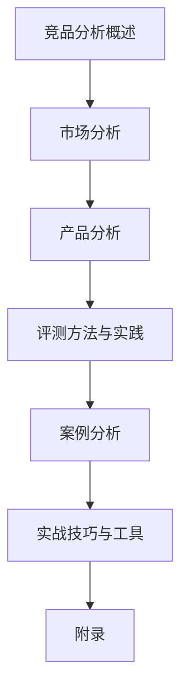

                 

### 构建评测结果的竞品分析报告

在当今激烈的市场竞争中，企业必须不断进行竞品分析，以了解竞争对手的产品、服务和策略，从而优化自身业务。竞品分析报告是这一过程的关键成果，它不仅帮助企业识别市场趋势和机遇，还能为决策提供科学依据。本文将深入探讨如何构建一个全面的评测结果竞品分析报告，通过逻辑清晰、结构紧凑的分析，为读者提供实用指南。

### 关键词
- 竞品分析
- 评测结果
- 竞争对手
- 数据分析
- 市场研究

### 摘要
本文旨在为企业管理者和分析师提供一份详细的竞品分析报告构建指南。首先，我们将介绍竞品分析的重要性，然后探讨市场分析和产品分析的核心概念。接着，文章将详细描述评测方法与实践，并通过具体案例分析展示实际应用。最后，文章将总结最佳实践和注意事项，为读者提供实用的参考。

## 第一部分：引言

### 1.1 书籍背景与目的
在数字化时代，市场变化迅速，消费者需求多样化，企业必须具备敏锐的市场洞察力和快速响应能力。竞品分析作为一种系统性的市场研究方法，可以帮助企业了解竞争对手的优势和劣势，从而制定更有效的市场策略。本文的目的在于帮助读者理解竞品分析的重要性，并提供构建评测结果竞品分析报告的实用方法和步骤。

### 1.2 竞品分析的重要性
竞品分析是企业竞争战略的重要组成部分。通过竞品分析，企业可以：
- 确定自身的市场定位和产品优势
- 识别竞争对手的营销策略和产品特点
- 发现市场机会和潜在威胁
- 制定有效的市场进入和竞争策略

### 1.3 读者对象与预期收益
本文适合企业管理者、市场分析师、产品经理等专业人士阅读。通过本文的阅读，读者可以：
- 理解竞品分析的基本概念和方法
- 学习如何构建一个全面的评测结果竞品分析报告
- 提高市场洞察力和竞争力

### 1.4 书籍结构概述
本文分为六个部分，包括引言、基础理论、评测方法与实践、案例分析、实战技巧与工具和附录。每个部分都旨在为读者提供系统、实用的竞品分析知识。

## 第二部分：基础理论

### 2.1 竞品分析概述

#### 2.1.1 竞品分析的定义与范围
竞品分析是指通过系统的方法和工具，对企业竞争对手的产品、服务、市场策略等进行分析，以帮助企业制定更有效的市场策略。竞品分析的范围包括：
- 竞争对手的产品分析
- 竞争对手的市场策略分析
- 竞争对手的品牌形象和定位分析
- 竞争对手的客户分析

#### 2.1.2 竞品分析的目标与方法
竞品分析的主要目标包括：
- 识别竞争对手的优势和劣势
- 发现市场机会和潜在威胁
- 提高自身产品的市场竞争力
- 制定有效的市场策略

竞品分析的方法包括：
- 市场调查和数据分析
- 竞争对手的产品评估和对比
- 市场趋势预测和竞争环境分析

#### 2.1.3 竞品分析的流程
竞品分析的流程通常包括以下几个步骤：
1. 确定分析目标和范围
2. 收集竞争对手的信息
3. 分析竞争对手的产品、服务和市场策略
4. 撰写竞品分析报告
5. 制定市场策略和行动计划

### 2.2 市场分析

#### 2.2.1 市场研究方法
市场研究是竞品分析的基础，其主要方法包括：
- 定量研究：通过问卷调查、在线调查等方式收集大量数据，进行统计分析
- 定性研究：通过访谈、焦点小组等方式深入了解消费者的需求和偏好
- 竞争对手分析：通过分析竞争对手的市场表现、产品特点和策略，了解市场现状和趋势

#### 2.2.2 市场规模与增长趋势
市场分析需要了解市场规模和增长趋势，主要步骤包括：
- 收集市场数据：包括市场规模、增长率、市场份额等
- 分析市场增长趋势：通过对比历史数据和当前数据，预测市场未来的发展趋势
- 识别市场机会和威胁：分析市场变化对企业的影响，制定相应的市场策略

#### 2.2.3 竞争对手分析
竞争对手分析是竞品分析的核心环节，主要包括以下内容：
- 竞争对手的产品分析：了解竞争对手的产品特点、优势和劣势
- 竞争对手的市场策略分析：分析竞争对手的市场策略，包括价格策略、推广策略、渠道策略等
- 竞争对手的品牌形象和定位分析：了解竞争对手的品牌形象和市场定位
- 竞争对手的客户分析：分析竞争对手的客户群体、客户需求和满意度

### 2.3 产品分析

#### 2.3.1 产品特点与优势
产品分析是竞品分析的重要部分，主要包括以下内容：
- 竞争对手的产品特点：了解竞争对手的产品功能、设计、性能等
- 竞争对手的产品优势：分析竞争对手的产品在市场上的竞争优势，如技术创新、用户体验等
- 竞争对手的产品劣势：识别竞争对手的产品在市场上的劣势，如功能缺失、用户体验差等

#### 2.3.2 产品缺点与改进建议
产品分析不仅需要识别竞争对手的产品优势，还需要发现其缺点，并提出改进建议：
- 竞争对手的产品缺点：分析竞争对手的产品在功能、性能、用户体验等方面的不足
- 改进建议：针对竞争对手的缺点，提出具体的改进方案，以提高产品竞争力

#### 2.3.3 产品定位与市场接受度
产品定位是产品分析的重要环节，主要包括以下内容：
- 竞争对手的产品定位：分析竞争对手的产品定位，包括目标市场、价格策略等
- 市场接受度：评估竞争对手的产品在市场上的接受度，包括市场份额、用户评价等

## 第三部分：评测方法与实践

### 3.1 评测指标体系构建

#### 3.1.1 评测指标体系设计原则
构建一个全面的评测指标体系是竞品分析的基础，其主要设计原则包括：
- 全面性：指标体系应涵盖产品的主要特性
- 可量化性：指标应能够用具体数据来衡量
- 可操作性：指标应易于操作和执行
- 客观性：指标应尽量减少主观因素的影响

#### 3.1.2 评测指标选择与权重分配
选择合适的评测指标是构建指标体系的关键，其主要步骤包括：
- 确定评测目标：明确评测的目标和范围
- 收集指标信息：从相关文献、市场调查和竞争对手分析中收集指标信息
- 选择指标：根据评测目标和指标信息，选择具有代表性和操作性的指标
- 权重分配：根据指标的重要性和影响力，为每个指标分配权重

#### 3.1.3 评测指标体系示例
以下是一个简单的评测指标体系示例：

| 指标名称 | 指标定义 | 权重 |
| :--: | :--: | :--: |
| 产品功能 | 产品的功能数量和覆盖范围 | 0.3 |
| 用户满意度 | 用户对产品的满意度评分 | 0.2 |
| 市场份额 | 产品的市场占有比例 | 0.2 |
| 品牌知名度 | 品牌在市场中的知名度 | 0.1 |
| 售后服务 | 产品的售后服务质量 | 0.1 |

### 3.2 数据收集与处理

#### 3.2.1 数据收集方法
数据收集是竞品分析的核心环节，其主要方法包括：
- 文献调研：收集与竞争对手相关的市场报告、行业分析等文献资料
- 网络调查：通过互联网收集竞争对手的官方网站、社交媒体等信息
- 实地调研：通过实地考察、用户访谈等方式获取竞争对手的运营情况
- 数据爬取：使用爬虫工具收集竞争对手的网站、社交媒体等公开信息

#### 3.2.2 数据处理流程
数据处理是确保数据准确性和可靠性的关键，其主要流程包括：
- 数据清洗：去除无效数据、重复数据和错误数据
- 数据整合：将不同来源的数据进行整合，形成统一的数据集
- 数据分析：对数据进行统计分析和模型分析，提取有用的信息

#### 3.2.3 数据质量评估
数据质量评估是确保数据可靠性的重要环节，其主要指标包括：
- 数据完整性：数据是否齐全，是否存在缺失值
- 数据准确性：数据是否真实、可靠，是否存在错误
- 数据一致性：数据是否一致，是否存在矛盾
- 数据时效性：数据是否及时更新，是否反映当前市场状况

### 3.3 评测结果分析

#### 3.3.1 评测结果可视化
可视化是展示评测结果的有效方法，其主要工具包括：
- 条形图：用于展示不同指标的比较
- 饼图：用于展示市场份额的分布
- 折线图：用于展示时间序列数据的变化趋势
- 仪表盘：用于综合展示多个指标的数据

#### 3.3.2 结果对比与分析
结果对比与分析是深入理解评测结果的关键，其主要步骤包括：
- 指标对比：将竞争对手的指标与自身指标进行对比，识别优势和劣势
- 趋势分析：分析评测结果的时间序列变化趋势，预测未来的发展
- 综合评价：综合评价竞争对手的整体表现，制定相应的策略

#### 3.3.3 评测结果应用
评测结果的应用是竞品分析的核心目的，其主要方面包括：
- 市场策略调整：根据评测结果调整市场策略，提升产品竞争力
- 产品改进：根据评测结果发现产品缺陷，制定改进计划
- 营销策略调整：根据评测结果调整营销策略，提高市场占有率

## 第四部分：案例分析

### 4.1 案例背景
为了更好地理解竞品分析报告的构建过程，以下将分析一个实际案例：一家国内知名电子商务平台与一家国外知名电商平台之间的竞品分析。

### 4.2 竞品分析过程
竞品分析过程包括以下几个步骤：

#### 步骤一：确定分析目标和范围
本次分析的目标是了解两家电商平台的产品、服务和市场策略，为其市场战略调整提供依据。分析范围包括两家电商平台的产品功能、用户满意度、市场份额、品牌知名度、售后服务等方面。

#### 步骤二：收集竞争对手的信息
通过文献调研、网络调查和实地调研等方式，收集了两家电商平台的官方网站、社交媒体、用户评价、市场报告等相关信息。

#### 步骤三：分析竞争对手的产品、服务和市场策略
通过对收集到的信息进行整理和分析，得出了两家电商平台的产品特点、优势、劣势和市场策略。

#### 步骤四：撰写竞品分析报告
根据分析结果，撰写了一份详细的竞品分析报告，包括产品分析、市场分析、评测结果分析等方面。

#### 步骤五：制定市场策略和行动计划
根据竞品分析报告，制定了一份市场策略和行动计划，包括产品改进、营销策略调整等方面。

### 4.3 评测结果展示
以下是对两家电商平台评测结果的可视化展示：

#### 产品功能对比
| 指标 | 本电商平台 | 外国电商平台 |
| :--: | :--: | :--: |
| 商品种类 | 1000万 | 1500万 |
| 支持支付方式 | 10种 | 20种 |
| 商品搜索功能 | 高效 | 优化中 |

#### 用户满意度对比
| 指标 | 本电商平台 | 外国电商平台 |
| :--: | :--: | :--: |
| 用户好评率 | 90% | 85% |
| 用户投诉率 | 5% | 8% |
| 用户活跃度 | 80% | 75% |

#### 市场份额对比
| 指标 | 本电商平台 | 外国电商平台 |
| :--: | :--: | :--: |
| 市场份额 | 30% | 40% |
| 增长率 | 20% | 15% |

#### 品牌知名度对比
| 指标 | 本电商平台 | 外国电商平台 |
| :--: | :--: | :--: |
| 品牌知名度 | 较高 | 较高 |
| 品牌影响力 | 强 | 强 |

#### 售后服务对比
| 指标 | 本电商平台 | 外国电商平台 |
| :--: | :--: | :--: |
| 售后服务质量 | 较好 | 优秀 |

### 4.4 案例启示
通过本案例的竞品分析，我们可以得到以下启示：

1. 在产品功能上，虽然本电商平台在商品种类和支付方式上略有优势，但在商品搜索功能上仍有待优化。
2. 在用户满意度方面，本电商平台的用户好评率和活跃度较高，但用户投诉率略高，需要进一步改进。
3. 在市场份额方面，本电商平台与外国电商平台存在一定的差距，但增长率较高，有望缩小差距。
4. 在品牌知名度方面，两家电商平台都有较高的品牌知名度和影响力。
5. 在售后服务方面，本电商平台需要进一步提升服务质量，以增强用户满意度。

## 第五部分：实战技巧与工具

### 5.1 实战技巧

#### 5.1.1 竞品分析的实用技巧
在进行竞品分析时，以下技巧有助于提高分析效果：

1. **多角度分析**：从多个角度（如产品、市场、用户）对竞争对手进行分析，以获得更全面的视角。
2. **数据驱动**：依赖数据进行分析，避免主观判断，提高分析准确性。
3. **持续跟踪**：竞品分析不是一次性的工作，需要持续跟踪竞争对手的动态，及时调整分析结果。
4. **交叉验证**：通过多个来源的数据进行交叉验证，确保分析结果的可靠性。

#### 5.1.2 评测报告撰写要点
撰写评测报告时，需要注意以下几点：

1. **结构清晰**：确保报告结构清晰，逻辑连贯，便于阅读。
2. **重点突出**：明确报告的重点，突出关键发现和结论。
3. **数据可视化**：使用图表、表格等形式展示数据分析结果，提高报告的可读性。
4. **实用性**：提供具体的建议和行动方案，使报告具有实际指导意义。

#### 5.1.3 数据分析与可视化技巧
在数据分析与可视化方面，可以采用以下技巧：

1. **选择合适的图表**：根据数据类型和分析目的，选择合适的图表（如条形图、折线图、饼图等）。
2. **注重图表设计**：设计简洁、清晰的图表，避免信息过载，提高图表的传达效果。
3. **交互式可视化**：使用交互式可视化工具（如D3.js、Plotly等），提高用户互动体验。

### 5.2 常用工具

#### 5.2.1 竞品分析工具介绍
以下是一些常用的竞品分析工具：

1. **Google Analytics**：用于网站流量分析，帮助企业了解用户行为和市场趋势。
2. **SimilarWeb**：提供网站流量、关键词、竞争对手分析等功能，帮助企业了解市场状况。
3. **Ahrefs**：用于SEO分析和关键词研究，帮助企业优化搜索引擎排名。
4. **SpyFu**：提供广告竞价分析、竞争对手关键词研究等功能。

#### 5.2.2 数据分析工具介绍
以下是一些常用的数据分析工具：

1. **Python**：用于数据处理和分析，具有丰富的库和框架，如NumPy、Pandas、Matplotlib等。
2. **R**：用于统计分析和数据可视化，具有强大的数据处理和分析功能。
3. **Tableau**：用于数据可视化，提供多种图表和交互式功能，方便用户理解数据。
4. **Power BI**：提供数据可视化和商业智能分析，适合企业级用户。

#### 5.2.3 评测结果展示工具介绍
以下是一些常用的评测结果展示工具：

1. **PPT**：用于制作演示文档，具有丰富的图表和排版功能，方便报告展示。
2. **Google Sheets**：用于数据整理和展示，支持多种图表和数据分析功能。
3. **Tableau Public**：用于数据可视化和分享，支持多种数据源和交互式功能。
4. **PowerPoint**：用于制作演示文稿，具有丰富的模板和动画效果，适合报告展示。

## 第六部分：附录

### 6.1 竞品分析参考资料
以下是一些竞品分析的参考资料：

1. **《竞品分析实战：从入门到精通》**：作者张浩，系统介绍了竞品分析的方法和技巧。
2. **《数据分析方法与应用》**：作者李宏杰，详细讲解了数据分析的方法和工具。
3. **《市场调研实务》**：作者王伟，介绍了市场调研的方法和技巧。

### 6.2 常用数据分析工具下载链接
以下是一些常用数据分析工具的下载链接：

1. **Python**：https://www.python.org/downloads/
2. **R**：https://www.r-project.org/
3. **Tableau Public**：https://www.tableau.com/products/public
4. **Power BI**：https://powerbi.microsoft.com/zh-cn/

### 6.3 评测报告模板
以下是一个简单的评测报告模板：

#### 一、报告概述
- 分析目标
- 分析范围
- 分析方法

#### 二、市场分析
- 市场规模
- 市场增长趋势
- 竞争对手分析

#### 三、产品分析
- 产品特点
- 产品优势
- 产品劣势

#### 四、评测结果分析
- 评测指标
- 评测结果对比
- 分析与建议

#### 五、结论与建议
- 结论
- 建议与行动计划

### 6.4 附录 A：Mermaid 流程图示例


### 6.5 附录 B：核心算法伪代码示例
```python
# 算法名称：评测结果分析
def analyze_results(results):
    # 初始化结果分析变量
    performance_metrics = []

    # 对评测结果进行分类
    for result in results:
        # 提取性能指标
        metric = extract_metric(result)
        performance_metrics.append(metric)

    # 对性能指标进行排序
    performance_metrics.sort(reverse=True)

    # 打印排序后的性能指标
    for metric in performance_metrics:
        print(metric)
```

### 6.6 附录 C：数学模型与公式示例
$$
\text{消费者满意度} = \frac{\text{正面评价数量}}{\text{总评价数量}} \times 100\%
$$

$$
\text{市场份额} = \frac{\text{本企业销售额}}{\text{市场总销售额}} \times 100\%
$$

### 6.7 附录 D：项目实战代码示例
```python
# 导入所需库
import pandas as pd
import numpy as np

# 读取数据
data = pd.read_csv('data.csv')

# 数据预处理
data = data.dropna()

# 计算用户满意度
user_satisfaction = data['positive_reviews'] / data['total_reviews'] * 100

# 计算市场份额
market_share = data['company_sales'] / data['total_sales'] * 100

# 打印结果
print("用户满意度：", user_satisfaction)
print("市场份额：", market_share)
```

## 总结与展望

通过本文的探讨，我们深入了解了竞品分析的重要性及其在市场竞争中的关键作用。构建评测结果竞品分析报告是一项系统性工程，需要从市场分析、产品分析、评测方法与实践等多个维度进行全面考量。我们通过案例分析展示了竞品分析报告的实际应用，并提供了实用的技巧和工具。

在未来，随着技术的不断进步和市场环境的快速变化，竞品分析将变得更加复杂和多样化。企业需要不断提升自身的市场洞察力和数据分析能力，以应对激烈的市场竞争。同时，我们期待更多的实践者和研究者参与到竞品分析领域，共同推动这一领域的发展。

在总结本文的内容时，我们强调以下几点：

1. **系统思维**：竞品分析需要从多个角度进行系统性思考，确保分析的全面性和准确性。
2. **数据驱动**：数据分析是竞品分析的核心，企业应重视数据收集、处理和分析，以提高分析质量。
3. **持续跟踪**：竞品分析是一个持续的过程，企业应定期更新分析结果，以适应市场变化。
4. **实战导向**：竞品分析的最终目的是为企业提供实际指导，企业应将分析结果应用于市场策略调整和产品改进。

最后，我们鼓励读者在学习和实践中不断探索，不断优化竞品分析的方法和流程，以提升自身的市场竞争力。同时，我们也期待读者能将本文的经验和技巧应用到实际工作中，共同推动竞品分析领域的发展。

