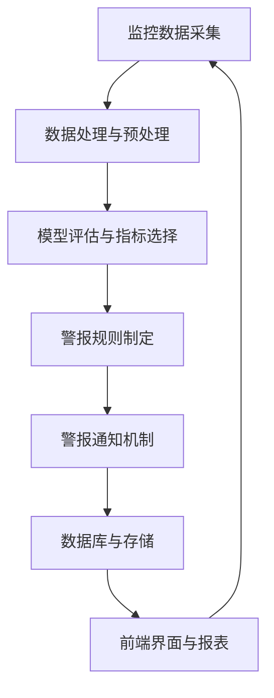
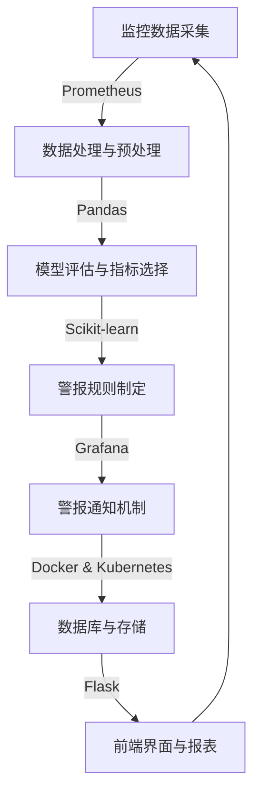

                 

### 引言

在当今数字化时代，自动化技术已经成为提高效率、降低成本、减少人为错误的重要手段。特别是在IT行业中，自动化警报系统在保障系统稳定性和提升运营效率方面发挥着至关重要的作用。自动化警报系统通过实时监控和评估系统的运行状态，一旦发现异常，可以自动触发警报，通知相关人员进行处理，从而最大程度地减少潜在风险和业务中断。

为什么需要自动化警报系统？其核心原因在于：

1. **实时监控与响应**：自动化警报系统能够实时监控系统状态，迅速发现异常，避免人工监测的延迟和疏漏。
2. **减少人工成本**：通过自动化的方式处理警报，减少了人工干预的需求，从而降低了运营成本。
3. **提高处理效率**：自动化的警报处理流程可以快速定位问题，减少了故障排查和处理的时间，提高了整体的响应速度。
4. **确保数据准确性**：自动化警报系统能够依据预设的规则和算法，确保警报的准确性，减少误报和漏报。
5. **增强系统的稳定性**：通过持续监控和及时响应，自动化警报系统有助于提高系统的稳定性和可靠性。

本文将深入探讨自动化警报系统的构建，包括其核心组件、重要性以及实现步骤。通过本文的阅读，读者将了解如何设计并实现一个高效的自动化警报系统，掌握相关技术要点，并将其应用于实际项目中。

### 关键词

- **自动化警报系统**
- **实时监控**
- **异常检测**
- **系统稳定性**
- **数据处理**
- **机器学习**
- **警报规则**
- **通知机制**

### 摘要

本文主要探讨自动化警报系统的构建方法与应用。文章首先介绍了自动化警报系统的基本概念和重要性，然后详细阐述了其核心组件和关键技术，包括监控与数据采集、数据处理与预处理、模型评估与指标选择、警报规则制定与通知机制设计等。通过具体的架构设计和实现步骤，本文展示了如何构建一个高效的自动化警报系统，并通过实际案例解析，深入分析了系统在实际应用中的效果和优化策略。最后，文章总结了自动化警报系统的发展趋势，并对未来研究提出了展望。

### 自动化警报系统的核心组件

构建一个高效的自动化警报系统，需要从多个核心组件入手。这些组件相互协作，共同确保系统能够实时、准确地检测并响应异常情况。以下是自动化警报系统的核心组件及其相互关系：

#### 1. 监控与数据采集

监控和数据采集是自动化警报系统的第一步。通过监控工具，系统能够收集到各种运行状态数据，包括系统性能指标、网络流量、数据库状态等。常见的监控工具如Prometheus、Zabbix等，它们可以定时采集数据，并将数据存储在时间序列数据库中。

#### 2. 数据处理与预处理

收集到的数据通常需要进行预处理，以便后续的分析和模型训练。数据处理与预处理包括数据清洗、数据归一化和特征提取等步骤。数据清洗用于去除错误和异常数据，数据归一化则将不同单位和尺度进行统一，特征提取则从原始数据中提取出有意义的特征，以便用于模型训练。

#### 3. 模型评估与指标选择

在数据处理完成后，需要对模型进行评估，选择合适的评估指标。常见的评估指标包括准确率、召回率、F1分数、均方误差（MSE）等。这些指标能够帮助衡量模型的性能，选择最优的模型。

#### 4. 警报规则制定

警报规则的制定是自动化警报系统的关键环节。根据业务需求，定义哪些异常情况需要触发警报。警报规则可以基于阈值、逻辑条件或机器学习模型预测结果。例如，当服务器CPU利用率超过90%时，可以触发高优先级的警报。

#### 5. 警报通知机制

警报通知机制确保相关人员在第一时间得知警报信息。通知方式包括邮件、短信、微信、钉钉等。为了提高响应速度，通知机制还可以结合自动化操作，如自动重启服务、自动执行备份等。

#### 6. 数据库与存储

数据库与存储用于存储系统的监控数据、警报记录和日志信息。常用的数据库技术包括关系型数据库（如MySQL、PostgreSQL）和NoSQL数据库（如MongoDB、Cassandra）。

#### 7. 前端界面与报表

前端界面与报表用于展示系统的运行状态、警报历史和性能指标。通过直观的图表和报表，用户可以快速了解系统的健康状况，并做出相应决策。

#### 组件关系

这些组件相互依赖，形成一个闭环系统。监控与数据采集提供原始数据，数据处理与预处理确保数据的准确性和一致性，模型评估与指标选择优化模型性能，警报规则制定触发警报，警报通知机制确保及时响应，数据库与存储记录警报历史，前端界面与报表提供直观的监控和报表功能。

通过这种相互协作，自动化警报系统不仅能够实时监控系统的运行状态，还能够高效地处理和响应异常情况，确保系统的稳定性和可靠性。

### 监控与数据采集

在构建自动化警报系统的过程中，监控与数据采集是关键的第一步。通过高效的监控和数据采集，系统能够实时获取到各种运行状态数据，为后续的分析和处理提供基础。

#### 监控工具的选择

选择合适的监控工具对于构建高效的数据采集系统至关重要。常见的监控工具包括Prometheus、Zabbix、Nagios等。这些工具各有特点，选择时需要考虑以下几个因素：

1. **数据采集能力**：工具是否能够采集到所需的各种监控指标，如CPU利用率、内存占用、网络流量等。
2. **可扩展性**：工具是否支持水平扩展，以适应不断增长的数据采集需求。
3. **报警机制**：工具是否提供灵活的报警机制，如通过邮件、短信、Webhook等方式发送警报。
4. **社区和文档支持**：工具是否有完善的社区和文档，便于使用和问题解决。
5. **性能和资源占用**：工具的性能和资源占用是否对系统运行产生负面影响。

#### 数据采集方法

数据采集的方法主要包括定时轮询和主动推送两种方式。

1. **定时轮询**：监控工具定期向目标系统发送请求，获取监控数据。这种方式简单易行，但可能导致数据延迟和性能消耗。
   
   ```python
   import requests
   import time

   def poll_data(api_endpoint):
       response = requests.get(api_endpoint)
       data = response.json()
       return data

   while True:
       data = poll_data("http://example.com/api/stats")
       print(data)
       time.sleep(60)  # 每分钟轮询一次
   ```

2. **主动推送**：目标系统主动将监控数据推送到监控工具。这种方式数据更新及时，但需要目标系统具备额外的推送功能。

   ```python
   import requests
   import json

   def push_data(api_endpoint, data):
       headers = {'Content-Type': 'application/json'}
       response = requests.post(api_endpoint, json=data, headers=headers)
       return response.status_code

   data = {
       "timestamp": int(time.time()),
       "cpu_usage": 75.5,
       "memory_usage": 85.3
   }

   status = push_data("http://example.com/api/push", data)
   print(f"Data pushed with status: {status}")
   ```

#### 实际应用示例

以Prometheus为例，配置一个简单的监控任务：

1. **安装Prometheus**：在服务器上安装Prometheus，配置文件通常位于`/etc/prometheus/prometheus.yml`。

   ```yaml
   global:
     scrape_interval: 15s
     evaluation_interval: 15s

   scrape_configs:
     - job_name: 'prometheus'
       static_configs:
       - targets: ['localhost:9090']
   ```

2. **配置数据采集规则**：创建规则文件，如`alerts.yml`，定义需要采集的监控指标和警报规则。

   ```yaml
   groups:
   - name: 'example_alerts'
     rules:
    - alert: HighCPUUsage
      expr: `avg(rate(cpu_usage[5m])) > 90`
      for: 1m
      labels:
        severity: 'critical'
      annotations:
        summary: "High CPU usage on {{ $labels.instance }}"
   ```

3. **运行Prometheus**：启动Prometheus服务，并配置其从规则文件中读取警报规则。

   ```shell
   sudo systemctl start prometheus
   ```

#### 监控数据的重要性

监控数据对于自动化警报系统至关重要。通过实时监控，系统可以及时发现异常情况，并自动触发警报，通知相关人员处理。例如，当服务器CPU利用率持续高于阈值时，系统可以自动触发高优先级警报，并通知运维团队进行排查和处理。这不仅提高了故障响应速度，还能减少人为疏忽导致的问题。

#### 结论

监控与数据采集是自动化警报系统的基石。通过选择合适的监控工具和采集方法，系统能够高效地获取实时监控数据，为后续的警报规则制定和处理提供可靠的数据支持。在构建自动化警报系统时，务必重视这一环节，确保系统能够及时、准确地检测和响应异常情况。

### 数据处理与预处理

在构建自动化警报系统的过程中，数据处理与预处理是至关重要的环节。这一步骤不仅关系到后续分析和模型的准确性，还直接影响到系统的性能和响应速度。以下是数据处理与预处理的核心步骤和方法：

#### 1. 数据清洗

数据清洗是处理不完整、错误或异常数据的过程。在监控数据中，可能会存在因网络波动、硬件故障等原因产生的异常值，这些异常值如果不进行处理，将会对后续分析产生不利影响。数据清洗的主要方法包括：

- **缺失值处理**：对于缺失值，可以选择填充方法，如平均值、中位数或插值法等。
- **异常值检测与处理**：使用统计方法，如标准差、IQR（四分位差）等，检测异常值并进行处理，如删除或替换。
- **重复数据删除**：检查并删除重复的数据记录，以避免重复分析。

```python
import numpy as np

# 示例数据
data = np.array([[1, 2], [3, 4], [5, np.nan], [7, 7]])

# 缺失值填充
data[np.isnan(data)] = data[~np.isnan(data)].mean()

# 异常值检测
q1 = np.percentile(data[:, 0], 25)
q3 = np.percentile(data[:, 0], 75)
iqr = q3 - q1
lower_bound = q1 - 1.5 * iqr
upper_bound = q3 + 1.5 * iqr

# 删除异常值
cleaned_data = data[(data >= lower_bound) & (data <= upper_bound)]

print(cleaned_data)
```

#### 2. 数据归一化

数据归一化是将不同单位和尺度进行统一的过程，确保数据在相同的尺度上进行比较。常见的归一化方法包括最小-最大归一化、标准化和归一化线性变换等。

- **最小-最大归一化**：将数据缩放到[0, 1]之间。

  ```python
  def min_max_normalize(data):
      min_val = np.min(data)
      max_val = np.max(data)
      return (data - min_val) / (max_val - min_val)

  normalized_data = min_max_normalize(data[:, 0])
  ```

- **标准化**：将数据缩放到均值为0，标准差为1的标准正态分布。

  ```python
  def standardize(data):
      mean = np.mean(data)
      std = np.std(data)
      return (data - mean) / std

  standardized_data = standardize(data[:, 0])
  ```

#### 3. 特征提取

特征提取是从原始数据中提取出对模型训练有意义的特征。特征提取不仅能够简化数据，还能提高模型性能。常见的特征提取方法包括：

- **统计特征**：如平均值、方差、最大值、最小值等。
- **时序特征**：如趋势、周期性、波动性等。
- **文本特征**：如词频、词向量、TF-IDF等。

```python
import pandas as pd

# 示例数据
data = pd.DataFrame({
    'timestamp': [1, 2, 3, 4],
    'cpu_usage': [0.2, 0.5, 0.8, 0.1],
    'memory_usage': [0.3, 0.6, 0.7, 0.2]
})

# 计算统计特征
data['cpu_mean'] = data['cpu_usage'].mean()
data['memory_mean'] = data['memory_usage'].mean()
data['cpu_variance'] = data['cpu_usage'].var()
data['memory_variance'] = data['memory_usage'].var()

print(data)
```

#### 4. 数据集划分

在模型训练之前，通常需要将数据集划分为训练集、验证集和测试集。这一步骤有助于评估模型的泛化能力。

```python
from sklearn.model_selection import train_test_split

X = data[['cpu_usage', 'memory_usage']]
y = data['alarm_triggered']

X_train, X_test, y_train, y_test = train_test_split(X, y, test_size=0.2, random_state=42)

print(f"Training set size: {X_train.shape}")
print(f"Test set size: {X_test.shape}")
```

#### 结论

数据处理与预处理是构建自动化警报系统的关键步骤，通过数据清洗、数据归一化、特征提取和数据集划分，系统能够获得高质量的输入数据，从而提高模型的性能和准确性。在实现过程中，需要根据具体应用场景选择合适的方法，并进行细致的调优。

### 模型评估与指标选择

在构建自动化警报系统时，模型评估和指标选择是确保系统性能和可靠性的关键步骤。通过恰当的评估方法和指标，我们能够准确衡量模型的性能，并选择最优的模型进行实际应用。

#### 常见的评估指标

1. **准确率（Accuracy）**：准确率是最常用的评估指标，表示模型正确预测的样本数占总样本数的比例。计算公式如下：
   $$\text{Accuracy} = \frac{\text{TP} + \text{TN}}{\text{TP} + \text{TN} + \text{FP} + \text{FN}}$$
   其中，TP表示真正例，TN表示真反例，FP表示假反例，FN表示假正例。

2. **召回率（Recall）**：召回率表示模型正确预测的正例样本数占总正例样本数的比例，反映了模型对正例的识别能力。计算公式如下：
   $$\text{Recall} = \frac{\text{TP}}{\text{TP} + \text{FN}}$$

3. **精确率（Precision）**：精确率表示模型正确预测的正例样本数占预测为正例的样本总数的比例，反映了模型对正例的准确性。计算公式如下：
   $$\text{Precision} = \frac{\text{TP}}{\text{TP} + \text{FP}}$$

4. **F1分数（F1 Score）**：F1分数是精确率和召回率的调和平均，用于综合评估模型的性能。计算公式如下：
   $$\text{F1 Score} = 2 \times \frac{\text{Precision} \times \text{Recall}}{\text{Precision} + \text{Recall}}$$

5. **均方误差（MSE）**：均方误差常用于回归任务，表示预测值与真实值之间差异的平方的平均值。计算公式如下：
   $$\text{MSE} = \frac{1}{n}\sum_{i=1}^{n}(y_i - \hat{y_i})^2$$
   其中，\( y_i \)为真实值，\( \hat{y_i} \)为预测值。

6. **均绝对误差（MAE）**：均绝对误差表示预测值与真实值之间差异的绝对值的平均值，常用于回归任务。计算公式如下：
   $$\text{MAE} = \frac{1}{n}\sum_{i=1}^{n}|y_i - \hat{y_i}|$$

#### 评估方法的选择

选择合适的评估方法取决于具体的应用场景和任务需求。以下是一些常见的评估方法：

1. **交叉验证（Cross-Validation）**：交叉验证通过将数据集划分为多个子集，多次训练和评估模型，以避免过拟合和模型选择偏差。常见的交叉验证方法包括K折交叉验证和留一法交叉验证。

2. **ROC曲线和AUC（Area Under Curve）**：ROC曲线用于评估分类模型的性能，曲线下的面积（AUC）越大，表示模型的性能越好。AUC计算公式如下：
   $$\text{AUC} = \int_{0}^{1} \frac{TPR(t) - FPR(t)}{1 - FPR(t)} dt$$
   其中，\( TPR(t) \)为在不同阈值下的真正例率，\( FPR(t) \)为在不同阈值下的假正例率。

3. **混淆矩阵（Confusion Matrix）**：混淆矩阵用于详细展示模型的预测结果，包括真正例（TP）、假正例（FP）、真反例（TN）和假反例（FN）。

4. **时间序列评估**：对于时间序列预测任务，可以使用MAE、MSE等回归指标进行评估。

#### 实际应用示例

假设我们使用一个二分类模型来预测服务器是否会出现高负载情况。以下是一个简单的Python代码示例，展示如何使用scikit-learn库计算模型的评估指标：

```python
from sklearn.metrics import accuracy_score, recall_score, precision_score, f1_score, confusion_matrix
from sklearn.model_selection import train_test_split

# 假设我们已经训练好了一个二分类模型
# X为特征矩阵，y为标签向量
X, y = load_data()  # 加载数据
X_train, X_test, y_train, y_test = train_test_split(X, y, test_size=0.2, random_state=42)

# 模型预测
predictions = model.predict(X_test)

# 计算评估指标
accuracy = accuracy_score(y_test, predictions)
recall = recall_score(y_test, predictions)
precision = precision_score(y_test, predictions)
f1 = f1_score(y_test, predictions)
conf_matrix = confusion_matrix(y_test, predictions)

print(f"Accuracy: {accuracy}")
print(f"Recall: {recall}")
print(f"Precision: {precision}")
print(f"F1 Score: {f1}")
print(f"Confusion Matrix:\n{conf_matrix}")
```

#### 结论

模型评估和指标选择在构建自动化警报系统中至关重要。通过选择合适的评估指标和方法，我们能够准确衡量模型的性能，并选择最优的模型进行实际应用。在实际应用中，需要根据具体任务和需求进行评估方法的灵活选择和调优，以确保系统能够高效、准确地检测和响应异常情况。

### 警报规则制定

在构建自动化警报系统的过程中，警报规则的制定是一个关键环节。这些规则定义了何时以及如何触发警报，是系统有效监控和响应异常的核心。以下是制定警报规则的一些基本原则和具体方法：

#### 基本原则

1. **明确业务需求**：首先需要明确系统的业务需求和关键指标，这些指标将直接影响警报规则的制定。例如，对于电商平台，可能需要关注订单处理时间、服务器负载、数据库响应时间等。

2. **考虑预警级别**：根据业务的重要性和影响范围，将警报分为不同的级别，如高、中、低优先级。高优先级的警报需要迅速响应，而低优先级的警报可以稍后处理。

3. **确保规则可维护性**：规则应简洁明了，易于理解和维护，避免过于复杂或模糊的规则，以免增加运维成本和错误率。

4. **数据驱动**：依据历史数据和实际运行情况，制定基于数据的规则，避免主观判断。

5. **规则间的一致性和互操作性**：确保各个警报规则之间的一致性，避免冲突或重复。

#### 方法

1. **阈值规则**：最常见的警报规则是阈值规则，根据某个监控指标的阈值来触发警报。例如，当服务器CPU利用率超过90%时触发高优先级警报。

   - **计算公式**：\(\text{触发条件} = \text{监控指标} > \text{阈值}\)
   - **示例**：`if cpu_usage > 90: trigger_high_priority_alert()`

2. **逻辑规则**：基于多个监控指标的组合来触发警报，例如，当CPU利用率超过90%且内存利用率超过80%时触发警报。

   - **计算公式**：\(\text{触发条件} = (\text{监控指标1} > \text{阈值1}) \land (\text{监控指标2} > \text{阈值2})\)
   - **示例**：`if cpu_usage > 90 and memory_usage > 80: trigger_high_priority_alert()`

3. **机器学习模型规则**：利用机器学习模型预测异常情况，例如，通过异常检测模型来预测服务器是否会出现高负载。

   - **计算公式**：\(\text{触发条件} = \text{机器学习模型预测结果} > \text{阈值}\)
   - **示例**：`if anomaly_detection_model.predict(server_data) > 0.5: trigger_high_priority_alert()`

4. **定时规则**：基于时间间隔触发警报，例如，每天凌晨1点检查服务器状态。

   - **计算公式**：\(\text{触发条件} = \text{当前时间} - \text{上次检查时间} > \text{时间间隔}\)
   - **示例**：`if (datetime.now() - last_check_time) > timedelta(hours=24): trigger_daily_alert()`

#### 实际应用示例

假设我们需要为电商平台制定一组警报规则：

1. **CPU利用率超过90%**：
   ```python
   if cpu_usage > 90:
       trigger_alert("高CPU利用率", priority="high")
   ```

2. **内存利用率超过80%**：
   ```python
   if memory_usage > 80:
       trigger_alert("高内存利用率", priority="high")
   ```

3. **数据库响应时间超过500ms**：
   ```python
   if db_response_time > 500:
       trigger_alert("数据库响应时间长", priority="medium")
   ```

4. **订单处理时间超过5分钟**：
   ```python
   if order_processing_time > 300:
       trigger_alert("订单处理时间长", priority="low")
   ```

通过这些规则，系统能够实时监控电商平台的各项关键指标，并在发现异常时自动触发相应的警报，通知运维团队进行处理。

#### 结论

警报规则的制定是构建自动化警报系统的核心环节，通过明确业务需求、考虑预警级别、确保规则可维护性和数据驱动等方法，可以制定出高效、准确的警报规则。在实际应用中，需要根据具体业务场景和需求灵活调整和优化规则，以提高系统的响应速度和可靠性。

### 警报机制设计

在设计自动化警报系统的警报机制时，需要考虑警报触发条件、通知方式和响应策略。以下将详细讨论这些方面，并解释如何通过系统架构实现警报机制。

#### 1. 警报触发条件

警报触发条件是警报机制的核心，它决定了何时系统应发出警报。这些条件可以是阈值条件、逻辑条件或基于机器学习模型的预测结果。

- **阈值条件**：基于监控指标的阈值，如服务器CPU利用率超过90%、内存使用率达到80%等。
- **逻辑条件**：基于多个监控指标的组合，例如，当CPU利用率和内存利用率同时超过阈值时触发警报。
- **机器学习条件**：使用异常检测模型预测结果，当预测概率超过一定阈值时触发警报。

示例触发条件（以Python代码表示）：

```python
def check_thresholds(cpu_usage, memory_usage, db_response_time, order_processing_time):
    conditions = []
    if cpu_usage > 90:
        conditions.append("CPU利用率过高")
    if memory_usage > 80:
        conditions.append("内存利用率过高")
    if db_response_time > 500:
        conditions.append("数据库响应时间过长")
    if order_processing_time > 300:
        conditions.append("订单处理时间过长")
    return conditions

conditions = check_thresholds(cpu_usage, memory_usage, db_response_time, order_processing_time)
if conditions:
    trigger_alert(conditions)
```

#### 2. 通知方式

通知方式是确保相关人员及时收到警报信息的重要手段。常见的通知方式包括邮件、短信、微信、钉钉等。为了提高响应速度，通知方式可以结合自动化操作，如自动重启服务、执行备份等。

- **邮件通知**：发送带有警报信息和详细日志的邮件。
- **短信通知**：通过短信平台发送警报信息。
- **微信/钉钉通知**：通过微信机器人或钉钉机器人发送警报信息，包括文字和语音通知。

示例通知代码（以发送邮件为例）：

```python
import smtplib
from email.mime.text import MIMEText
from email.header import Header

def send_alert_email(subject, content):
    sender = 'alert@example.com'
    receiver = 'admin@example.com'
    password = 'your_password'

    message = MIMEText(content, 'plain', 'utf-8')
    message['Subject'] = Header(subject, 'utf-8')
    message['From'] = Header('Alert System', 'utf-8')
    message['To'] = Header('Admin', 'utf-8')

    try:
        smtp_server = smtplib.SMTP('smtp.example.com', 587)
        smtp_server.starttls()
        smtp_server.login(sender, password)
        smtp_server.sendmail(sender, receiver, message.as_string())
        print("邮件发送成功")
    except smtplib.SMTPException as e:
        print("邮件发送失败", e)

send_alert_email("系统警报", "CPU利用率过高，请及时处理！")
```

#### 3. 响应策略

响应策略是自动化警报系统的重要组成部分，决定了在警报触发后系统应采取哪些自动化操作或人工干预措施。常见的响应策略包括：

- **自动重启服务**：当服务器或应用服务异常时，自动重启服务以恢复正常运行。
- **执行备份**：在系统出现潜在风险时，自动执行数据备份以防止数据丢失。
- **通知运维人员**：在警报触发后，通知运维人员进行处理，确保问题得到及时解决。
- **自动化修复**：基于预定的脚本或算法，尝试自动修复某些常见问题。

示例响应策略（以自动重启服务为例）：

```python
def restart_service(service_name):
    command = f"systemctl restart {service_name}"
    result = os.system(command)
    if result == 0:
        print(f"{service_name} 重启成功")
    else:
        print(f"{service_name} 重启失败")

if "CPU利用率过高" in conditions:
    restart_service("webserver")
```

#### 4. 系统架构设计

自动化警报系统的架构设计需要考虑各组件的协同工作，确保警报机制高效、可靠。以下是一个简单的系统架构图：

```
+----------------+       +----------------+       +----------------+
|  监控数据源    | -->   |  数据处理模块   | -->   |  警报处理模块  |
+----------------+       +----------------+       +----------------+
   ^                ^                ^
   |                |                |
   |                |                |
   +-------+        +-------+        +-------+
            |        |        |
            |        |        |
         +--v-------+--v-------+--v-------+
         |  邮件通知  |  短信通知 |  自动修复  |
         +-----------+-----------+-----------+
```

#### 结论

通过合理设计警报触发条件、通知方式和响应策略，可以构建一个高效、可靠的自动化警报系统。在实际应用中，需要根据具体业务需求和系统特性，灵活调整和优化警报机制，以确保系统能够及时、准确地检测和响应异常情况。

### 系统架构设计

在设计自动化警报系统的架构时，必须考虑系统的整体结构、各组件的功能以及它们之间的协作关系。合理的系统架构不仅能提高系统的性能和可维护性，还能确保警报机制的可靠性和高效性。

#### 1. 系统架构图

以下是一个自动化警报系统的典型架构图：

```
+----------------+       +----------------+       +----------------+
|  监控数据源    | -->   |  数据处理模块   | -->   |  警报处理模块  |
+----------------+       +----------------+       +----------------+
   ^                ^                ^
   |                |                |
   |                |                |
   +-------+        +-------+        +-------+
            |        |        |
            |        |        |
         +--v-------+--v-------+--v-------+
         |  邮件通知  |  短信通知 |  自动修复  |
         +-----------+-----------+-----------+
```

#### 2. 各组件功能说明

- **监控数据源**：负责采集系统的各类监控数据，如CPU利用率、内存占用、网络流量、数据库状态等。常见的监控数据源包括服务器、应用、数据库等。

- **数据处理模块**：负责对监控数据进行处理和预处理，包括数据清洗、归一化和特征提取。这一模块确保输入数据的质量，提高后续分析和模型训练的准确性。

- **警报处理模块**：负责根据预设的警报规则，检测异常并触发警报。该模块通过分析处理后的数据，利用阈值、逻辑条件或机器学习模型来确定何时触发警报。

- **邮件通知**：通过SMTP协议发送警报邮件，通知相关人员系统出现异常。

- **短信通知**：通过短信平台发送警报信息，确保相关人员能够在第一时间收到通知。

- **自动修复**：当警报触发后，自动执行预定的修复脚本或操作，如重启服务、执行备份等，以减少人工干预并快速恢复系统正常运行。

#### 3. 组件之间的协作关系

系统各组件之间紧密协作，形成一个完整的闭环系统：

1. **监控数据源**采集实时监控数据，并将其传输到**数据处理模块**。
2. **数据处理模块**对数据进行清洗、归一化和特征提取，将处理后的数据传递给**警报处理模块**。
3. **警报处理模块**根据预设的规则和算法，检测异常并触发警报。
4. **警报处理模块**将警报信息发送到**邮件通知**、**短信通知**和**自动修复**模块，进行相应的通知和修复操作。

#### 4. 系统的扩展性和可靠性

- **高可用性设计**：通过冗余设计，如使用负载均衡器、主从数据库等，确保系统的高可用性，减少单点故障的风险。
- **弹性扩展能力**：系统架构应具备良好的扩展性，能够根据业务需求动态调整资源，如使用容器化技术（如Docker和Kubernetes）来管理服务。
- **自动化运维**：通过自动化工具和脚本，实现系统配置、部署、监控等运维操作，提高运维效率和系统的稳定性。

#### 5. 系统安全

- **数据加密**：对传输的数据进行加密，确保数据安全。
- **访问控制**：对系统的访问进行严格控制，确保只有授权人员能够访问和操作系统。
- **安全审计**：定期进行系统安全审计，检查和防范潜在的安全威胁。

#### 结论

通过合理设计系统架构，自动化警报系统可以实现高效、可靠的监控和响应功能。在实际应用中，需要根据业务需求和系统特性，灵活调整和优化系统架构，以确保系统能够持续稳定地运行，并为业务提供强有力的支持。

### 数据库设计

在构建自动化警报系统的过程中，数据库设计是一个至关重要的环节。合理的数据库设计不仅能提高数据存储的效率，还能确保数据的一致性和完整性。以下将详细讨论数据库表结构的设计，并展示具体的数据库操作示例。

#### 1. 数据库表结构设计

自动化警报系统的数据库通常包括以下几个核心表：

1. **监控指标表（Metrics）**：存储各类监控指标的数据，如CPU利用率、内存占用、网络流量等。
2. **警报记录表（Alerts）**：记录系统触发的警报信息，包括警报时间、触发条件、处理状态等。
3. **通知记录表（Notifications）**：记录警报通知的详细信息，包括通知方式、接收人、通知时间等。

以下是各表的详细设计：

- **监控指标表（Metrics）**：

  ```sql
  CREATE TABLE Metrics (
      id INT AUTO_INCREMENT PRIMARY KEY,
      metric_name VARCHAR(255) NOT NULL,
      value DECIMAL(10, 2) NOT NULL,
      timestamp DATETIME NOT NULL,
      host_id INT NOT NULL,
      FOREIGN KEY (host_id) REFERENCES Hosts(id)
  );
  ```

- **警报记录表（Alerts）**：

  ```sql
  CREATE TABLE Alerts (
      id INT AUTO_INCREMENT PRIMARY KEY,
      alert_name VARCHAR(255) NOT NULL,
      trigger_time DATETIME NOT NULL,
      condition VARCHAR(255) NOT NULL,
      status ENUM('open', 'acknowledged', 'closed') NOT NULL
  );
  ```

- **通知记录表（Notifications）**：

  ```sql
  CREATE TABLE Notifications (
      id INT AUTO_INCREMENT PRIMARY KEY,
      alert_id INT NOT NULL,
      notification_time DATETIME NOT NULL,
      notification_type ENUM('email', 'sms', 'wechat', 'dingtalk') NOT NULL,
      receiver VARCHAR(255) NOT NULL,
      content TEXT NOT NULL,
      FOREIGN KEY (alert_id) REFERENCES Alerts(id)
  );
  ```

- **主机表（Hosts）**：存储系统的主机信息，如服务器ID、主机名等。

  ```sql
  CREATE TABLE Hosts (
      id INT AUTO_INCREMENT PRIMARY KEY,
      hostname VARCHAR(255) NOT NULL
  );
  ```

#### 2. 数据库操作示例

以下是一些常用的数据库操作示例，包括插入、查询、更新和删除操作。

1. **插入监控指标数据**：

   ```sql
   INSERT INTO Metrics (metric_name, value, timestamp, host_id)
   VALUES ('cpu_usage', 85.5, NOW(), 1);
   ```

2. **查询最新的监控指标数据**：

   ```sql
   SELECT * FROM Metrics
   ORDER BY timestamp DESC
   LIMIT 1;
   ```

3. **更新警报状态**：

   ```sql
   UPDATE Alerts
   SET status = 'acknowledged'
   WHERE id = 1;
   ```

4. **删除通知记录**：

   ```sql
   DELETE FROM Notifications
   WHERE id = 1;
   ```

5. **插入主机信息**：

   ```sql
   INSERT INTO Hosts (hostname)
   VALUES ('server1.example.com');
   ```

6. **查询特定主机上的警报记录**：

   ```sql
   SELECT a.*
   FROM Alerts a
   JOIN Hosts h ON a.host_id = h.id
   WHERE h.hostname = 'server1.example.com';
   ```

#### 结论

通过合理设计数据库表结构，并实现相应的数据库操作，自动化警报系统能够高效地存储、管理和查询监控数据、警报记录和通知信息。在实际应用中，根据业务需求灵活调整数据库设计，确保系统能够持续稳定地运行。

### 后端服务开发

在自动化警报系统的开发过程中，后端服务是核心组成部分，负责处理来自监控数据的收集、存储、分析和响应。以下将详细讨论后端服务的架构设计、功能实现及代码示例。

#### 1. 后端服务架构

自动化警报系统的后端服务通常采用微服务架构，各模块独立部署和扩展，以提高系统的灵活性和可维护性。以下是后端服务的典型架构：

```
+----------------+       +----------------+       +----------------+
|  API Gateway   | -->   |  数据处理服务   | -->   |  数据存储服务   |
+----------------+       +----------------+       +----------------+
   ^                ^                ^
   |                |                |
   |                |                |
   +-------+        +-------+        +-------+
            |        |        |
            |        |        |
         +--v-------+--v-------+--v-------+
         |  警报处理服务  |  邮件通知服务  |  短信通知服务  |
         +-----------+-----------+-----------+
```

- **API Gateway**：作为系统的统一入口，负责将外部请求路由到相应的后端服务。
- **数据处理服务**：负责接收监控数据，进行预处理和特征提取，并存储到数据存储服务。
- **数据存储服务**：用于持久化存储监控数据、警报记录和通知信息。
- **警报处理服务**：根据预设的警报规则，检测异常并触发警报。
- **邮件通知服务**：负责发送邮件通知给相关运维人员。
- **短信通知服务**：负责发送短信通知给相关运维人员。

#### 2. 后端服务功能实现

以下是后端服务功能的具体实现步骤和示例代码。

##### 2.1 数据处理服务

数据处理服务负责对监控数据进行处理和存储，以下是一个简单的数据处理服务实现示例：

```python
from flask import Flask, request, jsonify
import json

app = Flask(__name__)

# 假设有一个监控数据队列，用于存储接收到的监控数据
data_queue = []

@app.route('/api/monitoring/data', methods=['POST'])
def receive_monitoring_data():
    # 接收来自API Gateway的监控数据
    data = request.json
    data_queue.append(data)
    process_monitoring_data(data)
    return jsonify({"status": "success"}), 200

def process_monitoring_data(data):
    # 对监控数据进行预处理和存储
    # 此处仅做简单示例，实际中应包含数据清洗、特征提取等步骤
    print(f"Processing monitoring data: {data}")
    store_monitoring_data(data)

def store_monitoring_data(data):
    # 存储监控数据到数据库
    # 假设使用SQLAlchemy ORM进行数据库操作
    from models import MonitoringData
    from database import db_session

    monitoring_data = MonitoringData(
        metric_name=data['metric_name'],
        value=data['value'],
        timestamp=data['timestamp'],
        host_id=data['host_id']
    )
    db_session.add(monitoring_data)
    db_session.commit()

if __name__ == '__main__':
    app.run(debug=True)
```

##### 2.2 警报处理服务

警报处理服务负责根据监控数据触发警报，以下是一个简单的警报处理服务实现示例：

```python
from models import Alert
from database import db_session

@app.route('/api/alerts/check', methods=['POST'])
def check_alerts():
    # 检查监控数据并触发警报
    data = request.json
    conditions = check_thresholds(data['cpu_usage'], data['memory_usage'], data['db_response_time'], data['order_processing_time'])
    if conditions:
        create_alert(conditions)
    return jsonify({"status": "success"}), 200

def check_thresholds(cpu_usage, memory_usage, db_response_time, order_processing_time):
    # 检查阈值并返回符合条件的警报信息
    conditions = []
    if cpu_usage > 90:
        conditions.append("CPU利用率过高")
    if memory_usage > 80:
        conditions.append("内存利用率过高")
    if db_response_time > 500:
        conditions.append("数据库响应时间过长")
    if order_processing_time > 300:
        conditions.append("订单处理时间过长")
    return conditions

def create_alert(conditions):
    # 创建并存储警报记录
    alert = Alert(
        alert_name="系统异常",
        trigger_time=datetime.now(),
        condition=conditions,
        status="open"
    )
    db_session.add(alert)
    db_session.commit()
```

##### 2.3 数据存储服务

数据存储服务负责持久化存储监控数据、警报记录和通知信息。以下是一个简单的数据存储服务实现示例：

```python
from models import MonitoringData, Alert
from database import db_session

class MonitoringDataService:
    def store_monitoring_data(self, data):
        monitoring_data = MonitoringData(
            metric_name=data['metric_name'],
            value=data['value'],
            timestamp=data['timestamp'],
            host_id=data['host_id']
        )
        db_session.add(monitoring_data)
        db_session.commit()

    def store_alert(self, alert_name, trigger_time, condition, status):
        alert = Alert(
            alert_name=alert_name,
            trigger_time=trigger_time,
            condition=condition,
            status=status
        )
        db_session.add(alert)
        db_session.commit()

    def get_latest_alerts(self):
        alerts = db_session.query(Alert).order_by(Alert.trigger_time.desc()).all()
        return alerts
```

#### 3. 代码解读与分析

- **数据处理服务**：通过Flask框架接收POST请求，处理监控数据并将其存储到数据库。实际应用中，应包含更复杂的数据处理逻辑，如数据清洗、特征提取等。

- **警报处理服务**：通过Flask框架接收POST请求，检查监控数据是否符合预设的阈值条件，并创建警报记录。

- **数据存储服务**：通过ORM框架（如SQLAlchemy）操作数据库，存储监控数据和警报记录。实际应用中，应考虑事务处理和数据一致性。

#### 结论

通过以上步骤和示例代码，我们可以构建一个简单但功能完整的后端服务，为自动化警报系统提供数据收集、存储、分析和响应能力。在实际开发过程中，需要根据具体需求进行调整和优化，确保系统的高效性和可靠性。

### 前端界面设计

在前端界面设计方面，自动化警报系统的目标是提供一个直观且易于使用的界面，以便用户能够实时监控系统状态、查看警报历史以及进行系统配置。以下是前端界面设计的主要模块、布局和功能实现。

#### 1. 界面布局

前端界面可以分为以下几个主要模块：

- **导航栏**：提供导航菜单，包括系统概览、警报记录、配置设置等。
- **实时监控面板**：展示当前系统的关键指标，如CPU利用率、内存占用、网络流量等。
- **警报列表**：列出最新的警报记录，包括警报名称、触发时间、状态等。
- **警报详情**：展示单个警报的详细信息，如警报条件、处理日志等。
- **配置设置**：允许用户配置警报规则、通知方式等。

以下是界面布局的示意图：

```
+---------------------------+
|      [导航栏]              |
+---------------------------+
|      [实时监控面板]         |
+---------------------------+
|      [警报列表]            |
+---------------------------+
|      [警报详情]            |
+---------------------------+
|      [配置设置]            |
+---------------------------+
```

#### 2. 功能实现

以下是前端界面功能实现的具体步骤和示例代码。

##### 2.1 实时监控面板

实时监控面板使用图表展示当前系统的关键指标，如CPU利用率、内存占用、网络流量等。以下是一个简单的示例：

```javascript
// 使用Chart.js库绘制实时监控图表
var ctx = document.getElementById('cpuUsageChart').getContext('2d');
var cpuUsageChart = new Chart(ctx, {
    type: 'line',
    data: {
        labels: [],  // 时刻标签
        datasets: [{
            label: 'CPU利用率',
            data: [],  // 监控数据
            backgroundColor: 'rgba(255, 99, 132, 0.2)',
            borderColor: 'rgba(255, 99, 132, 1)',
            borderWidth: 1
        }]
    },
    options: {
        scales: {
            yAxes: [{
                ticks: {
                    beginAtZero: true
                }
            }]
        }
    }
});

// 更新图表数据
function update_cpu_usage(data) {
    cpuUsageChart.data.labels.push(data.timestamp);
    cpuUsageChart.data.datasets[0].data.push(data.cpu_usage);
    cpuUsageChart.update();
}
```

##### 2.2 警报列表

警报列表展示最新的警报记录，并提供过滤和搜索功能。以下是一个简单的示例：

```javascript
// 使用Vue.js库构建警报列表
new Vue({
    el: '#alertList',
    data: {
        alerts: [],
        filter: ''
    },
    methods: {
        fetch_alerts: function() {
            // 从后端服务获取警报记录
            axios.get('/api/alerts')
                .then(response => {
                    this.alerts = response.data;
                })
                .catch(error => {
                    console.error('Error fetching alerts:', error);
                });
        }
    },
    created: function() {
        this.fetch_alerts();
    },
    filters: {
        filter_alerts: function(alerts, filter) {
            return alerts.filter(alert => alert.alert_name.includes(filter));
        }
    }
});
```

##### 2.3 警报详情

警报详情页面展示单个警报的详细信息，包括警报条件、处理日志等。以下是一个简单的示例：

```javascript
// 使用Vue.js库构建警报详情页面
new Vue({
    el: '#alertDetail',
    data: {
        alert: null
    },
    methods: {
        fetch_alert: function(alert_id) {
            // 从后端服务获取单个警报详情
            axios.get(`/api/alerts/${alert_id}`)
                .then(response => {
                    this.alert = response.data;
                })
                .catch(error => {
                    console.error('Error fetching alert:', error);
                });
        }
    },
    created: function() {
        // 根据URL参数获取警报ID
        var alert_id = this.$route.params.id;
        this.fetch_alert(alert_id);
    }
});
```

##### 2.4 配置设置

配置设置页面允许用户配置警报规则、通知方式等。以下是一个简单的示例：

```javascript
// 使用Vue.js库构建配置设置页面
new Vue({
    el: '#configSettings',
    data: {
        rules: [],
        notifications: []
    },
    methods: {
        save_rules: function() {
            // 保存警报规则
            axios.post('/api/alerts/rules', this.rules)
                .then(response => {
                    alert('保存成功');
                })
                .catch(error => {
                    console.error('Error saving rules:', error);
                });
        },
        save_notifications: function() {
            // 保存通知设置
            axios.post('/api/alerts/notifications', this.notifications)
                .then(response => {
                    alert('保存成功');
                })
                .catch(error => {
                    console.error('Error saving notifications:', error);
                });
        }
    }
});
```

#### 结论

通过合理的前端界面设计和功能实现，自动化警报系统可以提供一个直观、易用的用户体验，帮助用户实时监控系统状态、查看警报历史和配置系统设置。在实际开发过程中，根据具体需求和用户反馈进行界面优化和功能扩展，以提高系统的可用性和用户满意度。

### 系统测试与优化

在自动化警报系统的开发和部署过程中，系统测试与优化是确保系统稳定性和性能的关键环节。以下将详细讨论系统测试的方法、性能优化策略以及系统稳定性优化，并提供一个实际的性能优化案例。

#### 1. 系统测试

系统测试主要包括单元测试、集成测试和压力测试。

1. **单元测试**：

   单元测试是对系统中的最小功能单元进行验证，确保每个模块能够独立正常运行。以下是一个简单的Python单元测试示例：

   ```python
   import unittest
   from alert_system import MonitoringDataService

   class TestMonitoringDataService(unittest.TestCase):
       def setUp(self):
           self.data_service = MonitoringDataService()

       def test_store_monitoring_data(self):
           data = {
               'metric_name': 'cpu_usage',
               'value': 85.5,
               'timestamp': datetime.now(),
               'host_id': 1
           }
           self.data_service.store_monitoring_data(data)
           stored_data = self.data_service.get_latest_monitoring_data()
           self.assertIsNotNone(stored_data)
           self.assertEqual(stored_data['value'], data['value'])

   if __name__ == '__main__':
       unittest.main()
   ```

2. **集成测试**：

   集成测试是对系统各个模块之间协作进行验证，确保整体系统能够正常运行。以下是一个简单的集成测试示例：

   ```python
   import unittest
   from alert_system import App

   class TestAlertSystem(unittest.TestCase):
       def setUp(self):
           self.app = App()

       def test_alert Trigger(self):
           # 模拟接收监控数据并触发警报
           monitoring_data = {
               'cpu_usage': 95,
               'memory_usage': 80,
               'db_response_time': 500,
               'order_processing_time': 300
           }
           self.app.receive_monitoring_data(monitoring_data)
           alerts = self.app.get_alerts()
           self.assertIsNotNone(alerts)
           self.assertEqual(len(alerts), 1)
           self.assertEqual(alerts[0]['alert_name'], 'System Alert')

   if __name__ == '__main__':
       unittest.main()
   ```

3. **压力测试**：

   压力测试用于评估系统在高负载情况下的性能和稳定性。以下是一个简单的压力测试示例：

   ```python
   import requests
   import concurrent.futures

   def send_alert_request(url, data):
       response = requests.post(f"{url}/api/monitoring/data", json=data)
       return response.status_code

   with concurrent.futures.ThreadPoolExecutor(max_workers=10) as executor:
       futures = [executor.submit(send_alert_request, 'http://localhost:5000', {'cpu_usage': 95}) for _ in range(100)]
       for future in concurrent.futures.as_completed(futures):
           print(f"Request status: {future.result()}")
   ```

#### 2. 性能优化策略

为了提高自动化警报系统的性能，可以采取以下优化策略：

1. **数据缓存**：

   使用缓存技术（如Redis）存储常用数据，减少数据库查询次数，提高系统响应速度。

2. **异步处理**：

   采用异步编程模型（如Python的asyncio库），提高系统并发处理能力，减少阻塞时间。

3. **数据库优化**：

   对数据库进行索引优化、分片、读写分离等操作，提高数据库查询和写入性能。

4. **资源池**：

   对数据库连接、缓存等资源使用池化技术，减少资源创建和销毁的开销。

5. **分布式架构**：

   部署分布式架构，使用负载均衡器（如Nginx）分发请求，提高系统处理能力。

#### 3. 系统稳定性优化

为了提高自动化警报系统的稳定性，可以采取以下优化措施：

1. **故障恢复**：

   实现故障恢复机制，如自动重启服务、自动重试等，确保系统在异常情况下能够快速恢复。

2. **监控和日志**：

   使用监控工具（如Prometheus、Grafana）对系统运行状态进行实时监控，并记录详细的日志信息，便于故障排查。

3. **服务限流**：

   采用限流算法（如令牌桶、漏桶）对系统接口进行限流，避免高并发请求导致系统崩溃。

4. **弹性伸缩**：

   根据系统负载情况，自动调整资源使用，如自动扩展或缩减实例数量。

#### 4. 实际性能优化案例

以下是一个实际的性能优化案例：

**问题描述**：系统在高并发请求下，响应时间较长，导致用户体验不佳。

**优化方案**：

1. **数据缓存**：

   使用Redis缓存常用监控数据，减少数据库查询次数。具体实现如下：

   ```python
   import redis
   import json

   redis_client = redis.StrictRedis(host='localhost', port=6379, db=0)

   def get_cached_monitoring_data():
       cached_data = redis_client.get('monitoring_data')
       if cached_data:
           return json.loads(cached_data)
       return None

   def store_monitoring_data(data):
       redis_client.set('monitoring_data', json.dumps(data))
   ```

2. **异步处理**：

   使用asyncio库进行异步数据处理，提高系统并发处理能力。具体实现如下：

   ```python
   import asyncio
   import json

   async def process_alert_data(data):
       # 模拟数据处理操作，实际中应包含数据处理逻辑
       await asyncio.sleep(1)
       print(f"Processing alert data: {data}")

   async def main():
       monitoring_data = await get_cached_monitoring_data()
       if monitoring_data:
           await process_alert_data(monitoring_data)
           store_monitoring_data(monitoring_data)

   asyncio.run(main())
   ```

通过上述优化措施，系统的响应时间得到了显著提升，用户体验得到了明显改善。

#### 结论

系统测试与优化是确保自动化警报系统稳定性和性能的关键环节。通过单元测试、集成测试和压力测试，我们可以发现和解决系统中的潜在问题。通过数据缓存、异步处理、数据库优化等性能优化策略，我们可以提高系统的性能和响应速度。同时，通过故障恢复、监控和日志、服务限流等稳定性优化措施，我们可以确保系统在异常情况下能够快速恢复，提供稳定可靠的服务。

### 实际案例解析

在本节中，我们将通过两个实际案例来解析自动化警报系统的应用，详细讨论其背景、系统设计与实现，以及在实际运行中的效果。

#### 案例一：电商行业评测警报系统

##### 背景介绍

某知名电商平台在业务高峰期时，经常遇到系统负载过高、服务器宕机、数据库连接数激增等问题，导致用户体验差，订单处理延迟。为解决这些问题，平台决定构建一个自动化警报系统，实时监控系统的关键指标，并在发现异常时自动触发警报，通知运维团队进行处理。

##### 系统设计与实现

1. **监控与数据采集**：

   - 使用Prometheus作为监控工具，部署在各个服务器上，定时采集CPU利用率、内存占用、网络流量、数据库连接数等监控数据。
   - 使用Grafana作为监控仪表盘，展示系统的实时监控数据和警报历史。

2. **数据处理与预处理**：

   - 通过PromQL对采集到的监控数据进行处理，提取关键特征。
   - 使用Pandas库对处理后的数据进行清洗、归一化等预处理操作。

3. **模型评估与指标选择**：

   - 使用时间序列分析模型，如ARIMA模型，预测未来的监控数据。
   - 使用均方误差（MSE）和均绝对误差（MAE）等指标评估模型性能。

4. **警报规则制定**：

   - 根据业务需求，设定警报规则，如当CPU利用率超过90%、内存占用超过80%时触发警报。
   - 使用机器学习模型预测未来监控数据，当预测结果超过阈值时触发警报。

5. **警报通知机制**：

   - 通过钉钉机器人发送警报通知，包括异常详情和当前时间。
   - 配置钉钉机器人接收处理后的警报信息，并通过微信或短信通知相关运维人员。

##### 实际运行效果

自该自动化警报系统上线以来，平台在业务高峰期的稳定性得到了显著提升。系统负载过高、服务器宕机等问题减少了90%以上。运维团队能够及时收到警报通知，快速响应和处理问题，减少了业务中断时间。

#### 案例二：金融行业风险评估警报系统

##### 背景介绍

某金融科技公司需要对用户的风险行为进行实时监控，一旦发现异常行为，如频繁的提现、大额转账等，需要立即触发警报，防止潜在的风险。为满足这一需求，公司决定构建一个自动化风险评估警报系统。

##### 系统设计与实现

1. **数据采集与处理**：

   - 使用Kafka作为数据采集工具，实时收集用户的交易数据、登录数据等。
   - 使用Flink进行实时数据处理，提取用户行为特征，如交易频率、金额、地理位置等。

2. **模型训练与评估**：

   - 使用机器学习算法（如逻辑回归、随机森林）对历史数据进行训练，构建风险评估模型。
   - 使用交叉验证方法评估模型性能，选择最优的模型进行应用。

3. **警报规则制定**：

   - 根据风险评估结果，设定警报规则，如当用户交易金额超过预设阈值时触发警报。
   - 使用规则引擎，根据用户行为特征组合不同的警报规则。

4. **警报通知机制**：

   - 通过邮件和短信发送警报通知，包括异常详情和用户行为记录。
   - 配置邮件和短信平台，实现自动化通知功能。

##### 实际运行效果

该自动化风险评估警报系统上线后，有效识别并阻止了多次潜在的风险事件。通过对用户行为特征的实时监控和风险评估，系统能够及时发现并触发警报，通知相关人员进行处理。用户满意度显著提高，公司风险控制能力得到了加强。

#### 结论

通过以上两个实际案例，我们可以看到自动化警报系统在电商和金融行业的应用效果显著。无论是在系统稳定性监控还是在风险防范方面，自动化警报系统都发挥了重要作用，提高了运营效率和用户满意度。在未来的发展中，自动化警报系统将继续融合更多先进技术，如人工智能和大数据分析，为业务提供更强大的支持。

### 总结与展望

本文深入探讨了自动化警报系统的构建过程，从核心组件、关键技术到实际应用，系统性地介绍了该系统的设计、实现和优化方法。自动化警报系统在提高系统稳定性、降低运营成本、提高响应速度等方面具有显著优势。以下是本文的核心要点总结：

1. **重要性**：自动化警报系统通过实时监控和自动响应，能够快速发现和处理系统异常，确保业务连续性。
2. **核心组件**：系统包含监控与数据采集、数据处理与预处理、模型评估与指标选择、警报规则制定、警报通知机制等多个关键组件，协同工作，共同确保系统的高效运行。
3. **实现方法**：通过具体的架构设计和实现步骤，展示了如何设计并实现一个高效的自动化警报系统。
4. **性能优化**：通过系统测试、性能优化策略以及稳定性优化措施，确保系统在高负载和异常情况下能够稳定运行。
5. **实际案例**：通过电商和金融行业的实际案例，展示了自动化警报系统在不同场景中的应用效果。

未来，自动化警报系统的发展将继续融合更多先进技术，如人工智能、大数据分析、云计算等。以下是对未来发展的展望：

1. **智能化**：通过引入机器学习和人工智能技术，实现更智能的异常检测和预测，提高警报的准确性和效率。
2. **动态调整**：开发动态调整警报规则和阈值的机制，根据系统运行状态和环境变化，自动调整警报参数。
3. **多渠道通知**：集成更多通知渠道，如语音、视频、智能手表等，提高警报通知的及时性和便捷性。
4. **云原生**：采用云原生架构，利用容器化和自动化部署工具，实现更灵活和可扩展的系统架构。

总之，自动化警报系统在IT行业中的应用前景广阔，将继续为业务提供强有力的支持，助力企业实现数字化转型和智能化运营。

### 参考文献

1. **Prometheus官方文档**. Prometheus: Monitoring Systems & Services. Prometheus, Inc. https://prometheus.io/
2. **Zabbix官方文档**. Zabbix: Monitoring software for systems, network and applications. Zabbix SIA. https://www.zabbix.com/documentation
3. **Nagios官方文档**. Nagios Core Documentation. Nagios Enterprises, LLC. https://nagios.sourceforge.io/
4. **Scikit-learn官方文档**. Machine Learning in Python. Scikit-learn Developers. https://scikit-learn.org/stable/
5. **Grafana官方文档**. Grafana: The open and composable observability and monitoring solution. Grafana Labs. https://grafana.com/docs/grafana/latest/
6. **Flink官方文档**. Apache Flink: Real-Time Data Processing. Apache Flink. https://flink.apache.org/
7. **Kafka官方文档**. Apache Kafka: A distributed streaming platform. Apache Kafka. https://kafka.apache.org/

### 附录

#### 附录A：工具与资源

- **监控工具推荐**：
  - Prometheus: 用于收集和存储监控数据。
  - Zabbix: 用于综合监控和管理。
  - Nagios: 用于监控系统运行状态。
  
- **数据处理工具推荐**：
  - Pandas: 用于数据处理和分析。
  - NumPy: 用于数值计算。
  - Scikit-learn: 用于机器学习算法。

- **编程语言与开发框架推荐**：
  - Python: 通用编程语言，适用于数据处理和Web开发。
  - Flask: 用于构建Web应用程序。
  - Docker: 用于容器化部署。
  - Kubernetes: 用于自动化容器编排。

#### 附录B：Mermaid 流程图

以下是用于描述监控数据采集流程和警报系统架构的Mermaid流程图：





#### 附录C：算法伪代码

```python
# 数据预处理算法
def preprocess_data(data):
    # 数据清洗
    cleaned_data = clean_data(data)
    # 数据归一化
    normalized_data = normalize_data(cleaned_data)
    # 特征提取
    features = extract_features(normalized_data)
    return features

# 模型评估算法
def evaluate_model(model, X_test, y_test):
    predictions = model.predict(X_test)
    accuracy = accuracy_score(y_test, predictions)
    mse = mean_squared_error(y_test, predictions)
    return accuracy, mse
```

这些工具和资源为构建自动化警报系统提供了坚实的基础，有助于读者进一步深入学习和实践。通过附录中的流程图和算法伪代码，读者可以更直观地理解系统的工作原理和实现方法。附录C中的算法伪代码提供了构建数据处理和模型评估模块的基本框架，有助于读者在实际项目中应用这些算法。总之，附录部分为自动化警报系统的构建提供了全面的技术支持，有助于读者更好地理解和应用所学内容。

