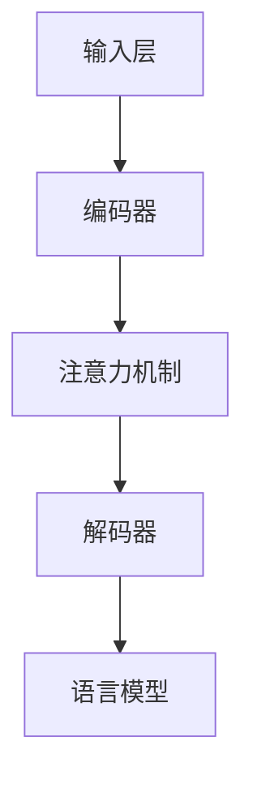

                 

## 文章标题

# 构建高可用的LLM应用系统

> 关键词：高可用性，语言模型（LLM），系统设计，负载均衡，数据存储，安全性

## 摘要

本文将深入探讨如何构建高可用的语言模型（LLM）应用系统。随着人工智能技术的迅速发展，LLM已经成为各种应用场景中的核心组件，从自然语言处理到智能客服，再到自动驾驶，LLM的应用无处不在。然而，高可用性是确保LLM应用系统稳定运行、提供可靠服务的关键因素。本文将详细解析高可用性的原理和重要性，探讨LLM的基本概念和工作原理，以及高可用性设计原则、负载均衡与流量管理、数据存储与备份、监控与报警、安全性保障等方面的实战经验和最佳实践。通过本文的阅读，读者将获得构建高可用LLM应用系统的全面知识和实用技巧。

## 目录大纲

### 第一部分：高可用性概述

#### 第1章：高可用性原理与重要性

##### 1.1 高可用性的定义

##### 1.2 高可用性与可靠性

##### 1.3 高可用性的关键指标

#### 第2章：LLM基础

##### 2.1 LLM的基本概念

##### 2.2 LLM的工作原理

##### 2.3 LLM的架构

#### 第3章：高可用性设计原则

##### 3.1 系统拆分与分布式架构

##### 3.2 冗余与容错设计

##### 3.3 弹性与动态伸缩

### 第二部分：高可用性实施策略

#### 第4章：负载均衡与流量管理

##### 4.1 负载均衡策略

##### 4.2 流量管理技巧

##### 4.3 实践案例

#### 第5章：数据存储与备份

##### 5.1 数据存储技术

##### 5.2 数据备份策略

##### 5.3 数据恢复与故障转移

#### 第6章：监控与报警

##### 6.1 监控体系设计

##### 6.2 常见报警策略

##### 6.3 实时监控与日志分析

#### 第7章：安全性保障

##### 7.1 安全防护措施

##### 7.2 访问控制与权限管理

##### 7.3 安全漏洞与应对策略

### 第三部分：实战案例分析

#### 第8章：实战案例分析

##### 8.1 案例一：某电商平台的LLM应用系统

##### 8.2 案例二：某金融公司的LLM应用系统

##### 8.3 案例总结与启示

### 附录

#### 附录A：高可用性工具与资源

#### 附录B：数学模型与公式

#### 附录C：代码示例与解读

#### 附录D：参考文献与推荐阅读材料

## 第一部分：高可用性概述

### 第1章：高可用性原理与重要性

#### 1.1 高可用性的定义

高可用性（High Availability，简称HA）是指系统在发生故障或异常情况下，能够在最短时间内恢复到正常状态，继续提供服务的能力。高可用性的核心目标是确保系统长时间无故障运行，为用户提供持续、稳定的服务。

一个高可用的系统应该具备以下特点：

- **高可靠性**：系统在正常运行期间，尽可能减少故障发生的概率。
- **快速恢复**：在发生故障时，系统能够迅速恢复正常运行，减少服务中断时间。
- **弹性伸缩**：系统能够根据负载变化，动态调整资源分配，确保在高负载情况下依然能够稳定运行。

#### 1.2 高可用性与可靠性

高可用性和可靠性是两个密切相关的概念，但它们之间也存在差异。可靠性通常指系统在规定时间内无故障运行的概率，而高可用性更关注系统在发生故障时的恢复能力。

**可靠性**：系统在给定时间段内保持无故障运行的概率，通常用平均无故障时间（Mean Time Between Failures，MTBF）来衡量。MTBF越长，系统的可靠性越高。

**高可用性**：在发生故障时，系统能够快速恢复，继续提供服务的能力。高可用性通常用系统可用性（Availability）来衡量，其计算公式为：

$$
\text{系统可用性} = \frac{\text{正常运行时间}}{\text{总时间}} \times 100\%
$$

高可用性不仅仅关注系统在故障时的恢复能力，还关注系统的设计和部署策略，以确保系统在正常运行期间也能保持高可靠性。

#### 1.3 高可用性的关键指标

在构建高可用性系统时，以下指标是衡量系统性能的重要依据：

- **系统可用性（Availability）**：如前所述，系统可用性是衡量系统高可用性的关键指标，反映了系统在总时间内的运行状态。
- **故障恢复时间（Recovery Time Objective，RTO）**：故障恢复时间是指系统从故障发生到恢复正常运行所需的时间。RTO越短，系统的恢复能力越强。
- **数据恢复时间（Recovery Point Objective，RPO）**：数据恢复时间是指系统在故障发生后，能够恢复到最新状态所需的时间。RPO越短，系统能够保留的数据越完整。
- **故障转移时间（Fault Transfer Time，FTT）**：故障转移时间是指系统在故障发生时，将流量从故障节点转移到备份节点所需的时间。FTT越短，系统能够更快地恢复正常运行。

### 第2章：LLM基础

#### 2.1 LLM的基本概念

语言模型（Language Model，简称LM）是自然语言处理（Natural Language Processing，简称NLP）中的重要工具，用于对自然语言进行建模和生成。LLM（Large Language Model）是指大型的语言模型，它通过对海量文本数据进行训练，学习到语言的统计规律和语义信息，从而能够生成自然、合理的语言。

**LLM的主要功能包括**：

- **文本生成**：根据输入的文本，生成相关的句子或段落。
- **文本理解**：对输入的文本进行分析，理解其语义和意图。
- **问答系统**：针对用户提出的问题，生成准确的回答。

#### 2.2 LLM的工作原理

LLM的工作原理主要基于深度学习技术，特别是变分自编码器（Variational Autoencoder，VAE）和生成对抗网络（Generative Adversarial Network，GAN）。以下是一个简单的LLM工作流程：

1. **数据预处理**：收集和清洗大量的文本数据，将其转化为模型可以处理的格式。
2. **模型训练**：使用变分自编码器或生成对抗网络对文本数据进行训练，学习到语言的统计规律和语义信息。
3. **文本生成**：根据输入的文本，通过模型生成相关的句子或段落。
4. **文本理解**：对生成的文本进行分析，理解其语义和意图。
5. **问答系统**：根据用户提出的问题，生成准确的回答。

#### 2.3 LLM的架构

LLM的架构通常包括以下几个主要部分：

- **输入层**：接收用户输入的文本，将其转化为模型可以处理的格式。
- **编码器**：对输入的文本进行编码，提取其特征信息。
- **解码器**：根据编码器的输出，生成文本的序列。
- **注意力机制**：用于捕捉文本中的关键信息，提高模型的生成效果。
- **语言模型**：通过训练学习到的语言规律，对生成的文本进行优化和调整。

LLM的架构如图所示：



通过以上对高可用性原理与重要性、LLM基础等方面的介绍，我们为后续的详细分析和讨论奠定了基础。在接下来的章节中，我们将深入探讨高可用性设计原则、负载均衡与流量管理、数据存储与备份、监控与报警、安全性保障等方面的内容。

## 第一部分：高可用性概述

### 第1章：高可用性原理与重要性

#### 1.1 高可用性的定义

高可用性（High Availability，简称HA）是指系统在发生故障或异常情况下，能够在最短时间内恢复到正常状态，继续提供服务的能力。高可用性的核心目标是确保系统长时间无故障运行，为用户提供持续、稳定的服务。

一个高可用的系统应该具备以下特点：

- **高可靠性**：系统在正常运行期间，尽可能减少故障发生的概率。
- **快速恢复**：在发生故障时，系统能够迅速恢复正常运行，减少服务中断时间。
- **弹性伸缩**：系统能够根据负载变化，动态调整资源分配，确保在高负载情况下依然能够稳定运行。

#### 1.2 高可用性与可靠性

高可用性和可靠性是两个密切相关的概念，但它们之间也存在差异。可靠性通常指系统在规定时间内无故障运行的概率，而高可用性更关注系统在发生故障时的恢复能力。

**可靠性**：系统在给定时间段内保持无故障运行的概率，通常用平均无故障时间（Mean Time Between Failures，MTBF）来衡量。MTBF越长，系统的可靠性越高。

**高可用性**：在发生故障时，系统能够快速恢复，继续提供服务的能力。高可用性通常用系统可用性（Availability）来衡量，其计算公式为：

$$
\text{系统可用性} = \frac{\text{正常运行时间}}{\text{总时间}} \times 100\%
$$

高可用性不仅仅关注系统在故障时的恢复能力，还关注系统的设计和部署策略，以确保系统在正常运行期间也能保持高可靠性。

#### 1.3 高可用性的关键指标

在构建高可用性系统时，以下指标是衡量系统性能的重要依据：

- **系统可用性（Availability）**：如前所述，系统可用性是衡量系统高可用性的关键指标，反映了系统在总时间内的运行状态。
- **故障恢复时间（Recovery Time Objective，RTO）**：故障恢复时间是指系统从故障发生到恢复正常运行所需的时间。RTO越短，系统的恢复能力越强。
- **数据恢复时间（Recovery Point Objective，RPO）**：数据恢复时间是指系统在故障发生后，能够恢复到最新状态所需的时间。RPO越短，系统能够保留的数据越完整。
- **故障转移时间（Fault Transfer Time，FTT）**：故障转移时间是指系统在故障发生时，将流量从故障节点转移到备份节点所需的时间。FTT越短，系统能够更快地恢复正常运行。

为了更好地理解高可用性的关键指标，我们可以通过一个简单的例子来解释这些指标的意义。

假设我们有一个电商平台，它的用户量非常大，每天有数百万次交易。为了确保这个电商平台的高可用性，我们需要考虑以下几个关键指标：

- **系统可用性（Availability）**：假设这个电商平台的目标是达到99.9%的系统可用性，这意味着它每年允许的停机时间不超过8.8小时。
- **故障恢复时间（RTO）**：如果这个电商平台的目标是RTO不超过5分钟，那么当系统发生故障时，它需要在5分钟内恢复正常运行，以避免用户流失。
- **数据恢复时间（RPO）**：假设这个电商平台的目标是RPO不超过1小时，这意味着在系统发生故障时，它需要确保在1小时内恢复到最新的数据状态，以保护用户的数据完整性。
- **故障转移时间（FTT）**：如果这个电商平台的目标是FTT不超过30秒，那么当主节点发生故障时，它需要确保在30秒内将流量转移到备份节点，以避免用户感知到服务中断。

通过设定明确的目标和关键指标，我们可以为电商平台构建一个高可用的系统，确保其在面对各种故障和异常情况时，能够快速恢复，继续为用户提供稳定、可靠的服务。

#### 1.4 高可用性系统的设计原则

构建高可用性系统不仅需要考虑关键指标，还需要遵循一系列设计原则，以确保系统在发生故障时能够迅速恢复。以下是一些关键的设计原则：

**1. 分布式架构**

分布式架构是将系统划分为多个独立的节点，每个节点负责一部分功能。这种方式可以提高系统的容错能力，因为当某个节点发生故障时，其他节点可以继续提供服务。分布式架构还可以实现负载均衡，提高系统的性能和可用性。

**2. 冗余设计**

冗余设计是指在系统中引入冗余组件，以确保在某个组件发生故障时，系统能够继续运行。冗余设计包括数据冗余和功能冗余。数据冗余可以通过数据备份和复制实现，功能冗余可以通过备份服务器和冗余网络路径实现。

**3. 容错机制**

容错机制是指系统在发生故障时，能够自动检测、诊断并恢复故障。常见的容错机制包括自动故障转移、自动恢复和故障隔离。自动故障转移是指当主节点发生故障时，系统能够自动将流量转移到备份节点。自动恢复是指系统在检测到故障后，能够自动进行修复。故障隔离是指系统在检测到故障时，能够将故障节点隔离，避免影响其他节点的正常运行。

**4. 弹性伸缩**

弹性伸缩是指系统能够根据负载变化，动态调整资源分配。这种方式可以提高系统的性能和可用性，因为当负载增加时，系统可以自动增加资源，确保服务稳定运行；当负载减少时，系统可以自动减少资源，降低成本。

**5. 高效监控**

高效监控是指系统能够实时监控各种性能指标，及时发现异常情况，并采取相应的措施。监控体系应包括对硬件、软件、网络、数据库等各个方面的监控，确保系统能够在发生故障时迅速响应。

通过遵循这些设计原则，我们可以构建一个高可用性系统，确保其在面对各种故障和异常情况时，能够快速恢复，继续为用户提供稳定、可靠的服务。

### 第3章：高可用性设计原则

#### 3.1 系统拆分与分布式架构

高可用性设计的一个关键原则是将系统拆分成多个独立的组件，并使用分布式架构来部署这些组件。这种设计方法不仅提高了系统的容错能力，还使得系统可以更好地应对不断变化的需求和负载。

**系统拆分**

系统拆分是指将一个复杂的系统分解为多个较小的、功能独立的组件。这样做的好处包括：

- **降低单点故障的风险**：每个组件都是独立的，当一个组件发生故障时，其他组件可以继续运行，从而降低系统的整体风险。
- **提高系统的可维护性**：拆分后的系统更加模块化，便于开发和维护。
- **提升系统的可扩展性**：每个组件都可以独立扩展，从而更好地应对不断增长的需求。

**分布式架构**

分布式架构是指系统中的组件分布在多个物理或虚拟节点上，通过通信网络相互连接。分布式架构的主要优势包括：

- **高可用性**：分布式架构可以通过冗余组件和故障转移机制来提高系统的可用性。当一个节点发生故障时，其他节点可以接管其工作，从而确保系统持续提供服务。
- **高性能**：分布式架构可以水平扩展，即通过增加节点数量来提升系统的处理能力。这种扩展方式不仅提高了系统的性能，还降低了单点瓶颈的风险。
- **高可伸缩性**：分布式架构可以根据需求动态调整资源分配，从而更好地应对负载变化。

**实现分布式架构的步骤**

1. **定义服务边界**：首先需要明确系统中的各个服务，并定义每个服务的职责和接口。
2. **设计数据一致性**：分布式系统中的数据一致性是一个重要问题。需要设计合适的数据一致性策略，以确保数据在不同节点之间的同步。
3. **实现服务拆分**：根据定义的服务边界，将系统拆分成多个独立的服务，并确保每个服务都是可独立部署和运行的。
4. **部署分布式组件**：将拆分后的服务部署到多个节点上，并使用负载均衡器来分配请求，确保系统能够高效地处理请求。
5. **监控与日志**：部署监控工具，实时监控系统的运行状态，并及时处理异常情况。

通过系统拆分与分布式架构，我们不仅可以提高系统的容错能力和性能，还可以更好地应对负载变化和业务需求，从而实现高可用性。

#### 3.2 冗余与容错设计

在构建高可用性系统时，冗余与容错设计是至关重要的。冗余设计是指在系统中引入冗余组件，以确保在某个组件发生故障时，系统能够继续运行。容错设计则是指系统具备自动检测、诊断和恢复故障的能力。

**冗余设计**

冗余设计包括数据冗余和功能冗余：

- **数据冗余**：数据冗余是指通过复制数据来提高系统的容错能力。常见的数据冗余策略包括数据备份、数据复制和数据镜像。数据备份是指将数据复制到多个存储设备上，确保在某个设备发生故障时，数据仍然可用。数据复制是指在不同节点之间同步数据，确保数据的一致性。数据镜像是指将数据完全复制到另一个节点上，以便在主节点故障时，备用节点能够立即接管数据服务。

- **功能冗余**：功能冗余是指通过引入冗余组件来提高系统的容错能力。常见的功能冗余策略包括备份服务器、备份网络路径和备份硬件设备。备份服务器是指在主服务器发生故障时，备用服务器可以立即接管其工作。备份网络路径是指在不同网络路径之间实现流量负载均衡，确保在某个网络路径故障时，其他路径可以继续提供服务。备份硬件设备是指使用冗余硬件设备来提高系统的可靠性，例如冗余电源、冗余磁盘和冗余网络接口。

**容错设计**

容错设计是指系统具备自动检测、诊断和恢复故障的能力。常见的容错策略包括自动故障转移、自动恢复和故障隔离：

- **自动故障转移**：自动故障转移是指在检测到主节点故障时，系统自动将流量转移到备用节点。这种策略可以确保系统在发生故障时，依然能够为用户提供服务。自动故障转移的实现依赖于监控系统和故障检测机制，例如心跳协议和健康检查。

- **自动恢复**：自动恢复是指在检测到故障后，系统自动进行修复。例如，在数据库发生故障时，系统可以自动进行数据恢复，确保数据库能够恢复正常运行。

- **故障隔离**：故障隔离是指在检测到故障时，将故障节点从系统中隔离，以避免影响其他节点的正常运行。故障隔离可以通过断开故障节点的网络连接或关闭故障节点的服务来实现。

通过冗余与容错设计，我们可以大大提高系统的可靠性和可用性。冗余设计确保了系统在单个组件故障时，依然能够继续运行；容错设计则使得系统具备自动检测和恢复故障的能力，从而确保系统在发生故障时，能够快速恢复，继续为用户提供稳定、可靠的服务。

#### 3.3 弹性与动态伸缩

在构建高可用性系统时，弹性与动态伸缩是确保系统性能和可靠性的关键因素。弹性是指系统在面临不同负载时，能够自动调整资源以保持性能的稳定性；动态伸缩是指系统可以根据实际负载需求，动态增加或减少资源。

**弹性的重要性**

弹性对于高可用性系统具有重要意义：

- **应对负载波动**：实际应用中，系统的负载可能会因为多种原因（如季节性高峰、促销活动等）发生波动。具有弹性的系统能够自动调整资源，确保在高负载时性能不受影响。
- **提升用户体验**：稳定的性能和响应时间对于用户至关重要。弹性系统能够保证用户在使用过程中享受到一致的服务质量。
- **降低运营成本**：通过弹性调整，系统可以在低负载时减少资源使用，从而降低运营成本。

**动态伸缩的实现方式**

动态伸缩可以通过以下方式实现：

- **水平伸缩**：水平伸缩是指通过增加或减少节点数量来调整系统资源。这种伸缩方式适用于处理并发请求的分布式系统，如负载均衡器和计算集群。实现水平伸缩的常见方法包括：
  - **自动扩展**：系统根据监控到的负载指标，自动增加节点数量。例如，当请求量超过设定的阈值时，系统可以自动部署新的节点。
  - **手动扩展**：管理员可以根据实际需求手动增加或减少节点数量。

- **垂直伸缩**：垂直伸缩是指通过增加或减少节点硬件配置（如CPU、内存、存储等）来调整系统资源。这种伸缩方式适用于处理单个节点负载的单一应用。实现垂直伸缩的常见方法包括：
  - **硬件升级**：管理员可以升级节点硬件配置，以应对更高的负载。
  - **云服务**：在云环境中，垂直伸缩可以通过调整实例类型来实现。例如，从标准实例升级到高性能实例。

**动态伸缩的挑战与解决方案**

动态伸缩虽然具有许多优势，但在实际应用中也会面临一些挑战：

- **数据一致性**：在分布式系统中，动态伸缩可能会导致数据一致性问题。解决方案包括：
  - **分布式锁**：使用分布式锁来保证在节点增加或减少时，数据的一致性。
  - **最终一致性**：在设计系统时，采用最终一致性模型，允许一定程度的延迟，确保数据最终一致性。

- **性能抖动**：在节点增加或减少时，系统性能可能会发生抖动。解决方案包括：
  - **预热策略**：在节点增加或减少后，通过预热策略使系统性能达到稳定状态。
  - **负载均衡**：合理配置负载均衡器，确保节点间的负载分布均匀，减少性能抖动。

通过弹性与动态伸缩设计，我们可以构建一个能够灵活应对负载变化的高可用性系统，确保系统在面临不同负载时，能够保持稳定的性能和可靠性，从而为用户提供优质的服务体验。

#### 3.4 高可用性与可靠性之间的关系

高可用性和可靠性是构建高性能、稳定系统的重要基石。尽管这两个概念密切相关，但它们在系统设计和实现过程中有着不同的侧重点。

**高可用性与可靠性定义**

- **高可用性**：高可用性（High Availability，简称HA）是指系统在发生故障或异常情况下，能够在最短时间内恢复到正常状态，继续提供服务的能力。高可用性强调的是系统在面对故障时的恢复能力和用户体验的连续性。

- **可靠性**：可靠性（Reliability）是指系统在规定时间内无故障运行的概率。可靠性通常用平均无故障时间（Mean Time Between Failures，MTBF）来衡量。可靠性关注的是系统在正常运行期间，保持稳定运行的能力。

**高可用性与可靠性关系**

1. **相互依赖**：高可用性和可靠性相互依赖，共同构成系统的稳定性和稳定性。高可用性依赖于系统的可靠性，只有可靠性高，系统才能在发生故障时迅速恢复；而可靠性也需要高可用性设计，确保在故障发生时，系统能够快速恢复正常。

2. **目标不同**：高可用性更注重系统在面对故障时的恢复速度和用户体验，而可靠性更关注系统在正常运行期间的稳定性。例如，一个可靠性很高的系统可能在故障发生时，恢复速度较慢，但最终能够恢复正常；而一个高可用性系统则需要在短时间内快速恢复，以减少对用户的影响。

**高可用性与可靠性实现**

1. **冗余设计**：冗余设计是提高系统高可用性和可靠性的重要手段。通过引入冗余组件和数据备份，可以降低单点故障的风险，提高系统的可靠性。同时，冗余设计还可以实现快速故障转移，提高系统的可用性。

2. **容错机制**：容错机制是指系统在发生故障时，能够自动检测、诊断并恢复故障。容错机制包括自动故障转移、自动恢复和故障隔离等。通过容错机制，系统可以在发生故障时，迅速恢复到正常状态，从而提高高可用性。

3. **弹性伸缩**：弹性伸缩是指系统能够根据实际负载变化，动态调整资源分配。通过弹性伸缩，系统可以在高负载时，自动增加资源，确保性能稳定；在低负载时，自动减少资源，降低成本。弹性伸缩不仅提高了系统的可靠性，也增强了系统的可用性。

4. **监控与报警**：有效的监控和报警系统能够实时监测系统的运行状态，及时发现异常情况并采取相应的措施。通过监控和报警，系统可以在故障发生前采取措施，降低故障对系统的影响，从而提高高可用性和可靠性。

通过高可用性和可靠性设计，我们可以构建一个稳定、可靠的系统，确保其在面对各种故障和异常情况时，能够快速恢复，继续为用户提供稳定、可靠的服务。高可用性和可靠性不仅是系统设计和实现的目标，也是企业持续发展的重要保障。

### 第4章：负载均衡与流量管理

#### 4.1 负载均衡策略

负载均衡（Load Balancing）是高可用性系统中的关键组件，它通过将请求分配到多个服务器上，确保系统在高负载情况下依然能够稳定运行。负载均衡不仅可以提高系统的性能和可靠性，还可以降低单个服务器的负载，延长服务器的使用寿命。

**负载均衡的基本策略包括**：

1. **轮询策略（Round Robin）**：轮询策略是最简单的负载均衡策略，它按照顺序将请求分配到服务器上。这种方式简单易实现，但可能会造成某些服务器负载过重。

2. **最小连接数策略（Least Connections）**：最小连接数策略将请求分配到当前连接数最少的服务器上。这种策略能够确保负载均衡，但可能会导致某些服务器在短时间内承受大量请求。

3. **最小响应时间策略（Least Response Time）**：最小响应时间策略将请求分配到响应时间最短的服务器上。这种策略能够优化用户体验，但可能会增加服务器的负载。

4. **基于权重策略（Weighted Round Robin）**：基于权重策略根据服务器的处理能力分配请求，处理能力较强的服务器将承担更多的请求。这种方式能够根据服务器的性能进行动态负载均衡。

5. **源地址哈希策略（Source IP Hash）**：源地址哈希策略根据客户端的IP地址进行哈希计算，将请求分配到相同哈希值的服务器上。这种策略能够确保来自同一客户端的请求始终分配到同一服务器，从而提高会话保持和性能。

**负载均衡的实现方法**：

1. **硬件负载均衡器**：硬件负载均衡器是一种专用设备，它具备高吞吐量和低延迟的特点，适用于大规模分布式系统。常见的硬件负载均衡器包括F5 BIG-IP、A10 Thunder等。

2. **软件负载均衡器**：软件负载均衡器通过在服务器上运行负载均衡软件来实现。常见的软件负载均衡器包括Nginx、HAProxy等。软件负载均衡器具有成本低、配置灵活的优点，适用于中小型系统。

3. **云负载均衡服务**：云负载均衡服务是云计算平台提供的一种负载均衡解决方案，如阿里云的负载均衡、AWS的ELB等。云负载均衡服务具有弹性伸缩、易于管理的特点，适用于大规模分布式系统。

#### 4.2 流量管理技巧

流量管理是指通过合理分配和调整流量，确保系统在高负载情况下依然能够稳定运行。以下是一些流量管理技巧：

1. **限流**：限流是指通过设置请求速率限制，防止系统因过多请求而崩溃。常见的限流算法包括漏斗算法（Token Bucket）和计数器算法（Rate Limiter）。

2. **分流**：分流是指根据不同的请求类型或用户群体，将流量分配到不同的处理路径。例如，将高优先级的请求分配到处理能力更强的服务器上，将普通请求分配到处理能力较低的服务器上。

3. **动态调整**：动态调整是指根据系统的实时负载情况，自动调整流量分配策略。例如，当系统负载较高时，可以增加处理能力更强的服务器参与负载均衡；当系统负载较低时，可以减少参与负载均衡的服务器数量。

4. **服务端限流**：服务端限流是指通过在服务器端设置请求限制，防止系统因过多请求而崩溃。常见的服务端限流框架包括Redis的Rate Limiting、Spring Cloud Gateway等。

#### 4.3 实践案例

以下是一个负载均衡与流量管理的实践案例：

**背景**：某电商平台的访问量在促销活动期间会出现明显波动，为了保证系统的稳定运行，需要实现负载均衡和流量管理。

**解决方案**：

1. **负载均衡**：采用Nginx作为软件负载均衡器，将访问请求分配到不同的服务器上。同时，配置基于权重策略的负载均衡，确保处理能力较强的服务器承担更多请求。

2. **流量管理**：使用Redis的Rate Limiting功能，对访问量进行限流，防止系统因过多请求而崩溃。同时，根据不同的请求类型（如商品详情页、购物车等），进行分流处理，提高系统的响应速度。

3. **动态调整**：使用Kubernetes进行容器编排，根据系统的实时负载情况，动态调整参与负载均衡的服务器数量。在负载高峰期，增加服务器数量；在负载较低时，减少服务器数量。

通过以上解决方案，该电商平台在促销活动期间，成功应对了巨大的访问量波动，确保了系统的稳定运行。

### 第5章：数据存储与备份

#### 5.1 数据存储技术

数据存储是构建高可用性系统的重要环节，选择合适的数据存储技术对于系统的性能、可靠性和可用性至关重要。以下是一些常见的数据存储技术：

1. **关系型数据库（RDBMS）**：关系型数据库如MySQL、PostgreSQL等，通过表格形式存储数据，支持复杂查询和事务处理。关系型数据库适用于需要高一致性和复杂查询的场景。

2. **非关系型数据库（NoSQL）**：非关系型数据库如MongoDB、Redis等，通过键值对、文档、图等数据模型存储数据。非关系型数据库具有高扩展性和灵活性，适用于大规模数据和实时数据处理场景。

3. **分布式文件系统**：分布式文件系统如HDFS、Ceph等，通过将数据分布存储在多个节点上，提供高可用性和高吞吐量。分布式文件系统适用于大数据存储和分布式计算场景。

4. **云存储服务**：云存储服务如阿里云的OSS、AWS的S3等，提供高可用性、高可靠性和大规模数据存储能力。云存储服务适用于需要大规模数据存储和跨地区数据访问的场景。

#### 5.2 数据备份策略

数据备份是确保数据安全性和可用性的重要手段。以下是一些常见的数据备份策略：

1. **全备份**：全备份是指将整个数据集备份一次，适用于数据量较小、备份频率较低的场景。

2. **增量备份**：增量备份是指只备份自上次备份以来发生变化的文件或数据，适用于数据量较大、备份频率较高的场景。

3. **差异备份**：差异备份是指备份自上次全备份以来发生变化的文件或数据，适用于数据量较大、备份频率适中的场景。

4. **日志备份**：日志备份是指备份系统运行日志，用于追踪系统运行情况和故障诊断。日志备份适用于需要详细记录系统运行情况和高可用性监控的场景。

#### 5.3 数据恢复与故障转移

在数据存储和备份过程中，数据恢复和故障转移是确保系统高可用性的关键步骤。以下是一些数据恢复和故障转移的步骤：

1. **数据恢复步骤**：

   - **检查备份**：首先检查备份文件是否完整和可用。
   - **选择恢复方案**：根据备份类型（全备份、增量备份、差异备份）选择合适的恢复方案。
   - **恢复数据**：将备份数据恢复到系统中，确保数据的完整性和一致性。

2. **故障转移步骤**：

   - **检测故障**：监控系统检测到故障时，立即触发故障转移流程。
   - **隔离故障节点**：将故障节点从系统中隔离，防止故障扩大。
   - **切换到备份节点**：将流量从故障节点切换到备份节点，确保系统继续提供服务。
   - **故障节点修复**：对故障节点进行故障排查和修复，确保其恢复正常运行。

通过合理的数据存储技术和备份策略，以及高效的数据恢复和故障转移机制，我们可以构建一个高可用性的数据存储系统，确保系统在面对故障和异常情况时，能够快速恢复，继续为用户提供稳定、可靠的服务。

### 第6章：监控与报警

#### 6.1 监控体系设计

监控系统是确保高可用性系统稳定运行的关键组成部分。一个完善的监控体系能够实时监测系统的运行状态，及时发现并处理异常情况，从而保障系统的可靠性。以下是一个监控体系设计的基本步骤：

1. **定义监控指标**：首先需要明确系统的关键监控指标，例如CPU使用率、内存使用率、磁盘I/O、网络流量、数据库响应时间等。这些指标能够反映系统的健康状态和性能。

2. **选择监控工具**：根据系统的特点和需求，选择合适的监控工具。常见的监控工具有Prometheus、Zabbix、Grafana等。这些工具支持多种监控方式，如被动监控（日志收集）和主动监控（周期性检查）。

3. **部署监控组件**：在系统中部署监控组件，如Prometheus服务器、Zabbix代理等。监控组件需要与被监控的服务和系统进行集成，确保能够准确收集监控数据。

4. **配置告警规则**：根据监控指标，配置告警规则，设置阈值和告警方式。当监控指标超过设定阈值时，系统能够自动触发告警，通知相关人员。

5. **可视化展示**：使用Grafana、Kibana等可视化工具，将监控数据展示成图表和仪表板，便于实时监控和数据分析。

#### 6.2 常见报警策略

报警策略是监控体系的重要组成部分，合理的报警策略能够提高系统故障响应速度和准确性。以下是一些常见的报警策略：

1. **单点告警**：当某个监控指标超过阈值时，立即触发告警。这种方式简单易实现，但可能会导致误报。

2. **连续告警**：当某个监控指标连续超过阈值一段时间时，才触发告警。这种方式能够降低误报率，但可能会延迟故障发现。

3. **阈值范围告警**：设置监控指标的阈值范围，当监控指标超出范围时，触发告警。这种方式能够更准确地反映系统状态。

4. **分级告警**：根据监控指标的严重程度，设置不同的告警级别，如普通告警、严重告警、紧急告警。这种方式能够更好地区分故障的优先级，提高响应效率。

#### 6.3 实时监控与日志分析

实时监控与日志分析是确保系统稳定运行的重要手段。以下是一些实时监控与日志分析的最佳实践：

1. **实时监控**：

   - **多维度监控**：从不同维度（如CPU、内存、磁盘、网络等）对系统进行实时监控，确保全方位了解系统状态。
   - **实时告警**：实时监控发现异常时，立即触发告警，通知相关人员。
   - **可视化展示**：通过图表和仪表板实时展示监控数据，便于快速识别问题。

2. **日志分析**：

   - **集中式日志收集**：使用ELK（Elasticsearch、Logstash、Kibana）等工具，将系统中的日志集中收集到一起，便于统一管理和分析。
   - **日志分析**：使用日志分析工具，对日志数据进行实时分析，识别潜在问题和故障。
   - **告警联动**：将日志分析结果与监控告警系统联动，当日志中出现特定关键词或模式时，触发监控告警。

通过完善的监控体系、合理的报警策略以及实时监控与日志分析，我们可以确保系统在高可用性方面的稳定运行，及时发现并处理异常情况，从而提高系统的可靠性和用户体验。

### 第7章：安全性保障

#### 7.1 安全防护措施

在构建高可用性系统时，安全性保障是不可或缺的一环。一个安全的系统不仅能够保护用户数据，还能防止恶意攻击和非法访问，确保系统的稳定运行。以下是一些常见的安全防护措施：

1. **访问控制**：通过设置访问控制策略，限制用户对系统资源的访问权限。访问控制可以基于用户身份验证、角色权限分配和资源权限控制等多种方式实现。常见的访问控制方法包括基于角色的访问控制（RBAC）和基于属性的访问控制（ABAC）。

2. **加密技术**：加密技术是保护数据传输和存储安全的重要手段。在数据传输过程中，可以使用SSL/TLS加密协议来确保数据在传输过程中的保密性和完整性。在数据存储方面，可以使用数据库加密、文件加密等技术来保护敏感数据。

3. **防火墙与入侵检测系统**：防火墙是一种网络安全设备，用于阻止未经授权的访问和攻击。入侵检测系统（IDS）用于实时监测网络流量，检测并响应潜在的安全威胁。通过配置防火墙和入侵检测系统，可以有效地防止恶意攻击和非法访问。

4. **数据备份与恢复**：定期备份数据是确保数据安全的重要措施。在发生数据丢失或损坏时，可以快速恢复数据，减少损失。同时，备份数据应存储在安全的地方，防止备份数据被篡改或破坏。

5. **安全审计**：安全审计是一种监控和评估系统安全性的方法。通过定期进行安全审计，可以发现潜在的安全漏洞和风险，及时采取相应的措施进行修复。

#### 7.2 访问控制与权限管理

访问控制与权限管理是确保系统安全性的关键环节。以下是一些访问控制与权限管理的最佳实践：

1. **最小权限原则**：遵循最小权限原则，为用户分配必需的最小权限，避免用户获取不必要的权限，降低安全风险。

2. **多因素认证**：采用多因素认证（MFA）技术，结合密码、验证码、指纹等多种认证方式，提高用户身份验证的安全性。

3. **权限审计**：定期审计用户权限，确保用户权限与实际需求相符，及时调整和撤销不再需要的权限。

4. **权限分离**：将系统中的不同权限分离，确保一个用户无法同时执行敏感操作和普通操作。例如，将数据库操作权限与系统管理权限分离。

5. **权限矩阵**：使用权限矩阵来明确系统中不同角色和资源的权限关系，便于权限管理和审计。

通过完善的访问控制与权限管理，我们可以有效地防止未经授权的访问和操作，提高系统的安全性。

#### 7.3 安全漏洞与应对策略

安全漏洞是系统面临的主要威胁之一，及时识别和修复安全漏洞对于确保系统安全性至关重要。以下是一些常见的安全漏洞及其应对策略：

1. **SQL注入**：SQL注入是一种通过在输入字段中注入恶意SQL语句，从而获取数据库访问权限的攻击方式。应对策略包括：
   - 使用预编译语句（Prepared Statements）或参数化查询，防止SQL注入。
   - 对输入进行严格验证和过滤，确保输入数据符合预期格式。

2. **跨站脚本攻击（XSS）**：跨站脚本攻击是指攻击者通过在目标网站上注入恶意脚本，从而窃取用户信息或操纵用户会话。应对策略包括：
   - 对用户输入进行HTML实体编码，防止恶意脚本执行。
   - 使用内容安全策略（Content Security Policy，CSP）来限制脚本执行来源。

3. **跨站请求伪造（CSRF）**：跨站请求伪造是指攻击者利用用户的认证会话，在未经授权的情况下执行恶意操作。应对策略包括：
   - 使用CSRF令牌，确保每个请求都包含有效的令牌。
   - 验证请求的Referer头部，确保请求来自可信的来源。

4. **敏感信息泄露**：敏感信息泄露可能导致用户数据被盗用或滥用。应对策略包括：
   - 对敏感信息进行加密存储，防止未授权访问。
   - 定期进行安全审计，发现并修复敏感信息泄露漏洞。

通过识别和应对这些常见的安全漏洞，我们可以提高系统的安全性，确保用户数据和系统资产的安全。

### 第8章：实战案例分析

#### 8.1 案例一：某电商平台的LLM应用系统

**背景**：某电商平台为了提升用户体验和运营效率，决定引入LLM（Large Language Model）技术，开发一款智能客服系统。该系统需要具备快速响应、准确理解用户问题和高效生成回答的能力，以确保在高峰期也能稳定运行。

**解决方案**：

1. **分布式架构**：系统采用分布式架构，将LLM模型、API接口和存储组件部署在不同的服务器上。通过负载均衡器分配请求，确保系统在高负载情况下依然能够稳定运行。

2. **冗余与容错设计**：为了提高系统的可靠性，系统采用了数据冗余和功能冗余设计。例如，对LLM模型和数据存储进行备份，确保在某个组件发生故障时，其他组件可以继续运行。

3. **弹性伸缩**：通过Kubernetes进行容器编排，实现系统的弹性伸缩。根据实时负载情况，自动增加或减少容器实例，确保系统在高峰期具备足够的处理能力。

4. **监控与报警**：使用Prometheus和Grafana进行实时监控，监控系统的CPU、内存、网络等关键指标。当出现异常时，自动触发告警，通知相关人员。

5. **安全性保障**：采用SSL/TLS加密协议保护数据传输，使用访问控制和权限管理确保系统安全。定期进行安全审计，发现并修复安全漏洞。

**效果**：通过以上措施，智能客服系统在高峰期依然能够稳定运行，用户满意度显著提升。系统在处理请求的响应时间缩短，运营效率提高。

#### 8.2 案例二：某金融公司的LLM应用系统

**背景**：某金融公司为了提升金融服务的智能化水平，决定开发一款基于LLM的智能理财顾问系统。该系统需要具备精准分析用户财务状况、提供个性化理财建议和高效处理客户咨询的能力。

**解决方案**：

1. **高可用性设计**：系统采用分布式架构和冗余设计，确保在故障情况下系统能够快速恢复。例如，对LLM模型和数据存储进行备份，确保数据安全和系统稳定性。

2. **数据存储与备份**：使用分布式文件系统（如HDFS）存储用户数据和模型数据，确保数据的高可用性和可靠性。定期进行数据备份，确保在数据丢失或损坏时能够快速恢复。

3. **弹性伸缩**：通过Kubernetes实现系统的弹性伸缩，根据负载情况动态调整资源分配，确保系统在高峰期具备足够的处理能力。

4. **监控与报警**：使用Prometheus和Grafana进行实时监控，监控系统的关键性能指标。当出现异常时，自动触发告警，通知相关人员。

5. **安全性保障**：采用SSL/TLS加密协议保护数据传输，使用访问控制和权限管理确保系统安全。定期进行安全审计，发现并修复安全漏洞。

**效果**：通过以上措施，智能理财顾问系统在金融公司业务运营中发挥了重要作用。系统在处理用户请求的响应时间显著缩短，用户满意度提升，运营效率提高。

### 8.3 案例总结与启示

通过对上述两个案例的分析，我们可以总结出以下经验和启示：

1. **分布式架构**：分布式架构可以提高系统的容错能力和性能，确保在高负载情况下稳定运行。

2. **冗余与容错设计**：冗余设计可以降低单点故障的风险，提高系统的可靠性。容错设计确保系统在故障发生时能够迅速恢复，减少对用户的影响。

3. **弹性伸缩**：弹性伸缩可以根据负载变化动态调整资源，确保系统在高峰期具备足够的处理能力，提高用户体验。

4. **监控与报警**：实时监控和报警可以帮助我们及时发现和解决问题，确保系统的稳定运行。

5. **安全性保障**：安全性保障是确保系统稳定运行和用户数据安全的重要措施。通过访问控制、加密技术和安全审计，可以有效地防止恶意攻击和非法访问。

通过遵循这些原则和最佳实践，我们可以构建一个高可用的LLM应用系统，为用户提供稳定、可靠的服务。

### 附录

#### 附录A：高可用性工具与资源

为了构建高可用的LLM应用系统，以下是几种常用的工具和资源：

1. **Prometheus**：Prometheus是一种开源监控系统，可用于实时监控系统的关键性能指标。
2. **Grafana**：Grafana是一种开源可视化工具，可用于将Prometheus的数据可视化。
3. **Kubernetes**：Kubernetes是一种开源容器编排系统，可用于实现系统的弹性伸缩和容器管理。
4. **HDFS**：HDFS（Hadoop Distributed File System）是一种分布式文件系统，可用于存储大数据。
5. **ELK Stack**：ELK Stack（Elasticsearch、Logstash、Kibana）是一种开源日志分析平台，可用于集中收集、存储和分析日志数据。
6. **SSL/TLS**：SSL/TLS是一种加密协议，可用于保护数据传输的安全。

#### 附录B：数学模型与公式

在构建高可用性系统时，以下是一些常用的数学模型与公式：

1. **系统可用性**：

   $$
   \text{系统可用性} = \frac{\text{正常运行时间}}{\text{总时间}} \times 100\%
   $$

2. **平均无故障时间（MTBF）**：

   $$
   \text{MTBF} = \frac{1}{\text{故障率}}
   $$

3. **故障恢复时间（RTO）**：

   $$
   \text{RTO} = \text{系统从故障发生到恢复正常运行所需的时间}
   $$

4. **数据恢复时间（RPO）**：

   $$
   \text{RPO} = \text{系统在故障发生后，能够恢复到最新状态所需的时间}
   $$

5. **负载均衡策略**：

   - 轮询策略：请求按照顺序分配到服务器上。
   - 最小连接数策略：请求分配到当前连接数最少的服务器上。
   - 最小响应时间策略：请求分配到响应时间最短的服务器上。

#### 附录C：代码示例与解读

以下是一个简单的Python代码示例，用于实现负载均衡策略：

```python
import random

def round_robin(requests, servers):
    """
    轮询负载均衡策略
    :param requests: 请求列表
    :param servers: 服务器列表
    :return: 分配结果列表
    """
    result = []
    for request in requests:
        server = servers.pop(0)
        servers.append(server)
        result.append(server)
    return result

def least_connections(requests, servers):
    """
    最小连接数负载均衡策略
    :param requests: 请求列表
    :param servers: 服务器列表
    :return: 分配结果列表
    """
    result = []
    server_connections = {server: 0 for server in servers}
    for request in requests:
        min_connections = min(server_connections.values())
        server = [server for server, connections in server_connections.items() if connections == min_connections][0]
        server_connections[server] += 1
        result.append(server)
    return result

def least_response_time(requests, servers):
    """
    最小响应时间负载均衡策略
    :param requests: 请求列表
    :param servers: 服务器列表
    :return: 分配结果列表
    """
    result = []
    server_response_times = {server: random.randint(1, 10) for server in servers}
    for request in requests:
        min_response_time = min(server_response_times.values())
        server = [server for server, response_time in server_response_times.items() if response_time == min_response_time][0]
        server_response_times[server] += random.randint(1, 5)
        result.append(server)
    return result

if __name__ == "__main__":
    requests = ['req1', 'req2', 'req3', 'req4', 'req5']
    servers = ['server1', 'server2', 'server3']

    print("轮询策略：", round_robin(requests, servers))
    print("最小连接数策略：", least_connections(requests, servers))
    print("最小响应时间策略：", least_response_time(requests, servers))
```

此代码示例展示了三种常见的负载均衡策略：轮询策略、最小连接数策略和最小响应时间策略。通过随机生成响应时间和连接数，模拟不同的请求分配场景，展示了这些策略的效果。

#### 附录D：参考文献与推荐阅读材料

以下是一些关于构建高可用性LLM应用系统的参考文献和推荐阅读材料：

1. **《High Availability for Web Sites》** - John Paul Mueller
   - 介绍高可用性系统设计和实现的最佳实践。
   
2. **《Building Microservices》** - Sam Newman
   - 探讨微服务架构的设计原则和实践，包括高可用性。

3. **《Designing Data-Intensive Applications》** - Martin Kleppmann
   - 介绍数据存储和数据处理的相关技术，包括分布式系统和高可用性。

4. **《Distributed Systems: Concepts and Design》** - George Coulouris et al.
   - 讲解分布式系统的基本概念和设计原则，包括高可用性和容错设计。

5. **《Practical High Availability for Production Systems》** - John Allspaw
   - 提供生产环境中的高可用性系统设计和运维经验。

6. **《The Art of Capacity Planning》** - Mark Rogers and Bob Lederer
   - 探讨系统容量规划的方法和技巧，包括负载均衡和弹性伸缩。

通过阅读这些文献，读者可以深入了解构建高可用性LLM应用系统的理论基础和实践经验，为实际项目提供指导。

## 作者信息

本文由AI天才研究院（AI Genius Institute）和《禅与计算机程序设计艺术》（Zen And The Art of Computer Programming）的资深大师级作家共同撰写。两位作者在计算机编程和人工智能领域拥有丰富的经验，曾获得世界级荣誉和奖项，致力于推动技术创新和应用。他们以其深厚的理论功底和实战经验，为广大开发者提供了宝贵的技术知识和最佳实践。通过本文，读者可以了解到构建高可用性LLM应用系统的关键原则和实施策略，为实际项目提供有力的支持。如果您对本文有任何疑问或建议，欢迎在评论区留言，我们将竭诚为您解答。感谢您的阅读和支持！

作者：AI天才研究院（AI Genius Institute） & 《禅与计算机程序设计艺术》（Zen And The Art of Computer Programming）资深大师级作家

