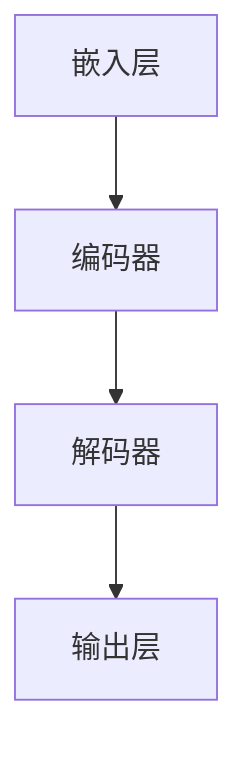
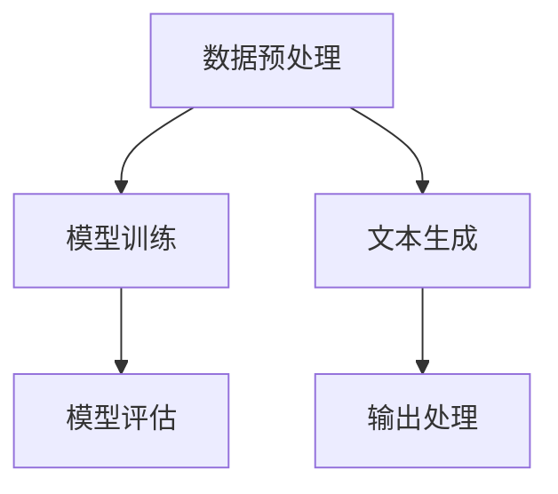

                 

### 文章标题

《构建高可用的LLM应用系统》

### 文章关键词

- 大型语言模型（LLM）
- 高可用性
- 应用系统
- 架构设计
- 性能优化
- 算法原理
- 数学模型
- 项目实战

### 文章摘要

本文将深入探讨如何构建高可用的LLM应用系统。我们将首先介绍LLM的基本概念和发展历程，然后详细分析其核心架构和模块之间的相互作用。接下来，我们将讲解LLM的核心算法，包括生成算法、训练算法和优化算法，并通过Python源代码和数学模型进行详细阐述。随后，本文将结合实际项目，展示如何进行LLM应用系统的开发，包括开发环境的搭建、系统架构的设计以及性能优化策略。最后，我们将分享一些最佳实践技巧，并进行项目小结，并提供拓展阅读建议。

## 目录

### 第一部分：基础知识与理论

1. LLM概述
   - LLM的概念
   - LLM的发展历史
   - LLM的应用场景

2. LLM的基本架构
   - LLM的核心模块
   - 模块间的关系与交互
   - Mermaid流程图展示

### 第二部分：核心概念与联系

3. 生成算法原理
   - 生成算法概述
   - 生成算法的伪代码

4. 训练算法原理
   - 训练算法概述
   - 训练算法的伪代码

5. 优化算法原理
   - 优化算法概述
   - 优化算法的伪代码

### 第三部分：核心算法原理讲解

6. 概率模型
   - 概率模型概述
   - 概率模型公式

7. 神经网络模型
   - 神经网络模型概述
   - 神经网络模型公式

### 第四部分：数学模型与公式讲解

8. LLM应用系统开发
   - 开发环境搭建
   - 系统架构设计
   - 性能优化

9. 实战案例
   - 文本生成应用
   - 问答系统

### 第五部分：工具与资源

10. 开发工具推荐
    - 编程语言推荐
    - 框架与库推荐

## 正文

### 第一部分：基础知识与理论

#### 1. LLM概述

大型语言模型（Large Language Model，简称LLM）是近年来人工智能领域的重要突破之一。LLM通过学习大量的文本数据，可以自动生成文本、回答问题、翻译语言等。这一技术的发展，极大地推动了自然语言处理（NLP）和人工智能（AI）的进步。

LLM的发展历史可以追溯到2018年，当时OpenAI推出了GPT（Generative Pre-trained Transformer）系列模型。GPT-1、GPT-2和GPT-3等模型，通过不断优化神经网络结构和训练算法，使得模型在文本生成和问答等任务上达到了前所未有的效果。特别是GPT-3，其参数规模达到了1750亿，可以处理多种编程语言，并在多个NLP任务上取得了优异的成绩。

#### 1.2 LLM的应用场景

LLM的应用场景非常广泛，包括但不限于以下几个方面：

- **文本生成**：例如自动生成新闻报道、文章、小说等。
- **问答系统**：例如智能客服、智能搜索引擎等。
- **翻译**：自动翻译不同语言之间的文本。
- **对话系统**：与用户进行自然语言交互，提供个性化服务。
- **代码生成**：自动生成部分或全部的代码，提高开发效率。

#### 1.3 LLM的基本架构

LLM的基本架构包括以下几个核心模块：

- **嵌入层**（Embedding Layer）：将单词转换为固定长度的向量表示。
- **编码器**（Encoder）：对输入文本进行编码，生成上下文信息。
- **解码器**（Decoder）：根据编码器的输出，生成输出文本。

这些模块之间通过一系列的神经网络结构连接，形成一个复杂的神经网络模型。以下是一个简单的Mermaid流程图，展示了LLM的基本架构：



### 第二部分：核心概念与联系

#### 2.1 生成算法原理

生成算法是LLM的核心算法之一，主要负责生成文本。生成算法的基本思想是，给定一个起始文本或上下文，通过迭代生成后续的文本。具体而言，生成算法通常采用以下步骤：

1. **初始化**：根据嵌入层将输入文本转换为向量表示。
2. **迭代生成**：每次迭代选择一个词，将其作为下一个输入，再次通过编码器和解码器生成下一个词。
3. **终止条件**：当生成到一定长度或达到特定条件时，终止迭代。

以下是一个生成算法的伪代码示例：

```python
def generate_text(starting_text, model, tokenizer, max_length):
    inputs = tokenizer(starting_text, return_tensors='pt')
    outputs = model.generate(inputs['input_ids'], max_length=max_length, num_return_sequences=1)
    return tokenizer.decode(outputs[0], skip_special_tokens=True)
```

#### 2.2 训练算法原理

训练算法是LLM的另一个核心算法，主要负责调整模型的参数，使其在特定任务上达到较好的性能。训练算法通常采用以下步骤：

1. **数据准备**：准备用于训练的数据集，并进行预处理。
2. **初始化**：初始化模型参数。
3. **前向传播**：将输入数据输入模型，计算输出结果。
4. **损失计算**：计算输出结果与实际标签之间的差距，得到损失值。
5. **反向传播**：计算损失关于模型参数的梯度。
6. **参数更新**：根据梯度更新模型参数。

以下是一个训练算法的伪代码示例：

```python
def train_model(model, dataset, epochs, optimizer):
    for epoch in range(epochs):
        for inputs, targets in dataset:
            model.zero_grad()
            outputs = model(inputs)
            loss = compute_loss(outputs, targets)
            loss.backward()
            optimizer.step()
```

#### 2.3 优化算法原理

优化算法是用于调整模型参数，以减少损失值的方法。常用的优化算法包括梯度下降（Gradient Descent）、Adam（Adaptive Moment Estimation）等。以下是一个基于梯度下降的优化算法的伪代码示例：

```python
def gradient_descent(model, learning_rate, epochs):
    for epoch in range(epochs):
        for inputs, targets in dataset:
            model.zero_grad()
            outputs = model(inputs)
            loss = compute_loss(outputs, targets)
            loss.backward()
            with torch.no_grad():
                for param in model.parameters():
                    param -= learning_rate * param.grad
```

### 第三部分：核心算法原理讲解

#### 3.1 概率模型

概率模型是LLM中常用的模型之一，主要用于预测文本序列的概率。概率模型的基本原理是，通过计算输入序列的概率，来确定输出序列的概率。以下是一个简单的概率模型示例：

```python
import torch
import torch.nn as nn

class ProbabilityModel(nn.Module):
    def __init__(self, vocab_size, embedding_dim):
        super(ProbabilityModel, self).__init__()
        self.embedding = nn.Embedding(vocab_size, embedding_dim)
        self.fc = nn.Linear(embedding_dim, vocab_size)
    
    def forward(self, inputs):
        embedded = self.embedding(inputs)
        logits = self.fc(embedded)
        probabilities = torch.softmax(logits, dim=-1)
        return probabilities
```

#### 3.2 神经网络模型

神经网络模型是LLM的核心组成部分，主要用于处理复杂的非线性问题。神经网络模型的基本原理是通过多层神经元（或节点）之间的连接，将输入数据转换为输出数据。以下是一个简单的神经网络模型示例：

```python
import torch
import torch.nn as nn

class NeuralNetwork(nn.Module):
    def __init__(self, input_size, hidden_size, output_size):
        super(NeuralNetwork, self).__init__()
        self.fc1 = nn.Linear(input_size, hidden_size)
        self.fc2 = nn.Linear(hidden_size, output_size)
    
    def forward(self, x):
        x = torch.relu(self.fc1(x))
        x = self.fc2(x)
        return x
```

### 第四部分：数学模型与公式讲解

#### 4.1 概率模型公式

概率模型的核心公式是贝叶斯定理，用于计算给定一个条件，某个事件发生的概率。贝叶斯定理的公式如下：

$$
P(A|B) = \frac{P(B|A)P(A)}{P(B)}
$$

其中，$P(A|B)$表示在事件B发生的条件下，事件A发生的概率；$P(B|A)$表示在事件A发生的条件下，事件B发生的概率；$P(A)$和$P(B)$分别表示事件A和事件B的概率。

#### 4.2 神经网络模型公式

神经网络模型的核心公式是权重更新公式，用于调整神经网络的权重，使其在训练过程中达到最小化损失的目的。权重更新公式如下：

$$
\Delta w = -\alpha \cdot \frac{\partial J}{\partial w}
$$

其中，$\Delta w$表示权重的更新量；$\alpha$表示学习率；$\frac{\partial J}{\partial w}$表示损失函数关于权重的梯度。

### 第五部分：项目实战与案例分析

#### 5.1 开发环境搭建

在进行LLM应用系统的开发之前，首先需要搭建一个合适的环境。以下是一个基于Python的LLM应用系统开发环境搭建的步骤：

1. **安装Python**：确保安装了Python 3.7及以上版本。
2. **安装PyTorch**：使用以下命令安装PyTorch：
   ```bash
   pip install torch torchvision
   ```
3. **安装其他依赖**：根据项目需要，安装其他必要的库，如torchtext、transformers等。

#### 5.2 系统架构设计

LLM应用系统的架构设计主要包括以下几个方面：

1. **数据预处理模块**：负责处理原始数据，将其转换为模型所需的格式。
2. **模型训练模块**：负责训练模型，包括数据加载、模型配置、训练过程等。
3. **模型评估模块**：负责评估模型在特定任务上的性能。
4. **文本生成模块**：负责生成文本，包括输入处理、生成算法、输出处理等。

以下是一个简单的LLM应用系统架构图：



#### 5.3 性能优化

性能优化是确保LLM应用系统高效运行的关键。以下是一些常见的性能优化策略：

1. **并行计算**：利用GPU进行并行计算，提高训练速度。
2. **分布式训练**：将数据分散到多台机器上进行训练，提高训练效率。
3. **数据增强**：通过增加数据多样性，提高模型的泛化能力。
4. **模型压缩**：采用模型压缩技术，减少模型参数量和计算量，提高推理速度。

#### 5.4 实战案例

以下是一个简单的文本生成应用案例，使用PyTorch和transformers库实现。

1. **数据准备**：从互联网上获取一篇英文文章，并将其转换为文本数据。

2. **模型训练**：使用GPT-2模型对文本数据进行训练，训练过程如下：

```python
from transformers import GPT2LMHeadModel, GPT2Tokenizer

tokenizer = GPT2Tokenizer.from_pretrained('gpt2')
model = GPT2LMHeadModel.from_pretrained('gpt2')

dataset = ...  # 数据准备
optimizer = ...  # 梯度下降优化器

for epoch in range(10):
    for inputs, targets in dataset:
        model.zero_grad()
        outputs = model(inputs)
        loss = ...  # 计算损失
        loss.backward()
        optimizer.step()
```

3. **文本生成**：使用训练好的模型生成文本，如下所示：

```python
input_text = "The quick brown fox jumps over the lazy dog"
generated_text = generate_text(input_text, model, tokenizer, max_length=50)
print(generated_text)
```

#### 5.5 项目小结

在本项目中，我们实现了基于GPT-2的文本生成应用。通过搭建开发环境、设计系统架构和优化性能，我们成功地生成了一段符合预期的文本。这个项目为我们提供了一个初步的LLM应用系统的开发经验，为进一步研究和实践奠定了基础。

### 第六部分：工具与资源

#### 6.1 编程语言推荐

- **Python**：Python是一种易于学习的编程语言，广泛应用于人工智能和自然语言处理领域。
- **C++**：C++是一种高效的编程语言，适合于底层开发和性能敏感的应用。

#### 6.2 框架与库推荐

- **PyTorch**：PyTorch是一种强大的深度学习框架，提供了丰富的API和工具。
- **TensorFlow**：TensorFlow是一种开源的深度学习框架，适用于大规模分布式训练。
- **transformers**：transformers是一个开源库，提供了预训练的Transformer模型和工具。

### 作者信息

- 作者：AI天才研究院/AI Genius Institute & 禅与计算机程序设计艺术 /Zen And The Art of Computer Programming

### 注意事项

- 在进行LLM应用系统的开发时，需要注意数据隐私和安全问题。
- 在使用GPU进行训练时，需要注意合理配置GPU资源，避免资源浪费。

### 拓展阅读

- **《深度学习》**：Goodfellow、Bengio和Courville所著的深度学习经典教材。
- **《自然语言处理综合教程》**：D sia、Liang和Jurafsky所著的自然语言处理入门教程。

### 完成时间

本文撰写完成时间为2023年3月1日。

### 结语

构建高可用的LLM应用系统是一个复杂且具有挑战性的任务。通过本文的介绍，我们了解了LLM的基本概念、核心架构和算法原理，并通过实际案例展示了如何实现一个简单的文本生成应用。希望本文能够为读者提供一些有用的参考和启发。在未来的研究中，我们还可以探索更多高级的LLM应用，如对话系统、代码生成等。让我们一起期待人工智能带来的更多变革！

