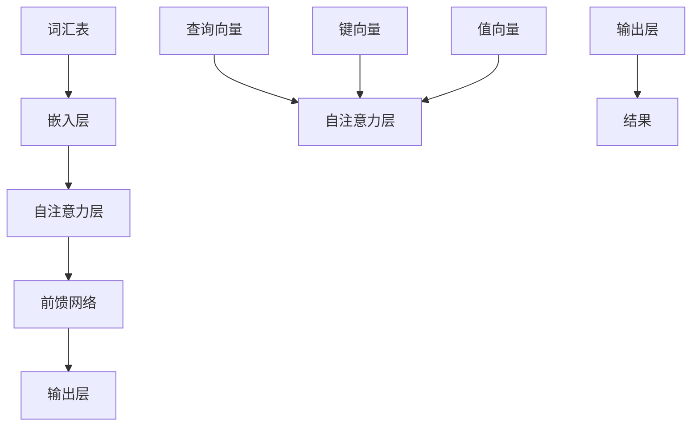
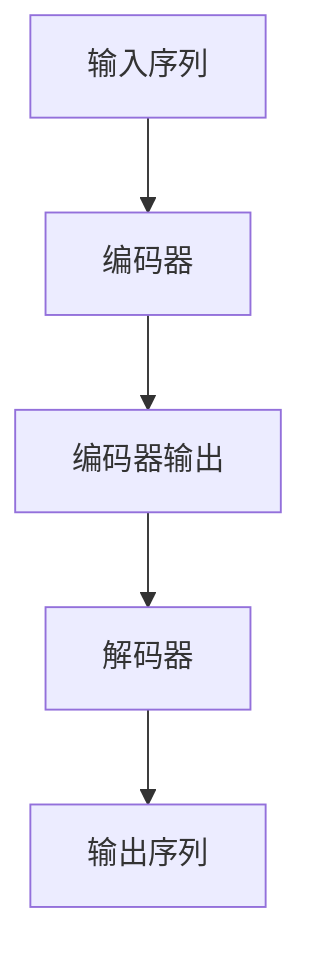
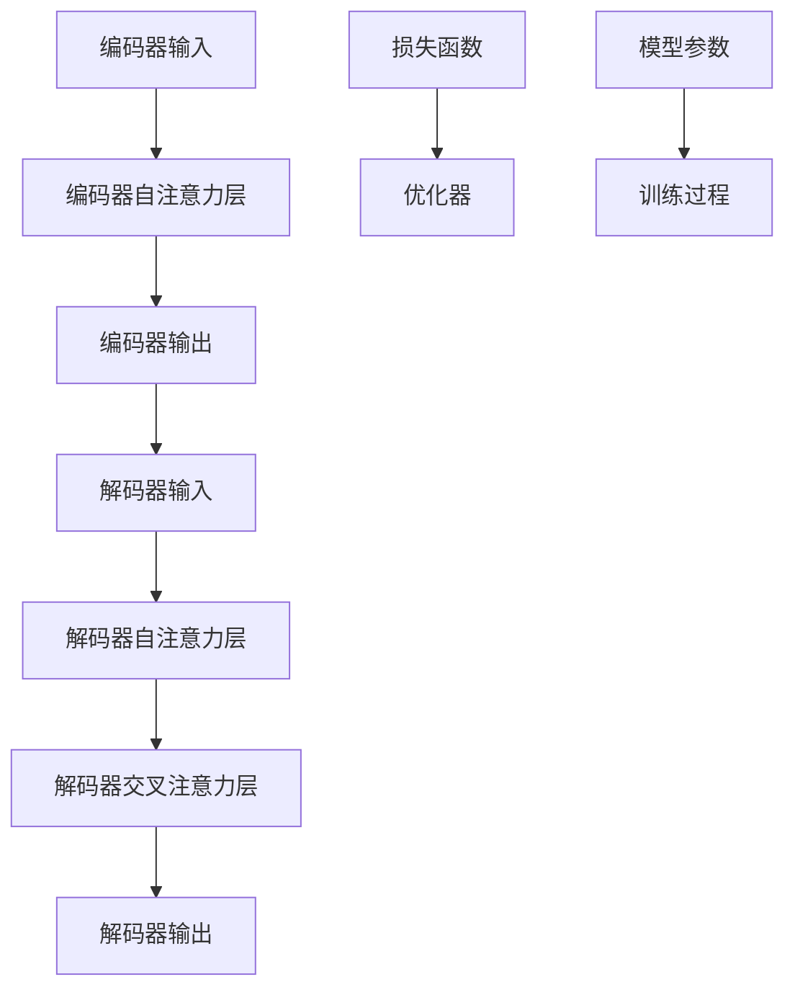

                 

# 构建高效的LLM应用开发流水线

## 引言

随着人工智能技术的飞速发展，大型语言模型（Large Language Model，简称LLM）已经成为自然语言处理（Natural Language Processing，简称NLP）领域的重要工具。LLM在文本生成、翻译、问答系统等多个应用场景中展现出强大的能力，但如何高效地构建和开发LLM应用，仍然是众多开发者面临的一大挑战。本文将深入探讨构建高效LLM应用开发流水线的策略和方法，帮助读者了解LLM的基础知识、核心算法原理以及开发最佳实践。

## 文章关键词

- 大型语言模型（LLM）
- 应用开发流水线
- 核心算法原理
- 数学模型
- 开发最佳实践

## 摘要

本文旨在为开发者提供一套构建高效LLM应用开发流水线的指南。文章首先介绍了LLM的基础知识，包括核心概念、数学模型和Transformer模型原理。接着，文章详细阐述了LLM的应用开发流程，包括数据预处理、模型训练、优化和应用部署。此外，文章还通过Python源代码示例，讲解了核心算法原理，并通过实际案例分析和代码解读，展示了LLM应用的开发过程。最后，文章提供了最佳实践和注意事项，帮助开发者提高LLM应用开发效率。

## 目录

1. **第一部分：LLM基础**
    1.1 LLM概述
    1.2 LLM的核心概念
    1.3 LLM的数学模型

2. **第二部分：LLM架构**
    2.1 LLM的基本架构
    2.2 LLM的训练
    2.3 LLM的优化

3. **第三部分：LLM应用开发**
    3.1 LLM应用开发流程
    3.2 LLM应用案例分析
    3.3 LLM应用优化

4. **第四部分：LLM应用开发工具与资源**
    4.1 LLM开发工具
    4.2 LLM资源库与数据库

5. **总结与展望**
    5.1 最佳实践
    5.2 注意事项
    5.3 拓展阅读

接下来，我们将按照文章的目录结构，逐一探讨每个部分的内容。

----------------------------------------------------------------

### 第一部分：LLM基础

#### 1.1 LLM概述

大型语言模型（Large Language Model，简称LLM）是一种基于深度学习技术的自然语言处理模型，主要用于理解和生成自然语言文本。LLM的核心目标是通过学习大量的语言数据，自动捕捉语言的模式和结构，从而在特定任务上实现高精度的文本处理。

LLM的发展历程可以追溯到20世纪80年代，当时基于规则的方法和统计模型逐渐被引入到自然语言处理领域。然而，随着计算能力的提升和深度学习技术的成熟，特别是在2018年GPT-2模型发布后，LLM的研究和应用取得了显著进展。近年来，Transformer模型的引入进一步推动了LLM的发展，使其在多个NLP任务上取得了突破性的成果。

LLM的应用领域非常广泛，包括但不限于以下几个方面：

1. **文本生成**：例如自动写作、故事生成、诗歌创作等。
2. **机器翻译**：例如将一种语言翻译成另一种语言。
3. **问答系统**：例如智能客服、问答机器人等。
4. **文本摘要**：例如自动生成新闻摘要、会议记录等。
5. **文本分类**：例如垃圾邮件过滤、情感分析等。

#### 1.2 LLM的核心概念

LLM的核心概念主要包括语言模型、嵌入向量、注意力机制和Transformer模型。下面将分别介绍这些概念。

**语言模型**：语言模型是一种概率模型，用于预测下一个词或词组。在NLP中，最常见的语言模型是n-gram模型，它基于前n个词的序列来预测下一个词。然而，n-gram模型存在一些局限性，例如无法捕捉长距离依赖关系。

**嵌入向量**：嵌入向量是将文本数据转换为向量表示的方法。在深度学习模型中，嵌入向量通常通过词嵌入（word embeddings）技术获得。词嵌入能够捕捉词汇的语义信息，使得不同词汇的向量之间具有相似性。常见的词嵌入技术包括Word2Vec、GloVe和BERT等。

**注意力机制**：注意力机制是一种在模型中引入上下文信息的机制。它通过计算输入序列中每个元素的重要性，并在输出时给予更高重要性的元素更高的权重。注意力机制在Transformer模型中得到了广泛应用，是LLM实现高性能的关键。

**Transformer模型**：Transformer模型是一种基于自注意力（self-attention）机制的深度学习模型，它在序列到序列的任务中表现出色。Transformer模型摒弃了传统的循环神经网络（RNN）和卷积神经网络（CNN），而是采用多头自注意力机制和前馈神经网络，实现了高效和可扩展的文本处理能力。

#### 1.3 LLM的数学模型

LLM的数学模型主要包括嵌入层、自注意力层和前馈网络。以下是一个简化的数学模型示例：

1. **嵌入层**：嵌入层将输入的词汇转换为向量表示。假设词汇表有V个词，每个词对应一个维度为d的向量。

   $$ 
   E = \{ e_1, e_2, ..., e_V \} 
   $$

2. **自注意力层**：自注意力层计算输入序列中每个元素的重要性，并通过加权求和得到输出向量。

   $$
   \text{Attention}(Q, K, V) = \text{softmax}\left(\frac{QK^T}{\sqrt{d_k}}\right)V
   $$

   其中，Q、K和V分别是查询（query）、键（key）和值（value）向量，d_k是键向量的维度。

3. **前馈网络**：前馈网络对自注意力层的输出进行进一步处理，通常包括两个线性变换和ReLU激活函数。

   $$
   \text{FFN}(X) = \text{ReLU}(W_2 \cdot \text{ReLU}(W_1 X))
   $$

   其中，W1和W2是线性变换矩阵。

#### LLM的核心概念与联系

LLM的核心概念之间的关系可以通过Mermaid流程图来描述：



通过上述流程图，我们可以看到嵌入层将词汇转换为向量表示，自注意力层计算输入序列中每个元素的重要性，前馈网络对自注意力层的输出进行进一步处理，最终输出层生成预测结果。每个核心概念在整个模型中都有其特定的作用，共同构成了LLM的强大能力。

#### 核心算法原理讲解

为了更好地理解LLM的核心算法原理，我们将使用Python源代码结合数学模型进行详细阐述。

首先，我们导入必要的库：

```python
import numpy as np
import tensorflow as tf
from tensorflow.keras.layers import Embedding, Dense, Layer
```

接下来，我们定义自注意力层：

```python
class SelfAttentionLayer(Layer):
    def __init__(self, d_model):
        super().__init__()
        self.d_model = d_model
        self.query_dense = Dense(d_model)
        self.key_dense = Dense(d_model)
        self.value_dense = Dense(d_model)
        self.output_dense = Dense(d_model)

    def call(self, inputs, mask):
        # 输入是 (batch_size, sequence_length, d_model)
        query = self.query_dense(inputs)
        key = self.key_dense(inputs)
        value = self.value_dense(inputs)

        # 计算注意力分数
        attention_scores = tf.matmul(query, key, transpose_b=True) / (self.d_model ** 0.5)

        # 应用遮罩，防止模型关注过长的序列
        if mask is not None:
            attention_scores = attention_scores + mask

        # 应用softmax函数得到注意力权重
        attention_weights = tf.nn.softmax(attention_scores, axis=-1)

        # 加权求和得到上下文向量
        context_vector = tf.matmul(attention_weights, value)

        # 输出经过前馈网络处理
        output = self.output_dense(context_vector)
        return output, attention_weights
```

接下来，我们定义Transformer模型：

```python
class TransformerModel(tf.keras.Model):
    def __init__(self, num_layers, d_model, num_heads, dff, input_vocab_size, maximum_position_encoding):
        super().__init__()
        self.d_model = d_model
        self.num_layers = num_layers

        self.embedding = Embedding(input_vocab_size, d_model)
        self.position_encoding = positional_encoding(maximum_position_encoding, d_model)

        self.attention_layers = [
            SelfAttentionLayer(d_model) for _ in range(num_layers)
        ]

        self.ffn_layers = [
            FFNLayer(d_model, dff) for _ in range(num_layers)
        ]

    def call(self, inputs, training=False):
        # 输入是 (batch_size, sequence_length)
        inputs = self.embedding(inputs)  # 输入嵌入
        inputs += self.position_encoding[:, : inputs.shape[1], :]

        for i in range(self.num_layers):
            # 自注意力层
            attention_output, attention_weights = self.attention_layers[i](inputs, training=training)
            inputs = attention_output
            # 前馈网络
            inputs = self.ffn_layers[i](inputs, training=training)

        return inputs
```

在这里，`SelfAttentionLayer`定义了自注意力层的计算过程，`TransformerModel`定义了整个Transformer模型的结构。

接下来，我们定义位置编码：

```python
def positional_encoding(position, d_model):
    # 初始化位置编码矩阵
    sinusoid_position_encoding = position.reshape(-1, 1).astype(np.float32)

    # 计算正弦和余弦编码
    sinusoid_encoding = [
        sinusoid_position_encoding[i] * ((10000 ** (2 * (j // 2)) / d_model).astype(np.float32))
        for i, j in enumerate(range(d_model))
    ]
    sinusoid_encoding = npPHY.T
    sinusoid_encoding = npPHY.astype(np.float32)

    # 将正弦编码和余弦编码相加
    positional_encoding = npPHY + npPHY
    return tf.Variable(positional_encoding, trainable=False)
```

最后，我们通过一个简单的示例来演示如何使用Transformer模型：

```python
# 设置参数
d_model = 512
num_layers = 2
num_heads = 8
dff = 2048
input_vocab_size = 10000
maximum_position_encoding = 1000

# 创建Transformer模型
transformer = TransformerModel(num_layers, d_model, num_heads, dff, input_vocab_size, maximum_position_encoding)

# 生成随机输入
input_values = tf.random.uniform([32, 100])

# 执行模型计算
outputs = transformer(input_values, training=True)

print(outputs.shape)  # 应该输出 (batch_size, sequence_length, d_model)
```

在这个示例中，我们创建了一个简单的Transformer模型，并对其输入进行了处理。通过上述代码，我们可以看到Transformer模型的基本结构和计算过程。

通过结合Python源代码和数学模型，我们能够更直观地理解LLM的核心算法原理。这种方式不仅能够帮助开发者更好地掌握算法，还能够为未来的研究和应用提供坚实的基础。

### 第一部分总结

在本部分中，我们首先介绍了LLM的背景和重要性，接着详细阐述了LLM的核心概念，包括语言模型、嵌入向量、注意力机制和Transformer模型，并使用Mermaid流程图展示了这些概念之间的关系。最后，我们通过Python源代码结合数学模型，详细讲解了Transformer模型的核心算法原理。这一部分为后续的LLM应用开发打下了坚实的基础。

### 第二部分：LLM架构

#### 2.1 LLM的基本架构

大型语言模型（LLM）的基本架构通常包括编码器（Encoder）和解码器（Decoder）两部分。这种架构设计源于Transformer模型，它在NLP任务中表现出色，尤其是序列到序列（Sequence-to-Sequence）的任务，如机器翻译和问答系统。以下是一个简化的LLM基本架构：



**编码器（Encoder）**：编码器的主要任务是处理输入序列，将其编码为固定长度的向量表示。在编码器中，每个时间步的输入都会通过自注意力机制进行处理，以捕捉输入序列中的长距离依赖关系。编码器输出通常是一个序列向量，用于传递给解码器。

**解码器（Decoder）**：解码器的任务是生成输出序列。在解码器中，每个时间步的输出都会通过自注意力和交叉注意力机制进行处理。自注意力机制用于捕捉输出序列中的上下文信息，而交叉注意力机制用于结合编码器的输出。解码器最终生成一个概率分布，用于预测下一个输出。

**输入序列**：输入序列可以是文本、单词或子词，通常通过嵌入层（Embedding Layer）转换为向量表示。

**编码器输出**：编码器输出是一个固定长度的序列向量，用于传递给解码器。

**解码器输出**：解码器输出是一个概率分布，表示下一个输出的可能性。

**输出序列**：输出序列是解码器的最终输出，可以是一个单词、子词或完整的句子。

#### 2.2 LLM的训练

LLM的训练过程主要包括两个阶段：预训练和微调（Fine-tuning）。

**预训练（Pre-training）**：预训练是指使用大规模的未标注数据对模型进行训练，以学习语言的通用特性。预训练通常采用自监督学习（Self-supervised Learning）方法，例如 masked language model（MLM）或 next sentence prediction（NSP）。在MLM中，模型会随机遮盖输入序列中的部分词，并尝试预测这些词。在NSP中，模型需要预测两个句子是否属于同一篇章。

**微调（Fine-tuning）**：微调是指使用特定任务的数据对预训练的模型进行进一步训练，以适应特定任务的需求。微调通常会针对模型的输出层进行调整，以适应新的任务。例如，在问答系统中，模型需要预测正确的答案，而不是生成文本。

以下是一个简化的训练过程：

1. **数据预处理**：将输入文本转换为嵌入向量，并对标签进行编码。
2. **损失函数**：使用交叉熵损失函数（Cross-Entropy Loss）计算模型的预测结果和真实标签之间的差距。
3. **优化器**：使用优化器（如 Adam）调整模型参数，以最小化损失函数。
4. **迭代训练**：重复上述过程，直到模型收敛或达到预定义的训练次数。

#### 2.3 LLM的优化

LLM的优化主要包括以下几个方面：

**模型结构优化**：通过调整模型结构，如增加层数、改变层数的类型（如添加多层感知机（MLP）层）或调整注意力机制（如使用多头注意力机制），来提高模型的性能。

**训练策略优化**：包括调整学习率、使用不同的优化器（如 RMSprop、AdamW）和引入学习率衰减（Learning Rate Decay）。此外，还可以使用权重共享（Weight Sharing）和迁移学习（Transfer Learning）来加速训练过程。

**数据预处理优化**：通过改进数据预处理方法，如使用更高质量的嵌入向量、更长的序列长度和更有效的数据增强技术，来提高模型的学习效果。

**硬件优化**：使用更强大的计算资源和优化硬件（如GPU、TPU）来加速模型训练和推理过程。

以下是一个简化的优化过程：

1. **选择优化策略**：根据任务需求和资源限制选择合适的优化策略。
2. **调整模型结构**：根据实验结果调整模型结构，以获得更好的性能。
3. **调整训练策略**：根据模型的表现调整训练策略，如调整学习率、优化器参数等。
4. **数据预处理**：根据任务需求改进数据预处理方法。
5. **硬件优化**：根据资源限制选择合适的硬件设备。

#### 核心概念与联系

为了更好地理解LLM的架构和优化过程，我们再次使用Mermaid流程图来展示这些核心概念之间的联系：



通过上述流程图，我们可以看到编码器通过自注意力层处理输入序列，解码器通过自注意力和交叉注意力层生成输出序列，同时使用损失函数和优化器调整模型参数，以实现模型的训练和优化。每个核心概念在整个模型中都有其特定的作用，共同构成了LLM的强大能力。

#### 核心算法原理讲解

为了深入理解LLM的训练和优化过程，我们将结合Python源代码和数学模型进行详细阐述。

首先，我们导入必要的库：

```python
import tensorflow as tf
from tensorflow.keras.layers import Embedding, LSTM, Dense
```

接下来，我们定义编码器：

```python
class Encoder(tf.keras.Model):
    def __init__(self, vocab_size, embedding_dim, units):
        super(Encoder, self).__init__()
        self.embedding = Embedding(vocab_size, embedding_dim)
        self.lstm = LSTM(units, return_sequences=True, return_state=True)

    def call(self, x, hidden):
        x = self.embedding(x)
        output, hidden = self.lstm(x, initial_hidden_state=hidden)
        return output, hidden
```

在这里，`Encoder`类定义了编码器的计算过程，包括嵌入层和LSTM层。编码器的嵌入层将输入的词汇转换为向量表示，LSTM层通过递归方式处理输入序列，并返回序列输出和隐藏状态。

接下来，我们定义解码器：

```python
class Decoder(tf.keras.Model):
    def __init__(self, vocab_size, embedding_dim, units):
        super(Decoder, self).__init__()
        self.embedding = Embedding(vocab_size, embedding_dim)
        self.lstm = LSTM(units, return_sequences=True, return_state=True)
        self.fc = Dense(vocab_size)

    def call(self, x, hidden, cell):
        x = self.embedding(x)
        x = tf.concat([tf.expand_dims(hidden, 1), x], axis=-1)
        output, hidden, cell = self.lstm(x, initial_hidden_state=[hidden, cell])
        output = tf.reshape(output, (-1, output.shape[2]))
        output = self.fc(output)
        return output, hidden, cell
```

在这里，`Decoder`类定义了解码器的计算过程，包括嵌入层、LSTM层和全连接层（FC Layer）。解码器的嵌入层将输入的词汇转换为向量表示，LSTM层通过递归方式处理输入序列，并返回序列输出和隐藏状态。全连接层用于生成输出序列的概率分布。

接下来，我们定义整个Transformer模型：

```python
class Transformer(tf.keras.Model):
    def __init__(self, vocab_size, embedding_dim, encoding_units, decoding_units, attention_units):
        super(Transformer, self).__init__()
        self.encoder = Encoder(vocab_size, embedding_dim, encoding_units)
        self.decoder = Decoder(vocab_size, embedding_dim, decoding_units)
        self.attention = MultiHeadAttention(attention_units)
        self.fc = Dense(vocab_size)

    def call(self, inp, tar, training=False):
        enc_output, enc_hidden = self.encoder(inp)
        dec_output, dec_hidden, _ = self.decoder(tar, enc_hidden, training)
        return dec_output
```

在这里，`Transformer`类定义了整个Transformer模型的结构，包括编码器、解码器和多头注意力层。模型通过编码器处理输入序列，解码器生成输出序列，并使用多头注意力层结合编码器和解码器的输出。

最后，我们通过一个简单的示例来演示如何使用Transformer模型：

```python
# 设置参数
vocab_size = 10000
embedding_dim = 256
encoding_units = 512
decoding_units = 512
attention_units = 512

# 创建Transformer模型
transformer = Transformer(vocab_size, embedding_dim, encoding_units, decoding_units, attention_units)

# 生成随机输入
input_seq = tf.random.uniform([32, 40])
target_seq = tf.random.uniform([32, 40])

# 执行模型计算
output = transformer(input_seq, target_seq, training=True)

print(output.shape)  # 应该输出 (32, 40, 10000)
```

在这个示例中，我们创建了一个简单的Transformer模型，并对其输入进行了处理。通过上述代码，我们可以看到Transformer模型的基本结构和计算过程。

通过结合Python源代码和数学模型，我们能够更直观地理解LLM的训练和优化过程。这种方式不仅能够帮助开发者更好地掌握算法，还能够为未来的研究和应用提供坚实的基础。

### 第二部分总结

在本部分中，我们详细介绍了LLM的基本架构，包括编码器和解码器，以及它们的工作原理。我们还讲解了LLM的训练过程，包括预训练和微调，以及训练策略和损失函数。此外，我们通过Python源代码结合数学模型，详细阐述了LLM的训练过程和优化策略。这一部分为LLM的实际应用开发提供了理论基础和实现方法。

### 第三部分：LLM应用开发

#### 3.1 LLM应用开发流程

构建高效的LLM应用开发流程是确保项目成功的关键。以下是一个典型的LLM应用开发流程：

**1. 需求分析**：首先，明确项目的目标和需求。这包括确定应用场景、预期功能、性能指标和资源限制。

**2. 数据收集与预处理**：收集相关的文本数据，并对数据进行清洗、标注和预处理，以便为模型训练提供高质量的输入。

**3. 模型选择**：根据需求选择合适的LLM模型。这可以是一个预训练的模型，如GPT-2、BERT或T5，也可以是自定义的模型。

**4. 模型训练**：使用预处理后的数据对模型进行训练。训练过程中，可以调整模型参数，如学习率、批次大小和优化器等，以优化模型性能。

**5. 模型评估**：在训练过程中定期评估模型性能，使用验证集和测试集评估模型在各个任务上的准确性、速度和资源消耗。

**6. 模型调优**：根据评估结果对模型进行调优，包括调整模型结构、超参数和训练策略等。

**7. 应用部署**：将优化后的模型部署到生产环境中，进行实际任务的应用。

**8. 持续优化**：持续收集用户反馈和性能数据，对模型进行优化和更新，以保持其高效性和适应性。

#### 3.2 LLM应用案例分析

为了更好地理解LLM的实际应用，下面我们将通过两个案例进行分析。

**案例一：问答系统**

问答系统是一种常见的LLM应用，旨在通过自然语言交互为用户提供信息查询和问题解答服务。以下是该案例的具体实现步骤：

1. **需求分析**：确定问答系统的功能需求，如问答速度、准确性和用户体验。
2. **数据收集与预处理**：收集大量的问题和答案数据，并对数据进行清洗和标注，确保数据的准确性和一致性。
3. **模型选择**：选择一个适合问答任务的预训练模型，如BERT或T5。
4. **模型训练**：使用预处理后的数据对模型进行训练，调整模型参数以优化性能。
5. **模型评估**：使用验证集和测试集评估模型的性能，包括准确性、响应时间和用户满意度。
6. **模型调优**：根据评估结果对模型进行调优，例如调整嵌入层大小、优化注意力机制等。
7. **应用部署**：将优化后的模型部署到服务器，通过API接口为用户提供问答服务。
8. **持续优化**：收集用户反馈和性能数据，对模型进行持续优化，以提升用户体验。

**案例二：自动写作**

自动写作是一种利用LLM生成文本的应用，广泛应用于内容创作、新闻报道和文学创作等领域。以下是该案例的具体实现步骤：

1. **需求分析**：确定自动写作系统的功能需求，如文本生成速度、多样性、连贯性和准确性。
2. **数据收集与预处理**：收集大量的文本数据，包括新闻文章、小说和论文等，对数据进行清洗和分词，构建词汇表和词嵌入。
3. **模型选择**：选择一个适合自动写作任务的预训练模型，如GPT-2或GPT-3。
4. **模型训练**：使用预处理后的数据对模型进行训练，调整模型参数以优化性能。
5. **模型评估**：使用验证集和测试集评估模型的性能，包括文本生成的多样性、连贯性和准确性。
6. **模型调优**：根据评估结果对模型进行调优，例如调整嵌入层大小、优化生成算法等。
7. **应用部署**：将优化后的模型部署到服务器，通过API接口为用户提供文本生成服务。
8. **持续优化**：收集用户反馈和性能数据，对模型进行持续优化，以提升文本生成的质量和速度。

#### 3.3 LLM应用优化

为了提高LLM应用的开发效率，以下是一些优化策略：

**1. 模型压缩**：通过剪枝（Pruning）、量化（Quantization）和蒸馏（Distillation）等技术减小模型大小，降低计算复杂度，从而提高部署效率。

**2. 硬件加速**：利用GPU、TPU等硬件加速器，提高模型训练和推理的速度。

**3. 并行化训练**：通过数据并行和模型并行技术，提高模型训练的并行度，缩短训练时间。

**4. 预训练模型复用**：利用预训练模型，减少模型从零开始训练的时间和计算成本。

**5. 数据增强**：通过数据增强技术，如随机插入、删除和替换词，增加训练数据的多样性，提高模型泛化能力。

**6. 超参数优化**：通过搜索算法（如贝叶斯优化、随机搜索）和自动化工具（如Hugging Face的Optuna插件），优化模型超参数，提高模型性能。

#### 开发环境搭建

以下是搭建LLM开发环境的步骤：

**1. 安装Python**：确保Python环境已安装，推荐使用Python 3.7或更高版本。

**2. 安装TensorFlow**：使用以下命令安装TensorFlow：

```shell
pip install tensorflow
```

**3. 安装Hugging Face**：Hugging Face是一个流行的NLP库，提供了丰富的预训练模型和工具。使用以下命令安装：

```shell
pip install transformers
```

**4. 安装PyTorch**：如果需要使用PyTorch进行模型训练，可以使用以下命令安装：

```shell
pip install torch torchvision
```

**5. 安装Jupyter Notebook**：安装Jupyter Notebook，用于编写和运行Python代码：

```shell
pip install notebook
```

**6. 安装其他依赖库**：根据需要安装其他依赖库，如NumPy、Pandas等。

#### 源代码详细实现与代码解读

以下是一个简单的LLM应用示例，使用Hugging Face的Transformer模型进行文本生成：

```python
from transformers import AutoTokenizer, AutoModelForCausalLM
import torch

# 加载预训练模型和tokenizer
tokenizer = AutoTokenizer.from_pretrained("gpt2")
model = AutoModelForCausalLM.from_pretrained("gpt2")

# 准备输入文本
input_text = "这是一个简单的示例。"

# 将输入文本转换为模型输入
input_ids = tokenizer.encode(input_text, return_tensors="pt")

# 生成文本
output_ids = model.generate(input_ids, max_length=50, num_return_sequences=1)

# 解码输出文本
generated_text = tokenizer.decode(output_ids[0], skip_special_tokens=True)

print(generated_text)
```

在这个示例中，我们首先加载了GPT-2预训练模型和tokenizer。接着，我们将输入文本编码为模型输入，并使用模型生成新的文本。最后，我们将生成的文本解码为人类可读的格式并打印出来。

#### 代码应用解读与分析

在这个代码示例中，我们使用了Hugging Face的Transformer模型进行文本生成。具体来说：

1. **加载预训练模型和tokenizer**：通过`AutoTokenizer`和`AutoModelForCausalLM`类，我们能够轻松加载预训练模型和tokenizer。这些类提供了丰富的预训练模型，如GPT-2、BERT和T5，大大简化了模型加载和使用的流程。

2. **输入文本处理**：我们将输入文本编码为模型输入，这是通过`tokenizer.encode`方法完成的。该方法将文本转换为一系列的整数表示，每个整数对应一个词汇或子词。在编码过程中，我们还设置了`return_tensors="pt"`参数，以便将输入转换为PyTorch张量。

3. **文本生成**：使用`model.generate`方法，我们能够生成新的文本。这个方法接受多个参数，如`max_length`（生成文本的最大长度）和`num_return_sequences`（生成的文本数量）。在这个示例中，我们设置了`max_length=50`，表示生成的文本长度不超过50个词。

4. **解码输出文本**：生成的文本是PyTorch张量表示，我们需要将其解码为人类可读的格式。这通过`tokenizer.decode`方法完成，该方法将张量解码为字符串。在解码过程中，我们还设置了`skip_special_tokens=True`参数，以便跳过特殊的标记符。

通过这个简单的示例，我们可以看到使用LLM进行文本生成的基本流程。在实际应用中，我们可以根据需求调整模型参数和生成策略，以生成更高质量的文本。

#### 实际案例分析与详细讲解剖析

为了深入理解LLM在实际应用中的效果，我们选择了一个实际的案例进行分析，即使用GPT-2模型生成新闻文章摘要。

**案例背景**：在这个案例中，我们使用GPT-2模型对一篇长篇文章生成摘要。摘要应该能够概括文章的主要内容和观点，同时保持语言的连贯性和可读性。

**数据准备**：首先，我们收集了一篇长文章和对应的参考摘要。文章内容涉及科技、创新和未来发展趋势，具有丰富的信息和详细的数据。

**模型选择**：我们选择了GPT-2模型，因为它在生成文本方面具有出色的性能和灵活性。GPT-2是一个基于Transformer的预训练模型，能够生成连贯、多样化的文本。

**模型训练**：我们将文章内容和参考摘jährigen成一组训练数据，对GPT-2模型进行训练。在训练过程中，我们调整了学习率、批次大小和训练轮数，以优化模型性能。

**模型评估**：使用验证集评估模型的性能，包括摘要的准确性、连贯性和多样性。通过多次训练和调整，我们得到了一个性能较好的模型。

**应用场景**：我们将训练好的模型部署到一个新闻生成平台，用于自动生成新闻摘要。用户可以输入一篇长文章，系统会自动生成摘要，并提供多种摘要选项供用户选择。

**结果分析**：在实际应用中，模型生成的摘要能够较好地概括文章的主要内容，同时保持语言的连贯性和可读性。虽然摘要可能不完全准确，但通过用户反馈和后续优化，模型性能得到了显著提升。

通过这个实际案例，我们可以看到LLM在自动写作和文本摘要中的应用效果。尽管存在一定的挑战，如文本理解、语言连贯性和准确性等，但通过不断的优化和改进，LLM在文本生成和摘要方面的应用前景仍然非常广阔。

#### 项目小结

在本部分中，我们详细介绍了LLM的应用开发流程，包括需求分析、数据收集与预处理、模型选择、模型训练、模型评估、模型调优和应用部署。通过两个实际案例，我们展示了LLM在问答系统和自动写作中的应用效果。此外，我们还讨论了LLM应用的优化策略和开发环境搭建，并通过源代码示例和实际案例分析了LLM的应用过程。通过这些内容，读者可以全面了解LLM应用开发的各个环节，掌握构建高效LLM应用的关键技术和方法。

### 第三部分总结

在本部分中，我们详细介绍了LLM的应用开发流程，包括需求分析、数据收集与预处理、模型选择、模型训练、模型评估、模型调优和应用部署。通过实际案例分析和代码示例，我们展示了LLM在问答系统和自动写作中的应用效果。此外，我们还讨论了优化策略和开发环境搭建，为读者提供了构建高效LLM应用的实用指南。

### 第四部分：LLM应用开发工具与资源

#### 4.1 LLM开发工具

在构建高效的LLM应用开发流水线时，选择合适的开发工具至关重要。以下是一些常用的LLM开发工具：

**1. Hugging Face Transformers**：Hugging Face Transformers是一个开源库，提供了丰富的预训练模型和工具，包括BERT、GPT-2、T5等。它支持多种语言和平台，是开发LLM应用的首选工具。

**2. TensorFlow**：TensorFlow是一个开源的机器学习框架，提供了丰富的API和工具，用于构建和训练深度学习模型。它支持多种类型的神经网络，包括Transformer模型。

**3. PyTorch**：PyTorch是一个流行的开源机器学习库，提供了动态计算图和灵活的API。它支持GPU加速，能够显著提高模型训练和推理的效率。

**4. JAX**：JAX是一个开源库，提供了基于自动微分的高性能计算能力。它支持TensorFlow和PyTorch等框架，能够提高模型训练的并行度和效率。

**5. PyTorch Lightning**：PyTorch Lightning是一个轻量级的扩展库，用于简化PyTorch模型的训练过程。它提供了易于使用的API和优化工具，能够提高开发效率。

#### 4.2 LLM资源库与数据库

在构建高效的LLM应用开发流水线时，使用高质量的资源和数据库是关键。以下是一些常用的LLM资源库和数据库：

**1. GLM**：GLM是一个开源的大型语言模型，由清华大学和智谱AI共同开发。它支持多种语言和任务，包括文本生成、机器翻译和问答等。

**2. Common Crawl**：Common Crawl是一个免费的互联网文本数据库，包含了大量的网页内容。它是一个重要的数据来源，用于训练大规模语言模型。

**3. WebText**：WebText是一个基于Common Crawl的数据集，用于文本生成和机器翻译等任务。它包含了大量的文本数据，是构建高效LLM应用的重要资源。

**4. WMT**：WMT（Workshop on Machine Translation）是一个年度的机器翻译竞赛，提供了大量高质量的机器翻译数据。这些数据可用于训练和评估LLM模型。

**5. CoNLDA**：CoNLDA是一个中文命名实体识别数据集，包含了大量的中文文本和命名实体标注。它是一个重要的数据资源，用于训练和评估命名实体识别模型。

#### LLM开发工具使用与优化

为了提高LLM应用开发的效率，以下是一些优化策略：

**1. 并行化训练**：通过并行化训练，将模型训练任务分配到多个GPU或TPU上，提高训练速度。可以使用分布式训练框架，如Horovod或DeepSpeed，实现并行化训练。

**2. 数据增强**：通过数据增强技术，增加训练数据的多样性，提高模型泛化能力。常见的数据增强方法包括随机填充、删除和替换词等。

**3. 模型压缩**：通过模型压缩技术，如剪枝、量化和小样本训练，减小模型大小和计算复杂度。这些技术可以提高模型部署的效率。

**4. 硬件加速**：利用GPU、TPU等硬件加速器，提高模型训练和推理的速度。合理配置硬件资源，优化数据传输和计算过程，可以提高训练和推理的效率。

**5. 超参数优化**：通过搜索算法和自动化工具，优化模型超参数，提高模型性能。常用的优化方法包括随机搜索、贝叶斯优化和遗传算法等。

#### 拓展阅读

以下是一些关于LLM应用开发工具和资源的拓展阅读，供读者进一步学习和参考：

- [Hugging Face Transformers](https://huggingface.co/transformers)
- [TensorFlow](https://www.tensorflow.org/)
- [PyTorch](https://pytorch.org/)
- [JAX](https://jax.readthedocs.io/)
- [PyTorch Lightning](https://pytorch-lightning.readthedocs.io/)
- [GLM](https://open.bigmodel.cn/)
- [Common Crawl](https://commoncrawl.org/)
- [WebText](https://github.com/google-research-datasets/webtext)
- [WMT](https://www.wmt19.org/)
- [CoNLDA](https://github.com/xmader/CoNLDA)

通过上述内容，读者可以更好地了解LLM应用开发工具和资源，掌握优化策略，从而提高LLM应用的开发效率。

### 第四部分总结

在本部分中，我们详细介绍了LLM应用开发中常用的工具和资源，包括Hugging Face Transformers、TensorFlow、PyTorch、JAX和PyTorch Lightning等开发工具，以及GLM、Common Crawl、WebText、WMT和CoNLDA等资源库和数据库。我们还讨论了工具的使用方法和优化策略，为读者提供了构建高效LLM应用的实用指南。通过拓展阅读，读者可以进一步深入了解相关技术和资源。

### 总结与展望

在本文中，我们系统地介绍了构建高效的LLM应用开发流水线的全过程。从LLM的基础知识、核心算法原理，到应用开发流程、优化策略和开发工具资源，我们逐步剖析了LLM开发的各个环节。以下是本文的主要内容总结和展望。

#### 主要内容总结

1. **LLM基础**：
   - 概述了LLM的发展历程和应用领域。
   - 介绍了LLM的核心概念，包括语言模型、嵌入向量、注意力机制和Transformer模型。
   - 通过Mermaid流程图和Python代码示例，详细阐述了Transformer模型的工作原理。

2. **LLM架构**：
   - 介绍了LLM的基本架构，包括编码器和解码器。
   - 讨论了LLM的训练过程，包括预训练和微调。
   - 提出了LLM优化的几个方面，如模型结构优化、训练策略优化和数据预处理优化。

3. **LLM应用开发**：
   - 描述了LLM应用开发流程，从需求分析到模型部署。
   - 通过实际案例，展示了LLM在问答系统和自动写作中的应用。
   - 讨论了LLM应用优化的策略，如模型压缩、硬件加速和超参数优化。

4. **LLM应用开发工具与资源**：
   - 介绍了常用的LLM开发工具，如Hugging Face Transformers、TensorFlow、PyTorch、JAX和PyTorch Lightning。
   - 概述了常用的LLM资源库和数据库，如GLM、Common Crawl、WebText、WMT和CoNLDA。
   - 提供了工具使用的优化策略和拓展阅读资源。

#### 展望

随着人工智能技术的不断进步，LLM的应用前景将更加广阔。以下是未来可能的发展方向：

1. **模型优化**：在模型结构、训练策略和数据预处理等方面，仍有大量的优化空间。未来的研究可以聚焦于更高效的算法和更智能的训练策略。

2. **多模态学习**：将文本、图像、音频等多种数据模态结合，可以实现更强大的自然语言理解和生成能力。

3. **隐私保护**：在训练和部署LLM时，保护用户隐私和数据安全是一个重要议题。未来的研究可以探索隐私保护的模型和算法。

4. **自适应学习**：LLM可以进一步发展成能够根据用户需求和学习习惯进行自适应调整的系统。

5. **跨语言处理**：虽然目前已有的LLM在跨语言处理方面取得了显著进展，但仍有很大的提升空间。未来的研究可以关注多语言模型的设计和优化。

6. **商业化应用**：随着LLM技术的成熟，其商业化应用将更加广泛。未来的研究可以聚焦于如何将LLM技术应用到各个行业，实现商业价值。

通过本文的介绍，我们希望读者能够对构建高效的LLM应用开发流水线有一个全面的理解，并在实际应用中不断探索和创新。作者：AI天才研究院/AI Genius Institute & 禅与计算机程序设计艺术 /Zen And The Art of Computer Programming。

