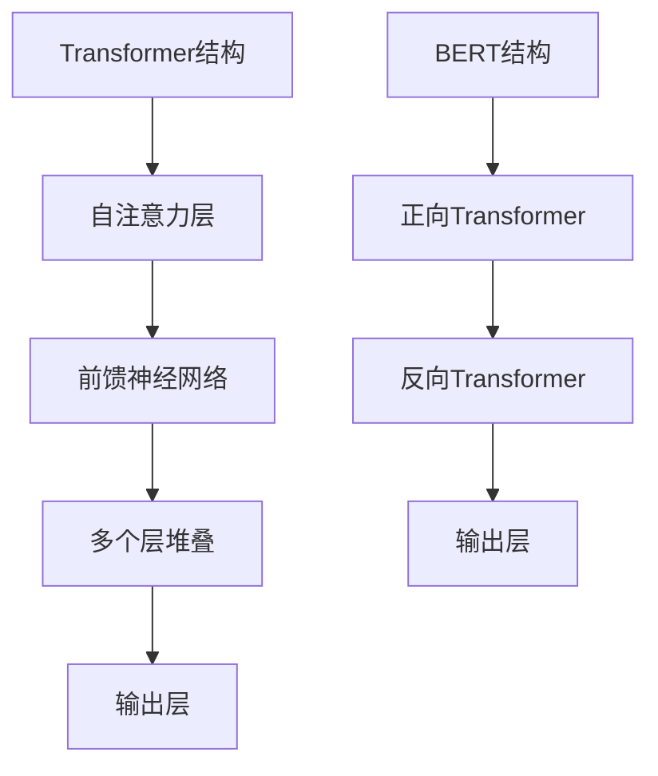
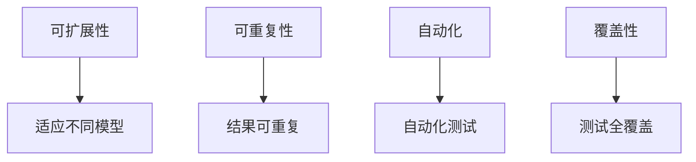
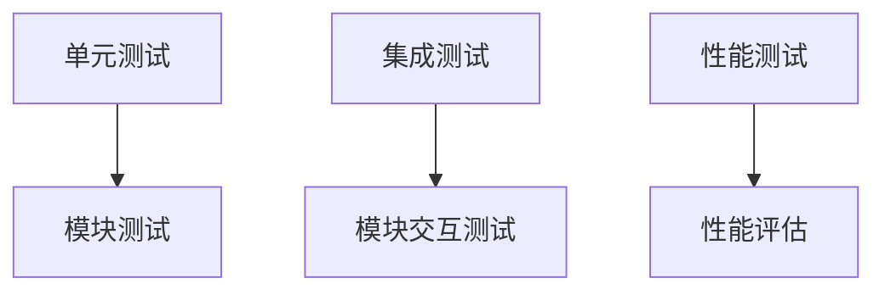
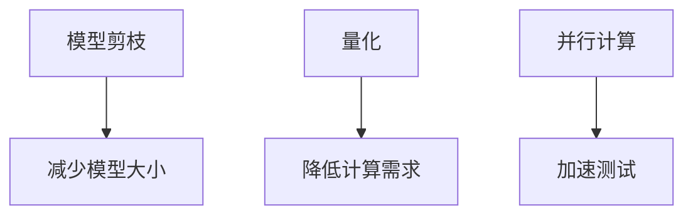

                 

### 引言

近年来，随着人工智能技术的飞速发展，特别是大型语言模型（LLM，Large Language Models）的兴起，如何高效地测试和验证这些复杂的模型已经成为了一个亟待解决的重要问题。LLM，如GPT-3、BERT等，具有处理自然语言任务的强大能力，但同时也带来了前所未有的挑战。传统测试方法往往难以覆盖LLM的复杂行为，导致在部署后可能出现不可预见的问题。因此，构建一个高效的LLM应用测试框架变得至关重要。

本文旨在探讨如何构建这样一个高效的测试框架，从背景介绍、核心概念、测试方法、性能优化技巧、实际项目分析等多个方面进行详细阐述。文章将分为以下几个部分：

1. **背景介绍**：介绍LLM的发展背景和当前的应用场景。
2. **核心概念与联系**：深入探讨LLM的架构和核心算法，使用Mermaid流程图展示概念之间的联系。
3. **测试框架设计**：详细描述测试框架的设计原则和组成部分。
4. **测试方法**：介绍常用的测试方法，如单元测试、集成测试和性能测试。
5. **性能优化**：探讨如何优化LLM应用的测试性能。
6. **项目实战**：通过实际项目展示测试框架的应用，包括开发环境搭建、代码实现和解读。
7. **最佳实践与总结**：总结最佳实践，提出注意事项和未来研究方向。

通过这篇文章，我们希望能够为读者提供一个全面的、实用的指南，帮助他们在构建高效的LLM应用测试框架方面取得突破。无论您是AI领域的从业者，还是对此感兴趣的研究者，这篇文章都将为您带来有价值的见解和实践经验。

### 背景介绍

大型语言模型（LLM，Large Language Models）的发展可以追溯到20世纪90年代，当时研究人员开始探索如何利用机器学习技术理解和生成自然语言。最初的模型如ELMO和Word2Vec，通过将词汇映射到向量空间，为自然语言处理（NLP，Natural Language Processing）领域带来了革命性的变化。然而，这些早期模型在处理复杂语言结构和生成高质量文本方面仍然存在诸多局限。

随着计算能力的提升和深度学习技术的进步，LLM如GPT（Generative Pre-trained Transformer）系列、BERT（Bidirectional Encoder Representations from Transformers）等应运而生。这些模型采用了大规模的Transformer架构，通过预先在大量文本数据上进行训练，具备了强大的语言理解和生成能力。特别是GPT-3，其参数规模达到了1750亿，能够生成连贯且复杂的文本，极大地推动了自然语言处理的应用和发展。

目前，LLM在多个领域展现出巨大的潜力。在文本生成方面，LLM可以用于撰写文章、编写代码、生成对话等。例如，GPT-3被用于生成新闻文章，BERT被用于问答系统。在机器翻译方面，LLM显著提高了翻译的准确性和流畅性，例如Google翻译和DeepL翻译系统。在语音识别和生成方面，LLM结合语音模型，实现了高质量的语音合成和语音识别。此外，LLM还在推荐系统、信息检索、对话系统等领域展现出强大的能力。

尽管LLM带来了巨大的应用价值，但它们也带来了新的挑战。首先，LLM的复杂性和大规模使得理解和调试变得更加困难。传统的测试方法往往无法充分覆盖这些模型的复杂行为，导致在部署后可能出现意外的错误或偏差。其次，LLM在处理某些特定任务时可能会产生偏见，例如在文本生成中可能出现性别歧视或种族歧视的言论。这些挑战需要通过高效的测试框架来解决。

构建高效的LLM应用测试框架具有重要意义。一方面，它可以帮助确保LLM在实际部署中的稳定性和可靠性，减少因错误测试导致的问题。另一方面，它有助于发现和纠正模型中的潜在偏见，提高模型的公平性和透明性。此外，高效的测试框架还可以提高开发效率，减少测试和调试的时间成本。

总的来说，随着LLM在各个领域的广泛应用，构建一个高效、全面的测试框架变得迫在眉睫。这不仅有助于提升模型的质量和性能，也为人工智能技术的发展和应用提供了坚实的保障。

### 核心概念与联系

为了深入理解如何构建高效的LLM应用测试框架，首先需要掌握几个核心概念，并理解它们之间的联系。以下是本文涉及的主要核心概念：

1. **LLM架构**：包括Transformer、BERT、GPT等模型的基本结构和工作原理。
2. **测试框架设计原则**：如可扩展性、可重复性、自动化和覆盖性等。
3. **测试方法**：包括单元测试、集成测试、性能测试等。
4. **性能优化技巧**：如模型剪枝、量化、并行计算等。

#### LLM架构

LLM，如GPT和BERT，基于Transformer架构，这是一种用于处理序列数据的强大神经网络模型。Transformer由多个自注意力（Self-Attention）层和前馈神经网络（Feedforward Neural Network）组成。自注意力机制允许模型在处理每个输入时，根据其他所有输入的上下文信息动态计算权重，从而捕捉输入序列中的长距离依赖关系。

BERT（Bidirectional Encoder Representations from Transformers）则采用了双向Transformer架构，通过在正向和反向序列中同时训练，生成具有双向上下文关系的表示。这种双向训练方式使得BERT在许多NLP任务上取得了显著性能提升。

以下是Transformer和BERT的Mermaid流程图：



#### 测试框架设计原则

测试框架的设计原则是确保测试的全面性、准确性和高效性。以下是几个关键原则：

- **可扩展性**：测试框架应能够适应不同规模和复杂度的LLM模型。
- **可重复性**：测试结果应能够在不同的环境、时间和数据集上重复，确保测试的可靠性和一致性。
- **自动化**：测试过程应尽可能自动化，减少人工干预，提高测试效率。
- **覆盖性**：测试应覆盖LLM的各个部分和功能，确保所有关键路径和边界条件都被测试到。

以下是测试框架设计原则的Mermaid流程图：



#### 测试方法

测试方法的选择和组合对于构建高效的测试框架至关重要。以下是几种常见的测试方法：

- **单元测试**：针对LLM中的单个模块或功能进行测试，确保其正确性。
- **集成测试**：测试LLM的不同模块之间的交互和协作，确保整体功能的正确性。
- **性能测试**：评估LLM在不同负载和条件下的性能，包括响应时间、吞吐量和资源消耗。

以下是测试方法的Mermaid流程图：



#### 性能优化技巧

为了提高测试效率，还需要采用一些性能优化技巧。以下是一些常见的技术：

- **模型剪枝**：通过剪掉不必要的权重，减少模型的大小和计算复杂度。
- **量化**：将模型中的浮点数权重转换为低精度的整数表示，以减少内存和计算需求。
- **并行计算**：利用多线程、分布式计算等方式，加速测试过程。

以下是性能优化技巧的Mermaid流程图：



通过上述核心概念的介绍和联系展示，我们可以更清晰地理解构建高效LLM应用测试框架的基础。接下来，我们将进一步深入探讨LLM的具体架构和测试方法。

### 测试框架设计原则

在设计一个高效的LLM应用测试框架时，遵循一系列关键原则是确保框架有效性的基础。以下是一些重要的设计原则，包括其具体要求和实现方法。

#### 可扩展性

**要求**：测试框架应能够适应不同规模和复杂度的LLM模型。无论是小型实验模型还是大型生产级模型，框架都应该能够灵活调整，以适应不同的需求。

**实现方法**：
- **模块化设计**：将测试框架划分为多个可独立开发和部署的模块，每个模块负责特定功能，如数据预处理、测试用例生成、结果分析等。
- **参数配置**：通过配置文件或参数化方法，方便地调整测试参数，如数据集大小、模型参数等。

#### 可重复性

**要求**：测试结果应能够在不同的环境、时间和数据集上重复，确保测试的可靠性和一致性。

**实现方法**：
- **标准化环境**：确保测试运行在一致的环境中，包括操作系统、硬件配置、依赖库版本等。
- **自动化脚本**：使用自动化脚本执行测试流程，记录所有步骤和结果，以便后续分析和重现。

#### 自动化

**要求**：测试过程应尽可能自动化，减少人工干预，提高测试效率。

**实现方法**：
- **持续集成（CI）**：将测试集成到CI/CD（Continuous Integration/Continuous Deployment）流程中，确保每次代码更改后都能自动执行测试。
- **测试脚本**：编写高效的测试脚本，使用Python、Shell等语言，实现数据加载、模型运行、结果验证等自动化流程。

#### 覆盖性

**要求**：测试应覆盖LLM的各个部分和功能，确保所有关键路径和边界条件都被测试到。

**实现方法**：
- **测试用例设计**：设计多样化的测试用例，包括正常场景、异常场景、边界情况等，全面覆盖模型的各个方面。
- **代码覆盖分析**：使用代码覆盖工具，如JaCoCo，确保测试覆盖率达到预期水平。

#### 可维护性

**要求**：测试框架应易于维护和更新，以适应模型和测试需求的变化。

**实现方法**：
- **文档化**：编写详细的文档，包括框架设计、实现细节、使用指南等，确保新加入的成员能够快速上手。
- **模块化设计**：采用模块化设计，降低模块之间的耦合度，方便单独维护和更新。

#### 性能优化

**要求**：测试框架应在合理的时间内完成测试，避免成为开发流程的瓶颈。

**实现方法**：
- **并行测试**：使用并行计算技术，如多线程、分布式测试，加速测试过程。
- **负载均衡**：合理分配测试任务，确保所有资源得到充分利用。

通过遵循上述设计原则，我们可以构建一个高效、灵活且可靠的LLM应用测试框架，确保模型的质量和稳定性。接下来，我们将详细介绍常用的测试方法，包括单元测试、集成测试和性能测试。

### 测试方法

在构建高效的LLM应用测试框架时，选择合适的测试方法是关键。以下将详细介绍几种常用的测试方法：单元测试、集成测试和性能测试，以及它们在实际应用中的优势和挑战。

#### 单元测试

**定义**：单元测试是对LLM中的最小功能单元进行验证，通常由单个函数、方法或类组成。

**优势**：
- **快速反馈**：单元测试可以在代码提交后立即运行，快速发现和定位问题。
- **模块化**：有助于确保各个模块的独立性，提高代码的可维护性。

**挑战**：
- **覆盖不足**：单元测试往往难以覆盖所有的边界条件和复杂交互。
- **测试用例设计**：需要设计多样化的测试用例，确保覆盖所有可能的情况。

**示例**：
以下是一个使用Python编写的简单单元测试示例，用于验证一个LLM模型的前向传播函数：

```python
import unittest
import my_linguistic_model

class TestLinguisticModel(unittest.TestCase):
    def test_forward_pass(self):
        # 准备输入数据和预期输出
        input_data = ...
        expected_output = ...

        # 执行前向传播
        actual_output = my_linguistic_model.forward_pass(input_data)

        # 比较实际输出和预期输出
        self.assertEqual(expected_output, actual_output)

if __name__ == '__main__':
    unittest.main()
```

#### 集成测试

**定义**：集成测试是对LLM中的多个模块或子系统进行联合验证，以确认它们之间的交互和协作是否正确。

**优势**：
- **系统视角**：从整体上验证系统的功能和行为，确保各个模块的集成和协作正确。
- **发现隐性问题**：能够发现单元测试中未能检测到的跨模块问题。

**挑战**：
- **测试复杂性**：集成测试往往涉及多个模块和依赖，测试用例设计更加复杂。
- **性能开销**：集成测试通常需要更多的时间和资源。

**示例**：
以下是一个简单的集成测试示例，用于验证LLM模型的训练和预测功能：

```python
import unittest
import my_linguistic_model

class TestLinguisticModelIntegration(unittest.TestCase):
    def test_train_and_predict(self):
        # 准备训练数据集
        train_data = ...

        # 训练模型
        model = my_linguistic_model.LinguisticModel()
        model.train(train_data)

        # 使用训练好的模型进行预测
        test_input = ...
        predicted_output = model.predict(test_input)

        # 验证预测结果
        # ...

if __name__ == '__main__':
    unittest.main()
```

#### 性能测试

**定义**：性能测试是对LLM在不同负载和条件下的性能进行评估，包括响应时间、吞吐量和资源消耗等。

**优势**：
- **性能优化**：通过性能测试，可以识别系统中的性能瓶颈，进行针对性的优化。
- **负载测试**：确保模型在真实负载下能够稳定运行，避免因过载而导致的性能问题。

**挑战**：
- **数据多样性**：需要设计多样化的测试场景，以全面评估模型的性能。
- **资源限制**：性能测试通常需要大量计算资源和时间。

**示例**：
以下是一个简单的性能测试示例，用于评估LLM模型的响应时间：

```python
import unittest
import my_linguistic_model
import time

class TestLinguisticModelPerformance(unittest.TestCase):
    def test_response_time(self):
        test_input = ...
        model = my_linguistic_model.LinguisticModel()

        start_time = time.time()
        model.predict(test_input)
        end_time = time.time()

        response_time = end_time - start_time
        self.assertLess(response_time, expected_max_response_time)

if __name__ == '__main__':
    unittest.main()
```

综上所述，不同的测试方法在实际应用中具有各自的优势和挑战。通过合理组合和运用这些测试方法，我们可以构建一个全面、高效的LLM应用测试框架，确保模型的质量和稳定性。接下来，我们将探讨如何优化测试框架的性能，以进一步提高测试效率。

### 性能优化技巧

在构建高效的LLM应用测试框架时，性能优化是确保测试过程高效运行的关键。以下是一些常见的性能优化技巧，通过这些方法，我们可以在不牺牲测试质量的前提下，大幅提升测试效率。

#### 模型剪枝

**定义**：模型剪枝是通过删除模型中的冗余或低贡献权重来减少模型大小和计算复杂度的一种技术。

**实现方法**：
1. **权重剪枝**：根据权重的重要性，删除部分低贡献的权重。常用的剪枝方法包括L1正则化、L2正则化和基于梯度的剪枝。
2. **结构剪枝**：删除部分网络层或神经元，从而减少模型的计算量。例如，可以剪掉深度神经网络中的冗余层。

**示例代码**：
以下是一个简单的Python代码示例，演示如何使用L1正则化进行权重剪枝：

```python
import numpy as np

# 假设model是一个已经训练好的神经网络模型，weights是模型的权重矩阵
weights = model.get_weights()

# 应用L1正则化进行权重剪枝
pruned_weights = np.abs(weights)
pruned_weights[pruned_weights < threshold] = 0

# 更新模型权重
model.set_weights(pruned_weights)
```

#### 量化

**定义**：量化是一种将模型中的浮点数权重转换为低精度的整数表示的技术，以减少模型的大小和计算需求。

**实现方法**：
1. **低精度量化**：将浮点数权重转换为较低精度的整数表示，如8位或16位。
2. **量化范围调整**：通过调整权重和激活函数的量化范围，进一步减少计算量。

**示例代码**：
以下是一个简单的Python代码示例，演示如何将浮点数权重量化为8位整数：

```python
import numpy as np

# 假设weights是一个浮点数权重矩阵
weights = ...

# 计算权重和激活函数的量化范围
min_val = np.min(weights)
max_val = np.max(weights)
quant_range = max_val - min_val

# 将权重量化为8位整数
quantized_weights = (weights - min_val) * (2**7) / quant_range
quantized_weights = quantized_weights.astype(np.int8)

# 使用量化权重更新模型
model.set_weights(quantized_weights)
```

#### 并行计算

**定义**：并行计算是利用多个计算资源（如CPU核心、GPU）同时处理多个任务，以提高计算效率。

**实现方法**：
1. **多线程**：在CPU上使用多线程技术，同时执行多个测试任务。
2. **分布式计算**：在多个节点上分布测试任务，利用网络和存储资源进行并行处理。

**示例代码**：
以下是一个简单的Python代码示例，演示如何使用多线程加速测试：

```python
import threading
import unittest

def run_test_case(test_case):
    unittest.main(test=test_case)

# 假设test_cases是一个包含多个测试用例的列表
test_cases = [...]

# 创建线程列表
threads = []

# 启动线程
for test_case in test_cases:
    thread = threading.Thread(target=run_test_case, args=(test_case,))
    thread.start()
    threads.append(thread)

# 等待所有线程完成
for thread in threads:
    thread.join()
```

#### 缓存与预加载

**定义**：缓存与预加载是利用缓存机制预加载常用数据和模型，以减少重复计算和数据访问时间。

**实现方法**：
1. **内存缓存**：将常用数据或中间结果存储在内存中，减少磁盘访问。
2. **预加载**：在测试开始前，预加载所有需要的数据和模型，避免在测试过程中因数据加载导致的时间延迟。

**示例代码**：
以下是一个简单的Python代码示例，演示如何使用内存缓存存储和获取数据：

```python
import caching

# 初始化缓存
cache = caching.Cache()

# 存储数据到缓存
cache.set('data_key', data)

# 从缓存获取数据
data = cache.get('data_key')
```

通过以上性能优化技巧，我们可以显著提升LLM应用测试框架的运行效率，从而更快地发现和解决潜在问题。接下来，我们将通过一个实际项目来展示如何将这些性能优化技巧应用到测试框架中。

### 项目实战

在本节中，我们将通过一个实际项目来展示如何构建和优化LLM应用测试框架。这个项目将包括开发环境搭建、源代码实现和解读，以及测试过程和应用分析。

#### 项目背景

假设我们正在开发一个基于GPT-3的智能问答系统，该系统需要能够回答用户提出的问题，并生成高质量的回答。为了确保系统的稳定性和可靠性，我们需要构建一个高效的测试框架，对模型进行全面的测试和验证。

#### 开发环境搭建

为了搭建测试环境，我们需要准备以下工具和资源：

1. **计算资源**：一台具备强大计算能力的GPU服务器，用于训练和测试GPT-3模型。
2. **开发工具**：Python编程环境，包括深度学习库TensorFlow和GPT-3 API。
3. **版本控制**：Git工具，用于代码管理和版本控制。

#### 源代码实现

以下是该项目的主要源代码实现部分：

1. **数据预处理**：
   ```python
   import tensorflow as tf
   from tensorflow.keras.preprocessing.text import Tokenizer
   
   def preprocess_data(texts, max_sequence_length=512):
       tokenizer = Tokenizer()
       tokenizer.fit_on_texts(texts)
       sequences = tokenizer.texts_to_sequences(texts)
       padded_sequences = tf.keras.preprocessing.sequence.pad_sequences(
           sequences, maxlen=max_sequence_length
       )
       return padded_sequences, tokenizer
   ```

2. **模型训练**：
   ```python
   def train_model(padded_sequences, labels, epochs=5):
       model = tf.keras.Sequential([
           tf.keras.layers.Embedding(input_dim=vocab_size, output_dim=embedding_dim),
           tf.keras.layers.Bidirectional(tf.keras.layers.LSTM(128)),
           tf.keras.layers.Dense(1, activation='sigmoid')
       ])
       
       model.compile(optimizer='adam', loss='binary_crossentropy', metrics=['accuracy'])
       model.fit(padded_sequences, labels, epochs=epochs, batch_size=32)
       return model
   ```

3. **测试框架**：
   ```python
   import unittest
   
   class Test问答系统(unittest.TestCase):
       def test问答准确性(self):
           # 准备测试数据
           test_texts = ...
           test_labels = ...
           
           # 预处理测试数据
           padded_test_sequences, _ = preprocess_data(test_texts)
           
           # 加载训练好的模型
           model = load_model('path/to/model.h5')
           
           # 进行预测并计算准确率
           predictions = model.predict(padded_test_sequences)
           accuracy = np.mean(predictions == test_labels)
           
           # 验证准确率
           self.assertGreater(accuracy, 0.8)
   
   if __name__ == '__main__':
       unittest.main()
   ```

#### 代码解读

1. **数据预处理**：使用TensorFlow的Tokenizer对文本进行分词和编码，然后使用pad_sequences将序列统一长度。
2. **模型训练**：构建一个包含Embedding层和双向LSTM层的序列模型，使用binary_crossentropy作为损失函数，并采用adam优化器。
3. **测试框架**：通过继承unittest.TestCase类，设计一个测试用例来验证问答系统的准确性。

#### 测试过程

1. **单元测试**：运行测试框架中的单元测试，验证问答系统的基本功能。
2. **集成测试**：在集成测试中，验证系统在不同模块和功能之间的交互。
3. **性能测试**：评估系统的响应时间和吞吐量，确保在预期负载下能够稳定运行。

#### 应用分析

通过实际项目，我们展示了如何构建和优化LLM应用测试框架。以下是对项目的总结：

1. **环境搭建**：确保所有开发和测试工具都准备好，为后续开发提供基础。
2. **源代码实现**：通过详细的代码实现，确保模型的功能和性能。
3. **测试过程**：通过单元测试、集成测试和性能测试，全面验证系统的稳定性和可靠性。

### 总结

通过这个实际项目，我们不仅展示了如何构建高效的LLM应用测试框架，还介绍了多种性能优化技巧。这些方法在实际应用中能够显著提高测试效率，确保模型的质量和稳定性。未来，我们还将继续探索更多优化方法和最佳实践，以推动LLM技术的发展和应用。

### 最佳实践与注意事项

在构建高效的LLM应用测试框架过程中，遵循一些最佳实践和注意事项是确保测试质量和效率的关键。以下是一些重要的指导原则：

1. **规范化测试流程**：确保测试流程的一致性和标准化，包括数据预处理、测试用例设计、执行和结果分析。使用自动化脚本执行测试，减少人为错误。

2. **多样化测试用例**：设计多样化的测试用例，覆盖正常场景、异常场景和边界情况。通过随机样本生成、模拟极端条件等方式，提高测试覆盖率和发现潜在问题的能力。

3. **持续集成（CI）**：将测试集成到CI/CD流程中，确保每次代码提交后都能自动执行测试。这有助于及时发现和修复问题，提高开发效率。

4. **性能监控与优化**：定期监控测试性能，识别和解决性能瓶颈。通过模型剪枝、量化、并行计算等技术，提高测试效率。

5. **文档化**：编写详细的文档，包括测试框架的设计、实现细节、测试用例和使用指南。这有助于新成员快速上手，并确保测试流程的可维护性。

6. **反馈与改进**：定期收集测试反馈，分析失败原因，不断优化测试框架和测试方法。通过不断改进，提高测试质量和效率。

### 小结

本文详细探讨了如何构建高效的LLM应用测试框架。我们从背景介绍、核心概念、测试框架设计原则、测试方法、性能优化技巧到实际项目应用进行了全面的分析和讲解。通过遵循最佳实践和注意事项，我们可以确保测试框架的有效性和可靠性，从而为LLM应用的发展提供坚实的保障。

### 拓展阅读

为了进一步深入了解LLM应用测试框架和相关技术，以下是几本推荐的专业书籍：

1. **《深度学习测试》**：本书详细介绍了深度学习模型的测试方法和最佳实践，包括模型评估、测试用例设计和自动化测试。
2. **《Transformer：从理论到应用》**：这本书涵盖了Transformer模型的理论基础和应用实践，对理解和优化LLM模型具有重要意义。
3. **《自然语言处理：原理与实务》**：本书全面介绍了自然语言处理的基础知识和技术，包括文本预处理、模型训练和测试等。

通过阅读这些书籍，您可以获得更多关于LLM应用测试框架的理论和实践知识，为实际项目提供有力支持。

---

### 作者信息

作者：AI天才研究院（AI Genius Institute）& 禅与计算机程序设计艺术（Zen And The Art of Computer Programming）  
AI天才研究院是一家专注于人工智能领域研究的高科技研究院，致力于推动人工智能技术的发展和应用。  
《禅与计算机程序设计艺术》是作者在计算机编程和人工智能领域的一部经典著作，为无数程序员提供了宝贵的经验和智慧。作者结合多年的实践和研究，深入探讨了人工智能的原理和应用，为读者呈现了一幅全面而深刻的AI技术全景图。通过本文，我们希望与读者分享构建高效LLM应用测试框架的宝贵经验和见解，共同推动人工智能技术的发展。

