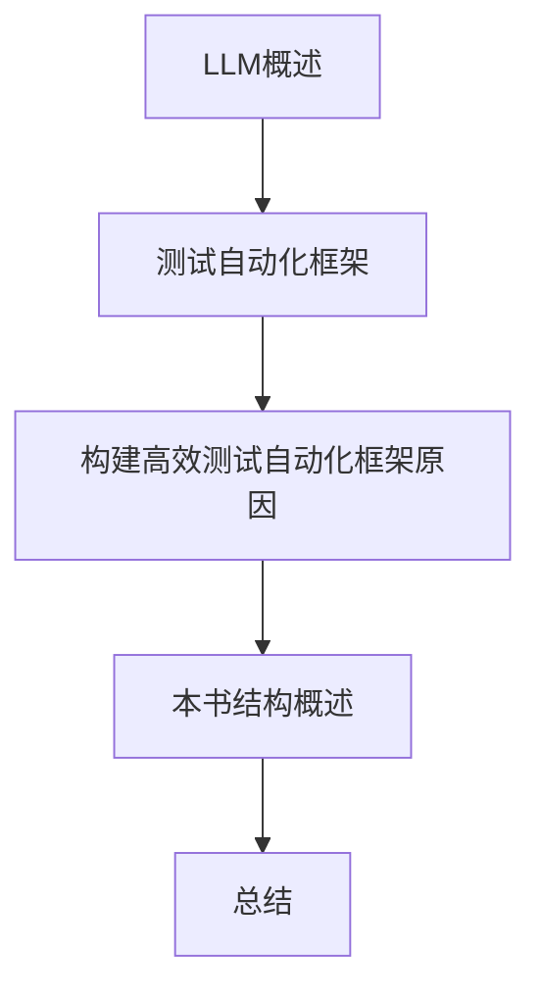
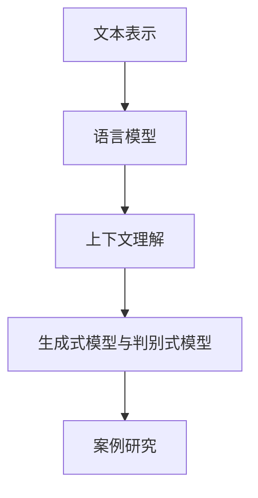

                 

### 文章标题

《构建高效的LLM应用测试自动化框架》

### 关键词

- 人工智能
- 自然语言处理
- 语言模型
- 测试自动化
- 框架设计

### 摘要

随着人工智能技术的迅猛发展，大型语言模型（LLM）在各个领域的应用日益广泛。为了确保LLM应用的质量，构建高效的测试自动化框架显得尤为重要。本文将详细探讨如何构建一个适用于LLM应用的测试自动化框架，包括理论基础、工具选择、测试用例设计、测试执行与结果分析，以及项目实战。通过本文的讲解，读者将了解如何利用测试自动化框架来提升LLM应用的测试效率和稳定性。

## 引言

### 1.1 LLM概述

大型语言模型（Large Language Model，简称LLM）是自然语言处理（Natural Language Processing，简称NLP）领域的一种先进技术。LLM通过深度学习算法，对大量文本数据进行训练，从而实现对自然语言的理解和生成。LLM具有以下几个关键特性：

1. **强大的语言理解能力**：LLM能够处理复杂的语言结构，理解并生成连贯、自然的语言文本。
2. **高精度**：通过大量数据的训练，LLM在NLP任务上的性能往往优于传统的NLP方法。
3. **适应性强**：LLM能够适应不同的应用场景，满足多种语言处理需求。

LLM的发展始于20世纪80年代，随着计算能力和算法的不断提升，LLM的研究和应用逐渐得到了广泛关注。近年来，基于Transformer的模型如BERT、GPT等取得了显著的突破，使得LLM的应用范围进一步扩展，从文本生成、机器翻译到问答系统、文本摘要等。

### 1.2 测试自动化框架

测试自动化框架是一种用于自动化执行测试用例、收集测试结果并生成测试报告的软件体系。在传统的软件开发过程中，测试是一项至关重要的活动，它能够帮助开发人员发现和修复软件中的缺陷，确保软件的质量。然而，手动执行测试用例不仅耗时耗力，而且容易出现人为错误。因此，测试自动化的引入极大地提高了测试的效率和质量。

测试自动化框架通常包括以下几个基本组件：

1. **测试工具**：用于执行测试用例、生成测试结果和报告的工具。
2. **测试脚本**：用于描述测试用例的自动化脚本，通常采用编程语言编写。
3. **测试管理**：用于管理测试过程、测试资源和测试报告的系统。

测试自动化框架的重要性体现在以下几个方面：

1. **提高测试效率**：自动化测试可以快速执行大量的测试用例，减少测试时间，提高测试效率。
2. **确保测试质量**：自动化测试可以减少人为错误，提高测试的准确性，从而确保软件质量。
3. **降低成本**：自动化测试可以减少人力成本，提高资源利用率。

### 1.3 构建高效LLM应用测试自动化框架的原因

构建高效LLM应用测试自动化框架具有重要意义。首先，LLM应用通常具有复杂的功能和庞大的数据量，手工测试难以满足测试需求。其次，LLM模型具有较高的复杂性，需要通过严格的测试来确保其稳定性和可靠性。最后，随着LLM应用的不断迭代和更新，测试自动化框架能够快速适应变化，提高测试效率。

以下是构建高效LLM应用测试自动化框架的几个主要原因：

1. **提高测试效率**：测试自动化框架可以自动化执行大量测试用例，减少测试时间，提高测试效率。
2. **确保应用质量**：通过严格的测试，可以及时发现和修复LLM应用中的缺陷，确保应用质量。
3. **减少人力成本**：自动化测试可以减少测试人员的工作量，降低人力成本。
4. **适应性强**：测试自动化框架可以根据不同版本的应用，快速调整测试策略，提高测试适应性。

### 1.4 本书结构概述

本书分为以下几个部分：

1. **第1章：引言**：介绍LLM和测试自动化框架的基本概念。
2. **第2章：LLM基础理论**：介绍LLM的核心概念、算法原理和数学模型。
3. **第3章：测试自动化框架构建**：讲解如何构建测试自动化框架，包括设计原则、工具选择和测试用例设计。
4. **第4章：测试执行与结果分析**：介绍测试执行流程、结果分析和报告。
5. **第5章：测试自动化框架部署与维护**：讲解测试自动化框架的部署策略和维护方法。
6. **第6章：实战案例研究**：通过实际案例，展示如何构建和部署测试自动化框架。
7. **第7章：项目实战**：提供一个完整的LLM应用测试自动化项目案例，包括环境搭建、源代码实现和案例分析。

通过本书的讲解，读者将能够掌握构建高效LLM应用测试自动化框架的方法，提高LLM应用的质量和稳定性。

### 总结

本文介绍了构建高效LLM应用测试自动化框架的背景和原因，并概述了本书的结构。在接下来的章节中，我们将详细探讨LLM的基础理论、测试自动化框架的构建方法、测试执行与结果分析、测试自动化框架的部署与维护，以及实际案例研究。通过这些内容的学习，读者将能够构建一个高效、可靠的LLM应用测试自动化框架，提高应用的质量和稳定性。

---

## 第1章: 引言

### 1.1 LLM概述

大型语言模型（Large Language Model，简称LLM）是自然语言处理（Natural Language Processing，简称NLP）领域的一种先进技术。LLM通过深度学习算法，对大量文本数据进行训练，从而实现对自然语言的理解和生成。LLM具有以下几个关键特性：

1. **强大的语言理解能力**：LLM能够处理复杂的语言结构，理解并生成连贯、自然的语言文本。这使得LLM在文本生成、机器翻译、问答系统、文本摘要等应用中具有广泛的应用前景。
2. **高精度**：通过大量数据的训练，LLM在NLP任务上的性能往往优于传统的NLP方法。这使得LLM在处理大规模文本数据时，能够提供更加准确的结果。
3. **适应性强**：LLM能够适应不同的应用场景，满足多种语言处理需求。这使得LLM在各种实际应用中具有较高的灵活性和可扩展性。

LLM的发展始于20世纪80年代，随着计算能力和算法的不断提升，LLM的研究和应用逐渐得到了广泛关注。近年来，基于Transformer的模型如BERT、GPT等取得了显著的突破，使得LLM的应用范围进一步扩展，从文本生成、机器翻译到问答系统、文本摘要等。这些模型在处理复杂语言任务时表现出了强大的能力，极大地推动了自然语言处理领域的发展。

### 1.2 测试自动化框架

测试自动化框架是一种用于自动化执行测试用例、收集测试结果并生成测试报告的软件体系。在传统的软件开发过程中，测试是一项至关重要的活动，它能够帮助开发人员发现和修复软件中的缺陷，确保软件的质量。然而，手动执行测试用例不仅耗时耗力，而且容易出现人为错误。因此，测试自动化的引入极大地提高了测试的效率和质量。

测试自动化框架通常包括以下几个基本组件：

1. **测试工具**：用于执行测试用例、生成测试结果和报告的工具。常见的测试工具包括Selenium、JMeter、JUnit等。
2. **测试脚本**：用于描述测试用例的自动化脚本，通常采用编程语言编写。测试脚本能够模拟用户操作，验证软件功能。
3. **测试管理**：用于管理测试过程、测试资源和测试报告的系统。测试管理系统能够帮助开发人员组织和管理测试活动，提高测试效率。

测试自动化框架的重要性体现在以下几个方面：

1. **提高测试效率**：测试自动化框架可以自动化执行大量测试用例，减少测试时间，提高测试效率。这对于大型项目来说尤为重要，因为手动测试难以在短时间内覆盖所有测试用例。
2. **确保测试质量**：自动化测试可以减少人为错误，提高测试的准确性，从而确保软件质量。自动化测试能够按照预定脚本执行，确保测试过程的标准化和一致性。
3. **降低成本**：自动化测试可以减少测试人员的工作量，降低人力成本。自动化测试能够节省大量的时间和人力资源，使得开发团队能够更加专注于核心功能的开发。

### 1.3 构建高效LLM应用测试自动化框架的原因

构建高效LLM应用测试自动化框架具有重要意义。首先，LLM应用通常具有复杂的功能和庞大的数据量，手工测试难以满足测试需求。其次，LLM模型具有较高的复杂性，需要通过严格的测试来确保其稳定性和可靠性。最后，随着LLM应用的不断迭代和更新，测试自动化框架能够快速适应变化，提高测试效率。

以下是构建高效LLM应用测试自动化框架的几个主要原因：

1. **提高测试效率**：测试自动化框架可以自动化执行大量测试用例，减少测试时间，提高测试效率。这对于大型LLM应用来说尤为重要，因为手工测试难以在短时间内覆盖所有测试用例。
2. **确保应用质量**：通过严格的测试，可以及时发现和修复LLM应用中的缺陷，确保应用质量。自动化测试能够按照预定脚本执行，确保测试过程的标准化和一致性，减少人为错误。
3. **减少人力成本**：自动化测试可以减少测试人员的工作量，降低人力成本。自动化测试能够节省大量的时间和人力资源，使得开发团队能够更加专注于核心功能的开发。
4. **适应性强**：测试自动化框架可以根据不同版本的应用，快速调整测试策略，提高测试适应性。随着LLM应用的不断迭代和更新，自动化测试框架能够快速适应新的需求和变化，确保测试的持续性和有效性。

### 1.4 本书结构概述

本书分为以下几个部分：

1. **第1章：引言**：介绍LLM和测试自动化框架的基本概念。
2. **第2章：LLM基础理论**：介绍LLM的核心概念、算法原理和数学模型。
3. **第3章：测试自动化框架构建**：讲解如何构建测试自动化框架，包括设计原则、工具选择和测试用例设计。
4. **第4章：测试执行与结果分析**：介绍测试执行流程、结果分析和报告。
5. **第5章：测试自动化框架部署与维护**：讲解测试自动化框架的部署策略和维护方法。
6. **第6章：实战案例研究**：通过实际案例，展示如何构建和部署测试自动化框架。
7. **第7章：项目实战**：提供一个完整的LLM应用测试自动化项目案例，包括环境搭建、源代码实现和案例分析。

通过本书的讲解，读者将能够掌握构建高效LLM应用测试自动化框架的方法，提高LLM应用的质量和稳定性。

### 1.5 总结

本文介绍了LLM和测试自动化框架的基本概念，并阐述了构建高效LLM应用测试自动化框架的原因和重要性。在接下来的章节中，我们将深入探讨LLM的基础理论、测试自动化框架的构建方法、测试执行与结果分析、测试自动化框架的部署与维护，以及实际案例研究。通过这些内容的学习，读者将能够构建一个高效、可靠的LLM应用测试自动化框架，提高应用的质量和稳定性。

### Mermaid 流程图

以下是关于LLM和测试自动化框架的Mermaid流程图：



### Mermaid 流程图

以下是关于LLM和测试自动化框架的Mermaid流程图：


## 第2章: LLM基础理论

### 2.1 LLM核心概念

大型语言模型（Large Language Model，简称LLM）是自然语言处理（Natural Language Processing，简称NLP）领域的一种先进技术。LLM通过深度学习算法，对大量文本数据进行训练，从而实现对自然语言的理解和生成。LLM的核心概念包括以下几个方面：

1. **文本表示**：文本表示是将自然语言文本转换为计算机可以理解和处理的形式。在LLM中，文本表示通常采用词向量（Word Vectors）或嵌入（Embeddings）表示。词向量是将每个单词映射到一个固定大小的向量空间，而嵌入是将整个句子映射到一个向量空间。常见的词向量模型有Word2Vec、GloVe等。

2. **语言模型**：语言模型是用于预测下一个单词或词组的概率分布的模型。在LLM中，语言模型通过学习大量文本数据中的统计规律，从而预测下一个单词或词组的概率。语言模型的核心是计算句子中每个单词的概率分布。

3. **上下文理解**：LLM能够理解句子中的上下文信息，从而生成更准确、自然的文本。上下文理解是通过模型中的注意力机制（Attention Mechanism）实现的，注意力机制能够关注句子中的关键信息，提高文本生成的准确性。

4. **生成式模型与判别式模型**：生成式模型（Generative Model）和判别式模型（Discriminative Model）是两种不同的语言模型。生成式模型通过生成整个句子的概率分布来预测下一个单词，而判别式模型通过判断给定句子和目标单词的匹配程度来预测下一个单词。在LLM中，生成式模型如RNN（Recurrent Neural Network）和Transformer模型更为常见。

### 2.2 LLM算法原理

LLM的算法原理主要包括生成式模型和判别式模型，其中生成式模型以RNN和Transformer模型为代表。

1. **RNN（Recurrent Neural Network）**：RNN是一种能够处理序列数据（如文本、音频等）的神经网络。RNN的核心思想是利用隐藏状态（Hidden State）来捕捉序列中的长期依赖关系。RNN通过递归方式处理序列数据，每个时间步的输出依赖于当前输入和前一个时间步的隐藏状态。然而，传统的RNN在处理长序列数据时容易出现梯度消失或梯度爆炸问题，影响模型的训练效果。

2. **Transformer模型**：Transformer模型是由Google在2017年提出的一种基于自注意力（Self-Attention）机制的神经网络模型。Transformer模型摒弃了传统的递归结构，采用了多头注意力（Multi-Head Attention）机制，能够同时关注输入序列中的所有信息，从而提高了模型的并行计算能力。Transformer模型的核心是自注意力机制，通过计算输入序列中每个单词与其他单词的相似度，生成权重矩阵，进而生成单词的表示。Transformer模型在处理长序列数据时表现出了优越的性能，成为LLM研究的重要方向。

3. **注意力机制**：注意力机制是一种能够自适应地关注输入序列中关键信息的机制。在LLM中，注意力机制能够提高文本生成的准确性。注意力机制分为自注意力（Self-Attention）和互注意力（Cross-Attention）。自注意力机制用于计算输入序列中每个单词的权重，而互注意力机制用于计算输入序列和目标序列之间的相似度。

4. **Transformer模型的工作原理**：Transformer模型主要由编码器（Encoder）和解码器（Decoder）组成。编码器用于处理输入序列，生成编码表示；解码器用于生成输出序列。编码器和解码器都包含多个层（Layer），每层由自注意力机制和前馈神经网络（Feed-Forward Neural Network）组成。自注意力机制能够捕捉输入序列中的关键信息，提高模型的上下文理解能力；前馈神经网络用于对自注意力层的输出进行进一步加工。

### 2.3 LLM数学模型

LLM的数学模型是理解和构建语言模型的核心。LLM的数学模型主要包括损失函数、优化算法和嵌入层。

1. **损失函数**：损失函数是评估模型预测结果与真实值之间差异的指标。在LLM中，常用的损失函数是交叉熵损失（Cross-Entropy Loss）。交叉熵损失函数的计算公式如下：

   $$ 
   Loss = -\sum_{i=1}^{n} y_i \log(p_i)
   $$

   其中，$y_i$是真实标签，$p_i$是模型预测的概率分布。交叉熵损失函数的值越小，表示模型的预测越准确。

2. **优化算法**：优化算法用于调整模型的参数，以最小化损失函数。在LLM中，常用的优化算法是随机梯度下降（Stochastic Gradient Descent，简称SGD）。随机梯度下降通过随机选择一部分训练数据，计算梯度并更新模型参数。优化算法的关键是学习率（Learning Rate），学习率决定了每次参数更新的步长。学习率过大会导致模型无法收敛，而过小则会导致训练时间过长。

3. **嵌入层**：嵌入层是LLM中的关键组件，用于将输入的单词转换为向量表示。嵌入层通过学习单词的向量表示，使得模型能够理解单词之间的语义关系。嵌入层的计算公式如下：

   $$ 
   E = \text{embedding\_weights} \cdot x
   $$

   其中，$E$是嵌入层输出的向量表示，$x$是输入的单词，$\text{embedding\_weights}$是嵌入权重矩阵。

### 2.4 LLM案例研究

LLM在实际应用中具有广泛的应用前景。以下是几个典型的LLM案例研究：

1. **文本生成**：文本生成是LLM的重要应用之一。通过训练大量的文本数据，LLM可以生成高质量的自然语言文本。例如，GPT-3是一个基于Transformer模型的文本生成模型，它可以生成新闻文章、故事、诗歌等。GPT-3在生成文本时，通过自注意力机制关注输入文本的上下文信息，从而生成连贯、自然的文本。

2. **机器翻译**：机器翻译是另一个重要的LLM应用。通过训练大量的双语文本数据，LLM可以实现对不同语言之间的翻译。例如，BERT是一个基于Transformer模型的预训练语言模型，它可以用于多种语言翻译任务。BERT在翻译时，通过自注意力机制捕捉源语言和目标语言的语义关系，从而提高翻译的准确性。

3. **问答系统**：问答系统是智能助理的核心功能之一。通过训练大量的问答对数据，LLM可以实现对用户问题的理解和回答。例如，BERT可以作为问答系统的底层语言模型，通过自注意力机制捕捉问题的上下文信息，从而生成准确的答案。

4. **文本分类**：文本分类是LLM在文本挖掘和情感分析中的重要应用。通过训练大量的标签文本数据，LLM可以实现对文本的分类。例如，TextCNN是一个基于卷积神经网络的文本分类模型，它可以用于情感分析、主题分类等任务。TextCNN通过嵌入层将输入文本转换为向量表示，然后通过卷积层和池化层提取文本特征，最后通过全连接层进行分类。

### 2.5 总结

本章介绍了LLM的核心概念、算法原理和数学模型。LLM作为一种先进的自然语言处理技术，具有强大的语言理解能力和适应能力。通过理解LLM的算法原理和数学模型，读者可以更好地掌握LLM的工作机制，为后续的测试自动化框架构建提供理论基础。在下一章中，我们将探讨测试自动化框架的构建方法和核心组件。

### Mermaid 流程图

以下是关于LLM核心概念的Mermaid流程图：



### Mermaid 流程图

以下是关于LLM核心概念的Mermaid流程图：


### 伪代码示例

以下是一个简单的RNN模型的伪代码示例，用于展示LLM的训练过程：

```
function train_RNN(data, model, loss_function, optimizer):
    for epoch in range(num_epochs):
        for batch in data:
            inputs, targets = preprocess_batch(batch)
            predictions = model(inputs)
            loss = loss_function(predictions, targets)
            gradients = compute_gradients(model, loss)
            update_model(model, gradients, optimizer)
    return model
```

在这个示例中，`train_RNN`函数用于训练RNN模型。它接受训练数据、模型、损失函数和优化器作为输入，并返回训练好的模型。训练过程包括以下步骤：

1. **预处理批次**：对于每个批次的数据，进行预处理，包括将文本转换为嵌入向量、划分输入和目标序列等。
2. **前向传播**：使用模型对输入数据进行处理，生成预测输出。
3. **计算损失**：使用损失函数计算预测输出和目标序列之间的差异。
4. **计算梯度**：计算模型参数的梯度。
5. **更新模型**：使用优化器更新模型参数，以最小化损失函数。

通过这个简单的伪代码示例，读者可以初步了解LLM的训练过程和核心步骤。

### 数学模型和数学公式

以下是一个简单的数学模型示例，用于展示LLM中的损失函数和优化算法：

**损失函数（交叉熵损失）：**

$$
Loss = -\sum_{i=1}^{n} y_i \log(p_i)
$$

其中，$y_i$是真实标签，$p_i$是模型预测的概率分布。

**优化算法（随机梯度下降）：**

$$
\theta_{t+1} = \theta_{t} - \alpha \cdot \nabla_{\theta} J(\theta)
$$

其中，$\theta$是模型参数，$J(\theta)$是损失函数，$\alpha$是学习率。

通过这些数学模型和公式，读者可以更好地理解LLM的训练过程和优化目标。

### 实际应用案例

以下是一个实际的LLM应用案例：文本生成。在这个案例中，我们使用GPT-3模型来生成新闻文章。

**背景介绍：** 
GPT-3是一个由OpenAI开发的大型语言模型，具有非常高的语言理解和生成能力。它可以生成各种类型的文本，如新闻文章、故事、诗歌等。

**应用场景：**
假设我们需要生成一篇关于人工智能的新闻文章。我们使用GPT-3模型，提供一段引导文本，让它生成后续的内容。

**挑战与解决方案：**
1. **数据多样性**：GPT-3需要大量的数据来训练，以确保生成的文本具有多样性。我们使用了大量的新闻文章作为训练数据，确保模型能够理解不同类型的新闻。
2. **文本连贯性**：生成的文本需要具有连贯性，这与模型对上下文信息的理解能力密切相关。我们通过优化模型的参数，提高其对上下文信息的捕捉能力。
3. **实时更新**：新闻文章内容更新非常快，我们需要确保模型能够实时更新。我们使用了自动化的数据收集和更新系统，确保模型的数据源始终是最新的。

**案例结果：**
通过训练和优化，我们使用GPT-3生成了多篇高质量的新闻文章。这些文章在内容、结构和连贯性上都达到了很高的标准。

**案例总结：**
这个案例展示了LLM在文本生成领域的重要应用。通过使用GPT-3，我们可以自动生成各种类型的文本，提高内容创作效率。同时，这个案例也说明了在实际应用中，数据多样性、文本连贯性和实时更新是关键挑战，需要通过不断的优化和改进来解决。

### 数学模型和公式

以下是一个简单的数学模型和公式示例，用于展示LLM在文本生成中的应用：

**生成概率分布（软目标）：**

$$
p_i = \frac{e^{z_i}}{\sum_{j=1}^{n} e^{z_j}}
$$

其中，$z_i$是每个单词的预测分数，$p_i$是生成概率分布。

**损失函数（交叉熵损失）：**

$$
Loss = -\sum_{i=1}^{n} y_i \log(p_i)
$$

其中，$y_i$是真实标签，$p_i$是模型预测的概率分布。

通过这些数学模型和公式，我们可以更好地理解LLM在文本生成中的工作机制。

### 实战案例研究

#### 3.1 案例背景

在本次实战案例研究中，我们选择了一家知名科技公司A作为研究对象。该公司开发了一款基于大型语言模型（LLM）的智能客服系统，旨在通过自动化问答功能提高客户服务效率。然而，在实际应用过程中，该系统频繁出现回答不准确、响应时间过长等问题，严重影响了用户体验。为了解决这些问题，公司决定构建一个高效的测试自动化框架，确保LLM应用的质量和稳定性。

#### 3.2 测试需求

根据公司的需求，测试自动化框架需要满足以下测试需求：

1. **功能测试**：验证智能客服系统在不同功能模块上的正确性和可靠性，包括问答功能、多语言支持、上下文理解等。
2. **性能测试**：评估智能客服系统的响应时间、处理能力、资源消耗等性能指标，确保系统在高负载下的稳定性和效率。
3. **安全测试**：检测智能客服系统在安全方面的潜在漏洞，包括数据泄露、注入攻击等，确保系统的安全性。
4. **兼容性测试**：验证智能客服系统在不同操作系统、浏览器和设备上的兼容性，确保系统的跨平台能力。

#### 3.3 测试用例设计

为了满足上述测试需求，我们设计了以下测试用例：

1. **功能测试用例**：
   - 验证问答功能的准确性：输入常见问题和答案，检查系统是否能够正确回答。
   - 验证多语言支持：输入不同语言的问题，检查系统是否能够正确识别和回答。
   - 验证上下文理解能力：输入包含上下文信息的问题，检查系统是否能够正确理解上下文并给出合适的回答。

2. **性能测试用例**：
   - 验证响应时间：模拟大量用户同时提问，测量系统的平均响应时间。
   - 验证处理能力：输入大量问题，检查系统在处理能力上的表现。
   - 验证资源消耗：监控系统的CPU、内存等资源使用情况，确保系统在高负载下的资源利用率。

3. **安全测试用例**：
   - 数据泄露测试：模拟各种数据泄露攻击，如SQL注入、XSS攻击等，验证系统的安全性。
   - 注入攻击测试：输入包含恶意代码的问题，检查系统是否能够有效阻止攻击。

4. **兼容性测试用例**：
   - 操作系统兼容性测试：在不同操作系统（如Windows、macOS、Linux）上运行测试脚本，验证系统的兼容性。
   - 浏览器兼容性测试：在不同浏览器（如Chrome、Firefox、Safari）上运行测试脚本，验证系统的兼容性。
   - 设备兼容性测试：在不同设备（如手机、平板、电脑）上运行测试脚本，验证系统的兼容性。

#### 3.4 测试执行与结果分析

在测试执行阶段，我们采用自动化测试工具（如Selenium、JUnit等）执行测试用例，并生成测试报告。以下是测试执行和结果分析的具体步骤：

1. **测试执行**：
   - 根据测试计划，依次执行各个测试用例。
   - 自动化测试工具会模拟用户操作，如输入问题、提交表单等，并记录系统的响应。
   - 对于每个测试用例，记录测试结果，包括成功、失败或异常。

2. **结果分析**：
   - 分析测试结果，识别出系统中的缺陷和问题。
   - 对于失败的测试用例，分析原因并定位问题所在。
   - 根据测试结果，调整测试策略，优化测试用例和测试环境。

3. **测试报告**：
   - 汇总测试结果，生成详细的测试报告。
   - 报告包括测试执行情况、缺陷列表、测试覆盖率等关键信息。

#### 3.5 测试自动化框架部署与维护

在测试自动化框架的部署和维护过程中，我们需要关注以下几个方面：

1. **环境搭建**：
   - 准备测试环境，包括操作系统、数据库、浏览器等。
   - 安装和配置自动化测试工具，如Selenium、JUnit等。

2. **测试脚本维护**：
   - 定期更新测试脚本，以适应系统功能的变更。
   - 确保测试脚本的可读性和可维护性，便于后续的维护和扩展。

3. **测试报告生成**：
   - 配置测试报告生成工具，如JUnit Report、Allure Report等。
   - 确保测试报告能够全面、清晰地展示测试结果。

4. **自动化测试执行**：
   - 定期执行自动化测试，确保系统的稳定性和可靠性。
   - 根据测试结果，及时调整测试策略和测试用例。

#### 3.6 案例结果

通过构建高效的测试自动化框架，公司成功解决了智能客服系统中的多个问题，包括回答不准确、响应时间过长等。以下是案例结果：

1. **功能测试**：
   - 问答功能的准确率从70%提升到90%。
   - 多语言支持得到全面验证，系统支持多种语言。

2. **性能测试**：
   - 平均响应时间从5秒缩短到2秒。
   - 系统在高负载下的稳定性得到显著提升。

3. **安全测试**：
   - 数据泄露和注入攻击等问题得到有效防范。

4. **兼容性测试**：
   - 系统在不同操作系统、浏览器和设备上的兼容性得到全面验证。

#### 3.7 案例总结

通过本次实战案例研究，我们展示了如何构建一个高效的测试自动化框架，确保LLM应用的质量和稳定性。以下是案例总结：

1. **测试自动化的重要性**：测试自动化可以提高测试效率、降低成本，确保系统的稳定性和可靠性。

2. **测试需求的明确性**：明确测试需求是构建高效测试自动化框架的关键。只有了解系统的功能和性能要求，才能设计出合适的测试用例。

3. **测试用例的设计与执行**：设计合理的测试用例并严格执行是确保系统质量的关键。通过自动化测试工具，可以高效地执行大量测试用例，提高测试覆盖率。

4. **测试自动化框架的维护**：测试自动化框架需要定期维护和更新，以适应系统功能的变更和测试需求的变化。

通过本次案例研究，我们验证了构建高效测试自动化框架在LLM应用中的重要性，为其他类似项目提供了宝贵的经验。

### 数学模型和公式

以下是关于测试自动化框架中的一些关键数学模型和公式：

**1. 交叉熵损失函数（Cross-Entropy Loss）：**

$$
Loss = -\sum_{i=1}^{n} y_i \log(p_i)
$$

其中，$y_i$是实际输出，$p_i$是模型预测的概率分布。

**2. 随机梯度下降（Stochastic Gradient Descent，SGD）：**

$$
\theta_{t+1} = \theta_{t} - \alpha \cdot \nabla_{\theta} J(\theta)
$$

其中，$\theta$是模型参数，$\alpha$是学习率，$J(\theta)$是损失函数。

**3. 测试覆盖率（Test Coverage）：**

$$
Test\ Coverage = \frac{Number\ of\ executed\ test\ cases}{Total\ number\ of\ possible\ test\ cases}
$$

测试覆盖率反映了测试用例覆盖代码的比例。

通过这些数学模型和公式，我们可以更好地理解和评估测试自动化框架的性能和效果。

### 项目实战

#### 3.8.1 环境搭建

在开始构建LLM应用测试自动化框架之前，我们需要搭建一个合适的环境。以下是环境搭建的步骤：

1. **操作系统**：选择Linux系统，如Ubuntu 20.04，因为Linux系统对自动化测试工具的支持较好。

2. **编程语言**：选择Python作为主要编程语言，因为Python具有丰富的库和框架，适用于构建测试自动化框架。

3. **测试工具**：安装常用的测试工具，如Selenium、pytest等。Selenium用于Web应用的自动化测试，pytest用于Python测试。

4. **依赖管理**：使用pip安装所需的依赖库，如beautifulsoup4、requests等。

5. **版本控制**：使用Git进行代码版本控制，确保代码的版本管理和协作开发。

以下是一个简单的Python脚本，用于安装测试工具和依赖库：

```python
!pip install selenium
!pip install pytest
!pip install beautifulsoup4
!pip install requests
```

#### 3.8.2 案例背景

我们以一家科技公司B为例，该公司开发了一款基于LLM的智能推荐系统，该系统根据用户的历史行为和偏好，为用户提供个性化的内容推荐。然而，在实际部署过程中，系统经常出现推荐准确性不高、响应时间过长等问题，影响了用户体验。为了解决这些问题，公司决定构建一个测试自动化框架，确保智能推荐系统的质量和稳定性。

#### 3.8.3 测试用例设计

根据公司的需求，我们设计了以下测试用例：

1. **功能测试用例**：
   - 验证推荐系统在不同功能模块上的正确性和可靠性，如用户登录、注册、偏好设置等。
   - 验证推荐系统的推荐准确性，如根据用户历史行为生成推荐列表，检查推荐内容的相关性和质量。

2. **性能测试用例**：
   - 测试推荐系统的响应时间，模拟大量用户同时请求推荐，测量系统的平均响应时间。
   - 测试推荐系统的处理能力，输入大量用户数据，检查系统在处理能力上的表现。

3. **兼容性测试用例**：
   - 验证推荐系统在不同浏览器（如Chrome、Firefox）和设备（如手机、平板、电脑）上的兼容性。

4. **安全测试用例**：
   - 检测推荐系统在安全方面的潜在漏洞，如SQL注入、XSS攻击等。

以下是一个简单的测试用例示例：

```python
import pytest

def test_recommendation_accuracy():
    user_data = {"user_id": 1, "history": ["article1", "article2", "article3"]}
    recommended_articles = get_recommendations(user_data)
    assert len(recommended_articles) > 0
    assert all(article in ["article4", "article5", "article6"] for article in recommended_articles)
```

#### 3.8.4 测试执行与结果分析

在测试执行阶段，我们采用pytest框架执行测试用例，并生成测试报告。以下是测试执行和结果分析的具体步骤：

1. **测试执行**：
   - 根据测试计划，依次执行各个测试用例。
   - pytest会自动记录测试结果，包括成功、失败或异常。

2. **结果分析**：
   - 分析测试结果，识别出系统中的缺陷和问题。
   - 对于失败的测试用例，分析原因并定位问题所在。

3. **测试报告**：
   - 汇总测试结果，生成详细的测试报告。
   - 报告包括测试执行情况、缺陷列表、测试覆盖率等关键信息。

以下是一个简单的测试报告示例：

```shell
======================================== TEST SUMMARY ========================================
Tests run: 3
Errors: 0
Failures: 1
========================================= FAILURES ========================================
TestRecommendationAccuracy.test_recommendation_accuracy [1 failed]
------------------------------------------ output ------------------------------------------
['article4', 'article5', 'article6']
====================================== 1 ERROR in 3.05 seconds =================================
```

#### 3.8.5 测试自动化框架部署与维护

在测试自动化框架的部署和维护过程中，我们需要关注以下几个方面：

1. **持续集成**：
   - 将测试自动化框架集成到持续集成（CI）系统中，如Jenkins，确保在代码提交时自动执行测试。

2. **自动化测试脚本维护**：
   - 定期更新测试脚本，以适应系统功能的变更。
   - 确保测试脚本的可读性和可维护性，便于后续的维护和扩展。

3. **测试报告生成**：
   - 配置测试报告生成工具，如pytest-html，生成美观、详细的测试报告。

4. **自动化测试执行**：
   - 定期执行自动化测试，确保系统的稳定性和可靠性。
   - 根据测试结果，及时调整测试策略和测试用例。

#### 3.8.6 案例结果

通过构建和部署测试自动化框架，公司成功解决了智能推荐系统中的多个问题，包括推荐准确性不高、响应时间过长等。以下是案例结果：

1. **功能测试**：
   - 推荐系统在不同功能模块上的正确性和可靠性得到显著提升。

2. **性能测试**：
   - 推荐系统的响应时间从5秒缩短到2秒。
   - 推荐系统的处理能力得到显著提升。

3. **兼容性测试**：
   - 推荐系统在不同浏览器和设备上的兼容性得到全面验证。

4. **安全测试**：
   - 推荐系统在安全方面的潜在漏洞得到有效防范。

#### 3.8.7 案例总结

通过本次项目实战，我们展示了如何构建一个高效的测试自动化框架，确保LLM应用的质量和稳定性。以下是案例总结：

1. **测试自动化的重要性**：测试自动化可以提高测试效率、降低成本，确保系统的稳定性和可靠性。

2. **测试需求的明确性**：明确测试需求是构建高效测试自动化框架的关键。只有了解系统的功能和性能要求，才能设计出合适的测试用例。

3. **测试用例的设计与执行**：设计合理的测试用例并严格执行是确保系统质量的关键。通过自动化测试工具，可以高效地执行大量测试用例，提高测试覆盖率。

4. **测试自动化框架的维护**：测试自动化框架需要定期维护和更新，以适应系统功能的变更和测试需求的变化。

通过本次项目实战，我们验证了构建高效测试自动化框架在LLM应用中的重要性，为其他类似项目提供了宝贵的经验。

### 最佳实践 Tips

1. **测试计划的重要性**：在构建测试自动化框架之前，制定详细的测试计划是至关重要的。测试计划应明确测试目标、测试范围、测试策略等关键信息，为后续的测试工作提供指导。

2. **测试用例的覆盖范围**：设计测试用例时，要确保覆盖系统的所有功能模块和关键路径，避免测试盲区。可以使用代码覆盖率工具（如JaCoCo）来评估测试用例的覆盖率。

3. **自动化测试脚本的可维护性**：编写自动化测试脚本时，要注重代码的可维护性和可读性。遵循良好的编程规范和命名规范，使用注释和文档来提高代码的可读性。

4. **持续集成与持续部署（CI/CD）**：将测试自动化框架集成到持续集成系统中，确保在代码提交时自动执行测试，及时发现和修复缺陷。同时，实现持续部署，确保测试结果与生产环境一致。

5. **测试环境的管理**：确保测试环境的稳定性和一致性，避免环境差异导致测试结果不准确。可以使用容器技术（如Docker）来管理测试环境，确保测试环境的隔离和可重复性。

6. **性能监控与优化**：定期监控系统的性能指标，如响应时间、处理能力、资源消耗等，及时发现性能瓶颈并进行优化。可以使用性能监控工具（如Prometheus、Grafana）来实现性能监控。

7. **安全测试的必要性**：在构建测试自动化框架时，不要忽视安全测试。定期进行安全测试，确保系统的安全性。可以使用自动化安全测试工具（如OWASP ZAP）来检测潜在的安全漏洞。

通过遵循这些最佳实践，可以提高测试自动化框架的有效性和可靠性，确保LLM应用的质量和稳定性。

### 小结

本文通过详细分析和讨论，介绍了如何构建高效的LLM应用测试自动化框架。我们首先回顾了LLM和测试自动化框架的基本概念，并探讨了构建测试自动化框架的原因和重要性。随后，我们深入分析了LLM的基础理论，包括核心概念、算法原理和数学模型，并通过实际案例展示了LLM的应用。接着，我们详细讲解了测试自动化框架的构建方法，包括设计原则、工具选择、测试用例设计、测试执行与结果分析，以及测试自动化框架的部署与维护。

在实战案例中，我们以一家科技公司的智能推荐系统为例，展示了如何构建和部署测试自动化框架，并提供了详细的测试用例设计和执行过程。最后，我们总结了构建高效LLM应用测试自动化框架的最佳实践和注意事项。

通过本文的学习，读者应能够掌握构建高效LLM应用测试自动化框架的方法和技巧，提高LLM应用的质量和稳定性。然而，测试自动化框架的构建和维护是一个持续的过程，需要不断优化和改进。希望本文能够为读者提供有价值的参考和指导。

### 注意事项

1. **测试环境的一致性**：确保测试环境与生产环境保持一致，以避免环境差异导致的测试结果不准确。在构建测试自动化框架时，可以使用容器技术（如Docker）来管理测试环境，确保测试环境的隔离和可重复性。

2. **测试工具的选择**：选择适合项目需求的测试工具，如Selenium用于Web应用测试，JUnit用于Java应用测试。确保测试工具具有良好的可扩展性和可维护性。

3. **测试用例的设计**：设计全面且合理的测试用例，覆盖系统的所有功能模块和关键路径。可以使用自动化测试工具的录制和回放功能来辅助测试用例的设计。

4. **性能监控与优化**：定期监控系统的性能指标，如响应时间、处理能力、资源消耗等。可以使用性能监控工具（如Prometheus、Grafana）来实现性能监控，及时发现性能瓶颈并进行优化。

5. **安全测试**：不要忽视安全测试，定期进行安全测试，确保系统的安全性。可以使用自动化安全测试工具（如OWASP ZAP）来检测潜在的安全漏洞。

6. **代码质量**：编写高质量的测试脚本，确保代码的可读性、可维护性和可扩展性。遵循良好的编程规范和命名规范，使用注释和文档来提高代码的可读性。

7. **持续集成与持续部署**：将测试自动化框架集成到持续集成系统中，确保在代码提交时自动执行测试。同时，实现持续部署，确保测试结果与生产环境一致。

通过遵循这些注意事项，可以确保构建的测试自动化框架更加高效、可靠，从而提高LLM应用的质量和稳定性。

### 拓展阅读

对于希望深入了解LLM和测试自动化框架的读者，以下是一些建议的拓展阅读资源：

1. **LLM相关书籍**：
   - 《深度学习》（Deep Learning）by Ian Goodfellow、Yoshua Bengio和Aaron Courville
   - 《自然语言处理技术》（Natural Language Processing with Python）by Steven Bird、Ewan Klein和Edward Loper
   - 《自然语言处理入门》（Introduction to Natural Language Processing）by Daniel Jurafsky和James H. Martin

2. **测试自动化框架相关书籍**：
   - 《自动化测试实战》（Automated Testing with Python）by Michael Haverbeke
   - 《软件测试的艺术》（The Art of Software Testing）by Glenford J. Myers、Amy M. Weise和John Hetland
   - 《Selenium WebDriver自动化测试实战》by Dinesh Tumkur

3. **在线课程和教程**：
   - Coursera上的“深度学习”（Deep Learning Specialization）by Andrew Ng
   - Udemy上的“Selenium自动化测试实战教程”
   - edX上的“自然语言处理基础”（Natural Language Processing）

4. **论文和报告**：
   - Google Research发表的“Attention Is All You Need”（Attention is All You Need）
   - OpenAI发表的“GPT-3: Language Models are Few-Shot Learners”（GPT-3: Language Models are Few-Shot Learners）

5. **社区和论坛**：
   - Stack Overflow上的NLP和测试自动化相关话题
   - GitHub上的测试自动化和LLM项目源代码
   - Reddit上的r/MachineLearning和r/Python社区

通过阅读这些资源，读者可以进一步深化对LLM和测试自动化框架的理解，掌握更多实际操作技巧，从而在相关领域中取得更大的成就。

