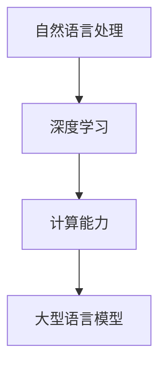
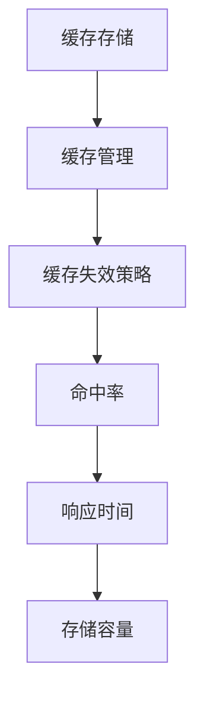

                 

### 第1章: 引言与核心概念

#### 1.1 LLM基础

**背景介绍**

大型语言模型（LLM, Large Language Model）是一种人工智能模型，能够理解和生成自然语言。近年来，随着深度学习和计算能力的飞速发展，LLM在自然语言处理（NLP）领域取得了显著成就。LLM不仅能够进行文本生成、翻译、摘要等任务，还能够进行问答、对话生成等复杂应用。

**核心概念与联系**

- **自然语言处理（NLP）**：NLP是使计算机能够理解和处理人类语言的技术。LLM是NLP的一个重要分支。
- **深度学习**：深度学习是构建LLM的基础，通过多层神经网络来提取文本特征。
- **计算能力**：强大的计算能力是训练和运行LLM的关键。

**Mermaid流程图**

下面是一个简单的Mermaid流程图，展示了LLM与其他概念之间的关系：



#### 1.2 缓存技术概述

**核心概念与联系**

- **缓存（Cache）**：缓存是一种快速存储，用于临时保存经常访问的数据。
- **基本原理**：缓存的基本原理是减少频繁访问的数据的访问时间，从而提高系统性能。
- **应用领域**：缓存技术广泛应用于各种应用，如Web缓存、数据库缓存、应用程序缓存等。

**核心算法原理讲解**

为了更好地理解缓存技术，我们可以使用Python源代码来解释缓存的基本原理。以下是一个简单的缓存实现：

```python
# Python代码：简单缓存实现

class SimpleCache:
    def __init__(self, capacity):
        self.capacity = capacity
        self.cache = {}

    def get(self, key):
        if key in self.cache:
            return self.cache[key]
        else:
            return None

    def set(self, key, value):
        if len(self.cache) >= self.capacity:
            oldest_key = next(iter(self.cache))
            del self.cache[oldest_key]
        self.cache[key] = value

# 测试代码
cache = SimpleCache(2)
cache.set('key1', 'value1')
cache.set('key2', 'value2')
print(cache.get('key1'))  # 输出：value1
print(cache.get('key2'))  # 输出：value2
```

**数学模型和公式**

缓存的有效性可以通过命中率（Hit Rate）来衡量：

$$
\text{命中率} = \frac{\text{缓存中命中的请求次数}}{\text{总请求次数}}
$$

#### 核心概念与联系

- **缓存机制**：缓存机制包括缓存存储、缓存管理和缓存失效策略。
- **性能指标**：性能指标包括命中率、响应时间和存储容量。

**Mermaid流程图**

下面是一个简单的Mermaid流程图，展示了缓存机制与性能指标之间的关系：



### 1.3 文章关键词

- **LLM（Large Language Model）**
- **缓存（Cache）**
- **自然语言处理（NLP）**
- **深度学习**
- **计算能力**

### 1.4 文章摘要

本文介绍了大型语言模型（LLM）和缓存技术的基本概念。首先，我们探讨了LLM的背景、核心概念及其与自然语言处理、深度学习和计算能力的关系。然后，我们详细讲解了缓存技术的原理、核心算法原理，并使用Python代码进行了示例。最后，我们通过Mermaid流程图展示了LLM和缓存技术之间的联系，并列举了文章的关键词。这篇文章为后续章节的讨论奠定了基础。

