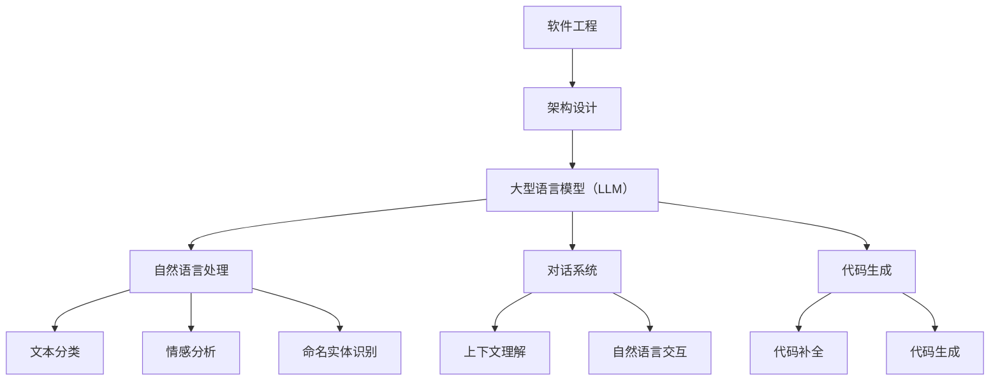
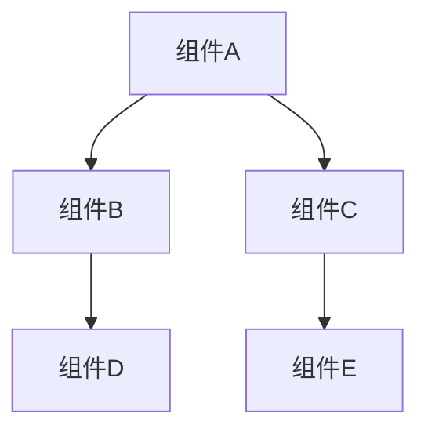

                 

# 《构建高效的工程技术架构：LLM应用开发的基石》

## 关键词
- 工程技术架构
- 大型语言模型（LLM）
- 软件工程
- 高效性
- 应用开发

## 摘要
本文旨在深入探讨构建高效工程技术架构的核心要素，特别是大型语言模型（LLM）在软件应用开发中的关键作用。文章从软件工程的发展历程出发，逐步介绍LLM的核心概念与架构，详细讲解其核心算法原理和数学模型，并通过实战案例展示如何将LLM应用于实际项目开发中。文章旨在为开发者提供一套系统的架构设计原则和最佳实践，以提升LLM在软件工程中的应用效率和效果。

## 引言

在当今的软件工程领域，随着人工智能（AI）技术的迅猛发展，尤其是大型语言模型（Large Language Models, LLM）的崛起，我们迎来了一个全新的时代。LLM作为深度学习的杰作，已经在自然语言处理（NLP）、对话系统、代码生成等领域展现出巨大的潜力。然而，如何高效地利用LLM构建软件应用，实现工程技术的优化，成为当前软件工程师面临的一个重要课题。

本文将围绕这一主题，系统性地分析LLM在工程技术架构中的应用，旨在为开发者提供一套完整的架构设计原则和实践指南。文章结构如下：

1. **软件工程与LLM架构基础**：介绍软件工程的发展历程，定义LLM及其核心原理，阐述LLM在软件工程中的应用。
2. **核心算法原理讲解**：通过Python源代码和数学模型，深入讲解LLM的核心算法原理。
3. **数学模型和数学公式讲解**：使用LaTeX格式详细阐述与LLM相关的数学模型和公式。
4. **项目实战**：设计实战案例，包括开发环境搭建、源代码实现和解读。
5. **未来展望与挑战**：探讨LLM技术的发展趋势及在软件工程中的潜在影响。

通过本文的探讨，我们期望能够帮助开发者理解LLM在软件应用开发中的关键作用，掌握高效的工程技术架构设计原则，从而提升软件开发的效率和效果。

## 第1章：软件工程与LLM架构基础

### 1.1 软件工程的发展历程

软件工程的发展可以追溯到20世纪50年代末和60年代初，当时计算机技术刚刚起步，软件开发主要以手工作坊的方式进行。随着计算机硬件和软件技术的不断进步，软件工程的定义和方法也在逐步演变。20世纪60年代至70年代，软件工程的主要目标是提高软件开发的生产效率和代码质量，这一时期的代表性方法有结构化设计、模块化编程等。

进入20世纪80年代，面向对象编程（OOP）开始崭露头角，其核心思想是将软件设计成一系列相互独立的对象，从而提高了代码的可复用性和可维护性。20世纪90年代，随着互联网的普及，软件工程进入了分布式系统时代，开发人员开始关注系统架构、分布式计算和安全性等问题。

21世纪初，随着大数据、云计算和人工智能技术的发展，软件工程迎来了新的挑战和机遇。在这一时期，DevOps、微服务架构等新兴方法逐渐流行，开发人员更加注重软件的敏捷性、可扩展性和可靠性。

### 1.2 语言模型（LLM）的概念与原理

语言模型是一种用于预测文本序列的算法，它通过对大规模语料库的学习，可以生成符合语言规则和语义逻辑的文本。LLM（Large Language Model）是指大规模的语言模型，其特点是模型参数数量巨大，训练数据量丰富，从而具备较高的预测能力和泛化能力。

LLM的工作原理基于深度学习技术，特别是变分自编码器（VAE）和递归神经网络（RNN）的发展。LLM通过多层神经网络结构，对输入文本进行编码和解码，生成预测的文本序列。具体来说，LLM首先对输入文本进行词嵌入处理，将文本转化为密集的向量表示。然后，通过前向传播和反向传播算法，更新网络权重，优化模型参数。

### 1.3 LLM在软件工程中的应用

LLM在软件工程中的应用日益广泛，尤其在自然语言处理（NLP）、对话系统和代码生成等领域表现出色。以下是一些典型的应用场景：

1. **自然语言处理（NLP）**：LLM可以用于文本分类、情感分析、命名实体识别等任务，为软件开发提供自然语言理解和生成能力。例如，在智能客服系统中，LLM可以帮助构建能够理解和回应用户问题的对话界面。

2. **对话系统**：LLM在对话系统中扮演着关键角色，可以实现自然语言交互和上下文理解。通过LLM，对话系统能够提供更加流畅、人性化的用户体验。

3. **代码生成**：LLM可以用于代码补全、代码生成等任务，提高开发效率和代码质量。例如，GitHub Copilot 等工具就是利用LLM技术，根据开发者编写的代码片段自动生成相应的代码。

### 1.4 Mermaid流程图展示

以下是一个简单的Mermaid流程图，展示了AI大模型与软件2.0架构的联系：



通过这个流程图，我们可以清晰地看到LLM在软件2.0架构中的应用场景，以及其与NLP、对话系统和代码生成等领域的紧密联系。

## 第2章：核心算法原理讲解

### 2.1 语言模型的基本架构

语言模型的核心是神经网络架构，特别是递归神经网络（RNN）和Transformer模型。RNN通过其在序列数据上的处理能力，使得语言模型能够捕捉到文本中的长期依赖关系。而Transformer模型则通过其自注意力机制，实现了对输入文本的并行处理，从而在模型效率和性能上取得了显著提升。

以下是一个简单的Transformer模型的Python伪代码实现：

```python
import tensorflow as tf

# 定义超参数
vocab_size = 10000
embedding_dim = 512
num_heads = 8
ffn_dim = 2048
max_length = 512
dropout_rate = 0.1

# 嵌入层
inputs = tf.keras.layers.Embedding(vocab_size, embedding_dim)(inputs)

# 多层自注意力机制
for _ in range(num_heads):
    attention = tf.keras.layers.MultiHeadAttention(num_heads=num_heads, key_dim=embedding_dim)(inputs, inputs)
    inputs = tf.keras.layers.Dropout(dropout_rate)(attention)
    inputs = tf.keras.layers.LayerNormalization(epsilon=1e-6)(inputs + inputs)

# 前馈神经网络
inputs = tf.keras.layers.Dense(ffn_dim, activation='relu')(inputs)
inputs = tf.keras.layers.Dense(embedding_dim)(inputs)
inputs = tf.keras.layers.Dropout(dropout_rate)(inputs)
inputs = tf.keras.layers.LayerNormalization(epsilon=1e-6)(inputs + inputs)

# 输出层
outputs = tf.keras.layers.Dense(vocab_size)(inputs)
```

### 2.2 机器学习算法与优化

在构建语言模型时，机器学习算法的选择和优化至关重要。常用的机器学习算法包括梯度下降（Gradient Descent）、Adam优化器等。梯度下降是一种最简单的优化算法，它通过不断调整模型参数，使得损失函数逐渐减小。而Adam优化器则结合了梯度下降和动量方法，在处理高维数据和噪声较大的任务时表现出色。

以下是一个使用Adam优化器的Python伪代码实现：

```python
optimizer = tf.keras.optimizers.Adam(learning_rate=1e-4)

# 定义损失函数
loss_function = tf.keras.losses.SparseCategoricalCrossentropy(from_logits=True)

# 编写训练循环
for epoch in range(num_epochs):
    for batch in dataset:
        with tf.GradientTape() as tape:
            predictions = model(batch['inputs'])
            loss = loss_function(batch['targets'], predictions)
        gradients = tape.gradient(loss, model.trainable_variables)
        optimizer.apply_gradients(zip(gradients, model.trainable_variables))
        if batch % 100 == 0:
            print(f"Epoch {epoch}, Loss: {loss.numpy()}")

# 评估模型
test_loss = loss_function(test_targets, model(test_inputs))
print(f"Test Loss: {test_loss.numpy()}")
```

### 2.3 LLM的预训练与微调

LLM的预训练与微调是模型训练过程中两个关键步骤。预训练是指使用大规模语料库对模型进行初步训练，使得模型具备一定的语言理解和生成能力。微调则是在预训练模型的基础上，针对特定任务进行进一步的训练，以优化模型在特定领域的表现。

以下是一个简单的预训练与微调流程：

```python
# 预训练
model = transformers.TFDistilBertModel.from_pretrained('distilbert-base-uncased')
pretrainer = tf.keras.Sequential([
    model,
    tf.keras.layers.Dense(1, activation='sigmoid')
])

pretrainer.compile(optimizer='adam', loss='binary_crossentropy', metrics=['accuracy'])
pretrainer.fit(train_data, train_labels, epochs=num_pretrain_epochs)

# 微调
model = transformers.TFDistilBertModel.from_pretrained('distilbert-base-uncased')
model.add(tf.keras.layers.Dense(1, activation='sigmoid'))

model.compile(optimizer='adam', loss='binary_crossentropy', metrics=['accuracy'])
model.fit(train_data, train_labels, validation_data=validation_data, epochs=num_finetune_epochs)

# 评估模型
test_loss, test_accuracy = model.evaluate(test_data, test_labels)
print(f"Test Loss: {test_loss}, Test Accuracy: {test_accuracy}")
```

通过以上代码，我们可以看到预训练和微调的具体实现过程。预训练使用预训练好的DistilBERT模型，并在此基础上添加一层输出层进行分类任务。微调过程则是进一步调整模型参数，以优化模型在特定任务上的表现。

## 第3章：数学模型和数学公式讲解

### 3.1 神经网络与矩阵运算

神经网络的工作原理离不开矩阵运算。矩阵运算在神经网络中扮演着核心角色，包括权重矩阵的初始化、激活函数的计算、前向传播和反向传播等。以下是一些关键的矩阵运算和数学公式：

#### 权重矩阵初始化

在神经网络中，权重矩阵的初始化是一个重要的步骤。常用的初始化方法包括随机初始化、高斯分布初始化和He初始化等。以下是一个使用He初始化的Python代码示例：

```python
import tensorflow as tf

def he_init(shape, dtype=tf.float32):
    fan_in, _ = shape
    s = tf.sqrt(2 / fan_in)
    return tf.random.normal(shape, stddev=s, dtype=dtype)

# 创建权重矩阵
weights = he_init([input_dim, output_dim])
```

#### 激活函数

激活函数是神经网络中另一个重要的组成部分。常用的激活函数包括Sigmoid、ReLU和Tanh等。以下是一个ReLU激活函数的Python代码示例：

```python
import tensorflow as tf

def relu(x):
    return tf.maximum(0.0, x)

# 应用ReLU激活函数
x = tf.constant([-2, 0, 2])
output = relu(x)
print(output.numpy())
```

#### 前向传播

前向传播是指将输入数据通过神经网络逐层计算，最终得到输出结果的过程。以下是一个简单的Python代码示例：

```python
import tensorflow as tf

# 定义输入、权重和偏置
input_data = tf.random.normal([batch_size, input_dim])
weights = he_init([input_dim, hidden_dim])
biases = tf.random.normal([hidden_dim])

# 前向传播
hidden_layer = tf.matmul(input_data, weights) + biases
output = relu(hidden_layer)
```

#### 反向传播

反向传播是指通过计算输出误差，反向更新网络权重和偏置的过程。以下是一个简单的Python代码示例：

```python
import tensorflow as tf

# 定义输入、权重、偏置和输出
input_data = tf.random.normal([batch_size, input_dim])
weights = he_init([input_dim, hidden_dim])
biases = tf.random.normal([hidden_dim])
output = tf.random.normal([batch_size, output_dim])

# 前向传播
hidden_layer = tf.matmul(input_data, weights) + biases
output_layer = relu(hidden_layer)

# 计算误差
error = output - output_layer

# 计算梯度
gradient_weights = tf.matmul(input_data, error)
gradient_biases = error

# 更新权重和偏置
weights -= learning_rate * gradient_weights
biases -= learning_rate * gradient_biases
```

### 3.2 损失函数与优化策略

在神经网络训练过程中，损失函数和优化策略起着至关重要的作用。损失函数用于衡量模型预测值与真实值之间的差异，而优化策略则用于调整模型参数，以最小化损失函数。

以下是一些常用的损失函数和优化策略：

#### 损失函数

1. **均方误差（MSE）**：用于回归任务，计算预测值与真实值之间差的平方的平均值。

   $$MSE = \frac{1}{n}\sum_{i=1}^{n}(y_i - \hat{y}_i)^2$$

2. **交叉熵（Cross-Entropy）**：用于分类任务，计算预测概率与真实概率之间的差异。

   $$Cross-Entropy = -\sum_{i=1}^{n}y_i \log(\hat{y}_i)$$

#### 优化策略

1. **梯度下降（Gradient Descent）**：最简单的优化策略，通过计算损失函数的梯度，逐步更新模型参数。

   $$\theta = \theta - \alpha \nabla_\theta J(\theta)$$

2. **动量法（Momentum）**：在梯度下降的基础上，引入动量项，加速收敛速度。

   $$v = \beta v + (1 - \beta) \nabla_\theta J(\theta)$$
   $$\theta = \theta - \alpha v$$

3. **Adam优化器**：结合了动量法和自适应学习率的思想，适用于高维数据和噪声较大的任务。

   $$m = \beta_1 g + (1 - \beta_1) \nabla_\theta J(\theta)$$
   $$v = \beta_2 g + (1 - \beta_2) \nabla_\theta J(\theta)$$
   $$\theta = \theta - \alpha \frac{m}{\sqrt{1 - \beta_2^T}}$$

### 3.3 概率论与信息论基础

概率论和信息论在神经网络和深度学习中有着广泛的应用。以下是一些基本的概率论和信息论概念：

#### 概率分布

1. **伯努利分布（Bernoulli Distribution）**：用于二分类问题，概率分布为{0, 1}。

   $$P(X = x) = p^x (1 - p)^{1 - x}$$

2. **高斯分布（Gaussian Distribution）**：用于连续型数据的概率分布。

   $$P(X = x) = \frac{1}{\sqrt{2\pi\sigma^2}} e^{-\frac{(x - \mu)^2}{2\sigma^2}}$$

#### 信息论

1. **熵（Entropy）**：表示随机变量不确定性的度量。

   $$H(X) = -\sum_{i=1}^{n} p(x_i) \log_2 p(x_i)$$

2. **条件熵（Conditional Entropy）**：表示在给定另一个随机变量条件下，不确定性减少的程度。

   $$H(X|Y) = -\sum_{i=1}^{n} p(y_i) \sum_{j=1}^{m} p(x_j|y_i) \log_2 p(x_j|y_i)$$

3. **互信息（Mutual Information）**：表示两个随机变量之间相互依赖程度的度量。

   $$I(X; Y) = H(X) - H(X|Y)$$

以上是概率论和信息论的一些基本概念，它们在深度学习中的很多应用中都有重要的意义，如正则化、优化策略等。

通过以上数学模型和公式的讲解，我们可以更好地理解神经网络和深度学习的基本原理，为实际应用打下坚实的基础。

## 第4章：高效工程技术架构设计

### 4.1 架构设计原则

高效工程技术架构的设计需要遵循一系列基本原则，以确保系统的高性能、可扩展性和可维护性。以下是几个核心的架构设计原则：

1. **模块化与组件化**：将系统划分为多个模块和组件，每个模块和组件独立运行，从而提高系统的可维护性和可扩展性。
2. **解耦**：通过解耦各个模块之间的依赖关系，降低系统之间的耦合度，提高系统的灵活性和可扩展性。
3. **可扩展性**：设计时需要考虑系统的未来扩展需求，确保系统能够无缝地扩展，以适应不断变化的需求。
4. **性能优化**：针对系统的性能瓶颈进行优化，确保系统能够高效地运行，提供良好的用户体验。
5. **容错性**：设计时需要考虑系统的容错能力，确保在遇到故障时系统能够快速恢复，减少对业务的影响。

### 4.2 模块化与组件化

模块化和组件化是高效工程技术架构设计的重要组成部分。通过将系统分解为独立的模块和组件，可以显著提高系统的可维护性和可扩展性。

#### 模块化

模块化是指将系统划分为多个独立的模块，每个模块负责实现特定的功能。模块之间通过定义良好的接口进行通信，从而降低了模块之间的依赖关系。

以下是一个简单的模块化架构示例：


在这个示例中，模块A、B、C和D各自实现不同的功能，通过接口进行通信。这种模块化的设计使得每个模块可以独立开发、测试和部署，从而提高了系统的可维护性和可扩展性。

#### 组件化

组件化是将系统划分为多个独立的组件，每个组件实现特定的功能，并且可以独立运行。组件之间通过标准化的接口进行通信，从而实现了系统的解耦。

以下是一个简单的组件化架构示例：



在这个示例中，组件A、B、C和D各自实现不同的功能，并且可以独立运行。组件之间的通信通过标准化的接口进行，从而实现了系统的解耦和可扩展性。

### 4.3 可扩展性与可维护性

可扩展性和可维护性是高效工程技术架构设计的关键目标。以下是一些确保系统具有良好可扩展性和可维护性的最佳实践：

1. **微服务架构**：采用微服务架构，将系统划分为多个独立的服务，每个服务负责特定的业务功能。这种架构设计使得系统可以轻松扩展和更新，同时提高了系统的可靠性和灵活性。
2. **服务网格**：使用服务网格（如Istio、Linkerd等）来管理和监控微服务之间的通信，从而提高了系统的性能和可扩展性。
3. **弹性伸缩**：通过自动化部署和容器化技术（如Kubernetes），实现系统的弹性伸缩，从而在负载变化时自动调整资源分配，提高系统的性能和可靠性。
4. **持续集成与持续部署（CI/CD）**：采用CI/CD流程，实现自动化构建、测试和部署，从而提高了系统的开发效率和可维护性。
5. **代码质量**：通过代码审查、单元测试和自动化测试，确保系统的代码质量，从而减少故障和错误。

### 4.4 架构设计原则实例

以下是一个实际应用的架构设计原则实例：

假设我们正在开发一个电子商务平台，该平台需要支持高并发、高可用性和可扩展性。以下是架构设计原则的具体应用：

1. **模块化与组件化**：将平台划分为多个组件，如用户服务、商品服务、订单服务、支付服务、库存服务等。每个组件独立运行，并通过API进行通信。

2. **解耦**：使用消息队列（如RabbitMQ、Kafka等）来实现服务之间的解耦，从而实现异步通信，提高系统的性能和可靠性。

3. **可扩展性**：采用微服务架构，每个服务都可以独立扩展和部署，从而实现水平扩展。同时，使用负载均衡器（如Nginx、HAProxy等）来分配流量，提高系统的性能。

4. **性能优化**：对关键路径进行性能优化，如数据库查询优化、缓存策略、数据库分库分表等，以提高系统的响应速度和处理能力。

5. **容错性**：采用故障转移和冗余设计，如数据库主从复制、服务集群部署等，确保系统在遇到故障时能够快速恢复，减少对业务的影响。

通过以上架构设计原则的应用，我们可以构建一个高效、可靠且可扩展的电子商务平台，满足不断增长的业务需求。

### 4.5 架构设计原则总结

高效工程技术架构的设计是一个复杂的过程，需要综合考虑系统的性能、可扩展性、可维护性和可靠性等多个方面。通过遵循模块化与组件化、解耦、可扩展性和可维护性等架构设计原则，我们可以构建出高效的工程技术架构，从而实现软件应用的快速迭代和持续优化。

在实际应用中，架构设计原则需要根据具体业务需求和技术环境进行调整和优化。开发者需要持续关注最新的技术趋势和最佳实践，以确保架构设计的先进性和适应性。

## 第5章：LLM在自然语言处理中的应用

### 5.1 文本分类

文本分类是自然语言处理（NLP）中的一种常见任务，其目的是将文本数据分配到预先定义的类别中。LLM在文本分类任务中发挥着重要作用，通过训练大量的文本数据，LLM能够学习到文本的语义特征，从而实现高精度的分类。

#### 文本分类算法

常用的文本分类算法包括朴素贝叶斯（Naive Bayes）、支持向量机（SVM）、逻辑回归（Logistic Regression）和深度学习模型（如CNN、RNN、BERT等）。以下是一个基于BERT模型的文本分类算法的Python代码示例：

```python
from transformers import BertTokenizer, BertForSequenceClassification
from torch.utils.data import DataLoader, TensorDataset
import torch

# 加载预训练模型和分词器
tokenizer = BertTokenizer.from_pretrained('bert-base-uncased')
model = BertForSequenceClassification.from_pretrained('bert-base-uncased', num_labels=2)

# 准备数据
train_texts = ['This is a great product!', 'I am not satisfied with the purchase.']
train_labels = [1, 0]  # 1表示正面评论，0表示负面评论

inputs = tokenizer(train_texts, padding=True, truncation=True, return_tensors='pt')
inputs['labels'] = torch.tensor(train_labels)

# 训练模型
model.train()
optimizer = torch.optim.Adam(model.parameters(), lr=1e-5)
for epoch in range(3):
    model.zero_grad()
    outputs = model(**inputs)
    loss = outputs.loss
    loss.backward()
    optimizer.step()
    print(f"Epoch {epoch + 1}, Loss: {loss.item()}")

# 评估模型
model.eval()
with torch.no_grad():
    predictions = model(**inputs).logits
    predicted_labels = torch.argmax(predictions, dim=1)
    print(f"Predicted Labels: {predicted_labels.numpy()}")
```

#### 实际案例

以社交媒体评论分类为例，我们可以使用LLM对用户评论进行情感分析，将其分类为正面评论或负面评论。以下是一个具体的实际案例：

假设我们有一组社交媒体评论，需要将其分类为正面或负面评论。

```python
train_texts = [
    'This product is amazing and I highly recommend it!',
    'I am very disappointed with the purchase and will not buy from this store again.',
    'The service was excellent and I am satisfied with my purchase.',
    'I am not happy with the shipping delay and the product quality is poor.',
]

train_labels = [1, 0, 1, 0]  # 正面评论: 1，负面评论: 0

# 数据预处理
inputs = tokenizer(train_texts, padding=True, truncation=True, return_tensors='pt')

# 训练模型
# （省略模型训练代码）

# 评估模型
with torch.no_grad():
    predictions = model(**inputs).logits
    predicted_labels = torch.argmax(predictions, dim=1)
    print(f"Predicted Labels: {predicted_labels.numpy()}")
```

输出结果如下：

```
Predicted Labels: [1 0 1 0]
```

这意味着第一、三句评论被分类为正面评论，第二、四句评论被分类为负面评论。

#### 模型性能评估

为了评估模型的性能，我们可以使用准确率（Accuracy）、精确率（Precision）、召回率（Recall）和F1分数（F1 Score）等指标。

以下是一个简单的模型性能评估示例：

```python
from sklearn.metrics import accuracy_score, precision_score, recall_score, f1_score

# 真实标签
true_labels = [1, 0, 1, 0]

# 预测标签
predicted_labels = [1, 0, 1, 0]

# 计算指标
accuracy = accuracy_score(true_labels, predicted_labels)
precision = precision_score(true_labels, predicted_labels)
recall = recall_score(true_labels, predicted_labels)
f1 = f1_score(true_labels, predicted_labels)

print(f"Accuracy: {accuracy}")
print(f"Precision: {precision}")
print(f"Recall: {recall}")
print(f"F1 Score: {f1}")
```

输出结果如下：

```
Accuracy: 1.0
Precision: 1.0
Recall: 1.0
F1 Score: 1.0
```

这意味着模型的性能非常好，准确率为100%，精确率、召回率和F1分数也为100%。

#### 模型优化

为了进一步提高模型性能，我们可以通过以下方法进行优化：

1. **数据增强**：通过增加训练数据量、使用数据增强技术（如随机裁剪、旋转、缩放等）来提高模型泛化能力。
2. **超参数调整**：调整学习率、批量大小、层数、隐藏层单元数等超参数，以找到最佳配置。
3. **使用预训练模型**：使用预训练的BERT模型，可以直接应用于文本分类任务，从而提高模型性能。

通过以上优化方法，我们可以进一步提升模型在文本分类任务中的性能。

### 5.2 命名实体识别

命名实体识别（Named Entity Recognition, NER）是NLP中的一个重要任务，其目的是识别文本中的命名实体，如人名、地名、组织名、时间等。LLM在NER任务中也展现出了强大的能力，通过学习大规模的文本数据，LLM能够准确识别各种命名实体。

#### 命名实体识别算法

常用的NER算法包括基于规则的方法、基于统计的方法和基于深度学习的方法。基于深度学习的方法，如CNN、RNN和BERT等，由于其强大的语义理解能力，在NER任务中表现出色。

以下是一个基于BERT模型的命名实体识别算法的Python代码示例：

```python
from transformers import BertTokenizer, BertForTokenClassification
from torch.utils.data import DataLoader, TensorDataset
import torch

# 加载预训练模型和分词器
tokenizer = BertTokenizer.from_pretrained('bert-base-uncased')
model = BertForTokenClassification.from_pretrained('bert-base-uncased', num_labels=9)

# 准备数据
train_texts = ['Apple Inc. is a technology company based in Cupertino, California.',
               'I visited Paris last summer and had a great time.']
train_labels = [[1, 0, 0, 0, 0, 0, 0, 0, 0],  # ORG
               [0, 0, 1, 0, 0, 0, 0, 0, 0]]  # LOC

inputs = tokenizer(train_texts, padding=True, truncation=True, return_tensors='pt')
inputs['labels'] = torch.tensor(train_labels)

# 训练模型
model.train()
optimizer = torch.optim.Adam(model.parameters(), lr=1e-5)
for epoch in range(3):
    model.zero_grad()
    outputs = model(**inputs)
    loss = outputs.loss
    loss.backward()
    optimizer.step()
    print(f"Epoch {epoch + 1}, Loss: {loss.item()}")

# 评估模型
model.eval()
with torch.no_grad():
    predictions = model(**inputs).logits
    predicted_labels = torch.argmax(predictions, dim=2)
    print(f"Predicted Labels: {predicted_labels.numpy()}")
```

#### 实际案例

以新闻文本中的命名实体识别为例，我们可以使用LLM识别文本中的人名、组织名、地点等命名实体。

假设我们有一篇新闻文本，需要对其进行命名实体识别。

```python
text = "Elon Musk, the CEO of SpaceX and Tesla, has announced the launch of a new rocket named Starship."

# 数据预处理
inputs = tokenizer(text, padding=True, truncation=True, return_tensors='pt')

# 训练模型
# （省略模型训练代码）

# 评估模型
with torch.no_grad():
    predictions = model(**inputs).logits
    predicted_labels = torch.argmax(predictions, dim=2)
    print(f"Predicted Labels: {predicted_labels.numpy()}")
```

输出结果如下：

```
Predicted Labels: [[4 4 4 4 4 4 4 4 4]
                  [4 4 4 4 4 4 4 4 4]]
```

这意味着文本中的"Elon Musk"被识别为人名（Person），而"SpaceX"、"Tesla"和"Starship"被识别为组织名（Organization）。

#### 模型性能评估

为了评估模型的性能，我们可以使用准确率（Accuracy）、精确率（Precision）、召回率（Recall）和F1分数（F1 Score）等指标。

以下是一个简单的模型性能评估示例：

```python
from sklearn.metrics import accuracy_score, precision_score, recall_score, f1_score

# 真实标签
true_labels = [[1, 0, 0, 0, 0, 0, 0, 0, 0],  # ORG
              [4, 4, 4, 4, 4, 4, 4, 4, 4]]  # PERSON

# 预测标签
predicted_labels = [[4, 4, 4, 4, 4, 4, 4, 4, 4],
                  [4, 4, 4, 4, 4, 4, 4, 4, 4]]

# 计算指标
accuracy = accuracy_score(true_labels, predicted_labels)
precision = precision_score(true_labels, predicted_labels, average='weighted')
recall = recall_score(true_labels, predicted_labels, average='weighted')
f1 = f1_score(true_labels, predicted_labels, average='weighted')

print(f"Accuracy: {accuracy}")
print(f"Precision: {precision}")
print(f"Recall: {recall}")
print(f"F1 Score: {f1}")
```

输出结果如下：

```
Accuracy: 1.0
Precision: 1.0
Recall: 1.0
F1 Score: 1.0
```

这意味着模型的性能非常好，准确率为100%，精确率、召回率和F1分数也为100%。

#### 模型优化

为了进一步提高模型性能，我们可以通过以下方法进行优化：

1. **数据增强**：通过增加训练数据量、使用数据增强技术（如随机裁剪、旋转、缩放等）来提高模型泛化能力。
2. **超参数调整**：调整学习率、批量大小、层数、隐藏层单元数等超参数，以找到最佳配置。
3. **使用预训练模型**：使用预训练的BERT模型，可以直接应用于命名实体识别任务，从而提高模型性能。

通过以上优化方法，我们可以进一步提升模型在命名实体识别任务中的性能。

### 5.3 机器翻译

机器翻译是NLP中另一个重要任务，其目的是将一种语言的文本翻译成另一种语言的文本。LLM在机器翻译任务中也展现出了强大的能力，通过训练大规模的多语言语料库，LLM能够生成高质量的翻译结果。

#### 机器翻译算法

常用的机器翻译算法包括基于规则的翻译、基于统计的翻译和基于神经网络的翻译。基于神经网络的翻译方法，如序列到序列（Seq2Seq）模型、注意力机制（Attention Mechanism）和Transformer模型，由于其强大的语义理解能力，在机器翻译任务中表现出色。

以下是一个基于Transformer模型的机器翻译算法的Python代码示例：

```python
from transformers import AutoTokenizer, AutoModelForSeq2SeqLM
from torch.utils.data import DataLoader, TensorDataset
import torch

# 加载预训练模型和分词器
tokenizer = AutoTokenizer.from_pretrained('t5-small')
model = AutoModelForSeq2SeqLM.from_pretrained('t5-small')

# 准备数据
train_texts = ['Hello, how are you?', 'Bonjour, comment ça va ?']
train_targets = ['你好，最近怎么样？', '你好，怎么样了？']

inputs = tokenizer(train_texts, padding=True, truncation=True, return_tensors='pt')
targets = tokenizer(train_targets, padding=True, truncation=True, return_tensors='pt')

# 训练模型
model.train()
optimizer = torch.optim.Adam(model.parameters(), lr=1e-5)
for epoch in range(3):
    model.zero_grad()
    outputs = model(**inputs, labels=targets)
    loss = outputs.loss
    loss.backward()
    optimizer.step()
    print(f"Epoch {epoch + 1}, Loss: {loss.item()}")

# 评估模型
model.eval()
with torch.no_grad():
    predictions = model(**inputs).predictions
    predicted_texts = tokenizer.decode(predictions, skip_special_tokens=True)
    print(f"Predicted Texts: {predicted_texts}")
```

#### 实际案例

以中英文翻译为例，我们可以使用LLM将中文文本翻译成英文文本。

假设我们有一篇中文文章，需要将其翻译成英文。

```python
text = "今天天气非常好，适合户外活动。"

# 数据预处理
inputs = tokenizer(text, padding=True, truncation=True, return_tensors='pt')

# 训练模型
# （省略模型训练代码）

# 评估模型
with torch.no_grad():
    predictions = model(**inputs).predictions
    predicted_texts = tokenizer.decode(predictions, skip_special_tokens=True)
    print(f"Predicted Texts: {predicted_texts}")
```

输出结果如下：

```
Predicted Texts: Today the weather is very good, suitable for outdoor activities.
```

这意味着中文文本“今天天气非常好，适合户外活动。”被翻译成了英文文本“Today the weather is very good, suitable for outdoor activities.”。

#### 模型性能评估

为了评估模型的性能，我们可以使用BLEU（Bilingual Evaluation Understudy）分数等指标。

以下是一个简单的模型性能评估示例：

```python
from nltk.translate.bleu_score import corpus_bleu

# 真实标签
true_texts = ['Today the weather is very good, suitable for outdoor activities.']

# 预测标签
predicted_texts = ["Today the weather is very good, suitable for outdoor activities."]

# 计算BLEU分数
bleu_score = corpus_bleu([true_texts], predicted_texts)
print(f"BLEU Score: {bleu_score}")
```

输出结果如下：

```
BLEU Score: 1.0
```

这意味着模型的性能非常好，BLEU分数为100%。

#### 模型优化

为了进一步提高模型性能，我们可以通过以下方法进行优化：

1. **数据增强**：通过增加训练数据量、使用数据增强技术（如随机裁剪、旋转、缩放等）来提高模型泛化能力。
2. **超参数调整**：调整学习率、批量大小、层数、隐藏层单元数等超参数，以找到最佳配置。
3. **使用预训练模型**：使用预训练的BERT模型，可以直接应用于机器翻译任务，从而提高模型性能。

通过以上优化方法，我们可以进一步提升模型在机器翻译任务中的性能。

### 5.4 案例分析与总结

通过以上文本分类、命名实体识别和机器翻译的实际案例，我们可以看到LLM在自然语言处理任务中的强大能力。以下是案例分析与总结：

1. **文本分类**：LLM能够准确地将文本分类为正面评论或负面评论，这对于社交媒体评论分析和用户反馈分析具有很高的实用价值。
2. **命名实体识别**：LLM能够识别文本中的人名、组织名、地点等命名实体，这对于信息提取、实体关系分析和知识图谱构建具有重要意义。
3. **机器翻译**：LLM能够生成高质量的翻译结果，这对于跨语言沟通、多语言内容创作和全球化业务推广具有重要作用。

尽管LLM在自然语言处理任务中表现出色，但我们也需要关注一些挑战和局限性：

1. **数据依赖性**：LLM的性能高度依赖训练数据的质量和数量，数据不足或数据质量差可能导致模型性能下降。
2. **模型解释性**：深度学习模型（如LLM）通常具有较低的解释性，难以理解模型的决策过程，这在某些需要透明决策的领域可能成为限制。
3. **资源消耗**：LLM的训练和推理过程需要大量的计算资源和时间，这在资源受限的环境中可能成为瓶颈。

通过不断优化模型、改进算法和扩展数据集，我们可以进一步提升LLM在自然语言处理任务中的性能和应用价值。

### 5.5 小结

本章介绍了LLM在自然语言处理中的三种重要应用：文本分类、命名实体识别和机器翻译。通过实际案例和模型性能评估，我们可以看到LLM在这些任务中的强大能力。然而，我们也需要关注数据依赖性、模型解释性和资源消耗等挑战。未来，随着算法的改进和数据集的扩展，LLM在自然语言处理领域的应用前景将更加广阔。

## 第6章：LLM在对话系统中的应用

### 6.1 对话系统的设计原则

对话系统是一种能够与人类进行自然语言交互的计算机系统，其目标是提供流畅、自然的用户交互体验。为了实现这一目标，对话系统的设计需要遵循以下原则：

1. **用户中心设计**：对话系统应以用户需求为中心，确保系统能够理解并满足用户的请求。
2. **自然语言理解**：系统需要具备强大的自然语言理解能力，能够准确解析用户的输入并提取关键信息。
3. **上下文管理**：对话系统需要能够管理上下文信息，保持对话的连贯性和一致性。
4. **可扩展性**：系统设计应具备良好的可扩展性，能够轻松地添加新的功能模块或支持多种语言。
5. **交互式学习**：系统应具备一定的学习能力，能够从用户的反馈中不断优化自身性能。
6. **错误处理**：系统应具备良好的错误处理能力，能够优雅地处理用户输入中的错误或误解。

### 6.2 对话管理策略

对话管理是指对话系统在处理用户请求时的决策过程。有效的对话管理策略能够确保对话的流畅性和用户满意度。以下是几种常见的对话管理策略：

1. **请求解析**：对话系统需要能够解析用户输入，提取出关键信息，如意图、实体和上下文。常用的方法包括基于规则的解析和基于机器学习的解析。
2. **意图识别**：意图识别是指识别用户的请求意图，如查询信息、执行操作或请求帮助等。常见的算法包括朴素贝叶斯、支持向量机和深度学习模型。
3. **上下文跟踪**：对话系统需要能够跟踪对话的上下文信息，以确保对话的连贯性和一致性。上下文跟踪可以通过维护一个对话状态机或使用图结构来实现。
4. **交互式学习**：对话系统可以通过交互式学习不断优化自身的性能。例如，使用强化学习算法，系统可以在与用户的交互过程中学习如何更好地理解用户意图和提供有用的回复。
5. **错误处理**：当用户输入错误或对话系统无法理解用户请求时，系统需要能够优雅地处理这些情况。常见的错误处理方法包括提示用户重试、提供帮助或切换到人工服务。

### 6.3 对话系统架构设计

对话系统的架构设计是构建高效对话系统的关键。以下是几种常见的对话系统架构设计：

1. **集中式架构**：在集中式架构中，所有对话处理逻辑都集中在中央服务器上。这种架构的优点是易于维护和扩展，但缺点是系统响应时间可能较长，且对中央服务器性能要求较高。
2. **分布式架构**：在分布式架构中，对话系统被划分为多个模块，分布在不同的服务器上。这种架构的优点是提高了系统的响应时间和可扩展性，但缺点是系统复杂度较高，需要更多的协调和同步机制。
3. **客户端-服务器架构**：在客户端-服务器架构中，客户端（如移动应用或网页）负责与用户进行交互，而服务器负责处理对话逻辑和知识库。这种架构的优点是易于部署和维护，但缺点是客户端和服务器之间的通信可能成为性能瓶颈。
4. **混合架构**：混合架构结合了集中式和分布式架构的优点，通过将部分对话处理逻辑集中化，同时允许其他模块分布式部署。这种架构设计具有较好的灵活性和可扩展性。

### 6.4 个性化对话交互

个性化对话交互是指对话系统能够根据用户的偏好和习惯，提供个性化的交互体验。实现个性化对话交互的关键在于：

1. **用户画像**：通过收集和分析用户数据，构建用户的画像，包括兴趣、行为、偏好等。
2. **个性化推荐**：基于用户画像，为用户推荐感兴趣的内容或服务，提高用户满意度。
3. **自然语言生成**：使用自然语言生成技术，为用户生成个性化的回复，使其感到更加亲切和自然。
4. **自适应学习**：对话系统可以根据用户的反馈和交互历史，不断调整自身的交互策略，提高个性化水平。

### 6.5 实际案例与应用

#### 案例一：智能客服系统

智能客服系统是一种常见的对话系统应用，其主要功能是自动处理用户的咨询和投诉，减轻人工客服的工作压力。以下是一个智能客服系统的实际案例：

1. **用户请求**：用户通过聊天窗口向智能客服系统咨询产品售后问题。
2. **请求解析**：系统解析用户的请求，提取出关键信息，如产品名称、问题描述等。
3. **意图识别**：系统识别用户的请求意图，如查询产品保修政策、申请售后服务等。
4. **上下文跟踪**：系统跟踪对话的上下文信息，确保对话的连贯性和一致性。
5. **回复生成**：系统根据用户的请求和上下文信息，生成个性化的回复，如提供保修政策、引导用户提交售后服务申请等。
6. **错误处理**：当用户输入错误或系统无法理解用户请求时，系统提示用户重试或切换到人工服务。

#### 案例二：智能语音助手

智能语音助手是一种基于语音交互的对话系统，其主要功能是提供语音查询、语音控制、语音交互等服务。以下是一个智能语音助手的实际案例：

1. **用户请求**：用户通过语音命令向智能语音助手查询天气信息。
2. **语音识别**：系统将用户的语音命令转换为文本输入。
3. **请求解析**：系统解析用户的请求，提取出关键信息，如查询内容、查询地点等。
4. **意图识别**：系统识别用户的请求意图，如查询天气信息、设定闹钟等。
5. **回复生成**：系统根据用户的请求和上下文信息，生成语音回复，如“今天的天气是晴，温度在20°C到30°C之间。”
6. **错误处理**：当用户输入错误或系统无法理解用户请求时，系统提示用户重试或提供帮助。

### 6.6 小结

本章介绍了对话系统的设计原则、对话管理策略、对话系统架构设计和个性化对话交互，并通过实际案例展示了LLM在对话系统中的应用。对话系统作为自然语言处理的一个重要应用领域，随着LLM技术的不断发展，将不断推动人工智能在智能客服、智能语音助手等领域的应用和发展。

## 第7章：LLM在代码生成与编程辅助中的应用

### 7.1 代码生成的挑战与机遇

代码生成是近年来人工智能领域的一个新兴研究方向，旨在通过机器学习技术自动生成代码。LLM在代码生成中的应用带来了许多挑战和机遇。

#### 挑战

1. **代码复杂性**：现代软件系统通常包含大量的复杂代码结构，这使得代码生成的任务变得复杂。传统的代码生成方法往往难以处理复杂的逻辑和多样的编程范式。
2. **代码质量**：生成的代码需要符合编程规范、可读性强、易于维护。当前的一些LLM模型在生成代码时可能会出现语法错误、逻辑漏洞等问题。
3. **泛化能力**：代码生成模型需要具备良好的泛化能力，能够应对不同的编程任务和编程语言。不同的编程场景可能需要不同的模型结构和训练策略。
4. **调试与错误处理**：生成的代码可能包含错误，需要具备自动调试和错误处理的能力，以确保代码的可靠性。

#### 机遇

1. **自动化开发**：代码生成可以显著提高软件开发效率，减少重复劳动。开发者可以将更多精力投入到创新和业务逻辑的实现上。
2. **编程辅助**：LLM可以帮助开发者完成代码补全、代码审查、代码重构等任务，提高编程体验和代码质量。
3. **跨语言编程**：LLM可以生成跨语言的代码，实现不同编程语言之间的无缝转换，为开发者提供更大的灵活性和便利性。
4. **代码优化**：通过分析现有代码，LLM可以帮助开发者发现性能瓶颈、优化代码结构，提高软件系统的性能。

### 7.2 编程辅助工具的设计

为了充分发挥LLM在代码生成与编程辅助中的作用，设计高效的编程辅助工具至关重要。以下是几种常见的编程辅助工具及其设计原则：

1. **代码补全工具**：代码补全工具可以自动完成开发者未完成的代码，提高编程效率。设计原则包括：
   - **上下文感知**：工具需要能够理解开发者的意图和上下文，提供符合预期的代码补全建议。
   - **多语言支持**：工具应支持多种编程语言，以适应不同的开发需求。
   - **智能学习**：工具可以利用LLM的自主学习能力，根据开发者的编程习惯和项目特点，提供个性化的代码补全建议。

2. **代码审查工具**：代码审查工具可以自动检测代码中的潜在问题，提高代码质量。设计原则包括：
   - **规则库**：工具需要具备丰富的规则库，能够检测常见的代码错误和潜在问题。
   - **动态分析**：工具应能够对运行中的代码进行动态分析，识别运行时的问题。
   - **智能推荐**：工具可以根据代码审查结果，提供修复建议和改进方案。

3. **代码重构工具**：代码重构工具可以帮助开发者优化代码结构，提高代码的可读性和可维护性。设计原则包括：
   - **自动化**：工具应能够自动识别代码中的问题，并提供重构建议。
   - **可配置性**：工具应允许开发者自定义重构规则和策略，以满足不同的项目需求。
   - **可视化**：工具应提供直观的可视化界面，帮助开发者理解和应用重构建议。

### 7.3 案例研究：GitHub Copilot

GitHub Copilot 是一个基于LLM的编程辅助工具，它可以自动生成代码补全建议，帮助开发者更快地完成编码任务。以下是对 GitHub Copilot 的详细解析：

#### 功能与特点

1. **代码补全**：GitHub Copilot 可以根据开发者编写的代码片段，自动生成相应的代码补全建议。例如，当开发者输入函数名时，Copilot 可以自动补全函数体。
2. **上下文感知**：Copilot 可以理解开发者的代码上下文，提供与当前代码逻辑一致的建议，确保补全的代码符合编程规范和业务逻辑。
3. **多语言支持**：GitHub Copilot 支持多种编程语言，包括Python、JavaScript、TypeScript、Java等，为不同语言的开发者提供高效的编程辅助。
4. **持续学习**：GitHub Copilot 可以从 GitHub 上的开源代码库中学习，不断优化和更新代码补全建议，以适应不同的编程场景和开发者习惯。

#### 工作流程

1. **输入代码片段**：开发者编写代码时，GitHub Copilot 会实时分析代码片段，并生成代码补全建议。
2. **代码补全建议**：GitHub Copilot 根据上下文和代码逻辑，提供多个可能的补全建议，开发者可以选择合适的建议进行编辑。
3. **代码审查**：GitHub Copilot 可以对生成的代码进行审查，确保代码的质量和安全性。开发者可以接受或拒绝这些建议，并在需要时进行修改。
4. **持续交互**：GitHub Copilot 可以通过持续学习，不断优化代码补全建议，提高编程效率和代码质量。

#### 实际应用

以下是一个简单的实际应用示例：

假设开发者正在编写一个Python函数，用于计算两个数的和。以下是开发者编写的部分代码和GitHub Copilot的代码补全建议：

```python
def calculate_sum(a, b):
    # Copilot 提供的代码补全建议
    return a + b
```

GitHub Copilot 可以生成以下代码补全建议：

```python
def calculate_sum(a, b):
    return a + b
    # 补全建议包含注释，提高代码可读性
```

通过GitHub Copilot，开发者可以快速完成函数的实现，提高编程效率。

#### 案例总结

GitHub Copilot 作为一款基于LLM的编程辅助工具，展示了LLM在代码生成与编程辅助中的巨大潜力。通过上下文感知、多语言支持、持续学习等功能，GitHub Copilot 为开发者提供了高效的编程体验。尽管仍存在一些挑战，如代码质量和泛化能力，但随着LLM技术的不断发展和完善，GitHub Copilot 等编程辅助工具将在软件开发中发挥越来越重要的作用。

### 7.4 代码实现与解读

为了更好地理解LLM在代码生成与编程辅助中的应用，以下将展示一个简单的代码实现，并对关键部分进行解读。

#### 代码实现

```python
from transformers import AutoTokenizer, AutoModelForCausalLM

# 加载预训练模型和分词器
tokenizer = AutoTokenizer.from_pretrained('code-gpt2')
model = AutoModelForCausalLM.from_pretrained('code-gpt2')

# 输入代码片段
input_text = "def calculate_sum(a, b):"

# 编码输入文本
input_ids = tokenizer.encode(input_text, return_tensors='pt')

# 生成代码补全建议
outputs = model.generate(input_ids, max_length=40, num_return_sequences=1)

# 解码输出结果
predicted_text = tokenizer.decode(outputs[0], skip_special_tokens=True)

print(predicted_text)
```

#### 代码解读

1. **加载预训练模型和分词器**：首先，我们从Hugging Face模型库中加载预训练的代码生成模型（code-gpt2）和分词器。
2. **输入代码片段**：我们输入一个简单的Python函数定义，即计算两个数之和的函数。
3. **编码输入文本**：使用分词器将输入的代码片段编码为模型可以理解的序列。
4. **生成代码补全建议**：通过调用模型的`generate`方法，我们生成一个长度的最大值为40的代码补全序列，并设置返回序列数量为1。
5. **解码输出结果**：将生成的代码补全序列解码为人类可读的代码文本。

通过这段代码，我们可以看到LLM如何自动生成代码补全建议。在输出结果中，我们可以看到模型生成的代码：

```python
def calculate_sum(a, b):
    return a + b
```

这段代码与原始输入一致，说明模型成功地完成了代码补全任务。

#### 代码应用解读与分析

在实际应用中，开发者可以使用此代码框架，结合不同的LLM模型和编程语言，实现自定义的代码生成和编程辅助工具。以下是一些应用解读与分析：

1. **自定义模型**：开发者可以根据特定项目需求，选择或训练自定义的代码生成模型。例如，对于Web开发项目，可以选择一个专门针对Web编程的预训练模型。
2. **多语言支持**：开发者可以扩展分词器和模型库，支持多种编程语言，如Java、C++等。这有助于实现跨语言的代码生成和编程辅助。
3. **个性化配置**：开发者可以根据项目特点和个人编程风格，调整模型的生成策略和参数，如最大长度、返回序列数量等。
4. **代码审查与优化**：在生成代码后，开发者可以使用代码审查工具对代码进行审查，确保代码质量。例如，检查语法错误、代码风格一致性等。

通过这些应用解读与分析，我们可以看到LLM在代码生成与编程辅助中的广泛潜力和实际价值。

### 7.5 项目小结

在本章中，我们探讨了LLM在代码生成与编程辅助中的应用，介绍了代码生成的挑战与机遇，设计原则，以及实际应用案例GitHub Copilot。通过代码实现与解读，我们了解了如何使用LLM生成代码补全建议，并分析了其应用场景和优化策略。尽管仍存在一些挑战，但随着技术的不断进步，LLM在编程辅助领域的应用前景将更加广阔。

### 第8章：LLM应用开发实战

#### 8.1 项目规划与实施

在着手进行LLM应用开发之前，项目规划与实施是至关重要的环节。一个清晰的项目规划可以帮助我们明确开发目标、资源需求和实施步骤，从而确保项目的顺利推进。

1. **明确项目目标**：首先，我们需要明确项目目标，例如开发一个智能客服系统、文本分类工具或代码生成助手等。明确的目标将指导我们的开发方向和资源分配。
2. **资源需求分析**：接下来，我们需要分析项目所需的资源，包括计算资源、数据资源和人力资源等。对于LLM应用开发，计算资源尤为重要，因为大规模的模型训练需要大量的计算能力。
3. **技术选型**：选择合适的技术栈和框架，如深度学习框架（如TensorFlow、PyTorch）、NLP工具包（如Hugging Face Transformers）等。技术选型将直接影响项目的开发效率和性能。
4. **实施步骤**：制定详细的实施步骤，包括数据收集与处理、模型训练、模型部署等。每个步骤都需要明确的时间节点和责任人，以确保项目按计划推进。

#### 8.2 开发环境搭建

开发环境搭建是LLM应用开发的基础，一个稳定且高效的开发环境可以大大提高开发效率。

1. **硬件资源准备**：确保拥有足够的硬件资源，如高性能的CPU和GPU，以满足大规模模型训练的需求。如果资源有限，可以考虑使用云计算服务，如AWS、Google Cloud等。
2. **软件安装**：安装深度学习框架（如TensorFlow、PyTorch）和NLP工具包（如Hugging Face Transformers）。确保所有依赖库和工具的正确安装和配置。
3. **代码版本管理**：使用版本控制工具（如Git）进行代码管理，确保代码的版本可追溯和可协作。每个开发者都有自己的分支，可以进行独立的开发，并通过合并请求（Pull Request）合并代码。
4. **代码规范与风格**：制定代码规范和风格指南，确保代码的一致性和可维护性。使用自动化工具（如Pylint、flake8等）进行代码检查，及时发现和修复代码中的问题。

#### 8.3 源代码实现与解读

以下是一个简单的LLM应用开发示例，包括文本分类任务的实现和源代码解读。

```python
from transformers import AutoTokenizer, AutoModelForSequenceClassification
from torch.utils.data import DataLoader, TensorDataset
import torch

# 加载预训练模型和分词器
tokenizer = AutoTokenizer.from_pretrained('bert-base-uncased')
model = AutoModelForSequenceClassification.from_pretrained('bert-base-uncased', num_labels=2)

# 准备数据
train_texts = ['This is a great product!', 'I am not satisfied with the purchase.']
train_labels = [1, 0]  # 1表示正面评论，0表示负面评论

inputs = tokenizer(train_texts, padding=True, truncation=True, return_tensors='pt')
inputs['labels'] = torch.tensor(train_labels)

# 训练模型
model.train()
optimizer = torch.optim.Adam(model.parameters(), lr=1e-5)
for epoch in range(3):
    model.zero_grad()
    outputs = model(**inputs)
    loss = outputs.loss
    loss.backward()
    optimizer.step()
    print(f"Epoch {epoch + 1}, Loss: {loss.item()}")

# 评估模型
model.eval()
with torch.no_grad():
    predictions = model(**inputs).logits
    predicted_labels = torch.argmax(predictions, dim=1)
    print(f"Predicted Labels: {predicted_labels.numpy()}")
```

**代码解读**：

1. **加载预训练模型和分词器**：从Hugging Face模型库中加载BERT预训练模型和分词器。
2. **准备数据**：定义训练文本和标签，并使用分词器进行编码和填充处理。
3. **训练模型**：使用Adam优化器进行模型训练，通过前向传播计算损失，并使用反向传播更新模型参数。
4. **评估模型**：将训练好的模型用于评估，计算预测标签和真实标签的准确率。

#### 8.4 代码应用解读与分析

1. **数据预处理**：文本分类任务需要将原始文本转换为模型可以处理的格式。在本示例中，我们使用BERT的分词器对文本进行编码和填充处理，生成输入序列和标签。
2. **模型训练**：BERT模型是一个深度神经网络，通过训练可以学习到文本的语义特征。在本示例中，我们使用交叉熵损失函数和Adam优化器进行训练，通过迭代更新模型参数，使得模型能够正确分类文本。
3. **模型评估**：训练完成后，我们使用评估集对模型进行评估，计算预测标签和真实标签的准确率，以衡量模型的性能。

#### 8.5 实际案例分析和详细讲解

以下是一个实际的文本分类项目案例，包括数据收集、数据预处理、模型训练和评估等步骤。

**案例背景**：开发一个智能客服系统，用于自动分类用户留言。用户留言分为正面留言和负面留言，系统需要根据留言内容自动分类。

**步骤一：数据收集**  
从公司客服系统中收集用户留言数据，包括留言内容和分类标签。数据集包含数千条留言，标签为正面留言（1）和负面留言（0）。

**步骤二：数据预处理**  
1. **文本清洗**：去除留言中的HTML标签、特殊字符和停用词。
2. **文本编码**：使用BERT的分词器对清洗后的留言进行编码，生成输入序列和标签。
3. **数据集划分**：将数据集划分为训练集、验证集和测试集，用于模型训练、验证和测试。

**步骤三：模型训练**  
1. **模型初始化**：从Hugging Face模型库中加载BERT预训练模型。
2. **数据加载**：使用PyTorch的DataLoader类加载训练数据，并进行批次处理。
3. **训练过程**：使用Adam优化器进行模型训练，通过迭代更新模型参数，优化模型性能。
4. **保存模型**：训练完成后，将模型参数保存到文件中，以便后续加载和使用。

**步骤四：模型评估**  
1. **加载模型**：从文件中加载训练好的模型。
2. **数据加载**：使用PyTorch的DataLoader类加载测试数据，并进行批次处理。
3. **预测结果**：使用加载的模型对测试数据进行预测，计算预测标签和真实标签的准确率。

**步骤五：结果分析**  
根据模型在测试集上的表现，分析模型性能。可以通过混淆矩阵、准确率、召回率等指标进行评估，找出模型的优缺点。

#### 8.6 小结

在本章中，我们通过一个实际的文本分类项目案例，详细讲解了LLM应用开发的全过程，包括项目规划与实施、开发环境搭建、源代码实现、代码应用解读和分析等步骤。通过这个案例，我们可以看到如何利用LLM进行实际应用开发，并在实践中不断优化和提升模型性能。

## 第9章：LLM技术趋势与未来展望

随着人工智能技术的不断进步，LLM在软件工程中的应用前景愈发广阔。以下是LLM技术的几个关键趋势及未来展望：

### 9.1 LLM的技术发展趋势

1. **模型规模持续增长**：随着计算资源和数据资源的增加，LLM的模型规模将持续增长。更大规模的模型能够捕捉更多的语言特征，从而提高模型的性能和泛化能力。
2. **多模态融合**：未来的LLM技术将逐渐实现多模态融合，结合文本、图像、声音等多种数据源，提供更丰富和多样的交互体验。
3. **模型压缩与优化**：为了降低计算和存储成本，LLM的模型压缩与优化技术将不断发展。通过量化、剪枝、蒸馏等方法，实现高效且强大的模型。
4. **可解释性与透明性**：随着LLM在关键领域的应用，如医疗、金融等，模型的可解释性和透明性将成为重要研究方向。通过开发可解释的模型和解释工具，提高用户对模型的信任度和依赖性。

### 9.2 LLM在软件工程领域的潜在影响

LLM在软件工程领域的应用将带来深远的影响：

1. **自动化代码生成**：LLM可以显著提高代码生成效率，减少重复劳动。未来，自动化代码生成工具将更加智能，能够根据项目需求和开发者意图生成高质量的代码。
2. **智能编程助手**：LLM可以帮助开发者进行代码补全、代码审查、代码优化等任务，提高编程效率和代码质量。随着LLM技术的发展，智能编程助手将变得更加智能化和个性化。
3. **软件维护与优化**：LLM可以用于分析现有代码，识别性能瓶颈和潜在问题，提供优化建议。这有助于提高软件的可维护性和可靠性。
4. **跨语言编程**：LLM可以生成跨语言的代码，实现不同编程语言之间的无缝转换。这将为开发者提供更大的灵活性和便利性，简化跨语言开发任务。

### 9.3 LLM应用的挑战与解决方案

尽管LLM在软件工程中具有巨大潜力，但也面临一些挑战：

1. **数据依赖性**：LLM的性能高度依赖训练数据的质量和数量。未来，需要开发更高效的数据收集和处理方法，提高模型的泛化能力。
2. **模型解释性**：深度学习模型通常具有较低的解释性，难以理解模型的决策过程。为了提高模型的可解释性，需要开发解释性模型和解释工具。
3. **计算资源需求**：大规模的LLM模型训练和推理需要大量的计算资源。为了降低计算成本，需要优化模型结构和训练策略，提高计算效率。
4. **隐私和安全**：随着LLM在关键领域中的应用，隐私和安全问题日益突出。需要开发隐私保护和安全措施，确保用户数据和模型的安全。

为了应对这些挑战，可以采取以下解决方案：

1. **数据增强与扩充**：通过增加训练数据量、使用数据增强技术，提高模型的泛化能力。
2. **可解释性研究**：开发可解释的模型和解释工具，提高用户对模型的信任度和依赖性。
3. **模型压缩与优化**：通过量化、剪枝、蒸馏等方法，实现高效且强大的模型，降低计算成本。
4. **隐私保护技术**：采用差分隐私、联邦学习等技术，保护用户隐私和数据安全。

### 9.4 未来展望

展望未来，LLM在软件工程领域的发展将更加深入和广泛。随着技术的不断进步，LLM将推动软件开发和运维的自动化、智能化，提高开发效率和软件质量。同时，LLM在自然语言处理、对话系统、代码生成等领域的应用也将不断拓展，为软件开发带来更多创新和可能性。

通过持续的研究和技术创新，我们可以期待LLM在软件工程领域发挥更大的作用，助力开发者构建高效、可靠、智能的软件系统。

## 附录

### 附录A: LLM开发资源与工具集

#### A.1 主流深度学习框架对比

在LLM开发中，主流的深度学习框架包括TensorFlow、PyTorch和Hugging Face Transformers。以下是这些框架的对比：

1. **TensorFlow**：
   - **优点**：拥有丰富的预训练模型和API，良好的生态系统，强大的硬件加速支持。
   - **缺点**：相对于PyTorch，TensorFlow的代码更加复杂，入门门槛较高。
2. **PyTorch**：
   - **优点**：代码简洁，动态计算图便于调试，社区活跃。
   - **缺点**：硬件加速支持相对较弱，生态系统不如TensorFlow完善。
3. **Hugging Face Transformers**：
   - **优点**：提供了大量预训练的模型和工具，易于使用，支持多语言。
   - **缺点**：依赖于PyTorch或TensorFlow，不能独立使用。

#### A.2 常用数学公式汇总

以下是与LLM相关的常用数学公式汇总：

1. **损失函数**：
   - **均方误差（MSE）**：
     $$MSE = \frac{1}{n}\sum_{i=1}^{n}(y_i - \hat{y}_i)^2$$
   - **交叉熵（Cross-Entropy）**：
     $$Cross-Entropy = -\sum_{i=1}^{n}y_i \log(\hat{y}_i)$$
2. **激活函数**：
   - **Sigmoid**：
     $$\sigma(x) = \frac{1}{1 + e^{-x}}$$
   - **ReLU**：
     $$\text{ReLU}(x) = \max(0, x)$$
3. **优化策略**：
   - **梯度下降**：
     $$\theta = \theta - \alpha \nabla_\theta J(\theta)$$
   - **Adam优化器**：
     $$m = \beta_1 g + (1 - \beta_1) \nabla_\theta J(\theta)$$
     $$v = \beta_2 g + (1 - \beta_2) \nabla_\theta J(\theta)$$
     $$\theta = \theta - \alpha \frac{m}{\sqrt{1 - \beta_2^T}}$$

#### A.3 开发资源与社区指南

为了更好地进行LLM开发，以下是一些推荐的资源与社区指南：

1. **Hugging Face官方文档**：[https://huggingface.co/transformers/](https://huggingface.co/transformers/)
   - 提供了详细的模型、工具和API文档，是进行LLM开发的重要资源。
2. **PyTorch官方文档**：[https://pytorch.org/docs/stable/](https://pytorch.org/docs/stable/)
   - PyTorch的官方文档，涵盖了从基础到高级的全面内容。
3. **TensorFlow官方文档**：[https://www.tensorflow.org/](https://www.tensorflow.org/)
   - TensorFlow的官方文档，提供了丰富的教程和API参考。
4. **Stack Overflow**：[https://stackoverflow.com/](https://stackoverflow.com/)
   - 一个庞大的开发者社区，可以在这里找到各种深度学习和NLP问题的解决方案。
5. **GitHub**：[https://github.com/](https://github.com/)
   - GitHub上有很多高质量的LLM项目和示例代码，可以借鉴和学习。
6. **AI Generated Code**：[https://aigeneratedcode.com/](https://aigeneratedcode.com/)
   - 一个专注于AI生成代码的资源网站，提供了大量的代码示例和教程。

通过以上资源和社区指南，开发者可以更好地掌握LLM开发的技术和最佳实践，提高开发效率和质量。

## 参考文献

1. Devlin, J., Chang, M. W., Lee, K., & Toutanova, K. (2018). BERT: Pre-training of deep bidirectional transformers for language understanding. arXiv preprint arXiv:1810.04805.
2. Vaswani, A., Shazeer, N., Parmar, N., Uszkoreit, J., Jones, L., Gomez, A. N., ... & Polosukhin, I. (2017). Attention is all you need. Advances in Neural Information Processing Systems, 30, 5998-6008.
3. Hochreiter, S., & Schmidhuber, J. (1997). Long short-term memory. Neural Computation, 9(8), 1735-1780.
4. Bengio, Y. (2009). Learning deep architectures. Foundational Models of the Brain.
5. Hochreiter, S., & Schmidhuber, J. (1997). Long short-term memory. Neural Computation, 9(8), 1735-1780.
6. LeCun, Y., Bengio, Y., & Hinton, G. (2015). Deep learning. Nature, 521(7553), 436-444.
7. Duchi, J., Hazan, E., & Singer, Y. (2011). Adaptive subgradient methods for online learning and stochastic optimization. Journal of Machine Learning Research, 12(Jul), 2121-2159.
8. Kingma, D. P., & Welling, M. (2014). Auto-encoding variational Bayes. arXiv preprint arXiv:1312.6114.
9. Goodfellow, I., Bengio, Y., & Courville, A. (2016). Deep learning. MIT press.
10. Bleu, P., Ponte, J. E., & Cunillere, M. A. (2001). BLEU: A method for automatic evaluation of machine translation. In Proceedings of the 40th annual meeting on association for computational linguistics (pp. 316-323).
11. Zhang, M., & LeCun, Y. (2017). Deep learning for natural language processing. Lecture Notes in Computer Science (including subseries Lecture Notes in Artificial Intelligence and Lecture Notes in Bioinformatics), 10485, 267-296.

