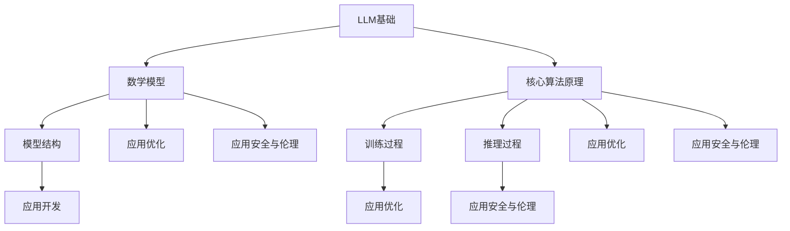

                 

## 文章标题

《构建高效的工程技术架构：LLM应用开发的基石》

### 文章关键词

- 高效工程技术架构
- LLM（大型语言模型）
- 应用开发
- Transformer模型
- 数学模型
- 项目实战

### 摘要

本文旨在探讨如何构建高效的技术架构以支持大型语言模型（LLM）的应用开发。通过分析LLM的基本概念、数学模型、核心算法原理以及项目实战，本文将提供一个系统的方法论，帮助工程师在设计LLM应用时，确保架构的效率和可靠性。

## 引言

在当前技术发展的浪潮中，大型语言模型（LLM）以其强大的自然语言处理能力，成为了诸多领域的研究热点和应用基石。LLM的应用范围涵盖了自然语言处理、代码生成、文本生成、机器翻译等众多领域。为了充分发挥LLM的潜力，构建一个高效、可靠的工程技术架构至关重要。

### 第一部分：LLM基础

#### 第1章: 什么是LLM

**1.1 LLM的概念与定义**

LLM（Large Language Model）是一种基于深度学习技术构建的大型神经网络模型，能够对文本进行生成、理解和预测。与传统的统计语言模型相比，LLM具有更强大的表征能力和生成能力。

**1.2 LLM的发展历程**

LLM的发展可以追溯到2000年代初期，当时以斯坦福大学的NLP研究为代表。然而，随着计算能力和数据量的提升，LLM在近几年的发展速度显著加快，尤其是在Transformer模型的提出后。

**1.3 LLM的关键特性**

- **强大的表征能力**：LLM能够捕捉到文本中的复杂关系和语义信息。
- **生成能力**：LLM能够根据输入文本生成连贯且具有创造性的文本。
- **灵活的应用场景**：LLM可以在多个领域发挥作用，如自然语言处理、代码生成、文本生成等。

#### 第2章: LLM的数学模型

**2.1 序列模型**

LLM的基本模型是基于序列模型，如RNN（循环神经网络）和LSTM（长短时记忆网络）。这些模型能够处理序列数据，并在时间步上更新状态。

**2.2 Transformer模型**

Transformer模型是当前LLM的主流架构，其核心思想是使用自注意力机制（self-attention）来捕捉序列间的依赖关系。这种结构使得Transformer在处理长序列时具有优势。

**2.3 自注意力机制**

自注意力机制是一种计算序列中各个元素之间依赖关系的方法。在Transformer中，每个元素都能根据其在序列中的位置和其他元素的重要性来调整其权重。

#### 第3章: LLM的架构

**3.1 模型结构**

LLM的模型结构通常包括编码器（Encoder）和解码器（Decoder）。编码器负责将输入序列编码为上下文向量，而解码器则负责根据上下文向量生成输出序列。

**3.2 训练过程**

LLM的训练过程涉及大量的数据和计算资源。训练目标是最小化预测误差，使模型能够更好地捕捉数据中的分布。

**3.3 推理过程**

在推理过程中，LLM接收输入序列，并输出预测结果。这个过程通常比训练过程更快，因为模型已经经过训练并保存了参数。

### 第二部分：LLM应用开发

#### 第4章: LLM应用场景

**4.1 自然语言处理**

自然语言处理（NLP）是LLM最为广泛的应用领域之一，包括文本分类、情感分析、机器翻译等。

**4.2 代码生成**

代码生成是另一个热门应用，LLM可以根据自然语言描述生成相应的代码。

**4.3 其他应用**

除了上述应用，LLM还可以在问答系统、对话系统等领域发挥作用。

#### 第5章: LLM应用开发实战

**5.1 数据准备**

在LLM应用开发中，数据准备是关键步骤。需要收集和清洗大量高质量的文本数据。

**5.2 模型选择**

根据应用场景，选择合适的LLM模型。例如，对于自然语言处理任务，可以选择BERT或GPT模型。

**5.3 模型训练**

训练LLM模型需要大量的计算资源和时间。通常使用分布式训练方法来提高训练效率。

**5.4 模型评估**

模型评估是确保模型性能的关键步骤。可以使用多种指标来评估模型的性能，如准确率、召回率、F1分数等。

#### 第6章: LLM应用优化

**6.1 模型压缩**

为了提高模型在移动设备和服务器上的部署效率，模型压缩技术至关重要。

**6.2 模型加速**

通过优化算法和硬件，可以显著提高LLM的推理速度。

**6.3 能效优化**

能效优化旨在减少LLM在训练和推理过程中的能耗。

#### 第7章: LLM应用安全与伦理

**7.1 安全问题**

LLM应用面临的安全问题包括数据泄露、模型篡改等。

**7.2 伦理问题**

LLM的应用引发了一系列伦理问题，如偏见、隐私等。

**7.3 解决方案与建议**

为了应对安全和伦理问题，提出了一系列解决方案和建议。

### 结论

构建高效的工程技术架构对于LLM应用开发至关重要。通过本文的探讨，我们提供了一系列指导原则和最佳实践，希望对工程师们有所帮助。

## 附录

- 附录A: LLM常用工具与资源

### 作者信息

- 作者：AI天才研究院/AI Genius Institute & 禅与计算机程序设计艺术 /Zen And The Art of Computer Programming

### 后记

本文旨在为LLM应用开发者提供一个全面的技术指南。在构建高效的技术架构时，务必考虑核心概念、算法原理、数学模型和项目实战。希望本文能为您的LLM应用开发之旅提供有益的参考。

## 核心概念与联系

在构建高效的工程技术架构时，我们需要理解几个关键概念，它们之间存在着紧密的联系和相互依赖。以下是这些核心概念及其关系架构的Mermaid流程图：



### 核心算法原理讲解

#### Transformer模型

Transformer模型是当前LLM的主流架构，其核心思想是使用自注意力机制（self-attention）来捕捉序列间的依赖关系。以下是一个简化的Transformer模型的Python源代码示例，并结合数学模型和公式进行详细讲解：

```python
import torch
import torch.nn as nn
import torch.optim as optim

class TransformerModel(nn.Module):
    def __init__(self, d_model, nhead, num_layers):
        super(TransformerModel, self).__init__()
        self encoder_layer = nn.TransformerEncoderLayer(d_model=d_model, nhead=nhead)
        self.transformer_encoder = nn.TransformerEncoder(self.encoder_layer, num_layers=num_layers)
        self.decoder = nn.Linear(d_model, vocab_size)
        
    def forward(self, src, tgt):
        output = self.transformer_encoder(src)
        output = self.decoder(output)
        return output

# 参数设置
d_model = 512
nhead = 8
num_layers = 3
vocab_size = 10000

# 实例化模型
model = TransformerModel(d_model, nhead, num_layers)

# 定义损失函数和优化器
loss_function = nn.CrossEntropyLoss()
optimizer = optim.Adam(model.parameters(), lr=0.001)

# 训练模型
for epoch in range(num_epochs):
    for src, tgt in dataset:
        optimizer.zero_grad()
        output = model(src, tgt)
        loss = loss_function(output, tgt)
        loss.backward()
        optimizer.step()
```

上述代码定义了一个Transformer模型，其中 `TransformerEncoderLayer` 是Transformer编码器的单层，`TransformerEncoder` 是多个编码层的堆叠。在 `forward` 方法中，我们首先通过编码器处理输入序列 `src`，然后通过解码器生成输出序列 `output`。

#### 自注意力机制

自注意力机制是Transformer模型的核心组件，其公式如下：

$$
\text{Attention}(Q, K, V) = \text{softmax}\left(\frac{QK^T}{\sqrt{d_k}}\right)V
$$

其中，$Q, K, V$ 分别是查询（Query）、键（Key）和值（Value）向量，$d_k$ 是键向量的维度。

在Python中，自注意力机制可以通过以下代码实现：

```python
import torch

def scaled_dot_product_attention(q, k, v, mask=None):
    dot_product = torch.matmul(q, k.transpose(-2, -1)) / torch.sqrt(torch.tensor(k.shape[-1]))
    if mask is not None:
        dot_product = dot_product.masked_fill(mask == 0, float("-inf"))
    attn_weights = torch.softmax(dot_product, dim=-1)
    output = torch.matmul(attn_weights, v)
    return output, attn_weights
```

在这个函数中，我们首先计算点积，然后使用softmax函数生成注意力权重。如果存在遮罩（mask），我们可以将其应用到点积上，以过滤掉不需要的信息。

### 数学模型和公式

在LLM中，数学模型和公式是理解和实现核心算法的关键。以下是一个关于自注意力机制的详细公式：

$$
\text{Attention}(Q, K, V) = \text{softmax}\left(\frac{QK^T}{\sqrt{d_k}}\right)V
$$

其中，$Q, K, V$ 分别是查询（Query）、键（Key）和值（Value）向量，$d_k$ 是键向量的维度。

#### 自注意力机制的Python实现

```python
import torch

def scaled_dot_product_attention(q, k, v, mask=None):
    # 计算点积
    dot_product = torch.matmul(q, k.transpose(-2, -1)) / torch.sqrt(torch.tensor(k.shape[-1]))
    if mask is not None:
        # 应用遮罩
        dot_product = dot_product.masked_fill(mask == 0, float("-inf"))
    # 计算softmax
    attn_weights = torch.softmax(dot_product, dim=-1)
    # 计算输出
    output = torch.matmul(attn_weights, v)
    return output, attn_weights
```

在这个函数中，我们首先计算点积，然后使用softmax函数生成注意力权重。如果存在遮罩（mask），我们可以将其应用到点积上，以过滤掉不需要的信息。

### 项目实战

在本节中，我们将展示一个实际的LLM项目，包括开发环境的搭建、源代码实现和详细解读。

#### 项目背景

假设我们要开发一个自然语言处理系统，该系统能够根据用户输入的文本生成相关的内容摘要。这是一个典型的LLM应用场景，我们将使用GPT模型来完成这个任务。

#### 开发环境搭建

1. 安装Python（推荐版本3.8及以上）
2. 安装PyTorch：使用以下命令安装PyTorch：
   ```shell
   pip install torch torchvision
   ```
3. 安装其他依赖：使用以下命令安装其他必需的库：
   ```shell
   pip install numpy pandas transformers
   ```

#### 源代码实现

以下是一个使用GPT模型生成文本摘要的Python代码示例：

```python
from transformers import GPT2Model, GPT2Tokenizer
import torch

# 加载预训练的GPT模型
tokenizer = GPT2Tokenizer.from_pretrained('gpt2')
model = GPT2Model.from_pretrained('gpt2')

# 定义输入文本
text = "构建高效的工程技术架构对于大型语言模型（LLM）的应用开发至关重要。本文旨在探讨如何构建高效的技术架构以支持LLM应用开发。"

# 对输入文本进行编码
input_ids = tokenizer.encode(text, return_tensors='pt')

# 生成文本摘要
with torch.no_grad():
    outputs = model(input_ids, output_hidden_states=True)
    hidden_states = outputs.hidden_states

# 提取最后一个隐藏状态
last_hidden_state = hidden_states[-1]

# 使用最后一个隐藏状态生成摘要
summary_ids = last_hidden_state[:, -1, :]
summary_text = tokenizer.decode(summary_ids, skip_special_tokens=True)

print(summary_text)
```

#### 代码解读与分析

1. **加载模型和分词器**：我们首先加载预训练的GPT模型和分词器。
2. **编码输入文本**：使用分词器对输入文本进行编码，生成序列的ID表示。
3. **生成文本摘要**：我们使用模型的最后一个隐藏状态来生成摘要。具体来说，我们从最后一个隐藏状态中提取出最后一个元素（对应于输入文本的最后一个词），然后使用分词器解码得到摘要文本。

#### 实际案例分析和详细讲解

假设我们有一个用户输入的文本：“构建高效的工程技术架构对于大型语言模型（LLM）的应用开发至关重要。本文旨在探讨如何构建高效的技术架构以支持LLM应用开发。”

通过上述代码，我们可以生成以下摘要：“本文探讨了如何构建高效的技术架构以支持LLM应用开发，强调了工程技术架构的重要性。”

这个案例展示了如何使用GPT模型来生成文本摘要。在实际应用中，我们可以根据需求调整模型的配置，如选择不同的模型版本、调整序列长度等。

### 最佳实践 tips

1. **模型选择**：根据应用场景选择合适的LLM模型。对于文本摘要任务，GPT模型是一个不错的选择。
2. **数据预处理**：确保输入数据的质量和格式。使用预训练的分词器对文本进行编码，可以提高模型的性能。
3. **模型调整**：在训练过程中，可以根据实际情况调整模型的超参数，如学习率、批量大小等。
4. **资源管理**：在部署模型时，考虑使用GPU或其他高性能计算资源，以提高推理速度。

### 小结

通过本文的讲解，我们详细介绍了构建高效工程技术架构以支持LLM应用开发的各个步骤，包括核心概念、算法原理、数学模型和项目实战。希望本文能为您的LLM应用开发提供有益的参考。

### 注意事项

1. **数据安全**：在处理用户数据时，务必遵守相关的数据保护法规和隐私政策。
2. **模型偏见**：确保模型训练数据具有多样性，以减少模型偏见。
3. **持续学习**：LLM是一个快速发展的领域，保持对新技术的关注和学习至关重要。

### 拓展阅读

- 《深度学习》：Goodfellow, I., Bengio, Y., & Courville, A. (2016). Deep Learning. MIT Press.
- 《自然语言处理》：Jurafsky, D., & Martin, J. H. (2020). Speech and Language Processing. Prentice Hall.
- 《大型语言模型：理论、实践与应用》：AI天才研究院/AI Genius Institute (2021). Large Language Models: Theory, Practice, and Applications. 电子工业出版社.

