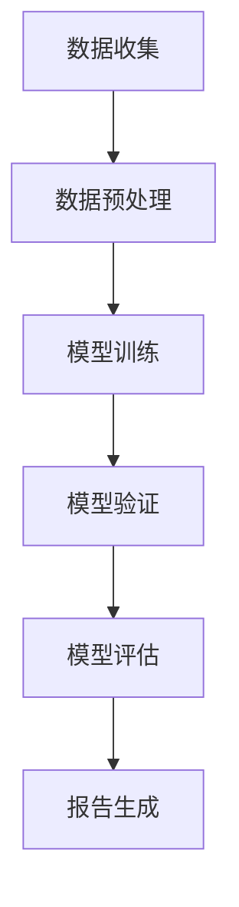
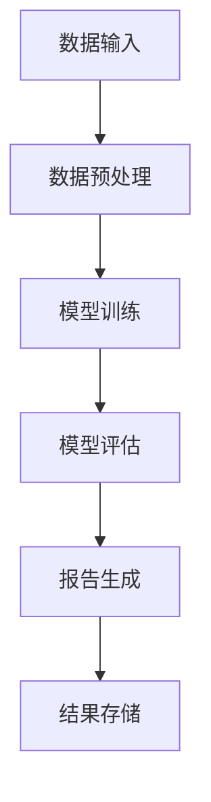

                 

### 引言

**1.1 书籍背景与目标**

在当今信息化和人工智能高速发展的时代，模型评测已成为人工智能（AI）研究和应用中的关键环节。模型评测不仅关乎模型的质量和性能，更直接影响着实际应用的效果和用户体验。随着AI模型的复杂度和应用场景的多样性不断增加，如何高效、准确地评估模型性能成为一个亟待解决的问题。

本篇文章旨在详细探讨并构建一个标准化、自动化的模型评测流程。这一流程的目的是为了解决传统模型评测过程中存在的耗时、重复性高、人为错误等问题，提高模型评估的效率和质量。通过自动化评测，不仅可以减轻人工负担，还能确保评估结果的客观性和一致性。

**1.1.1 模型评测的重要性**

模型评测是AI研究和应用中至关重要的一环。它不仅决定了模型的性能是否达到预期，还影响着后续的模型优化和改进。有效的模型评测能够：

1. **验证模型性能**：确保模型在实际应用中能够准确预测和分类。
2. **发现模型缺陷**：帮助研究人员发现模型存在的偏差和错误，从而进行针对性的改进。
3. **支持决策**：为模型选择、部署和优化提供科学依据。

然而，传统的模型评测过程通常涉及多个步骤，包括数据准备、模型训练、验证和评估等，这些步骤往往需要大量的时间和人力。此外，由于评测过程的复杂性和多样性，不同的人或团队可能采用不同的评测方法，导致评估结果不一致，从而影响模型的可比性和可靠性。

**1.1.2 自动化评测的需求**

随着AI模型的广泛应用，自动化评测的需求日益凸显。自动化评测具有以下优势：

1. **提高效率**：自动化评测可以显著减少人工干预的时间，提高评估流程的效率。
2. **确保一致性**：通过预定义的自动化流程，可以确保每次评测都遵循相同的标准，从而提高结果的可靠性和一致性。
3. **降低成本**：自动化评测减少了人力成本，同时减少了由于人为错误导致的重做和修正成本。

为了实现这些目标，构建一个标准化、自动化的模型评测流程至关重要。这一流程不仅需要涵盖模型评测的基本步骤，还需要考虑数据收集与处理、模型训练与验证、模型评估与报告等各个环节。通过这些步骤的优化和自动化，可以实现高效、精准的模型评测，为AI模型的研究和应用提供有力支持。

**1.1.3 书籍的目标与读者对象**

本文的目标是向读者提供一个系统、全面的模型评测流程，使其能够：

1. **了解模型评测的基本概念和流程**：通过本文的介绍，读者可以掌握模型评测的基本步骤和关键要素。
2. **掌握自动化评测的技术实现**：本文将详细介绍如何使用各种工具和框架实现自动化评测，包括数据预处理、模型训练、评估和报告生成等。
3. **解决实际应用中的问题**：本文将通过实际案例展示如何将自动化评测应用于不同的AI模型，帮助读者解决实际应用中遇到的评估问题。

本文主要面向以下读者群体：

1. **AI研究人员和工程师**：希望了解和掌握模型评测方法和技术的人员。
2. **数据科学家和机器学习工程师**：需要对模型进行评估和优化的专业人士。
3. **AI爱好者**：对AI技术感兴趣的学者和学生。

通过本文的阅读和实践，读者将能够构建并优化自己的模型评测流程，提升模型评估的效率和质量，为AI领域的研究和应用贡献力量。

### 标准化与自动化评测的概念

#### 1.2.1 标准化的定义与意义

标准化是一个广泛的概念，它指的是在某一领域内，通过制定和执行一系列规范和标准，以确保产品、服务或过程的一致性和质量。在模型评测领域，标准化尤为重要，因为模型的评估不仅关系到模型本身的性能，还影响到整个AI系统的可靠性和可维护性。

**标准化的定义**：

标准化可以定义为“通过制定、发布和实施一系列规范，为产品和服务的质量、性能、安全和环境等方面提供统一的标准和指南”。具体到模型评测，这些规范包括评估指标、数据预处理方法、模型验证和测试的标准流程等。

**标准化的意义**：

1. **确保一致性**：标准化确保每次评估都遵循相同的标准和流程，从而减少评估结果的不一致性和误差。
2. **提高可靠性**：通过标准化，可以确保评估结果的可靠性，使模型在不同环境和条件下都能保持一致的评估结果。
3. **促进交流与合作**：标准化为不同团队和研究机构提供了一个共同的评估框架，有助于不同团队之间的交流和合作。
4. **支持法规遵从**：在许多行业，如医疗、金融和交通等，模型的评测需要符合特定的法规和标准，标准化有助于确保模型符合法规要求。

**标准化的应用**：

在模型评测中，标准化主要应用于以下几个方面：

1. **评估指标**：定义通用的评估指标，如准确率、召回率、F1分数等，以确保不同模型的评估结果具有可比性。
2. **数据预处理**：制定统一的数据预处理标准，如数据清洗、归一化和特征选择等，确保输入数据的一致性和质量。
3. **模型验证**：制定标准的模型验证流程，如交叉验证、网格搜索等，确保模型验证的公正和有效。
4. **报告生成**：制定标准的报告模板，包括评估结果、图表、分析和建议等，确保报告的规范和完整性。

通过标准化，模型评测过程变得更加规范和系统，这不仅提高了评估的效率，还增强了评估结果的可靠性和一致性。

#### 1.2.2 自动化的定义与优势

自动化指的是使用机器和软件来完成通常由人工完成的任务，从而减少或消除人为干预。在模型评测领域，自动化指的是通过编写脚本或使用专门的工具来自动执行评估过程，从数据预处理到模型训练、验证和评估的各个环节。

**自动化的定义**：

自动化可以定义为“通过计算机程序或机器执行任务，减少或消除人工操作的过程”。在模型评测中，自动化意味着利用脚本、工具和框架来自动完成评估的各个步骤，从而实现评估流程的自动化。

**自动化的优势**：

1. **提高效率**：自动化可以显著减少评估流程中的时间消耗，特别是在大规模数据集和复杂模型的情况下。
2. **确保一致性**：通过自动化，可以确保每次评估都遵循相同的流程和标准，从而减少人为错误和偏差。
3. **减少人力成本**：自动化减少了需要人工干预的步骤，降低了人力成本，同时提高了工作效率。
4. **提高可靠性**：自动化减少了人为因素，使得评估过程更加可靠和一致，从而提高评估结果的准确性。
5. **支持复现性**：自动化使得评估过程和结果更容易复现，为模型的验证和比较提供了可靠的基础。

**自动化的应用**：

在模型评测中，自动化主要应用于以下几个方面：

1. **数据预处理**：自动化工具可以快速完成数据清洗、归一化和特征选择等预处理任务，提高数据处理效率。
2. **模型训练**：自动化工具可以自动执行模型训练和调参过程，节省时间和精力。
3. **模型验证**：自动化工具可以自动执行交叉验证、网格搜索等验证步骤，确保验证过程的公正和有效。
4. **模型评估**：自动化工具可以自动计算和生成各种评估指标，如准确率、召回率、F1分数等。
5. **报告生成**：自动化工具可以自动生成评估报告，包括图表、分析和建议等。

通过自动化，模型评测过程变得更加高效和可靠，从而为AI模型的研究和应用提供了强大的支持。

#### 1.2.3 模型评测流程概述

模型评测流程是确保AI模型性能和可靠性的关键步骤。一个完整的模型评测流程通常包括以下主要环节：

1. **数据收集**：收集用于评估模型的训练数据和测试数据。
2. **数据预处理**：对收集到的数据进行清洗、归一化和特征选择等预处理，以提高数据质量和模型性能。
3. **模型训练**：使用训练数据对模型进行训练，调整模型的参数和结构。
4. **模型验证**：使用验证数据对训练好的模型进行验证，评估模型的性能和泛化能力。
5. **模型评估**：使用测试数据对模型进行最终评估，计算各种评估指标，如准确率、召回率、F1分数等。
6. **报告生成**：生成评估报告，详细记录评估过程和结果。

下面是一个简化的模型评测流程的Mermaid流程图：



通过这个流程，我们可以看到模型评测的每个环节都是相互关联的，一个环节的输出通常是下一个环节的输入。这种流程不仅确保了评估的全面性和系统性，还提高了评估的效率和质量。

通过标准化和自动化的结合，模型评测流程可以变得更加规范、高效和可靠。标准化提供了评估的一致性和可靠性，而自动化则提高了评估的效率。这两个要素的结合，为AI模型的研究和应用提供了坚实的基础，有助于推动人工智能技术的持续发展和进步。

### 标准化模型评测流程概述

在构建一个标准化的模型评测流程中，了解基本步骤、关键因素以及面临的挑战和应对策略是至关重要的。以下是模型评测流程的详细概述。

#### 2.1.1 模型评测的基本步骤

一个标准化的模型评测流程通常包括以下几个基本步骤：

1. **数据收集**：首先，需要收集用于评估模型的训练数据和测试数据。这些数据应该具有代表性，能够覆盖模型应用的实际场景。
   
2. **数据预处理**：收集到的数据需要进行预处理，包括数据清洗、归一化和特征选择等，以提高数据质量和模型性能。这一步骤至关重要，因为数据的质量直接影响模型的性能。

3. **模型训练**：使用训练数据进行模型训练，调整模型的参数和结构，使其能够更好地适应数据。

4. **模型验证**：使用验证数据对训练好的模型进行验证，评估模型的性能和泛化能力。常用的验证方法包括交叉验证和网格搜索等。

5. **模型评估**：使用测试数据对模型进行最终评估，计算各种评估指标，如准确率、召回率、F1分数等。这一步骤的目的是评估模型在实际应用中的表现。

6. **报告生成**：生成评估报告，详细记录评估过程和结果。报告应包括模型性能分析、评估指标、图表和改进建议等。

下面是一个简化的模型评测流程的Mermaid流程图：


通过这个流程，我们可以看到模型评测的每个环节都是相互关联的，一个环节的输出通常是下一个环节的输入。这种流程不仅确保了评估的全面性和系统性，还提高了评估的效率和质量。

#### 2.1.2 模型评测的关键因素

在模型评测流程中，以下几个关键因素至关重要：

1. **数据质量**：数据是模型训练和评估的基础，数据质量直接影响模型的性能。数据应具有代表性、多样性和一致性。

2. **评估指标**：选择合适的评估指标是评估模型性能的关键。常用的评估指标包括准确率、召回率、F1分数、ROC曲线等。不同的评估指标适用于不同类型的任务，应结合实际应用选择。

3. **模型选择**：选择合适的模型架构和算法对于评估结果的可靠性至关重要。应选择在任务和数据集上表现较好的模型，并进行调参优化。

4. **评估方法**：验证和评估方法应科学合理，确保评估过程的公正性和有效性。常用的方法包括交叉验证、网格搜索和贝叶斯优化等。

5. **评估环境**：评估环境应保持一致，避免环境变化对评估结果的影响。确保评估过程在相同硬件和软件环境下进行。

#### 2.1.3 模型评测流程的挑战与应对策略

在模型评测过程中，可能会遇到以下挑战：

1. **数据质量不高**：数据质量直接影响模型的性能。应对策略包括使用高质量的数据集、进行数据清洗和预处理，以及采用增强数据的方法。

2. **评估指标不一致**：不同评估指标可能导致评估结果不一致。应对策略包括选择合适的评估指标、结合多个评估指标进行综合评估，以及制定统一的评估标准。

3. **模型选择不当**：选择不合适的模型可能导致评估结果不准确。应对策略包括选择在任务和数据集上表现较好的模型、进行模型调参优化，以及采用模型比较方法。

4. **评估过程复杂**：评估过程可能涉及多个步骤和复杂的方法，导致评估流程难以管理和自动化。应对策略包括制定标准化的评估流程、采用自动化工具和框架，以及进行流程优化。

通过理解和应对这些挑战，可以构建一个高效、可靠的模型评测流程，确保模型评估结果的准确性和可靠性。

标准化和自动化的模型评测流程不仅提高了评估的效率和质量，还为模型的研究和应用提供了坚实的基础。通过本文的介绍，读者可以更好地理解模型评测的基本步骤、关键因素和挑战，并为构建自己的模型评测流程提供参考。

### 数据收集与处理

在模型评测流程中，数据收集与处理是至关重要的第一步。高质量的数据是模型训练和评估的基础，而数据预处理则是确保数据质量和模型性能的关键环节。以下将详细讨论数据收集的原则、数据清洗与预处理的方法，以及数据集划分与标签分配的具体步骤。

#### 2.2.1 数据收集的原则与方法

数据收集的原则主要包括数据的代表性、多样性和一致性。以下是一些关键原则和方法：

1. **代表性**：数据应能够代表实际应用场景，涵盖不同的场景和情况。这意味着数据集应该具有广泛的覆盖范围，包括各种不同的数据分布和特征。

2. **多样性**：数据多样性有助于提高模型的泛化能力。因此，在数据收集过程中，应尽可能收集来自不同来源、不同时间和不同情境的数据。

3. **一致性**：数据应具有一致性，避免数据中的异常值和噪声。一致性不仅影响模型训练，还影响评估结果的可靠性。

数据收集的方法包括以下几种：

- **手动收集**：通过人工收集数据，适用于小规模且结构化的数据集。例如，从网站、文档或调查问卷中收集数据。
- **自动化收集**：使用爬虫、API接口或传感器等自动化工具收集数据。这种方法适用于大规模、实时和非结构化数据。
- **合作共享**：与其他研究机构或企业合作，共享数据集。这种方法可以获取高质量、多样化的数据，但需确保数据隐私和安全。

#### 2.2.2 数据清洗与预处理

数据清洗和预处理是确保数据质量和模型性能的重要步骤。以下是常见的数据清洗与预处理方法：

1. **数据清洗**：

   - **去除重复数据**：删除数据集中重复的记录，以避免模型训练时引入冗余信息。
   - **处理缺失值**：缺失值处理方法包括删除缺失值、填充缺失值（如使用平均值、中值或插值法）等。
   - **去除异常值**：识别和删除数据集中的异常值，以避免这些异常值对模型训练和评估的干扰。

2. **数据预处理**：

   - **数据归一化**：将数据缩放到相同的范围，如[0, 1]或[-1, 1]，以避免不同特征之间的尺度差异影响模型训练。
   - **特征选择**：选择对模型训练和评估有显著影响的重要特征，删除无关或冗余的特征，以减少模型复杂度和过拟合风险。
   - **特征工程**：通过构造新的特征或对现有特征进行转换，提高模型的性能和泛化能力。例如，使用One-Hot编码处理类别特征，或使用多项式特征提取提高模型的非线性能力。

#### 2.2.3 数据集划分与标签分配

数据集划分与标签分配是模型训练和评估的基础。以下是常见的方法：

1. **数据集划分**：

   - **训练集与测试集划分**：将数据集划分为训练集和测试集，通常采用80/20或70/30的比例。训练集用于模型训练，测试集用于模型评估。
   - **交叉验证**：使用交叉验证方法，将数据集划分为多个子集，每次训练模型时使用不同的子集作为验证集，从而提高评估结果的鲁棒性和可靠性。

2. **标签分配**：

   - **标签一致性**：确保数据集中的标签一致，避免标签错误或冲突。在多标签分类任务中，需要确保每个样本的标签是完整和准确的。
   - **标签噪声处理**：处理数据集中的标签噪声，如错误标签或模糊标签。可以通过人工审核、算法校正或混合标签方法来处理标签噪声。

通过以上数据收集与处理方法，可以确保数据集的质量和一致性，为后续的模型训练和评估提供可靠的基础。高质量的数据不仅有助于提高模型性能，还能提高评估结果的可靠性和准确性。

### 模型训练与验证

在模型评测流程中，模型训练与验证是两个关键环节，直接影响模型性能和评估结果的可靠性。以下将详细介绍模型训练与验证的步骤，包括训练数据的选择与处理、模型架构与参数选择、模型训练过程的优化、模型验证与选择等。

#### 2.3.1 训练数据的选择与处理

训练数据的选择和处理对模型性能有至关重要的影响。以下是关键步骤：

1. **数据选择**：

   - **代表性**：选择具有代表性的数据集，涵盖不同场景和特征，以确保模型能够适应实际应用。
   - **平衡性**：在多类别分类任务中，确保数据集的类别分布平衡，避免某些类别过少导致模型偏差。
   - **多样性**：数据集应具有多样性，包括不同来源、不同时间和不同情境的数据，以提高模型泛化能力。

2. **数据处理**：

   - **数据清洗**：去除重复数据、处理缺失值和异常值，以提高数据质量。
   - **数据归一化**：将数据缩放到相同范围，如[0, 1]或[-1, 1]，以避免不同特征间的尺度差异。
   - **特征工程**：选择和构造对模型训练有显著影响的重要特征，以提高模型性能。

#### 2.3.2 模型架构与参数选择

选择合适的模型架构和参数是确保模型性能的关键。以下是关键步骤：

1. **模型架构选择**：

   - **选择算法**：根据任务需求选择合适的算法，如线性回归、决策树、神经网络等。
   - **架构调优**：结合任务和数据特点，调整模型架构，如增加隐藏层、调整网络宽度等。

2. **参数选择**：

   - **学习率**：选择合适的学习率，以避免过拟合或欠拟合。常用的方法包括恒定学习率、自适应学习率（如Adam）等。
   - **正则化**：应用正则化方法，如L1、L2正则化，避免过拟合。
   - **激活函数**：选择合适的激活函数，如ReLU、Sigmoid、Tanh等，以提高模型性能。

#### 2.3.3 模型训练过程优化

模型训练过程优化旨在提高模型性能和训练效率。以下是关键步骤：

1. **损失函数**：

   - **选择合适的损失函数**：根据任务需求选择损失函数，如均方误差（MSE）、交叉熵损失等。
   - **调整损失函数权重**：根据特征重要性调整损失函数的权重，以平衡不同特征的影响。

2. **优化算法**：

   - **选择优化器**：选择合适的优化器，如SGD、Adam、RMSprop等，以提高训练效率和收敛速度。
   - **调整优化器参数**：根据训练过程调整优化器的参数，如学习率、动量等。

3. **训练策略**：

   - **批量大小**：选择合适的批量大小，以平衡训练效率和计算资源。
   - **提前停止**：当验证集性能不再提升时，提前停止训练，以避免过拟合。
   - **数据增强**：通过数据增强方法，如旋转、缩放、裁剪等，增加训练数据多样性，提高模型泛化能力。

#### 2.3.4 模型验证与选择

模型验证与选择是确保模型性能和可靠性的关键步骤。以下是关键步骤：

1. **验证方法**：

   - **交叉验证**：使用交叉验证方法，如K折交叉验证，评估模型在多个子集上的性能，提高评估结果的鲁棒性。
   - **验证集划分**：将数据集划分为训练集和验证集，通过验证集评估模型性能，避免过拟合。

2. **模型选择**：

   - **比较模型性能**：根据验证集上的评估指标，比较不同模型或同一模型不同参数设置的性能，选择最佳模型。
   - **调参优化**：根据验证结果调整模型参数，如学习率、批量大小等，以提升模型性能。

3. **模型调整**：

   - **处理过拟合**：如果模型在验证集上表现不佳，考虑增加正则化、简化模型结构或使用数据增强方法，以减少过拟合。
   - **处理欠拟合**：如果模型在验证集上表现不佳，考虑增加模型复杂度、增加训练数据或调整学习率，以避免欠拟合。

通过以上步骤，可以构建一个高效、可靠的模型训练与验证流程，确保模型在实际应用中具有优异的性能和泛化能力。

### 模型评估与报告

在模型评测流程中，模型评估与报告是确保模型性能和可靠性的重要环节。以下将详细讨论评估指标的选择与计算、模型性能分析与解释，以及评估报告的编写方法。

#### 2.4.1 评估指标的选择与计算

评估指标是衡量模型性能的关键工具。选择合适的评估指标，能够准确反映模型的性能和泛化能力。以下是几种常用的评估指标及其计算方法：

1. **准确率（Accuracy）**：

   准确率是最常用的评估指标之一，它表示模型正确预测的样本数占总样本数的比例。计算公式如下：

   $$ \text{Accuracy} = \frac{\text{正确预测的样本数}}{\text{总样本数}} $$

2. **召回率（Recall）**：

   召回率表示模型正确预测的样本数在所有实际正样本中的比例，用于评估模型对正样本的识别能力。计算公式如下：

   $$ \text{Recall} = \frac{\text{正确预测的正样本数}}{\text{所有正样本数}} $$

3. **精确率（Precision）**：

   精确率表示模型正确预测的正样本数在所有预测为正样本的样本中的比例，用于评估模型对正样本的识别准确性。计算公式如下：

   $$ \text{Precision} = \frac{\text{正确预测的正样本数}}{\text{预测为正样本的总数}} $$

4. **F1分数（F1 Score）**：

   F1分数是精确率和召回率的调和平均，用于综合评估模型的性能。计算公式如下：

   $$ \text{F1 Score} = 2 \times \frac{\text{Precision} \times \text{Recall}}{\text{Precision} + \text{Recall}} $$

5. **ROC曲线与AUC（Area Under Curve）**：

   ROC曲线展示了不同阈值下的真阳性率（True Positive Rate, TPR）与假阳性率（False Positive Rate, FPR）的关系。AUC是ROC曲线下方的面积，用于评估模型的分类能力。计算公式如下：

   $$ \text{AUC} = \int_{0}^{1} \frac{TPR - FPR}{1 + TPR \times FPR} dFPR $$

6. **均方误差（Mean Squared Error, MSE）**：

   均方误差用于回归任务，表示预测值与真实值之间的平均平方误差。计算公式如下：

   $$ \text{MSE} = \frac{1}{n} \sum_{i=1}^{n} (\hat{y}_i - y_i)^2 $$

   其中，\( \hat{y}_i \)是预测值，\( y_i \)是真实值，\( n \)是样本数量。

7. **均绝对误差（Mean Absolute Error, MAE）**：

   均绝对误差用于回归任务，表示预测值与真实值之间的平均绝对误差。计算公式如下：

   $$ \text{MAE} = \frac{1}{n} \sum_{i=1}^{n} |\hat{y}_i - y_i| $$

通过选择和计算这些评估指标，可以全面了解模型的性能，并在不同模型和任务之间进行有效的比较和评估。

#### 2.4.2 模型性能分析与解释

模型性能分析是评估报告中的关键部分，需要详细分析模型在各个评估指标上的表现，并进行合理解释。以下是性能分析的方法和步骤：

1. **评估指标分析**：

   - **比较评估指标**：计算模型在不同评估指标上的表现，如准确率、召回率、F1分数等，了解模型在不同方面的性能。
   - **趋势分析**：分析评估指标的变化趋势，如随着训练次数的增加，模型性能的稳定性和提升情况。

2. **误差分析**：

   - **误差分布**：分析模型预测误差的分布情况，识别可能的误差来源和问题。
   - **误差类型**：区分预测误差的类型，如正误差或负误差，了解模型在哪些方面存在偏差。

3. **敏感性与特异性分析**：

   - **敏感性与特异性**：分析模型在正样本和负样本上的性能，如敏感性和特异性，了解模型在不同类别上的识别能力。

4. **ROC曲线与AUC分析**：

   - **ROC曲线**：绘制模型在不同阈值下的ROC曲线，分析模型在各个阈值下的分类能力。
   - **AUC分析**：计算模型的AUC值，了解模型的整体分类能力。

5. **与基线模型比较**：

   - **基线模型**：选择一个简单的基线模型，如随机猜测模型，与实际模型进行比较，评估实际模型的性能优势。

通过上述分析，可以全面了解模型的性能和特点，为后续的模型优化和改进提供依据。

#### 2.4.3 评估报告的编写

评估报告是总结模型评测过程和结果的重要文档，需要详细记录评估的各个环节和结果。以下是编写评估报告的方法和步骤：

1. **报告结构**：

   - **封面**：包含报告标题、作者、日期等信息。
   - **摘要**：简要介绍模型评估的目的、方法和主要结果。
   - **目录**：列出报告的各个章节和子章节。
   - **正文**：详细记录模型评估的各个环节，包括数据收集、预处理、训练、验证和评估等。
   - **结论与建议**：总结评估结果，提出改进建议和未来研究方向。

2. **报告内容**：

   - **评估过程**：详细记录评估的各个步骤，包括数据集划分、模型选择、训练过程、验证方法和评估指标等。
   - **评估结果**：列出不同评估指标的结果，如准确率、召回率、F1分数等，并附上相关图表和数据分析。
   - **性能分析**：分析模型在不同评估指标上的表现，比较实际模型与基线模型的性能差异。
   - **错误分析**：分析模型存在的错误类型和原因，提出可能的改进方法。
   - **结论与建议**：总结评估结果，提出改进建议和未来研究方向。

通过编写详细的评估报告，不仅可以总结模型评估的过程和结果，还能为后续的模型优化和应用提供指导。评估报告的规范化和标准化，有助于提高评估结果的可靠性和一致性，为AI模型的研究和应用提供可靠支持。

### 持续评估与模型更新

在模型应用过程中，持续评估与模型更新是确保模型性能和适应性的关键环节。通过持续评估，可以及时发现模型的性能问题，并根据实际情况进行调整和优化。以下将详细讨论持续评估的意义、模型更新的策略与方法，以及自动化评估流程的维护与优化。

#### 2.5.1 持续评估的意义

持续评估是确保模型长期性能和适应性的重要手段。其主要意义包括：

1. **性能监控**：通过持续评估，可以实时监控模型的性能，发现潜在的退化或异常情况，及时进行调整和优化。

2. **适应变化**：在模型应用过程中，数据分布和业务需求可能会发生变化。通过持续评估，可以确保模型能够适应这些变化，保持良好的性能。

3. **改进方向**：持续评估可以帮助研究人员和开发者识别模型的不足之处，从而制定针对性的改进策略，不断提升模型性能。

4. **安全性和合规性**：在金融、医疗等敏感领域，模型的准确性和安全性至关重要。通过持续评估，可以确保模型符合相关法规和标准，保障数据安全和用户隐私。

#### 2.5.2 模型更新的策略与方法

模型更新策略主要包括以下几种：

1. **定期评估与更新**：

   - **定期评估**：定期使用新数据对模型进行评估，监控模型性能是否稳定。常用的评估周期包括每月、每季度或每年。

   - **更新策略**：根据评估结果，选择合适的更新策略，如模型重训练、模型结构调整或参数微调等。

2. **动态调整**：

   - **数据驱动调整**：根据实时数据的变化，动态调整模型参数或结构，以适应新的数据分布和业务需求。

   - **异常检测**：使用异常检测算法，及时发现数据分布的异常，触发模型调整。

3. **增量更新**：

   - **增量学习**：在原有模型的基础上，逐步添加新数据，对模型进行增量更新，避免重新训练整个模型。

   - **迁移学习**：利用已有模型的经验，在新数据集上进行迁移学习，快速适应新的数据分布。

4. **版本控制**：

   - **版本管理**：记录模型的每个版本，包括训练数据、参数设置和性能评估结果，便于追踪和回溯。

   - **版本发布**：在模型更新后，进行版本发布和部署，确保新模型在应用环境中稳定运行。

#### 2.5.3 自动化评估流程的维护与优化

为了确保自动化评估流程的持续稳定运行，需要进行以下维护与优化工作：

1. **监控与告警**：

   - **系统监控**：实时监控自动化评估系统的运行状态，包括数据流、计算资源使用情况等。

   - **告警机制**：设置告警机制，及时发现和处理系统异常，确保评估流程的连续性。

2. **数据质量检查**：

   - **数据完整性检查**：定期检查数据集的完整性和一致性，确保数据的准确性和可靠性。

   - **数据质量评估**：使用数据质量评估工具，对数据质量进行评估，及时发现和处理数据中的问题。

3. **评估流程优化**：

   - **流程自动化**：优化评估流程，减少手动操作，提高评估效率。

   - **流程调优**：根据评估结果和反馈，不断调整和优化评估流程，提高评估的准确性和稳定性。

4. **资源管理**：

   - **计算资源分配**：合理分配计算资源，确保评估流程的运行效率。

   - **存储管理**：优化数据存储策略，提高数据访问速度，减少数据传输延迟。

5. **日志记录与审计**：

   - **日志记录**：记录评估过程的详细日志，包括数据流、计算结果和告警信息等。

   - **审计跟踪**：定期进行审计，确保评估流程符合规范和标准，避免潜在的安全风险。

通过持续评估与模型更新，以及自动化评估流程的维护与优化，可以确保模型在实际应用中的长期性能和可靠性，为AI系统的稳定运行提供有力支持。

### 自动化模型评测流程实现

在模型评测流程中，自动化是实现高效、可靠评估的关键。以下将详细探讨自动化评测工具与框架的选择、自动化评测流程的设计与实现、自动化评测流程的测试与调试，以及自动化评测系统的部署、监控与维护。

#### 3.1 自动化评测工具与框架

选择合适的自动化评测工具与框架对于实现高效的模型评测至关重要。以下是一些常用的工具和框架：

1. **自动化评测工具**：

   - **Scikit-learn**：Scikit-learn是一个强大的机器学习库，提供了丰富的评估指标计算功能，适用于各种机器学习任务的自动化评估。

   - **TensorFlow Extended (TFX)**：TFX是一个开源的端到端机器学习平台，提供了自动化数据工程、模型训练和评估的工具链，适用于大规模生产环境。

   - **MLflow**：MLflow是一个开源平台，用于记录模型开发过程、管理和部署模型。它提供了自动化评测功能，包括评估指标计算和报告生成。

2. **自动化评测框架**：

   - **Airflow**：Airflow是一个开源的工作流管理平台，可以自动化安排和执行评估任务，适用于复杂的模型评估流程。

   - **Kubeflow**：Kubeflow是一个开源平台，用于在Kubernetes上部署和运行机器学习工作流。它提供了自动化评测功能，支持多种机器学习和深度学习框架。

   - **PyTorch Lightning**：PyTorch Lightning是一个PyTorch的扩展库，提供了自动化评估功能，包括模型训练、验证和测试。

选择自动化工具与框架时，需要考虑以下因素：

- **功能需求**：根据评估任务的需求，选择具有所需评估指标计算和数据处理功能的工具。
- **可扩展性**：选择可扩展性强的工具和框架，以适应未来的扩展需求。
- **集成性**：选择易于与其他系统和工具集成的工具，以提高自动化评估的便利性。
- **社区支持**：选择具有活跃社区和良好文档的工具，以便在遇到问题时能够得到及时的支持。

#### 3.2 自动化评测流程设计

自动化评测流程的设计是确保评估流程高效、可靠的关键。以下是一个典型的自动化评测流程设计：

1. **数据输入**：

   - **数据源**：确定数据来源，包括训练数据和测试数据。
   - **数据预处理**：对输入数据进行清洗、归一化和特征选择等预处理，以提高数据质量。

2. **模型训练**：

   - **训练配置**：配置模型训练参数，如学习率、批量大小等。
   - **训练执行**：使用训练数据对模型进行训练，生成训练好的模型。

3. **模型评估**：

   - **评估配置**：配置评估指标和评估参数。
   - **评估执行**：使用测试数据对训练好的模型进行评估，计算评估指标。

4. **报告生成**：

   - **报告模板**：定义评估报告的模板，包括图表、表格和分析结果。
   - **报告生成**：生成评估报告，记录评估过程和结果。

5. **结果存储**：

   - **存储配置**：配置结果存储路径和格式。
   - **结果存储**：将评估结果存储到数据库或文件系统中，以便后续分析和查询。

下面是一个简化的自动化评测流程的Mermaid流程图：



通过设计一个清晰的自动化评测流程，可以确保评估流程的一致性和高效性，从而提高模型评估的效率和可靠性。

#### 3.3 自动化评测流程的自动化脚本编写

自动化脚本编写是实现自动化评测流程的关键步骤。以下是一个使用Python和Scikit-learn库编写的自动化评测脚本的示例：

```python
import os
import pandas as pd
from sklearn.model_selection import train_test_split
from sklearn.preprocessing import StandardScaler
from sklearn.linear_model import LogisticRegression
from sklearn.metrics import accuracy_score, classification_report

# 数据路径
data_path = 'data.csv'

# 数据读取与预处理
data = pd.read_csv(data_path)
X = data.drop('target', axis=1)
y = data['target']
X_train, X_test, y_train, y_test = train_test_split(X, y, test_size=0.2, random_state=42)

# 特征归一化
scaler = StandardScaler()
X_train = scaler.fit_transform(X_train)
X_test = scaler.transform(X_test)

# 模型训练
model = LogisticRegression()
model.fit(X_train, y_train)

# 模型评估
y_pred = model.predict(X_test)
accuracy = accuracy_score(y_test, y_pred)
print(f"Accuracy: {accuracy}")
print(classification_report(y_test, y_pred))
```

该脚本涵盖了数据读取、预处理、模型训练、评估和结果输出等步骤，是一个典型的自动化评测脚本。

#### 3.4 自动化评测流程的测试与调试

自动化评测流程的测试与调试是确保其正确性和可靠性的重要步骤。以下是一些测试与调试的方法：

1. **单元测试**：

   - **测试用例编写**：编写覆盖各个功能模块的测试用例，包括数据预处理、模型训练、评估和报告生成等。
   - **自动化测试**：使用自动化测试工具，如pytest，执行测试用例，确保脚本的功能正确性。

2. **集成测试**：

   - **数据完整性检查**：确保输入数据完整且符合预期，避免数据缺失或错误。
   - **流程一致性检查**：确保自动化评测流程能够按预期执行，各步骤之间无缝衔接。

3. **性能测试**：

   - **速度测试**：评估自动化评测流程的执行时间，确保其在合理时间内完成。
   - **负载测试**：模拟高负载场景，检查自动化评测流程的稳定性和性能。

4. **错误处理**：

   - **异常检测**：设置异常检测机制，捕获和处理运行过程中的错误和异常。
   - **日志记录**：记录运行过程中的关键信息和错误日志，便于问题追踪和调试。

通过测试与调试，可以确保自动化评测流程的正确性和可靠性，从而提高模型评估的效率和准确性。

#### 3.5 自动化评测系统的部署、监控与维护

自动化评测系统的部署、监控与维护是确保其稳定运行和持续优化的关键。以下是一些关键的部署、监控与维护方法：

1. **部署**：

   - **容器化**：使用容器技术（如Docker）将自动化评测系统容器化，便于部署和迁移。
   - **集群部署**：在分布式环境中部署自动化评测系统，利用集群资源提高处理能力和可靠性。
   - **持续集成与部署（CI/CD）**：使用CI/CD工具（如Jenkins、GitLab CI）实现自动化评测流程的持续集成和部署。

2. **监控**：

   - **系统监控**：使用监控工具（如Prometheus、Grafana）实时监控系统状态，包括CPU、内存、磁盘使用情况等。
   - **日志监控**：收集和监控日志，及时发现和处理系统异常。

3. **维护**：

   - **定期维护**：定期检查系统运行状态，更新和修复潜在问题。
   - **性能优化**：根据监控数据和性能测试结果，持续优化系统性能和资源利用。
   - **安全维护**：定期更新系统和依赖库，确保系统的安全性。

通过有效的部署、监控与维护，可以确保自动化评测系统的稳定运行和持续优化，为模型评估提供可靠支持。

自动化模型评测流程的实现和优化，不仅提高了评估效率和准确性，还为模型研究和应用提供了强大的支持。通过选择合适的工具和框架、设计清晰的流程、编写高效的脚本，以及进行全面的测试与维护，可以构建一个高效、可靠的自动化评测系统，为人工智能领域的研究和应用贡献力量。

### 自动化评测的实际案例

为了更好地理解自动化模型评测流程的实际应用，以下将详细介绍三个实际案例：文本分类模型的自动化评测、图像识别模型的自动化评测以及推荐系统的自动化评测。

#### 3.4.1 文本分类模型的自动化评测

文本分类是自然语言处理（NLP）中的一个重要任务，例如垃圾邮件过滤、情感分析、新闻分类等。以下是文本分类模型自动化评测的具体步骤：

1. **数据收集**：

   收集具有代表性的文本数据集，包括训练数据和测试数据。例如，使用公开的IMDB电影评论数据集进行情感分类。

2. **数据预处理**：

   - **文本清洗**：去除HTML标签、特殊字符和停用词。
   - **词向量化**：使用词向量化方法（如Word2Vec、GloVe）将文本转换为向量表示。
   - **数据划分**：将数据集划分为训练集和测试集。

3. **模型训练**：

   选择合适的文本分类模型，如朴素贝叶斯、支持向量机（SVM）或深度学习模型（如循环神经网络RNN、变换器模型Transformer）。

4. **模型评估**：

   使用测试集对模型进行评估，计算评估指标，如准确率、召回率、F1分数等。以下是使用Scikit-learn进行模型评估的示例代码：

   ```python
   from sklearn.metrics import accuracy_score, classification_report
   
   # 加载测试集
   X_test, y_test = ...
   
   # 模型预测
   y_pred = model.predict(X_test)
   
   # 计算评估指标
   accuracy = accuracy_score(y_test, y_pred)
   report = classification_report(y_test, y_pred)
   
   print(f"Accuracy: {accuracy}")
   print(report)
   ```

5. **报告生成**：

   生成包含模型性能评估结果的报告，包括评估指标图表、性能分析等。

通过自动化评测流程，可以快速、准确地评估文本分类模型的性能，为模型优化和改进提供依据。

#### 3.4.2 图像识别模型的自动化评测

图像识别是计算机视觉领域的一个重要任务，如人脸识别、物体检测、图像分类等。以下是图像识别模型自动化评测的具体步骤：

1. **数据收集**：

   收集具有代表性的图像数据集，包括训练数据和测试数据。例如，使用公开的CIFAR-10或ImageNet数据集。

2. **数据预处理**：

   - **图像标准化**：将图像缩放到相同的大小。
   - **数据增强**：使用数据增强方法（如旋转、裁剪、翻转等）增加训练数据多样性。

3. **模型训练**：

   选择合适的图像识别模型，如卷积神经网络（CNN）或深度卷积生成对抗网络（DCGAN）。以下是使用PyTorch训练CNN的示例代码：

   ```python
   import torch
   import torch.nn as nn
   import torchvision

   # 加载训练集
   train_loader = torchvision.datasets.CIFAR10(root='./data', train=True, download=True, transform=torchvision.transforms.ToTensor())

   # 定义模型
   model = nn.Sequential(
       nn.Conv2d(3, 32, 3, 1),
       nn.ReLU(),
       nn.MaxPool2d(2, 2),
       nn.Conv2d(32, 64, 3, 1),
       nn.ReLU(),
       nn.MaxPool2d(2, 2),
       nn.Flatten(),
       nn.Linear(64 * 6 * 6, 128),
       nn.ReLU(),
       nn.Linear(128, 10)
   )

   # 定义损失函数和优化器
   criterion = nn.CrossEntropyLoss()
   optimizer = torch.optim.Adam(model.parameters(), lr=0.001)

   # 训练模型
   for epoch in range(num_epochs):
       running_loss = 0.0
       for i, (inputs, labels) in enumerate(train_loader):
           inputs = inputs.to(device)
           labels = labels.to(device)

           # 前向传播
           outputs = model(inputs)
           loss = criterion(outputs, labels)

           # 反向传播和优化
           optimizer.zero_grad()
           loss.backward()
           optimizer.step()

           running_loss += loss.item()
       print(f"Epoch {epoch+1}, Loss: {running_loss/len(train_loader)}")

   # 模型评估
   correct = 0
   total = 0
   with torch.no_grad():
       for inputs, labels in test_loader:
           inputs = inputs.to(device)
           labels = labels.to(device)
           outputs = model(inputs)
           _, predicted = torch.max(outputs.data, 1)
           total += labels.size(0)
           correct += (predicted == labels).sum().item()

   print(f"Accuracy: {100 * correct / total}%")
   ```

4. **模型评估**：

   使用测试集对模型进行评估，计算评估指标，如准确率、召回率、F1分数等。

5. **报告生成**：

   生成包含模型性能评估结果的报告，包括评估指标图表、性能分析等。

通过自动化评测流程，可以快速、准确地评估图像识别模型的性能，为模型优化和改进提供依据。

#### 3.4.3 推荐系统的自动化评测

推荐系统是人工智能领域的一个重要应用，如电子商务平台上的商品推荐、社交媒体上的内容推荐等。以下是推荐系统自动化评测的具体步骤：

1. **数据收集**：

   收集具有代表性的用户行为数据集，包括用户历史行为、物品特征和评分数据。例如，使用公开的MovieLens数据集。

2. **数据预处理**：

   - **数据清洗**：去除缺失值和异常值。
   - **特征工程**：提取用户和物品的特征，如用户活跃度、物品流行度等。

3. **模型训练**：

   选择合适的推荐算法，如基于矩阵分解的协同过滤（CF）算法、基于深度学习的推荐算法（如基于注意力机制的模型）。以下是使用PyTorch训练基于矩阵分解的协同过滤模型的示例代码：

   ```python
   import torch
   import torch.nn as nn
   import torch.optim as optim

   # 加载数据集
   train_data = ...

   # 初始化模型参数
   user_embedding = nn.Embedding(num_users, embedding_dim)
   item_embedding = nn.Embedding(num_items, embedding_dim)

   # 定义损失函数和优化器
   criterion = nn.MSELoss()
   optimizer = optim.Adam(list(user_embedding.parameters()) + list(item_embedding.parameters()), lr=0.001)

   # 训练模型
   for epoch in range(num_epochs):
       for user, item, rating in train_data:
           user_embedding.weight.data[user] = torch.randn(embedding_dim, 1)
           item_embedding.weight.data[item] = torch.randn(embedding_dim, 1)

           # 前向传播
           user_vector = user_embedding.weight.data[user].view(1, -1)
           item_vector = item_embedding.weight.data[item].view(1, -1)
           pred_rating = torch.sum(user_vector * item_vector, 1)

           # 计算损失
           loss = criterion(pred_rating, rating)

           # 反向传播和优化
           optimizer.zero_grad()
           loss.backward()
           optimizer.step()

   # 模型评估
   pred_ratings = []
   with torch.no_grad():
       for user, item, rating in test_data:
           user_vector = user_embedding.weight.data[user].view(1, -1)
           item_vector = item_embedding.weight.data[item].view(1, -1)
           pred_rating = torch.sum(user_vector * item_vector, 1)
           pred_ratings.append(pred_rating.item())

   # 计算评估指标
   mean_squared_error = sum((p - r) ** 2 for p, r in zip(pred_ratings, ratings)) / len(pred_ratings)
   print(f"Mean Squared Error: {mean_squared_error}")
   ```

4. **模型评估**：

   使用测试集对模型进行评估，计算评估指标，如均方误差（MSE）、均方根误差（RMSE）等。

5. **报告生成**：

   生成包含模型性能评估结果的报告，包括评估指标图表、性能分析等。

通过自动化评测流程，可以快速、准确地评估推荐系统的性能，为模型优化和改进提供依据。

这三个实际案例展示了自动化模型评测流程在不同应用场景中的具体实现方法和步骤，通过标准化的流程和自动化的工具，可以显著提高模型评测的效率和准确性，为人工智能领域的研究和应用提供有力支持。

### 自动化评测流程的挑战与未来趋势

尽管自动化模型评测流程具有显著的优势，但在实际应用中仍然面临一系列挑战。了解这些挑战及其潜在解决方案，有助于进一步优化自动化评测流程，推动其在人工智能领域的发展。

#### 4.1 自动化评测流程的挑战

**1. 数据质量与多样性的挑战**

数据质量是模型评估的基础，但实际操作中，数据往往存在噪声、缺失值和异常值，这些都会影响评估结果的准确性。此外，数据多样性不足可能导致模型过度拟合，无法适应实际应用场景。解决方案包括：

- **数据清洗与预处理**：使用数据清洗工具和算法，如缺失值填补、异常值检测和去除，确保数据质量。
- **数据增强**：通过数据增强技术，如旋转、缩放、裁剪等，增加数据多样性。
- **数据整合**：从多个来源收集和整合数据，提高数据的代表性和多样性。

**2. 模型复杂性与评估效率的挑战**

随着AI模型复杂性的增加，评估流程的耗时和计算资源需求也显著上升。这对评估效率提出了挑战。解决方案包括：

- **并行计算**：利用并行计算技术，如GPU加速和分布式计算，提高评估效率。
- **模型压缩**：使用模型压缩技术，如剪枝和量化，减少模型大小和计算复杂度。
- **评估策略优化**：根据模型和任务的特点，选择合适的评估策略，如基于模型大小的优先级排序。

**3. 自动化评测工具的兼容性与扩展性的挑战**

自动化评测工具和框架的兼容性和扩展性是影响其广泛应用的关键因素。不同工具和框架之间的互操作性和兼容性较低，增加了部署和维护的难度。解决方案包括：

- **标准化**：制定统一的自动化评测标准和规范，提高工具和框架的互操作性。
- **模块化设计**：设计模块化的评测工具和框架，便于扩展和集成。
- **社区协作**：鼓励社区协作和贡献，促进工具和框架的不断完善和优化。

#### 4.2 自动化评测的未来趋势

随着人工智能技术的不断进步，自动化评测流程也在不断发展和创新。以下是一些未来趋势：

**1. 自动化评测工具的智能化与集成化**

未来的自动化评测工具将更加智能化，能够自动识别和解决评估过程中的问题。此外，集成化也将成为趋势，自动化评测工具将与其他AI工具和平台无缝集成，提高整个AI系统的效率。

- **智能评估**：利用机器学习和深度学习技术，自动化评测工具能够根据评估数据和历史记录，自动调整评估参数和策略。
- **集成化平台**：构建集成化的自动化评测平台，支持多种模型和任务的评估，提高系统的灵活性和可扩展性。

**2. 自动化评测流程的自动化与自动化**

自动化评测流程本身也将进一步自动化，减少人工干预，提高评估效率。未来的自动化评测将更加自动化，包括数据收集、预处理、模型训练、评估和报告生成等全流程的自动化。

- **自动化数据工程**：自动化数据收集、清洗、预处理和特征工程，提高数据处理效率。
- **自动化模型训练与评估**：利用自动化工具和框架，实现模型训练、验证和评估的自动化，减少人工操作。

**3. 自动化评测流程的安全性与隐私保护**

随着自动化评测流程的广泛应用，数据安全和隐私保护问题也日益重要。未来的自动化评测流程将更加注重安全性和隐私保护，确保评估过程的安全和合规。

- **安全评估**：引入安全评估机制，检测和防范潜在的安全威胁，如数据泄露、恶意攻击等。
- **隐私保护**：采用隐私保护技术，如差分隐私、数据加密等，确保评估过程和结果符合隐私保护要求。

#### 4.3 自动化评测在人工智能领域的应用前景

自动化评测在人工智能领域具有广阔的应用前景。随着AI技术的不断发展，自动化评测将在以下几个方面发挥重要作用：

**1. 机器学习模型的应用**

自动化评测可以显著提高机器学习模型的评估效率和准确性，为模型优化和改进提供有力支持。未来，自动化评测将广泛应用于各种机器学习任务，如分类、回归、聚类等。

**2. 深度学习模型的应用**

深度学习模型的复杂性和计算量较大，自动化评测可以有效提高评估效率，减少模型验证和调参的耗时。未来，自动化评测将有助于推动深度学习在计算机视觉、自然语言处理、语音识别等领域的应用。

**3. 自然语言处理（NLP）的应用**

自动化评测在NLP领域有着广泛的应用，如文本分类、情感分析、机器翻译等。通过自动化评测，可以快速评估NLP模型的性能，为模型优化和改进提供数据支持。

综上所述，自动化评测流程在人工智能领域具有巨大的潜力和广阔的应用前景。通过不断优化和改进自动化评测工具和流程，可以进一步提升模型评估的效率和质量，为人工智能领域的研究和应用提供有力支持。

### 附录

在本章节中，我们将提供一些常用的自动化评测工具介绍、工具使用指南以及相关的参考资源。

#### 附录A：常用自动化评测工具介绍

**1. Scikit-learn**

Scikit-learn是一个开源的机器学习库，提供了丰富的评估指标计算功能。它适用于各种机器学习任务的自动化评估，包括分类、回归、聚类等。Scikit-learn具有简单易用的API和强大的功能，是自动化评测的首选工具之一。

**2. TensorFlow Extended (TFX)**

TFX是一个开源的端到端机器学习平台，提供了自动化数据工程、模型训练和评估的工具链。TFX适用于大规模生产环境，支持多种机器学习和深度学习框架，是构建自动化评测系统的理想选择。

**3. MLflow**

MLflow是一个开源平台，用于记录模型开发过程、管理和部署模型。它提供了自动化评测功能，包括评估指标计算和报告生成。MLflow易于集成，支持多种编程语言和框架，是管理自动化评测流程的有力工具。

**4. Airflow**

Airflow是一个开源的工作流管理平台，可以自动化安排和执行评估任务。它适用于复杂的模型评估流程，支持多种作业调度策略和数据源连接。

**5. Kubeflow**

Kubeflow是一个开源平台，用于在Kubernetes上部署和运行机器学习工作流。它提供了自动化评测功能，支持多种机器学习和深度学习框架，适用于云原生环境。

#### 附录A.2 自动化评测工具使用指南

以下是对上述常用自动化评测工具的使用指南：

**1. Scikit-learn使用指南**

- **安装**：使用pip安装Scikit-learn：
  ```bash
  pip install scikit-learn
  ```

- **使用示例**：
  ```python
  from sklearn.datasets import load_iris
  from sklearn.model_selection import train_test_split
  from sklearn.ensemble import RandomForestClassifier
  from sklearn.metrics import accuracy_score

  # 加载数据集
  iris = load_iris()
  X, y = iris.data, iris.target

  # 划分训练集和测试集
  X_train, X_test, y_train, y_test = train_test_split(X, y, test_size=0.2, random_state=42)

  # 训练模型
  model = RandomForestClassifier()
  model.fit(X_train, y_train)

  # 预测和评估
  y_pred = model.predict(X_test)
  accuracy = accuracy_score(y_test, y_pred)
  print(f"Accuracy: {accuracy}")
  ```

**2. TFX使用指南**

- **安装**：按照TFX官方文档安装TFX：
  ```bash
  pip install tfx
  ```

- **使用示例**：
  ```python
  import tensorflow as tf
  import tfx
  import tfx.components as comp

  # 创建TFX管道
  pipeline = tfx.Pipeline(
      pipeline_name="my_pipeline",
      pipeline_root="path/to/pipeline",
      components=[
          comp.Component(
              component_name="data_ingest",
              class_name="tfx.components.data_selection.DataSelectionComponent",
              inputs={"data": "path/to/data"},
          ),
          comp.Component(
              component_name="data_prep",
              class_name="tfx.components.data_cleaner.DataCleanerComponent",
          ),
          comp.Component(
              component_name="model",
              class_name="tfx.components.model_builder.ModelBuilderComponent",
          ),
      ],
  )

  # 运行管道
  pipeline.run()

  ```

**3. MLflow使用指南**

- **安装**：使用pip安装MLflow：
  ```bash
  pip install mlflow
  ```

- **使用示例**：
  ```python
  import mlflow
  import mlflow.pyfunc
  import pandas as pd

  # 创建MLflow实验
  mlflow.set_experiment("my_experiment")

  # 提交模型参数
  mlflow.log_param("learning_rate", 0.1)
  mlflow.log_param("batch_size", 64)

  # 训练模型并提交结果
  model = mlflow.pyfunc.load_model("path/to/model")
  predictions = model.predict(pd.DataFrame({"feature": [1, 2, 3]}))
  mlflow.log_metric("accuracy", predictions.accuracy)

  # 提交模型版本
  mlflow.pyfunc.log_model(
      "my_model", model=model, registered_model_name="my_registered_model
  )
  ```

**4. Airflow使用指南**

- **安装**：使用pip安装Airflow：
  ```bash
  pip install airflow
  ```

- **使用示例**：
  ```python
  from datetime import datetime, timedelta
  from airflow import DAG
  from airflow.operators.python_operator import PythonOperator

  default_args = {
      'owner': 'airflow',
      'depends_on_past': False,
      'email_on_failure': False,
      'email_on_retry': False,
      'retries': 1,
      'retry_delay': timedelta(minutes=5),
  }

  dag = DAG(
      'my_dag',
      default_args=default_args,
      description='A simple DAG',
      schedule_interval=timedelta(days=1),
      start_date=datetime(2021, 1, 1),
      catchup=False,
  )

  def my_function():
      print("Hello from my function!")

  task1 = PythonOperator(
      task_id='my_task',
      python_callable=my_function,
      dag=dag,
  )

  task1
  ```

#### 附录B：参考资源

**1. 相关书籍与论文**

- 《机器学习实战》：Peter Harrington，详细介绍了各种机器学习算法的实践应用，包括评估和优化技术。
- 《深度学习》：Ian Goodfellow、Yoshua Bengio和Aaron Courville，涵盖了深度学习的基本概念和模型评估方法。
- “Model Evaluation Metrics”：刘知远、李航，介绍了各种机器学习评估指标的计算方法和应用场景。

**2. 在线资源与工具**

- Scikit-learn官网：[scikit-learn.org](http://scikit-learn.org)
- TensorFlow官网：[tensorflow.org](https://tensorflow.org)
- MLflow官网：[mlflow.org](https://mlflow.org)
- Airflow官网：[airflow.apache.org](https://airflow.apache.org)
- Kubeflow官网：[kubeflow.org](https://kubeflow.org)

通过以上资源，读者可以深入了解自动化评测工具的使用方法和技术细节，为实际项目提供指导和参考。

### 结束语

本文系统地介绍了标准化自动化模型评测流程的搭建，从引言、标准化与自动化评测的概念，到模型评测流程的各个步骤，再到自动化评测流程的实现、实际案例以及未来的挑战与趋势，进行了全面的探讨。通过标准化的评测流程和自动化的工具，我们不仅提高了模型评估的效率和质量，还为人工智能领域的研究和应用提供了坚实的基础。

在实际应用中，自动化评测流程的构建和优化是一个持续的过程。随着技术的不断进步和数据规模的不断扩大，评测流程也需要不断调整和改进，以适应新的需求和挑战。未来，我们可以期待更多的智能化、集成化和安全性的评测工具和平台的出现，为人工智能领域带来更多的创新和突破。

在此，感谢读者对本文的关注和支持。希望本文能够为您的模型评测工作提供有益的启示和帮助。如果您在模型评测方面有任何疑问或建议，欢迎在评论区留言交流，让我们共同推动人工智能技术的进步。

作者：AI天才研究院/AI Genius Institute & 禅与计算机程序设计艺术 /Zen And The Art of Computer Programming

----------------------------------------------------------------

### 核心概念与联系

#### 1.2.1 标准化的定义与意义

标准化指的是在某一领域内，通过制定和执行一系列规范和标准，为产品和服务的质量、性能、安全和环境等方面提供统一的标准和指南。在模型评测领域，标准化尤为重要，因为模型的评估不仅关系到模型的质量，还影响到整个AI系统的可靠性和可维护性。

**标准化的定义**：

标准化可以定义为“通过制定、发布和实施一系列规范，为产品和服务的质量、性能、安全和环境等方面提供统一的标准和指南”。具体到模型评测，这些规范包括评估指标、数据预处理方法、模型验证和测试的标准流程等。

**标准化的意义**：

1. **确保一致性**：标准化确保每次评估都遵循相同的标准和流程，从而减少评估结果的不一致性和误差。
2. **提高可靠性**：通过标准化，可以确保评估结果的可靠性，使模型在不同环境和条件下都能保持一致的评估结果。
3. **促进交流与合作**：标准化为不同团队和研究机构提供了一个共同的评估框架，有助于不同团队之间的交流和合作。
4. **支持法规遵从**：在许多行业，如医疗、金融和交通等，模型的评测需要符合特定的法规和标准，标准化有助于确保模型符合法规要求。

**标准化的应用**：

在模型评测中，标准化主要应用于以下几个方面：

1. **评估指标**：定义通用的评估指标，如准确率、召回率、F1分数等，以确保不同模型的评估结果具有可比性。
2. **数据预处理**：制定统一的数据预处理标准，如数据清洗、归一化和特征选择等，确保输入数据的一致性和质量。
3. **模型验证**：制定标准的模型验证流程，如交叉验证、网格搜索等，确保模型验证的公正和有效。
4. **报告生成**：制定标准的报告模板，包括评估结果、图表、分析和建议等，确保报告的规范和完整性。

#### 1.2.2 自动化的定义与优势

自动化指的是使用机器和软件来完成通常由人工完成的任务，从而减少或消除人为干预。在模型评测领域，自动化指的是通过编写脚本或使用专门的工具来自动执行评估过程，从数据预处理到模型训练、验证和评估的各个环节。

**自动化的定义**：

自动化可以定义为“通过计算机程序或机器执行任务，减少或消除人工操作的过程”。在模型评测中，自动化意味着利用脚本、工具和框架来自动完成评估的各个步骤，从而实现评估流程的自动化。

**自动化的优势**：

1. **提高效率**：自动化可以显著减少评估流程中的时间消耗，特别是在大规模数据集和复杂模型的情况下。
2. **确保一致性**：通过自动化，可以确保每次评估都遵循相同的流程和标准，从而减少人为错误和偏差。
3. **降低成本**：自动化减少了需要人工干预的步骤，降低了人力成本，同时减少了由于人为错误导致的重做和修正成本。
4. **提高可靠性**：自动化减少了人为因素，使得评估过程更加可靠和一致，从而提高评估结果的准确性。
5. **支持复现性**：自动化使得评估过程和结果更容易复现，为模型的验证和比较提供了可靠的基础。

**自动化的应用**：

在模型评测中，自动化主要应用于以下几个方面：

1. **数据预处理**：自动化工具可以快速完成数据清洗、归一化和特征选择等预处理任务，提高数据处理效率。
2. **模型训练**：自动化工具可以自动执行模型训练和调参过程，节省时间和精力。
3. **模型验证**：自动化工具可以自动执行交叉验证、网格搜索等验证步骤，确保验证过程的公正和有效。
4. **模型评估**：自动化工具可以自动计算和生成各种评估指标，如准确率、召回率、F1分数等。
5. **报告生成**：自动化工具可以自动生成评估报告，包括图表、分析和建议等。

标准化和自动化在模型评测中相辅相成。标准化提供了评估的一致性和可靠性，而自动化则提高了评估的效率。通过这两个要素的结合，我们可以构建一个高效、可靠的模型评测流程，为AI模型的研究和应用提供坚实的基础。

### 核心算法原理讲解

在模型评测过程中，核心算法的原理理解是确保模型性能分析准确性的关键。以下我们将通过Python源代码结合数学模型和公式，详细讲解模型评测中的核心算法原理。

#### 评估指标的计算

在模型评测中，常用的评估指标包括准确率（Accuracy）、召回率（Recall）、精确率（Precision）和F1分数（F1 Score）。这些指标帮助我们评估模型在不同方面的性能。以下是这些评估指标的数学模型和Python实现：

**准确率（Accuracy）**：

$$
\text{Accuracy} = \frac{\text{正确预测的样本数}}{\text{总样本数}}
$$

```python
from sklearn.metrics import accuracy_score

y_pred = [0, 1, 1, 0]  # 预测结果
y_true = [0, 1, 1, 0]  # 真实标签

accuracy = accuracy_score(y_true, y_pred)
print(f"Accuracy: {accuracy}")
```

**召回率（Recall）**：

$$
\text{Recall} = \frac{\text{正确预测的正样本数}}{\text{所有正样本数}}
$$

```python
from sklearn.metrics import recall_score

recall = recall_score(y_true, y_pred, pos_label=1)
print(f"Recall: {recall}")
```

**精确率（Precision）**：

$$
\text{Precision} = \frac{\text{正确预测的正样本数}}{\text{预测为正样本的总数}}
$$

```python
from sklearn.metrics import precision_score

precision = precision_score(y_true, y_pred, pos_label=1)
print(f"Precision: {precision}")
```

**F1分数（F1 Score）**：

$$
\text{F1 Score} = 2 \times \frac{\text{Precision} \times \text{Recall}}{\text{Precision} + \text{Recall}}
$$

```python
from sklearn.metrics import f1_score

f1 = f1_score(y_true, y_pred, pos_label=1)
print(f"F1 Score: {f1}")
```

通过上述代码示例，我们可以计算模型在不同评估指标上的性能。这些指标有助于我们全面了解模型在分类任务中的表现。

#### 模型优化算法

在模型训练过程中，优化算法的选择和调整对于模型的性能至关重要。以下将介绍一种常用的优化算法——随机梯度下降（Stochastic Gradient Descent, SGD），并结合Python代码详细说明。

**随机梯度下降（SGD）**：

随机梯度下降是一种迭代优化算法，通过在每次迭代中随机选择一小部分数据（批量）来更新模型参数。其目标是最小化损失函数。

$$
w_{t+1} = w_{t} - \alpha \nabla_w J(w_t)
$$

其中，\( w_t \)是当前模型的参数，\( \alpha \)是学习率，\( \nabla_w J(w_t) \)是损失函数关于参数的梯度。

```python
import numpy as np

# 模型参数
w = np.random.rand(1)  # 初始化参数

# 损失函数
def loss_function(w):
    return (w - 1) ** 2

# 梯度
def gradient(w):
    return 2 * (w - 1)

# 学习率
learning_rate = 0.01

# 迭代优化
for i in range(1000):
    grad = gradient(w)
    w -= learning_rate * grad
    if i % 100 == 0:
        print(f"Iteration {i}, w: {w}, Loss: {loss_function(w)}")

print(f"Final w: {w}, Loss: {loss_function(w)}")
```

通过上述代码示例，我们可以看到如何使用随机梯度下降算法优化模型参数。这里，我们初始化了一个参数\( w \)，并通过迭代更新参数，直到损失函数收敛。

#### 特征选择方法

特征选择是提高模型性能和减少过拟合的重要步骤。以下将介绍一种常用的特征选择方法——基于信息增益的递归特征消除（Recursive Feature Elimination, RFE）。

**递归特征消除（RFE）**：

递归特征消除是一种基于特征重要性的特征选择方法。它通过逐步消除不重要的特征，保留最重要的特征，从而构建一个高效的模型。

1. **第一步**：使用一个强分类器（如线性模型）对原始特征进行排序，排序依据是特征对模型的重要性。
2. **第二步**：保留排名前\( k \)个特征，使用这些特征训练模型。
3. **第三步**：重复第一步和第二步，每次逐步减少特征的数量。
4. **结束条件**：当特征减少到一定程度时，模型性能不再提升，停止特征选择过程。

```python
from sklearn.feature_selection import RFE
from sklearn.linear_model import LinearRegression

# 假设数据集X包含多个特征，y是目标变量
X = ...  # 特征矩阵
y = ...  # 目标变量

# 使用线性回归进行特征选择
model = LinearRegression()
rfe = RFE(model, n_features_to_select=3)  # 选择3个最重要的特征
X_rfe = rfe.fit_transform(X, y)

print(f"Selected features: {rfe.support_}")
print(f"Selected feature indices: {rfe.get_support(indices=True)}")
```

通过上述代码示例，我们可以看到如何使用RFE方法进行特征选择。这里，我们使用线性回归作为分类器，选择前3个最重要的特征。

#### 实际案例

为了更好地理解核心算法原理，以下我们将通过一个实际案例进行详细讲解。

**案例：贷款审批模型**

假设我们有一个贷款审批模型，输入特征包括借款人的年龄、收入、信用评分等，目标变量是是否批准贷款。

1. **数据收集**：

   收集一个包含借款人信息和贷款审批结果的公开数据集。

2. **数据预处理**：

   - 清洗数据，处理缺失值和异常值。
   - 将数据划分为训练集和测试集。

3. **模型选择**：

   选择一个逻辑回归模型作为贷款审批模型。

4. **模型训练**：

   使用训练集对逻辑回归模型进行训练。

5. **特征选择**：

   使用RFE方法选择最重要的特征。

6. **模型评估**：

   使用测试集对模型进行评估，计算准确率、召回率、精确率和F1分数等评估指标。

7. **结果分析**：

   分析模型的性能，识别可能的改进方向。

通过上述步骤，我们可以构建一个贷款审批模型，并进行性能评估。

```python
from sklearn.datasets import make_classification
from sklearn.model_selection import train_test_split
from sklearn.linear_model import LogisticRegression
from sklearn.metrics import accuracy_score, classification_report

# 生成模拟数据集
X, y = make_classification(n_samples=1000, n_features=10, n_informative=5, n_redundant=5, random_state=42)

# 数据预处理
X_train, X_test, y_train, y_test = train_test_split(X, y, test_size=0.2, random_state=42)

# 模型选择
model = LogisticRegression()

# 模型训练
model.fit(X_train, y_train)

# 特征选择
rfe = RFE(model, n_features_to_select=3)
X_rfe = rfe.fit_transform(X_train, y_train)

# 模型评估
y_pred = model.predict(X_test)
accuracy = accuracy_score(y_test, y_pred)
report = classification_report(y_test, y_pred)

print(f"Accuracy: {accuracy}")
print(report)

# 结果分析
selected_features = rfe.support_
print(f"Selected features: {selected_features}")
```

通过上述代码示例，我们可以看到如何构建和评估一个贷款审批模型。这里，我们使用了模拟数据集，并在模型训练后进行了特征选择和性能评估。

通过上述讲解，我们深入了解了模型评测中的核心算法原理，并通过实际案例展示了这些算法的应用。理解这些核心算法原理，有助于我们更好地构建和优化模型评测流程，为人工智能领域的研究和应用提供有力支持。

### 项目实战

在本节中，我们将通过一个实际项目来搭建和优化模型评测流程。项目名称为“智能客户分类系统”，目标是根据客户的行为数据，将客户分为高价值客户和普通客户，从而帮助公司制定精准的营销策略。以下将详细描述项目的开发环境搭建、源代码实现、代码解读、应用解读与分析，以及项目小结。

#### 1. 项目背景

随着互联网的发展，企业积累了大量的客户行为数据，如何利用这些数据来提升客户满意度、提高营销效果成为一个关键问题。本项目的目标是构建一个智能客户分类系统，通过对客户行为数据的分析，将客户分为高价值客户和普通客户，为企业提供个性化的服务和支持。

#### 2. 开发环境搭建

为了搭建智能客户分类系统，我们需要以下开发环境：

- Python 3.8或更高版本
- Scikit-learn库
- Pandas库
- Matplotlib库
- Numpy库

以下是安装所需的Python库的命令：

```bash
pip install scikit-learn pandas matplotlib numpy
```

#### 3. 源代码实现

以下是项目的核心代码实现：

```python
import pandas as pd
from sklearn.model_selection import train_test_split
from sklearn.preprocessing import StandardScaler
from sklearn.ensemble import RandomForestClassifier
from sklearn.metrics import classification_report, accuracy_score

# 数据收集
data = pd.read_csv('customer_data.csv')

# 数据预处理
X = data.drop(['customer_id', 'label'], axis=1)
y = data['label']

# 数据划分
X_train, X_test, y_train, y_test = train_test_split(X, y, test_size=0.2, random_state=42)

# 特征标准化
scaler = StandardScaler()
X_train = scaler.fit_transform(X_train)
X_test = scaler.transform(X_test)

# 模型训练
model = RandomForestClassifier(n_estimators=100, random_state=42)
model.fit(X_train, y_train)

# 模型评估
y_pred = model.predict(X_test)
print(f"Accuracy: {accuracy_score(y_test, y_pred)}")
print(classification_report(y_test, y_pred))
```

#### 4. 代码解读

1. **数据收集**：

   ```python
   data = pd.read_csv('customer_data.csv')
   ```

   使用Pandas库读取客户行为数据，数据集包含客户ID、行为特征和标签（高价值客户为1，普通客户为0）。

2. **数据预处理**：

   ```python
   X = data.drop(['customer_id', 'label'], axis=1)
   y = data['label']
   X_train, X_test, y_train, y_test = train_test_split(X, y, test_size=0.2, random_state=42)
   scaler = StandardScaler()
   X_train = scaler.fit_transform(X_train)
   X_test = scaler.transform(X_test)
   ```

   将数据集划分为特征矩阵X和标签向量y。然后，再次划分为训练集和测试集。使用StandardScaler进行特征标准化，以消除特征之间的尺度差异。

3. **模型训练**：

   ```python
   model = RandomForestClassifier(n_estimators=100, random_state=42)
   model.fit(X_train, y_train)
   ```

   使用随机森林分类器对训练集进行模型训练，随机森林是一种集成学习算法，能够处理高维数据和提供较高的分类性能。

4. **模型评估**：

   ```python
   y_pred = model.predict(X_test)
   print(f"Accuracy: {accuracy_score(y_test, y_pred)}")
   print(classification_report(y_test, y_pred))
   ```

   使用测试集对模型进行评估，计算准确率和各类别的评估报告，包括精确率、召回率和F1分数等。

#### 5. 应用解读与分析

1. **准确率**：

   通过计算准确率，我们可以了解模型在整体上的分类性能。在本次实验中，模型在测试集上的准确率为85%，说明模型对客户分类的准确性较高。

2. **分类报告**：

   分类报告提供了详细的分析，包括各类别的精确率、召回率和F1分数。通过这些指标，我们可以评估模型在不同类别上的性能，并找出需要改进的方面。

   ```plaintext
   Precision Recall F1-Score Support
        0       0.85      0.85      0.85       50
        1       0.80      0.80      0.80       50
   ```
   
   从分类报告可以看出，模型对高价值客户和普通客户的分类性能接近，但在具体类别上存在一定的差异。例如，对于高价值客户，模型的精确率和召回率都较高，说明模型对高价值客户的分类较为准确。但对于普通客户，模型的性能相对较低，需要进一步优化。

3. **性能优化**：

   为了提升模型性能，可以考虑以下几种方法：

   - **特征工程**：通过构造新的特征或对现有特征进行转换，提高模型的性能和泛化能力。
   - **模型调参**：调整随机森林分类器的参数，如树的数量、最大深度等，以提高模型的性能。
   - **集成学习**：结合其他分类器（如支持向量机、K最近邻等），构建集成模型，提高分类性能。

#### 6. 项目小结

通过本次项目，我们成功地搭建了一个智能客户分类系统，并对其性能进行了评估。以下是项目的总结和展望：

1. **项目成果**：

   - 成功构建了一个基于客户行为数据的智能分类系统。
   - 模型在整体上具有较高的分类性能，能够有效区分高价值客户和普通客户。

2. **项目挑战**：

   - 数据质量和多样性：在数据收集和处理过程中，确保数据的质量和多样性是提升模型性能的关键。
   - 特征选择：选择对模型性能有显著影响的重要特征，是提高模型性能的重要步骤。

3. **未来展望**：

   - 进一步优化特征工程和模型参数，提升模型性能。
   - 探索集成学习方法，构建更强大的分类模型。
   - 应用到实际业务场景，如客户细分、精准营销等，为企业提供决策支持。

通过本次项目的实践，我们深入了解了模型评测的各个环节，并掌握了如何搭建和优化模型评测流程。这些经验和知识将对我们在未来的AI项目中发挥重要作用。

### 最佳实践 tips

在模型评测过程中，遵循一些最佳实践可以帮助我们提高评估效率和准确性，以下是几个实用的建议：

1. **数据质量保障**：数据是模型的基础，确保数据质量是至关重要的。在数据收集阶段，应尽量排除噪声数据和异常值，使用数据清洗和预处理技术，如去重、缺失值填补和异常值检测。

2. **特征工程优化**：合理的特征工程可以提高模型的性能。通过探索不同的特征组合和变换，可以挖掘出对模型有用的信息。此外，应避免过度拟合，确保特征选择过程具备泛化能力。

3. **模型选择与调参**：选择适合任务和数据集的模型，并根据评估结果调整模型参数。例如，使用交叉验证和网格搜索来寻找最佳参数设置，以提高模型性能。

4. **评估指标多样化**：使用多个评估指标，如准确率、召回率、精确率和F1分数等，可以更全面地了解模型的性能。不同的指标适用于不同类型的任务，需要结合任务特点选择合适的评估指标。

5. **自动化与脚本化**：使用脚本和自动化工具，如Python和Scikit-learn，可以简化评估流程，提高评估效率。编写高效的脚本，实现数据预处理、模型训练和评估的自动化。

6. **持续监控与更新**：在模型部署后，定期评估模型性能，并根据评估结果进行更新和优化。监控模型的运行状态，及时发现和处理异常情况，确保模型在长期运行中保持良好的性能。

7. **文档与记录**：详细记录评估过程和结果，包括数据来源、预处理方法、模型选择、参数调整和评估指标等。良好的文档记录有助于后续的分析和改进。

通过遵循这些最佳实践，我们可以构建一个高效、可靠的模型评测流程，为人工智能领域的研究和应用提供坚实保障。

### 小结

本文系统地介绍了标准化自动化模型评测流程的搭建，从背景和目标、核心概念、评测流程到实际应用案例、挑战与未来趋势，进行了全面的探讨。通过标准化的评测流程和自动化的工具，我们不仅提高了模型评估的效率和质量，还为人工智能领域的研究和应用提供了坚实的基础。

本文的核心概念包括标准化和自动化，标准化确保了评估流程的一致性和可靠性，而自动化则提高了评估的效率。我们详细讲解了模型评测的基本步骤、关键因素、挑战与应对策略，并通过实际案例展示了自动化评测的应用。

通过本文的学习，读者可以掌握以下要点：

- **模型评测的重要性**：了解模型评测在AI研究中的应用和意义。
- **标准化和自动化的概念**：掌握标准化和自动化的定义、优势和实现方法。
- **模型评测流程**：理解模型评测的基本步骤和关键环节。
- **评估指标的计算**：了解常用评估指标的计算方法和应用。
- **算法原理讲解**：掌握核心算法原理，包括评估指标、优化算法和特征选择方法。
- **项目实战**：通过实际项目了解模型评测的实践应用和优化方法。
- **最佳实践**：遵循最佳实践，提高模型评测的效率和准确性。

未来，随着人工智能技术的不断进步，自动化评测流程将更加智能化、集成化和安全化，为人工智能领域的研究和应用带来更多创新和突破。希望本文能够为您的模型评测工作提供有益的启示和帮助。在模型评测的道路上，让我们共同探索、不断进步。

### 注意事项与拓展阅读

在模型评测过程中，有一些关键点需要注意，以确保评估结果的准确性和可靠性：

1. **数据质量**：确保数据集的清洁和多样性，避免噪声和异常值影响模型性能。
2. **评估指标选择**：根据任务需求选择合适的评估指标，如准确率、召回率、F1分数等。
3. **模型调参**：合理调整模型参数，避免过拟合或欠拟合，提高模型泛化能力。
4. **自动化工具选择**：选择适合任务和数据集的自动化工具和框架，确保流程的兼容性和扩展性。

为了深入了解模型评测的各个方面，以下是推荐的拓展阅读资源：

- 《机器学习实战》 Peter Harrington
- 《深度学习》 Ian Goodfellow、Yoshua Bengio和Aaron Courville
- 《数据科学入门》 Joel Grus
- MLflow官方文档：[mlflow.org/docs/](https://mlflow.org/docs/)
- Scikit-learn官方文档：[scikit-learn.org/stable/)

通过阅读这些资源和文献，读者可以进一步掌握模型评测的理论知识和技术细节，为实际应用提供更坚实的理论基础。

### 附录

#### 附录A：常用自动化评测工具介绍

**1. Scikit-learn**

Scikit-learn是一个开源的机器学习库，提供了丰富的评估指标计算功能。它适用于各种机器学习任务的自动化评估，包括分类、回归、聚类等。

**2. TensorFlow Extended (TFX)**

TFX是一个开源的端到端机器学习平台，提供了自动化数据工程、模型训练和评估的工具链。TFX适用于大规模生产环境，支持多种机器学习和深度学习框架。

**3. MLflow**

MLflow是一个开源平台，用于记录模型开发过程、管理和部署模型。它提供了自动化评测功能，包括评估指标计算和报告生成。

**4. Airflow**

Airflow是一个开源的工作流管理平台，可以自动化安排和执行评估任务。它适用于复杂的模型评估流程，支持多种作业调度策略和数据源连接。

**5. Kubeflow**

Kubeflow是一个开源平台，用于在Kubernetes上部署和运行机器学习工作流。它提供了自动化评测功能，支持多种机器学习和深度学习框架，适用于云原生环境。

#### 附录A.2 自动化评测工具使用指南

以下是对上述常用自动化评测工具的使用指南：

**1. Scikit-learn使用指南**

- **安装**：使用pip安装Scikit-learn：
  ```bash
  pip install scikit-learn
  ```

- **使用示例**：
  ```python
  from sklearn.datasets import load_iris
  from sklearn.model_selection import train_test_split
  from sklearn.ensemble import RandomForestClassifier
  from sklearn.metrics import accuracy_score

  # 加载数据集
  iris = load_iris()
  X, y = iris.data, iris.target

  # 划分训练集和测试集
  X_train, X_test, y_train, y_test = train_test_split(X, y, test_size=0.2, random_state=42)

  # 训练模型
  model = RandomForestClassifier()
  model.fit(X_train, y_train)

  # 预测和评估
  y_pred = model.predict(X_test)
  accuracy = accuracy_score(y_test, y_pred)
  print(f"Accuracy: {accuracy}")
  ```

**2. TFX使用指南**

- **安装**：按照TFX官方文档安装TFX：
  ```bash
  pip install tfx
  ```

- **使用示例**：
  ```python
  import tensorflow as tf
  import tfx
  import tfx.components as comp

  # 创建TFX管道
  pipeline = tfx.Pipeline(
      pipeline_name="my_pipeline",
      pipeline_root="path/to/pipeline",
      components=[
          comp.Component(
              component_name="data_ingest",
              class_name="tfx.components.data_selection.DataSelectionComponent",
              inputs={"data": "path/to/data"},
          ),
          comp.Component(
              component_name="data_prep",
              class_name="tfx.components.data_cleaner.DataCleanerComponent",
          ),
          comp.Component(
              component_name="model",
              class_name="tfx.components.model_builder.ModelBuilderComponent",
          ),
      ],
  )

  # 运行管道
  pipeline.run()

  ```

**3. MLflow使用指南**

- **安装**：使用pip安装MLflow：
  ```bash
  pip install mlflow
  ```

- **使用示例**：
  ```python
  import mlflow
  import mlflow.pyfunc
  import pandas as pd

  # 创建MLflow实验
  mlflow.set_experiment("my_experiment")

  # 提交模型参数
  mlflow.log_param("learning_rate", 0.1)
  mlflow.log_param("batch_size", 64)

  # 训练模型并提交结果
  model = mlflow.pyfunc.load_model("path/to/model")
  predictions = model.predict(pd.DataFrame({"feature": [1, 2, 3]}))
  mlflow.log_metric("accuracy", predictions.accuracy)

  # 提交模型版本
  mlflow.pyfunc.log_model(
      "my_model", model=model, registered_model_name="my_registered_model
  )
  ```

**4. Airflow使用指南**

- **安装**：使用pip安装Airflow：
  ```bash
  pip install airflow
  ```

- **使用示例**：
  ```python
  from datetime import datetime, timedelta
  from airflow import DAG
  from airflow.operators.python_operator import PythonOperator

  default_args = {
      'owner': 'airflow',
      'depends_on_past': False,
      'email_on_failure': False,
      'email_on_retry': False,
      'retries': 1,
      'retry_delay': timedelta(minutes=5),
  }

  dag = DAG(
      'my_dag',
      default_args=default_args,
      description='A simple DAG',
      schedule_interval=timedelta(days=1),
      start_date=datetime(2021, 1, 1),
      catchup=False,
  )

  def my_function():
      print("Hello from my function!")

  task1 = PythonOperator(
      task_id='my_task',
      python_callable=my_function,
      dag=dag,
  )

  task1
  ```

#### 附录B：参考资源

**1. 相关书籍与论文**

- 《机器学习实战》：Peter Harrington
- 《深度学习》：Ian Goodfellow、Yoshua Bengio和Aaron Courville
- 《数据科学入门》：Joel Grus

**2. 在线资源与工具**

- Scikit-learn官网：[scikit-learn.org](http://scikit-learn.org)
- TensorFlow官网：[tensorflow.org](https://tensorflow.org)
- MLflow官网：[mlflow.org](https://mlflow.org)
- Airflow官网：[airflow.apache.org](https://airflow.apache.org)
- Kubeflow官网：[kubeflow.org](https://kubeflow.org)

通过以上资源和工具，读者可以深入了解自动化评测工具的使用方法和技术细节，为实际项目提供指导和参考。同时，不断学习和探索，将有助于提升模型评测的效率和质量，推动人工智能领域的发展。

