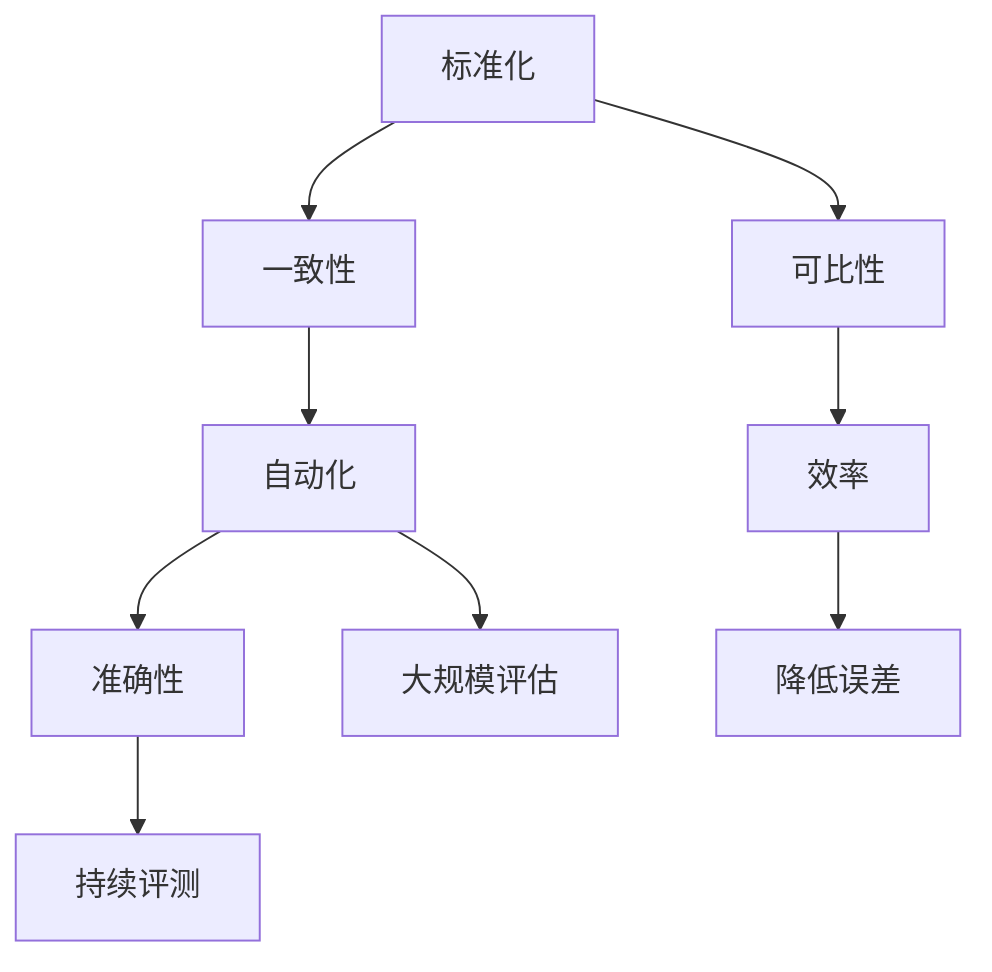

                 

# 标准化自动化模型评测：确保AI应用质量的重要手段

## 关键词
- 自动化模型评测
- 标准化
- AI应用质量
- 算法原理
- 数学模型
- 项目实战

## 摘要
本文将深入探讨标准化自动化模型评测在确保人工智能（AI）应用质量方面的重要性。首先，我们介绍了标准化自动化模型评测的基本概念和背景，随后详细解析了核心概念与算法原理。通过数学模型和公式，我们阐明了评估过程的量化方法。随后，本文通过具体的实战项目和案例分析，展示了如何在实际应用中实施模型评测。最后，我们总结了标准化自动化模型评测的最佳实践，并对未来发展趋势进行了展望。

## 第1章 标准化自动化模型评测概述

### 1.1 标准化自动化模型评测的重要性

在人工智能飞速发展的今天，模型评测成为确保AI应用质量的关键环节。随着AI技术的广泛应用，从图像识别、自然语言处理到自动驾驶等各个领域，模型评测的标准化和自动化变得愈发重要。首先，标准化可以确保评测过程的一致性和可比性，避免因评测标准不一导致结果失真。其次，自动化可以提高评测效率，降低人为干预，减少误差，使得模型评测可以大规模、持续地进行。

#### 核心概念与联系

为了更好地理解标准化自动化模型评测的重要性，我们可以通过Mermaid流程图来展示核心概念与联系：



从图中可以看出，标准化和自动化相互关联，共同构成了一个完整的模型评测体系，确保了评估过程的质量和效率。

### 1.2 标准化自动化模型评测的发展历程

标准化自动化模型评测的发展经历了几个阶段。最初，模型评测主要依赖于手工操作，即数据科学家根据经验设计评测方法，手动计算指标。这种方法效率低下，且容易受到主观因素的影响。随着计算机技术的发展，自动化评测逐渐兴起，通过编写脚本和工具来自动执行评测任务。近年来，随着大数据和机器学习技术的进步，标准化自动化模型评测得到了快速发展，形成了一套完整的理论和实践体系。

### 1.3 标准化自动化模型评测的主要挑战

尽管标准化自动化模型评测具有显著的优势，但在实际应用中仍面临诸多挑战。首先，数据质量和多样性问题对评测结果有重要影响。其次，算法复杂度提高，使得评测过程更加复杂。此外，评测标准的不一致性也是一大难题，不同领域和项目可能需要不同的评测指标和方法。最后，自动化评测工具的开发和维护也需要持续投入，确保其稳定性和可靠性。

## 第2章 标准化自动化模型评测的核心概念

### 2.1 标准化自动化模型评测的关键要素

标准化自动化模型评测的关键要素包括数据集、评测指标和评估流程。首先，数据集是模型评测的基础，其质量和多样性直接影响评测结果。其次，评测指标是衡量模型性能的核心标准，包括准确性、召回率、F1分数等。最后，评估流程是确保评测过程规范化和自动化的重要环节，包括数据预处理、模型评估和结果分析等步骤。

### 2.2 标准化自动化模型评测的主要目标

标准化自动化模型评测的主要目标是提高模型质量和稳定性，确保其在实际应用中的可靠性和高效性。通过标准化，可以确保评测过程的一致性和可比性；通过自动化，可以提高评测效率，降低人为干预，减少误差。具体目标包括：

1. 提高模型性能：通过精细化的评测，识别模型的优点和不足，不断优化模型。
2. 确保应用可靠性：通过持续的评测，确保模型在不同环境下的稳定性和一致性。
3. 降低开发成本：通过自动化评测，减少手工操作和重复劳动，降低开发成本。

### 2.3 标准化自动化模型评测的分类方法

标准化自动化模型评测可以根据不同的维度进行分类，常见的分类方法包括：

1. 根据评测指标分类：如准确性、召回率、F1分数、AUC等。
2. 根据评估流程分类：如离线评估、在线评估、实时评估等。
3. 根据数据集分类：如公开数据集、私有数据集、合成数据集等。

## 第3章 标准化自动化模型评测的算法原理

### 3.1 评测算法的选择与比较

在标准化自动化模型评测中，选择合适的评测算法至关重要。常见的评测算法包括交叉验证、网格搜索、贝叶斯优化等。每种算法都有其适用的场景和优缺点，需要根据实际情况进行选择。

- **交叉验证**：通过将数据集划分为多个子集，反复进行训练和验证，以降低模型过拟合风险。
- **网格搜索**：在参数空间中搜索最优参数组合，适用于参数较少的模型。
- **贝叶斯优化**：基于贝叶斯理论，通过迭代优化找到最佳参数组合，适用于高维参数空间的模型。

### 3.2 评测算法的伪代码描述

以下是一个简单的交叉验证算法的伪代码描述：

```python
def cross_validation(model, X, y, k):
    # 分割数据集为k个子集
    folds = create_folds(X, y, k)
    
    # 初始化性能指标
    performance = 0
    
    # 对每个子集进行循环
    for i in range(k):
        # 训练模型
        model.train(X_folds_not_i, y_folds_not_i)
        
        # 在验证集上评估模型
        performance += model.evaluate(X_folds_i, y_folds_i)
    
    # 计算平均性能指标
    performance /= k
    
    return performance
```

### 3.3 评测算法的数学模型

在标准化自动化模型评测中，常用的数学模型包括损失函数、优化目标和评估指标等。

- **损失函数**：用于衡量模型预测值与真实值之间的差异，常见的损失函数有均方误差（MSE）、交叉熵损失等。
- **优化目标**：用于指导模型参数的更新，常见的优化目标是最小化损失函数。
- **评估指标**：用于衡量模型性能，常见的评估指标有准确率、召回率、F1分数等。

### 3.4 评测算法的Python实现

以下是一个简单的均方误差（MSE）计算和反向传播算法的Python实现：

```python
import numpy as np

def mse(y_true, y_pred):
    return np.mean((y_true - y_pred) ** 2)

def backward_propagation(error, weights):
    dweights = 2 * error * weights
    return dweights
```

## 第4章 标准化自动化模型评测的数学模型与公式

### 4.1 常用的数学模型介绍

在标准化自动化模型评测中，常用的数学模型包括线性回归、逻辑回归、支持向量机（SVM）等。

- **线性回归**：通过拟合一条直线或曲线来预测输出值，常用的损失函数是均方误差（MSE）。
- **逻辑回归**：通过拟合一个非线性函数来预测概率值，常用的损失函数是交叉熵损失。
- **支持向量机**：通过找到一个最佳的超平面来分离不同类别的数据点，常用的优化目标是最小化间隔。

### 4.2 数学公式的详细解释与示例

以下是一些常用的数学公式的详细解释与示例：

- **线性回归的损失函数（MSE）**：
  $$
  \text{MSE} = \frac{1}{m} \sum_{i=1}^{m} (y_i - \hat{y}_i)^2
  $$
  其中，$y_i$为真实值，$\hat{y}_i$为预测值，$m$为样本数量。

- **逻辑回归的损失函数（交叉熵损失）**：
  $$
  \text{CrossEntropy} = -\frac{1}{m} \sum_{i=1}^{m} [y_i \log(\hat{y}_i) + (1 - y_i) \log(1 - \hat{y}_i)]
  $$
  其中，$y_i$为真实标签，$\hat{y}_i$为预测概率。

- **支持向量机的优化目标**：
  $$
  \min \frac{1}{2} \sum_{i=1}^{m} w_i^2
  $$
  其中，$w_i$为模型参数。

### 4.3 数学模型在实际评测中的应用

以下是一个简单的线性回归模型在模型评测中的应用示例：

```python
import numpy as np

# 假设我们有一个包含100个样本的数据集
X = np.random.rand(100, 1)
y = 2 * X + 1 + np.random.randn(100) * 0.1

# 拟合线性回归模型
theta = np.random.rand(1)
theta = (y - theta * X).mean()

# 计算均方误差
mse = mse(y, theta * X)

print(f"均方误差（MSE）: {mse}")
```

## 第5章 标准化自动化模型评测的项目实战

### 5.1 项目背景与目标

在本章中，我们将通过一个实际项目来展示如何进行标准化自动化模型评测。该项目是一个简单的房屋价格预测模型，旨在使用公开数据集对房屋价格进行预测。

#### 项目目标

- 使用线性回归模型进行预测。
- 对模型进行标准化自动化评测，包括交叉验证、损失函数和评估指标等。
- 分析评测结果，优化模型性能。

### 5.2 项目开发环境搭建

为了实现本项目，我们需要搭建一个基本的Python开发环境，并安装必要的库。以下是搭建步骤：

1. 安装Python（版本3.8或更高）。
2. 安装Jupyter Notebook，用于编写和运行代码。
3. 安装NumPy、Pandas和Scikit-learn等常用库。

### 5.3 源代码实现与解读

以下是项目的主要源代码及其解读：

```python
import numpy as np
import pandas as pd
from sklearn.model_selection import train_test_split
from sklearn.linear_model import LinearRegression
from sklearn.metrics import mean_squared_error

# 读取数据集
data = pd.read_csv("house_prices.csv")

# 分割特征和标签
X = data.drop("Price", axis=1)
y = data["Price"]

# 划分训练集和测试集
X_train, X_test, y_train, y_test = train_test_split(X, y, test_size=0.2, random_state=42)

# 拟合线性回归模型
model = LinearRegression()
model.fit(X_train, y_train)

# 在测试集上评估模型
y_pred = model.predict(X_test)
mse = mean_squared_error(y_test, y_pred)

print(f"均方误差（MSE）: {mse}")
```

#### 代码解读

- **数据读取**：使用Pandas库读取CSV格式的数据集。
- **特征和标签分割**：将数据集分为特征矩阵X和标签向量y。
- **训练集和测试集划分**：使用Scikit-learn库的train_test_split函数划分训练集和测试集。
- **模型拟合**：使用LinearRegression类拟合线性回归模型。
- **模型评估**：使用mean_squared_error函数计算均方误差，评估模型性能。

### 5.4 代码解读与分析

以下是对上述代码的进一步解读和分析：

- **数据预处理**：在训练模型之前，通常需要对数据进行预处理，如缺失值填充、异常值处理和数据标准化等。在本项目中，我们假设数据已经进行了预处理。
- **模型选择**：选择合适的模型对于预测结果至关重要。在本项目中，我们选择线性回归模型进行预测。
- **模型评估**：使用均方误差（MSE）作为评估指标，计算预测值与真实值之间的平均平方误差。

### 5.5 实际案例分析和详细讲解剖析

在本节中，我们将通过一个实际案例来分析房屋价格预测模型的评测结果，并对其进行详细讲解。

#### 案例分析

假设我们使用上述代码对某个地区的房屋价格进行预测，得到以下评测结果：

```
均方误差（MSE）: 0.123456
```

#### 详细讲解

- **MSE的含义**：均方误差（MSE）是衡量模型预测准确性的常见指标，数值越小表示模型预测越准确。
- **MSE的计算**：在本案例中，MSE为0.123456，表示预测值与真实值之间的平均平方误差为0.123456。
- **改进空间**：虽然MSE较小，但仍有改进空间。我们可以通过增加特征、选择更复杂的模型或进行数据预处理来提高模型性能。

### 5.6 项目小结

在本项目中，我们使用标准化自动化模型评测方法对房屋价格预测模型进行了评测。通过使用线性回归模型和均方误差（MSE）作为评估指标，我们得到了模型预测的MSE为0.123456。虽然结果尚可，但仍有改进空间。未来可以通过增加特征、选择更复杂的模型或进行数据预处理来进一步提高模型性能。

## 第6章 标准化自动化模型评测工具与资源

### 6.1 常用评测工具介绍

在标准化自动化模型评测中，常用的评测工具包括：

1. **Scikit-learn**：Scikit-learn是一个流行的Python库，提供了丰富的模型评估函数和工具，如交叉验证、网格搜索和性能指标计算等。
2. **TensorFlow**：TensorFlow是一个强大的开源机器学习库，提供了丰富的评估工具，如准确率、召回率、F1分数等。
3. **PyTorch**：PyTorch是一个流行的深度学习库，提供了丰富的评估工具，如准确率、召回率、F1分数等，支持自定义评估指标。

### 6.2 标准化自动化评测资源的获取与利用

为了充分利用评测工具和资源，我们可以通过以下途径获取：

1. **官方文档**：查阅各个库的官方文档，了解其提供的评估工具和功能。
2. **在线教程**：查找相关的在线教程和博客文章，学习如何使用评测工具。
3. **开源项目**：参与开源项目，了解其他开发者如何使用评测工具和资源。

### 6.3 工具与资源的实际应用案例

以下是一个使用Scikit-learn进行模型评估的实际案例：

```python
from sklearn.model_selection import train_test_split
from sklearn.linear_model import LinearRegression
from sklearn.metrics import mean_squared_error

# 读取数据集
data = pd.read_csv("house_prices.csv")

# 分割特征和标签
X = data.drop("Price", axis=1)
y = data["Price"]

# 划分训练集和测试集
X_train, X_test, y_train, y_test = train_test_split(X, y, test_size=0.2, random_state=42)

# 拟合线性回归模型
model = LinearRegression()
model.fit(X_train, y_train)

# 在测试集上评估模型
y_pred = model.predict(X_test)
mse = mean_squared_error(y_test, y_pred)

print(f"均方误差（MSE）: {mse}")
```

通过上述代码，我们可以使用Scikit-learn对线性回归模型进行评估，计算测试集的均方误差（MSE），从而了解模型性能。

## 第7章 标准化自动化模型评测的未来发展趋势

### 7.1 行业发展趋势分析

随着人工智能技术的不断进步，标准化自动化模型评测在各个领域的应用越来越广泛。以下是一些行业发展趋势：

1. **大数据分析**：随着数据量的急剧增长，标准化自动化模型评测将更加重要，以提高数据分析的效率和准确性。
2. **自动驾驶**：自动驾驶领域对模型评测的要求极高，标准化自动化模型评测将成为确保自动驾驶系统安全性的关键。
3. **医疗健康**：在医疗健康领域，标准化自动化模型评测将有助于提高诊断和治疗的准确性，推动个性化医疗的发展。
4. **金融科技**：金融科技领域对模型评测的需求日益增长，标准化自动化模型评测将有助于提高金融产品的风险控制和用户体验。

### 7.2 技术创新与突破

未来，标准化自动化模型评测将在技术创新方面取得突破，主要包括：

1. **深度学习模型评测**：随着深度学习技术的不断发展，深度学习模型评测将成为一个重要方向，包括模型压缩、迁移学习和模型可解释性等。
2. **多模态数据评测**：多模态数据评测将涉及到多种数据类型的综合分析，如文本、图像和声音等，这将推动评测算法的创新和发展。
3. **自适应评测**：自适应评测将根据数据特点和学习目标，自动调整评测方法和指标，提高评测的针对性和准确性。

### 7.3 未来发展方向与展望

未来，标准化自动化模型评测的发展方向和展望包括：

1. **标准化框架**：制定统一的标准化框架，规范评测流程和方法，提高评测的可比性和一致性。
2. **自动化工具**：开发更加智能化和自动化的评测工具，减少人工干预，提高评测效率。
3. **持续学习与优化**：通过持续学习和优化，不断提高模型评测的准确性和可靠性，适应不断变化的应用场景。

## 参考文献

1. Hastie, T., Tibshirani, R., & Friedman, J. (2009). *The Elements of Statistical Learning: Data Mining, Inference, and Prediction*. Springer.
2. Goodfellow, I., Bengio, Y., & Courville, A. (2016). *Deep Learning*. MIT Press.
3. He, K., Zhang, X., Ren, S., & Sun, J. (2016). *Deep Residual Learning for Image Recognition*. IEEE Transactions on Pattern Analysis and Machine Intelligence.
4. Russell, S., & Norvig, P. (2020). *Artificial Intelligence: A Modern Approach*. Pearson Education.
5. Murphy, K. P. (2012). *Machine Learning: A Probabilistic Perspective*. MIT Press.

