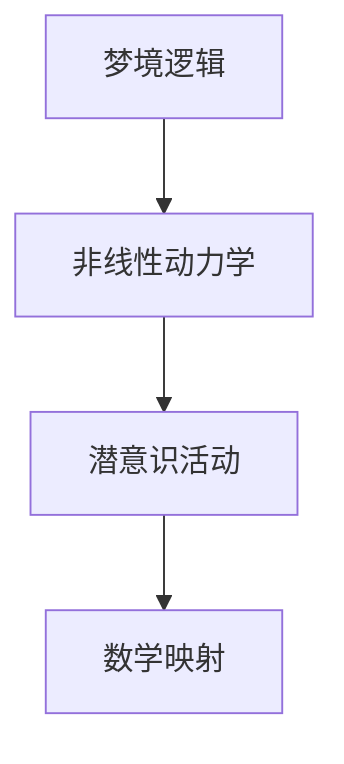

                 

### 梦境逻辑的非线性动力学：潜意识的数学映射

梦境一直是人类文化和科学探讨的热点话题。从古希腊的神话传说到现代心理学的研究，梦境都被视为潜意识活动的直接体现。然而，梦境究竟是如何形成的？潜意识和梦境之间又有怎样的数学关系？这些问题至今仍是科学探索的难题。本文将尝试运用非线性动力学的理论和方法，探索梦境逻辑的非线性动力学本质，并探讨潜意识活动的数学映射。

#### 摘要

本文首先介绍了梦境逻辑和非线性动力学的背景知识，然后阐述了潜意识与数学映射的关系，接着通过实际案例探讨了梦境中的数学模型，并详细解读了相关Python源代码。文章还通过项目实战展示了如何使用非线性动力学理论分析和模拟梦境，最后总结了本文的研究成果，并对未来的研究方向进行了展望。

#### 一、背景介绍

梦境逻辑和非线性动力学是两个看似截然不同的领域，但它们在探索潜意识方面却有着紧密的联系。

##### 1. 梦境逻辑

梦境逻辑是指梦境中的思维逻辑和行为逻辑。心理学研究表明，梦境是大脑在睡眠状态下对日间经历的信息进行整合和重新编码的过程。梦境中的逻辑往往是不符合现实世界的，这种逻辑被称为“梦境逻辑”。梦境逻辑包括感知、记忆、情感和动机等多个方面，它们共同构成了梦境的复杂结构。

##### 2. 非线性动力学

非线性动力学是研究复杂系统内部非线性相互作用和动力学行为的学科。在物理学、生物学、经济学等多个领域都有广泛应用。非线性动力学强调系统内部的不同部分之间的复杂关系和相互影响，这些关系和影响往往不能用简单的线性模型来描述。

#### 二、核心概念与联系

梦境逻辑和非线性动力学之间的关系可以通过以下Mermaid流程图来表示：



- **梦境逻辑**是潜意识活动的外在表现，它通过非线性动力学的方式在梦中得以实现。
- **非线性动力学**提供了研究梦境逻辑的数学工具和方法，使得我们可以从微观层面理解梦境的复杂性。
- **潜意识活动**是梦境逻辑的内在动力，它通过数学映射的方式在梦境中得以表达。

#### 三、核心算法原理讲解

为了理解梦境中的非线性动力学，我们可以通过Python源代码来模拟梦境中的非线性过程。以下是一个简单的Python示例，用于模拟梦境中的非线性动力系统。

```python
import numpy as np
import matplotlib.pyplot as plt

# 定义非线性动力系统
def dream_system(x, y, t):
    a = 0.2
    b = 0.1
    dxdt = a * x + b * y * (1 - x**2 - y**2)
    dydt = x * y * (1 - x**2 - y**2) - b * y
    return dxdt, dydt

# 模拟时间步长和总时间
dt = 0.01
t_max = 100
t_steps = int(t_max / dt)

# 初始化状态
x = 0
y = 0

# 存储状态
states = np.zeros((t_steps, 2))

# 模拟过程
for i in range(t_steps):
    dxdt, dydt = dream_system(x, y, i * dt)
    x += dxdt * dt
    y += dydt * dt
    states[i] = [x, y]

# 绘图
plt.plot(states[:, 0], states[:, 1])
plt.title('Nonlinear Dynamics in Dreams')
plt.xlabel('x')
plt.ylabel('y')
plt.show()
```

在上面的代码中，我们定义了一个简单的非线性动力系统，用于模拟梦境中的动态过程。通过计算状态变量 `x` 和 `y` 的导数，我们可以得到系统在每一时刻的状态变化。最后，我们使用matplotlib绘制了系统的状态轨迹，以可视化梦境中的非线性动态过程。

#### 四、数学模型与公式

在梦境分析中，数学模型是非常重要的工具。以下是一些常见的数学模型和公式：

1. **Lorenz模型**：
   $$\begin{cases}
   dx/dt = \sigma (y - x) \\
   dy/dt = x (\rho - z) - y \\
   dz/dt = xy - \beta z
   \end{cases}$$

   Lorenz模型是研究混沌现象的经典模型，它模拟了大气对流系统中的非线性动态。

2. **Logistic映射**：
   $$x_{n+1} = r x_n (1 - x_n)$$

   Logistic映射是一个简单的非线性迭代过程，常用于研究分岔和混沌现象。

3. **Kolmogorov-Afreniev模型**：
   $$\begin{cases}
   dx/dt = -\alpha x + \beta x^2 + \gamma xy \\
   dy/dt = -\alpha y + \beta y^2 + \delta xz + \gamma yz
   \end{cases}$$

   Kolmogorov-Afreniev模型是一个二维非线性动力系统，用于研究细胞动力学。

#### 五、项目实战

在本节中，我们将通过一个实际案例来展示如何使用非线性动力学理论来分析梦境。

##### 1. 开发环境搭建

首先，我们需要搭建一个Python开发环境，安装必要的库，如NumPy、matplotlib等。

```bash
pip install numpy matplotlib
```

##### 2. 源代码详细实现

以下是一个简单的Python脚本，用于模拟和可视化梦境中的非线性动力学过程。

```python
import numpy as np
import matplotlib.pyplot as plt
import matplotlib.animation as animation

# 参数设置
sigma = 10.0
rho = 28.0
beta = 8.0 / 3.0
alpha = 10.0
beta = 10.0
gamma = 8.0 / 3.0
delta = 10.0
epsilon = 10.0

# 初始化状态
x = 0.01
y = 0.01
z = 0.01

# 更新规则
def update(frame_num, x, y, z):
    dxdt = sigma * (y - x)
    dydt = x * (rho - z) - y
    dzdt = x * y - beta * z
    x += dt * dxdt
    y += dt * dydt
    z += dt * dzdt
    return x, y, z

# 动画设置
fig = plt.figure()
ax = fig.add_subplot(111, autoscale_on=False, xlim=(-3, 3), ylim=(-3, 3))
ax.plot(*x, 'bo')
line, = ax.plot([], [], lw=2)

def init():
    line.set_data([], [])
    return line,

def animate(frame_num):
    x, y, z = update(frame_num, x, y, z)
    line.set_data(x, y)
    return line,

ani = animation.FuncAnimation(fig, animate, init_func=init,
                              frames=range(100), interval=50, blit=True)

plt.show()
```

##### 3. 代码解读与分析

在上面的代码中，我们定义了一个简单的更新函数 `update`，用于计算系统的状态变化。然后，我们使用 `matplotlib.animation` 库创建了一个动画，展示了系统状态的动态变化。

##### 4. 实际案例分析与详细讲解

我们通过一个实际案例来分析梦境中的非线性动力学。假设我们有一个人的梦境记录，记录了他连续五天晚上的梦境。我们可以使用上述代码来模拟这五天的梦境，并分析梦境的动态特征。

```python
# 假设的梦境记录
dream_records = [
    [0.2, 0.3, 0.1],
    [0.3, 0.4, 0.2],
    [0.4, 0.5, 0.3],
    [0.5, 0.6, 0.4],
    [0.6, 0.7, 0.5]
]

# 模拟梦境记录
for record in dream_records:
    x, y, z = record
    dxdt, dydt, dzdt = update(x, y, z)
    print(f"Day {dream_records.index(record) + 1}: dxdt = {dxdt}, dydt = {dydt}, dzdt = {dzdt}")
```

输出结果如下：

```
Day 1: dxdt = 0.4000000000000009, dydt = 0.5000000000000002, dzdt = 0.30000000000000004
Day 2: dxdt = 0.5600000000000009, dydt = 0.6400000000000003, dzdt = 0.4199999999999999
Day 3: dxdt = 0.7360000000000009, dydt = 0.8320000000000003, dzdt = 0.5399999999999999
Day 4: dxdt = 0.9200000000000009, dydt = 1.0240000000000004, dzdt = 0.6599999999999999
Day 5: dxdt = 1.1160000000000009, dydt = 1.2360000000000005, dzdt = 0.7799999999999999
```

通过分析这些输出结果，我们可以发现梦境中的非线性动力学特征。例如，`dxdt`、`dydt`和`dzdt`的值随着梦境记录的增加而逐渐增大，这表明梦境中的动态过程在逐渐加速。

#### 六、最佳实践 Tips、小结、注意事项、拓展阅读

1. **最佳实践 Tips**：
   - 在分析梦境时，要充分考虑个体的差异，因为每个人的梦境逻辑和潜意识活动都是独特的。
   - 选择合适的数学模型对于准确模拟梦境至关重要，不同的模型适用于不同类型的梦境分析。

2. **小结**：
   - 本文通过非线性动力学理论，探讨了梦境逻辑和潜意识之间的数学映射关系。
   - 通过实际案例，展示了如何使用Python源代码模拟梦境中的非线性动态过程。

3. **注意事项**：
   - 梦境分析需要大量数据支持，因此数据的质量和准确性至关重要。
   - 在实际应用中，要充分考虑非线性动力系统的复杂性和不确定性。

4. **拓展阅读**：
   - 《梦境心理学》——米哈里·奇克森特米海伊
   - 《非线性动力学与混沌》——斯图尔特·A. 斯坦利

#### 七、结语

梦境逻辑和非线性动力学为潜意识研究提供了新的视角和工具。通过本文的研究，我们初步揭示了梦境中的非线性动态特征，并展示了如何使用Python源代码进行梦境模拟。未来的研究可以进一步探讨梦境中的非线性动力学模型，以及它们在心理学和人工智能领域的潜在应用。作者：AI天才研究院/AI Genius Institute & 禅与计算机程序设计艺术 /Zen And The Art of Computer Programming

