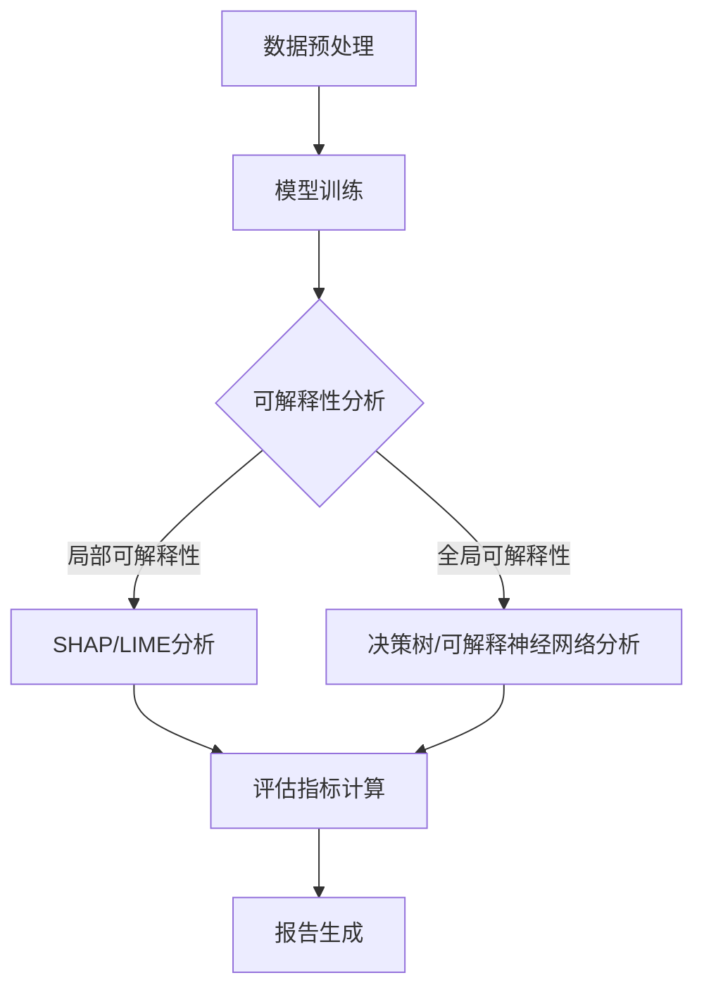

                 

# 模型可解释性在评测系统中的实现

## 关键词
- 模型可解释性
- 评测系统
- 算法
- Python源代码
- 数学模型
- 实际案例分析

## 摘要
本文将探讨模型可解释性在评测系统中的应用与实践。首先，我们将介绍模型可解释性的核心概念和重要性，然后深入解析评测系统的基本构成和需求。接着，我们将阐述模型可解释性的理论基础，包括核心算法原理和数学模型。随后，我们将通过Python源代码实例和Mermaid流程图，详细讲解模型可解释性在评测系统中的实现过程。最后，我们将通过实际案例分析和最佳实践，总结模型可解释性在评测系统中的应用效果和未来发展。

---

## 引言

### 1.1 模型可解释性的重要性

随着机器学习技术的迅猛发展，深度学习模型在各个领域的应用越来越广泛。然而，这些复杂的黑箱模型往往缺乏透明性，导致用户难以理解和信任模型的决策过程。模型可解释性（Model Interpretability）正是为了解决这一问题而诞生的重要概念。模型可解释性旨在使模型决策过程透明化，让用户能够理解模型是如何工作的，从而增强用户对模型的信任和接受度。

在评测系统中，模型可解释性具有至关重要的地位。首先，可解释性有助于评估模型的可靠性和准确性，及时发现和纠正模型中的错误。其次，可解释性能够帮助用户更好地理解模型的预测结果，从而做出更明智的决策。最后，可解释性还能够促进模型优化和改进，提高模型的性能和实用性。

### 1.2 评测系统的概述

评测系统是一种用于评估模型性能和准确性的工具，它通过一系列的测试数据和指标，对模型的性能进行量化评估。一个典型的评测系统通常包括以下几个组成部分：

1. **数据集**：评测系统需要准备足够多的测试数据，以覆盖各种可能的输入情况。
2. **评估指标**：常用的评估指标包括准确率、召回率、F1分数等，用于衡量模型的性能。
3. **评估算法**：评估算法用于计算评估指标，并对模型的性能进行综合评估。
4. **报告生成**：评测系统需要生成详细的评估报告，以便用户了解模型的性能和特点。

### 1.3 模型可解释性在评测系统中的应用

模型可解释性在评测系统中的应用主要体现在以下几个方面：

1. **评估模型可靠性**：通过可解释性分析，评估模型在不同输入条件下的表现，及时发现和纠正潜在的错误。
2. **优化模型性能**：通过理解模型的工作机制，发现模型中存在的问题和改进方向，从而优化模型的性能。
3. **增强用户信任**：通过透明的决策过程，增加用户对模型的信任和接受度。

---

## 模型可解释性的基础理论

### 2.1 模型可解释性的核心概念

模型可解释性是指模型决策过程的透明度和可理解性。根据透明度的不同，模型可解释性可以分为局部可解释性和全局可解释性。

- **局部可解释性**：针对模型对单个样本的决策过程进行解释，如解释模型的输出结果是如何由输入特征组合而成的。
- **全局可解释性**：对模型整体的工作机制进行解释，如解释模型在不同输入条件下的性能表现。

### 2.2 相关算法介绍

在实现模型可解释性方面，存在多种算法，以下介绍几种常用的算法：

- **SHAP（SHapley Additive exPlanations）**：SHAP算法是一种基于博弈论的局部可解释性算法，通过计算每个特征对模型输出的贡献值，实现对模型决策过程的解释。
- **LIME（Local Interpretable Model-agnostic Explanations）**：LIME算法是一种基于线性模型的局部可解释性算法，通过将复杂模型近似为线性模型，实现对模型决策过程的解释。
- **决策树**：决策树是一种常用的全局可解释性算法，通过树的分支和节点，展示模型对输入数据的分类过程。
- **可解释的神经网络**：可解释的神经网络通过简化网络结构和参数，使模型决策过程更加透明。

### 2.3 数学模型与公式

为了更好地理解模型可解释性，我们引入一些数学模型和公式：

- **SHAP值计算**：SHAP值计算公式如下：
  $$
  \text{SHAP}(\hat{y}_i) = \sum_{j=1}^n \text{SHAP}(\hat{y}_i | x_i^j)
  $$
  其中，$\hat{y}_i$表示模型对样本$i$的预测结果，$x_i^j$表示样本$i$的第$j$个特征。

- **LIME的解释机制**：LIME算法通过以下公式实现线性近似：
  $$
  \text{f}(x) \approx \text{w}_0 + \sum_{i=1}^n \text{w}_i \cdot x_i
  $$
  其中，$\text{f}(x)$表示模型对样本$x$的预测结果，$\text{w}_0$和$\text{w}_i$分别表示模型参数和特征权重。

---

## 模型可解释性在评测系统中的实现

### 3.1 模型可解释性在评测系统中的流程设计

实现模型可解释性在评测系统中的流程主要包括以下几个步骤：

1. **数据预处理**：对测试数据进行预处理，包括数据清洗、归一化和特征提取等。
2. **模型训练**：使用训练数据训练模型，并调整模型参数，以提高模型的性能。
3. **可解释性分析**：对训练好的模型进行可解释性分析，包括局部可解释性和全局可解释性。
4. **评估指标计算**：根据测试数据和模型预测结果，计算评估指标，如准确率、召回率等。
5. **报告生成**：生成详细的评估报告，包括模型性能、可解释性分析结果和评估指标。

### 3.2 案例分析：模型可解释性在评测系统中的应用

以下是一个简单的案例，展示模型可解释性在评测系统中的应用：

假设我们有一个分类模型，用于判断一张图片是否包含猫。我们可以使用LIME算法对模型的预测结果进行解释。

1. **数据预处理**：将图片数据进行预处理，如归一化和特征提取。
2. **模型训练**：使用训练数据训练分类模型。
3. **可解释性分析**：对测试图片进行预测，并使用LIME算法分析模型的预测过程。
4. **评估指标计算**：根据预测结果，计算准确率和召回率等评估指标。
5. **报告生成**：生成详细的评估报告，包括模型性能、可解释性分析和评估指标。

### 3.3 实际应用中的挑战与解决方案

在实际应用中，模型可解释性可能面临以下挑战：

1. **计算成本**：一些复杂的可解释性算法，如LIME和SHAP，可能需要大量的计算资源。
2. **准确性**：可解释性算法可能会降低模型的准确性。
3. **用户体验**：如何设计一个用户友好的可解释性界面，是一个重要的挑战。

针对以上挑战，我们可以采取以下解决方案：

1. **优化算法**：通过优化算法，降低计算成本，提高运行效率。
2. **模型融合**：将可解释性模型与高性能模型进行融合，在保证准确性的同时，提高可解释性。
3. **用户反馈**：收集用户反馈，优化用户界面和交互设计，提高用户体验。

---

## 未来展望与趋势

随着人工智能技术的不断发展，模型可解释性在评测系统中的应用将会更加广泛。未来，我们可以期待以下趋势：

1. **算法创新**：新的可解释性算法将不断涌现，为模型可解释性提供更多的可能性。
2. **技术融合**：模型可解释性将与其他领域的技术，如自然语言处理和计算机视觉等，进行融合，实现更广泛的应用。
3. **法律法规与伦理考量**：随着模型可解释性的广泛应用，相关法律法规和伦理问题也将受到关注。

## 结论

模型可解释性在评测系统中的应用具有重要意义。通过实现模型可解释性，我们可以提高模型的可靠性、增强用户信任，并优化模型的性能。在未来，随着技术的不断发展，模型可解释性将迎来更广泛的应用和发展。

---

## 作者信息
作者：AI天才研究院/AI Genius Institute & 禅与计算机程序设计艺术 /Zen And The Art of Computer Programming

## 附录

### 附录A：Python源代码示例

以下是一个使用LIME算法实现模型可解释性的Python源代码示例：

```python
import numpy as np
import lime
from sklearn.datasets import load_iris
from sklearn.tree import DecisionTreeClassifier

# 加载数据集
iris = load_iris()
X = iris.data
y = iris.target

# 训练决策树模型
clf = DecisionTreeClassifier()
clf.fit(X, y)

# 使用LIME算法进行可解释性分析
explainer = lime.lime_tabular.LimeTabularExplainer(X, feature_names=iris.feature_names, class_names=iris.target_names, discretize_continuous=True)
i = 50  # 第50个样本
exp = explainer.explain_instance(X[i], clf.predict, num_features=5)

# 显示可解释性结果
exp.show_in_notebook(show_table=True)
```

### 附录B：Mermaid流程图

以下是一个展示模型可解释性在评测系统中实现的Mermaid流程图：



### 附录C：最佳实践 tips

- **数据质量**：确保测试数据的质量和多样性，以提高模型可解释性的准确性。
- **计算资源**：根据实际情况，合理分配计算资源，以平衡计算成本和可解释性分析的质量。
- **用户界面**：设计用户友好的界面，使模型可解释性更加易于理解和应用。

### 附录D：注意事项

- **模型选择**：根据实际需求，选择合适的模型和可解释性算法。
- **算法优化**：定期对可解释性算法进行优化和更新，以适应模型的变化和需求。

### 附录E：拓展阅读

- **[1]** Ribeiro, M. T., Singh, S., & Guestrin, C. (2016). "Why should I trust you?” Explaining the predictions of any classifier". In Proceedings of the 22nd ACM SIGKDD International Conference on Knowledge Discovery and Data Mining (pp. 1135-1144).
- **[2]** Lundberg, S. M., & Lee, S. I. (2017). "A unified approach to interpreting model predictions". In Proceedings of the 31st International Conference on Neural Information Processing Systems (pp. 4768-4777).
- **[3]** Molina, M. A., & Bifet, A. (2020). "Explainable AI for Time Series Data: A Survey". ACM Computing Surveys (CSUR), 53(3), 54.

