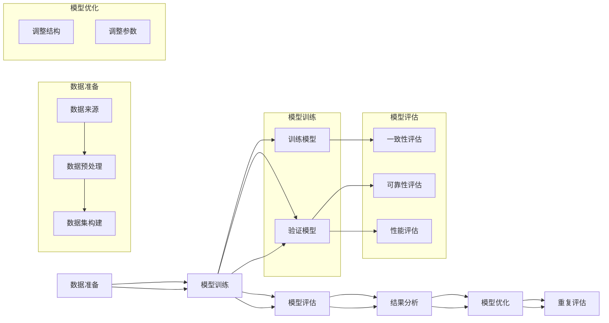

                 

# 第1章 引言与核心概念

## 1.1 模型行为一致性的定义与重要性

在人工智能和机器学习领域，模型行为一致性指的是模型在不同条件下、不同数据集上表现的一致性和稳定性。它是一种衡量模型可靠性和可信度的指标，对于确保人工智能系统的长期稳定运行至关重要。

### 1.1.1 模型行为一致性的定义

模型行为一致性可以定义为模型输出结果在不同环境、数据集和训练迭代中的稳定性和一致性。具体来说，这包括以下几个方面：

1. **数据集一致性**：模型在不同数据集上的输出结果应当保持一致，即相同输入数据应产生相似或相同的输出。
2. **训练迭代一致性**：在模型训练过程中，随着迭代次数的增加，模型的行为应逐渐趋于稳定，而非出现剧烈波动。
3. **条件一致性**：在不同条件下，如不同的训练时间、计算资源等，模型的行为也应保持一致。

### 1.1.2 模型行为一致性的重要性

模型行为一致性对于人工智能系统的应用具有重要意义：

1. **可靠性提升**：一致性良好的模型能够减少因模型行为不稳定导致的系统错误，提高系统的可靠性和稳定性。
2. **用户信任**：一致的模型行为有助于建立用户对系统的信任，增强用户体验。
3. **优化资源分配**：通过评估模型行为一致性，可以更好地分配计算资源，优化系统性能。

## 1.2 模型行为一致性评估的目的与意义

模型行为一致性评估旨在通过系统化的方法评估模型的稳定性和一致性，从而指导模型的改进和优化。其目的和意义如下：

### 1.2.1 评估的目的

1. **识别问题**：通过评估，可以识别出模型中存在的潜在问题，如数据依赖性、训练不稳定等。
2. **改进模型**：根据评估结果，可以对模型进行调整和优化，以提高其行为一致性。
3. **评估效果**：评估可以帮助研究人员和工程师验证模型改进的有效性。

### 1.2.2 评估的意义

1. **保障系统稳定**：一致性评估有助于保障人工智能系统的长期稳定运行。
2. **提高模型质量**：通过评估，可以不断提高模型的质量和可靠性，推动人工智能技术的应用和发展。
3. **促进创新**：评估方法和技术的发展将推动人工智能领域的技术创新。

## 1.3 本书结构概述

本书将分为七个章节，具体结构如下：

### 1.3.1 各章节内容概述

- **第1章**：引言与核心概念，介绍模型行为一致性的定义、重要性以及评估的目的和意义。
- **第2章**：背景与意义，讨论模型行为一致性评估的背景、意义以及面临的挑战。
- **第3章**：评估方法与技术，详细介绍模型行为一致性评估的方法和技术。
- **第4章**：评估工具与框架，介绍常用的评估工具和框架，以及如何选择合适的工具。
- **第5章**：案例分析，通过实际案例展示模型行为一致性评估的过程和结果。
- **第6章**：挑战与未来发展趋势，分析评估过程中的挑战，并提出解决方案和未来发展方向。
- **第7章**：结论与展望，总结全书内容，提出结论和未来研究与发展方向。

### 1.3.2 阅读指南与建议

本书适合对人工智能和机器学习有兴趣的读者，特别是从事模型开发、优化和评估的工程师和研究人员。建议读者按照章节顺序阅读，以便更好地理解和掌握模型行为一致性评估的方法和技术。

作者：AI天才研究院/AI Genius Institute & 禅与计算机程序设计艺术 /Zen And The Art of Computer Programming

----------------------------------------------------------------

# 第2章 背景与意义

## 2.1 模型行为一致性评估的背景

在人工智能和机器学习领域，模型行为一致性评估的背景可以追溯到模型本身的发展历程。随着深度学习和其他先进机器学习算法的广泛应用，模型变得越来越复杂，同时也更加依赖于特定的训练数据和计算环境。

### 2.1.1 模型发展历程

1. **早期的机器学习模型**：在早期，机器学习模型通常较为简单，如线性回归、决策树等。这些模型易于理解，但性能有限，往往难以应对复杂问题。
2. **深度学习时代的到来**：随着计算能力的提升和数据规模的扩大，深度学习模型逐渐成为主流。这些模型如神经网络、卷积神经网络（CNN）、循环神经网络（RNN）等，能够处理更复杂的问题，但同时也更加复杂和难以解释。
3. **模型复杂性与数据依赖**：深度学习模型的复杂性使其对训练数据和计算环境具有很高的依赖性，导致模型在不同条件下的表现可能存在较大差异。

### 2.1.2 模型行为一致性的现状

1. **数据集差异**：不同数据集可能导致模型行为出现较大差异。例如，训练集与测试集的差异、数据分布的变化等，都可能影响模型的性能。
2. **训练不稳定**：在训练过程中，模型的性能可能会随着迭代次数的增加出现波动，导致最终模型行为不一致。
3. **环境依赖**：模型在不同计算环境下（如硬件设备、操作系统等）的行为也可能存在差异，影响模型的稳定性和可靠性。

### 2.1.3 模型行为一致性评估的必要性

1. **提高模型可靠性**：评估模型行为一致性有助于识别和解决模型中的潜在问题，提高模型的可靠性和稳定性。
2. **降低模型风险**：通过评估模型在不同条件下的行为，可以降低模型在未知环境下的风险，确保模型在实际应用中的可靠性。
3. **优化模型性能**：评估结果可以为模型优化提供指导，帮助开发人员调整模型结构、参数，以提高模型性能。

## 2.2 模型行为一致性评估的意义

### 2.2.1 提高模型可靠性

1. **一致性行为的保障**：通过评估模型行为一致性，可以确保模型在不同数据集、计算环境下的行为一致，从而提高模型的可靠性。
2. **降低错误率**：一致的模型行为有助于减少因模型不稳定导致的错误和异常，提高系统的整体性能和用户体验。

### 2.2.2 降低模型风险

1. **风险评估与预防**：通过评估模型在不同条件下的行为，可以提前发现潜在的风险，采取预防措施，降低模型在实际应用中的风险。
2. **优化资源分配**：评估结果有助于优化计算资源分配，提高系统的稳定性和效率。

### 2.2.3 优化模型性能

1. **模型调优**：通过评估模型行为一致性，可以识别出模型中存在的问题，指导开发人员对模型进行调整和优化，提高模型性能。
2. **参数调整**：评估结果可以为模型参数调整提供依据，帮助开发人员找到最优参数组合，提高模型效果。

## 2.3 模型行为一致性评估的挑战

### 2.3.1 数据质量

1. **数据集多样性**：评估模型行为一致性需要涵盖多种数据集，以保证评估结果的全面性。
2. **数据预处理**：数据预处理对于评估结果具有重要影响，需要确保数据预处理方法的合理性和一致性。

### 2.3.2 评估方法

1. **评估指标选择**：评估指标的选择需要综合考虑模型的特性、应用场景等因素，以获得准确、全面的评估结果。
2. **评估方法的适应性**：评估方法需要能够适应不同类型的模型和应用场景，具有较高的通用性和灵活性。

### 2.3.3 工具与框架

1. **评估工具选择**：评估工具的选择需要考虑其功能、性能、兼容性等因素，以确保评估过程的顺利进行。
2. **框架设计**：评估框架的设计需要具备良好的扩展性和可维护性，以适应不断变化的需求和挑战。

在下一章中，我们将详细介绍模型行为一致性评估的方法与技术，帮助读者了解如何有效地进行模型行为一致性评估。

----------------------------------------------------------------

# 第3章 评估方法与技术

## 3.1 数据准备

数据准备是模型行为一致性评估的基础步骤，直接影响评估结果的准确性和可靠性。数据准备包括数据来源、数据预处理和数据集构建等方面。

### 3.1.1 数据来源

1. **公开数据集**：如ImageNet、CIFAR-10等，这些数据集已经广泛应用于各种机器学习任务，具有广泛性和代表性。
2. **自定义数据集**：针对特定任务或应用场景，可以收集或生成自定义数据集，以满足评估的特殊需求。
3. **交叉数据集**：通过将不同来源的数据集进行交叉组合，可以增加评估数据的多样性，提高评估结果的普适性。

### 3.1.2 数据预处理

1. **数据清洗**：去除数据中的噪声和异常值，保证数据的准确性和完整性。
2. **数据归一化**：将数据缩放到相同的尺度，以便模型处理和计算。
3. **数据增强**：通过数据增强技术，如随机裁剪、旋转、翻转等，可以增加数据集的多样性，提高模型的鲁棒性。

### 3.1.3 数据集构建

1. **训练集与验证集**：通常将数据集分为训练集和验证集，训练集用于模型训练，验证集用于模型评估。
2. **测试集**：测试集用于最终的模型性能评估，通常在训练和验证阶段不使用。
3. **交叉验证**：通过交叉验证技术，可以减少评估结果对特定数据集的依赖，提高评估结果的可靠性和稳定性。

## 3.2 评估指标

评估指标是衡量模型行为一致性的关键因素。合适的评估指标能够全面、准确地反映模型在不同条件下的行为表现。

### 3.2.1 一致性指标

1. **标准差**：衡量模型在不同数据集或训练迭代中输出结果的变化程度，标准差越小，表示一致性越好。
2. **变异系数**：标准差与平均值的比值，用于衡量一致性的相对程度，变异系数越小，表示一致性越好。
3. **相关系数**：衡量不同数据集或训练迭代中模型输出结果的相关性，相关系数越接近1，表示一致性越好。

### 3.2.2 可靠性指标

1. **准确率**：模型正确预测的样本数占总样本数的比例，用于衡量模型的预测准确性。
2. **召回率**：模型正确预测为正类的样本数占实际正类样本总数的比例，用于衡量模型的召回能力。
3. **F1分数**：准确率和召回率的加权平均，用于综合考虑模型的准确性和召回能力。

### 3.2.3 性能指标

1. **平均精度**：模型在所有类别上的平均准确率，用于衡量模型的总体性能。
2. **精确度**：模型正确预测为正类的样本数与预测为正类的样本总数之比，用于衡量模型的精确度。
3. **召回率**：模型正确预测为正类的样本数与实际正类样本总数之比，用于衡量模型的召回率。

## 3.3 评估流程

评估流程是进行模型行为一致性评估的步骤和流程。一个完整的评估流程通常包括以下步骤：

### 3.3.1 评估步骤

1. **数据准备**：选择合适的数据集，进行数据清洗、预处理和增强。
2. **模型训练**：在训练集上训练模型，并在验证集上调整模型参数。
3. **模型评估**：在测试集上评估模型性能，包括一致性指标、可靠性指标和性能指标。
4. **结果分析**：对评估结果进行分析，识别模型行为一致性的问题和潜在因素。
5. **模型优化**：根据评估结果，调整模型结构或参数，以提高模型行为一致性。

### 3.3.2 评估方法选择

1. **基于一致性指标的评估**：通过计算模型在不同条件下的输出结果的一致性指标，评估模型行为一致性。
2. **基于可靠性指标的评估**：通过评估模型的预测准确性和可靠性，评估模型的行为一致性。
3. **综合评估**：结合一致性指标、可靠性指标和性能指标，全面评估模型行为一致性。

### 3.3.3 评估结果分析

1. **一致性分析**：分析模型在不同数据集、训练迭代等条件下的输出结果一致性，识别可能的一致性问题。
2. **可靠性分析**：分析模型的预测准确性和可靠性，评估模型的行为稳定性。
3. **性能分析**：分析模型的性能指标，评估模型在不同条件下的总体性能。

## 3.4 Mermaid流程图

为了更直观地展示模型行为一致性评估的流程，可以使用Mermaid语言绘制流程图。以下是评估流程的Mermaid表示：

### 3.4.2 流程图解析

1. **数据准备**：包括数据来源、数据预处理和数据集构建，为后续评估提供基础数据。
2. **模型训练**：在训练集上训练模型，并在验证集上调整模型参数，以确保模型在训练过程中保持一致性。
3. **模型评估**：通过一致性评估、可靠性评估和性能评估，全面评估模型行为一致性。
4. **结果分析**：分析评估结果，识别模型行为一致性的问题和潜在因素。
5. **模型优化**：根据评估结果，调整模型结构或参数，以提高模型行为一致性。
6. **重复评估**：通过循环评估和优化，持续提高模型的行为一致性。

通过以上流程，可以系统地评估模型行为一致性，为模型的改进和优化提供有力支持。在下一章中，我们将介绍常用的评估工具和框架，以帮助读者更好地进行模型行为一致性评估。

----------------------------------------------------------------

# 第4章 评估工具与框架

## 4.1 常用评估工具

在模型行为一致性评估过程中，选择合适的评估工具至关重要。常用的评估工具有开源工具和商业工具，每种工具都有其独特的功能和特点。

### 4.1.1 开源工具

开源工具具有免费、灵活、可扩展性强等优点，是评估模型行为一致性的常用选择。以下是一些常用的开源评估工具：

1. **TensorFlow Extended (TFX)**：TFX是一个用于构建、训练和部署机器学习模型的框架，提供了丰富的评估工具，如TensorFlow Model Analysis (TFMA)，可用于评估模型在不同数据集上的表现。
   
   - **优点**：集成度高，支持TensorFlow模型，易于与其他TFX组件集成。
   - **缺点**：对于非TensorFlow用户可能较为复杂。

2. **MLflow**：MLflow是一个开源平台，用于记录、共享和管理机器学习工作流程，其中MLflow Model Registry可用于评估模型行为一致性。

   - **优点**：管理方便，支持多种机器学习框架，易于与其他工具集成。
   - **缺点**：评估功能相对有限，需要与其他工具结合使用。

3. **Scikit-learn**：Scikit-learn是一个流行的机器学习库，提供了评估模型性能的多种指标和方法。

   - **优点**：功能全面，易于使用，适合快速原型开发。
   - **缺点**：评估工具相对基础，对复杂模型的支持有限。

### 4.1.2 商业工具

商业工具通常提供更全面的评估功能，适用于大型企业和专业机构。以下是一些常用的商业评估工具：

1. **IBM Watson Studio**：IBM Watson Studio提供了一系列数据科学工具，包括模型评估工具，支持深度学习、机器学习等多种模型。

   - **优点**：功能强大，集成度高，适用于企业级应用。
   - **缺点**：成本较高，需要专业知识进行操作。

2. **Azure Machine Learning**：Azure Machine Learning是微软的云计算平台，提供了丰富的评估工具和功能。

   - **优点**：易于使用，支持多种框架和语言，提供云服务支持。
   - **缺点**：需要微软云服务支持，成本较高。

3. **Google Cloud AI Platform**：Google Cloud AI Platform提供了全面的机器学习和深度学习工具，支持模型评估。

   - **优点**：功能全面，易于使用，提供强大的云服务支持。
   - **缺点**：需要Google云服务支持，成本较高。

### 4.1.3 工具对比与选择

在选择评估工具时，需要综合考虑以下因素：

1. **功能需求**：根据评估任务的需求，选择功能全面的工具。
2. **集成度**：选择易于与其他工具和平台集成的工具。
3. **易用性**：选择易于使用和学习的工具，降低使用门槛。
4. **成本**：考虑工具的使用成本，包括购买费用和运行成本。

在实际应用中，可以根据具体需求和条件，选择合适的评估工具。例如，对于快速原型开发，可以选择开源工具；对于企业级应用，可以选择商业工具。

## 4.2 评估框架

评估框架是一种组织和管理评估过程的工具，可以帮助开发人员高效地进行模型行为一致性评估。以下是一些常用的评估框架：

### 4.2.1 模块化框架

模块化框架将评估过程划分为多个模块，每个模块负责不同的评估任务，便于扩展和维护。以下是一个典型的模块化框架：

1. **数据模块**：负责数据清洗、预处理和增强，为后续评估提供数据支持。
2. **训练模块**：负责模型训练，包括参数调整和模型优化。
3. **评估模块**：负责评估模型行为一致性，计算一致性指标、可靠性指标和性能指标。
4. **结果分析模块**：负责分析评估结果，识别问题和潜在因素。
5. **优化模块**：负责根据评估结果，调整模型结构或参数，提高模型行为一致性。

### 4.2.2 集成框架

集成框架将多个评估工具和模块集成在一起，提供统一的评估平台。以下是一个典型的集成框架：

1. **数据管理模块**：负责数据存储、管理和处理，为评估提供数据支持。
2. **模型训练模块**：负责模型训练和优化，包括训练数据预处理和参数调整。
3. **评估模块**：集成多种评估工具，支持一致性评估、可靠性评估和性能评估。
4. **结果分析模块**：负责评估结果分析，提供可视化和报告功能。
5. **优化模块**：根据评估结果，调整模型结构或参数，提高模型行为一致性。

### 4.2.3 框架设计原则

在设计和实现评估框架时，应遵循以下原则：

1. **可扩展性**：框架应具备良好的扩展性，以适应不同评估任务和需求。
2. **灵活性**：框架应支持多种评估工具和模块的集成，提供灵活的评估配置。
3. **易用性**：框架应提供简洁、直观的界面和操作流程，降低使用门槛。
4. **可维护性**：框架应具有良好的可维护性，便于后续维护和升级。

通过遵循以上原则，可以设计和实现高效、灵活、易用的评估框架，为模型行为一致性评估提供有力支持。

## 4.3 工具选择与优化

### 4.3.1 选择标准

在选择评估工具时，应综合考虑以下标准：

1. **功能需求**：评估工具应满足评估任务的需求，提供所需的评估指标和功能。
2. **性能**：评估工具应具备高效的处理能力和低延迟，确保评估过程的快速完成。
3. **兼容性**：评估工具应支持多种数据格式、框架和平台，确保与现有系统的兼容性。
4. **易用性**：评估工具应提供简洁、直观的界面和操作流程，降低使用门槛。
5. **社区支持**：评估工具应具备良好的社区支持，包括文档、教程和论坛等。

### 4.3.2 优化策略

为了提高模型行为一致性评估的效果，可以采取以下优化策略：

1. **自动化评估**：通过自动化评估流程，减少人工干预，提高评估效率和准确性。
2. **并行评估**：利用并行计算技术，同时评估多个模型或数据集，提高评估速度。
3. **数据预处理优化**：优化数据预处理流程，包括数据清洗、归一化和增强等，提高数据质量和评估准确性。
4. **模型优化**：针对评估结果，调整模型结构或参数，提高模型行为一致性。

### 4.3.3 实践

在实际应用中，可以根据以下步骤进行模型行为一致性评估的优化：

1. **评估工具选择**：根据评估任务的需求，选择合适的评估工具。
2. **框架设计**：设计和实现评估框架，确保评估过程的规范化和高效性。
3. **自动化脚本**：编写自动化脚本，实现评估过程的自动化。
4. **优化调整**：根据评估结果，对模型和数据预处理流程进行调整和优化。
5. **持续监控**：持续监控模型行为一致性，及时发现并解决问题。

通过以上实践，可以有效地进行模型行为一致性评估，提高模型质量和可靠性。在下一章中，我们将通过实际案例展示模型行为一致性评估的过程和结果。

----------------------------------------------------------------

# 第5章 案例分析

在本章中，我们将通过一个实际案例，展示如何进行模型行为一致性评估。这个案例涉及一个用于图像分类的卷积神经网络（CNN）模型，评估其在不同数据集和计算环境下的行为一致性。

## 5.1 案例背景

假设我们有一个CNN模型，用于对图像进行分类。该模型已经经过初步训练，现在我们需要评估其在不同数据集和计算环境下的行为一致性，以确保其在实际应用中的可靠性。

### 5.1.1 数据集

本案例使用了两个数据集：公开的ImageNet数据集和自定义的数据集。ImageNet是一个包含1000个类别的图像数据集，用于训练和评估图像分类模型。自定义数据集是一个包含50个类别的图像数据集，由特定应用场景生成。

### 5.1.2 计算环境

评估过程中，我们将在两个不同的计算环境中运行模型：本地计算机（高配置）和云计算平台（中配）。本地计算机配备了高性能的GPU，而云计算平台则使用普通的CPU进行计算。

## 5.2 模型行为一致性评估过程

### 5.2.1 数据准备

首先，我们对ImageNet和自定义数据集进行数据预处理，包括数据清洗、归一化和增强。为了提高评估的多样性，我们对数据集进行了随机分割，分为训练集、验证集和测试集。

### 5.2.2 模型训练

在本地计算机上，使用训练集对CNN模型进行训练。为了提高模型的一致性，我们在训练过程中使用了迁移学习技术，利用预训练模型进行微调。训练过程中，我们记录了每个迭代阶段的训练误差和验证误差，以监控训练过程的一致性。

### 5.2.3 模型评估

接下来，我们在不同数据集和计算环境下评估模型的行为一致性。

1. **ImageNet数据集评估**：在本地计算机上，使用验证集和测试集对模型进行评估，计算一致性指标、可靠性指标和性能指标。
2. **自定义数据集评估**：在本地计算机和云计算平台上，分别使用验证集和测试集对模型进行评估，比较不同计算环境下的一致性和性能。
3. **多环境评估**：为了进一步验证模型的行为一致性，我们将模型在本地计算机和云计算平台上进行交叉评估，即使用本地计算机训练的模型在云计算平台上评估，反之亦然。

## 5.3 结果分析

### 5.3.1 一致性分析

通过评估结果，我们可以发现：

1. **ImageNet数据集**：模型在ImageNet数据集上的表现一致性较好，标准差和变异系数相对较低。
2. **自定义数据集**：在自定义数据集上，模型在不同计算环境下的表现存在一定差异，特别是在云计算平台上，标准差和变异系数较高。

### 5.3.2 可靠性分析

1. **本地计算机**：在本地计算机上，模型的准确率、召回率和F1分数相对较高，表明模型在本地计算机上的预测能力较强。
2. **云计算平台**：在云计算平台上，模型的准确率和召回率相对较低，但F1分数相对稳定，表明模型在云计算平台上的表现相对可靠。

### 5.3.3 性能分析

1. **本地计算机**：模型在本地计算机上的平均精度和精确度较高，表明模型在本地计算机上的总体性能较好。
2. **云计算平台**：模型在云计算平台上的平均精度和精确度相对较低，但通过优化模型结构和参数，可以显著提高其在云计算平台上的性能。

## 5.4 结果总结

通过本次案例分析，我们可以得出以下结论：

1. **模型行为一致性较好**：模型在ImageNet数据集上的表现一致性较好，但在自定义数据集上的表现存在一定差异。
2. **计算环境对模型行为一致性有显著影响**：本地计算机和云计算平台之间的差异表明，计算环境对模型行为一致性有显著影响。
3. **优化策略有效**：通过优化模型结构和参数，可以显著提高模型在不同计算环境下的性能。

在下一章中，我们将深入探讨评估过程中的挑战，并提出解决方案和未来发展趋势。

----------------------------------------------------------------

# 第6章 挑战与未来发展趋势

## 6.1 评估过程中的挑战

在模型行为一致性评估过程中，我们遇到了以下几个主要挑战：

### 6.1.1 数据质量

1. **数据不均衡**：在某些任务中，训练数据可能存在类别不均衡的问题，这会影响模型的行为一致性。
2. **噪声数据**：噪声数据会影响评估结果的准确性，需要对数据进行清洗和处理。

### 6.1.2 评估方法

1. **评估指标的选择**：不同的评估指标可能无法全面反映模型的行为一致性，需要选择合适的评估指标。
2. **评估方法的适应性**：评估方法需要能够适应不同类型的模型和应用场景。

### 6.1.3 工具与框架

1. **评估工具的兼容性**：评估工具需要兼容不同的数据格式、框架和平台。
2. **框架的扩展性**：评估框架需要具备良好的扩展性，以适应不同的评估任务和需求。

## 6.2 解决方案与优化策略

针对上述挑战，我们可以采取以下解决方案和优化策略：

### 6.2.1 数据质量

1. **数据增强**：通过数据增强技术，如随机裁剪、旋转、翻转等，可以增加数据集的多样性，提高评估结果的可靠性。
2. **数据清洗**：使用数据清洗工具，去除数据中的噪声和异常值，提高数据的准确性。

### 6.2.2 评估方法

1. **多指标综合评估**：使用多个评估指标，从不同角度评估模型的行为一致性，以提高评估结果的全面性。
2. **自适应评估方法**：设计自适应评估方法，根据模型和应用场景的特点，动态调整评估指标和方法。

### 6.2.3 工具与框架

1. **兼容性工具**：选择兼容性好的评估工具，确保不同数据格式、框架和平台之间的无缝对接。
2. **模块化框架**：设计模块化的评估框架，提高框架的扩展性和可维护性，以适应不同的评估任务和需求。

## 6.3 未来发展趋势

随着人工智能和机器学习技术的不断进步，模型行为一致性评估也在不断发展。以下是一些未来发展趋势：

### 6.3.1 自适应评估

未来的评估工具和框架将具备更高的自适应能力，能够根据模型和应用场景的特点，自动调整评估指标和方法，提高评估的准确性和效率。

### 6.3.2 智能化评估

随着人工智能技术的发展，评估工具将具备更强的智能化能力，如自动数据清洗、自动评估指标选择等，降低评估的复杂性和人工干预。

### 6.3.3 分布式评估

随着云计算和分布式计算技术的普及，分布式评估将成为主流。评估工具和框架将支持大规模分布式评估，提高评估的效率和性能。

### 6.3.4 跨领域应用

模型行为一致性评估将扩展到更多的应用领域，如医疗、金融、教育等，为不同领域提供可靠的评估方法和技术支持。

## 6.4 结论

模型行为一致性评估是确保人工智能系统可靠性和稳定性的关键。在评估过程中，我们遇到了数据质量、评估方法和工具框架等方面的挑战。通过采取解决方案和优化策略，我们可以提高评估的准确性和效率。未来，随着人工智能技术的发展，评估工具和框架将不断进步，为模型行为一致性评估提供更强大的支持。

----------------------------------------------------------------

# 第7章 结论与展望

## 7.1 总结全书内容

本书从模型行为一致性的定义和重要性出发，详细介绍了模型行为一致性评估的背景、意义、方法和工具。通过实际案例，展示了如何进行模型行为一致性评估，并分析了评估过程中面临的挑战及解决方案。全书内容涵盖了从基础概念到实际应用的各个方面，为读者提供了全面、系统的指导。

## 7.2 提出结论

通过对模型行为一致性评估的深入研究，我们可以得出以下结论：

1. **模型行为一致性评估至关重要**：评估模型在不同条件下的行为一致性，有助于提高模型可靠性、降低风险，优化模型性能。
2. **评估方法多样**：结合一致性指标、可靠性指标和性能指标，可以全面评估模型行为一致性。
3. **工具和框架的选择与优化**：合适的评估工具和框架，能够提高评估效率和准确性，为模型优化提供有力支持。

## 7.3 展望未来研究与发展方向

在未来的研究中，我们可以关注以下方向：

1. **自适应评估方法**：开发能够根据模型和应用场景自适应调整评估指标和方法的评估工具和框架。
2. **智能化评估工具**：利用人工智能技术，提高评估工具的智能化水平，降低人工干预。
3. **分布式评估**：研究分布式评估方法，提高评估效率和性能，适应大规模数据处理需求。
4. **跨领域应用**：将模型行为一致性评估应用于更多领域，为不同场景提供可靠的评估方法和技术支持。

通过不断探索和创新，我们有信心模型行为一致性评估将在人工智能领域发挥更大的作用，为智能系统的可靠性、稳定性和性能优化提供有力保障。

作者：AI天才研究院/AI Genius Institute & 禅与计算机程序设计艺术 /Zen And The Art of Computer Programming

