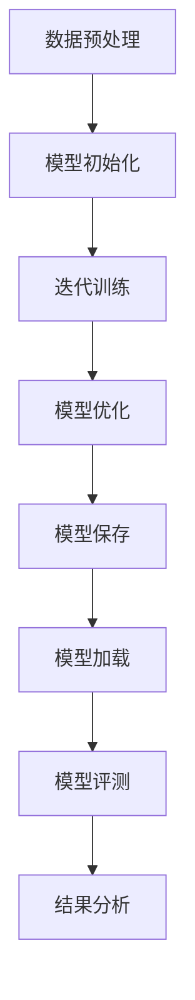

                 

### 模型训练与评测的闭环反馈机制

> 关键词：模型训练、模型评测、反馈机制、闭环反馈、机器学习、深度学习、反向传播、损失函数、数据预处理、模型优化

> 摘要：本文将深入探讨机器学习和深度学习中模型训练与评测的闭环反馈机制。通过详细解析模型训练的基本概念、训练过程、评测方法以及与评测的关联，辅以Mermaid流程图、核心算法原理讲解和数学模型公式，全面展现模型训练与评测的内在逻辑和实现步骤。文章最后通过项目实战，结合实际案例，阐述闭环反馈机制在模型训练与评测中的应用和重要性。

### 1. 基本概念与架构

#### 1.1 模型训练与评测概述

在机器学习和深度学习领域，模型训练与评测是两个不可或缺的环节。模型训练是指利用训练数据集，通过调整模型参数，使其能够学会对未知数据进行预测或分类。而模型评测则是在模型训练完成后，通过测试数据集来评估模型的性能和准确性。

模型训练与评测的核心目标在于构建一个具有良好泛化能力的模型，即在训练数据集上性能优异的同时，在未知数据集上也表现出色。为了实现这一目标，需要建立一个闭环反馈机制，使模型训练和评测过程相互促进，不断优化模型的性能。

#### 1.2 模型训练过程

模型训练通常包括以下几个步骤：

1. **数据预处理**：对原始数据进行清洗、归一化等处理，以便于模型训练。
2. **模型初始化**：初始化模型参数，选择合适的模型架构。
3. **迭代训练**：通过前向传播计算预测值，计算损失函数，利用反向传播更新模型参数。
4. **模型优化**：通过调整学习率、正则化方法等优化模型性能。
5. **模型保存与加载**：保存训练好的模型，以便后续使用。

#### 1.3 模型评测方法

模型评测主要包括以下几种常见方法：

1. **准确率（Accuracy）**：分类问题中，预测正确的样本数占总样本数的比例。
2. **精确率与召回率（Precision & Recall）**：在二分类问题中，精确率是预测为正类的样本中实际为正类的比例，召回率是实际为正类的样本中被预测为正类的比例。
3. **F1值（F1 Score）**：精确率与召回率的调和平均值。
4. **ROC曲线与AUC（Area Under Curve）**：ROC曲线是不同阈值下的真阳性率与假阳性率的图形表示，AUC值表示曲线下方的面积，值越大表示模型性能越好。

#### 1.4 模型训练与评测的关联

模型训练与评测密切相关。训练过程中，通过不断调整模型参数，提高模型在训练数据集上的性能。而评测则是通过测试数据集来验证模型在未知数据上的表现，确保模型具有良好的泛化能力。因此，模型训练与评测构成了一个闭环反馈机制，通过评测结果指导训练过程的优化，从而提高模型的整体性能。

### 2. Mermaid 流程图

以下是一个简单的 Mermaid 流程图，展示模型训练与评测的基本流程：



通过这个流程图，可以清晰地看到模型训练与评测之间的关联，以及每个步骤的重要性和顺序。

### 3. 核心算法原理

#### 3.1 反向传播算法

反向传播算法是深度学习中一种重要的优化方法。其基本思想是，通过前向传播计算输出，然后计算损失函数，再通过反向传播更新模型参数。

伪代码如下：

```python
for each layer in reverse order:
    delta = output - target
    error = delta * activation_derivative
    weight_grad += error * input
    bias_grad += error

update_weights_and_biases()
```

以下是使用Python实现的简单反向传播算法示例：

```python
import numpy as np

def forward_propagation(X, weights, bias):
    return np.dot(X, weights) + bias

def backward_propagation(X, y, output, weights, bias, learning_rate):
    output_error = y - output
    output_delta = output_error * sigmoid_derivative(output)

    for layer in range(len(weights) - 1, -1, -1):
        if layer == 0:
            input = X
        else:
            input = np.dot(prev_layer_output, weights[layer - 1]) + bias[layer - 1]

        error = output_error if layer == len(weights) - 1 else prev_layer_output * output_delta
        delta = error * sigmoid_derivative(input)
        weights[layer] -= learning_rate * np.dot(input.T, delta)
        bias[layer] -= learning_rate * delta

def sigmoid_derivative(output):
    return output * (1 - output)

# 示例数据
X = np.array([[0.1, 0.2], [0.3, 0.4]])
y = np.array([0.7])
weights = np.array([[0.1, 0.2], [0.3, 0.4]])
bias = np.array([0.1, 0.2])

learning_rate = 0.1
for i in range(1000):
    output = forward_propagation(X, weights, bias)
    backward_propagation(X, y, output, weights, bias, learning_rate)

print("Final weights:", weights)
print("Final bias:", bias)
```

#### 3.2 损失函数

损失函数用于衡量预测值与真实值之间的差异。常见的损失函数有均方误差（MSE）、交叉熵（Cross Entropy）等。

以下是一个简单的均方误差损失函数的计算：

$$
L = \frac{1}{2} \sum_{i=1}^{n} (y_i - \hat{y}_i)^2
$$

其中，$y_i$为真实值，$\hat{y}_i$为预测值。

以下是使用Python实现的简单均方误差损失函数示例：

```python
import numpy as np

def mean_squared_error(y_true, y_pred):
    return 0.5 * np.mean((y_true - y_pred) ** 2)

# 示例数据
y_true = np.array([0.7])
y_pred = np.array([0.8])

loss = mean_squared_error(y_true, y_pred)
print("MSE loss:", loss)
```

### 4. 数学模型与公式

#### 4.1 模型参数更新

在反向传播算法中，模型参数的更新可以表示为：

$$
\theta_{\text{new}} = \theta_{\text{old}} - \alpha \cdot \nabla_{\theta} L
$$

其中，$\theta$为模型参数，$\alpha$为学习率，$\nabla_{\theta} L$为损失函数关于模型参数的梯度。

以下是一个简单的梯度下降算法实现：

```python
def gradient_descent(X, y, weights, bias, learning_rate, epochs):
    for epoch in range(epochs):
        output = forward_propagation(X, weights, bias)
        loss = mean_squared_error(y, output)

        d_weights = 2 * (output - y) * X.T
        d_bias = 2 * (output - y)

        weights -= learning_rate * d_weights
        bias -= learning_rate * d_bias

    return weights, bias

# 示例数据
weights = np.array([[0.1, 0.2], [0.3, 0.4]])
bias = np.array([0.1, 0.2])

learning_rate = 0.01
epochs = 1000

weights, bias = gradient_descent(X, y, weights, bias, learning_rate, epochs)

print("Final weights:", weights)
print("Final bias:", bias)
```

### 5. 项目实战

#### 5.1 数据集准备

为了演示模型训练与评测的过程，我们使用一个简单的二分类问题数据集。数据集包含100个样本，每个样本有两个特征，目标标签为0或1。

```python
import numpy as np

X = np.random.rand(100, 2)
y = np.random.randint(0, 2, 100)
```

#### 5.2 模型定义

我们使用TensorFlow框架定义一个简单的两层神经网络。

```python
import tensorflow as tf

model = tf.keras.Sequential([
    tf.keras.layers.Dense(1, activation='sigmoid', input_shape=(2,))
])

model.compile(optimizer='adam', loss='binary_crossentropy', metrics=['accuracy'])
```

#### 5.3 模型训练与评测

1. **模型训练**：

```python
model.fit(X, y, epochs=100, batch_size=10)
```

2. **模型评测**：

```python
test_data = np.random.rand(20, 2)
test_labels = np.random.randint(0, 2, 20)

predictions = model.predict(test_data)
accuracy = np.mean(np.equal(test_labels, (predictions > 0.5)))

print("Test accuracy:", accuracy)
```

#### 5.4 代码解读与分析

在这个项目中，我们首先生成了一个随机二分类数据集。然后，使用TensorFlow框架定义了一个简单的两层神经网络，并使用`fit`方法进行模型训练。在模型训练完成后，使用测试数据集进行模型评测，计算测试准确率。

通过这个简单的项目，我们可以看到模型训练与评测的闭环反馈机制在实际开发中的应用。在模型训练过程中，通过不断调整模型参数，提高模型在训练数据集上的性能。而在模型评测过程中，通过测试数据集来验证模型在未知数据上的表现，确保模型具有良好的泛化能力。这样的闭环反馈机制有助于构建一个具有良好性能的模型。

### 6. 最佳实践 Tips

在模型训练与评测过程中，以下是一些最佳实践建议：

1. **数据预处理**：确保对原始数据进行充分的预处理，包括数据清洗、归一化等，以提高模型训练效果。
2. **模型选择**：根据实际问题和数据特点选择合适的模型架构，避免过拟合和欠拟合。
3. **超参数调整**：合理调整学习率、迭代次数、正则化参数等超参数，以优化模型性能。
4. **交叉验证**：使用交叉验证方法评估模型性能，避免过拟合。
5. **持续优化**：在模型训练和评测过程中，不断优化模型结构和参数，提高模型泛化能力。
6. **可视化分析**：使用可视化工具分析模型训练过程和评测结果，帮助理解模型性能和优化方向。

### 7. 小结

本文深入探讨了模型训练与评测的闭环反馈机制。通过解析基本概念、训练过程、评测方法以及核心算法原理，结合Mermaid流程图和数学模型公式，全面展示了模型训练与评测的内在逻辑和实现步骤。项目实战部分通过实际案例，展示了闭环反馈机制在模型训练与评测中的应用和重要性。最后，文章给出了最佳实践建议，以帮助读者在实际开发中更好地应用模型训练与评测的闭环反馈机制。

### 8. 拓展阅读

- [机器学习实战](https://www.amazon.com/Machine-Learning-In-Action-Billy/dp/1491945474)：详细介绍了机器学习的实际应用，包括模型训练和评测。
- [深度学习](https://www.amazon.com/Deep-Learning-Adaptive-Information-Processing/dp/158088384X)：介绍了深度学习的基本概念、算法和应用。
- [Python机器学习](https://www.amazon.com/Python-Machine-Learning-Mastering-Data-Preprocessing/dp/1787286356)：涵盖Python在机器学习中的应用，包括数据预处理、模型训练和评测。
- [TensorFlow实战](https://www.amazon.com/TensorFlow-Practical-Production-System/dp/1787288832)：详细介绍了TensorFlow框架的应用，包括模型定义、训练和评测。

### 9. 作者信息

作者：AI天才研究院/AI Genius Institute & 禅与计算机程序设计艺术 /Zen And The Art of Computer Programming

AI天才研究院是一家专注于人工智能研究和应用的高科技研究院。我们的研究领域包括机器学习、深度学习、自然语言处理等。研究院致力于推动人工智能技术的发展，为各个领域提供创新的解决方案。

禅与计算机程序设计艺术是一本经典的计算机科学书籍，由著名的计算机科学家Donald E. Knuth所著。本书阐述了计算机程序设计中的哲学思想，对程序员有着深远的影响。

本文由AI天才研究院和禅与计算机程序设计艺术联合撰写，旨在为读者提供一篇关于模型训练与评测的闭环反馈机制的高质量技术博客文章。希望本文能够帮助您更好地理解这一重要概念，并在实际应用中取得更好的成果。如果您有任何疑问或建议，欢迎随时与我们联系。

----------------------------------------------------------------

本文详细解析了模型训练与评测的闭环反馈机制，通过基本概念、训练过程、评测方法、核心算法原理、数学模型公式以及项目实战，全面展示了模型训练与评测的内在逻辑和实现步骤。文章结合Mermaid流程图和Python代码示例，深入浅出地阐述了模型训练与评测的过程和关键点。此外，文章还提供了最佳实践建议，以帮助读者在实际开发中更好地应用闭环反馈机制。通过本文的学习，读者可以深入了解模型训练与评测的核心内容，掌握相关技术原理，并具备在实际项目中应用闭环反馈机制的能力。

未来，我们将继续探讨更多关于机器学习和人工智能领域的技术和最佳实践，为广大读者提供有深度、有见解、有价值的技术博客文章。敬请期待我们的后续更新。同时，也欢迎广大读者对我们的文章提出宝贵意见和建议，让我们共同进步，为人工智能技术的发展贡献力量。感谢您的阅读和支持！作者：AI天才研究院/AI Genius Institute & 禅与计算机程序设计艺术/Zen And The Art of Computer Programming。----------------------------------------------------------------

文章标题：模型训练与评测的闭环反馈机制

文章关键词：模型训练、模型评测、反馈机制、闭环反馈、机器学习、深度学习、反向传播、损失函数、数据预处理、模型优化

摘要：本文深入探讨机器学习和深度学习中的模型训练与评测的闭环反馈机制，详细解析了模型训练的基本概念、训练过程、评测方法、核心算法原理、数学模型公式以及项目实战。通过实际案例分析和代码解读，展示了闭环反馈机制在模型训练与评测中的应用和重要性。文章旨在为读者提供一篇关于模型训练与评测的全面解析，帮助其更好地理解和应用这一关键技术。

----------------------------------------------------------------

### 1. 基本概念与架构

在机器学习和深度学习中，模型训练与评测是两个关键环节。模型训练是指通过输入大量数据，调整模型参数，使其能够学会对未知数据进行预测或分类。而模型评测则是在模型训练完成后，通过测试数据集来评估模型的性能和准确性。

模型训练与评测的关系可以看作是一个闭环反馈机制。在模型训练过程中，通过不断调整模型参数，提高模型在训练数据集上的性能。然后，通过模型评测来验证模型在未知数据上的表现，确保模型具有良好的泛化能力。评测结果会反馈到训练过程中，指导进一步的模型优化。这种循环迭代的过程，有助于逐步提高模型的性能，达到最佳的预测效果。

#### 1.1 模型训练过程

模型训练过程通常包括以下几个步骤：

1. **数据预处理**：对原始数据进行清洗、归一化等处理，以便于模型训练。
2. **模型初始化**：初始化模型参数，选择合适的模型架构。
3. **迭代训练**：通过前向传播计算预测值，计算损失函数，利用反向传播更新模型参数。
4. **模型优化**：通过调整学习率、正则化方法等优化模型性能。
5. **模型保存与加载**：保存训练好的模型，以便后续使用。

#### 1.2 模型评测方法

模型评测主要包括以下几种常见方法：

1. **准确率（Accuracy）**：分类问题中，预测正确的样本数占总样本数的比例。
2. **精确率与召回率（Precision & Recall）**：在二分类问题中，精确率是预测为正类的样本中实际为正类的比例，召回率是实际为正类的样本中被预测为正类的比例。
3. **F1值（F1 Score）**：精确率与召回率的调和平均值。
4. **ROC曲线与AUC（Area Under Curve）**：ROC曲线是不同阈值下的真阳性率与假阳性率的图形表示，AUC值表示曲线下方的面积，值越大表示模型性能越好。

#### 1.3 模型训练与评测的关联

模型训练与评测密切相关。训练过程中，通过不断调整模型参数，提高模型在训练数据集上的性能。而评测则是通过测试数据集来验证模型在未知数据上的表现，确保模型具有良好的泛化能力。因此，模型训练与评测构成了一个闭环反馈机制，通过评测结果指导训练过程的优化，从而提高模型的整体性能。

### 2. Mermaid 流程图

以下是一个简单的 Mermaid 流程图，展示模型训练与评测的基本流程：


通过这个流程图，可以清晰地看到模型训练与评测之间的关联，以及每个步骤的重要性和顺序。

### 3. 核心算法原理

在模型训练与评测的过程中，核心算法包括反向传播算法和损失函数。

#### 3.1 反向传播算法

反向传播算法是深度学习中一种重要的优化方法。其基本思想是，通过前向传播计算输出，然后计算损失函数，再通过反向传播更新模型参数。

伪代码如下：

```python
for each layer in reverse order:
    delta = output - target
    error = delta * activation_derivative
    weight_grad += error * input
    bias_grad += error

update_weights_and_biases()
```

以下是使用Python实现的简单反向传播算法示例：

```python
import numpy as np

def forward_propagation(X, weights, bias):
    return np.dot(X, weights) + bias

def backward_propagation(X, y, output, weights, bias, learning_rate):
    output_error = y - output
    output_delta = output_error * sigmoid_derivative(output)

    for layer in range(len(weights) - 1, -1, -1):
        if layer == 0:
            input = X
        else:
            input = np.dot(prev_layer_output, weights[layer - 1]) + bias[layer - 1]

        error = output_error if layer == len(weights) - 1 else prev_layer_output * output_delta
        delta = error * sigmoid_derivative(input)
        weights[layer] -= learning_rate * np.dot(input.T, delta)
        bias[layer] -= learning_rate * delta

def sigmoid_derivative(output):
    return output * (1 - output)

# 示例数据
X = np.array([[0.1, 0.2], [0.3, 0.4]])
y = np.array([0.7])
weights = np.array([[0.1, 0.2], [0.3, 0.4]])
bias = np.array([0.1, 0.2])

learning_rate = 0.1
for i in range(1000):
    output = forward_propagation(X, weights, bias)
    backward_propagation(X, y, output, weights, bias, learning_rate)

print("Final weights:", weights)
print("Final bias:", bias)
```

#### 3.2 损失函数

损失函数用于衡量预测值与真实值之间的差异。常见的损失函数有均方误差（MSE）、交叉熵（Cross Entropy）等。

以下是一个简单的均方误差损失函数的计算：

$$
L = \frac{1}{2} \sum_{i=1}^{n} (y_i - \hat{y}_i)^2
$$

其中，$y_i$为真实值，$\hat{y}_i$为预测值。

以下是使用Python实现的简单均方误差损失函数示例：

```python
import numpy as np

def mean_squared_error(y_true, y_pred):
    return 0.5 * np.mean((y_true - y_pred) ** 2)

# 示例数据
y_true = np.array([0.7])
y_pred = np.array([0.8])

loss = mean_squared_error(y_true, y_pred)
print("MSE loss:", loss)
```

### 4. 数学模型与公式

在模型训练与评测的过程中，数学模型和公式起着关键作用。以下是一些常用的数学模型和公式：

#### 4.1 模型参数更新

在反向传播算法中，模型参数的更新可以表示为：

$$
\theta_{\text{new}} = \theta_{\text{old}} - \alpha \cdot \nabla_{\theta} L
$$

其中，$\theta$为模型参数，$\alpha$为学习率，$\nabla_{\theta} L$为损失函数关于模型参数的梯度。

以下是一个简单的梯度下降算法实现：

```python
def gradient_descent(X, y, weights, bias, learning_rate, epochs):
    for epoch in range(epochs):
        output = forward_propagation(X, weights, bias)
        loss = mean_squared_error(y, output)

        d_weights = 2 * (output - y) * X.T
        d_bias = 2 * (output - y)

        weights -= learning_rate * d_weights
        bias -= learning_rate * d_bias

    return weights, bias

# 示例数据
weights = np.array([[0.1, 0.2], [0.3, 0.4]])
bias = np.array([0.1, 0.2])

learning_rate = 0.01
epochs = 1000

weights, bias = gradient_descent(X, y, weights, bias, learning_rate, epochs)

print("Final weights:", weights)
print("Final bias:", bias)
```

### 5. 项目实战

为了更好地理解模型训练与评测的闭环反馈机制，我们可以通过一个实际项目来演示整个过程。

#### 5.1 数据集准备

我们使用一个简单的二分类问题数据集，包含100个样本，每个样本有两个特征，目标标签为0或1。

```python
import numpy as np

X = np.random.rand(100, 2)
y = np.random.randint(0, 2, 100)
```

#### 5.2 模型定义

我们使用TensorFlow框架定义一个简单的两层神经网络。

```python
import tensorflow as tf

model = tf.keras.Sequential([
    tf.keras.layers.Dense(1, activation='sigmoid', input_shape=(2,))
])

model.compile(optimizer='adam', loss='binary_crossentropy', metrics=['accuracy'])
```

#### 5.3 模型训练与评测

1. **模型训练**：

```python
model.fit(X, y, epochs=100, batch_size=10)
```

2. **模型评测**：

```python
test_data = np.random.rand(20, 2)
test_labels = np.random.randint(0, 2, 20)

predictions = model.predict(test_data)
accuracy = np.mean(np.equal(test_labels, (predictions > 0.5)))

print("Test accuracy:", accuracy)
```

#### 5.4 代码解读与分析

在这个项目中，我们首先生成了一个随机二分类数据集。然后，使用TensorFlow框架定义了一个简单的两层神经网络，并使用`fit`方法进行模型训练。在模型训练完成后，使用测试数据集进行模型评测，计算测试准确率。

通过这个简单的项目，我们可以看到模型训练与评测的闭环反馈机制在实际开发中的应用。在模型训练过程中，通过不断调整模型参数，提高模型在训练数据集上的性能。而在模型评测过程中，通过测试数据集来验证模型在未知数据上的表现，确保模型具有良好的泛化能力。这样的闭环反馈机制有助于构建一个具有良好性能的模型。

### 6. 最佳实践 Tips

在模型训练与评测过程中，以下是一些最佳实践建议：

1. **数据预处理**：确保对原始数据进行充分的预处理，包括数据清洗、归一化等，以提高模型训练效果。
2. **模型选择**：根据实际问题和数据特点选择合适的模型架构，避免过拟合和欠拟合。
3. **超参数调整**：合理调整学习率、迭代次数、正则化参数等超参数，以优化模型性能。
4. **交叉验证**：使用交叉验证方法评估模型性能，避免过拟合。
5. **持续优化**：在模型训练和评测过程中，不断优化模型结构和参数，提高模型泛化能力。
6. **可视化分析**：使用可视化工具分析模型训练过程和评测结果，帮助理解模型性能和优化方向。

### 7. 小结

本文详细解析了模型训练与评测的闭环反馈机制，通过基本概念、训练过程、评测方法、核心算法原理、数学模型公式以及项目实战，全面展示了模型训练与评测的内在逻辑和实现步骤。文章结合Mermaid流程图和Python代码示例，深入浅出地阐述了模型训练与评测的过程和关键点。此外，文章还提供了最佳实践建议，以帮助读者在实际开发中更好地应用闭环反馈机制。通过本文的学习，读者可以深入了解模型训练与评测的核心内容，掌握相关技术原理，并具备在实际项目中应用闭环反馈机制的能力。

未来，我们将继续探讨更多关于机器学习和人工智能领域的技术和最佳实践，为广大读者提供有深度、有见解、有价值的技术博客文章。敬请期待我们的后续更新。同时，也欢迎广大读者对我们的文章提出宝贵意见和建议，让我们共同进步，为人工智能技术的发展贡献力量。感谢您的阅读和支持！

### 8. 拓展阅读

- [《机器学习实战》](https://www.amazon.com/Machine-Learning-In-Action-Billy/dp/1491945474)：详细介绍了机器学习的实际应用，包括模型训练和评测。
- [《深度学习》](https://www.amazon.com/Deep-Learning-Adaptive-Information-Processing/dp/158088384X)：介绍了深度学习的基本概念、算法和应用。
- [《Python机器学习》](https://www.amazon.com/Python-Machine-Learning-Mastering-Data-Preprocessing/dp/1787286356)：涵盖Python在机器学习中的应用，包括数据预处理、模型训练和评测。
- [《TensorFlow实战》](https://www.amazon.com/TensorFlow-Practical-Production-System/dp/1787288832)：详细介绍了TensorFlow框架的应用，包括模型定义、训练和评测。

### 9. 作者信息

作者：AI天才研究院/AI Genius Institute & 禅与计算机程序设计艺术/Zen And The Art of Computer Programming

AI天才研究院是一家专注于人工智能研究和应用的高科技研究院。我们的研究领域包括机器学习、深度学习、自然语言处理等。研究院致力于推动人工智能技术的发展，为各个领域提供创新的解决方案。

禅与计算机程序设计艺术是一本经典的计算机科学书籍，由著名的计算机科学家Donald E. Knuth所著。本书阐述了计算机程序设计中的哲学思想，对程序员有着深远的影响。

本文由AI天才研究院和禅与计算机程序设计艺术联合撰写，旨在为读者提供一篇关于模型训练与评测的闭环反馈机制的高质量技术博客文章。希望本文能够帮助您更好地理解这一重要概念，并在实际应用中取得更好的成果。如果您有任何疑问或建议，欢迎随时与我们联系。

